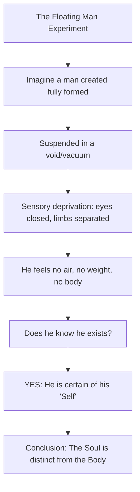

# BIO - Ibn e Sina (Avicenna): The Prince of Physicians and the Father of Modern Medicine

**The Significance of Ibn e Sina**

Ibn e Sina, known to the Latin West as **Avicenna**, stands as a titan in the history of human thought, a polymath whose influence spanned across continents and centuries. To call him merely a physician or a philosopher is to diminish the vastness of his contributions. He was the *al-Shaykh al-Ra’is* ("the Pre-eminent Master") of the Islamic Golden Age, a figure whose intellectual output bridged the ancient wisdom of Greece with the emerging scientific and philosophical frameworks of the medieval world. 

His seminal work, *al-Qanun fi al-Tibb* (The Canon of Medicine), remained the primary medical text in European and Islamic universities for over six hundred years, earning him the title "Prince of Physicians." Beyond medicine, his ontological arguments—specifically his definition of the "Necessary Existent" and the "Floating Man" thought experiment—reshaped Scholasticism and provided the logical foundations for later thinkers like Thomas Aquinas. Ibn e Sina's life was a testament to the synthesis of faith and reason, an architectural endeavor to map the entirety of existence from the mechanics of the human heart to the emanations of the Divine Mind.

- - -

## Act I: The Crucible – The Prodigy of Bukhara

### Early Life and Formative Years
Born in **980 CE** in the village of **Afshana**, near Bukhara (in modern-day Uzbekistan), Abu Ali al-Husayn ibn Abd Allah ibn Sina entered a world at the peak of the Samanid Empire’s cultural and intellectual splendor. His father, Abd Allah, was a high-ranking official and a dedicated Isma’ili scholar, which exposed the young Ibn e Sina to a home filled with rigorous debate and diverse philosophical perspectives. 

By the age of ten, Ibn e Sina had memorized the entire **Quran** and achieved a mastery of Arabic literature that astonished his tutors. His education was not confined to religious studies; he delved into Indian mathematics, arithmetic, and the burgeoning fields of logic and geometry. His father, recognizing his son’s extraordinary talent, secured the services of the philosopher Abu Abd Allah al-Natili to guide him through Porphyry's *Isagoge* and Euclid’s *Elements*.

### The Mastery of All Sciences
Ibn e Sina’s intellectual trajectory was meteoric. By the age of sixteen, he had turned his attention to medicine, a field he famously described as "not difficult," unlike mathematics or metaphysics. He began treating patients, not for financial gain, but to observe the clinical manifestations of disease, eventually developing new methods of treatment that earned him a reputation throughout the Samanid realm.

However, the greatest challenge of his youth was Aristotle’s *Metaphysics*. He recounted reading the text forty times until he had memorized the words, yet the meaning remained obscured until he stumbled upon a small commentary by **Al-Farabi** in a bookstall. This moment was his intellectual crucible—the key that unlocked the Aristotelian system and allowed him to begin his own synthesis.

### The Royal Library of the Samanids
At age seventeen, his medical prowess led to a pivotal appointment: he successfully treated the Samanid Emir, **Nuh ibn Mansur**, for a mysterious ailment that had baffled other court physicians. As a reward, Ibn e Sina requested only one thing—access to the legendary **Royal Library of the Samanids**. 

In the hushed halls of this library, Ibn e Sina spent his late teens absorbing every scroll and codex available, from ancient Greek philosophy to Persian science. By the time he was eighteen, he claimed to have mastered all the known sciences of his day, stating that while his knowledge deepened in later years, its breadth was already complete.

- - -

## Act II: The Zenith – The Architect of Knowledge

### The Peripatetic Life
Ibn e Sina’s life in his twenties and thirties was marked by both political turbulence and intense intellectual productivity. Following the collapse of the Samanid Empire, he moved through various courts in Central Asia and Iran, serving as a physician and, at times, a vizier (prime minister) to different rulers. Despite the chaos of war and political intrigue, he continued to write at a staggering pace, often dictating his works to students while on horseback or during brief periods of imprisonment.

### Al-Qanun fi al-Tibb: The Canon of Medicine
His most famous medical work, *The Canon of Medicine*, was completed during his time in Hamadan and Isfahan. This five-volume encyclopedia was a masterpiece of classification and clinical observation. 
1. **Book I**: Covered universal medical principles, anatomy, and general health.
2. **Book II**: Listed simple drugs and their properties.
3. **Book III**: Detailed diseases of specific organs (from head to toe).
4. **Book IV**: Addressed diseases affecting the body as a whole (e.g., fevers).
5. **Book V**: Provided a pharmacopeia of compound medicines.

Ibn e Sina was one of the first to recognize the **contagious nature of tuberculosis**, the spread of diseases through water and soil, and the importance of clinical trials in testing new drugs. His "Seven Rules" for drug testing remain remarkably similar to modern evidence-based medicine.

### Kitab al-Shifa: The Book of Healing
While the *Canon* healed the body, the *Book of Healing* (Kitab al-Shifa) was intended to heal the soul through knowledge. It is a massive philosophical and scientific encyclopedia covering logic, natural sciences, mathematics, and metaphysics. Here, Ibn e Sina developed his **Theory of Emanation**, blending Aristotelian logic with Neoplatonic mysticism to describe how the universe flows from the "Necessary Existent" (God).

### The Floating Man (Al-Insan al-Tayyir)
One of his most profound contributions to philosophy is the "Floating Man" thought experiment, designed to prove the existence of the soul independently of the body.

This experiment preceded Descartes’ "Cogito, ergo sum" by six centuries, establishing a primary awareness of existence that does not rely on sensory input.

- - -

## Act III: The Legacy – The Eternal Ripple

### Final Years and Death
Ibn e Sina spent his final years in **Isfahan**, serving the Kakuyid ruler Ala al-Dawla. He continued his studies in astronomy and philology until his health began to fail. He died in **1037 CE** at the age of 57 and was buried in **Hamadan**. In his final days, he reportedly freed his slaves and gave his wealth to the poor, turning his mind fully toward the Divine.

### Global Impact
The "Avicennian Synthesis" became the standard for Islamic philosophy for centuries, influencing figures like **Suhrawardi** and **Mulla Sadra**. In the West, his works were translated into Latin by the 12th century, where they became foundational for the **University of Montpellier** and the **University of Paris**. His distinction between *essence* and *existence* became a central theme in Western Scholasticism, particularly in the works of **Albertus Magnus** and **Thomas Aquinas**.

### Table of Key Achievements
| Work | Domain | Significance |
|------|--------|--------------|
| *The Canon of Medicine* | Medicine | Standard medical text for 600 years; introduced clinical trials. |
| *The Book of Healing* | Philosophy/Science | Comprehensive encyclopedia of human knowledge. |
| *The Necessary Existent* | Metaphysics | Logical proof for the existence of God. |
| *Pulse Studies* | Physiology | Identified over 50 different pulse types. |
| *Floating Man* | Epistemology | Proof of the soul's independence from matter. |

- - -

## Intellectual Lineage
- **Inspirations**: [[BIO - Al-Farabi]], [[BIO - Euclid]], [[BIO - Aristotle]]
- **Contemporaries**: [[BIO - Al-Biruni]] (with whom he famously corresponded)
- **Successors**: [[BIO - Thomas Aquinas]], [[BIO - Maimonides]], [[BIO - Al-Ghazali]]

## Related Notes
- [[HIST - Islamic Golden Age Scholars]]
- [[REAS - The Necessary Existent]]
- [[SCI - The Canon of Medicine]]

- - -
**Metadata:**
- Last Major Reorganization: 2026-02-19
- Total Notes: 1
- - -
## Structure
| Topic Area | Notes | Last Updated |
|-----------|-----------|--------------|
| Biographies | [[BIO - Ibn e Sina]] | 2026-02-19 |
- - -
*Last MOC Update: 2026-02-19 by GeminiCLI*
