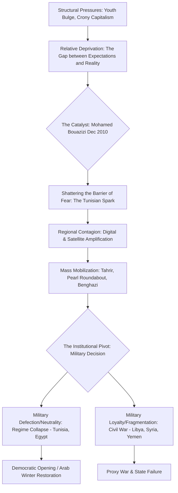

# HIST - The Arab Spring: A Comprehensive Geopolitical Analysis (2010–2012)

**Metadata:**
- **Date:** 2026-03-05
- **Domain:** #history
- **Category:** #contemporary
- **Tags:** #arab-spring #protest #geopolitics #middle-east #north-africa #ai-generated
- **Status:** #in-progress (Injection Phase)
- - -

## I. Introduction: The Geopolitical Reconfiguration of the Arab World
The phenomenon known as the "Arab Spring" represents perhaps the most significant structural rupture in the Middle East and North Africa (MENA) since the dissolution of the Ottoman Empire following World War I. It was a regional wave of pro-democracy uprisings, armed insurgencies, and systemic regime collapses that began in late 2010 and reached its peak throughout 2011 and early 2012. While initially interpreted through the lens of a "Third Wave" of democratization—comparable to the fall of the Berlin Wall in 1989—the Arab Spring quickly revealed itself to be a much more complex and violent process of state reconfiguration. The movements were not merely political; they were the culmination of a multi-decade erosion of the post-colonial social contract, exacerbated by demographic pressures, economic liberalization that prioritized crony capitalism, and a technological shift that shattered the state’s monopoly on information.

To analyze the Arab Spring is to analyze the intersection of traditional power structures—the military, the intelligence services (Mukhabarat), and tribal networks—with a new, digitally-native class of activists who utilized "Information Sovereignty" to bypass state censors. This note serves as a Master Map of Contents for the vault's contemporary history domain, providing an expansive, factual, and documentary account of the movements that forced presidents-for-life into exile, triggered NATO interventions, and ultimately birthed the resurgent authoritarianism known as the "Arab Winter." We must move beyond the reductionist view of these as "Twitter revolutions" and instead investigate the deep structural grievances—unemployment, corruption, and the loss of human dignity (Karama)—that turned a local act of desperation in a Tunisian town into a regional conflagration.

- - -

## II. The Pre-Revolutionary Context: The Era of 'Authoritarian Stability' (1980–2010)
For over three decades leading up to the 2010 spark, the Arab world was characterized by what political scientists often termed "Authoritarian Stability." This was an era dominated by a small group of "Presidents-for-Life"—Hosni Mubarak in Egypt (30 years), Zine El Abidine Ben Ali in Tunisia (23 years), Muammar Gaddafi in Libya (42 years), and the Assad dynasty in Syria (40 years). This stability was not founded on popular legitimacy or democratic mandate, but on a sophisticated, multi-layered architecture of control that permeated every aspect of Arab life. At its core was the **"Mukhabarat State"** (the Intelligence State), a system of governance where the security services were not just defenders of the state but the state themselves.

### 1. The Architecture of the Mukhabarat System
The Mukhabarat system was a legacy of the Cold War, often modeled after the pervasive internal security services of the Soviet bloc (such as the Stasi or the KGB). In countries like Egypt, the **State Security Investigations (SSI)** and the **Military Intelligence** (Mukhabarat al-Harbiya) functioned as a parallel government. These agencies operated with total impunity, utilizing a network of millions of informants—often low-level government employees, students, or neighbors—to monitor domestic dissent. This was legalized through the indefinite use of **Emergency Laws** (such as Egypt's Law 162 of 1958, enacted after the Suez Crisis), which allowed for the suspension of habeas corpus, the prohibition of public gatherings, and the detention of any individual perceived as a threat to "public order." By 2010, the Egyptian Ministry of Interior commanded a force of nearly 1.5 million personnel—including the Central Security Forces (CSF)—exceeding the size of the regular military. This security apparatus was designed to fight a "war within," viewing its own citizenry as the primary strategic threat.

### 2. The Great Decoupling: Neoliberalism and the Rise of Crony Capitalism
The economic foundations of this authoritarianism were rooted in a specific form of "Infitah" (Opening) or liberalization. During the 1950s and 60s, regimes like Nasser’s Egypt or the Ba'athists in Syria had maintained a social contract where the state provided subsidized bread, free education, and guaranteed public sector employment in exchange for political silence. However, as populations grew and oil revenues fluctuated, this model became unsustainable. Under the guidance of the IMF and World Bank in the 1990s and 2000s, regimes began to privatize state assets and deregulate markets.

Instead of creating a competitive market economy, this process led to the rise of **"Crony Capitalism."** State enterprises were sold at a fraction of their value to a narrow circle of businessmen closely tied to the ruling families. In Tunisia, the **Trabelsi and Ben Ali families** seized control of the banking, telecommunications, and real estate sectors, creating a "mafia state" that stifled local entrepreneurship. In Egypt, the network around **Gamal Mubarak** (the president’s son) and steel tycoon **Ahmed Ezz** became the public face of this perceived corruption. This economic shift created a "Great Decoupling": while GDP growth rates in Egypt and Tunisia often looked impressive in international reports (averaging 5% per year), the benefits were concentrated in the hands of a coastal and metropolitan elite, while the rural and interior populations faced rising inflation and stagnant wages.

### 3. The Demographic Youth Bulge and the Crisis of 'Waithood'
Compounding this economic inequality was a demographic shift of unprecedented scale. By 2010, the Middle East possessed the world's highest proportion of young people under the age of 30. This **"Youth Bulge"** was the result of high fertility rates in the 1980s combined with improvements in public health. While this generation was more educated than its predecessors, it faced a labor market that had no place for it. The result was a sociological state known as **"Waithood"**—a prolonged period of economic and social stagnation where young men and women were unable to find work, married late (if at all), and could not achieve the traditional markers of adulthood. This generation, digitally native and globally connected, felt a deep sense of relative deprivation, seeing the lavish lifestyles of the crony elite while they themselves struggled to afford basic staples. When global commodity prices (especially wheat) spiked in 2008 and 2010, the cost of bread—the symbolic heart of the Arab social contract—became the final pressure point.

### Table: Comparison of Pre-2011 Security Apparatuses
| Country | Primary Security Agency | Role / Specialization | Leadership / Oversight |
|---------|-------------------------|-----------------------|-----------------------|
| **Tunisia** | Ministry of Interior (Police) | Pervasive surveillance and localized suppression. | Zine El Abidine Ben Ali |
| **Egypt** | State Security Investigations (SSI) | Monitoring Islamists and civil society; extensive torture networks. | Habib el-Adly / Hosni Mubarak |
| **Libya** | Internal Security Organization (ISO) | Tribal-based intelligence; suppression of any organized dissent. | Muammar Gaddafi / Moussa Koussa |
| **Syria** | Military Intelligence / Air Force Intelligence | Deep infiltration of society; sectarian-based loyalty (Alawite-led). | Bashar al-Assad / Assef Shawkat |

- - -

## III. The Causal Flow of Regime Collapse
The transition from decades of authoritarian stability to systemic regime collapse was not a simple linear progression. It was a complex, multi-variable process involving the interplay of local grievances, regional contagion, and the decisive role of the military as an institutional actor. The collapse of the regimes in Tunisia and Egypt, followed by the descent into civil war in Libya and Syria, can be mapped as a series of cascading failures in the state's traditional mechanisms of control.

- - -

## IV. The Tunisian Spark: Sidi Bouzid and the Jasmine Revolution
The revolution in Tunisia, often referred to as the **Jasmine Revolution**, served as the regional prototype for the Arab Spring. It proved that a seemingly invincible police state could be dismantled by a leaderless, popular movement if the military refused to support the executive. The spark was the self-immolation of **Mohamed Bouazizi**, a 26-year-old fruit vendor in the interior town of **Sidi Bouzid**, on December 17, 2010. Bouazizi’s act was a response to the constant harassment and humiliation by local police—specifically the confiscation of his cart—which symbolized the state's total disregard for the dignity (Karama) of its citizens.

### 1. The Mechanics of the 28-Day Revolution
What distinguished Tunisia from previous unrest was the speed with which the protests spread from the marginalized interior to the prosperous coastal cities. The movement was facilitated by several key factors:
- **The Role of the UGTT:** The **General Labor Union (UGTT)** was the only mass organization with the institutional capacity to coordinate across the country. While its top leadership was initially cautious, its local chapters provided the organizational backbone for the protests.
- **The Digital Amplifier:** Activists used Facebook and mobile phone footage to show the brutal police response in Sidi Bouzid to the rest of the country, bypassing the state media’s attempt to characterize the protests as isolated criminal acts.
- **The Military's Institutional Pivot:** Unlike the Ministry of Interior’s police force, the Tunisian Army was a small, professional force that had been marginalized by President Zine El Abidine Ben Ali. When General **Rachid Ammar** refused the presidential order to deploy the military to fire on protesters in the capital, the regime’s power evaporated. This military neutrality was the decisive factor. On January 14, 2011, Ben Ali fled to Saudi Arabia, marking the first time in modern Arab history that a popular uprising had removed a long-standing dictator.

- - -

## V. The Egyptian Tahrir Uprising: The 'Deep State' vs. The 'Square'
The Egyptian revolution (Jan 25 – Feb 11, 2011) was the definitive event of the Arab Spring. Egypt’s size, historical leadership in the Arab world, and its strategic alliance with the United States meant that the fall of **Hosni Mubarak** would have massive regional repercussions. The uprising was not just a call for the removal of a leader, but a fundamental challenge to the **"July State"**—the military-backed regime established by Gamal Abdel Nasser in 1952.

### 1. The 18 Days: A Narrative of Regime Collapse
The movement was launched on January 25, 2011—National Police Day—as a deliberate challenge to the brutality of the security forces. What began as a series of marches by secular activists and the **April 6 Youth Movement** rapidly scaled into a mass movement. 
- **The Friday of Anger (Jan 28):** Following Friday prayers, millions of Egyptians took to the streets. The security forces, overwhelmed by the sheer scale of the crowds, were forced to retreat. In a final, desperate move, the regime executed the **"Kill Switch,"** shutting down all internet and mobile communication across the country. Far from suppressing the movement, this forced people into the streets to find information, accelerating the mobilization. 
- **The Battle of the Camels (Feb 2):** In an attempt to reclaim the narrative, pro-regime thugs—some mounted on camels and horses—attacked the protesters in Tahrir Square with swords and clubs. The ensuing 15-hour battle, broadcast live to the world by Al Jazeera and CNN, backfired on the regime, cementing the protesters' resolve and alienating Mubarak’s international supporters, including the Obama administration.
- **The Military's Move:** The **Supreme Council of the Armed Forces (SCAF)**, led by Field Marshal **Mohamed Hussein Tantawi**, eventually realized that Mubarak was no longer a viable guarantor of their own institutional interests. The military in Egypt is not just a security force; it is a corporate empire, controlling vast sectors of the national economy. To save the "Deep State," they had to sacrifice the president. On February 11, 2011, Mubarak resigned, and power was handed to the SCAF, initiating a turbulent transition that would eventually lead to the election of the Muslim Brotherhood and the subsequent restoration of military rule under Abdel Fattah el-Sisi.

- - -

## VI. The Detailed Arab Spring Timeline (2010–2012)
| Date              | Country     | Key Event                                                        | Geopolitical Significance                                     |
| ----------------- | ----------- | ---------------------------------------------------------------- | ------------------------------------------------------------- |
| **Dec 17, 2010**  | **Tunisia** | Mohamed Bouazizi sets himself on fire in Sidi Bouzid.            | The initial catalyst of the regional movement.                |
| **Jan 14, 2011**  | **Tunisia** | President Zine El Abidine Ben Ali flees to Saudi Arabia.         | First successful overthrow of an Arab autocrat.               |
| **Jan 25, 2011**  | **Egypt**   | "Day of Rage" protests begin in Tahrir Square.                   | Expansion of the movement to the Arab world's center.         |
| **Feb 11, 2011**  | **Egypt**   | Hosni Mubarak resigns; SCAF takes power.                         | Shattering of the regional pro-US autocratic status quo.      |
| **Feb 15, 2011**  | **Libya**   | Protests begin in Benghazi following the arrest of Fathi Terbil. | Start of the Libyan uprising; rapid militarization.           |
| **Feb 14, 2011**  | **Bahrain** | "Day of Rage" protests begin at Pearl Roundabout.                | Epicenter of the Shi'a-Sunni and Saudi-Iran polarization.     |
| **Mar 14, 2011**  | **Bahrain** | GCC Peninsula Shield Force (Saudi/UAE) enters Bahrain.           | First regional military intervention to suppress an uprising. |
| **Mar 15, 2011**  | **Syria**   | Pro-democracy protests erupt in Deraa after torture of teens.    | Descent of Syria into a decade-long civil war.                |
| **Mar 17, 2011**  | **Libya**   | UN Security Council passes Resolution 1973.                      | Authorization of NATO intervention in Libya.                  |
| **June 3, 2011**  | **Yemen**   | President Ali Abdullah Saleh is injured in palace bombing.       | Critical turning point in the Yemeni transition struggle.     |
| **Oct 20, 2011**  | **Libya**   | Muammar Gaddafi is captured and killed in Sirte.                 | Violent end to the 42-year Jamahiriya regime.                 |
| **Nov 23, 2011**  | **Yemen**   | Saleh signs GCC-brokered power-sharing deal in Riyadh.           | Beginning of the formal transition to the Hadi presidency.    |
| **June 17, 2012** | **Egypt**   | Mohamed Morsi (Muslim Brotherhood) wins presidential election.   | Peak of Islamist electoral success post-Arab Spring.          |
| **July 15, 2012** | **Syria**   | ICRC officially declares the Syrian conflict a civil war.        | Full transformation of the Syrian protest into regional war.  |

- - -

## VII. The Regional Domino Effect: Detailed Analysis (Libya, Syria, Yemen, Bahrain)
The "domino effect" of the Arab Spring was characterized by a rapid diversification of outcomes. While the North African states saw relatively centralized regime changes, the Mashreq and the Gulf faced more fragmented and violent struggles. This section investigates the four most significant uprisings following Egypt, each of which fundamentally reshaped the regional security architecture.

### 1. Libya: The Armed Revolution and NATO Intervention
Unlike the Tunisian or Egyptian militaries, the Libyan security apparatus under **Muammar Gaddafi** was not an institutional actor with interests separate from the executive. Instead, Gaddafi had systematically hollowed out the regular army to prevent coups, relying on elite, well-equipped security battalions (like the **Khamis Brigade**) commanded by his sons and based on tribal loyalty (primarily the Qadhadhfa). 

This meant that the uprising, which began in Benghazi on February 15, 2011, quickly militarized as the regime responded with heavy artillery and air power. The rebellion led to the formation of the **National Transitional Council (NTC)**, which positioned itself as the sole legitimate representative of the Libyan people. The international response was structure around the UN-authorized **Operation Unified Protector**, a NATO air campaign that neutralized Gaddafi’s military capabilities and allowed rebel forces to capture Tripoli in August 2011. However, the subsequent collapse of the state led to the proliferation of militias and a decade of fragmentation.

### 2. Syria: The Descent into Sectoral and Proxy War
The Syrian uprising (starting March 15, 2011, in Deraa) was perhaps the most tragic legacy of the Arab Spring. Syria’s regime, led by **Bashar al-Assad**, was built on a foundation of sectarian-based loyalty. The elite units and the intelligence services (the **Mukhabarat**) were dominated by the **Alawite** minority, who perceived the uprising as an existential threat.

The regime deliberately radicalized and sectarianized the conflict, releasing jihadists from prison while systematically crushing the peaceful secular movement. By late 2011, the conflict had transformed into a multi-sided civil war. It became the primary theater for a regional proxy war: Iran and Hezbollah provided vital military support to Assad, while Saudi Arabia, Qatar, and Turkey funded various rebel factions. The resulting humanitarian catastrophe—over 500,000 dead and 13 million displaced—fundamentally altered the demographics of the Levant and triggered the 2015 migration crisis in Europe.

### 3. Yemen: The Negotiated Crisis
Yemen’s uprising was a complex intersection of the pro-democracy youth movement, the long-standing **al-Hirak** (Southern Movement), and the northern **Houthi** insurgency. The country’s tribal architecture, dominated by the **Hashid and Bakil** federations, initially split, with key military leaders like Ali Mohsen al-Ahmar defecting to the protesters.

The crisis resulted in a unique "negotiated transition"—the **GCC Initiative**—which allowed President **Ali Abdullah Saleh** to transfer power to his vice president, **Abdrabbuh Mansur Hadi**, in exchange for immunity. This elite-level settlement failed to address the country’s deep structural problems (poverty, water scarcity, and political exclusion), eventually leading to the 2014 Houthi takeover of Sana'a and the devastating Saudi-led military intervention in 2015.

### 4. Bahrain: The Suppressed Revolution
The uprising in Bahrain (centered on the **Pearl Roundabout** in Manama) represented the most direct clash between the aspirations of the Arab Spring and the security interests of the Gulf monarchies. The movement, primarily driven by the Shi'a majority demanding political reform, was uniquely sensitive because Bahrain hosts the **US Navy's 5th Fleet**.

Fearing that a democratic Bahrain would become a proxy for Iran, Saudi Arabia and the UAE led a GCC military intervention (**Peninsula Shield Force**) in March 2011 to suppress the movement. This intervention, and the subsequent demolition of the Pearl Roundabout, was a clear signal that the status quo in the Arabian Peninsula would be defended at any cost. It reinforced the regional rivalry between the Saudi-led Sunni bloc and the Iranian-led axis, further polarizing the region along sectarian lines.

- - -

## VIII. The Role of Technology: Beyond the 'Facebook' Myth
The Arab Spring is frequently termed a "Twitter Revolution" or "Facebook Revolution," yet this terminology often obscures the deeper structural shift in **Information Sovereignty** that occurred during the 2000s. Technology did not create the grievances, but it provided the communicative infrastructure that made the "regional contagion" possible. For decades, Arab autocracies maintained power by controlling the "narrative space" through state-run television and newspapers. The emergence of **Satellite Television**, specifically **Al Jazeera**, in the late 1990s began to erode this monopoly. During the Arab Spring, Al Jazeera functioned as a "regional loudspeaker," amplifying local protests into a pan-Arab movement. However, the true disruption came from the peer-to-peer nature of the internet. Activists could document state violence using mobile phone cameras and upload footage instantly to YouTube, bypassing state censors and forcing the international community to witness the brutality of the crackdowns in real-time.

### 1. The 'Kill Switch' and Cyber-Activism
The regimes' responses to digital mobilization evolved rapidly. In Egypt, on January 28, 2011, the Mubarak regime famously executed an "internet kill switch," shutting down BGP (Border Gateway Protocol) routing to isolate the country from the global web. This backfired, as it forced people into the streets to find information, accelerating the mass mobilization. Meanwhile, international groups like **Anonymous** launched "Operation Egypt" and "Operation Tunisia," taking down government websites and providing activists with technical tools to bypass censorship, such as TOR and proxy servers. This "cyber-warfare" demonstrated that the digital front was as critical as the physical square, yet it also highlighted the vulnerability of activists to state surveillance, as regimes began using Western-made spyware (like FinFisher and Hacking Team) to track and arrest dissenters.

- - -

## IX. Geopolitical Realignment: The New Middle East Cold War
The Arab Spring fundamentally disrupted the regional balance of power, leading to what scholars term the **"New Middle East Cold War."** This was not a clash of ideologies in the traditional sense, but a fierce competition for regional influence between three main blocs. 

1. **The Counter-Revolutionary Bloc (Saudi Arabia & UAE):** Viewing the Arab Spring and the rise of political Islam as an existential threat to monarchical stability, Saudi Arabia and the UAE pivoted to a more assertive and interventionist foreign policy. They led the GCC intervention in Bahrain, supported the 2013 coup in Egypt, and funded anti-Islamist factions across the region.
2. **The Pro-Uprising/Islamist Bloc (Qatar & Turkey):** Qatar used its wealth and Al Jazeera's influence to support various pro-uprising movements, specifically those aligned with the Muslim Brotherhood. This led to a profound rift with its GCC neighbors that culminated in the 2017-2021 blockade. Turkey sought to position itself as a model for "Islamic Democracy," supporting the Morsi government in Egypt and various rebel factions in Syria.
3. **The Iranian Axis:** Iran initially hailed the Arab Spring as an "Islamic Awakening" (Sahwa), viewing the fall of pro-US autocrats in Tunisia and Egypt as a strategic gain. However, this narrative collapsed when the uprising reached Syria, Iran’s most vital strategic ally. Tehran’s decision to commit massive military and financial resources to save the Assad regime turned the Syrian conflict into a sectarian proxy war that further polarized the region along Sunni-Shi'a lines.

- - -

## X. The Arab Winter: State Collapse and the Restoration of Autocracy
By 2014, the optimism of the "Spring" had largely evaporated, replaced by a period of resurgent authoritarianism and state failure known as the **"Arab Winter."**

### 1. The Restoration of the Security State: Egypt's Post-2013 Trajectory
The most significant reversal occurred in Egypt. Following a year of polarizing rule under Mohamed Morsi, massive protests in June 2013 provided the pretext for a military coup led by General **Abdel Fattah el-Sisi**. The subsequent massacre of protesters at the **Rabaa al-Adawiya** square in August 2013 (where over 800 were killed) marked the definitive end of the democratic opening. Sisi’s regime established a security state even more pervasive and repressive than Mubarak’s, effectively restoring the military's total control over the Egyptian state and society.

### 2. The Vacuum of Power and the Rise of ISIS
The collapse of state authority in Libya and the protracted chaos in Syria created a "governance vacuum" that allowed the **Islamic State (ISIS)** to seize vast territories in 2014. The group’s declaration of a caliphate and its spectacular violence drew the international community back into a regional conflict focused on security and counter-terrorism, rather than the democratic aspirations of 2011. This "securitization" of the regional narrative allowed surviving regimes to justify domestic repression as a necessary defense against extremism.

- - -

## XI. Conclusion: The Unfinished History of the Arab Spring
The Arab Spring was not a single event that "failed," but a profound rupture in the regional order. It demonstrated that the "Authoritarian Stability" of the 20th century was a fragile illusion. While many of the original movements were crushed or co-opted, the grievances that sparked them—unemployment, corruption, and the demand for "Dignity" (Karama)—remain entirely unresolved across much of the region.

The "Second Wave" of protests in 2018-2019 (in Sudan, Algeria, Iraq, and Lebanon) showed that the legacy of 2011 continues to live in the regional political consciousness. The Arab Spring remains an unfinished history, a testament to the ongoing and turbulent search for a new social contract in the Middle East. It is a documentary record of a generation’s attempt to reclaim its agency, and its failure serves as a stark reminder of the resilience of the security structures it sought to dismantle.

- - -

**Related Notes:**
- [[HIST - The Libyan Revolution]]
- [[HIST - The Syrian Civil War]]
- [[HIST - The 2013 Egyptian Coup]]
- [[BIO - Muammar Gaddafi]]
- [[BIO - Hosni Mubarak]]
- [[BIO - Mohamed Bouazizi]]
- [[_ History - Map of Contents]]

*Last MOC Update: 2026-03-05 by GeminiCLI*
*Next Review: 2026-06-05*

- - -
