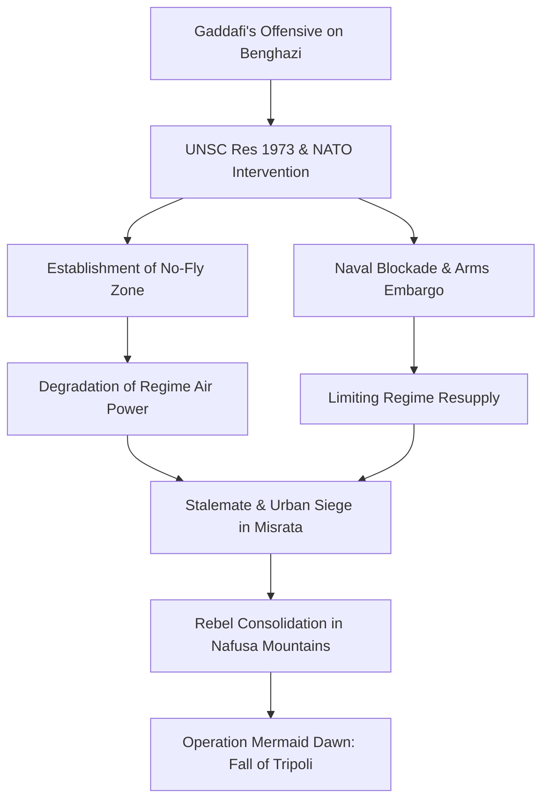

# HIST - The Libyan Revolution: The Fall of the Jamahiriya (2011)

**Metadata:**
- **Date:** 2026-03-05
- **Domain:** #history
- **Category:** #contemporary
- **Tags:** #libya #gaddafi #nato #war #geopolitics #cli
- **Status:** #in-progress (Injection Phase)
- - -

## I. Introduction: The Exceptionalism of the Libyan Uprising
The 2011 Libyan Revolution, also known as the First Libyan Civil War, was a defining moment in the history of the Arab Spring, representing the first instance where a popular pro-democracy uprising escalated into a full-scale armed conflict and prompted a direct military intervention by a Western-led coalition. Unlike the relatively swift transitions in Tunisia and Egypt, the Libyan uprising encountered a regime that was built on a unique ideological and security framework—the **Jamahiriya**—which was designed to survive internal dissent through a combination of tribal co-optation and brutal suppression. The conflict was not merely a call for reform but an existential struggle for the survival of a state that had systematically hollowed out its formal institutions for over four decades.

This note provides a granular analysis of the conflict's progression, the legal and tactical dimensions of the NATO-led intervention, and the long-term geopolitical consequences of the collapse of the Gaddafi state. The Libyan experience serves as a stark warning about the challenges of post-revolutionary state-building in an institutional vacuum. The revolution achieved its primary goal—the removal of **Muammar Gaddafi**—but at the cost of the state's total collapse, leading to a decade of fragmentation, militia rule, and regional instability.

- - -

## II. The Jamahiriya Framework: 42 Years of 'Authoritarian Exceptionalism'
To understand the extreme violence and rapid institutional collapse of 2011, one must first analyze the unique—and intentionally dysfunctional—nature of the state established by **Muammar Gaddafi** after the 1969 coup. Gaddafi’s "Third Universal Theory," outlined in his **Green Book**, ostensibly rejected both capitalism and communism in favor of a "state of the masses" (Jamahiriya). In practice, however, this was a sophisticated mechanism for personalized autocracy that systematically hollowed out every formal institution of the Libyan state to ensure that no rival power center could ever emerge.

### 1. The Institutional Vacuum and the 'Security Battalions'
Gaddafi’s most significant structural innovation was the marginalization of the regular Libyan Army. Fearing a traditional military coup—the very method by which he had seized power—he kept the regular military underfunded, poorly equipped, and fragmented along regional lines. In its place, he established elite **"Security Battalions"** (also known as the Reinforced Brigades) that were entirely separate from the military hierarchy. The most infamous was the **32nd Reinforced Brigade**, or the **Khamis Brigade**, commanded by his son Khamis Gaddafi. These units were composed of high-loyalty cadres, often drawn from Gaddafi’s own tribe (the Qadhadhfa) or allied groups like the Magarha and Warfalla. They were equipped with the regime's most advanced weaponry—T-72 tanks, Grad rocket launchers, and sophisticated communication systems—and were designed for one purpose: the internal defense of the regime against its own population.

### 2. The Role of Mercenaries and the 'Islamic Legion' Legacy
A critical component of Gaddafi's security architecture was the use of non-Libyan fighters. Building on the legacy of the **Islamic Legion** of the 1980s, the regime recruited thousands of fighters from Sub-Saharan Africa—specifically from Mali, Niger, and Chad. These "mercenaries," as they were termed by the rebels, were often granted Libyan citizenship or high salaries in exchange for their loyalty. Because they had no tribal or familial ties to the Libyan population, they were seen by Gaddafi as a more reliable tool for domestic suppression, as they were unlikely to defect or refuse orders to fire on protesters. This use of foreign fighters would later become a major point of revolutionary grievance and a catalyst for the anti-African violence that marred the post-revolutionary period.

### 3. Tribal Co-optation and the 'Social People's Leadership'
Libya is a deeply tribal society, and Gaddafi managed these identities through a complex web of patronage and "divide and rule" tactics. He created the **Social People's Leadership Committees**, which functioned as a parallel authority to the local government, allowing him to bypass technocrats and deal directly with tribal elders. By granting certain tribes (like the Qadhadhfa) control over the security services and others (like the Magarha) control over the administrative bureaucracy, he ensured that any attempt at horizontal mobilization against the regime would be hindered by vertical tribal loyalties.

- - -

## III. The Causal Mechanics of the Uprising (February 2011)
The Libyan revolution was triggered by the regional momentum of the Arab Spring, but its internal logic was driven by decades of historical grievance in **Cyrenaica** (Eastern Libya). Historically, the east had been the heart of the Senussi monarchy and the center of resistance against Italian colonialism. Under Gaddafi, the region was systematically marginalized, with investment diverted to Tripoli and the west, and its local identities suppressed in favor of the "Brotherly Leader’s" cult of personality.

### 1. The Abu Salim Legacy and the Benghazi Spark
The immediate catalyst for the uprising was the 1996 **Abu Salim Prison Massacre**, an event that functioned as the "original sin" of the Gaddafi regime for many easterners. Over 1,200 political prisoners—mostly from the east—had been summarily executed in a single day. For over a decade, the regime denied the event, but by the late 2000s, the "Families of Abu Salim" began holding weekly protests in Benghazi. The arrest of their lawyer, **Fathi Terbil**, on February 15, 2011, provided the spark. The initial protests were not a call for revolution, but a demand for justice and accountability. However, when the regime's local security committees responded by firing into the crowds, the demands rapidly escalated to the total removal of the regime.

### 2. The Siege of the Katiba (Feb 17–20, 2011)
The most critical military moment of the early revolution was the four-day battle for the **Al-Katiba al-Fadila**, the massive security compound in central Benghazi that served as the regime’s regional command center. For several days, protesters and defecting soldiers attempted to storm the compound, facing relentless fire from snipers and heavy machine guns. The stalemate was broken on February 20 when a local man, **Mahdi Ziu**, drove a car laden with gas canisters into the compound's gates, allowing the crowds to overrun the base. The fall of the Katiba marked the de facto liberation of Benghazi and the collapse of regime authority in the east.

### 3. The Formation of the NTC and the 'Benghazi List'
On February 27, 2011, the **National Transitional Council (NTC)** was established in Benghazi. While it initially sought to maintain a degree of anonymity to protect its members in regime-held areas (the "Benghazi List"), it quickly emerged as a unified political front. Led by **Mustafa Abdul Jalil** (the defected Justice Minister) and **Mahmoud Jibril** (the US-educated technocrat), the NTC focused on two strategic goals: securing international recognition and providing a legal framework for foreign military intervention. The NTC's ability to present a relatively moderate, professional face to the world was decisive in convincing the Western powers that the Libyan opposition was a viable alternative to the Gaddafi state.

### Table: Key Milestones of the Early Uprising
| Date | Location | Event | Significance |
|------|----------|-------|--------------|
| **Feb 15, 2011** | **Benghazi** | Arrest of human rights lawyer Fathi Terbil. | Immediate catalyst; sparked the first major protests. |
| **Feb 17, 2011** | **Nationwide** | "Day of Rage" called by activists. | Simultaneous protests across several eastern cities; first lethal use of force by regime. |
| **Feb 20, 2011** | **Benghazi** | Capture of the Katiba (security compound). | Rebels take control of Benghazi; first major military loss for the regime. |
| **Feb 27, 2011** | **Benghazi** | Formation of the National Transitional Council (NTC). | Creation of a unified political representative for the revolution. |
| **Mar 10, 2011** | **Benghazi** | France becomes the first state to recognize the NTC. | Critical diplomatic breakthrough for the rebel movement. |
| **Mar 12, 2011** | **Cairo** | Arab League calls for a no-fly zone. | Crucial regional legitimacy for international intervention. |
| **Mar 17, 2011** | **New York** | UN Security Council passes Resolution 1973. | Authorization of international intervention to protect civilians. |

- - -

## IV. The Escalation to War: The Rebels' Advance and Regime Counter-Offensive
By early March 2011, the conflict had transformed from a popular uprising into a conventional civil war. Initial rebel successes were driven by the defection of some regular army units and the seizing of regime arms depots. In the east, rebels advanced rapidly across the coastal highway, capturing the strategic oil ports of **Brega** and **Ras Lanuf**. However, these "technical" militias (pick-up trucks mounted with anti-aircraft guns) lacked the training and discipline of Gaddafi’s elite brigades. The rebels were a loose coalition of defected soldiers, student activists, and civilians, often operating with little central command.

### 1. The Rebel Military Architecture: Brigades and Internal Rivalries
The armed wing of the revolution was a fragmented mosaic of local brigades (katibas) with competing ideologies and regional loyalties.
- **The Cyrenaica Brigades:** Spearheaded by defected regular army units. The most prominent commander was **Abdul Fatah Younis**, Gaddafi’s former Interior Minister. His defection was viewed with suspicion by Islamist hardliners, leading to his mysterious assassination in July 2011—an event that remains a focal point of Cyrenaican grievance and a precursor to Libya’s eventual fragmentation.
- **The Nafusa Mountain Front:** Composed primarily of Amazigh (Berber) fighters, these units were isolated from the east and developed their own command structure. Supported by Western special forces, they utilized their knowledge of the mountain terrain to launch the decisive offensive on Tripoli in August.
- **The 'Technicals' and Desert Warfare:** The signature image of the Libyan war was the "technical"—Toyota Hilux pick-ups mounted with Soviet-era ZPU anti-aircraft guns or Grad rocket launchers. While highly mobile, these units were vulnerable to regime artillery. Rebel tactics centered on rapid, high-speed advances across the open desert, followed by swift retreats when encountering regime armor.

### 2. External Actors: The Regional Proxy Layer
While the 2011 conflict is often framed as a Western intervention, the role of regional Arab states was arguably more critical in the tactical victory of the NTC.
- **Qatar and the UAE:** Both states provided significant financial backing and high-end military hardware (including Milan anti-tank missiles). Qatari special forces were on the ground in the Nafusa Mountains, training rebels and coordinating air strikes. This intervention was driven by a desire to remove a regional rival and to position themselves as influential players in the "New Middle East."
- **Sudan and Jordan:** Omar al-Bashir’s Sudan provided significant shipments of small arms and ammunition to the rebels, motivated by Gaddafi’s long-standing support for Sudanese rebel groups in Darfur.

- - -

## V. The Legal and Tactical Framework of NATO Intervention
The international response was structured around the **"Responsibility to Protect" (R2P)** doctrine, resulting in **UN Security Council Resolution 1973**.

### 1. UN Resolution 1973 and Operation Unified Protector
The resolution was a milestone in international law, authorizing member states to take "all necessary measures" to protect civilians. While it explicitly forbade a "foreign occupation force," it authorized a no-fly zone and a naval blockade. The mission transitioned to NATO as **Operation Unified Protector** on March 31, 2011. NATO’s intervention was technically limited to protection, but the operational reality was a systematic campaign to degrade Gaddafi’s military capabilities.

- **Tactical Execution:** NATO's air campaign involved over 26,000 sorties. The tactical focus shifted from protecting Benghazi to a systematic "air-to-ground" integration with rebel forces. NATO air strikes functioned as a "flying artillery," clearing the path for rebel technicals to advance.
- **The Naval Blockade:** The NATO maritime task force cut off Gaddafi’s ability to import fuel and export crude oil, the lifeblood of his regime's patronage network. By mid-summer, the regime faced a terminal liquidity crisis, leading to the collapse of the "Revolutionary Committees'" ability to pay loyalist militias.

- - -

## VI. The Siege of Misrata: The Epicenter of Urban Warfare
The battle for **Misrata**, Libya’s third-largest city, was the war's most brutal chapter. As a rebel enclave surrounded by regime forces, the city was subjected to a 100-day siege.

### 1. Tactical Dynamics and the Port of Life
Gaddafi’s brigades used heavy artillery and cluster munitions to shell civilian areas. The conflict was characterized by street-by-street combat and snipers on rooftops. The port of Misrata became the city's only lifeline, through which food, medicine, and weapons were smuggled from Benghazi. The successful defense of Misrata, facilitated by sea-borne supplies and NATO air strikes on regime artillery positions, was a psychological turning point for the revolution. The Misrata brigades would later play a decisive role in the capture of Tripoli and the final battle in Sirte.

- - -

## VII. The Fall of Tripoli: Operation Mermaid Dawn (August 2011)
The fall of the Gaddafi regime began in late August 2011, following a secret coordination between internal Tripoli-based activists and external rebel groups. While the eastern front remained largely static, a decisive breakthrough occurred in the west. Rebel forces from the **Nafusa Mountains**, primarily composed of Berbers (Amazigh) and local Arab tribes, had spent months training with Western special forces and receiving covert shipments of arms. In mid-August, these forces launched a surprise offensive, capturing the strategic town of **Zawiya**, just 30 miles west of the capital. This maneuver cut off Tripoli’s main supply line to the Tunisian border, effectively placing the capital under siege.

### 1. The Uprising from Within
On August 20, 2011 (the 20th day of Ramadan), the mosques of Tripoli called for a general uprising—codenamed **Operation Mermaid Dawn**. This was a carefully timed internal rebellion designed to coincide with the approach of rebel forces from the west and south. Within days, the regime's control over the capital collapsed. Rebel fighters entered the city, meeting relatively light resistance from Gaddafi’s regular army units, many of whom simply abandoned their posts or defected. By August 23, the symbolic **Bab al-Azizia** compound, the heart of Gaddafi’s power, was overrun. The capture of the capital marked the de facto end of the regime, although Gaddafi and his inner circle managed to flee to the loyalist strongholds of Sirte and Bani Walid.

- - -

## VIII. The Final Stand in Sirte and the Death of Gaddafi
The war’s final phase was defined by the siege of **Sirte**, Gaddafi’s hometown and his last remaining stronghold. The battle for Sirte was a devastating demonstration of the regime’s refusal to surrender, even as the National Transitional Council (NTC) was recognized internationally as the new government of Libya. The city was surrounded by NTC forces from Misrata and the east, while NATO aircraft conducted systematic strikes on the remaining loyalist positions.

### 1. The Capture and Death of Muammar Gaddafi (October 20, 2011)
On October 20, 2011, a convoy attempting to flee the city of Sirte was struck by NATO aircraft. Muammar Gaddafi, wounded and hiding in a drainage pipe, was captured by NTC fighters from Misrata. The footage of his subsequent abuse and summary execution circulated globally, marking a violent and chaotic end to his 42-year reign. While his death was celebrated by many as the definitive end of the revolution, it also represented a failure of the new authorities to ensure a legal transition. On October 23, 2011, the NTC officially declared the **Liberation of Libya**, ending the eight-month civil war. However, the violent manner of Gaddafi's death foreshadowed the lawlessness and militia rule that would soon dominate the country.

### Table: Final Campaigns of the Revolution
| Phase | Focus Area | Key Actors | Outcome |
|-------|------------|------------|---------|
| **August 2011** | Tripoli | Nafusa Rebels, NATO, Internal Activists | Capture of the capital; collapse of central regime control. |
| **Sept-Oct 2011** | Bani Walid | Warfalla Tribes, NTC Forces | Surrender of the loyalist mountain stronghold. |
| **Oct 2011** | Sirte | Misrata Brigades, NATO | Final defeat of pro-Gaddafi forces; death of the leader. |
| **Oct 23, 2011** | Benghazi | NTC Leadership | Declaration of Liberation; end of the civil war. |

- - -

## IX. Post-Revolutionary Fragmentation: The Failure of State-Building
The primary tragedy of the 2011 Libyan Revolution was the "day after." The total and sudden collapse of the Gaddafi state left a governance vacuum that the National Transitional Council (NTC) was structurally and politically unable to fill. Because Gaddafi had spent 42 years systematically preventing the development of independent institutions—judiciary, professional police, or a unified national army—there was no administrative framework to take over when the regime fell. Power did not transfer to a new central authority; instead, it fragmented into thousands of local "fiefdoms."

### 1. The Proliferation of Militias and the 'Hybrid' Security State
During the eight months of conflict, tens of thousands of young men had been armed. These groups, often organized by city (e.g., Misrata, Zintan) or tribe, refused to disarm or integrate into a national army following the liberation. Instead, they demanded a share of the state's oil wealth and political influence as a reward for their "revolutionary legitimacy." The failure of the NTC, and the subsequent General National Congress (GNC), to establish a monopoly on the use of force led to a "hybrid" security state where the central government was forced to pay the salaries of the very militias that undermined its authority. This lawlessness eventually led to the emergence of two rival governments in 2014, drawing Libya into a second decade of civil war.

### 2. The Law of Political Isolation and the 2012 Transition
The immediate post-Gaddafi period was marked by an attempt to build a democratic state in an institutional vacuum. The July 2012 elections for the GNC were initially seen as a success, with a high turnout and a victory for secular-leaning coalitions. However, the transition was derailed by the **Law of Political Isolation**, pushed by revolutionary hardliners and backed by armed militias. This law banned anyone who had held a senior position under Gaddafi from public office for ten years, effectively gutting the state’s remaining administrative capacity and removing the technocrats needed to manage the transition.

### 3. The 2012 Benghazi Attack and the Loss of International Support
On September 11, 2012, the US consulate in Benghazi was attacked by the jihadist group **Ansar al-Sharia**, resulting in the death of US Ambassador **Christopher Stevens**. This event shattered the international community's optimism about the Libyan transition and led to a rapid withdrawal of Western diplomatic and security support. The "Benghazi moment" signaled that the revolution had been hijacked by extremist elements, leaving the country to the mercy of competing militias and regional proxies.

- - -

## X. Geopolitical Fallout: Regional and Global Consequences
The collapse of the Libyan state had profound consequences that resonated far beyond its borders, fundamentally altering the security landscape of North Africa and the Mediterranean.

1. **The Sahelian Crisis and the Arsenal Proliferation:** Gaddafi had utilized thousands of Tuareg mercenaries from across the Sahel. Following his fall, these fighters returned to their home countries—specifically **Mali**—with vast quantities of looted weaponry from Libyan arsenals, including man-portable air-defense systems (MANPADS). This triggered the 2012 Tuareg rebellion in northern Mali and fueled insurgencies across the Lake Chad Basin, altering the security landscape of the entire continent.
2. **The Mediterranean Migration Hub:** Under Gaddafi, Libya had functioned as a "gatekeeper" for migration. The collapse of Libyan border security transformed the country into the world's primary hub for human smuggling and trafficking. This triggered the 2015 European Migration Crisis, fueling the rise of right-wing populism and straining the internal cohesion of the European Union.
3. **The Global 'R2P' Veto:** The perceived "regime change" outcome of the NATO-led intervention in Libya created a deep sense of distrust among Russia and China. This "Libya precedent" ensured that any similar international action in Syria would be blocked, contributing to the international paralysis that allowed the Syrian conflict to devolve into a catastrophic humanitarian collapse.

- - -

## XI. Conclusion: The Paradox of Liberation
The 2011 Libyan Revolution remains a profound paradox of the Arab Spring. It achieved the primary, and seemingly impossible, goal of removing one of the world's longest-serving autocrats. Yet, it failed to deliver the stability, democracy, or "Dignity" that the original protesters in Benghazi had demanded. The "state of the masses" (Jamahiriya) was not replaced by a constitutional democracy, but by a **"state of the militias."**

The Libyan experience illustrates the immense difficulty of building a democratic order in the total absence of pre-existing institutions. It demonstrates that the removal of a dictator is only the first, and perhaps the easiest, step in a revolutionary process. Without a consensus on the nature of the state and a unified security apparatus, liberation can quickly devolve into fragmentation. Libya today remains a documentary record of a generation’s attempt to reclaim its agency, and its ongoing struggle serves as a stark reminder of the resilience of tribal and regional identities in the face of state collapse.

- - -

- - -

## XII. Extended Socio-Economic and Institutional Analysis
The 2011 Revolution was not merely a military and political event; it was a systemic shock to one of the world's most unique and opaque economic structures. To fully grasp the depth of the Libyan collapse, one must analyze the disintegration of the state’s financial and infrastructural pillars, which had functioned as the "glue" of the Jamahiriya for decades.

### 1. The Financial Ghost State: The Libyan Investment Authority (LIA)
One of the most complex legacies of the Gaddafi era was the **Libyan Investment Authority (LIA)**, a sovereign wealth fund established in 2006 to manage the country's massive oil surpluses. By 2011, the LIA held approximately $67 billion in assets, distributed across global equity markets, real estate, and banking sectors in Europe, Africa, and North America. Following the passage of UN Resolution 1970 and 1973, these assets were "frozen" to prevent the regime from using them to fund its military campaign. 

However, the post-revolutionary period transformed these frozen billions into a source of intense institutional conflict. The lack of a unified central government in Libya led to competing claims over the management of the LIA, with rival boards in Tripoli and Tobruk struggling for control. This "financial ghost state" meant that while Libya was nominally wealthy, its primary capital reserves remained inaccessible, preventing the necessary investment in reconstruction and public services. The long-term freezing of these assets also led to significant value erosion due to mismanagement and the inability to respond to market shifts, illustrating how the revolution paralyzed the country's financial future even as it liberated its political present.

### 2. The Hydrocarbon Lifeline: Eni, Greenstream, and European Energy Security
Libya’s revolution had an immediate and profound impact on European energy security, specifically for **Italy**. Libya was the third-largest producer in Africa and held the continent’s largest proven oil reserves. The **Greenstream pipeline**, which connects western Libya directly to Sicily, provided nearly 10% of Italy's natural gas. The Italian energy giant **Eni** had been the most significant foreign actor in the Libyan hydrocarbon sector since the 1950s, building a symbiotic relationship with the Gaddafi regime that was shattered by the uprising.

The 2011 conflict led to a total cessation of oil exports for several months, causing global price spikes and forcing European nations to scramble for alternative supplies. The "energy paradox" of the revolution was that while the NTC required oil revenues to function, the infrastructure (pipelines, refineries, and terminals) became a primary target for both regime sabotage and militia control. The post-2011 era saw the emergence of "oil blockades" as a standard political tool, where local tribes or militias would shut down production to extort concessions from the central government. This fundamentally destabilized the **National Oil Corporation (NOC)**, which had historically been the only institution in Libya to maintain a degree of technocratic independence.

### 3. The Collapse of the Great Man-Made River (GMMR)
While oil was the country's wealth, water was its survival. Gaddafi’s most ambitious infrastructural project was the **Great Man-Made River (GMMR)**, a vast network of underground pipes that transported fossil water from the Nubian Sandstone Aquifer in the Sahara to the coastal cities. By 2011, the GMMR provided over 70% of the water used for agriculture and human consumption in Libya. 

The revolution and the subsequent state failure led to the systemic degradation of this "eighth wonder of the world." The lack of central authority meant that maintenance was neglected, and the electricity grid—necessary to power the massive pumps—frequently collapsed. More critically, the GMMR became a strategic vulnerability; militias would frequently hijack the water supply to blackmail the capital, turning a humanitarian necessity into a weapon of war. The collapse of the GMMR’s institutional integrity represents one of the most significant, yet under-reported, humanitarian disasters of the post-revolutionary period, threatening the very habitability of the Libyan coastline.

### 4. The Sociological Impact: The 'Gaddafi Generation' and the Crisis of Identity
Finally, the revolution triggered a profound identity crisis within the Libyan populace. For 42 years, the state had been synonymous with the person of Muammar Gaddafi. The education system, the media, and even the calendar were built around his personal ideology. The sudden removal of this central pillar left a sociological vacuum. 

The "Gaddafi Generation"—those born and raised entirely under the Jamahiriya—found themselves in a world without the only social and political markers they had ever known. The failure of the 2012 democratic experiment to provide a new, unifying national narrative allowed older tribal, regional, and sectarian identities to re-emerge with a vengeance. The transition from a "state of the masses" to a "state of the individual" proved impossible without the intermediate step of a "state of the citizen." This psychological displacement remains one of the primary drivers of the ongoing instability, as various factions struggle to define what it means to be "Libyan" in the absence of a dictator.

- - -

**Related Notes:**
- [[HIST - The Arab Spring]]
- [[BIO - Muammar Gaddafi]]
- [[HIST - The Second Libyan Civil War]]
- [[_ History - Map of Contents]]

*Last MOC Update: 2026-03-05 by GeminiCLI*
*Next Review: 2026-06-05*
