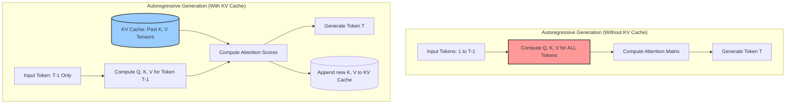
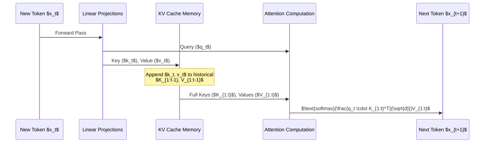
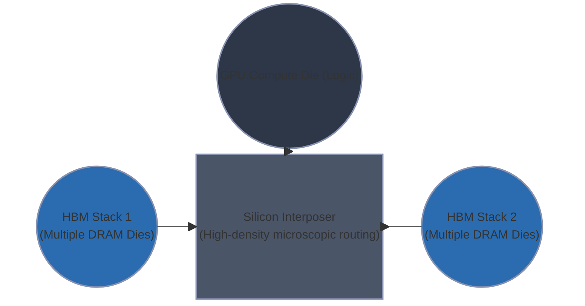
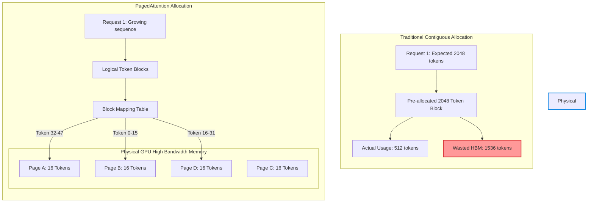
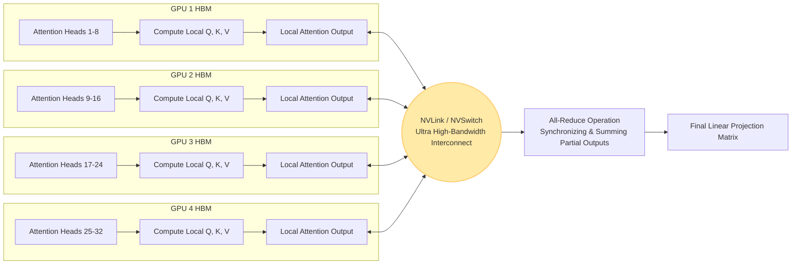
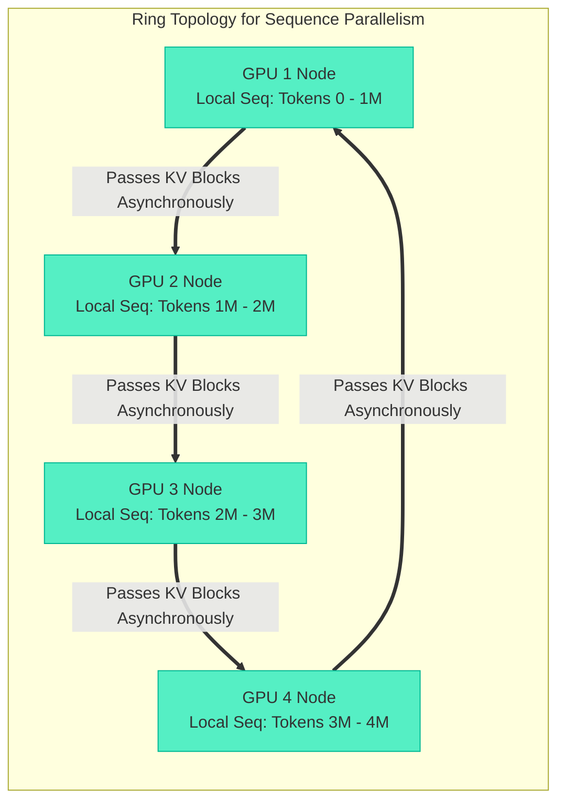
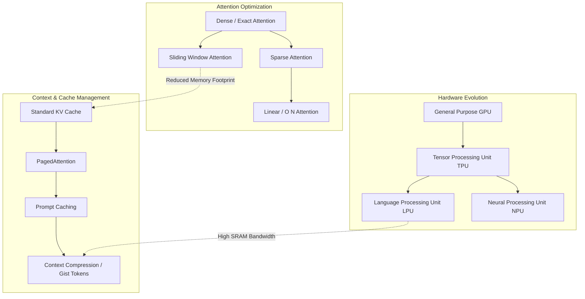

# KV Caches and AI Hardware Architecture


- - -

>[!abstract] # Table of Contents
>- [[#Introduction to KV Caches and AI Hardware Architecture]]
	- [[#The Anatomy of the KV Cache]]
	- [[#Memory Bandwidth vs Compute Bound Operations]]
	- [[#Scaling Challenges: Multi-GPU and PagedAttention]]
	- [[#Future Architectures and Optimization Techniques]]


- - -

## Introduction to KV Caches and AI Hardware Architecture



| Bottleneck Classification | Description | Primary Hardware Limitation | LLM Phase Example | Architectural Mitigation |
| :--- | :--- | :--- | :--- | :--- |
| **Compute-Bound** | Execution time is determined by the raw speed of mathematical operations. Data is available faster than it can be processed. | Arithmetic Logic Units (ALUs), Tensor Cores, Clock Speed. | **Prefill Phase** (Prompt Processing), Training. | Adding more Tensor Cores, Matrix sparsity, lower precision (FP8/INT8). |
| **Memory-Bandwidth-Bound** | Execution time is determined by the speed at which data travels from memory to compute units. Compute units sit idle waiting for data. | High Bandwidth Memory ([[HBM]]) speed (GB/s), Bus Width, [[SRAM]] latency. | **Decode Phase** (Token Generation), [[KV Cache]] retrieval. | Faster memory (HBM3e), larger on-chip [[SRAM]], Multi-Query Attention (MQA). |
| **Memory-Capacity-Bound** | The total size of the model and intermediate states exceeds the available physical memory on the accelerator. | Total VRAM capacity (e.g., 80GB on A100). | Large context windows, massive batch sizes. | Multi-[[GPU]] parallelism (Tensor/Pipeline Parallelism), Quantization. |

```python
import numpy as np

def generate_token_naive(prompt_tokens, weights):
    """
    Naive approach: Recomputes everything for the entire sequence.
    Time Complexity per token: O(N^2) where N is sequence length.
    Compute-heavy, but incredibly inefficient.
    """
    # Q, K, V must be recomputed for all tokens from 0 to N
    Q = np.dot(prompt_tokens, weights['W_q'])
    K = np.dot(prompt_tokens, weights['W_k'])
    V = np.dot(prompt_tokens, weights['W_v'])
    
    attention_scores = np.dot(Q, K.T) / np.sqrt(Q.shape[-1])
    attention_weights = softmax(attention_scores)
    
    return np.dot(attention_weights, V)[-1] # Return the last generated token

class KVCacheAccelerator:
    def __init__(self):
        # The KV Cache resides in the GPU's High Bandwidth Memory (HBM)
        self.cached_keys = []
        self.cached_values = []

    def generate_token_optimized(self, newest_token, weights):
        """
        Optimized approach: Only computes Q, K, V for the newest token.
        Time Complexity per token: O(N).
        Memory-heavy, bound by the speed of loading the cache.
        """
        # Compute Q, K, V ONLY for the single new token
        q_new = np.dot(newest_token, weights['W_q'])
        k_new = np.dot(newest_token, weights['W_k'])
        v_new = np.dot(newest_token, weights['W_v'])
        
        # Append to the ever-growing KV Cache
        self.cached_keys.append(k_new)
        self.cached_values.append(v_new)
        
        # Load the ENTIRE cache from HBM to SRAM for attention calculation
        K_past = np.concatenate(self.cached_keys, axis=0)
        V_past = np.concatenate(self.cached_values, axis=0)
        
        # Matrix-Vector multiplication (Memory Bandwidth Bound)
        attention_scores = np.dot(q_new, K_past.T) / np.sqrt(q_new.shape[-1])
        attention_weights = softmax(attention_scores)
        
        return np.dot(attention_weights, V_past)
```

The fundamental mechanics of modern [[Large Language Models (LLM)]], which are predominantly based on the decoder-only [[Transformer]] architecture, dictate a strict autoregressive generation process. This means that text is generated sequentially, one token at a time, with each new token heavily dependent on the mathematical context of all previously generated tokens. While this architecture has unlocked unprecedented capabilities in artificial intelligence, it introduces severe computational and hardware-level challenges that dictate the very design of modern AI accelerators like [[GPU]]s and TPUs.

To understand these challenges, we must first dissect the two distinct phases of [[LLM]] inference: the **Prefill Phase** and the **Decode Phase**. During the prefill phase, the model ingests the user's prompt. Because the entire prompt is available simultaneously, the computation can be highly parallelized. The operations performed here are massive Matrix-Matrix multiplications (GEMMs - General Matrix Multiplications). In hardware terms, GEMMs possess high **Arithmetic Intensity**, meaning that for every byte of data loaded from the [[GPU]]'s High Bandwidth Memory ([[HBM]]) into its compute cores ([[SRAM]]/Registers), a tremendously large number of floating-point operations (FLOPs) are performed. Thus, the prefill phase is typically **compute-bound**. The speed of processing the prompt is largely dictated by how many Tensor Cores the [[GPU]] possesses and how fast their internal clocks run.

However, the paradigm shifts violently during the decode phase. In this phase, the model generates the response token by token. To generate token $T$, the model must calculate the attention scores between the Query ($Q$) vector of token $T$ and the Key ($K$) and Value ($V$) vectors of all preceding tokens from $1$ to $T-1$. If we were to naively implement this logic without memory optimization, we would pass the entire sequence $1 \dots T$ through the enormous parameter layers of the neural network just to predict token $T+1$. As the sequence grows, the computational complexity explodes quadratically to $O(N^2)$ for each generation step, leading to an overall complexity of $O(N^3)$ for generating the full sequence. In a production environment serving billions of tokens, this naive approach is computationally suicidal.

The elegant mathematical mitigation to this is the [[KV Cache]] (Key-Value Cache). Because the Keys and Values of past tokens do not change as new tokens are generated, we can compute them once and store them in memory. When generating token $T$, we only need to compute $Q_T$, $K_T$, and $V_T$ for that single specific token. We then append the new $K_T$ and $V_T$ to our existing cache, and calculate attention by taking the dot product of the single $Q_T$ vector against the entire cached matrix of past Keys. This transforms the attention mechanism from an intense Matrix-Matrix multiplication into a Matrix-Vector multiplication (GEMV), effectively reducing the computational complexity of generating a new token from $O(N^2)$ to $O(N)$.

Yet, this mathematical triumph introduces a severe hardware bottleneck. By storing the Keys and Values for every token, across every attention head, for every layer of the network, the [[KV Cache]] grows to an astronomical size. For a standard 70-billion parameter model serving a batch of concurrent users with long contexts, the [[KV Cache]] can easily consume tens to hundreds of gigabytes of memory, far exceeding the size of the model's weights themselves.

This brings us to the crux of AI hardware architecture and the modern von Neumann bottleneck. The [[KV Cache]] is far too large to store locally, and thus must reside in the accelerator's main memory (the [[HBM]]). However, the actual mathematical computation of attention scores happens inside the compute units, which rely on extremely fast, but extremely small, localized memory ([[SRAM]] or L1/L2 caches). During the decode phase, to generate a single token, the *entire* set of model weights and the *entire* [[KV Cache]] for that specific sequence must be streamed from the [[HBM]] into the [[SRAM]], multiplied by the single $Q_T$ vector, and then flushed out. 

Because we are multiplying a massive, gigabyte-scale matrix by a single, tiny vector, the Arithmetic Intensity collapses. For every byte of data we painstakingly move across the silicon, we perform perhaps only one or two mathematical operations. The Tensor Cores finish their calculations in fractions of a nanosecond and then sit completely idle, waiting for the memory bus to fetch the next chunk of the [[KV Cache]]. This state is defined as being **memory-bandwidth bound**. The speed at which an [[LLM]] types out text on your screen is not limited by how fast the [[GPU]] can "think" (compute), but strictly by how fast it can "read" (memory bandwidth).

To truly appreciate these constraints, we must visualize the memory hierarchy of an AI accelerator. At the bottom lies the High Bandwidth Memory ([[HBM]]), which is capacious (typically 80GB to 192GB) and relatively fast (up to 5 TB/s), but suffers from high latency compared to on-chip memory. Above the [[HBM]] is the L2 Cache, a global [[SRAM]] pool shared across the [[GPU]], which is much faster but limited to around 50MB. Finally, at the top, we have the L1 Cache and registers located directly inside the Streaming Multiprocessors (SMs), where the actual Tensor Cores reside. 

When generating a token, the [[GPU]] must issue a memory read request to pull the massive [[KV Cache]] block from [[HBM]] into the L2 Cache, and subsequently into the L1 Cache, before the Tensor Cores can execute the calculation. Because the cache grows dynamically with every generated token, managing this memory allocation becomes a logistical nightmare. In naive implementations, memory for the [[KV Cache]] is pre-allocated contiguously based on the maximum possible sequence length. This leads to horrific memory fragmentation and waste; a user generating a 100-token response would tie up the memory reserved for 8,000 tokens, blocking other users from utilizing the [[GPU]]. 

This software-hardware friction birthed innovations like [[PagedAttention]], inspired by virtual memory management in traditional operating systems. [[PagedAttention]] divides the [[KV Cache]] into non-contiguous blocks or "pages," allocating them on demand as the sequence grows. This eliminates internal fragmentation and allows the hardware to maximize its batch size—the number of concurrent users it can serve. By increasing the batch size, the system can amortize the cost of loading the model weights; it loads the weights once from [[HBM]] into [[SRAM]] and uses them to compute the forward pass for multiple users simultaneously, thereby slightly increasing the arithmetic intensity and clawing back efficiency from the memory bottleneck. 

This stark reality has driven a relentless evolution in silicon engineering. Traditional DDR memory, used in consumer electronics, is vastly insufficient. Modern accelerators utilize [[HBM]], which achieves its colossal bandwidth by stacking memory dies directly on top of each other and connecting them to the compute die via a silicon interposer with thousands of microscopic TSVs (Through-Silicon Vias). While HBM2e provided bandwidths around 1.5 to 2.0 Terabytes per second (TB/s), the insatiable hunger of the [[KV Cache]] has forced the industry to rapidly develop HBM3 (e.g., 3.3 TB/s on the H100) and HBM3e (e.g., 4.8 TB/s on the H200). 

Furthermore, because moving data costs significantly more energy than computing it (fetching a value from [[HBM]] can cost orders of magnitude more picojoules than performing a floating-point multiplication), the memory bandwidth bottleneck is simultaneously a power bottleneck. If an architecture cannot feed the compute units efficiently, it wastes massive amounts of electricity simply keeping the silicon powered on while it waits for data. 

To mitigate this at the architectural level, researchers developed techniques specifically to shrink the [[KV Cache]] footprint. Multi-Query Attention (MQA) and Grouped-Query Attention (GQA) depart from standard Multi-Head Attention by forcing multiple Query heads to share a single Key and Value head. This drastically reduces the size of the [[KV Cache]] that must be stored and subsequently streamed across the memory bus during decode, trading a minuscule fraction of model accuracy for a massive increase in inference speed and batch size capacity. 

In conclusion, understanding the [[KV Cache]] is the absolute foundation to understanding the economics and engineering of modern artificial intelligence. The transition from the compute-bound prefill phase to the memory-bandwidth-bound decode phase dictates how models are served in production. It explains why inference providers obsess over batching algorithms, quantization, and specialized memory hardware. The future of AI scaling is not merely a question of building faster calculators, but of solving the fundamental physics of moving terabytes of cached context across silicon millimeters in fractions of a second.

- - -

## The Anatomy of the KV Cache

In the architecture of modern [[Large Language Models (LLM)]], the self-attention mechanism serves as the foundational computational engine, allowing the model to dynamically synthesize context, map long-range dependencies, and generate highly coherent text. However, this powerful engine is exceptionally resource-intensive, particularly during the auto-regressive decoding phase where tokens are generated sequentially, one by one. The Key-Value ([[KV Cache]]) Cache emerges as the critical algorithmic optimization that prevents catastrophic computational collapse during this generative phase. 

By observing the empirical flow of data within a [[Transformer]] block, we can see that for any newly generated token, the historical context—the sequence of tokens that came before it—remains perfectly static. Re-computing the dense matrix projections for these historical tokens at every single generation step introduces a profound and unsustainable redundancy. The [[KV Cache]] resolves this by persistently storing the computed Key ($K$) and Value ($V$) tensors for all prior tokens. By doing so, it effectively reduces the time complexity of the attention operation from $O(N^2)$ to $O(N)$ for each newly generated token, exchanging a massive computational burden for a heavy memory footprint.

### The Mechanism of Context Retention

To accurately visualize this mechanism, we must trace the flow of tensors during the generation cycle. When a new token is processed, it is projected into three distinct vectors: a Query ($Q$), a Key ($K$), and a Value ($V$). Instead of executing these projections for all past tokens over and over again, the model retrieves the previously cached $K$ and $V$ tensors from its memory banks. It then appends the new $K$ and $V$ vectors to this growing cache, and computes the attention scores solely using the newly generated $Q$ vector against the entire augmented $K$ cache.



This visualization highlights a fundamental asymmetry in auto-regressive generation: while the Query is always a single vector (with a dimension of $1 \times d$), the Keys and Values grow linearly with the sequence length (reaching dimensions of $t \times d$). This continually expanding state is what we term the "context window" in practical engineering terms.

The logic can be rigorously represented through the following PyTorch pseudo-code. This demonstrates how the cache is explicitly managed and updated during the forward pass of an attention layer:

```python
import torch
import torch.nn.functional as F

def autoregressive_attention(q_new, k_new, v_new, kv_cache=None):
    """
    Computes attention for a single new token using explicit KV caching.
    q_new, k_new, v_new: Tensors representing the current token, shape (batch, 1, num_heads, head_dim)
    """
    if kv_cache is not None:
        k_cache, v_cache = kv_cache
        # Concatenate the new K, V vectors with the historical cache along the sequence dimension
        K = torch.cat([k_cache, k_new], dim=1)
        V = torch.cat([v_cache, v_new], dim=1)
    else:
        # Processing the very first token (the prompt encoding phase)
        K, V = k_new, v_new
        
    # Update and persist the cache for the subsequent generation step
    updated_kv_cache = (K, V)
    
    # Compute attention scores using scaled dot-product
    # q_new: (b, 1, h, d) -> K^T: (b, h, d, t) -> scores: (b, h, 1, t)
    d_k = q_new.size(-1)
    scores = torch.matmul(q_new.transpose(1, 2), K.transpose(1, 2).transpose(-2, -1)) / (d_k ** 0.5)
    attention_weights = F.softmax(scores, dim=-1)
    
    # Compute final context-aware output vector
    # weights: (b, h, 1, t) -> V: (b, h, t, d) -> output: (b, h, 1, d)
    output = torch.matmul(attention_weights, V.transpose(1, 2))
    
    return output.transpose(1, 2), updated_kv_cache
```

### Memory Footprint of the Expanding Context

While the [[KV Cache]] elegantly solves the computation bottleneck, it inevitably introduces a severe memory bottleneck. The multidimensional tensors stored in the cache require dedicated VRAM (Video RAM) on the [[GPU]]. As the sequence length ($s$) grows, the memory required scales strictly linearly, but the constant factors multiplier derived from the model's architecture is enormous.

The exact memory footprint in bytes can be calculated using the following deterministic formula:

$$ \text{Memory (bytes)} = 2 \times b \times s \times L \times n \times d \times p $$

Where the variables are defined structurally as:
- $2$: Accounts for storing both the Key and Value tensors.
- $b$: Batch size (the number of concurrent user sequences being processed).
- $s$: Sequence length (the number of tokens present in the current context).
- $L$: Number of transformer layers or blocks within the model.
- $n$: Number of distinct attention heads per layer.
- $d$: Dimension of each individual attention head.
- $p$: Precision (bytes required per parameter, e.g., 2 bytes for FP16).

Let us apply this mathematical formula to a standard 7-Billion parameter open-weight model (such as LLaMA-2 7B) operating at FP16 precision ($p=2$ bytes). The baseline architectural parameters for this model are defined as: $L = 32$, $n = 32$, and $d = 128$. 

For a single sequence ($b=1$) and a context length of a single token ($s=1$), the cache requires:
$2 \times 1 \times 1 \times 32 \times 32 \times 128 \times 2 = 524,288 \text{ bytes (0.5 MB)}$

While 0.5 MB per token may seem mathematically trivial at first glance, observe the exponential explosion as the sequence length approaches the theoretical limits of modern extended-context models.

| Sequence Length ($s$) | Batch Size | Precision | Total [[KV Cache]] Size (LLaMA 7B) |
| :--- | :--- | :--- | :--- |
| 1,024 (Short prompt) | 1 | FP16 (2 bytes) | 0.5 GB |
| 4,096 (Standard doc) | 1 | FP16 (2 bytes) | 2.1 GB |
| 32,768 (Long context) | 1 | FP16 (2 bytes) | 17.1 GB |
| 32,768 (Long context) | 16 (Batched) | FP16 (2 bytes) | 274.8 GB |

As the empirical data in the table vividly demonstrates, processing a 32K context window for a single user requires 17.1 GB of VRAM strictly allocated for the [[KV Cache]]. This exceeds the memory required to hold the entire 7B model weights themselves (~14 GB in FP16). When an enterprise API attempts to serve multiple users concurrently (batching $b=16$), the memory requirements geometrically scale to 274.8 GB, rapidly exceeding the capacity of even the most advanced multi-[[GPU]] server nodes (such as an 8x 80GB A100 cluster), leading to catastrophic out-of-memory (OOM) failures. 

### Precision Degradation and Quantization Strategies

To actively combat this massive memory footprint, systems engineers must employ quantization—the systematic reduction of mathematical precision for the stored tensors. By default, models operate in 16-bit floating-point (FP16 or BF16). However, similar to biological neural networks, empirical research demonstrates that [[Transformer]] models do not require flawless, lossless precision in their historical context to maintain semantic coherence.

By projecting the continuous 16-bit continuous values into discrete lower-precision buckets, we can significantly compress the memory requirements.

**8-bit Integer Quantization (INT8):**
INT8 quantization maps the FP16 values into 256 discrete computational levels. This reduces the parameter size from 2 bytes to exactly 1 byte ($p=1$).
- **Memory Reduction:** Achieves a 50% reduction in the total [[KV Cache]] footprint.
- **Computational Overhead:** Requires dynamic de-quantization during the attention matrix multiplication, introducing a slight, manageable latency penalty.
- **Quality Impact:** Generally considered near-lossless. The degradation in measured perplexity is mathematically visible but practically invisible in the generated textual outputs.

**4-bit Integer Quantization (INT4):**
INT4 quantization aggressively maps values into just 16 discrete levels, reducing the parameter size to a mere 0.5 bytes ($p=0.5$).
- **Memory Reduction:** Achieves a massive 75% reduction in the [[KV Cache]] footprint.
- **Computational Overhead:** Requires a significantly higher overhead due to complex, block-wise or group-wise quantization schemas required to maintain acceptable accuracy.
- **Quality Impact:** Results in measurable degradation, particularly noticeable in long-context retrieval tasks (e.g., finding a specific needle-in-a-haystack fact buried deep within a 100K token document).

| Quantization Method | Bytes per Element ($p$) | 32K Context Size (1 seq) | Perplexity Degradation |
| :--- | :--- | :--- | :--- |
| FP16 / BF16 (Baseline) | 2.0 | 17.1 GB | None |
| FP8 / INT8 | 1.0 | 8.5 GB | < 0.1% |
| INT4 | 0.5 | 4.2 GB | ~ 1.5% |

Modern architectures push these hardware boundaries even further through profound structural innovations rather than relying on pure quantization alone. **Grouped-Query Attention (GQA)** and **Multi-Query Attention (MQA)** fundamentally alter the $n$ (number of heads) variable in our memory formula. Instead of maintaining unique Key and Value heads for every single Query head, MQA shares a single, global KV head across all queries. GQA strikes a balance by grouping queries to share a smaller, optimized subset of KV heads. For a model initialized with 32 query heads, transitioning to a GQA architecture with 8 groups effectively divides the entire [[KV Cache]] memory footprint by a factor of 4, before any post-training quantization is even applied.

The anatomy of the [[KV Cache]] reveals a fundamental tension in artificial intelligence design: the persistent, inescapable trade-off between computational speed, hardware memory capacity, and mathematical precision. By rigorously visualizing the data flow and calculating the empirical boundaries of our silicon, we can architect more intelligent, optimized structures that maximize context retention while actively preventing resource exhaustion.

- - -

This structural optimization naturally leads to a deeper operational question: at what exact point during the generation cycle does the system transition from being limited by its mathematical processing power to being starved by its memory pathways?

## Memory Bandwidth vs Compute Bound Operations

```mermaid
graph TD
    subgraph Prefill Phase ["Prefill Phase (Compute-Bound)"]
        A[Prompt Tokens: $x_1, x_2, ..., x_n$] --> B(Parallel Matrix-Matrix Multiplication)
        B --> C{High Arithmetic Intensity}
        C --> D[Compute Cores Fully Utilized]
        C --> E[Memory Bandwidth Sufficient]
    end

    subgraph Decoding Phase ["Decoding Phase (Memory-Bandwidth Bound)"]
        F[Current Token: $x_{n+1}$] --> G(Sequential Matrix-Vector Multiplication)
        K[(KV Cache in HBM)] <-->|Continuous Heavy Read| G
        L[(Model Weights in HBM)] <-->|Continuous Heavy Read| G
        G --> H{Low Arithmetic Intensity}
        H --> I[Memory Bandwidth Saturated]
        H --> J[Compute Cores Starved / Idle]
    end
```

### The Arithmetic Intensity of LLM Generation

To understand the fundamental physical constraints governing Large Language Model (LLM) inference, we must analyze the system through the lens of **Arithmetic Intensity (AI)**. Arithmetic Intensity is defined as the ratio of floating-point operations (FLOPs) performed to the number of bytes transferred from main memory (HBM).

$$ \text{Arithmetic Intensity} = \frac{\text{Total FLOPs}}{\text{Total Memory Accessed (Bytes)}} $$

The Roofline Model of computer architecture dictates that an operation will either hit the ceiling of the processor's maximum theoretical compute (measured in TFLOPs) or the ceiling of its memory bandwidth (measured in GB/s). 

| Phase | Operation | Batch Size | Arithmetic Intensity (FLOPs/Byte) | Complexity | Primary Bottleneck |
| :--- | :--- | :--- | :--- | :--- | :--- |
| **Prefill** | Matrix-Matrix (GEMM) | $N_{seq}$ (Large) | High ($\approx O(N_{seq})$) | $O(N^2 \cdot d)$ | **Compute (TFLOPs)** |
| **Decode** | Matrix-Vector (GEMV) | 1 (Per sequence) | Low ($\approx O(1)$) | $O(N \cdot d)$ | **Memory Bandwidth (GB/s)** |

*Table 1: Operational characteristics of the two primary phases of LLM inference.*

### The Prefill Phase: A Compute-Bound Regime

When a prompt is submitted to an LLM, the model must process all the input tokens simultaneously to understand the context and generate the initial Key and Value (KV) states for each token. This is known as the **Prefill Phase**.

Because the input consists of a sequence of tokens of length $N$, the operations heavily rely on General Matrix-Matrix Multiplications (GEMM). For a weight matrix $W$ of size $d \times d$ and an input matrix $X$ of size $N \times d$, computing the linear projections ($Q, K, V$) involves multiplying these two large matrices. 

In GEMM operations, data can be aggressively reused. A single weight loaded from High Bandwidth Memory (HBM) into the GPU's fast on-chip SRAM can be multiplied against multiple tokens in the input sequence. This data reuse yields a very high Arithmetic Intensity. Consequently, the GPU's streaming multiprocessors (SMs) are kept continuously fed with data, and the bottleneck becomes the sheer number of arithmetic calculations the tensor cores can perform. The system is **Compute-Bound**.

### The Decoding Phase: A Memory-Bandwidth Bound Regime

The paradigm shifts entirely once the first token is generated. In the **Decoding Phase**, the model generates text autoregressively—one token at a time. Each new token depends on the previous token, making parallel processing of the sequence impossible.

For a batch size of 1, generating a single token requires multiplying the token's feature vector (size $1 \times d$) against the model's weight matrices (size $d \times d$). This is a General Matrix-Vector Multiplication (GEMV). 

The catastrophic inefficiency of GEMV lies in its Arithmetic Intensity. To perform the calculation for one token, the GPU must load the *entire* model weight matrix from HBM into SRAM, perform a mere $O(d)$ operations, and then discard the weights. There is no data reuse. 

Consider a 70-billion parameter model quantized to 16-bit (2 bytes per parameter). The model weights consume 140 GB. To generate just *one* token, the GPU must physically move 140 GB of data across its memory bus. If a top-tier GPU has a memory bandwidth of 2,000 GB/s (2 TB/s), the theoretical maximum generation speed—assuming calculations take zero time—is bounded entirely by the memory wall:

$$ \text{Max Tokens/sec} = \frac{2000 \text{ GB/s}}{140 \text{ GB/token}} \approx 14.2 \text{ tokens/sec} $$

The tensor cores sit idle for the vast majority of the clock cycles, waiting for data to arrive from memory. The system is starved, strictly **Memory-Bandwidth Bound**.

#### The Compounding Burden of the KV Cache

The memory bandwidth crisis during decoding is exacerbated by the Attention mechanism. To predict token $x_{n+1}$, the model must compute attention scores between the new query vector $q_{n+1}$ and all historical key vectors $(k_1, ..., k_n)$, then compute a weighted sum of all historical value vectors $(v_1, ..., v_n)$.

Instead of recomputing these keys and values from scratch, the system stores them in the **KV Cache**. However, during the decoding phase, the *entire* historical KV Cache must be read from HBM for every single generated token to compute the attention matrix. 

As the context length $N$ grows, the size of the KV cache grows linearly. At large context windows, reading the KV cache begins to rival reading the model weights in terms of bandwidth consumption. Every generation step requires transferring $(W_{weights} + \text{KV\_Cache}_{size})$ bytes across the silicon.

### High Bandwidth Memory (HBM) and GPU Architecture

To mitigate this severe bottleneck, modern AI accelerators rely on **High Bandwidth Memory (HBM)**, a specialized memory architecture designed to maximize data transfer rates rather than minimize latency.



Standard DDR memory connects to a processor via a printed circuit board (PCB), which restricts the number of physical data pins (bus width) due to routing density limitations. Standard GDDR6 on consumer GPUs might achieve a 384-bit bus.

HBM bypasses the PCB entirely. Instead, multiple DRAM memory dies are stacked vertically on top of a logic die, connected by microscopic vertical wires called Through-Silicon Vias (TSVs). This vertical stack is placed directly next to the GPU compute die on a piece of silicon called an **Interposer**. 

Because the routing is etched into silicon rather than a PCB, the wiring density is orders of magnitude higher. An HBM3 subsystem can achieve a bus width of 5,120 bits or more. While the memory itself operates at a relatively conservative clock speed to manage heat in the dense stack, the ultra-wide bus allows massive amounts of data to be transferred simultaneously. 

### Overcoming the Bandwidth Wall

The fundamental engineering challenge of LLM deployment is maximizing the utilization of HBM bandwidth. Several structural interventions are necessary:

1. **Continuous Batching / In-Flight Batching**: By grouping multiple asynchronous user requests into a single batch, the system can load a model weight matrix once from HBM and multiply it against a vector of tokens (one from each user). This converts the memory-bound GEMV operation back into a slightly more compute-bound GEMM operation, increasing Arithmetic Intensity.
2. **Key-Value Grouping (MQA / GQA)**: Multi-Query Attention and Grouped-Query Attention drastically reduce the number of unique Key and Value heads stored in memory. By shrinking the physical byte size of the KV cache, less data must be transferred across the HBM bus during decoding.
3. **FlashAttention**: While standard attention mechanisms require multiple reads and writes to HBM to store intermediate matrices (like the $N \times N$ attention score matrix), FlashAttention relies on hardware-aware tiling. It fuses operations to keep data in the ultra-fast SRAM, preventing intermediate tensors from ever touching the slow HBM bus.

Ultimately, the dichotomy between the compute-bound prefill and the memory-bound decode defines the economics and latency profile of modern artificial intelligence. The GPU is a beast that must be fed; during decoding, the pipe is simply never wide enough.

- - -

Given that a single pipe is never wide enough to feed the decoding phase, what happens when the required context exceeds the physical capacity of a single machine, forcing us to rethink memory allocation and distribute the workload across multiple discrete accelerators?

## Scaling Challenges: Multi-GPU and PagedAttention

As we push the boundaries of Large Language Models (LLMs), the primary constraint is no longer purely computational throughput; it is the Memory Wall. Specifically, the memory required to store the Key-Value (KV) cache for large contexts rapidly eclipses the memory footprint of the model weights themselves. The empirical reality of scaling self-attention dictates that memory consumption grows linearly with both sequence length and batch size, presenting formidable challenges for single-GPU systems and necessitating sophisticated distributed architectures and memory management techniques.

### The Memory Wall and the Limits of Single-GPU Execution

Consider an Nvidia A100 or H100 Tensor Core GPU, typically provisioned with 80GB of High Bandwidth Memory (HBM). A large model, such as a 70-billion parameter architecture quantized to 16-bit precision (FP16 or BF16), occupies approximately 140GB simply to house its static weights. This immediately necessitates splitting the model weights across at least two GPUs. However, during inference, the KV cache imposes an even more dynamic, variable, and voracious memory demand. 

For a single token, the KV cache requires $2 \times \text{layers} \times \text{hidden\_size} \times 2$ bytes (representing the Key and Value vectors, each in 2-byte FP16 format). Let us take the LLaMA-2 70B model as an empirical example. It features 80 layers and a hidden dimension size of 8,192. Thus, the KV cache memory per token is $2 \times 80 \times 8192 \times 2 = 2.62$ Megabytes. If we process a context window of 100,000 tokens, the KV cache for a *single sequence* consumes approximately 262 Gigabytes. This single sequence's memory demand is more than triple the total capacity of an 80GB GPU. When serving multiple users concurrently to maximize GPU compute utilization through batching, the aggregate KV cache demand quickly outstrips the physical memory capacity of even an interconnected 8-GPU node.

Furthermore, naive KV cache allocation drastically exacerbates this scarcity. Early implementations allocated contiguous memory blocks based on the *maximum* possible sequence length established by the model configuration, aiming to avoid costly memory reallocations during the token-by-token generation phase. Because the exact generation length of any given prompt is entirely unpredictable, a significant portion of this pre-allocated memory remains permanently unused. This phenomenon is directly analogous to internal fragmentation in traditional operating systems. Empirical measurements demonstrate that such contiguous allocation strategies can waste between 60% to 80% of valuable HBM space, artificially and severely limiting the maximum achievable batch size.

### PagedAttention: Virtual Memory for LLMs

To resolve the catastrophic waste of contiguous memory allocation, the [[vLLM]] (virtual Large Language Model) framework introduced **[[PagedAttention]]**. Drawing direct conceptual inspiration from operating system virtual memory and hardware paging mechanisms, [[PagedAttention]] decouples the logical sequence of generated tokens from their physical storage mapping in GPU memory.



In the PagedAttention paradigm, the KV cache is partitioned into discrete, fixed-size blocks, or "pages," each containing the keys and values for a specific, small number of tokens (typically 16 or 32 tokens per page). As a sequence grows during the autoregressive generation phase, the system dynamically allocates new physical pages strictly on demand. A centralized block table maintains the mapping between the continuous logical token sequences and their physical memory locations, which can now be scattered non-contiguously across the HBM fabric.

This architectural shift yields profound empirical benefits:
1. **Near-Zero Fragmentation:** Internal fragmentation is restricted entirely to the last, partially filled page of an active sequence. The massive pre-allocation waste of contiguous arrays is completely eliminated.
2. **Dynamic Sharing and Copy-on-Write:** In advanced decoding scenarios like parallel sampling or beam search, multiple generation sequences often share a common prompt prefix. PagedAttention allows these diverging sequences to map to the exact same physical pages for the shared prefix, utilizing copy-on-write semantics only when the generated sequences physically diverge. This dramatically reduces the memory consumption footprint for complex sampling methods.

By rigorously optimizing memory efficiency, PagedAttention allows the inference engine to significantly increase the maximum concurrent batch size, which directly and proportionally increases the overall computational throughput of the server hardware.

### Tensor Parallelism across NVLink and NVSwitch

Even with optimal intra-device memory management via PagedAttention, the sheer aggregate size of the KV cache for very long contexts or massive parameter-count models necessitates distributing the workload across multiple GPUs. The dominant paradigm for intra-node scaling (executing within a single physical server chassis) is **Tensor Parallelism (TP)**.

Unlike pipeline parallelism, which sequentially places different layers of the model on different GPUs and can suffer from pipeline bubbles (idle time), Tensor Parallelism partitions the computation of individual matrix multiplications within a single layer across multiple devices simultaneously. For the self-attention mechanism specifically, the multiple attention heads are divided equally among the participating GPUs. Each GPU holds a slice of the weight matrices and computes the query, key, and value vectors exclusively for its assigned subset of heads. Consequently, each GPU only needs to instantiate and store the KV cache corresponding to its localized heads. This spatial division of the KV cache across the cluster's memory pool is what enables the serving of models whose aggregate memory demands exceed single-device limits.



The critical engineering challenge of Tensor Parallelism is the massive inter-device communication overhead. Because the final output of the multi-head attention mechanism requires concatenating and linearly projecting the contributions from all heads, an `All-Reduce` operation must be performed across all participating GPUs at the conclusion of every attention layer (and similarly for the feed-forward network modules). 

To prevent this constant communication from becoming a catastrophic performance bottleneck, modern AI infrastructure relies heavily on proprietary high-speed hardware interconnects like Nvidia's **[[NVLink]]** and **[[NVSwitch]]**. While standard PCIe Gen 5 offers a theoretical bandwidth of around 64 GB/s per direction, an [[NVSwitch]] fabric on an H100-equipped system can provide up to 900 GB/s of bidirectional bandwidth between any pair of [[GPU]]s within the node. This immense optical or electrical bandwidth allows the [[GPU]]s to share their partial activations almost as quickly as the Tensor Cores can compute them, effectively hiding the latency of distributed execution and allowing the multi-[[GPU]] cluster to function seamlessly as a unified, massive compute engine.

### RingAttention: Breaking the Sequence Length Barrier

As the demand for infinite context windows emerges—driven by applications such as full-book analysis, massive codebase refactoring, and persistent agentic memory—even Tensor Parallelism proves insufficient. When sequence lengths stretch into the millions of tokens, the memory required for the KV cache of a single sequence will eventually exceed the aggregate HBM of an entire 8-GPU node. Furthermore, the quadratic computational complexity of the self-attention mechanism itself becomes a dominating factor.

To transcend this physical barrier, researchers developed **RingAttention** (and related sequence parallelism paradigms). While Tensor Parallelism splits the model's computation across its *attention heads*, RingAttention distributes the *sequence dimension* itself across a cluster of devices. 

In RingAttention, the massive input sequence is divided into smaller, manageable chunks, with each GPU in the cluster assigned one specific chunk. Each GPU independently computes the attention scores for its assigned local queries against its local keys and values. However, to correctly compute the full causal attention output, a query must interact with *all* preceding keys and values in the global sequence, not just its local chunk. 

To achieve this global interaction without requiring any single GPU to hold the entire KV cache, RingAttention arranges the GPUs in a logical ring topology. While computing attention scores on its current data, each GPU simultaneously sends its local block of keys and values to the next GPU in the ring and receives a new block from the previous GPU. By perfectly overlapping the network communication of KV blocks with the mathematical computation of the attention matrices, RingAttention effectively hides the cross-node network latency.



This elegant algorithmic innovation ensures that memory requirements per device remain constant regardless of the total sequence length, bounded entirely by the local chunk size rather than the global context window. By decoupling the maximum theoretical sequence length from individual GPU memory capacity constraints, RingAttention allows the sequence length to scale linearly simply by adding more GPUs to the communication ring. In concert with PagedAttention for intra-node memory optimization and NVLink for inter-device communication, these distributed systems pave the empirical pathway toward virtually infinite context windows in Large Language Models, fundamentally altering the landscape of computational possibility.

- - -

Yet, even as we devise intricate software strategies to bridge multiple GPUs, a final inquiry remains: how must the underlying silicon and the attention algorithm itself evolve to permanently shatter the memory wall and enable truly infinite context?

## Future Architectures and Optimization Techniques



| Accelerator Type | Primary Focus | Memory Architecture | Target Workload | Example Architectures |
| :--- | :--- | :--- | :--- | :--- |
| **GPU** | Massively parallel SIMD compute | High Bandwidth Memory (HBM), hierarchical caches | Training & Batch Inference | NVIDIA Hopper (H100), Blackwell |
| **TPU** | Matrix multiplication (Systolic Arrays) | Large HBM, interconnect topologies (Torus) | Large scale Training & Inference | Google TPU v5e / v5p |
| **LPU** | Deterministic execution, SRAM bandwidth | Massive SRAM pool, minimal off-chip memory | Low-latency LLM Inference | Groq LPU |
| **NPU** | Energy-efficient edge inference | Embedded SRAM, unified memory architecture | Edge AI, Mobile, Local LLMs | Apple Neural Engine, Snapdragon NPU |

The landscape of Large Language Model (LLM) inference is undergoing a radical transformation. As model parameters scale into the trillions and context windows stretch from thousands to millions of tokens, the traditional computational paradigms are hitting fundamental physical and architectural limits. The primary bottleneck has definitively shifted from compute-bound operations (FLOPs) to memory bandwidth and capacity, commonly referred to as the "memory wall." To breach this wall, a convergence of novel hardware architectures, dynamic routing mechanisms, and algorithmic optimizations is reshaping how we manage the Key-Value (KV) cache and process attention.

### The Rise of Specialized Silicon: LPUs and NPUs

General-purpose Graphics Processing Units (GPUs) have been the foundational workhorses of the AI revolution. However, their architecture, which relies heavily on high-latency, off-chip High Bandwidth Memory (HBM), is not perfectly aligned with the autoregressive nature of LLM inference. During the decoding phase, generating a single token requires reading the entire model weight matrix and the accumulated KV cache from memory. This results in a scenario where massively parallel compute units often sit idle, stalled by the sheer time it takes to move data from memory to the processor.

Enter the **Language Processing Unit (LPU)**, a hardware paradigm championed by architectures like Groq. LPUs fundamentally rethink the memory hierarchy to eliminate this bottleneck. Instead of relying on off-chip HBM, LPUs utilize massive, distributed pools of ultra-fast Static RAM (SRAM) integrated directly onto the processing chip. This provides deterministic, extremely high-bandwidth memory access. For KV cache management, this localized architecture means the cache can be read and updated with latencies orders of magnitude lower than traditional systems, dramatically accelerating the token generation phase where memory bandwidth is the critical constraint.

Concurrently, **Neural Processing Units (NPUs)** are driving optimization at the edge. Designed specifically for energy efficiency and seamless integration into Systems-on-Chip (SoCs) for mobile devices, laptops, and IoT endpoints, NPUs rely on highly optimized data flows and unified memory architectures. As the demand for local, privacy-preserving LLM execution grows, NPUs employ aggressive hardware-level quantization (e.g., INT4, INT2 precision) and tight hardware-software co-design. This allows them to fit the KV cache within strict thermal limits and highly constrained memory footprint budgets, enabling powerful AI capabilities without relying on cloud infrastructure.

### Mixture of Experts (MoE) and the Cache Paradigm

The architectural shift towards **[[Mixture of Experts (MoE)]]** introduces profound new complexities into [[KV Cache]] management. In a standard dense model, every input token activates every single parameter across the network. In an MoE model, a specialized routing network directs each token to a sparse subset of "expert" feed-forward networks. While [[Mixture of Experts (MoE)|MoE]] significantly reduces the active parameter count (and thus the computational cost) per token, its impact on memory subsystem is multifaceted and highly challenging.

First, the total parameter count of the model is vastly larger, demanding more sheer memory capacity just to hold the dormant expert weights. Second, and more critically for the KV cache, the memory access patterns become highly irregular, fragmented, and unpredictable. The KV cache must still store the historical representations for all tokens across the sequence to maintain contextual awareness. However, because subsequent tokens are routed to different experts, the memory fetches required to compute attention are no longer contiguous or predictable.

Future hardware architectures and serving engines must optimize for this dynamic sparsity. Techniques like expert-aware memory allocation (an evolution of PagedAttention) are being actively developed. These systems attempt to allocate contiguous memory blocks not just sequentially, but by predicting expert routing probabilities. By ensuring that when a specific expert is activated, the relevant KV cache lines are pre-fetched and localized within the cache hierarchy, these architectures minimize cache misses and reduce the severe interconnect latency that plagues naive MoE deployments.

### Breaking the Quadratic Barrier: Sparse Attention

The standard self-attention mechanism possesses an intrinsic $O(N^2)$ time and space complexity with respect to the sequence length $N$. As context windows aggressively expand to 100K, 1 million, or even 10 million tokens (as seen in models like Gemini 1.5 Pro), this quadratic scaling becomes computationally and physically untenable. The KV cache size explodes exponentially, quickly consuming terabytes of VRAM and paralyzing inference speeds.

Algorithmic innovations in **Sparse Attention** are essential to circumvent this hard mathematical barrier. Instead of every token explicitly attending to every previous token in the sequence, sparse attention mechanisms dictate that tokens only attend to a strategically chosen subset of the context.

*   **Sliding Window Attention (SWA):** Utilized effectively in models like Mistral and Gemma, SWA restricts the attention calculation to a fixed-size window of the most recent tokens. Information from older tokens is not lost entirely; it is propagated implicitly across the deep layers of the network. This effectively caps the maximum KV cache size at the window length, transforming the space complexity from $O(N^2)$ to a manageable $O(N \times W)$, where $W$ is the sliding window size.
*   **Dilated and Strided Attention:** Models employing dilated attention use patterns where tokens attend further back into history, but with exponentially increasing gaps (dilation). This maintains a wide receptive field for long-range context without incurring the dense computational cost of evaluating every intermediate token.
*   **Global + Local Attention:** This hybrid approach combines a sliding window for rich local context with a small number of dedicated "global" tokens (similar to the `[CLS]` token in BERT) that attend to the entire sequence. This ensures critical overarching document information is preserved while keeping the active KV cache footprint remarkably small.

By enforcing these sparsity patterns, the underlying hardware only needs to load, multiply, and store a fraction of the historical KV pairs, directly alleviating the severe memory bandwidth bottleneck during both the initial pre-fill phase and the autoregressive decoding phase.

### The Frontier: Context Compression and Gist Tokens

Even with highly optimized sparse attention, the ambition of infinitely long context windows requires fundamental compression of the history itself. **Context Compression** techniques aim to distill the semantic essence of the past without explicitly storing the large floating-point KV tensors for every single historical token.

One prominent and highly researched approach is the use of **Gist Tokens** or **Summary Tokens**. As the model processes a long sequence, it is trained to periodically generate a "gist" token that acts as an information bottleneck, compressing the preceding chunk of context into a single, dense, high-dimensional representation. The raw KV cache for the older tokens can then be safely discarded from VRAM, and the model attends only to the sequence of compressed gist tokens alongside the most recent raw tokens.

Furthermore, dynamic KV cache eviction policies are moving from research into production. It is recognized that not all tokens are equally important for generating the next word. Techniques like the **Heavy-Hitter Oracle (H2O)** algorithm dynamically analyze attention score distributions to identify "heavy hitters"—tokens that consistently receive high attention weights across multiple layers and generation steps. The memory manager retains these critical tokens in the KV cache while actively evicting the less relevant ones. This effectively compresses the cache footprint, sometimes by up to 80%, without causing a significant degradation in generation quality or reasoning capabilities.

**Prompt Caching**, which is now being natively supported by major API providers, represents another critical form of systemic optimization. By cryptographically hashing and permanently storing the computed KV cache of common system prompts, large reference documents, or reusable codebases on the server side, the expensive $O(N^2)$ pre-fill phase can be entirely bypassed for subsequent requests. This reduces the time-to-first-token (TTFT) to near zero for shared contexts, representing a massive leap in system-level efficiency.

In conclusion, the future of LLM inference and KV cache management is not a single path, but a multidimensional optimization problem. It requires specialized silicon like LPUs focusing on deterministic SRAM bandwidth, flexible architectures to handle the dynamic routing of MoE, and profound algorithmic leaps in sparse attention and context compression. Together, these converging innovations will ultimately dismantle the memory wall, enabling the next generation of artificial intelligence to reason over near-infinite contexts with unprecedented speed, cost-effectiveness, and efficiency.

- - -

## Related Notes

- [[Transformer Models vs Diffusion in Agentic AI, LLMs and SLMs]]
- [[Large Language Model Reasoning]]
- [[Evolution of Web Development]]
- [[Map of Contents - Science]]

