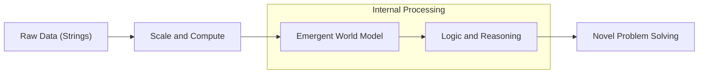
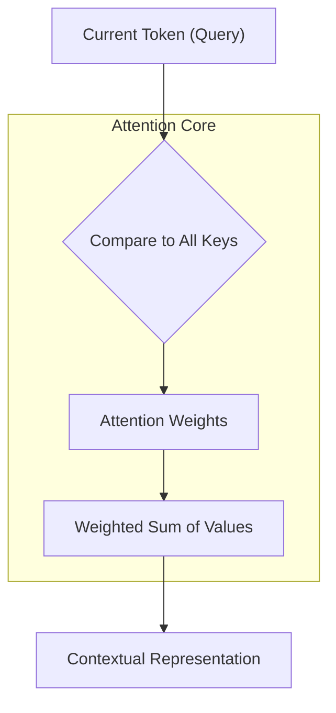

# Large Language Model Reasoning: The Mechanics of Machine Thought

The internal processing of a Large Language Model (LLM) when solving complex problems involves mechanisms that transcend simple statistical prediction. To understand the current state of artificial intelligence is to understand the mechanisms of **reasoning**—the ability to derive new information from existing premises through a structured, step-by-step process.

## Table of Contents
1. [[#Significance: The Quest for Machine Cognition]]
2. [[#Foundational Concepts: Pattern Matching vs. World Models]]
3. [[#Anatomy of a Thought: Tokenization and Embedding Space]]
4. [[#The Attention Mechanism: Contextual Focus and Retrieval]]
5. [[#Chain-of-Thought (CoT): Eliciting Step-by-Step Reasoning]]
6. [[#Advanced Reasoning Frameworks: ReAct, Tree of Thoughts, and Self-Correction]]
7. [[#The Hidden Layers of Inference: System 1 vs. System 2 Thinking]]
8. [[#Agentic Communication: Protocols for Machine Collaboration]]
9. [[#Emergent Protocols: The Evolution of \"Neuralese\"]]
10. [[#The Limits of LLM Reasoning: Hallucinations and Logic Gaps]]
11. [[#Future Horizons: Test-Time Compute and Reasoning Models]]

- - -

## Significance: The Quest for Machine Cognition

The distinction between probabilistic mimicry and genuine reasoning defines the current frontier of AI research. For years, Large Language Models (LLMs) were viewed as "stochastic parrots" that merely predicted the next most likely word in a sequence based on vast statistical training. However, as models scale, statistical prediction transitions into **logical synthesis**.

The significance of LLM reasoning lies in the shift from **pattern matching** to **structured deduction**. A model that can reason through a novel problem functions as an agent rather than a simple retrieval system. This transition defines the boundary between a search engine and a collaborative intelligence.

### Technical Drivers for Reasoning

Reasoning capabilities are required for:
1. **Reliability in Complexity**: Real-world problems (mathematical proofs, legal analysis, architectural design) require a sequence of logical dependencies rather than a single intuitive leap.
2. **Explainability**: Structured reasoning provides a trace of *how* an answer was reached, increasing system trustworthiness.
3. **Generalization**: Logic allows a model to apply principles to scenarios absent from its training data, moving beyond the limits of pure memory.

### The Evolution of Cognitive Capability

The development of these models follows three distinct levels of capability:

| Capability Level | Mechanism | Goal | Key Concept |
| :--- | :--- | :--- | :--- |
| **Level 1: Mimicry** | N-gram / Statistical | Fluency | Local Coherence |
| **Level 2: Association** | [[Transformer Models vs Diffusion in Agentic AI, LLMs and SLMs|Transformers]] (Pre-CoT) | Contextual Retrieval | Global Coherence |
| **Level 3: Reasoning** | Chain-of-Thought [Wei et al., 2022] | Logical Derivation | Systematic Correctness |

[Wei et al., 2022] demonstrated that prompting a model to "think step-by-step" unlocks latent capabilities that traditional scaling alone did not reveal. This suggests that reasoning is an emergent property of scale that requires specific activation protocols. In multi-agent systems, this capability is essential for communicating nuanced states and maintaining logical consistency across distributed tasks [Yao et al., 2022].

- - -

## Foundational Concepts: Pattern Matching vs. World Models

The debate surrounding LLM reasoning centers on the distinction between **probabilistic mimicry** and **the construction of a world model**. While the "stochastic parrot" view argues that models simply associate tokens (e.g., "France" and "Paris"), current evidence suggests that models learn the underlying rules of the systems they describe.

### Latent World Models
Research indicates that as models scale, they build internal representations of the rules generating their training data. For example, a model trained on chess moves eventually learns the *rules* of chess as the most efficient way to accurately predict the next move. This is known as a **latent world model**.



### Mechanisms of Self-Correction
Self-correction is a primary indicator of a latent world model. A model that identifies a contradiction between its current output and its previous steps is performing more than simple mimicry. 

A world model enables:
1. **Consistency Checking**: Evaluating steps against logical constraints.
2. **Simulation**: Projecting the likely outcomes of different logical paths.
3. **Abstraction**: Identifying a problem as a specific instance of a general rule.

- - -

## Anatomy of a Thought: Tokenization and Embedding Space

Before an LLM can reason, it must deconstruct language into a high-dimensional mathematical space. This involves **tokenization** and the mapping of tokens into an **embedding space**.

### Tokenization: The Atomic Unit
LLMs process language as a sequence of numbers rather than raw text. **Byte Pair Encoding (BPE)** is used to break words into common sub-word fragments. This allows the model to handle rare or unseen words by identifying their constituent parts, preserving semantic weight while maintaining a manageable vocabulary size.

### Embedding Space: High-Dimensional Representation
Each token is mapped into a vector within a high-dimensional space (often 1,536+ dimensions). The core principle of embeddings is that **semantic similarity = [[Distance Metrics in Mathematics and Computing|geometric proximity]]**.

In this space, meaning is multi-faceted. A token's position is defined by dimensions representing gender, status, part of speech, and factual associations.

| Semantic Relationship | Vector Transformation (Concept) |
| :--- | :--- |
| **Gender Shift** | [King] - [Man] + [Woman] ≈ [Queen] |
| **Plurality** | [Apple] + [Pluralization Vector] ≈ [Apples] |
| **Capitalization** | [Paris] - [France] + [Germany] ≈ [Berlin] |

### Reasoning as Trajectory in Vector Space
Reasoning occurs when the model moves from an input vector to a prediction by calculating relationships across these dimensions. The trajectory between points in this space represents the logical flow of the model's "thought" process.

- - -

## The Attention Mechanism: Contextual Focus and Retrieval

The **Attention Mechanism** allows the model to prioritize specific parts of the input sequence based on their relevance to the current processing step. This solves the problem of long-range dependencies in language.

### Queries, Keys, and Values
The attention mechanism functions as a vector-based database search. Each token is assigned three vectors:

1. **Query (Q)**: The specific information the token is seeking (e.g., "I am a verb, where is my subject?").
2. **Key (K)**: The information the token offers to others (e.g., "I am a noun, I can be a subject.").
3. **Value (V)**: The semantic content provided if a match is found.

The model calculates a score by taking the dot product of the *Query* of the current token and the *Keys* of all other tokens, determining the "attention weights."



### Self-Attention and Disambiguation
**Self-Attention** allows the model to calculate relationships between every token in a sequence. This is critical for disambiguating references (e.g., determining if "it" refers to "animal" or "street" based on whether the context is "tired" or "wide").

### Multi-Head Attention
**Multi-Head Attention** runs multiple attention operations in parallel. Different "heads" focus on different aspects of the text, such as grammar, factual associations, or rhetorical structure, allowing the model to synthesize a multi-faceted representation of context.

- - -

## Chain-of-Thought (CoT): Eliciting Step-by-Step Reasoning

The breakthrough in LLM logic came from **Chain-of-Thought (CoT) prompting** [Wei et al., 2022]. Asking a model to "think step-by-step" forces it to externalize intermediate logical steps, significantly improving performance on complex tasks.

### Breaking the Inference Bottleneck
Traditional LLM generation is **autoregressive**, predicting the next token in a single forward pass through the [[1.0 - Neural Networks|neural network]]. Complex problems cannot be solved in one pass. CoT addresses this by:
1. **Problem Decomposition**: Breaking goals into manageable sub-goals.
2. **Increased Test-Time Compute**: Using more tokens—and thus more total computation—to arrive at a solution.
3. **Internal State Management**: Each step becomes part of the context for the next, acting as a "scratchpad."

| Query Type | Standard Prompting | Chain-of-Thought Prompting |
| :--- | :--- | :--- |
| **Output** | Immediate final answer (often incorrect). | Sequential logic leading to the answer. |
| **Effect** | Fast, but fails on logical dependencies. | Slower, but utilizes latent logical capacity. |

### Empirical Validity of Generated Reasoning Chains
CoT capability is emergent; it typically only "unlocks" in models exceeding ~10B parameters. Smaller models may mimic the *style* of reasoning but fail the underlying logic. This indicates that while scale provides the capacity for logic, CoT provides the methodology required to utilize it effectively.

- - -

## Advanced Reasoning Frameworks: ReAct, Tree of Thoughts, and Self-Correction

To handle non-linear tasks, researchers have developed frameworks that allow for branching logic and external interaction.

### Tree of Thoughts (ToT)
[Yao et al., 2023] introduced **Tree of Thoughts**, where the model generates multiple potential paths at each step. It evaluates these paths and "backtracks" if a branch hits a dead end, allowing for systematic exploration of a problem space.

### ReAct (Reason + Act)
[Yao et al., 2022] proposed **ReAct**, interleaving reasoning with external actions (e.g., web searches or tool use). By grounding reasoning in external observations, the model reduces hallucinations and incorporates real-world data into its logic.

### Computational Metacognition: Reflexion
**Reflexion** [Shinn et al., 2023] allows a model to reflect on past failures. The model generates a self-critique (e.g., "My last attempt used the wrong formula"), which is then appended to its context for the next attempt. This creates a deliberate, iterative problem-solving loop.

- - -

## The Hidden Layers of Inference: System 1 vs. System 2 Thinking

LLM inference can be categorized using Daniel Kahneman's framework of **System 1** (fast, intuitive) and **System 2** (slow, deliberate) thought.

### System 1: Pattern Retrieval
Standard prompting triggers System 1. The model retrieves patterns from its [[1.1 - Neural Networks Expanded|weights]] in a single pass. This is fast but prone to hallucinations on tasks requiring multi-step logic.

### System 2: Test-Time Inference
CoT and iterative frameworks engage System 2. The model shifts from pure data retrieval to active calculation during inference. The context window serves as "working memory" where deliberate logical construction takes place.

| Characteristic | System 1 (Intuitive) | System 2 (Reasoning) |
| :--- | :--- | :--- |
| **Response Time** | Fixed per token. | Variable (Thinking time). |
| **Mechanism** | Weight association. | Token-based calculation. |
| **Reliability** | Good for facts/creativity. | Essential for math/logic/coding. |

- - -

## Agentic Communication: Protocols for Machine Collaboration

When single models reach their reasoning limits, **Multi-Agent Systems (MAS)** allow for collaborative problem-solving. Effective communication between agents requires moving beyond simple text logs toward structured protocols.

### Structured Collaboration: MetaGPT and SOPs
Frameworks like **MetaGPT** [Hong et al., 2023] use **Standard Operating Procedures (SOPs)**. Agents assume specific roles (e.g., Coder, Manager) and communicate via:
1. **Shared Message Pools**: Centralized hubs for publishing and subscribing to updates.
2. **Standardized Handshakes**: JSON-based schema exchanges for tool and data requests.
3. **Reasoning Trace Exchange**: Agents share their Chain-of-Thought, allowing specialized "Reviewer" agents to audit the *logic* of other agents.

### Benefits of Agentic Redundancy
Multi-agent systems break the **In-Context Bias** found in single models. If a model makes a logic error, it is likely to persist in that error. A separate agent with a different role can perform a fresh System 2 evaluation, providing a critical check on the reasoning chain.

- - -

## Emergent Protocols: The Evolution of \"Neuralese\"

As agents interact, they may move away from human language toward more efficient, machine-native protocols. This is often referred to as **"Neuralese"** [Arslan, 2025].

### Bypassing the Natural Language Bottleneck
Human language is redundant and slow. In an LLM, a "thought" is a vector. Translating that vector to text and back again for another model incurs precision loss and token overhead.

### Raw Latent Vector Communication
Emergent protocols allow agents to send **latent representations**—the raw mathematical outputs of attention heads—directly to one another.

```mermaid
graph LR
    A["Agent A (Vector Space)"] -- \"Traditional\" --> B["Text-to-Token"]
    B --> C["Token-to-Text"]
    C --> D["Agent B (Vector Space)"]
    
    A -- \"Neuralese\" --> E["Raw Latent Vectors"]
    E --> D
```

### Transparency and Safety in Emergent Protocols
While "Neuralese" is highly efficient, it is non-human-readable. This creates an **Opacity** problem, making it difficult to audit the reasoning for safety or alignment. Consequently, most commercial systems currently enforce natural language as a mandatory audit trail.

- - -

## The Limits of LLM Reasoning: Hallucinations and Logic Gaps

LLM reasoning is fundamentally brittle, as it remains a simulation of logic based on statistical probabilities.

### Logical Hallucinations
Reasoning hallucinations occur when the model priorities linguistic fluency over logical consistency. The model may generate a token that "sounds right" but contradicts its previous reasoning steps.

### The First Principles Gap
Humans reason from first principles (understanding the *concept* of quantity). LLMs reason from statistical completions (predicting the *string* "1+1="). Without an internal veracity engine or a formal connection to a logic system (like a Python interpreter), the model's output is always a probability, never a certainty.

- - -

## Future Horizons: Test-Time Compute and Reasoning Models

AI development is shifting from scaling training data to scaling **Inference Compute**. Models like **OpenAI o1** and **DeepSeek R1** use **Reinforcement Learning (RL)** to incentivize the discovery of correct reasoning paths.

### Implications of Long-Horizon Deliberation
By allowing a model to "think" for extended periods (test-time compute), we unlock deeper logical depth. This is applicable to scientific discovery and complex mathematical proofs where the solution space is too vast for intuitive leaps.

The future of intelligence involves a **hybrid model**: humans provide **intent and values**, while reasoning models handle **logical complexity and derivation**.

- - -

## References

### Foundational \"System 2\" Reasoning
* **Wei, J., et al. (2022).** *Chain-of-Thought Prompting Elicits Reasoning in Large Language Models.* NeurIPS 2022.
* **Kojima, T., et al. (2022).** *Large Language Models are Zero-Shot Reasoners.* arXiv:2205.11916.
* **Wang, Y., et al. (2022).** *Self-Consistency Improves Chain of Thought Reasoning in Language Models.* ICLR 2023.

### Search and Planning Architectures
* **Yao, S., et al. (2023).** *Tree of Thoughts: Deliberate Problem Solving with Large Language Models.* NeurIPS 2023.
* **Hao, S., et al. (2023).** *Reasoning with Language Model is Planning with World Models.* arXiv:2305.14992.

### Scaling and Reinforcement Learning
* **DeepSeek-AI. (2025).** *DeepSeek-R1: Incentivizing Reasoning Capability in LLMs via Reinforcement Learning.* arXiv:2501.12948.
* **Brown, B., et al. (2024).** *Large Language Monkeys: Scaling Inference Compute with Repeated Sampling.* arXiv:2407.21787.

- - -

## Related Notes
- [[Large Language Models - Architecture and Mechanics]]
- [[Transformer Models vs Diffusion in Agentic AI, LLMs and SLMs]]
- [[1.0 - Neural Networks]]
- [[1.1 - Neural Networks Expanded]]
- [[Map of Contents - Computer Science]]
