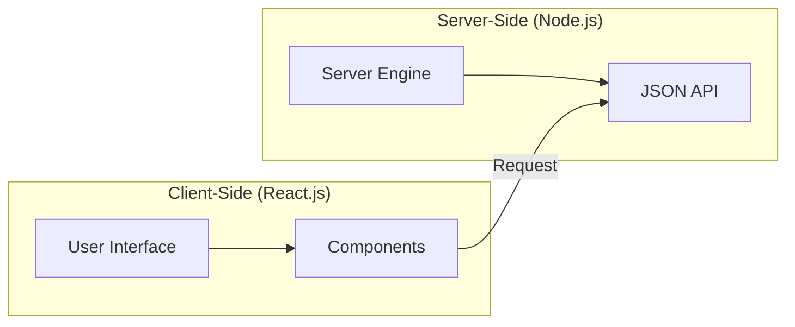
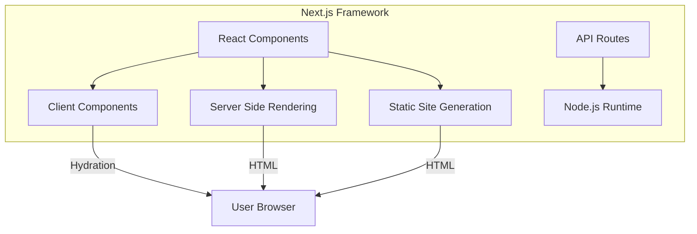

# WEB - Comparison of Node.js, React.js, and Next.js: The Full-Stack Ecosystem

The modern JavaScript ecosystem is dominated by three interconnected yet distinct technologies: **Node.js**, **React.js**, and **Next.js**. Understanding the synergy between these tools is the cornerstone of contemporary full-stack development. This note explores their individual roles and how they integrate into a cohesive, performant application architecture.

- - -

## Act I: The Crucible (2009–2013) - The Foundation

The "Crucible" was the era of the "Runtime" and the "Library." Node and React established the base layers for server-side execution and client-side UI.

### 1. Node.js (2009): The Runtime Environment
Node.js is a **runtime environment** that executes JavaScript outside the browser. Built on Chrome's **V8 engine**, it allows for high-performance server-side application development. Its **asynchronous, non-blocking I/O** model is the industry standard for high-concurrency applications.

### 2. React.js (2013): The UI Library
React is a **library**, not a framework. It focuses on the **View layer** (the 'V' in MVC), providing the building blocks (Components) and a reactive engine (Virtual DOM) to manage user interfaces.

#### Early Comparison (Runtime vs Library)


- - -

## Act II: The Zenith (2016–2022) - The Framework Era

The "Zenith" represents the rise of **Next.js**, which bridged the gap between Node and React.

### 1. Next.js (2016): The Orchestrator
Next.js is a **framework** built on top of React. It leverages Node.js to provide server-side capabilities that React alone cannot achieve (SSR, SSG, API Routes). It acts as the "glue" that brings the backend and frontend together into a single, cohesive developer experience.

### 2. Architectural Synergy


### 3. Comparison of Core Attributes
| Aspect | Node.js | React.js | Next.js |
|--------|---------|----------|---------|
| **Role** | Runtime Environment | UI Library | Full-Stack Framework |
| **Execution** | Server-side | Client-side (mostly) | Hybrid (Server & Client) |
| **Routing** | Manual (Express, etc.) | External (React Router) | Built-in (File-system) |
| **SEO** | N/A | Poor (CSR) | Excellent (SSR/SSG) |
| **Rendering** | No View Layer | Client-side Rendering | SSR, SSG, ISR, CSR |

- - -

## Act III: The Legacy (2023–Future) - The Converged Web

The "Legacy" is a new paradigm where the server and client are no longer seen as separate entities, but as a single execution graph.

### 1. React Server Components (RSC)
The latest version of Next.js (App Router) and React (v18+) has fundamentally changed the relationship. **Server Components** allow developers to render components on the server using Node.js, while only sending the interactive pieces (Client Components) to the browser.

#### The Modern Hybrid Approach
```typescript
// next.js/app/dashboard/page.tsx - A Server Component (No JS sent to client)
import { UserProfile } from '@/components/UserProfile'; // Server-side data fetch

export default async function Dashboard() {
  const user = await fetchUserData(); // Direct DB/API access in Node context

  return (
    <main>
      <h1>Welcome, {user.name}</h1>
      {/* Client Component (Interactive) */}
      <InteractiveGraph id={user.id} /> 
    </main>
  );
}
```

### 2. Conclusion: The Unified Stack
The "Legacy" of these three technologies is a unified JavaScript stack. **Node.js** provides the engine, **React** provides the interface, and **Next.js** provides the architectural pattern (the "Way") to build scalable, high-performance web applications.

- - -

## Related Notes
- [[WEB - Evolution of Web Development]]
- [[WEB - JavaScript Frameworks]]
- [[CS - Software Design Techniques]]
