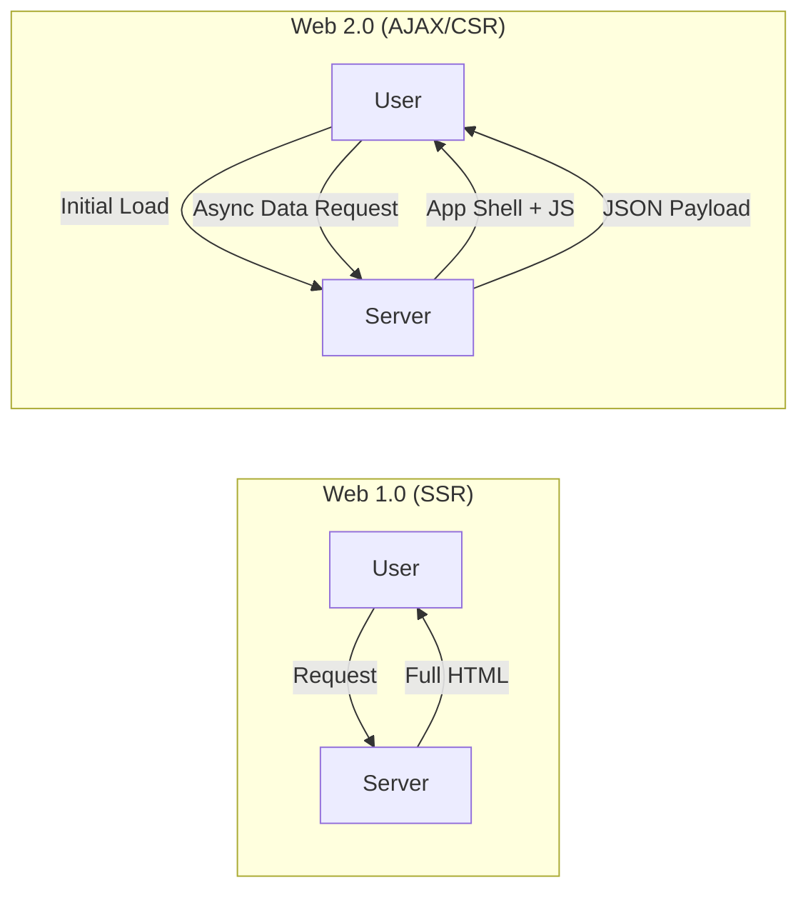

# WEB - Evolution of Web Development: From Static Documents to Global Intelligence

Web development represents the most significant architectural evolution in human information processing. What began as a decentralized document-sharing protocol at CERN has mutated into a complex, distributed execution environment that serves as the primary interface for human-computer interaction. This evolution is not merely a chronicle of languages (HTML, CSS, JS) but a fundamental shift in the locus of computation—moving from the server to the client, and now, to the edge.

- - -

## Act I: The Crucible (1989–2000) - The Document Web

The early web was an extension of the academic document model. The "Crucible" was characterized by the necessity of bridging disparate network architectures through a common, low-abstraction protocol.

### 1. The Birth of the Protocol
In 1989, **Tim Berners-Lee** proposed the World Wide Web as a "mesh" of information. The core stack—**HTTP**, **HTML**, and the **URL**—established the foundation of the Document Web.

### 2. The Browser Wars and Early Interactivity
The mid-90s saw the emergence of the first visual browsers (**Mosaic**, **Netscape**). In 1995, **Brendan Eich** developed **JavaScript** in 10 days at Netscape, introducing the first programmable layer to the client.

#### Early HTML Architecture
```html
<!-- A typical 1996 Document-centric structure -->
<html>
  <head><title>The Static Web</title></head>
  <body bgcolor="#FFFFFF">
    <center><h1>Welcome to the Information Superhighway</h1></center>
    <p>This is a static document served via HTTP.</p>
    <a href="next_document.html">Click here to navigate (Full Page Reload)</a>
  </body>
</html>
```

### 3. The Shift to Server-Side Rendering (SSR)
As complexity grew, static HTML became unmanageable. Languages like **PHP**, **Perl**, and **ColdFusion** allowed for dynamic generation of HTML on the server.

- - -

## Act II: The Zenith (2000–2015) - The Social and Dynamic Web

The "Zenith" represents the transition from a "Document Web" to an "Application Web." The primary catalyst was the ability to update content without a full page refresh.

### 1. The AJAX Revolution
In 2005, **Jesse James Garrett** coined the term **AJAX** (Asynchronous JavaScript and XML). This allowed the browser to request data from the server in the background using `XMLHttpRequest`.

#### The Architectural Shift: CSR vs. SSR


### 2. The Framework Explosion
The demand for high-interactivity led to the emergence of massive frontend libraries and frameworks:
- **jQuery (2006)**: Standardized DOM manipulation.
- **AngularJS (2010)**: Introduced Two-Way Data Binding.
- **React (2013)**: Introduced the **Virtual DOM** and Component-based architecture.

### 3. Comparison of Web Eras
| Feature | Web 1.0 (Document) | Web 2.0 (Social/Dynamic) | Web 3.0 (Semantic/Edge) |
|---------|-------------------|--------------------------|-------------------------|
| **Locus of Logic** | Server-side | Client-side (JS) | Distributed / Edge |
| **Data Format** | Static HTML | JSON / XML | Decentralized / Typed |
| **State** | Server-side Sessions | Browser (Redux/Context) | Edge-Cached / P2P |
| **Interactivity** | Minimal (Forms) | High (SPAs) | Real-time / Immersive |

- - -

## Act III: The Legacy (2015–Future) - The Converged Web

The "Legacy" is a synthesis of past paradigms, where the efficiency of SSR meets the interactivity of CSR through modern meta-frameworks and low-level optimizations.

### 1. The Full-Stack Meta-Framework Era
Today, the industry has moved away from "Pure SPAs" toward hybrid models. Frameworks like **Next.js**, **Remix**, and **SvelteKit** allow for granular control over where each component is rendered (Server vs. Client).

#### Modern Component Architecture (Next.js)
```typescript
// app/page.tsx - A Server Component (SSR by default)
import { DataFetcher } from '@/lib/api';

export default async function Page() {
  const data = await DataFetcher.getLatest(); // Executed on the server

  return (
    <main>
      <h1>Evolutionary Data</h1>
      {/* Interactive Client Component hydrated on the client */}
      <InteractiveGraph initialData={data} /> 
    </main>
  );
}
```

### 2. Performance and Optimization
- **WebAssembly (Wasm)**: Allows near-native performance for heavy computation in the browser.
- **Edge Computing**: Moves rendering and logic to the CDN level (e.g., Vercel Edge, Cloudflare Workers).

### 3. The Future: AI-Driven Interfaces
We are entering a phase where the web is no longer just a collection of apps, but a predictive environment. cli UIs (e.g., v0.dev) and LLM-integrated development environments are fundamentally shifting the "Legacy" of the web developer from an author of code to an architect of intent.

- - -

## Related Notes
- [[WEB - JavaScript Frameworks]]
- [[WEB - Comparison of Node, Next, and React.js]]
- [[CS - Software Design Techniques]]
