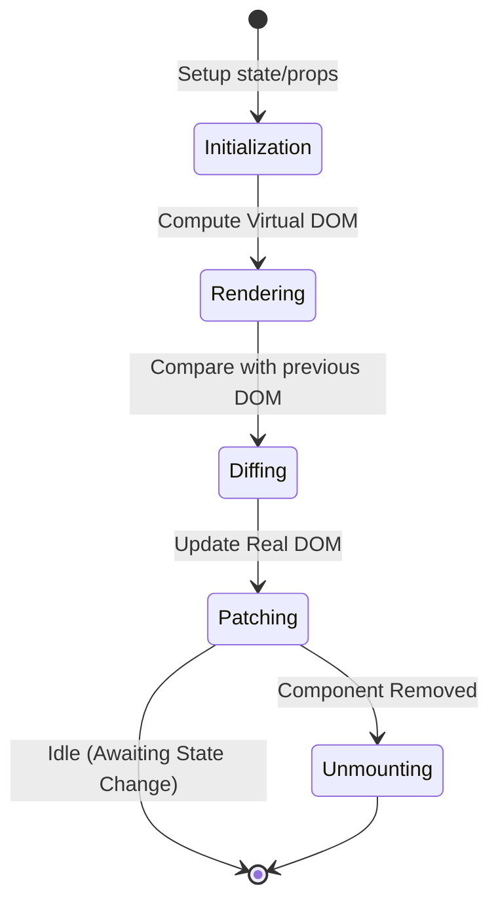

# WEB - JavaScript Frameworks: The Modern Architectural Landscape

JavaScript frameworks are the scaffolding upon which modern web applications are built. They provide the necessary abstraction layers to manage complex UIs, state synchronization, and DOM manipulation efficiently. This note explores the dominant paradigms and the architectural shifts that have defined the current ecosystem.

- - -

## Act I: The Crucible (2006–2013) - The Rise of the Component

The "Crucible" was characterized by the transition from imperative jQuery-style DOM manipulation to declarative, component-based development.

### 1. The React Revolution (2013)
React's introduction was a fundamental shift. It popularized the **Virtual DOM**—an in-memory representation of the real DOM—allowing for efficient UI updates by diffing state changes.

#### The Declarative Paradigm
React's primary contribution was shifting focus from *how* to update the UI to *what* the UI should look like based on the current state.

```jsx
// React 18+ Functional Component (The modern standard)
import { useState, useEffect } from 'react';

export function ModernComponent({ initialValue }) {
  const [count, setCount] = useState(initialValue); // Local State

  // Side Effect (e.g., API call)
  useEffect(() => {
    console.log(`Count changed: ${count}`);
  }, [count]);

  return (
    <button onClick={() => setCount(c => c + 1)}>
      Count is: {count}
    </button>
  );
}
```

### 2. The Competing Paradigms: Angular and Vue
Angular (Google) and Vue (Evan You) offered different architectural models:
- **Angular**: A comprehensive, opinionated **MVC** (Model-View-Controller) framework utilizing **TypeScript** and **Decorators**.
- **Vue**: A "progressive" framework designed for easy adoption, combining the best of React (Virtual DOM) and Angular (Directives).

- - -

## Act II: The Zenith (2014–2022) - Framework Maturity and Meta-Frameworks

The "Zenith" represents the maturation of these ecosystems into full-fledged application platforms.

### 1. The Meta-Framework Layer
As requirements grew for SEO and performance, "Pure" SPAs were replaced by meta-frameworks like **Next.js** (React), **Nuxt.js** (Vue), and **Angular Universal**.

### 2. Comparative Matrix of Dominant Frameworks
| Feature | React.js | Angular | Vue.js | Svelte |
|---------|----------|---------|--------|--------|
| **Type** | Library | Framework (Opinionated) | Progressive Framework | Compiler |
| **Data Binding** | One-way | Two-way | Two-way (Optional) | Two-way |
| **Virtual DOM** | Yes | No (Direct DOM) | Yes | No (Compiled) |
| **State Management** | External (Redux, Zustand) | Built-in (RxJS, Service) | Built-in (Pinia) | Built-in (Stores) |
| **Learning Curve** | Moderate | Steep | Low/Moderate | Low |

### 3. Framework Lifecycle (Mermaid Diagram)


- - -

## Act III: The Legacy (2023–Future) - The Post-Virtual DOM Era

The "Legacy" is being written by a new generation of tools that aim to eliminate the runtime overhead of current frameworks.

### 1. Svelte: The Compiler Framework
Svelte moves the work from the browser to the **build step**. By compiling components into efficient imperative code, it eliminates the need for a Virtual DOM.

### 2. Qwik and Astro: Island Architecture and Resumability
The future is moving toward **Island Architecture** (Astro) and **Resumability** (Qwik). These tools focus on sending as little JavaScript as possible to the client, solving the "hydration problem" that plagues React and Vue.

#### Island Architecture Overview
```mermaid
graph TD
    S[Static HTML Page] --> I1[Interactive Header (JS Loaded)]
    S --> I2[Interactive Cart (JS Loaded)]
    S --> C[Static Content (No JS)]
    I1 --- I2
```

### 3. Conclusion: The Convergence
We are seeing a convergence where frameworks are becoming more alike—React is moving toward server-centric logic (Server Components), while Svelte and Vue are adopting "Signals" for hyper-efficient reactivity.

- - -

## Related Notes
- [[WEB - Evolution of Web Development]]
- [[WEB - Comparison of Node, Next, and React.js]]
- [[CS - Software Design Techniques]]
