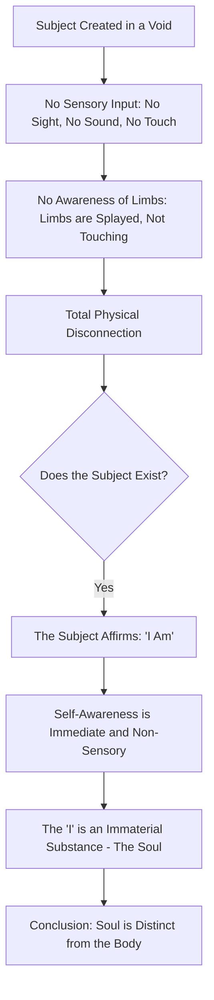

> [!abstract] Table of Contents
> - [[#Act I: The Crucible – The Prodigy of Bukhara]]
> - [[#Act II: The Zenith – The Master of Synthesis and Logic]]
> - [[#Act III: The Legacy – The Architect of Western and Eastern Thought]]
> - [[#Technical Depth]]
>   - [[#Table of Achievements: The Milestones of Al-Shaykh al-Ra’is]]
>   - [[#The Floating Man Thought Experiment: A Logical Flow]]
> - [[#Intellectual Lineage]]
>   - [[#Act I Expansion: The Isma'ili Crucible and the Samanid Library]]
>   - [[#Act II Expansion: The Medical Revolution of the Pulse and the Humors]]

# Ibn Sina (Avicenna): The Prince of Physicians and the Peak of Logic

**Opening Significance**
Ibn Sina, known to the Latin world as **Avicenna** (c. 980–1037), stands as the most influential philosopher-scientist of the Islamic Golden Age and arguably the preeminent intellectual figure of the pre-modern world. Often referred to by his honorific *al-Shaykh al-Ra’is* ("The Chief Master") and in the West as the "**Prince of Physicians**," his contributions represent the zenith of the medieval scientific and philosophical synthesis. He bridged the gap between the Hellenistic heritage of Aristotle and Neoplatonism and the nascent empirical and theological frameworks of the Islamic world. His twin masterpieces, *The Canon of Medicine* (*al-Qanun fi'l-Tibb*) and *The Book of Healing* (*Kitab al-Shifa*), served as the standard curricula for both Eastern and Western universities for over six centuries. Beyond his encyclopedic output, Ibn Sina’s original ontological formulations—specifically his "Proof of the Truthful" and the "Floating Man" thought experiment—profoundly reshaped metaphysics, influencing figures from Thomas Aquinas to René Descartes. He remains the architect of a unified system of knowledge that integrated medicine, logic, and theology into a coherent, rational whole.

- - -

## Act I: The Crucible – The Prodigy of Bukhara

**The Early Years in Afshana**
Abu Ali al-Husayn ibn Abd Allah ibn al-Hasan ibn Ali ibn Sina was born around 980 CE in the village of **Afshana**, near the great cultural capital of **Bukhara** in Transoxiana (modern-day Uzbekistan). His father, Abd Allah, was an official of the Samanid administration, an Isma'ili Muslim whose house was a vibrant center for intellectual debate. This environment, rich with discourse on philosophy, mathematics, and Isma'ili cosmology, served as the first crucible for the young Ibn Sina. The Samanid Empire was then at its cultural peak, fostering a climate where Persian and Arabic traditions merged with the scientific legacies of India and Greece.

**A Prodigious Education**
By the age of ten, Ibn Sina had mastered the entire **Quran** and reached such proficiency in Arabic literature that he astonished the scholars of Bukhara. His father soon engaged a private tutor to instruct him in Indian arithmetic and logic. However, the young scholar quickly outpaced his instructors. He turned his attention to the *Isagoge* of Porphyry and the works of [[BIO - Euclid|Euclid]] and Ptolemy, studying with an intensity that bordered on the obsessive. In his autobiography, Ibn Sina recounts that when faced with a difficult problem, he would perform ablutions and pray at the mosque until the solution was revealed to him. 

By the age of sixteen, Ibn Sina turned his formidable intellect to **Medicine**. Unlike the abstract complexities of metaphysics, he found medicine to be "not one of the difficult sciences," and through his clinical practice and innovative treatments of local notables, his fame began to spread before he reached adulthood. At eighteen, he was granted access to the **Royal Library of the Samanids** (the *Sawan al-Hikma*) after successfully treating the Samanid Emir, Nuh ibn Mansur, for a mysterious illness. It was within this legendary library—organized into specialized chambers for law, grammar, poetry, and philosophy—that Ibn Sina completed his formal "Crucible." He read every volume of the Greek ancients, later stating that by the age of eighteen, he had reached a state of knowledge such that he "learnt nothing more" thereafter, having merely deepened his understanding of the truths he already possessed.

**The Struggle with Metaphysics**
One of the most famous anecdotes of his youth involves his struggle with Aristotle’s *Metaphysics*. Ibn Sina claimed to have read the work **forty time**s until he could recite it from memory, yet its ultimate meaning remained obscured to him. It was only after happening upon a small commentary by **Al-Farabi** (*On the Aims of Aristotle's Metaphysics*) in a book market that the structure of Aristotelian thought finally clicked into place. This epiphany marked his transition from a brilliant student to an original synthesizer, prepared to reconcile the "necessary" and the "possible" in a way that would define the next millennium of thought.

- - -

## Act II: The Zenith – The Master of Synthesis and Logic

**The Court Physician and the Vizier**
Following the collapse of the Samanid dynasty in 999 CE, Ibn Sina’s life entered a period of nomadic instability, moving through the courts of Gurganj, Rayy, and Hamadan. Despite the political turbulence—which included serving as the **Vizier** to the Buyid prince Shams al-Dawla and even facing imprisonment due to court intrigue—this period was the most productive of his career. It was in Hamadan and later Isfahan, under the patronage of Ala al-Dawla, that he composed his most enduring works.

**The Canon of Medicine (Al-Qanun fi'l-Tibb)**
Ibn Sina’s *Canon* was not merely a collection of medical knowledge but a systematic architecture of the healing arts. He organized medicine into five books, covering general principles, simple drugs, localized diseases, general diseases, and compound medicines. The *Canon* introduced rigorous clinical standards:
1.  **Systematic Pharmacology:** He established protocols for the testing of new drugs, emphasizing that a drug's effect must be observed consistently in different cases to be deemed effective.
2.  **Infectious Diseases:** He was among the first to hypothesize the existence of sub-visible organisms (germs) as agents of contagion and advocated for quarantine to prevent the spread of plague and tuberculosis.
3.  **Anatomy and Psychology:** He provided detailed descriptions of the eye and the nervous system, and famously treated mental health issues (melancholia) through a combination of psychological counseling and herbal pharmacology, recognizing the profound link between the psyche and the soma.

**The Book of Healing (Kitab al-Shifa)**
If the *Canon* addressed the body, the *Kitab al-Shifa* addressed the soul and the universe. This monumental encyclopedia covered logic, natural sciences, mathematics, and metaphysics. It was here that Ibn Sina developed his most profound philosophical arguments.

**The Proof of the Truthful (Burhan al-Siddiqin)**
Ibn Sina’s ontological argument for the existence of God, known as the "Proof of the Truthful," departs from traditional cosmological arguments. He posited that things in the world are "possible in themselves"—they could exist or not exist. However, for a "possible" thing to exist, there must be a cause that makes its existence "necessary." To avoid an infinite regress of causes, there must be an ultimate entity whose existence is **Necessary in Itself** (*Wajib al-Wujud*). This Necessary Existent is God, the singular, simple, and uncaused source of all reality.

**The Floating Man Thought Experiment**
To prove the substantiality of the soul and the immediacy of self-consciousness, Ibn Sina proposed the "Floating Man" experiment (detailed in the technical section below). He argued that even if a human were created in a void, stripped of all sensory input and awareness of their own physical limbs, they would still affirm "I am." This proved that the human soul (the "I") is an immaterial substance distinct from the body, an argument that predated Descartes’ *Cogito* by six centuries.

- - -

## Act III: The Legacy – The Architect of Western and Eastern Thought

**The Latin Avicenna**
In the 12th century, the translation of Ibn Sina’s works into Latin by the Toledo school sparked a revolution in European thought known as **Avicennism**. His synthesis of Aristotle and Neoplatonism provided the framework for the Great Scholastics. **Thomas Aquinas** integrated Avicenna’s distinction between "essence" and "existence" into his own theology, while **Albertus Magnus** relied heavily on his natural philosophy. In medicine, the *Canon* became the undisputed textbook in universities like Montpellier and Padua until the mid-17th century.

**Impact on the Renaissance and Enlightenment**
Even as the scientific revolution of Vesalius and Paracelsus began to challenge medieval medical authority, Ibn Sina’s logical rigor remained a model for the scientific method. His emphasis on empirical observation in pharmacology and his systematic categorization of diseases laid the groundwork for modern medical classification. Philosophically, his dualism of soul and body and his proofs for the Necessary Existent continued to echo in the works of Spinoza, Leibniz, and the aforementioned Descartes.

**The Zenith and the Legacy**
Ibn Sina died in 1037 CE in Hamadan, Persia. He was buried in a tomb that remains a site of pilgrimage for scholars and physicians alike. His legacy is not merely the content of his books, but the **methodology of synthesis**. He taught the world that reason and faith, logic and medicine, and the abstract and the empirical are not separate domains but interconnected paths toward a single truth. He remains the bridge between the antiquity of Greece and the modernity of the global scientific community.

- - -

## Technical Depth

### Table of Achievements: The Milestones of Al-Shaykh al-Ra’is

| Year (approx.) | Achievement | Significance |
| :--- | :--- | :--- |
| 990 CE | Memorized the Quran | Demonstrated prodigious mnemonic capacity and linguistic mastery. |
| 997 CE | Cured Emir Nuh ibn Mansur | Gained access to the Royal Library of Bukhara, the *Sawan al-Hikma*. |
| 1012-1025 CE | Composed *The Canon of Medicine* | Created the most influential medical text in history, used for 600 years. |
| 1020-1027 CE | Composed *The Book of Healing* | Synthesized Aristotelian logic, physics, and metaphysics into a unified system. |
| 1024 CE | Formulated *Wajib al-Wujud* | Established the "Necessary Existent" argument in the *Kitab al-Isharat*. |
| 1025 CE | The "Floating Man" Experiment | Proved the immateriality of the soul through pure self-reflection. |

### The Floating Man Thought Experiment: A Logical Flow

The following diagram illustrates the sequence of Ibn Sina's most famous philosophical thought experiment, demonstrating the independence of the soul from sensory perception.

- - -

## Intellectual Lineage

**Inspirations: The Roots of the Master**
*   **Aristotle:** Provided the logical framework (organon) and the physical-metaphysical structure of the universe.
*   **Al-Farabi:** The "Second Teacher" who unlocked the complexities of Aristotelian metaphysics for Ibn Sina.
*   **Euclid & Ptolemy:** Influenced his mathematical and astronomical rigor.

**Contemporaries: Rivals and Colleagues**
*   **Al-Biruni:** Engaged in famous, often heated, scientific correspondence with Ibn Sina on the nature of light and the movement of the heavens.
*   **Ibn Miskawayh:** A fellow philosopher and historian of the Buyid era.

**Successors: The Ripple of the Prince**
*   **Thomas Aquinas:** Adopted the essence/existence distinction to explain the relationship between God and creation.
*   **Maimonides:** The Jewish philosopher who integrated Avicennian logic into his *Guide for the Perplexed*.
*   **Suhrawardi:** Founder of the Illuminationist school, who critiqued and expanded upon Ibn Sina's peripatetic philosophy.
*   **René Descartes:** Echoed the "Floating Man" logic in his *Meditations on First Philosophy*.

- - -

### Act I Expansion: The Isma'ili Crucible and the Samanid Library

**The Isma'ili Influence: A House of Debate**
Ibn Sina’s father, Abd Allah, was a man of significant intellectual curiosity, closely associated with the **Isma'ili missionary movement** (*da’wa*). His home in Bukhara was more than a residence; it was a sanctuary for itinerant scholars, theologians, and philosophers from across the Islamic world. The young Ibn Sina, even before his formal education began, was a silent participant in intense debates concerning the nature of the soul, the hierarchical structure of the universe, and the **Ikhwan al-Safa** (*Brethren of Purity*)—an anonymous society of Muslim philosophers whose 52 epistles attempted to unify all human knowledge into a single encyclopedic system. This Isma'ili environment, though Ibn Sina himself never fully adopted its specific theological doctrines, instilled in him the fundamental belief that the universe was governed by a rational, ordered structure that the human mind could comprehend. It was here that he first encountered the idea of the "Active Intellect," a concept that would later become a cornerstone of his metaphysics.

**The Curriculum of a Prodigy**
By age ten, after mastering the Quran, Ibn Sina’s education shifted from traditional religious studies to the **rational sciences** (*al-ulum al-aqliyya*). He began with Indian arithmetic, taught by a local grocer, and then moved to the study of logic with the scholar Natili. Natili soon found himself outpaced; when they reached Porphyry’s *Isagoge*, the young student began to offer his own original interpretations of the definitions of "genus" and "species" that left his teacher speechless. Ibn Sina then moved to Euclid's *Elements*, solving the first five or six theorems with Natili and then working through the remainder of the book independently. 

His mastery of Ptolemy’s *Almagest* followed a similar trajectory. When faced with the complexities of celestial mechanics, he spent nights in prayer and study, eventually becoming a more competent astronomer than his tutor. This autodidactic streak—the ability to penetrate the core of a subject without external guidance—is the defining characteristic of his "Crucible." It explains his later confidence in challenging the established authorities of the Greek tradition. By sixteen, while his peers were still mastering basics, Ibn Sina was already treating patients and discovering new methods of treatment, viewing medicine as a field that was "not difficult" compared to the abstract rigors of logic and mathematics.

- - -

### Act II Expansion: The Medical Revolution of the Pulse and the Humors

**The Science of the Pulse and Cardiology**
In the *Canon of Medicine*, Ibn Sina revolutionized the understanding of the circulatory system and the **science of the pulse** (*ilm al-nabd*). Building upon the foundations laid by Galen, he identified and classified over 60 different types of pulses, associating them with specific physiological and psychological states. He was the first to recognize that the pulse was not merely a mechanical beat but a reflection of the "vital spirit" and the balance of the four humors (blood, phlegm, yellow bile, and black bile). 

He provided the first accurate descriptions of the **valves of the heart** and their function in directing blood flow. His analysis of cardiac diseases included what is now recognized as **myocardial infarction** and heart failure, for which he prescribed a complex regimen of diet, exercise, and specific "cardiac drugs" such as sandalwood and lavender, which he believed had a direct affinity for the heart's "spirit." His pharmacological method was equally revolutionary; he insisted on using single drugs (*mufradat*) before compound ones (*murakkabat*) to isolate their specific effects, a precursor to the modern clinical trial.

**Neuropsychiatry and the Link Between Soul and Body**
Ibn Sina’s *Canon* is perhaps most modern in its treatment of what we now call **psychosomatic medicine**. He believed that many physical ailments had their roots in the soul (*nafs*). He famously treated a prince who believed he was a cow and refused to eat, demanding to be slaughtered. Ibn Sina, disguised as a butcher, examined the "cow" and declared it too thin to be killed, ordering it to be fed. The prince began to eat and was eventually cured of his delusion. This case study, recorded by later historians, illustrates Ibn Sina's understanding of the psychological dimensions of healing. 

He identified "love-sickness" (*al-ishq*) as a clinical condition, which he diagnosed by monitoring the patient's pulse while names of various cities and individuals were mentioned. A sudden spike in the pulse rate upon hearing a specific name would reveal the object of the patient's affection, allowing for a psychological and social remedy. His neurology was also groundbreaking; he described the three-chambered structure of the brain and associated each with specific cognitive functions: common sense (*hiss al-mushtarak*), imagination (*khayal*), and memory (*dhakira*). This localization of brain function remained the definitive model for centuries.

- - -

## See Also

- [[BIO - Euclid]] — Historical entity referenced in text.
- [[_Biographies - Map of Content|Biographies MOC]]
