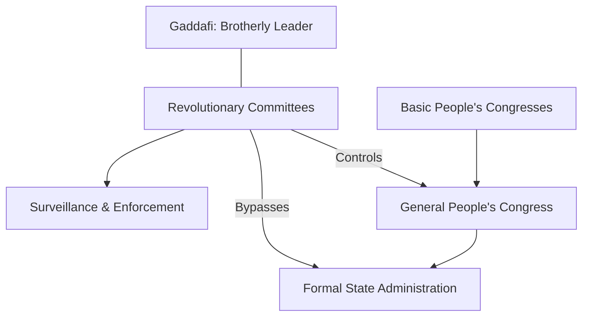

**Abstract:**
A comprehensive analytical dissection of Libya under the 42-year rule of **[[BIO - Muammar Gaddafi|Muammar Gaddafi]]**. This report serves as a central hub for the Contemporary History section, documenting the transition from a fragmented monarchy to a "State of the Masses" (Jamahiriya), and analyzing the structural stressors that led to the catastrophic 2011 collapse.
- - -
## 1. The Ascent: From the Senussi Wastes to the Al-Fateh Coup

The history of Muammar Gaddafi*s rise to power is inseparable from the failure of the post-colonial architecture established in 1951. The United Kingdom of Libya, governed by King **Idris al-Senussi**, was a state of immense geography but fragile legitimacy. King **Idris**, primarily a religious figurehead of the Senussi Sufi order, ruled a loose federation of three distinct regions: Tripolitania, Cyrenaica, and Fezzan. These regions were united more by their shared trauma of Italian colonial occupation than by any cohesive national identity.

By the late 1960s, the Libyan monarchy was under intense pressure from two directions. Externally, the rising tide of Pan-Arab Nationalism, spearheaded by **Gamal Abdel Nasser** in Egypt, cast the pro-Western Senussi monarchy as a "colonial client." Libya hosted massive US and British military installations, most notably Wheelus Air Base, which served as a constant reminder of Western influence in the heart of the Arab world. Internally, the discovery of oil in 1959 had fundamentally altered the Libyan social fabric. Overnight, a nation of subsistence farmers and nomadic tribes was flooded with wealth that the monarchy’s sclerotic bureaucracy was incapable of managing fairly. The influx of oil revenue bred corruption within the royal inner circle, while the urban youth—literate, connected, and radicalized—began to view the King as an anachronism.

On September 1, 1969, the rupture occurred. A group of junior military officers, calling themselves the **Free Officers Movement** and led by the 27-year-old Captain **Muammar Gaddafi**, executed a lightning-fast, bloodless coup while King **Idris** was abroad for medical treatment. The **Al-Fateh Revolution**, as it was termed, was initially greeted with euphoria in Tripoli and Benghazi. **Gaddafi**’s early rhetoric was purely **Nasserist**: he promised "Freedom, Socialism, and Unity."

Within his first year, **Gaddafi** moved with ruthless speed to dismantle the old order. He oversaw the immediate expulsion of the Italian settler community and the closure of all Western military bases. He purged the military of senior officers who might pose a rival threat and centralized power within the **Revolutionary Command Council (RCC)**. However, unlike his counterparts in Egypt or Iraq, **Gaddafi** did not stop at standard military authoritarianism. He possessed a distinct brand of desert populism, viewing himself not as a politician, but as a revolutionary philosopher. By 1973, in his "Zuwara Speech," he declared a "Cultural Revolution," calling on the "masses" to seize control of state institutions and destroy the "enemies of the revolution." This marked the beginning of his transition from a standard military dictator to the "Brotherly Leader" who would dominate Libya for the next four decades.

- - -

## 2. The Jamahiriya Architecture: Direct Democracy and the Green Book

By the mid-1970s, **Muammar Gaddafi** sought to distinguish his revolution from both Western Capitalism and Soviet Communism. He published **The Green Book**, which outlined his **Third Universal Theory**—a radical alternative to traditional statecraft. **Gaddafi** argued that "representation is a fraud." He believed that parliaments were inherently corrupt because they allowed a minority (the politicians) to speak for the majority. His solution was **Direct Democracy**, where the entire population would participate in decision-making through a hierarchy of congresses and committees. In 1977, he officially renamed the country the *Great Socialist People's Libyan Arab Jamahiriya* (State of the Masses).

**The Theory of the Masses:**
The Jamahiriya was designed, in theory, to be a "stateless" society. The formal government was replaced by:
- **Basic People's Congresses (BPC)**: Every adult Libyan was a member of their local congress, where issues of local and national policy were debated.
- **People's Committees**: These were the administrative arms of the congresses, responsible for executing policies at the municipal and sectoral levels (e.g., healthcare, education).
- **General People's Congress (GPC)**: The national assembly that met once a year to aggregate the resolutions from the thousands of local congresses.

**The Reality of Control: The Revolutionary Committees:**
While the GPC and BPC system appeared democratic on paper, **Gaddafi** maintained absolute control through a parallel, non-elected apparatus: the **Revolutionary Committees**. These were composed of the most zealous young loyalists of the revolution. They functioned as the ideological "guardians" of the state, monitoring the regular congresses to ensure they didn't deviate from **Gaddafi**'s vision. They held the power of arrest, operated their own prisons, and directed the pervasive surveillance state.

**The Strongman’s Paradox:**
**Gaddafi** himself resigned from all official state positions in 1977, adopting the title "Brotherly Leader and Guide of the Revolution." This was a brilliant, if cynical, tactical move. By holding no formal office, **Gaddafi** was legally unaccountable for the state's actions, yet he remained the ultimate arbiter of all significant decisions. He could bypass the entire Jamahiriya bureaucracy whenever it suited him, using the Revolutionary Committees to enforce his will. This de-institutionalization ensured that no rival power center—no parliament, no independent military command, no judiciary—could ever emerge to challenge him.

- - -

## 3. The Socialist Experiment: Prosperity, Water, and the Oil Rentier State

Whatever the brutality of his political methods, **Muammar Gaddafi** oversaw a period of material development that remains a source of complex nostalgia for many Libyans. Using the nation’s vast oil wealth, he transformed a fragmented desert society into one of the most prosperous nations in Africa. By the late 1980s, Libya’s Human Development Index (HDI) was the highest on the continent, surpassing many European nations in categories like access to healthcare and housing.

**The Pillars of Material Success:**
The **Gaddafi** regime established a "Rentier Social Contract": political passivity in exchange for total economic security. 
- **Universal Education and Literacy**: In 1969, Libya's literacy rate was below 20%. By 2010, it exceeded 90%. Education was free at all levels, and the state sent thousands of students to the West on full scholarships.
- **Healthcare**: A comprehensive national healthcare system was established, providing free medical care to all citizens and effectively eradicating diseases like malaria and polio within the country.
- **Housing for All**: **Gaddafi** famously stated that a home is a basic human right and should not be owned by a landlord. He oversaw the construction of massive apartment complexes in Tripoli and Benghazi, and under his "Housing for All" policy, many young couples were given state-subsidized apartments upon marriage.

**The Great Man-Made River (GMMR):**
The most ambitious project of the **Gaddafi** era was the Great Man-Made River. Fearing that Libya’s coastal cities would run out of water as the population grew, **Gaddafi** invested billions into a vast network of underground pipes that pumped fresh water from the Nubian Sandstone Aquifer System deep in the Sahara to the Mediterranean coast. He called it the "Eighth Wonder of the World." This project turned thousands of desert hectares into arable farmland and provided a secure water supply to millions, effectively insulating Libya from the chronic water crises that destabilized its neighbors.

**The Rentier Trap:**
However, this prosperity was built on a fragile foundation. Libya's economy was almost entirely dependent on oil exports, which accounted for over 95% of export earnings and 80% of government revenue. **Gaddafi**’s brand of "Socialism" (Jamahiriya economics) discouraged private enterprise and penalized wealth accumulation outside of regime-approved channels. This created a bloated public sector where nearly 70% of the workforce was employed by the state. While Libyans enjoyed a high standard of living, they lacked a productive, diversified economy. This "Rentier Trap" meant that any drop in global oil prices or international sanctions would have an immediate, devastating impact on the population's well-being.

- - -

## 4. The Pariah’s Sword: Global Terrorism and the Pan-African Pivot

**Muammar Gaddafi**'s foreign policy was a chaotic blend of revolutionary messianism and nihilistic violence. He viewed himself as a global figure whose mission was to dismantle Western Imperialism and Zionism. This led Libya into a decades-long cycle of international isolation and pariah status.

**State-Sponsored Terrorism:**
In the 1970s and 1980s, **Gaddafi** used Libya's oil wealth to fund revolutionary and terrorist movements worldwide. He provided arms and training to the **IRA** in Northern Ireland, the **Red Army Faction** in Germany, and the **Abu Nidal Organization**. This global shadow war culminated in two notorious events: the 1986 bombing of the La Belle discotheque in West Berlin and the 1988 bombing of **Pan Am Flight 103** over Lockerbie, Scotland. The Lockerbie disaster, which killed 270 people, led to sweeping UN sanctions that crippled the Libyan economy and turned the nation into a "fortress state" cut off from the global financial system. US President **Ronald Reagan** famously dubbed him the "Mad Dog of the Middle East."

**The Pan-African Pivot:**
By the late 1990s, **Gaddafi** had grown disillusioned with Arab leaders, who repeatedly rejected his schemes for a "United Arab Republic." In a dramatic reversal, he turned his back on the Arab world and began branding himself as the "King of Kings of Africa." He was instrumental in transforming the OAU into the **African Union (AU)** and spent billions of dollars building mosques, hospitals, and infrastructure across Sub-Saharan Africa. While this bought him temporary loyalty from dozens of African heads of state, it deeply alienated the Libyan populace. Many Libyans felt their national wealth was being "squandered" on foreign bribes while domestic infrastructure (outside of water and housing) was beginning to decay under the weight of sanctions and state neglect.

**The Rapprochement and the WMD Surrender:**
In 2003, fearing he would be the next target after the US-led invasion of Iraq, **Gaddafi** performed a stunning geopolitical pivot. He took responsibility for Lockerbie, paid billions in compensation to the victims, and voluntarily dismantled Libya's advanced WMD program. For a brief window (2004–2010), he was welcomed back into the international fold. Leaders like **Tony Blair** and **Nicolas Sarkozy** visited his tent in Tripoli, and Western oil companies (BP, ENI, Shell) returned to the Libyan desert. However, this rapprochement was purely transactional. The West remained deeply suspicious of his intentions, and his own people remained trapped in a political system that had not modernized despite the diplomatic opening.

- - -

## 5. The Reckoning: The Abu Salim Spark and the 2011 Collapse

The end of the **Gaddafi** era was not a sudden explosion but the result of a long-festering internal wound. The primary catalyst was the memory of the **Abu Salim Prison Massacre** of 1996, where over 1,200 prisoners were killed in a single day by the internal security forces. For years, the regime had suppressed the truth, but by February 2011, the families of the victims in Benghazi had reached their breaking point.

**The Civil War and NATO Intervention:**
The arrest of human rights lawyer **Fathi Terbil** sparked mass protests in Benghazi. Unlike the Egyptian or Tunisian revolutions, the Libyan uprising quickly transformed into an armed conflict. **Gaddafi**'s response was genocidal in rhetoric; in his infamous "Zenga Zenga" speech, he promised to hunt down protesters "inch by inch, house by house, alley by alley." Fearing a massacre in Benghazi, the UN authorized a No-Fly Zone, which NATO utilized to systematically destroy **Gaddafi**'s air defenses and loyalist armored columns. By August 2011, Tripoli had fallen to the rebel National Transitional Council (NTC).

**The Death of the State:**
On October 20, 2011, **Muammar Gaddafi** was captured, beaten, and killed by rebel fighters in his hometown of Sirte. The graphic images of his death signaled the visceral end of the Jamahiriya. However, the euphoria of the revolution masked a catastrophic reality: because **Gaddafi** had spent 42 years destroying Libyan institutions to prevent a coup, there was nothing left to hold the country together once he was gone. There was no national army, no functional parliament, and no unified judiciary.

**The Post-Gaddafi Vacuum:**
Libya today is the literal embodiment of the "Strongman Paradox." The removal of the autocrat led not to a thriving democracy, but to a "State of Militias." The nation is currently split between rival governments in Tripoli and the East, with dozens of local brigades competing for oil wealth. The water pipes of the Great Man-Made River are aging and under threat, and the universal security of the **Gaddafi** years has been replaced by a decade of instability. **Gaddafi**'s ultimate "ugly" legacy was creating a system that could only survive with him at the center, ensuring that his death would be the death of the state itself.
- - -

## See Also

- [[BIO - Muammar Gaddafi]] — Historical entity referenced in text.
- [[_History - Map of Contents|History MOC]]
