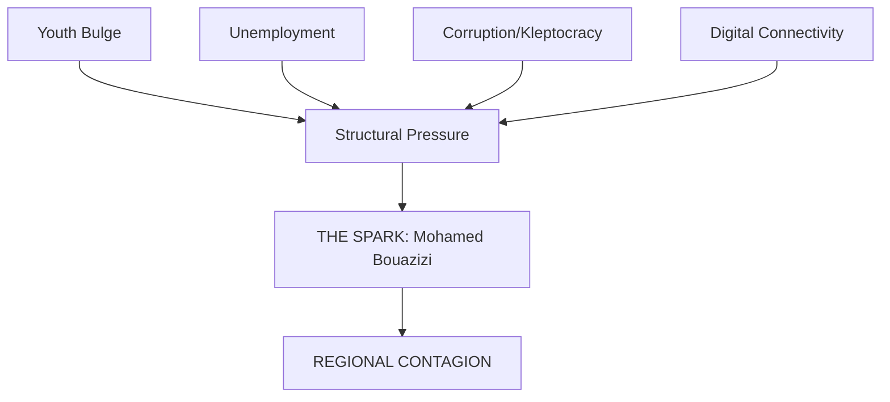

**Abstract:**
A strategic overview of the Arab Spring (2010–2012). This note serves as the primary "Map" for the Contemporary History section, documenting the regional tinderbox, a chronological breakdown of the uprisings, and a systematic classification of the major state and non-state actors involved.

- - -

## 1. Historical Context: The Structural Tinderbox

The Arab Spring was not a spontaneous combustion but the inevitable rupture of a regional order that had been under immense structural pressure for over three decades. To understand the contagion that swept from Tunisia to the Levant, one must map the three tectonic stressors that defined the "Pre-2011" Arab world.

**Demographic Pressure and the "Youth Bulge":**
By late 2010, the Arab world was experiencing a demographic phenomenon where over 60% of the population was under the age of 30. This generation—highly literate and digitally connected—faced a labor market dominated by state patronage and a stagnant private sector. The mismatch between educational attainment and economic opportunity created a volatile layer of "educated unemployed."

**Economic Stagnation and Kleptocracy:**
Under the regimes of **Hosni Mubarak** (Egypt), **Zine El Abidine Ben Ali** (Tunisia), and **[[Muammar Gaddafi]]** (Libya), economic growth was concentrated within a narrow elite of crony capitalists. Neoliberal reforms had dismantled social safety nets while enriching regime-connected oligarchs. For the average citizen, the "social contract"—jobs and subsidies in exchange for political passivity—was effectively broken.

**Political Calcification:**
The region was governed by "Presidents-for-Life" architectures. These regimes were not merely authoritarian; they were petrified. Dissent was managed through pervasive secret police (*mukhabarat*), and the total absence of institutional mechanisms for reform meant that any change would have to be external to the system.

- - -

## 2. Timeline of Events: The Regional Contagion

The following table documents the critical junctures of the Arab Spring, tracing the transition from localized protest to regional transformation.

| Date         | Location | Key Event                                                         | Result                                                 |
| :----------- | :------- | :---------------------------------------------------------------- | :----------------------------------------------------- |
| Dec 17, 2010 | Tunisia  | **Mohamed Bouazizi** commits self-immolation in Sidi Bouzid.      | Initial spark of the regional movement.                |
| Jan 14, 2011 | Tunisia  | **Zine El Abidine Ben Ali** flees to Saudi Arabia.                | The "Jasmine Revolution" succeeds.                     |
| Jan 25, 2011 | Egypt    | "National Police Day" protests begin in Tahrir Square.            | Start of the 18-day siege of Cairo.                    |
| Feb 11, 2011 | Egypt    | **Hosni Mubarak** resigns; power handed to the military (SCAF).   | End of the 30-year Mubarak era.                        |
| Feb 15, 2011 | Libya    | Protests erupt in Benghazi following the arrest of an activist.   | Start of the armed rebellion against **Gaddafi**.      |
| Mar 15, 2011 | Syria    | Protests begin in Daraa after the torture of schoolboys.          | Descent into the Syrian Civil War.                     |
| Mar 18, 2011 | Yemen    | "Friday of Dignity" massacre in Sana'a.                           | Defection of top generals from **Ali Abdullah Saleh**. |
| Aug 23, 2011 | Libya    | Rebels capture **Gaddafi**'s compound (Bab al-Azizia) in Tripoli. | Effective end of **Gaddafi**'s rule.                   |
| Oct 20, 2011 | Libya    | **Muammar Gaddafi** is captured and killed in Sirte.              | Collapse of the Jamahiriya regime.                     |
| Nov 23, 2011 | Yemen    | **Ali Abdullah Saleh** signs the GCC transition agreement.        | Managed transfer of power to **Hadi**.                 |
| Jan 2012     | Region   | First free elections held in Tunisia and Egypt.                   | Rise of political Islamist parties.                    |

- - -

## 3. Major Parties Involved: State and Non-State Actors

The Arab Spring was a multi-player geopolitical game involving domestic coalitions, security apparatuses, and regional power brokers.

### 3.1 The Revolutionary Vanguards
- **Youth Movements**: Urban, tech-savvy activists (e.g., the *April 6 Youth Movement* in Egypt) who used digital tools for mobilization.
- **Political Islamists**: Groups like the **Muslim Brotherhood** (Egypt) and **Ennahda** (Tunisia) who possessed the organizational discipline to translate street protests into electoral victories.
- **Defecting Military Units**: Crucial factions in Yemen (**Ali Mohsen al-Ahmar**) and Syria (the *Free Syrian Army*) who transformed peaceful protests into armed struggles.

### 3.2 The Regimes and the "Deep State"
- **The Old Guard**: Entrenched leaders like **Mubarak**, **Ben Ali**, and **Saleh** who relied on patronage and internal security forces.
- **Loyalist Brigades**: Elite units, such as **Gaddafi**'s *Khamis Brigade* or **Bashar al-Assad**'s *4th Armored Division*, which remained loyal based on sectarian or familial ties.
- **The Security Apparatus (*Mukhabarat*)**: The pervasive secret police forces that were the primary targets of popular rage.

### 3.3 Regional and Global Power Brokers
- **The Status Quo Powers**: Saudi Arabia and the UAE, who viewed the uprisings (and the rise of the **Muslim Brotherhood**) as existential threats.
- **The Revisionist Powers**: Qatar and Turkey, who utilized media (Al Jazeera) and financial aid to support Islamist-led transitions.
- **The International Community**: 
    - **The United States**: Struggled with a "policy dilemma" between democratic rhetoric and strategic stability.
    - **Russia & Iran**: Provided existential support to **Bashar al-Assad** to maintain their regional land bridge and Mediterranean presence.
    - **NATO**: Intervened in Libya via *Operation Unified Protector* to enforce the UN-mandated No-Fly Zone.

- - -

## 4. Thematic Map: Outcomes and Transitions

The Arab Spring resulted in four distinct "Political Pathways" that defined the region for the following decade.

**1. Democratic Transition (The Tunisian Model):**
Tunisia remained the sole survivor of the democratic hope, drafting a progressive constitution and holding regular elections, though it faced immense economic pressure and eventually a modern executive power-grab by **Kais Saied**.

**2. State Collapse and Civil War (The Libyan/Yemeni Model):**
The removal of strongmen like **Gaddafi** and **Saleh** without functional institutions led to a total security vacuum, splintering these nations into competing militia-controlled territories.

**3. Authoritarian Restoration (The Egyptian Model):**
Following a chaotic year under **Mohamed Morsi**, the military under **Abdel Fattah el-Sisi** executed a coup in 2013, restoring the security state with even greater levels of repression than the pre-2011 era.

**4. Existential Civil War (The Syrian Model):**
The **Assad** regime's refusal to step down, combined with regional proxy intervention, transformed Syria into the 21st century's most severe humanitarian catastrophe.
- - -
#### **References**
- [[Gaddafi's Libya - The Rise and Fall of the Jamahiriya|Gaddafi's Libya - The Rise and Fall of the Jamahiriya]]
## See Also
- [[Muammar Gaddafi]] — Historical entity referenced in text.
