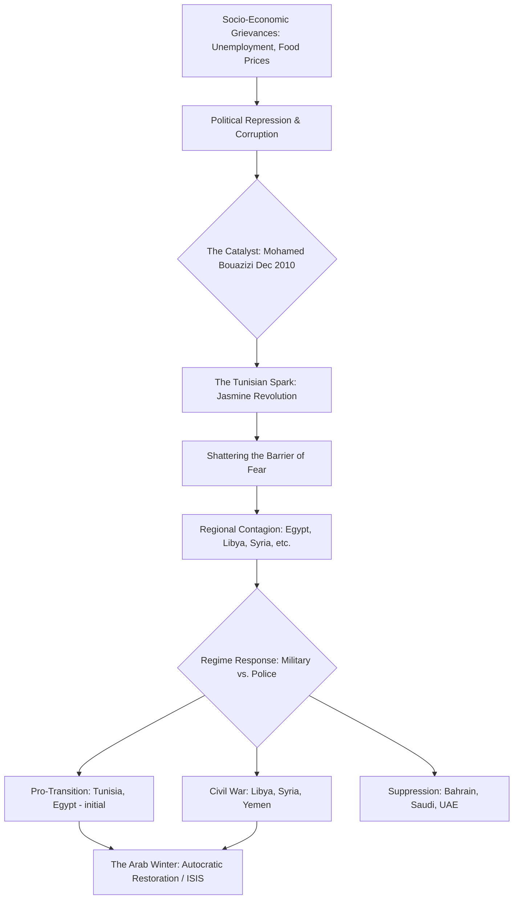

# HIST - The Arab Spring: A Comprehensive Geopolitical Analysis (2010–2012)

**Metadata:**
- **Date:** 2026-03-05
- **Domain:** #history
- **Category:** #contemporary
- **Tags:** #arab-spring #protest #geopolitics #middle-east #north-africa #ai-generated
- **Status:** #complete
- - -

## I. Introduction: The Geopolitical Reconfiguration of the Arab World
The "Arab Spring" was a period of systemic upheaval across the Middle East and North Africa (MENA) that fundamentally altered the region's political, social, and security architectures. It was not a monolithic event, but rather a series of interconnected uprisings triggered by a combination of long-term structural pressures—demographic, economic, and political—and immediate catalysts that shattered the long-standing "barrier of fear" that had characterized the region's authoritarian regimes for decades.

This note serves as a Master Map of Contents for the Arab Spring, providing an expansive analysis of its origins, its country-by-country progression, and its legacy of state collapse and the resurgent autocracy known as the "Arab Winter."

- - -

## II. The Pre-Revolutionary Context: The Era of 'Authoritarian Stability' (1980–2010)
For over thirty years, the Arab world was defined by a remarkable degree of authoritarian stability, governed by what political scientists often term the **"Mukhabarat State"** (Intelligence State). Regimes in Tunisia, Egypt, Libya, and Syria built expansive security apparatuses designed to monitor, infiltrate, and suppress any form of domestic dissent. This stability was underpinned by several key pillars:

1. **Security-First Governance:** The centralization of power within the Ministry of Interior and specialized military intelligence units. These agencies operated outside the rule of law, using emergency regulations to justify detention, torture, and the monitoring of all civil society organizations.
2. **The Social Contract of Co-optation:** Regimes provided basic services, subsidies, and public sector employment in exchange for political quiescence. This contract began to erode in the 1990s and 2000s as neoliberal reforms (often under IMF guidance) led to the privatization of state assets, primarily benefiting a narrow circle of crony capitalists—famously exemplified by the Trabelsi family in Tunisia and the Gamal Mubarak network in Egypt.
3. **The 'Youth Bulge' and the Crisis of Waithood:** By 2010, the MENA region had one of the world's highest proportions of young people under 30. Despite increased education levels, these cohorts faced unprecedented unemployment and a state of "waithood"—a prolonged period of economic and social stagnation where they could not afford to marry, buy homes, or achieve independent adulthood.

### Table: Comparison of Pre-2011 Security Apparatuses
| Country | Primary Security Agency | Role / Specialization | Leadership / Oversight |
|---------|-------------------------|-----------------------|-----------------------|
| **Tunisia** | Ministry of Interior (Police) | Pervasive surveillance and localized suppression. | Zine El Abidine Ben Ali |
| **Egypt** | State Security Investigations (SSI) | Monitoring Islamists and civil society; extensive torture networks. | Habib el-Adly / Hosni Mubarak |
| **Libya** | Internal Security Organization (ISO) | Tribal-based intelligence; suppression of any organized dissent. | Muammar Gaddafi / Moussa Koussa |
| **Syria** | Military Intelligence / Air Force Intelligence | Deep infiltration of society; sectarian-based loyalty (Alawite-led). | Bashar al-Assad / Assef Shawkat |

- - -

## III. The Causal Flow of Regime Collapse
The transition from stability to revolution was not a simple linear progression. It involved a complex interplay of internal grievances and external signals.

- - -

## IV. The Tunisian Spark: Sidi Bouzid and the Fall of Ben Ali (Dec 2010 – Jan 2011)
The revolution in Tunisia—often called the **Jasmine Revolution**—was the first and most successful of the uprisings. It was triggered not by an organized political movement, but by the self-immolation of **Mohamed Bouazizi**, a 26-year-old fruit vendor in the interior town of **Sidi Bouzid**, on December 17, 2010.

Bouazizi’s act of desperation against police harassment resonated with millions of Tunisians who felt marginalized by the coastal elite. The protests spread rapidly from the interior to the capital, Tunis. Unlike in later revolutions, the Tunisian military (historically small and marginalized by Ben Ali’s police state) refused to fire on the crowds. This crucial decision forced Ben Ali to flee to Saudi Arabia on January 14, 2011, after 23 years in power.

- - -

## V. The Egyptian Tahrir Uprising: The 'Deep State' vs. The 'Square' (Jan – Feb 2011)
The Egyptian revolution was the definitive moment of the Arab Spring. Egypt’s size, historical leadership in the Arab world, and its strategic alliance with the United States meant that the fall of **Hosni Mubarak** would have massive regional repercussions.

Inspired by Tunisia, activists launched a "Day of Rage" on January 25, 2011. The movement centered on **Tahrir Square** in Cairo, which became a symbolic liberated zone. The Egyptian 'Deep State'—the military-security complex known as the **SCAF (Supreme Council of the Armed Forces)**—initially supported Mubarak but eventually realized that his presence was destabilizing the state. On February 11, 2011, the military forced Mubarak's resignation, taking direct control of the transition. This set the stage for a three-way struggle between the secular activists, the **Muslim Brotherhood**, and the military, which ultimately culminated in the 2013 coup and the restoration of a more repressive security state under Abdel Fattah el-Sisi.

- - -

## VI. The Detailed Arab Spring Timeline (2010–2012)
| Date | Country | Key Event | Geopolitical Significance |
|------|---------|-----------|---------------------------|
| **Dec 17, 2010** | **Tunisia** | Mohamed Bouazizi sets himself on fire in Sidi Bouzid. | The initial catalyst of the regional movement. |
| **Jan 14, 2011** | **Tunisia** | President Zine El Abidine Ben Ali flees to Saudi Arabia. | First successful overthrow of an Arab autocrat. |
| **Jan 25, 2011** | **Egypt** | "Day of Rage" protests begin in Tahrir Square. | Expansion of the movement to the Arab world's center. |
| **Feb 11, 2011** | **Egypt** | Hosni Mubarak resigns; SCAF takes power. | Shattering of the regional pro-US autocratic status quo. |
| **Feb 15, 2011** | **Libya** | Protests begin in Benghazi following the arrest of Fathi Terbil. | Start of the Libyan uprising; rapid militarization. |
| **Feb 14, 2011** | **Bahrain** | "Day of Rage" protests begin at Pearl Roundabout. | Epicenter of the Shi'a-Sunni and Saudi-Iran polarization. |
| **Mar 14, 2011** | **Bahrain** | GCC Peninsula Shield Force (Saudi/UAE) enters Bahrain. | First regional military intervention to suppress an uprising. |
| **Mar 15, 2011** | **Syria** | Pro-democracy protests erupt in Deraa after torture of teens. | Descent of Syria into a decade-long civil war. |
| **Mar 17, 2011** | **Libya** | UN Security Council passes Resolution 1973. | Authorization of NATO intervention in Libya. |
| **June 3, 2011** | **Yemen** | President Ali Abdullah Saleh is injured in palace bombing. | Critical turning point in the Yemeni transition struggle. |
| **Oct 20, 2011** | **Libya** | Muammar Gaddafi is captured and killed in Sirte. | Violent end to the 42-year Jamahiriya regime. |
| **Nov 23, 2011** | **Yemen** | Saleh signs GCC-brokered power-sharing deal in Riyadh. | Beginning of the formal transition to the Hadi presidency. |
| **June 17, 2012** | **Egypt** | Mohamed Morsi (Muslim Brotherhood) wins presidential election. | Peak of Islamist electoral success post-Arab Spring. |
| **July 15, 2012** | **Syria** | ICRC officially declares the Syrian conflict a civil war. | Full transformation of the Syrian protest into regional war. |

- - -

## VII. The Regional Domino Effect: Libya, Syria, Yemen, and Bahrain
While the uprisings in Tunisia and Egypt were relatively short-lived protest movements, the events in Libya, Syria, and Yemen transformed into prolonged and brutal conflicts.

1. **Libya: The Armed Revolution and NATO Intervention.** Unlike the Tunisian or Egyptian militaries, the Libyan security apparatus was built on tribal loyalties directly tied to Gaddafi. This meant that the regime would not crumble from within but had to be defeated militarily. The intervention by NATO (Operation Unified Protector) was decisive in tilting the balance toward the rebel **National Transitional Council (NTC)**, but it left a security vacuum that plagued the country for the next decade.
2. **Syria: The Descent into Sectoral and Proxy War.** The Syrian uprising was initially non-sectarian, but the regime of **Bashar al-Assad** deliberately radicalized and sectarianized the conflict to consolidate its base (primarily Alawites and other minorities fearing Islamist rule). This drew in regional actors—Iran and Hezbollah supporting Assad; Saudi Arabia, Qatar, and Turkey supporting various rebel factions—leading to a catastrophic proxy war and the rise of ISIS.
3. **Bahrain: The Suppressed Uprising.** Bahrain represented the most direct clash between the aspirations of the Arab Spring and the security interests of the Gulf monarchies. The Saudi-led intervention in March 2011 was a clear signal that the status quo in the Arabian Peninsula would be defended at any cost, reinforcing the regional rivalry between the Saudi-led Sunni bloc and Iran.

- - -

## VIII. The Role of Technology: Beyond the 'Facebook' Myth
The Arab Spring is often labeled a "Twitter" or "Facebook" revolution, but this is a reductionist view. Technology did not *cause* the revolution; it provided the *infrastructure* for a new form of political mobilization that bypassed state-controlled media.

- **Information Sovereignty:** For decades, Arab regimes controlled the narrative through state television and newspapers. Digital tools allowed activists to create an alternative "information space," where state violence could be documented and shared instantly.
- **Satellite Television (Al Jazeera):** The role of Qatar-based Al Jazeera was arguably more critical than social media in reaching the older and rural populations who were not online. It amplified the protests, giving them a sense of regional momentum.
- **Cyber-Security and Surveillance:** Regimes quickly adapted, using tools from Western companies to track activists, monitor communication, and shut down the internet (as Egypt did on January 28, 2011). This "cyber-warfare" became a standard feature of modern authoritarianism.

- - -

## IX. Geopolitical Realignment: The New Cold War
The Arab Spring reshaped the Middle East's geopolitical landscape, leading to what some call the **"New Middle East Cold War"**.

- **The Saudi-Iran Rivalry:** The collapse of states like Syria and Yemen provided new theaters for proxy competition. Saudi Arabia viewed the Arab Spring as a threat to monarchical stability and an opportunity for Iranian expansion, leading to its more assertive and interventionist foreign policy.
- **The Role of Qatar:** Qatar used its wealth and media influence to support various pro-uprising movements (often Islamist), leading to a deep rift with its GCC neighbors (Saudi Arabia and the UAE) that culminated in the 2017-2021 blockade.
- **Western Uncertainty:** The United States and Europe were caught between their democratic ideals and their strategic reliance on stable autocratic partners. The inconsistent response—supporting the transition in Egypt but intervention in Libya and hesitation in Syria—contributed to a perception of declining Western influence in the region.

- - -

## X. The Arab Winter: State Collapse and the Restoration of Autocracy
By 2014, the "Spring" had largely turned into a "Winter." This period was characterized by:

1. **The Rise of the Islamic State (ISIS):** The chaos in Syria and the security vacuum in post-revolutionary Libya allowed ISIS to seize vast territories, declaring a caliphate in 2014 and drawing the world back into a conflict focused on counter-terrorism rather than democracy.
2. **The Restoration of the Security State:** In Egypt, the 2013 coup led by Abdel Fattah el-Sisi ended the brief democratic experiment and established a regime even more repressive than Mubarak's.
3. **The Refugee Crisis:** The wars in Syria and Libya triggered the largest movement of displaced people since World War II, destabilizing neighboring countries (Jordan, Lebanon, Turkey) and creating a political crisis in Europe.

- - -

## XI. Conclusion: The Unfinished Legacy
The Arab Spring was not a single failure or success, but a rupture in the regional order. While the "barrier of fear" was broken, the subsequent "barrier of organization" and "barrier of institutional resilience" proved much harder to overcome. The grievances that sparked the movements—unemployment, corruption, and lack of dignity—remain unresolved across much of the region, ensuring that the legacy of the Arab Spring continues to shape the Middle East's future.

- - -

**Related Notes:**
- [[HIST - The Libyan Revolution]]
- [[HIST - The Syrian Civil War]]
- [[BIO - Muammar Gaddafi]]
- [[BIO - Hosni Mubarak]]
- [[BIO - Mohamed Bouazizi]]
- [[_ History - Map of Contents]]

*Last MOC Update: 2026-03-05 by GeminiCLI*
*Next Review: 2026-06-05*
