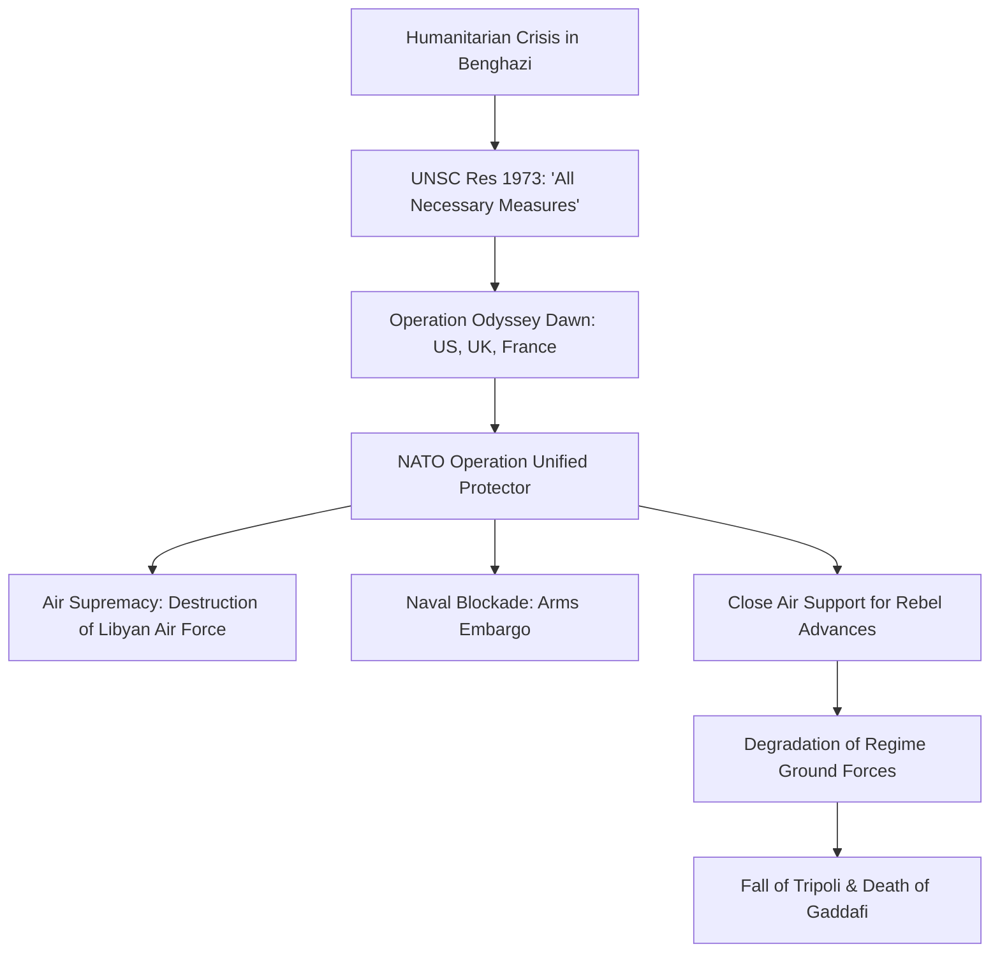

# HIST - The Libyan Revolution: The Fall of the Jamahiriya (2011)

**Metadata:**
- **Date:** 2026-03-05
- **Domain:** #history
- **Category:** #contemporary
- **Tags:** #libya #gaddafi #nato #war #geopolitics #ai-generated
- **Status:** #complete
- - -

## I. Introduction: The Exceptionalism of the Libyan Uprising
The 2011 Libyan Revolution (or the First Libyan Civil War) was a watershed moment in the history of the Arab Spring, representing the first instance where a popular pro-democracy uprising escalated into a full-scale armed conflict and prompted a direct military intervention by a Western-led coalition. Unlike the relatively swift transitions in Tunisia and Egypt, the Libyan uprising encountered a regime that was built on a unique ideological and security framework—the **Jamahiriya**—which was designed to survive internal dissent through a combination of tribal co-optation and brutal suppression.

This note provides a granular analysis of the conflict's progression, the legal and tactical dimensions of the NATO-led intervention, and the long-term geopolitical consequences of the collapse of the Gaddafi state.

- - -

## II. The Jamahiriya Framework: 42 Years of 'Authoritarian Exceptionalism'
To understand the violence of 2011, one must first analyze the nature of the state established by **Muammar Gaddafi** after the 1969 coup. Gaddafi’s "Third Universal Theory," outlined in his **Green Book**, ostensibly rejected both capitalism and communism in favor of a "state of the masses." In practice, this meant:

1. **The Suppression of Institutionalism:** Gaddafi systematically dismantled the state's formal institutions—parliament, political parties, and even a conventional military hierarchy—to prevent any rival power centers from emerging. Instead, power was exercised through "Revolutionary Committees" and personalized networks of loyalty.
2. **Tribal Balance and Co-optation:** Libya is a deeply tribal society. Gaddafi maintained control by playing major tribes (like the Warfalla, Magarha, and his own Qadhadhfa) against each other, rewarding loyalty with oil revenues and specialized security roles.
3. **The 'Security Battalions':** Fearing a traditional military coup, Gaddafi established elite, well-equipped security battalions (like the **Khamis Brigade**) commanded by his sons. These units were separate from the regular army and were designed specifically for regime protection.

- - -

## III. The Causal Mechanics of the Uprising (February 2011)
The Libyan revolution was triggered by the regional momentum of the Arab Spring but was rooted in long-standing grievances in the country’s eastern region, **Cyrenaica**, which had been historically marginalized by Gaddafi’s Tripoli-centered regime.

| Date | Location | Event | Significance |
|------|----------|-------|--------------|
| **Feb 15, 2011** | **Benghazi** | Arrest of human rights lawyer Fathi Terbil. | Immediate catalyst; sparked the first major protests. |
| **Feb 17, 2011** | **Nationwide** | "Day of Rage" called by activists. | Simultaneous protests across several eastern cities; first lethal use of force by regime. |
| **Feb 20, 2011** | **Benghazi** | Capture of the Katiba (security compound). | Rebels take control of Benghazi; first major military loss for the regime. |
| **Feb 27, 2011** | **Benghazi** | Formation of the National Transitional Council (NTC). | Creation of a unified political representative for the revolution. |

The regime's response was immediate and militarized. Gaddafi’s televised speech on February 22, where he vowed to hunt down protesters "zenga zenga" (alley by alley), signaled that the conflict would be a zero-sum struggle for survival.

- - -

## IV. The Escalation to War: The Rebels' Advance and Regime Counter-Offensive
By early March, the conflict had transformed into a conventional war. Initial rebel successes were driven by the defection of some regular army units and the seizing of regime arms depots.

1. **The Race for the Oil Crescent:** Rebels advanced rapidly from the east toward the capital, Tripoli, capturing the strategic oil ports of **Brega** and **Ras Lanuf**. However, these "technical" militias (pick-up trucks mounted with anti-aircraft guns) lacked the training and discipline of Gaddafi’s elite brigades.
2. **The Regime's Counter-Strike:** In mid-March, Gaddafi’s forces, supported by heavy artillery and air power, launched a devastating counter-offensive. They retook Zawiya in the west and advanced to the outskirts of Benghazi. The international community, fearing a Srebrenica-style massacre in a city of 700,000, was forced to act.

- - -

## V. The Legal and Tactical Framework of NATO Intervention
The international response was structured around the **"Responsibility to Protect" (R2P)** doctrine, resulting in **UN Security Council Resolution 1973**.

NATO’s intervention was technically limited to protecting civilians, but the operational reality was a systematic campaign to degrade Gaddafi’s military capabilities. This "mission creep" became a point of major international contention, especially with Russia and China.

- - -

## VI. The Siege of Misrata: The Epicenter of Urban Warfare
The battle for **Misrata**, Libya’s third-largest city, was the war's most brutal chapter. As a rebel enclave surrounded by regime forces, the city was subjected to a 100-day siege.

- **Tactical Dynamics:** The conflict was characterized by street-by-street combat, snipers on rooftops, and indiscriminate shelling of civilian areas. NATO air strikes were restricted by the proximity of rebel and regime forces in urban settings.
- **Humanitarian Impact:** The siege led to thousands of deaths and a total collapse of medical services. The successful defense of Misrata, facilitated by sea-borne supplies from Benghazi and NATO air support, was a psychological turning point for the revolution.

- - -

## VII. The Fall of Tripoli: Operation Mermaid Dawn (August 2011)
The regime’s collapse began in late August 2011. While the eastern front remained static, a secret coordination between internal Tripoli-based activists and external rebel groups in the Nafusa Mountains led to a surprise breakthrough.

1. **The Nafusa Mountain Front:** Berbers (Amazigh) and other rebel groups, supported by NATO and Western special forces, captured the strategic town of **Zawiya**, cutting off Tripoli’s main supply line to the Tunisian border.
2. **The Uprising Within:** On August 20, the mosques of Tripoli called for a general uprising. Within days, rebel forces entered the city, overrunning the symbolic **Bab al-Azizia** compound. Gaddafi and his inner circle fled to Sirte and Bani Walid.

- - -

## VIII. The Final Stand in Sirte and the Death of Gaddafi
The war’s final weeks were defined by the siege of **Sirte**, Gaddafi’s hometown and his last remaining stronghold. The battle was a devastating demonstration of the regime’s refusal to surrender, even as the NTC was recognized internationally as the new government.

On October 20, 2011, a convoy attempting to flee Sirte was struck by NATO aircraft. Gaddafi was captured alive by NTC fighters from Misrata but was subsequently abused and killed. His death, while celebrated by many, left the country without a unifying figure to negotiate a political settlement, paving the way for the fragmentation that followed.

- - -

## IX. Post-Revolutionary Fragmentation: The Failure of State-Building
The primary tragedy of the Libyan Revolution was the "day after." The total collapse of the Gaddafi state left a vacuum that the NTC was unable to fill.

- **The Proliferation of Militias:** Thousands of young men had been armed during the conflict. These groups, often organized by city or tribe, refused to disarm or integrate into a national army, instead becoming powerful local "fiefdoms."
- **Institutional Vacuum:** Because Gaddafi had spent 40 years preventing the development of institutions, there was no administrative framework to manage the country’s oil wealth or maintain law and order.
- **The Rise of the Second Civil War:** The inability to reach a political consensus led to the emergence of two rival governments (one in Tripoli and one in the east) in 2014, drawing Libya into a second decade of conflict involving regional proxies like Turkey, Egypt, and Russia.

- - -

## X. Geopolitical Fallout: Regional and Global Consequences
The Libyan Revolution had effects far beyond its borders:
1. **The Sahelian Crisis:** Thousands of Tuareg mercenaries who had fought for Gaddafi returned to **Mali** with weapons looted from Libyan arsenals, triggering a rebellion that destabilized the entire Sahel region.
2. **The Mediterranean Migration Crisis:** The collapse of Libyan border security transformed the country into the primary hub for human smuggling across the Mediterranean, leading to a humanitarian and political crisis in Europe.
3. **The Global 'R2P' Debate:** The perceived "regime change" outcome of the Libyan intervention created a deep distrust among the BRICS nations (especially Russia and China), leading to their veto of any similar action in Syria.

- - -

## XI. Conclusion: The Paradox of Liberation
The 2011 Libyan Revolution remains a paradox of the Arab Spring. It achieved the primary goal of removing one of the world's longest-serving autocrats, yet it failed to deliver the stability or democracy that the protesters initially demanded. The "state of the masses" was replaced by a "state of the militias," illustrating the immense difficulty of building a democratic order in the absence of pre-existing institutions.

- - -

**Related Notes:**
- [[HIST - The Arab Spring]]
- [[BIO - Muammar Gaddafi]]
- [[HIST - The Second Libyan Civil War]]
- [[_ History - Map of Contents]]

*Last MOC Update: 2026-03-05 by GeminiCLI*
*Next Review: 2026-06-05*
