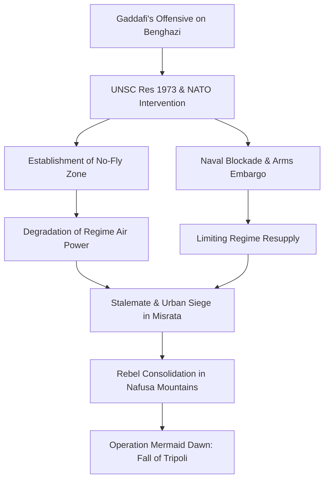

# HIST - The Libyan Revolution: The Fall of the Jamahiriya (2011)

**Metadata:**
- **Date:** 2026-03-05
- **Domain:** #history
- **Category:** #contemporary
- **Tags:** #libya #gaddafi #nato #war #geopolitics #ai-generated
- **Status:** #in-progress (Injection Phase)
- - -

## I. Introduction: The Exceptionalism of the Libyan Uprising
The 2011 Libyan Revolution, also known as the First Libyan Civil War, was a defining moment in the history of the Arab Spring, representing the first instance where a popular pro-democracy uprising escalated into a full-scale armed conflict and prompted a direct military intervention by a Western-led coalition. Unlike the relatively swift transitions in Tunisia and Egypt, the Libyan uprising encountered a regime that was built on a unique ideological and security framework—the **Jamahiriya**—which was designed to survive internal dissent through a combination of tribal co-optation and brutal suppression. The conflict was not merely a call for reform but an existential struggle for the survival of a state that had systematically hollowed out its formal institutions for over four decades.

This note provides a granular analysis of the conflict's progression, the legal and tactical dimensions of the NATO-led intervention, and the long-term geopolitical consequences of the collapse of the Gaddafi state. The Libyan experience serves as a stark warning about the challenges of post-revolutionary state-building in an institutional vacuum. The revolution achieved its primary goal—the removal of **Muammar Gaddafi**—but at the cost of the state's total collapse, leading to a decade of fragmentation, militia rule, and regional instability.

- - -

## II. The Jamahiriya Framework: 42 Years of 'Authoritarian Exceptionalism'
To understand the violence and institutional collapse of 2011, one must first analyze the nature of the state established by **Muammar Gaddafi** after the 1969 coup. Gaddafi’s "Third Universal Theory," outlined in his **Green Book**, ostensibly rejected both capitalism and communism in favor of a "state of the masses." In practice, this meant several key structural features that defined the Libyan state for 42 years:

1. **The Suppression of Institutionalism:** Gaddafi systematically dismantled the state's formal institutions—parliament, political parties, and even a conventional military hierarchy—to prevent any rival power centers from emerging. Instead, power was exercised through "Revolutionary Committees" and personalized networks of loyalty. This meant that by 2011, there were no robust state structures (judiciary, police, civil service) that could function independently of the leader.
2. **Tribal Balance and Co-optation:** Libya is a deeply tribal society, with over 140 tribes and clans. Gaddafi maintained control by playing major tribes (like the Warfalla, Magarha, and his own Qadhadhfa) against each other, rewarding loyalty with oil revenues and specialized security roles. He utilized the "Social People's Leadership Committees" to co-opt tribal elders, effectively merging tribal authority with state power.
3. **The 'Security Battalions':** Fearing a traditional military coup, Gaddafi established elite, well-equipped security battalions (like the **Khamis Brigade**, commanded by his son Khamis) that were separate from the regular army. these units were composed of high-loyalty cadres and African mercenaries, designed specifically for regime protection. The regular army was kept intentionally weak and fragmented.

- - -

## III. The Causal Mechanics of the Uprising (February 2011)
The Libyan revolution was triggered by the regional momentum of the Arab Spring but was rooted in long-standing grievances in the country’s eastern region, **Cyrenaica**, which had been historically marginalized by Gaddafi’s Tripoli-centered regime. This marginalization was both economic and political, stemming from the region's historical ties to the Senussi monarchy that Gaddafi had overthrown.

### 1. The Benghazi Spark
The immediate catalyst was the arrest of human rights lawyer **Fathi Terbil** on February 15, 2011. Terbil represented the families of the victims of the 1996 **Abu Salim prison massacre**, where security forces had killed over 1,200 inmates. The protests that began in Benghazi were initially peaceful, demanding the release of Terbil and an end to government corruption. However, unlike the security forces in Cairo or Tunis, the Libyan regime responded with immediate and overwhelming lethal force. specialized brigades used snipers and heavy weaponry against civilians, transforming the protest into a violent struggle for control of the city.

### 2. The Formation of the National Transitional Council (NTC)
By February 20, 2011, the rebels had captured the iconic **Katiba** (security compound) in Benghazi, marking the first major military defeat for the regime. On February 27, 2011, the **National Transitional Council (NTC)** was formed, led by former Justice Minister **Mustafa Abdul Jalil**, who had defected in protest of the regime's violence. The NTC positioned itself as the sole legitimate representative of the Libyan people and the "political face" of the revolution, eventually receiving recognition from dozens of countries and international organizations. This formal political structure was crucial in coordinating the armed rebellion and securing international military support.

### Table: Key Milestones of the Early Uprising
| Date | Location | Event | Significance |
|------|----------|-------|--------------|
| **Feb 15, 2011** | **Benghazi** | Arrest of human rights lawyer Fathi Terbil. | Immediate catalyst; sparked the first major protests. |
| **Feb 17, 2011** | **Nationwide** | "Day of Rage" called by activists. | Simultaneous protests across several eastern cities; first lethal use of force by regime. |
| **Feb 20, 2011** | **Benghazi** | Capture of the Katiba (security compound). | Rebels take control of Benghazi; first major military loss for the regime. |
| **Feb 27, 2011** | **Benghazi** | Formation of the National Transitional Council (NTC). | Creation of a unified political representative for the revolution. |
| **Mar 10, 2011** | **Benghazi** | France becomes the first state to recognize the NTC. | Critical diplomatic breakthrough for the rebel movement. |
| **Mar 17, 2011** | **New York** | UN Security Council passes Resolution 1973. | Authorization of international intervention to protect civilians. |

- - -

## IV. The Escalation to War: The Rebels' Advance and Regime Counter-Offensive
By early March 2011, the conflict had transformed from a popular uprising into a conventional civil war. Initial rebel successes were driven by the defection of some regular army units and the seizing of regime arms depots. In the east, rebels advanced rapidly across the coastal highway, capturing the strategic oil ports of **Brega** and **Ras Lanuf**. However, these "technical" militias (pick-up trucks mounted with anti-aircraft guns) lacked the training and discipline of Gaddafi’s elite brigades. The rebels were a loose coalition of defected soldiers, student activists, and civilians, often operating with little central command.

### 1. The Race for the Oil Crescent
The rebels' goal was to march on Tripoli from the east, but they were halted by Gaddafi’s specialized units. The regime’s counter-offensive, launched in mid-March, was devastatingly effective. Supported by heavy artillery and air power, the security battalions retook Zawiya in the west and advanced to the outskirts of Benghazi. The regime utilized its air superiority to conduct relentless strikes on rebel positions and civilian infrastructure, while its ground forces began a systematic "cleansing" of liberated towns. By March 16, the Fall of Benghazi appeared imminent, and Gaddafi famously vowed in a televised speech to "cleanse Libya inch by inch, house by house" of the "rats" who opposed him. This rhetoric of impending genocide became the primary driver for international military intervention.

- - -

## V. The Legal and Tactical Framework of NATO Intervention
The international response was structured around the **"Responsibility to Protect" (R2P)** doctrine, a relatively new concept in international law that emphasized the sovereignty of a state as being contingent on its ability to protect its own population. This resulted in **UN Security Council Resolution 1973**, which authorized member states to take "all necessary measures" to protect civilians and civilian-populated areas under threat of attack.

### 1. UN Resolution 1973 and Operation Unified Protector
The resolution was a milestone in international diplomacy, providing the legal basis for a military intervention. While it explicitly forbade a "foreign occupation force" (no boots on the ground), it authorized a no-fly zone and a naval blockade. The mission, initially led by a coalition of the US, UK, and France (Operation Odyssey Dawn), was transitioned to NATO as **Operation Unified Protector** on March 31, 2011. NATO’s intervention was technically limited to civilian protection, but the operational reality was a systematic campaign to degrade Gaddafi’s military capabilities.

- **Air Supremacy:** NATO quickly dismantled Libya’s integrated air defense system and destroyed the regime’s air force on the ground.
- **Mission Creep:** While the official mandate was protection, NATO strikes frequently targeted Gaddafi’s command-and-control centers and logistical lines. By provides close air support for rebel advances, NATO became the "de facto air force" of the revolution. This perceived overreach led to deep distrust from Russia and China, who had abstained from the vote, effectively ending the use of R2P in future conflicts like Syria.

- - -

## VI. The Siege of Misrata: The Epicenter of Urban Warfare
The battle for **Misrata**, Libya’s third-largest city and its commercial hub, was the war's most brutal and prolonged chapter. As a rebel enclave surrounded by regime forces, the city was subjected to a 100-day siege starting in March 2011. The battle for Misrata represented the war's most intense urban combat, characterized by street-by-street fighting, the use of snipers on rooftops, and indiscriminate shelling by Gaddafi’s forces.

### 1. Tactical Dynamics and Humanitarian Impact
Gaddafi’s brigades used heavy artillery and cluster munitions to shell the city, targeting hospitals and food warehouses. The siege created a catastrophic humanitarian crisis, with thousands of civilians killed and tens of thousands displaced. The defense of Misrata was led by a loose network of local militias who relied on supplies smuggled by sea from Benghazi and on NATO air support to degrade the regime's heavy weaponry. The successful defense of Misrata was a psychological turning point for the revolution, demonstrating that the regime could be defeated even in the heart of its western strongholds. The Misrata militias would later play a decisive role in the final capture of Tripoli and Sirte.

- - -

## VII. The Fall of Tripoli: Operation Mermaid Dawn (August 2011)
The fall of the Gaddafi regime began in late August 2011, following a secret coordination between internal Tripoli-based activists and external rebel groups. While the eastern front remained largely static, a decisive breakthrough occurred in the west. Rebel forces from the **Nafusa Mountains**, primarily composed of Berbers (Amazigh) and local Arab tribes, had spent months training with Western special forces and receiving covert shipments of arms. In mid-August, these forces launched a surprise offensive, capturing the strategic town of **Zawiya**, just 30 miles west of the capital. This maneuver cut off Tripoli’s main supply line to the Tunisian border, effectively placing the capital under siege.

### 1. The Uprising from Within
On August 20, 2011 (the 20th day of Ramadan), the mosques of Tripoli called for a general uprising—codenamed **Operation Mermaid Dawn**. This was a carefully timed internal rebellion designed to coincide with the approach of rebel forces from the west and south. Within days, the regime's control over the capital collapsed. Rebel fighters entered the city, meeting relatively light resistance from Gaddafi’s regular army units, many of whom simply abandoned their posts or defected. By August 23, the symbolic **Bab al-Azizia** compound, the heart of Gaddafi’s power, was overrun. The capture of the capital marked the de facto end of the regime, although Gaddafi and his inner circle managed to flee to the loyalist strongholds of Sirte and Bani Walid.

- - -

## VIII. The Final Stand in Sirte and the Death of Gaddafi
The war’s final phase was defined by the siege of **Sirte**, Gaddafi’s hometown and his last remaining stronghold. The battle for Sirte was a devastating demonstration of the regime’s refusal to surrender, even as the National Transitional Council (NTC) was recognized internationally as the new government of Libya. The city was surrounded by NTC forces from Misrata and the east, while NATO aircraft conducted systematic strikes on the remaining loyalist positions.

### 1. The Capture and Death of Muammar Gaddafi (October 20, 2011)
On October 20, 2011, a convoy attempting to flee the city of Sirte was struck by NATO aircraft. Muammar Gaddafi, wounded and hiding in a drainage pipe, was captured by NTC fighters from Misrata. The footage of his subsequent abuse and summary execution circulated globally, marking a violent and chaotic end to his 42-year reign. While his death was celebrated by many as the definitive end of the revolution, it also represented a failure of the new authorities to ensure a legal transition. On October 23, 2011, the NTC officially declared the **Liberation of Libya**, ending the eight-month civil war. However, the violent manner of Gaddafi's death foreshadowed the lawlessness and militia rule that would soon dominate the country.

### Table: Final Campaigns of the Revolution
| Phase | Focus Area | Key Actors | Outcome |
|-------|------------|------------|---------|
| **August 2011** | Tripoli | Nafusa Rebels, NATO, Internal Activists | Capture of the capital; collapse of central regime control. |
| **Sept-Oct 2011** | Bani Walid | Warfalla Tribes, NTC Forces | Surrender of the loyalist mountain stronghold. |
| **Oct 2011** | Sirte | Misrata Brigades, NATO | Final defeat of pro-Gaddafi forces; death of the leader. |
| **Oct 23, 2011** | Benghazi | NTC Leadership | Declaration of Liberation; end of the civil war. |

- - -

## IX. Post-Revolutionary Fragmentation: The Failure of State-Building
The primary tragedy of the 2011 Libyan Revolution was the "day after." The total and sudden collapse of the Gaddafi state left a governance vacuum that the National Transitional Council (NTC) was structurally and politically unable to fill. Because Gaddafi had spent 42 years systematically preventing the development of independent institutions—judiciary, professional police, or a unified national army—there was no administrative framework to take over when the regime fell. Power did not transfer to a new central authority; instead, it fragmented into thousands of local "fiefdoms."

### 1. The Proliferation of Militias and the 'Hybrid' Security State
During the eight months of conflict, tens of thousands of young men had been armed. These groups, often organized by city (e.g., Misrata, Zintan) or tribe, refused to disarm or integrate into a national army following the liberation. Instead, they demanded a share of the state's oil wealth and political influence as a reward for their "revolutionary legitimacy." The failure of the NTC, and the subsequent General National Congress (GNC), to establish a monopoly on the use of force led to a "hybrid" security state where the central government was forced to pay the salaries of the very militias that undermined its authority. This lawlessness eventually led to the emergence of two rival governments in 2014, drawing Libya into a second decade of civil war.

- - -

## X. Geopolitical Fallout: Regional and Global Consequences
The collapse of the Libyan state had profound consequences that resonated far beyond its borders, fundamentally altering the security landscape of North Africa and the Mediterranean.

1. **The Sahelian Crisis:** Gaddafi had utilized thousands of Tuareg mercenaries from across the Sahel to defend his regime. Following his fall, these fighters returned to their home countries—specifically **Mali**—with vast quantities of looted weaponry from Libyan arsenals. This triggered the 2012 Tuareg rebellion in northern Mali, which was subsequently hijacked by Al-Qaeda-affiliated groups, necessitating a major French military intervention (Operation Serval) and destabilizing the entire region for years.
2. **The Mediterranean Migration Hub:** Under Gaddafi, Libya had functioned as a "gatekeeper" for migration from Sub-Saharan Africa to Europe, often using the threat of migration as a diplomatic tool. The collapse of Libyan border security transformed the country into the world's primary hub for human smuggling and trafficking. This triggered the 2015 European Migration Crisis, which had profound political consequences for the European Union and fueled the rise of right-wing populism.
3. **The Global 'R2P' Veto:** The perceived "regime change" outcome of the NATO-led intervention in Libya created a deep sense of distrust among the BRICS nations, specifically Russia and China. They argued that the Western powers had exceeded the UN mandate to protect civilians. This "Libya precedent" ensured that any similar international action in Syria would be blocked, contributing to the international paralysis that allowed the Syrian conflict to devolve into a catastrophic humanitarian collapse.

- - -

## XI. Conclusion: The Paradox of Liberation
The 2011 Libyan Revolution remains a profound paradox of the Arab Spring. It achieved the primary, and seemingly impossible, goal of removing one of the world's longest-serving and most eccentric autocrats. Yet, it failed to deliver the stability, democracy, or "Dignity" that the original protesters in Benghazi had demanded. The "state of the masses" (Jamahiriya) was not replaced by a constitutional democracy, but by a "state of the militias."

The Libyan experience illustrates the immense difficulty of building a democratic order in the total absence of pre-existing institutions. It demonstrates that the removal of a dictator is only the first, and perhaps the easiest, step in a revolutionary process. Without a consensus on the nature of the state and a unified security apparatus, liberation can quickly devolve into fragmentation. Libya today remains a documentary record of a generation’s attempt to reclaim its agency, and its ongoing struggle serves as a stark reminder of the resilience of tribal and regional identities in the face of state collapse.

- - -

**Related Notes:**
- [[HIST - The Arab Spring]]
- [[BIO - Muammar Gaddafi]]
- [[HIST - The Second Libyan Civil War]]
- [[_ History - Map of Contents]]

*Last MOC Update: 2026-03-05 by GeminiCLI*
*Next Review: 2026-06-05*

- - -

**Related Notes:**
- [[HIST - The Arab Spring]]
- [[BIO - Muammar Gaddafi]]
- [[HIST - The Second Libyan Civil War]]
- [[_ History - Map of Contents]]

*Last MOC Update: 2026-03-05 by GeminiCLI*
