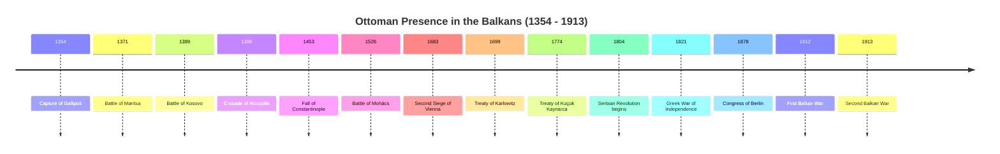

> [!abstract] Table of Contents
> - [[#1. Introduction and Geopolitical Context]]
> - [[#2. The Early Conquests (1354-1453)]]
>   - [[#Key Military Engagements of the Early Expansion]]
> - [[#3. Consolidation and Administration (1453-1566)]]
> - [[#4. The Devshirme System and Janissaries]]
>   - [[#The Origins and Legal Mechanisms of the "Blood Tax"]]
>   - [[#The Mechanics of Recruitment]]
>   - [[#The Journey, Conversion, and Severance]]
>   - [[#The Rigorous Training Regime]]
>   - [[#The Janissary Corps: The Sultan's Elite Infantry]]
>   - [[#The Paradox of Socio-Political Impact in the Balkans]]
>   - [[#Evolution, Stagnation, and Decline]]
> - [[#5. The Millet System and Religious Dynamics]]
> - [[#6. Economic and Cultural Integration]]
>   - [[#Urbanization and the Mechanics of the Ottoman City]]
>   - [[#Trade Routes and the Imperial Economy]]
>   - [[#Architectural Legacy: The Infrastructure of Empire]]
>   - [[#Cultural Synthesis: The Utility of Cuisine and Language]]
> - [[#7. The Period of Stagnation and Rebellions (1566-1800)]]
> - [[#8. The Rise of Nationalism and the Eastern Question (1800-1878)]]
>   - [[#The Serbian Revolution (1804–1835)]]
>   - [[#The Greek War of Independence (1821–1830)]]
>   - [[#The Intervention of the Great Powers]]
>   - [[#The Crimean War and the Illusion of Reform]]
>   - [[#The Great Eastern Crisis (1875–1878)]]
>   - [[#The Treaty of San Stefano and the Congress of Berlin]]
> - [[#9. The Balkan Wars and Ottoman Retreat (1878-1913)]]
>   - [[#Causes and Effects of the Balkan Wars (1878-1913)]]
> - [[#10. Legacy and Long-Term Impact on the Balkans]]
>   - [[#10.1 Linguistic Legacy: The Proliferation of Turkisms]]
>   - [[#10.2 Culinary Heritage: The Shared Table]]
>   - [[#10.3 Architectural and Urban Morphology]]
>   - [[#10.4 Socio-Religious Shifts and Demographic Persistence]]
>   - [[#10.5 Geopolitical Memory and the "Neo-Ottoman" Horizon]]

**Metadata:**
- Creation Date: 2026-04-01
- - -
## 1. Introduction and Geopolitical Context

**Introduction to the Balkans**
The Balkan Peninsula, known in Ottoman administrative terminology as *Rumelia* (meaning "Land of the Romans"), served as the most vital geopolitical theater of the Ottoman Empire for nearly six centuries. Stretching from the rugged coastlines of the Adriatic and Ionian seas in the west to the Black Sea in the east, and from the Danube and Sava rivers in the north down to the Peloponnesian peninsula in the south, the region constituted the physical, strategic, and cultural bridge between Europe and Asia. For the Ottoman state, which originated in the late 13th century as a frontier principality (*beylik*) in northwestern Anatolia, the Balkans were never merely a peripheral zone of conquest. Instead, Rumelia quickly became the empire's economic powerhouse, its primary recruiting ground for military and administrative elites, and the central staging area for its continuous projection of power into Central Europe and the broader Mediterranean basin. The region's diverse topography of mountain ranges, river valleys, and coastal plains dictated the avenues of military campaigns and the flow of international trade, making its control a paramount strategic imperative for the Sublime Porte in Constantinople.

**Pre-Ottoman Geopolitical Landscape**
To comprehend the extraordinary speed and depth of Ottoman penetration into the Balkans, one must examine the profound geopolitical fragmentation of the region in the mid-14th century. The once-mighty Byzantine Empire had been reduced to a fractured shadow of its former self, devastated initially by the Fourth Crusade in 1204 and subsequently exhausted by incessant, debilitating civil wars that drained its treasury and manpower. The Serbian Empire, which had briefly emerged as a dominant regional power under Stefan Dušan, fragmented almost immediately upon his death in 1355, devolving into squabbling principalities. The Second Bulgarian Empire was similarly divided into rival, weakened tsardoms centered in Tarnovo and Vidin. Meanwhile, the maritime republics of Venice and Genoa aggressively pursued their own commercial interests along the coastlines and Aegean islands, establishing fortified trading posts but often prioritizing mercantile profit over the territorial defense of the mainland.

This profound power vacuum provided the Ottomans with an unparalleled strategic opportunity. Unlike the relatively unified and deeply entrenched monarchies of Western Europe, the Balkans presented a chaotic mosaic of warring despotates, principalities, and duchies. The early Ottomans exploited these deep divisions with documentary precision, utilizing a sophisticated combination of military coercion, strategic diplomatic marriages, and favorable vassalage agreements. They frequently intervened in local civil conflicts, initially arriving on the European continent as invited mercenaries for competing Byzantine factions before establishing their own permanent territorial footholds.

**The Initial Foothold and Expansion (1354–1453)**
The pivotal moment in Ottoman-Balkan history occurred in 1354, when a devastating earthquake destroyed the defensive walls of Gallipoli (Gelibolu) on the Dardanelles. Ottoman forces under the command of Süleyman Pasha, who had already been operating in Thrace as allies to the Byzantine Emperor John VI Kantakouzenos, swiftly occupied the ruined fortress. This opportunistic seizure secured a permanent, fortified bridgehead on the European continent, effectively bypassing the heavily defended Byzantine capital of Constantinople and opening the Thracian plains to Ottoman expansion.

From Gallipoli, the Ottoman advance was both systematic and relentless. Rather than relying solely on outright conquest and the displacement of local elites, early Ottoman rulers such as Murad I and Bayezid I employed a highly pragmatic strategy of gradual assimilation. They successfully incorporated segments of the local Christian nobility into the Ottoman military structure as vassal lords (*uc beyleri*), allowing them to retain their hereditary lands and status in exchange for military service, loyalty, and the payment of tribute. This approach neutralized potential resistance, minimized the administrative burden on the nascent Ottoman state, and provided the sultans with crucial local topographical knowledge and experienced heavy cavalry.

A series of key military engagements rapidly formalized Ottoman hegemony across the peninsula. The Battle of Maritsa in 1371 shattered the southern Serbian nobility, opening the strategic routes into Macedonia and beyond. The seminal Battle of Kosovo in 1389 effectively destroyed the independent Serbian state, reducing it to vassalage, although both sides suffered catastrophic losses, including the battlefield deaths of both Prince Lazar of Serbia and Sultan Murad I. The Crusade of Nicopolis in 1396, a massive pan-European military effort designed to halt the Ottoman advance, ended in a decisive and crushing Ottoman victory, solidifying their undisputed control over Bulgaria and the lower Danube region. By the time Mehmed the Conqueror successfully besieged and captured Constantinople in 1453, the Ottomans had already encircled the ancient city with a vast, pacified Balkan hinterland, making the fall of the Byzantine capital a geopolitical inevitability.

**Consolidation and the Pax Ottomana (1453–1683)**
Following the fall of Constantinople, the Balkans officially transitioned from an active frontier zone to the undisputed imperial core. The 15th and 16th centuries marked the absolute zenith of Ottoman power, an era often referred to retrospectively by historians as the *Pax Ottomana*. The entire region was systematically organized into the Eyalet of Rumelia, governed by a *Beylerbey* (Governor-General) stationed in Sofia or Monastir, who traditionally held higher prestige and rank than his Anatolian counterpart, reflecting the region's paramount importance to the imperial treasury and military apparatus.

The geopolitical consolidation of the Balkans was underpinned by highly effective, centralized socio-economic and administrative institutions. The *Timar* system, a complex land-tenure arrangement, distributed the right to collect agricultural tax revenue to provincial cavalrymen (*sipahis*) in direct exchange for military service. This ingenious system ensured local security, maintained agricultural productivity, and fielded a massive army without the need for a centralized treasury to issue direct payouts.

Simultaneously, the *Devshirme* system—the periodic levy of adolescent Christian boys from the rural Balkans—provided the empire with a fiercely loyal, highly trained, and completely dependent cadre of elite Janissaries (infantry) and high-level administrators. Many of the empire's greatest architects, generals, and grand viziers, such as the legendary Sokollu Mehmed Pasha, were of Balkan origin. This system, while inherently coercive and deeply resented by the subject populations, created a unique, centralized meritocracy that paradoxically integrated the conquered rural populations into the absolute highest echelons of the imperial apparatus, effectively stripping the native nobility of their traditional power base.

Religious and communal life was meticulously governed by the *Millet* system, which granted significant legal and cultural autonomy to non-Muslim communities (*dhimmis*). The Orthodox Patriarchate in Constantinople was deliberately elevated by the Sultans to a position of civil and religious authority over all Orthodox Christians in the empire, effectively making the Church an administrative arm of the Ottoman state responsible for tax collection and internal policing. This institutionalized tolerance, dictated by Islamic jurisprudence and pragmatic necessity, prevented widespread, unified religious rebellions and facilitated the relatively smooth governance of a deeply heterogeneous, multi-ethnic population.

**The Strategic Buffer and the Habsburg Rivalry**
Geopolitically, the Balkans served as the primary, heavily militarized theater for the centuries-long existential struggle between the Ottoman Empire and the Austrian Habsburg Monarchy. The great rivers of the north—the Danube and the Sava—became the natural, albeit highly porous and violently contested, frontiers of the empire. The Ottomans utilized the Balkan infrastructure to project power northward, turning the region into a vast staging ground for their logistically complex campaigns into Hungary and Austria. This aggressive forward defense culminated in the Battle of Mohács (1526), which utterly extinguished the independent Kingdom of Hungary, and the subsequent, terrifying Sieges of Vienna in 1529 and 1683.

To maintain this posture, the region was heavily fortified. An intricate network of strategic fortresses, garrisoned by permanent units of Janissaries and supported by local auxiliaries, stretched across the Danubian frontier. However, the geopolitical dynamic shifted fundamentally and irreversibly after the catastrophic failure of the Second Siege of Vienna in 1683 and the subsequent, exhausting War of the Holy League. The Treaty of Karlowitz in 1699 marked a watershed moment in European history: it was the first time the Ottoman Empire was forced to cede significant, long-held European territory, transferring Hungary and Transylvania to the Habsburgs, and the Peloponnese to the Republic of Venice. This treaty permanently altered the strategic reality of the continent. The Ottomans were definitively no longer an unstoppable, expanding force, and the Balkans slowly transitioned from a secure, prosperous imperial core to an increasingly vulnerable, heavily contested defensive buffer against encroaching European powers.

**The Long Retreat and the Rise of Nationalism (1699–1913)**
The 18th and 19th centuries witnessed the agonizing, gradual unraveling of Ottoman control in the Balkans, a process driven by a combination of internal systemic stagnation, economic decline, and aggressive external imperial pressures. The Russian Empire emerged as a formidable and persistent adversary, effectively utilizing its shared Orthodox Christian faith to justify repeated military and diplomatic interventions on behalf of the Balkan subject populations. Successive, bloody Russo-Turkish wars methodically chipped away at Ottoman territorial integrity and forced humiliating geopolitical concessions, most notably the Treaty of Küçük Kaynarca in 1774, which dangerously granted Russia the legal right to represent and protect Orthodox Christians within the borders of the Ottoman state.

Simultaneously, the widespread dissemination of Western Enlightenment ideals and the explosive political concepts of the French Revolution catalyzed the rapid rise of modern ethno-nationalism among the diverse Balkan peoples. The rigid, religion-based socio-economic structures of the empire, which had once been sources of enduring stability, became increasingly obsolete, inefficient, and perceived as purely oppressive in the face of rapidly modernizing European trends. The Serbian Revolution (1804–1815) and the brutal Greek War of Independence (1821–1832) marked the first major, successful nationalist uprisings, resulting in the establishment of autonomous or fully independent nation-states carved directly out of Ottoman Rumelia.

The entirety of the 19th century was characterized by a highly volatile and complex geopolitical game known in diplomatic circles as the "Eastern Question." The Great Powers of Europe—primarily Great Britain, France, Russia, and Austria-Hungary—engaged in a delicate, often cynical balancing act. They attempted to actively manage the decline of the Ottoman Empire (derisively termed the "Sick Man of Europe") in order to maintain the global balance of power and prevent any single rival—particularly the Russian Empire—from gaining a dominant, unassailable position in the Balkans and securing control over the strategically vital Turkish Straits.

The Congress of Berlin in 1878, convened following another disastrous Russo-Turkish war, drastically and arbitrarily redrew the political map of the Balkans. It officially recognized the full, legal independence of Serbia, Montenegro, and Romania, and established a large, autonomous Bulgarian principality. Consequently, the direct Ottoman presence was effectively reduced to the restive provinces of Macedonia, Albania, and Thrace. The final, violent expulsion of the Ottoman Empire from its historic European heartland occurred during the devastating Balkan Wars of 1912-1913. In these conflicts, an unprecedented coalition of former Ottoman vassal states united their military forces to drive the overextended imperial armies out of the peninsula, leaving the Ottomans with only the small, heavily defended geographic foothold of Eastern Thrace, which constitutes the modern borders of European Turkey today.

**Conclusion of the Geopolitical Context**
The Ottoman presence in the Balkans constituted a defining epoch in both European and Middle Eastern history. It was far more than a mere military occupation; it was a profound, centuries-long integration that fundamentally reshaped the demographic, cultural, and political landscape of the entire region. The enduring geopolitical consequences of this era—the establishment of distinct, often overlapping religious and ethnic boundaries, the complex legacy of imperial administrative and economic structures, and the deeply traumatic process of imperial contraction and violent nation-state formation—continue to reverberate through the politics and societies of the Balkan Peninsula to this day. The long, agonizing transition from the height of the *Pax Ottomana* to the violent, chaotic unraveling of the 19th and early 20th centuries starkly illustrates the fundamental vulnerability of a traditional, multi-ethnic, pre-modern empire when forced to confront the relentless dual forces of modern, exclusive nationalism and industrialized, predatory great-power competition.

- - -

## 2. The Early Conquests (1354-1453)

To understand the Ottoman penetration of the Balkan Peninsula, one must first discard the romanticized notions of an inexorable religious tidal wave. The expansion of the House of Osman was, in its essence, a masterclass in opportunistic statecraft, exploiting the structural weaknesses of neighboring polities while meticulously consolidating logistical and military advantages. The century spanning from the serendipitous acquisition of Gallipoli in 1354 to the monumental fall of Constantinople in 1453 represents a period of systematic territorial acquisition, wherein the Ottomans demonstrated a profound understanding of both the sword and the diplomatic ledger. They did not merely conquer; they integrated, divided, and systematically dismantled the Byzantine and Slavic hegemonies that had previously defined the region. This was an exercise in pure power dynamics, driven by a pragmatic recognition that an empire's vitality is sustained only through perpetual, calculated expansion. 

The prologue to this century of conquest occurred not through a grand, premeditated campaign, but through the astute exploitation of Byzantine internal strife. In 1354, an earthquake devastated the walls of the fortress at Gallipoli (Gelibolu), situated on the European side of the Dardanelles. The Ottoman forces, under the command of Süleyman Pasha, son of Orhan I, had been previously invited into Thrace as mercenaries by the Byzantine Emperor John VI Kantakouzenos to assist in his civil war. When the earthquake struck, the Ottomans recognized the strategic imperative of securing a permanent foothold on the European continent. They swiftly occupied the ruined fortress, fortified it, and refused Byzantine demands for its return. This singular event fundamentally altered the geopolitical calculus of the Mediterranean. Gallipoli became the bridgehead, the vital logistical artery through which Anatolian manpower could flow unhindered into the Balkans. It was a textbook demonstration of recognizing and seizing a fleeting strategic advantage, transforming a temporary mercenary deployment into a permanent territorial anchor.

The political landscape of the Balkans in the mid-fourteenth century provided an exceptionally fertile ground for an ascendant military power. The Byzantine Empire, once the undisputed hegemon of the East, had been reduced to a fractured, impoverished shadow of its former self, consumed by endless dynastic struggles and theological disputes. The Serbian Empire, which had briefly flourished under Stefan Dušan, immediately disintegrated into a patchwork of squabbling principalities following his death in 1355. Bulgaria, similarly, was fragmented into rival tsardoms at Tarnovo and Vidin, alongside the semi-independent Despotate of Dobruja. 

This fragmentation was the ultimate strategic gift to the Ottomans. Murad I, who succeeded Orhan, understood that a unified Balkan resistance would be insurmountable. Therefore, his strategy relied on preventing such unity. The Ottomans employed a sophisticated blend of direct military confrontation and coercive diplomacy. They utilized the *ghazi* tradition—the ethos of holy war—to motivate their light cavalry (*akinji*), which conducted devastating raids deep into enemy territory, degrading the economic base and psychological resolve of the target populations. Concurrently, they offered vassalage to local Christian lords. Those who submitted were permitted to retain their lands and faith in exchange for tribute (*haraç*) and military service. This pragmatic approach allowed the Ottomans to absorb the military capacities of the conquered territories, effectively turning the Balkans' own resources against it. It was a strategy of divide and conquer, executed with ruthless efficiency.

The military milestones of this era are testament to the efficacy of the Ottoman war machine and the fatal disunity of their adversaries. The Battle of Maritsa in 1371 stands as a defining moment. A coalition of Serbian lords, attempting to preemptively strike the Ottoman forces in Thrace, was caught entirely off guard during a night attack by a significantly smaller Ottoman contingent under Lala Şahin Pasha. The resulting slaughter effectively neutralized the southern Serbian principalities, opening Macedonia and parts of Greece to direct Ottoman control or vassalage. It was a stark lesson in the necessity of military discipline and the fatal consequences of underestimating an adversary.

Following Maritsa, the Ottoman advance pushed deeper into the central Balkans, culminating in the legendary Battle of Kosovo in 1389. Here, an alliance of Serbian, Bosnian, and Albanian forces, led by Prince Lazar Hrebeljanović, met the army of Murad I on the "Field of Blackbirds." The battle was exceptionally bloody and resulted in the deaths of both commanders—Murad was assassinated, allegedly by the Serbian knight Miloš Obilić, and Lazar was captured and executed. While tactically a pyrrhic victory or perhaps a draw, the strategic outcome was definitively Ottoman. The Serbian nobility was decimated, their demographic and economic capacity shattered, while the Ottomans, possessing a vast reserve of manpower in Anatolia, could readily absorb their losses. The battle cemented Ottoman suzerainty over the Serbian lands, reducing them to vassal states obligated to provide formidable heavy cavalry for future Ottoman campaigns.

> [!quote]- A Byzantine Perspective on the Ottoman Advance
> "They have occupied the whole of the East, from the borders of Persia to the Hellespont... Now they have crossed over into Europe, as if they were moving from one house of their own to another, and have enslaved everything, while we sit and watch... We are like men who are asleep, or rather, we are dead."
> — Demetrios Kydones, Byzantine diplomat and scholar, reflecting on the helplessness of the fragmented Christian states in the face of the systematic Ottoman expansion (circa late 14th century).

The rapid Ottoman expansion inevitably provoked a response from Western Christendom, culminating in the Crusade of Nicopolis in 1396. King Sigismund of Hungary, recognizing the existential threat posed by the Ottoman presence on the Danube, organized a massive pan-European crusading army, comprising heavily armored knights from France, Burgundy, Germany, and Wallachia. They laid siege to the Ottoman fortress of Nicopolis. Sultan Bayezid I (the Thunderbolt), demonstrating the rapid mobilization capability of his forces, lifted the siege of Constantinople and marched to meet the Crusaders. The ensuing battle was a catastrophic defeat for the Europeans. The undisciplined, glory-seeking charges of the French knights were absorbed by the Ottoman light infantry and stakes, before being enveloped and annihilated by the disciplined Sipahi cavalry and the elite Janissary corps. Nicopolis shattered the illusion that a traditional Western crusading army could effortlessly dislodge the Ottomans from Europe. It solidified Ottoman control over Bulgaria and firmly established the Danube as the frontier between the Islamic empire and Central Europe.

The trajectory of conquest was abruptly, though temporarily, halted in 1402 at the Battle of Ankara, where the Central Asian conqueror Timur (Tamerlane) annihilated Bayezid's army and captured the Sultan himself. The ensuing Ottoman Interregnum (1402-1413) plunged the empire into a devastating civil war among Bayezid's sons. By all historical precedents, the empire should have fractured permanently. However, the survival of the Ottoman state during this crisis is perhaps its most impressive achievement. The Christian vassal states in the Balkans, heavily integrated into the Ottoman system and wary of Hungarian or Venetian domination, largely chose to support one Ottoman prince over another rather than mount a unified rebellion. The administrative apparatus, built on pragmatic taxation and the *timar* system of land grants, proved remarkably resilient. When Mehmed I emerged victorious and reunited the state, he inherited an empire bruised but structurally intact. The Interregnum demonstrated that the Ottoman presence in the Balkans was no longer a superficial military occupation, but a deeply rooted political and economic reality.

The final phase of this early period saw the resumption of offensive operations and the systematic elimination of remaining pockets of resistance, isolating the ultimate prize: Constantinople. Under Murad II and his son Mehmed II, the Ottomans fortified their control over the Peloponnese and Serbia. The last significant, coordinated effort to expel them from the Balkans materialized in the Crusade of Varna in 1444. A coalition led by Władysław III of Poland and Hungary, alongside the legendary military commander John Hunyadi, marched towards the Black Sea. Murad II, who had previously abdicated, returned to lead the Ottoman forces. At Varna, the Crusader army was decisively defeated, and King Władysław was killed in battle. 

The victory at Varna was the death knell for the Byzantine Empire. With the Balkans secured, the Hungarians neutralized, and Western Europe embroiled in its own conflicts, Constantinople was entirely encircled. The city, a once-glorious metropolis now reduced to a depopulated enclave behind massive but aging walls, was a geopolitical anomaly entirely reliant on the sufferance of the Ottomans. The century of early conquests had methodically stripped away the empire's buffer zones, its allies, and its resources. By 1453, the Ottoman state possessed the demographic weight, the logistical sophistication, and the centralized command structure necessary to undertake the final siege. The fall of Constantinople was not merely a military triumph; it was the inevitable culmination of a century of calculated, pragmatic statecraft that had transformed a small Anatolian beylik into an intercontinental empire.

### Key Military Engagements of the Early Expansion

| Battle | Year | Adversaries | Strategic Outcome |
| :--- | :---: | :--- | :--- |
| **Maritsa** | 1371 | Serbian Coalition | Decisive Ottoman victory; opened Macedonia and Greece to expansion; Southern Serbian lords forced into vassalage. |
| **Kosovo** | 1389 | Serbian-Led Coalition | Tactical draw / Pyrrhic Ottoman victory; Strategic Ottoman triumph resulting in the decimation of independent Serbian power. |
| **Nicopolis** | 1396 | Pan-European Crusade | Decisive Ottoman victory; shattered Western crusading efforts; solidified control over Bulgaria and the Danubian frontier. |
| **Varna** | 1444 | Hungarian-Polish Crusade | Decisive Ottoman victory; ended coordinated Western attempts to expel the Ottomans; completely isolated Constantinople. |

- - -

## 3. Consolidation and Administration (1453-1566)

The capture of Constantinople in 1453 did not merely provide the Ottoman Empire with a new capital; it fundamentally shifted the geometric center of imperial power. The Balkans, collectively administered as the province of Rumelia, transitioned from a turbulent frontier of expansion into the indispensable demographic, military, and economic core of the empire. The period following 1453, culminating in the death of Suleiman the Magnificent in 1566, represents the zenith of Ottoman administrative efficiency. During this era, the state consolidated its conquests not solely through the application of brute military force, but through the implementation of a highly organized, pragmatic, and ruthless system of governance. This administrative apparatus was meticulously designed to extract resources, maintain internal order, mobilize vast armies, and integrate diverse, multi-ethnic populations under the overarching authority of the Sultan.

The governing philosophy of the Ottoman state during its classical age was defined by a calculating pragmatism. The primary imperatives of the empire were fiscal extraction and military mobilization. The Ottomans possessed no immediate ideological compulsion to eradicate local customs, languages, or religions, provided these elements did not impede the mechanics of state control. Instead, they superimposed their bureaucratic framework over existing socio-political structures where advantageous, or entirely dismantled and replaced them when they posed a threat. Central to this strategy was the principle of *istimalet* (accommodation and conciliation). The state frequently extended measured privileges and tax exemptions to local elites and communities who submitted willingly to Ottoman authority, thereby neutralizing resistance and drastically minimizing the logistical and financial costs of long-term military occupation.

At the macro level, the empire was partitioned into vast provinces known as *eyalets* (or *beylerbeyliks*). Each *eyalet* was governed by a *beylerbey* (commander of commanders), an official of immense authority who answered directly to the imperial center. The Eyalet of Rumelia, encompassing the majority of the Balkan Peninsula, was the first, largest, and most prestigious of all Ottoman provinces. The *beylerbey* of Rumelia, initially seated in Edirne and later in Sofia, functioned as a viceroy, often outranking the *beylerbey* of Anatolia in the imperial hierarchy. The *eyalet* operated as a massive military-administrative zone, its primary function being the coordination of the provincial cavalry forces and the preservation of regional stability across the European territories.

As the empire’s borders expanded deeper into Europe throughout the sixteenth century, the sheer vastness of the Rumelian Eyalet necessitated further administrative subdivision. New eyalets, such as Buda (established to manage central Hungary following its conquest) and later Bosnia, were carved out to manage the increasingly complex frontiers. Nevertheless, throughout the 1453-1566 period, the core of Rumelia remained the undisputed administrative engine of the Ottoman Balkans. The governance of these *eyalets* was characterized by an uncompromising, strict hierarchical chain of command. The lines of authority radiated outward from the Topkapi Palace in Istanbul directly to the provincial capitals, ensuring that the periphery remained tightly tethered to the center and preventing the emergence of independent regional power bases.

Beneath the *eyalet* lay the mid-level administrative division: the *sanjak* (literally translating to "banner" or "flag"). Each *eyalet* was composed of several *sanjaks*, governed by a *sanjakbey*. The *sanjak* constituted the fundamental, operational building block of Ottoman provincial administration. The *sanjakbey* was predominantly a military commander, tasked with the crucial responsibility of mustering and leading the local provincial cavalry forces (*sipahis*) during imperial campaigns. However, his mandate extended beyond warfare; he possessed significant administrative and executive duties, responsible for executing sultanic decrees and maintaining public order. Demonstrating characteristic Ottoman pragmatism, the geographical boundaries of the *sanjaks* often roughly mirrored pre-Ottoman political configurations or natural geographic divisions, a deliberate strategy to utilize existing frameworks and facilitate a smoother transition of power.

The authority of the *sanjakbey*, while substantial, was deliberately constrained by the imperial center to prevent the consolidation of autonomous warlordism. His executive and military power was systematically checked by the *kadi* (the Islamic judge), who represented the legal and religious authority of the state. This strict separation of military-executive power from judicial power was a defining hallmark of Ottoman statecraft. Furthermore, the central government employed a policy of frequent rotation for the *sanjakbeys*. By routinely transferring these governors between different provinces, the state actively prevented them from establishing deep, independent political or economic roots in any single region, ensuring that their primary loyalty remained undivided and directed solely toward the Sultan in Istanbul.

The foundational micro-level division, and the undisputed economic engine of the Ottoman military apparatus in the Balkans, was the *timar* system. This was a sophisticated system of pre-bendal land tenure. The Ottoman state theoretically claimed ownership of all arable land (*miri*). Under the *timar* system, the state granted the revenues of a specific, clearly defined parcel of land to a cavalryman (a *sipahi*) in direct exchange for his military service. A *timar* was a fief, yet it differed fundamentally from Western European feudalism; it did not grant the *sipahi* political, judicial, or seigniorial rights over the peasantry residing on the land, nor was the grant inherently hereditary. The *sipahi* merely possessed the delegated right to collect specific, legally mandated taxes in cash and kind from the peasant cultivators (*reaya*).

The mechanics of the *timar* system were strictly regulated based on military utility. The assessed revenue value of the *timar* dictated the specific military obligations of the *sipahi*. A standard *timar* grant required the holder to equip himself, maintain a horse, and report for military campaigns whenever summoned by his *sanjakbey*. Larger and more lucrative land grants, classified as *zeamets* and *hasses*, were bestowed upon higher-ranking military and administrative officials. These larger grants required the holder to bring a proportionate number of additional, fully equipped armed retainers (*cebelu*) to the battlefield. This ingenious system allowed the Ottoman Empire to maintain a massive, decentralized, and highly responsive standing army without the necessity of a complex cash economy or the burden of a massive central treasury dispensing regular wages. During peacetime, the *sipahis* resided on their assigned lands, maintaining local security, suppressing banditry, and ensuring the continuity of agricultural production, which in turn funded their military readiness.

For the Balkan peasantry, the imposition of the *timar* system frequently represented a rationalization and standardization of agrarian taxation, particularly when contrasted with the arbitrary and often capricious exactions of the fragmented local nobility that preceded Ottoman rule. The Ottoman state promulgated detailed secular law codes (*kanunnames*) that explicitly codified the exact taxes the *sipahi* was legally permitted to extract. This legal framework offered the peasantry a crucial degree of protection against extreme exploitation. This relative predictability and standardization, characteristic of the classical period (1453-1566), contributed significantly to agricultural stability and a broader demographic recovery in many regions of the Balkans following the destructive wars of conquest. Moreover, the *timar* system initially proved highly adaptable; the Ottomans readily incorporated many pre-existing Christian nobility (such as former Byzantine *pronoia* holders) into the system, granting them *timars* in exchange for their loyalty and military service, thereby co-opting potential resistance and smoothing the transition to imperial rule.

Operating parallel to the military-administrative hierarchy of the *beylerbey*, *sanjakbey*, and *sipahi* was the judicial administration, presided over by the *kadi*. The *kadi* districts (*kazas*) represented the judicial map of the empire, and their boundaries did not always align perfectly with the military *sanjaks*. The *kadi* was responsible for administering justice based on a dual legal system: *Sharia* (Islamic religious law) and *Kanun* (Sultanic secular law). Crucially, the *kadi* served as the direct, accessible link between the local populace and the imperial center. Peasants possessed the right—and frequently exercised it—to petition the *kadi* directly to report abuses or illegal taxation by the *sipahis* or even the *sanjakbeys*. Beyond their judicial mandate, the *kadis* functioned as the indispensable local administrators for the central bureaucracy. They acted as notaries, registrars, and overseers of market regulations, guild operations, and the equitable assessment of extraordinary taxes.

The sheer effectiveness of the Ottoman administrative machine relied entirely upon relentless, rigorous data collection. Upon the conquest of a new territory, and at regular intervals thereafter, the state dispatched bureaucratic commissions to conduct exhaustive cadastral surveys. The results were compiled into the *tahrir defterleri* (tax registers). These meticulously maintained registers recorded the details of every village, every household, every adult male taxpayer, and the estimated agricultural yield and specific tax obligations of the entire region. This monumental bureaucratic effort provided the central government with the precise granular data necessary to allocate *timars* accurately, project future tax revenues, and monitor demographic shifts. The *tahrir* process was the absolute informational bedrock upon which the entire edifice of Eyalets, Sanjaks, and Timars rested, standing as a testament to the highly centralized and rationalized nature of the Ottoman state during its golden age.

By the conclusion of Suleiman the Magnificent's reign in 1566, the Ottoman administrative architecture in the Balkans had achieved its most mature, sophisticated, and effective form. The synergistic combination of macro-level *eyalet* coordination, mid-level *sanjak* military mobilization, the localized economic engine of the *timar* system, and the independent judicial oversight of the *kadis* created a formidable and highly resilient imperial framework. This system successfully integrated the vast, geographically fragmented, and ethnically diverse landscape of the Balkans into the Ottoman sphere. It methodically transformed a volatile, newly conquered frontier into the unassailable demographic and economic core of a global empire. The inherent pragmatism of the system, the deliberate checks and balances instituted between military commanders and judicial authorities, and the encompassing web of detailed bureaucratic surveillance allowed the Ottomans to consolidate their absolute power and project their military influence deep into the heart of Central Europe for centuries.

- - -

## 4. The Devshirme System and Janissaries

Of all the institutions established by the Ottoman Empire in the Balkans, none was as profoundly consequential, emotionally charged, or administratively unique as the *devshirme*—often referred to in the Christian historiography of the region as the "blood tax" or "child levy." To comprehend the sheer operational genius and the simultaneous human tragedy of the Ottoman imperial apparatus, one must examine this system of human conscription. The devshirme was not merely a mechanism for military recruitment; it was a sophisticated engine of social engineering, designed to bypass the traditional entrenched Turkish aristocracy and create a loyal, meritocratic class of administrators and elite soldiers whose sole allegiance was to the person of the Sultan.

### The Origins and Legal Mechanisms of the "Blood Tax"

The practice of devshirme emerged in the late 14th century, primarily during the reign of Sultan Murad I, though it was formalized and expanded under his successors, particularly Bayezid I and Mehmed the Conqueror. The Ottoman state, expanding rapidly into the Christian Balkans, required a standing, professional army to complement its traditional Turkic cavalry (*sipahis*). Furthermore, the Sultans sought a counterweight to the powerful, independent Turkish noble families whose influence threatened the centralization of imperial power. The solution was found in the *kul* system—the institution of imperial slavery.

Under classic Islamic law (*Sharia*), the enslavement of *dhimmis* (protected non-Muslim subjects of the state) who had submitted to Islamic rule and paid the *jizya* tax was generally prohibited. The Ottomans, however, developed a unique juridical rationalization for the devshirme. It was argued that the right of conquest granted the Sultan a specific prerogative over a portion of his newly conquered subjects, or alternatively, that the devshirme was a specialized form of taxation exacted in human capital rather than currency or agricultural produce. This legal maneuvering allowed the state to periodically levy young boys from the Christian populations of the Balkans, primarily targeting Serbs, Bosnians, Croats, Albanians, Greeks, and Bulgarians.

### The Mechanics of Recruitment

The recruitment process was systematic and cyclical, typically occurring every three to seven years, depending on the manpower needs of the empire. An imperial edict would be issued, dispatching specially appointed Janissary officers, known as *turnacibashi* or *yayabashi*, to specific regions in the Balkans. These officers were armed with detailed registers provided by local judges (*kadis*) and village headmen (*kocabashis*), which documented the demographic composition of each village.

The criteria for selection were stringent. The target demographic consisted of boys generally between the ages of eight and eighteen, though the ideal age was often considered to be around twelve to fourteen. The officers sought physical perfection, robust health, and signs of high intelligence. Boys who were too tall, too short, physically blemished, or deemed excessively talkative were routinely rejected. The state also enforced specific exemptions to ensure the economic survival of the conquered territories: an only son was typically spared, as was the son of a village headman, married boys, or those who already possessed a specialized trade. The goal was to extract prime human capital without collapsing the agrarian foundation of the Balkan provinces.

The psychological impact of the devshirme on the Balkan populations was profound and traumatic. It was a visceral demonstration of subjugation. Families resorted to desperate measures to protect their sons; some arranged early marriages, others mutilated their children to render them ineligible, and some attempted to bribe the recruiting officers. Folk songs and oral traditions from the Balkans are replete with laments mourning the loss of sons taken to the distant imperial capital, recognizing that they were lost to their families and their faith forever.

### The Journey, Conversion, and Severance

Once collected, the boys, clad in distinctive red garments to prevent escape, were organized into groups of a hundred or more and marched overland to Constantinople or other administrative centers like Edirne or Bursa. This journey marked the definitive severance of their past lives. Upon arrival, the boys were immediately circumcised and formally converted to Islam. They were given new, Islamic names, legally and symbolically erasing their former Christian identities.

This conversion was the foundational step in their transformation from Balkan peasants into *kuls*—slaves of the Sultan. However, it is crucial to understand that "slavery" in this specific Ottoman context did not equate to the chattel slavery of the Atlantic world. The *kul* was the exclusive property of the Sultan, a status that paradoxically conferred immense power, prestige, and opportunity. They were removed from the localized feudal hierarchies and placed directly into the imperial center, where their social mobility was limited only by their own abilities and the favor of the monarch.

### The Rigorous Training Regime

Following their conversion, the recruits underwent a rigorous sorting process that determined their ultimate trajectory within the empire. The most intellectually gifted and physically flawless boys—usually a small fraction of the total levy—were selected for the *Enderun*, the prestigious palace school situated within the Topkapi Palace itself. Here, they received an elite education encompassing Islamic theology, Arabic and Persian literature, mathematics, calligraphy, music, and statecraft, alongside advanced physical and martial training. These individuals were destined for the highest echelons of the Ottoman government, serving as provincial governors, viziers, and even Grand Viziers.

The vast majority of the recruits, however, were designated as *Acemi Oglanlar* (foreign boys or novice boys). They were sent to work on agricultural estates in Anatolia or assigned to labor on public works projects, shipyards, or in the gardens of the Sultan. This period of arduous physical labor served a dual purpose: it toughened the boys physically while immersing them entirely in Turkish language, culture, and Sunni Islamic practice. After several years of this foundational conditioning, the *Acemi Oglanlar* were recalled to the capital to begin their formal military training in the barracks.

### The Janissary Corps: The Sultan's Elite Infantry

Those who successfully completed the *Acemi Oglan* training were formally inducted into the *Yeniçeri* (New Soldier) corps, known in the West as the Janissaries. The Janissaries were the premier standing infantry of the Ottoman Empire and one of the first modern standing armies in Europe. They were a highly disciplined, uniformly equipped, and salaried force that served as the shock troops of the Ottoman expansion.

The ethos of the Janissary corps was defined by intense *esprit de corps* and absolute, fanatical devotion to the Sultan, whom they regarded as their father and provider. They were housed in monumental barracks in Constantinople and other strategic cities, living a communal life governed by strict regulations. In their early and classic periods, Janissaries were strictly forbidden from marrying or engaging in commercial trades, ensuring that their loyalty remained entirely undivided. They were early adopters of firearms, mastering the use of the matchlock musket and the volley fire technique, which gave the Ottoman armies a decisive tactical advantage over the traditional cavalry-heavy armies of their European and Middle Eastern adversaries.

### The Paradox of Socio-Political Impact in the Balkans

The socio-political impact of the devshirme on the Balkans presents a profound historical paradox. From the perspective of the subjugated Christian communities, it was an institution of profound cruelty and oppression, an arbitrary expropriation of their most promising youth. It functioned as a mechanism of control, stripping the conquered populations of potential future leaders and warriors, thereby mitigating the risk of organized rebellion.

However, the system simultaneously created a bizarre, unintended avenue for upward mobility that tightly bound the Balkans to the imperial center. Because the Ottoman state operated as a pure meritocracy for its *kuls*, boys levied from impoverished Balkan villages could, and frequently did, rise to become the most powerful men in the world. The most famous example is Sokollu Mehmed Pasha, born a Serbian Orthodox Christian in Bosnia, who rose through the devshirme system to serve as Grand Vizier under three successive Sultans (Suleiman the Magnificent, Selim II, and Murad III), effectively ruling the empire at the absolute zenith of its power.

These high-ranking officials of Balkan origin often retained an awareness of their roots. While entirely loyal to the Ottoman state and the Islamic faith, they frequently directed imperial resources back to their homelands. They sponsored the construction of monumental architecture—bridges, mosques, caravanserais, and aqueducts—in the Balkans, such as the famous Mehmed Paša Sokolović Bridge in Višegrad. In some instances, they even intervened to protect the privileges of the Orthodox Church or to elevate their unconverted Christian relatives to positions of local authority. Consequently, the devshirme, while a tool of subjugation, also resulted in a significant degree of Balkan representation within the Ottoman ruling class.

### Evolution, Stagnation, and Decline

The devshirme system and the Janissary corps were not static institutions; they evolved significantly over the centuries, eventually becoming victims of their own success. By the late 16th and early 17th centuries, the strict regulations governing the corps began to erode. The prohibition on marriage was relaxed, allowing Janissaries to establish families and integrate into the urban socio-economic fabric. They began to engage in trade and commerce to supplement their incomes, diminishing their martial edge and discipline.

More critically, the composition of the corps shifted. Recognizing the prestige, steady salary, and tax exemptions associated with Janissary status, freeborn Turkish and Balkan Muslims began to bribe or pressure officials to admit their own sons into the corps, a practice that directly undermined the foundational principle of the devshirme as a levy of enslaved Christians. By the mid-17th century, the actual practice of levying Christian boys from the Balkans had largely ceased, effectively replaced by hereditary recruitment and the admission of free Muslims.

As the Janissaries evolved into an entrenched, hereditary socio-economic class, they transformed from the Sultan's loyal instrument into a formidable, reactionary political faction. They became the primary impediment to military and administrative modernization, frequently mutinying, deposing, and even assassinating Sultans who attempted to reform the empire or curb their privileges. The institution that had once been the vanguard of Ottoman expansion and the terrifying instrument of its presence in the Balkans eventually calcified, becoming a symbol of the empire's stagnation until their violent suppression and destruction by Sultan Mahmud II in 1826 during the Auspicious Incident.

- - -

## 5. The Millet System and Religious Dynamics

To comprehend the astonishing endurance of the Ottoman Empire in the Balkans—a dominion spanning centuries over a fractured, mountainous mosaic of fiercely independent and diverse peoples—one must discard modern, sentimental notions of benevolence or tolerance. Instead, one must study the cold, brilliant mechanics of imperial administration. A prince who conquers a foreign land faces a fundamental, existential dilemma: how to rule those whose customs, languages, and gods differ profoundly from his own. To attempt the forced assimilation or physical annihilation of millions is a folly that exhausts the treasury, incites ceaseless rebellion, and ultimately ruins the state. The Ottoman sultans, demonstrating a profound mastery of statecraft and an unsentimental understanding of human nature, recognized that the most efficient means of subjugation is not the perpetual deployment of the sword, but the calculated co-optation of the conquered peoples' own cherished institutions. This principle found its ultimate expression in the *millet* system, a masterpiece of political architecture that transformed the potential liabilities of religious diversity into a self-regulating, highly profitable engine of imperial stability.

At the foundation of this system lay the traditional Islamic legal concept of the *dhimmi*—the "protected" people of the Book. By Islamic law, Christians and Jews residing within the realm were granted the right to practice their faith, retain their communal properties, and manage their internal affairs. However, this protection was entirely conditional; it required submission to Muslim political supremacy and the payment of the *jizya*, a special poll tax levied exclusively on non-Muslim adult males. From the perspective of a pragmatic ruler, the *jizya* was far more than a religious obligation or a mark of submission; it was a highly lucrative, indispensable revenue stream that funded the vast Ottoman military machine and the imperial bureaucracy. Mass conversion of the Balkan peasantry to Islam would have, paradoxically, impoverished the state treasury by eliminating this vital tax base. Thus, the Sublime Porte possessed a vested, material interest in maintaining the Christian identity of the overwhelming majority of its European subjects. In the calculus of the Ottoman state, religious tolerance was not a moral virtue, but a fiscal and administrative utility of the highest order.

To manage these diverse populations without drowning the imperial administration in local, sectarian disputes, the Ottomans organized their subjects into *millets*, or religiously defined communities. The most significant and populous of these in the Balkans was the *Millet-i Rûm*, the Orthodox Christian community. Rather than dismantling the Orthodox Church, which had been the spiritual backbone and administrative skeleton of the vanquished Byzantine Empire, Sultan Mehmed the Conqueror astutely elevated it to an instrument of Ottoman statecraft. Upon conquering Constantinople, he recognized the Patriarch as the *millet-başi*, or ethnarch, granting him sweeping temporal as well as spiritual authority over all Orthodox Christians within the empire, regardless of their ethnic or linguistic background—be they Greek, Serbian, Bulgarian, or Vlach. 

This arrangement reveals a profound, almost cynical understanding of the mechanics of power. By investing the Patriarch and the higher Greek-speaking clergy with the authority to collect taxes for the Sultan, administer justice in civil matters such as marriage, divorce, and inheritance, and maintain public order among their flock, the Sultan effectively deputized the conquered elite to police their own people. The Orthodox Church hierarchy, enjoying immense privileges, wealth, and power guaranteed solely by the Ottoman state, became deeply, structurally invested in the preservation of the imperial status quo. They became the shepherds who kept the flock docile for the Ottoman wolves. Rebellions against the Sultan were now simultaneously rebellions against the Patriarch, who did not hesitate to wield the weapon of excommunication against those who disrupted the Pax Ottomana. The Ottomans achieved what every conqueror desires: the pacification of a vast, potentially hostile territory using the resources, authority, and personnel of the vanquished, thereby freeing the Ottoman military to focus on external expansion and the defense of the frontiers rather than endless internal policing.

However, the dynamics of religion in the Ottoman Balkans were not entirely static, nor were the subjects merely passive pieces on the sultan’s board. While the state did not generally pursue a policy of forced, mass conversion for the fiscal reasons outlined above, Islamization did occur, driven largely by the pragmatic calculations of the subjects themselves. In a society where Muslims constituted the ruling class and enjoyed distinct legal, social, and economic advantages, conversion offered a clear, established path to upward mobility. For ambitious individuals, embracing Islam was often the necessary price of admission to the highest echelons of the military and the imperial administration. Yet, in two specific, highly strategic regions of the Balkans—Bosnia and Albania—conversion to Islam occurred on a mass scale, fundamentally altering the demographic and political landscape of the peninsula. The reasons for these notable exceptions illuminate the deeply strategic nature of Ottoman expansion and the pragmatic adaptability of the local populations when faced with overwhelming power.

The case of Bosnia presents a fascinating study in political survival and the ruthless logic of the frontier. Prior to the definitive Ottoman conquest in the mid-fifteenth century, the Kingdom of Bosnia was a fragmented, mountainous realm plagued by intense religious strife and feudal anarchy. The population was torn between the aggressive influence of the Catholic Church, supported by the encroaching, predatory Kingdom of Hungary, the Orthodox Church to the east, and the indigenous, enigmatic Bosnian Church, which was considered heretical and relentlessly persecuted by both Rome and Constantinople. When the invincible Ottoman armies arrived, they encountered a local nobility that was alienated from the surrounding Christian powers, divided amongst itself, and acutely aware of the existential threat posed by Catholic Hungary, which sought to absorb their lands under the guise of crusade.

For the Bosnian elite, conversion to Islam was a masterful stroke of realpolitik, executed with a clarity of purpose that demands admiration. By embracing the faith of the supreme conqueror, the Bosnian nobles were able to retain their vast landholdings, preserve their feudal privileges over the peasantry, and seamlessly integrate into the Ottoman ruling apparatus as *sipahis* (cavalrymen) and provincial governors. The Ottomans, in turn, recognized the immense strategic value of creating a loyal, Muslim-dominated province on their most volatile and heavily contested frontier with the Habsburg Empire. The Islamization of Bosnia was thus a symbiotic, highly calculated transaction: the local elite secured their physical survival, their properties, and their local dominance, while the Empire secured a fiercely loyal, heavily armed bulwark. This martial frontier society would provide the Ottoman army with some of its most capable commanders, viziers, and shock troops for centuries. It was not the gentle persuasion of theology, but the brutal, unyielding logic of self-preservation and political alignment that transformed Bosnia into a formidable Muslim stronghold.

A parallel, yet distinct, dynamic unfolded in the rugged, unforgiving terrain of Albania. The Albanian tribes were renowned throughout the Mediterranean for their fierce independence, their martial prowess, and their deeply ingrained customary laws (*Kanun*), which often superseded formal religious affiliations. During the initial phases of the Ottoman conquest, Albanian resistance, most notably under the legendary commander Skanderbeg, was spectacularly fierce and inflicted heavy costs on the Sultan’s armies. However, following the eventual pacification of the region, the pragmatic, survivalist nature of the Albanian tribal structure began to assert itself within the new imperial reality.

In Albania, religion was frequently viewed less as an absolute, uncompromising spiritual commitment and more as a malleable aspect of political identity and tribal strategy. As the Ottoman Empire consolidated its absolute hold over the Balkans, conversion to Islam became a highly effective mechanism for ambitious Albanian clans to advance their interests, secure wealth, and gain leverage over rival tribes. Embracing Islam allowed Albanian chieftains to retain their vital local autonomy while simultaneously opening the doors to immense opportunities within the imperial capital. Albanians quickly gained a formidable reputation as exceptional soldiers, ruthless enforcers, and shrewd administrators, rising rapidly to the very highest ranks of the Ottoman government; indeed, dozens of Grand Viziers throughout Ottoman history were of Albanian descent, effectively ruling the empire in the Sultan's name. For the Albanian highlanders, the mosque was often a stepping stone to power, influence, and vast wealth within the imperial system. Furthermore, in regions where Catholic Venetian and Orthodox Slavic influences violently contested for dominance, conversion to Islam offered the Albanians a means of resisting the encroachment of their neighbors, firmly aligning themselves with the sole, undisputed superpower of the era.

In analyzing the religious dynamics of the Ottoman Balkans, one must conclude that the system was governed not by religious fanaticism or ideological rigidity, but by an unsentimental, calculating pragmatism. The Millet system was a sophisticated mechanism of control that recognized the utter futility of attempting to forcefully homogenize a vast, diverse empire. By brilliantly transforming the Orthodox Church into an administrative, tax-gathering arm of the state, the Ottomans maintained order with remarkable efficiency and minimal expenditure of their own blood and treasure. Simultaneously, they permitted, and quietly encouraged, the organic, strategically advantageous Islamization of key frontier regions like Bosnia and Albania, where the alignment of local ambitions with imperial necessities created fiercely loyal, martial populations that secured the empire's borders. The Ottoman sultans understood the fundamental Machiavellian truth: men are driven first and foremost by their interests, their property, and their security, not by their piety. By structuring an empire where it was in the material interest of the Christian hierarchy to maintain subservient order, and in the political interest of ambitious frontiersmen to convert and fight for the Sultan, the Ottomans forged a dominion that endured for over four hundred years in one of the most volatile, blood-soaked regions on earth. It was the ultimate triumph of calculated, ruthless utility over the constraints of ideological purity.

- - -

## 6. Economic and Cultural Integration

The incorporation of the Balkan Peninsula into the Ottoman Empire initiated a profound and centuries-long process of economic and cultural integration, driven not merely by incidental contact, but by the calculated pragmatism of imperial statecraft. Far from remaining a volatile, peripheral frontier, the region—designated by the Ottomans as Rumelia, or the "Land of the Romans"—was systematically engineered into a vital, thriving core of the imperial system. The period following the initial conquests, frequently characterized as the *Pax Ottomana*, imposed an unprecedented degree of hegemonic stability upon a region previously fractured by endemic, localized conflicts among fragmented medieval principalities. This enforced stability was the fundamental prerequisite for the sweeping urbanization, the revitalization of trans-regional trade networks, and the deep, utilitarian cultural synthesis that would irrevocably alter both the physical topography and the demographic reality of the Balkans.

### Urbanization and the Mechanics of the Ottoman City

Perhaps the most visible and immediate manifestation of Ottoman state consolidation was the deliberate and dramatic transformation of the Balkan urban landscape. The Ottoman apparatus was fundamentally an urban-centric civilization; its administrative, economic, and religious mechanisms demanded a network of well-developed, closely regulated cities to project authority and extract wealth. Pre-existing Byzantine and Slavic fortresses or modest market towns were systematically expanded, while entirely new municipalities were founded strategically to serve as administrative centers (sanjaks) and military garrisons.

The quintessential Ottoman city (*şehir*) developed according to a distinct spatial and social logic designed for control and efficiency. At its core lay the commercial and public center, the *čaršija* (bazaar), around which the residential neighborhoods, or *mahalles*, radiated outward. This physical layout reflected a broader, highly compartmentalized societal organization. The *mahalle* functioned as the primary unit of social organization and administrative accountability, typically centered around a place of worship—a mosque, church, or synagogue—and organized strictly along ethno-religious lines. This compartmentalization allowed the state to manage disparate populations efficiently while maintaining civic order.

The rapid urbanization of the Balkans was propelled by the institution of the *waqf* (pious endowment). Recognizing that the state treasury could not unilaterally fund total infrastructure, high-ranking Ottoman officials, viziers, and the sultans themselves established these endowments in perpetuity. The *waqf* system financed the construction and maintenance of religious complexes, markets, and public utilities, effectively outsourcing civic welfare while simultaneously cementing the prestige and legacy of the ruling elite. Through this mechanism, settlements such as Sarajevo (founded by the pragmatic Isa-Beg Ishaković), Belgrade, Skopje (Üsküp), and Sofia (Sofya) swelled in population and economic output. They became cosmopolitan hubs where Ottoman administrators, local merchants, artisans, and religious scholars intermingled, bound by the economic gravity of the imperial center.

### Trade Routes and the Imperial Economy

The integration of the Balkans into the vast Ottoman market—which, at its zenith, stretched from the Persian Gulf to the frontiers of Central Europe—sparked a calculated commercial renaissance. The imperial administration effectively dismantled the internal toll barriers and fragmented feudal jurisdictions that had previously stifled commerce. In their place, a unified, secure, and highly regulated imperial economic zone was established, designed to maximize the flow of goods and tax revenues.

Central to this economic integration was the revitalization and martial expansion of ancient trade arteries. The *Via Militaris* (the Diagonal Road), running from the capital at Istanbul through Edirne (Adrianople), Sofia, and Belgrade toward the Habsburg frontier, became the primary overland conduit. It served dual purposes: facilitating the rapid deployment of imperial armies and official couriers, while simultaneously supporting massive, lucrative merchant caravans. Similarly, the *Via Egnatia*, traversing the southern Balkans from the Adriatic coast to the Aegean, funneled the wealth of the Mediterranean into the imperial core.

The Ottoman state actively engineered the security of these routes. The *derbendci* system was implemented as a pragmatic solution to banditry: specific, strategically located villages were granted tax exemptions and privileges in direct exchange for guarding dangerous mountain passes and vulnerable stretches of road. This state-sponsored security allowed for the flourishing of long-distance trade. The Balkans primarily functioned as a resource extraction zone, exporting raw materials—such as wool, hides, timber, grain, and livestock—to supply the insatiable logistical demands of Istanbul and the military. In return, the region imported manufactured goods, luxury textiles, and spices from the East, tying local economies inextricably to the fate of the empire. 

Furthermore, the Ottomans pragmatically utilized the maritime expertise and pre-existing commercial networks of the Republic of Ragusa (Dubrovnik). Rather than destroying this maritime republic, the Ottomans granted Ragusan merchants highly favorable trade capitulations. In doing so, they co-opted Ragusa to act as a crucial, taxable intermediary linking the Ottoman Balkan interior with the lucrative markets of the Mediterranean, Italy, and Western Europe.

### Architectural Legacy: The Infrastructure of Empire

The economic and cultural integration of the Balkans was literally cemented in stone through an ambitious, state-directed program of monumental architecture. Ottoman architecture in the region was never merely functional; it was a deliberate projection of imperial hegemony, a facilitator of commerce, and the physical, enduring manifestation of Islamic civilization upon the European landscape.

**Caravanserais and Markets**
To support the lifeblood of trade and taxation, the Ottomans constructed an extensive network of *caravanserais* and *hans* along the major military and commercial highways. These fortified stone inns provided secure lodging, stabling for pack animals, and storage for goods, mitigating the risks of overland transport. Within the urban centers, the commercial heart was anchored by the *bedesten*, a massive, secure, and typically lead-domed structure where high-value goods like silk, jewelry, and precious metals were traded under state supervision. The *bedesten* served as the nucleus around which the sprawling open-air *čaršija* developed, rigorously partitioned into specific streets dedicated to individual, state-regulated artisan guilds (esnafs).

**Bridges**
Some of the most enduring and structurally impressive Ottoman monuments in the Balkans are its stone bridges. These structures were vital strategic assets, constructed to maintain year-round military mobility and uninterrupted commercial transit, conquering the rugged, mountainous topography of the peninsula. Architecturally, they projected permanence and engineering superiority, characterized by their sweeping pointed arches and impeccable masonry. The Stari Most (Old Bridge) in Mostar, commissioned by Suleiman the Magnificent, stands as a masterpiece of functional artistry, its single arch spanning the Neretva River. Equally significant is the Mehmed Paša Sokolović Bridge in Višegrad, spanning the Drina River—an engineering marvel designed by the legendary imperial architect Mimar Sinan. These bridges did more than connect physical geography; they visually and structurally bound the Balkan periphery to the will of the imperial center.

**Religious and Civic Architecture**
The spiritual and civic life of the Ottoman city was concentrated in the *külliye*, a multi-purpose complex centered around a congregational mosque. Financed by the aforementioned *waqfs*, these complexes served as instruments of social cohesion and cultural assimilation. They typically included a *madrasa* (theological school) to train the next generation of loyal administrators and jurists, a *maktab* (primary school), a hospital, and an *imaret* (public soup kitchen) that dispensed food to the poor, students, and travelers, thereby generating civic loyalty. The skyline of Balkan cities was irrevocably altered by the proliferation of minarets and lead-covered domes, serving as constant visual reminders of the prevailing power structure. Beyond religious structures, the Ottomans introduced the *hammam* (public bathhouse), essential for both religious purification and social networking, and the *sahat kula* (clock tower), which introduced a new, standardized regulation of time to govern the rhythm of daily life, prayer, and commerce.

### Cultural Synthesis: The Utility of Cuisine and Language

Centuries of shared economic activity and cohabitation within the Ottoman urban framework inevitably fostered a profound cultural synthesis. While religious demarcations remained legally distinct due to the *millet* system, the daily interactions within the bazaar, the shared urban environment, and the overarching administrative umbrella forged a distinct, synthesized Balkan cultural sphere.

**Culinary Traditions**
Nowhere is this synthesis more evident, widespread, and enduring than in the culinary traditions of the region. The Ottomans introduced a vast array of ingredients, agricultural techniques, and dishes that fundamentally re-engineered the regional diet. The concept of the *kafana* (coffeehouse) was introduced following the Ottoman adoption of coffee in the sixteenth century. The *kafana* rapidly evolved into the epicenter of male social life—a crucial venue for the exchange of news, political discourse, and commercial negotiation.

The sophisticated imperial kitchens of the Topkapi Palace exerted a heavy, top-down influence on regional cuisine. Dishes that are presently heralded as quintessential, indigenous national foods across the modern Balkans—such as *ćevapi* (grilled minced meat), *burek* or *börek* (savory filled pastries), *sarma* (stuffed vine or cabbage leaves), *musaka*, and *pilaf*—are direct, undeniable legacies of Ottoman culinary integration. Furthermore, the Ottomans popularized yogurt as a dietary staple, alongside an array of syrupy desserts characteristic of Eastern Mediterranean traditions, most notably *baklava*, *tulumba*, and *lokum* (Turkish delight). This culinary [[Lexicon|lexicon]] transcended the rigid ethnic and religious boundaries of the empire, serving as a unifying cultural denominator that effectively homogenized the palate of the peninsula.

**Linguistic Impact**
The administrative, military, and commercial absolute dominance of the Ottoman state necessitated a shared vocabulary for effective governance and trade, resulting in a significant, utilitarian linguistic synthesis. While the indigenous languages—including Serbo-Croatian, Bulgarian, Greek, Albanian, and Romanian—were preserved by the subject populations, they were systematically penetrated by thousands of loanwords from Ottoman Turkish, which itself was heavily infused with Arabic and Persian administrative and literary vocabulary.

These loanwords, known academically as Turkisms or Turcisms, were not merely imposed; they were adopted out of necessity, penetrating deep into the daily vernacular. They are most heavily concentrated in domains where the Ottoman state interacted most directly with its subjects: administration, military organization, commerce, urban infrastructure, and cuisine. Words such as *dućan* (shop), *sokak* (street), *pazar* (market), *bakar* (copper), *čamac* (boat), *jastuk* (pillow), *kašika* (spoon), *šećer* (sugar), and *pamuk* (cotton) became fully integrated and indispensable components of the local lexicons. Beyond mere nouns, Ottoman Turkish also influenced idiomatic expressions, suffixes, and certain morphological structures, subtly altering the way the subject populations conceptualized their reality.

Even following the violent retraction of the Ottoman Empire and the subsequent rise of nineteenth-century nationalist movements—which frequently engaged in artificial, state-sponsored linguistic purges to eradicate these loanwords—a vast, resilient substratum of Turkish vocabulary remains in active, everyday use across the Balkans. This enduring linguistic legacy serves as an invisible but omnipresent testament to the absolute depth of Ottoman integration. The economic mechanisms and cultural frameworks established by the imperial center did not merely overlay the Balkans; they permeated the very foundations of the region's urban fabric, its trade networks, its consumption habits, and its speech, forging a complex, indelible legacy that continues to dictate the cultural and geographic realities of Southeast Europe to this day.

- - -

## 7. The Period of Stagnation and Rebellions (1566-1800)

The death of Sultan Suleiman the Magnificent in 1566 during the siege of Szigetvár is traditionally demarcated as the zenith of Ottoman power, a watershed moment after which the trajectory of the empire shifted from relentless, aggressive expansion to protracted defensive consolidation. For the Balkans, which had served as both the primary theater of Ottoman military operations in Europe and a vital reservoir of manpower and resources, this transition marked the beginning of a profound structural metamorphosis. The administrative and military apparatus of the Ottoman state, highly centralized and meticulously calibrated for perpetual conquest, began to exhibit acute vulnerabilities when deprived of the constant influx of war booty, new territorial acquisitions, and the dynamic momentum of expansion. Over the subsequent two and a half centuries, the Balkan Peninsula was transformed from a securely integrated imperial core into a turbulent frontier zone, characterized by systemic administrative decay, economic dislocation, and the gradual disintegration of central authority. This period of stagnation was not a sudden collapse but a protracted, complex process of institutional erosion that fundamentally altered the relationship between the ruling center in Istanbul and its European periphery.

At the heart of this systemic crisis was the catastrophic breakdown of the *timar* system, the foundational pillar of Ottoman provincial administration and military organization in the Balkans. For centuries, the *timar* system had functioned with remarkable efficiency: the state granted non-hereditary revenue yields from specific parcels of land (*timars*) to cavalrymen (*sipahis*) in exchange for their military service and their obligation to maintain local order. This arrangement inextricably linked military readiness with agricultural production and provincial governance, ensuring a self-sustaining army and a vested interest in the prosperity of the peasantry (*reaya*). However, by the late sixteenth century, several intersecting historical forces began to fatally undermine this agrarian-military complex. The most immediate shock was economic. The massive influx of silver from the New World into the Mediterranean and European economies triggered the Price Revolution, a period of rampant, sustained inflation. The *timariots*, whose incomes were fixed in increasingly devalued silver *akçe*, found themselves economically squeezed, unable to meet the rising costs of outfitting themselves for war or maintaining their households. 

Simultaneously, the geopolitical realities of warfare were rapidly evolving. The advent of the Military Revolution in Europe, characterized by the deployment of massed, firearm-equipped infantry and the construction of trace italienne (star fortresses), rendered the traditional Ottoman reliance on light, provincial cavalry increasingly obsolete. In the grueling, attritional conflicts against the Habsburg Monarchy—most notably the Long Turkish War (1593–1606)—the Ottomans required professional, salaried, musket-bearing infantry (*Janissaries* and mercenaries) rather than the decentralized *sipahi* cavalry. To finance these standing armies, the central treasury required hard currency, not provincial agricultural services. Consequently, the state began to deliberately bypass the *timar* system, confiscating land grants and converting them into tax farms (*iltizam*). Under the *iltizam* system, the right to collect taxes in a specific district was auctioned off to the highest bidder (*mültezim*), who paid the treasury a lump sum in advance and then extracted as much revenue as possible from the local population to ensure a profit.

The implementation of tax farming proved disastrous for the Balkan *reaya*. Unlike the *timariots*, whose long-term security depended on the stability of their assigned lands, the tax farmers were driven by short-term maximization of yield. The peasantry faced relentless, arbitrary extortion, illegal levies, and a severe deterioration of the rule of law. The protective paternalism of the classical Ottoman state, which had previously intervened to shield the producers of wealth from excessive exploitation, evaporated. As economic desperation deepened, many peasants abandoned their lands, fleeing into the rugged, inaccessible mountainous regions or joining the swelling ranks of social bandits—the *hajduks* and *klephts*—who operated outside the purview of the state. The abandonment of arable land further depressed agricultural output, creating a vicious cycle of economic decline and diminishing state revenues.

The power vacuum generated by the demise of the *timariot* class and the weakening of central imperial control was swiftly filled by a new class of provincial elites known as the *ayans* (local notables) or *derebeys* (lords of the valleys). These individuals, often originating from the ranks of successful tax farmers, wealthy merchants, or opportunistic military commanders, capitalized on the administrative paralysis of the capital to amass vast personal fortunes and extensive regional authority. The *ayans* entrenched themselves as indispensable intermediaries between the distant Ottoman government and the local populations. They assumed responsibilities that the state could no longer fulfill, such as maintaining local infrastructure, mediating disputes, and, crucially, organizing local defense forces.

By the eighteenth century, the Balkans had effectively fractured into a patchwork of quasi-autonomous fiefdoms controlled by these powerful warlords. The central government in Istanbul, increasingly enfeebled by palace intrigues, military defeats, and fiscal insolvency, was reduced to recognizing the *de facto* power of the *ayans*, often formally appointing them as provincial governors (*valis*) or tax collectors simply to maintain a facade of imperial sovereignty and ensure a trickle of revenue reached the capital. Figures such as Ali Pasha of Ioannina, who ruthlessly consolidated control over Epirus, Thessaly, and parts of the Peloponnese, and Osman Pazvantoğlu, who established a virtually independent statelet centered in Vidin (modern-day Bulgaria), epitomized this era of profound decentralization. These notables maintained their own private standing armies, minted their own coinage in some instances, and even conducted independent diplomatic correspondence with foreign European powers. While the *ayans* frequently clashed with one another and occasionally defied the Sultan, their rule, though often tyrannical, provided a localized form of brutal stability in an era otherwise defined by anarchy.

The socio-economic degradation and the usurpation of power by local strongmen inevitably fueled a surge of violent unrest across the Balkan Peninsula. Early uprisings during this period were generally not manifestations of modern, cohesive national consciousness, but rather localized, desperate reactions to specific instances of gross misrule, crushing taxation, and the predations of rogue military units. The Janissary garrisons stationed in Balkan cities, having evolved from an elite fighting force into a hereditary, privileged, and heavily armed urban caste, frequently terrorized the civilian populations they were supposedly guarding. In regions like Serbia, the abuse perpetrated by renegade Janissaries (*dahis*) who seized land and established themselves as oppressive overlords became a primary catalyst for insurrection.

Furthermore, the geopolitical environment exacerbated the internal instability. The Ottoman Empire suffered a series of devastating military defeats at the hands of the Habsburgs and the ascendant Russian Empire. The failure of the Second Siege of Vienna in 1683 and the subsequent Great Turkish War culminated in the Treaty of Karlowitz (1699), a catastrophic agreement that forced the Ottomans to cede vast territories, including Hungary, Transylvania, and Slavonia. This marked the first time the empire had been forced to permanently surrender significant European holdings, shattering the aura of Ottoman invincibility and exposing the structural fragility of the state to its internal subjects.

The recurring Habsburg-Ottoman and Russo-Ottoman wars of the eighteenth century frequently turned the Balkans into a devastated theater of conflict. Christian populations in the Balkans, particularly the Serbs and Greeks, were often actively encouraged by Austrian and Russian agents to rebel against their Ottoman overlords, serving as fifth columns during military campaigns. However, when the European powers negotiated peace treaties and withdrew their forces, the local insurgents were frequently abandoned to face brutal Ottoman reprisals. These conflicts also triggered massive demographic shifts, most notably the Great Migrations of the Serbs (1690 and 1737), wherein hundreds of thousands of Serbs, led by their Patriarchs, fled Ottoman retaliation and resettled across the Danube and Sava rivers into the Habsburg Military Frontier. These migrations significantly altered the ethnic and religious composition of regions like Kosovo and Vojvodina, creating demographic complexities that would resonate into the modern era.

By the dawn of the nineteenth century, the Ottoman presence in the Balkans was fundamentally compromised. The administrative efficiency and military supremacy that had characterized the classical era of the empire were distant memories. The region was economically depressed, administratively fragmented, and simmering with profound social grievances. The central government was locked in a seemingly intractable struggle to reassert authority over its recalcitrant provincial *ayans* and rein in its mutinous military castes. While the early rebellions of the seventeenth and eighteenth centuries had been largely localized and reactive, they laid the crucial psychological and organizational groundwork for the future. The erosion of imperial legitimacy, the normalization of armed resistance, and the increasing intervention of external European powers had created a highly volatile environment. The period of stagnation and rebellions had hollowed out the Ottoman imperial structure from within, setting the stage for the explosive, ideologically driven nationalist revolutions that would systematically dismantle the Ottoman Balkans in the century to come.

- - -

## 8. The Rise of Nationalism and the Eastern Question (1800-1878)

The dawn of the nineteenth century marked a fundamental paradigm shift in the political landscape of the Balkan Peninsula. For over four centuries, the Ottoman Empire had maintained its dominion over the region through a complex system of military administration, religious accommodation, and the pragmatic balancing of local elites. However, the ideological shockwaves of the French Revolution and the Napoleonic Wars permeated the porous borders of the empire, introducing the potent concepts of secular nationalism, popular sovereignty, and the nation-state to the diverse Christian populations of the Balkans. Concurrently, the central authority of the Sublime Porte in Constantinople was experiencing a pronounced degradation. The once-feared Janissary corps had degenerated into a reactionary, parasitic caste, frequently terrorizing the very populations they were stationed to protect, while powerful regional governors, or *ayans*, operated with increasing autonomy, effectively establishing private fiefdoms. This internal decay, coupled with the burgeoning national consciousness among the subject peoples, birthed what European diplomats would come to call the "Eastern Question": the strategic and political dilemma posed by the anticipated collapse of the Ottoman Empire and the subsequent scramble among the Great Powers for hegemony over its strategic territories and vital maritime chokepoints.

### The Serbian Revolution (1804–1835)

The first significant fissure in the Ottoman Balkan edifice occurred not as a preconceived nationalist revolution, but as a desperate local reaction against the tyranny of renegade Janissaries, known as the *Dahije*, who had seized control of the Sanjak of Smederevo (the Belgrade Pashalik) and engaged in a reign of terror, including the systematic assassination of Serbian local leaders (*Knezes*). In 1804, under the leadership of Đorđe Petrović, better known as Karađorđe (Black George), the Serbs initiated an armed uprising. Initially, this revolt was ostensibly in support of the legitimate Ottoman Sultan against the insubordinate Janissaries. However, as the conflict escalated and the Sultan failed to meet Serbian demands for greater self-governance, the rebellion inexorably morphed into a war for outright independence. 

Karađorđe's forces achieved remarkable early successes, capturing Belgrade in 1806 and establishing a rudimentary state apparatus. Despite these victories, the geopolitical machinations of the Napoleonic era proved fatal; when Russia, Serbia's primary patron, signed the Treaty of Bucharest in 1812 to face the French invasion, the Serbs were left isolated. In 1813, Ottoman forces ruthlessly crushed the rebellion, forcing Karađorđe into exile. Yet, the brutal reimposition of Ottoman rule merely set the stage for the Second Serbian Uprising in 1815, led by Miloš Obrenović. Employing a more calculated blend of targeted military action and shrewd diplomatic negotiation, Obrenović succeeded where Karađorđe had failed. Through persistent pressure and the advantageous alignment of Russian diplomatic leverage, Serbia gradually extracted concessions from the Porte, culminating in the 1830 Hatt-i Sharif, which formally recognized the autonomous Principality of Serbia under Ottoman suzerainty, fundamentally altering the political architecture of the central Balkans.

### The Greek War of Independence (1821–1830)

As the Serbian situation stabilized into autonomy, a far more disruptive and internationally resonant conflict erupted in the south. The Greek War of Independence, ignited in 1821, was the product of deliberate ideological planning by the *Filiki Eteria* (Society of Friends), a secret nationalist organization founded by Greek merchants in Odessa. The revolution capitalized on the Ottoman Empire's distraction with the rebellion of Ali Pasha of Ioannina, a powerful Albanian warlord who had defied the Sultan's authority in Epirus. The Greek uprising began almost simultaneously in the Danubian Principalities—where it was quickly crushed—and in the Peloponnese, where it gained rapid, albeit chaotic, momentum. 

The conflict was characterized by profound brutality on both sides, with massacres of Turkish and Jewish civilian populations in the Morea by Greek insurgents, answered by severe Ottoman reprisals, including the hanging of the Ecumenical Patriarch Gregory V in Constantinople and the infamous Chios massacre in 1822. By 1825, the Greek cause appeared doomed. The Sultan, unable to suppress the rebellion with his own forces, enlisted the aid of his powerful vassal, Muhammad Ali of Egypt. Egyptian forces, commanded by Ibrahim Pasha, launched a systematic and devastating campaign across the Peloponnese, threatening to extinguish the revolution entirely and deport the Greek population.

### The Intervention of the Great Powers

The imminent collapse of the Greek rebellion, coupled with intense Philhellenic sentiment sweeping across Western Europe—romanticizing the Greek struggle as a defense of classical civilization and Christianity against Oriental despotism—compelled the intervention of the Great Powers. Russia, viewing itself as the protector of Orthodox Christians and seeking to expand its influence toward the Mediterranean, was eager to intervene. Great Britain and France, while wary of Russian expansionism, recognized the necessity of managing the crisis to prevent unilateral Russian gains and to restore the lucrative Levantine trade disrupted by the war. 

In 1827, the combined naval squadrons of Britain, France, and Russia annihilated the Ottoman-Egyptian fleet at the Battle of Navarino. This decisive intervention neutralized the Egyptian threat and forced the Ottoman Empire onto the defensive. A subsequent Russian military campaign in the Balkans brought Tsar Nicholas I's armies within striking distance of Constantinople, compelling the Ottoman Empire to accept the Treaty of Adrianople in 1829. Finally, the London Protocol of 1830 established the independent Kingdom of Greece. The Greek success represented a watershed moment; it was the first time a subject people had carved a fully independent, internationally recognized sovereign state out of Ottoman territory, setting a perilous precedent for the empire's remaining European holdings.

### The Crimean War and the Illusion of Reform

In the aftermath of the Greek and Serbian losses, the Ottoman Empire embarked on the *Tanzimat* (Reorganization) period, a desperate, top-down effort to modernize the state apparatus, centralize power, and create a secular, civic identity (*Osmanlilik*) that could supersede ethno-religious divisions. However, these reforms often exacerbated tensions in the Balkans. The centralization of power threatened entrenched local privileges, and the promise of equality rarely translated into reality for the Christian peasantry, who remained structurally disadvantaged. 

The structural weakness of the empire was starkly exposed during the Crimean War (1853–1856). While ostensibly a dispute over the protection of Christian holy sites in Palestine, the conflict was fundamentally a manifestation of the Eastern Question, driven by Russian attempts to exploit Ottoman fragility and the Anglo-French determination to preserve the Ottoman state as a strategic buffer. Although the Ottoman Empire was on the victorious side—saved by the massive military intervention of Britain and France—the Treaty of Paris (1856) merely granted a stay of execution. The empire emerged financially ruined, heavily indebted to European bankers, and its internal administration subject to increasing, humiliating scrutiny and interference by the very powers that had saved it.

### The Great Eastern Crisis (1875–1878)

The final, devastating blow to the Ottoman Balkans in the nineteenth century arrived with the Great Eastern Crisis, a cascading series of rebellions and wars that fundamentally redrew the map of Southeastern Europe. The crisis began in the summer of 1875 with an uprising of Christian peasants in Herzegovina against extortionate taxation and agrarian oppression. The rebellion rapidly spread to neighboring Bosnia, igniting the nationalist sympathies of the autonomous principalities of Serbia and Montenegro, which subsequently declared war on the Ottoman Empire in 1876 in a bid to liberate their brethren. 

Concurrently, a major uprising erupted in Bulgaria in April 1876. The Ottoman response to the Bulgarian insurrection was exceptionally brutal; irregular troops, known as *Bashi-bazouks*, were deployed to suppress the revolt, culminating in atrocities such as the Batak massacre, where thousands of Bulgarian civilians were slaughtered. The reports of these atrocities, amplified by Western journalists and politicians like William Gladstone in Britain, provoked a massive international outcry, paralyzing the pro-Ottoman foreign policy of the British government and providing Russia with the moral and diplomatic pretext it sought to intervene.

In April 1877, the Russian Empire formally declared war on the Ottoman Empire. The ensuing Russo-Turkish War (1877–1878) was a grueling conflict, defined by brutal winter campaigns across the Balkan Mountains and the pivotal, protracted Siege of Plevna. At Plevna, Ottoman forces under Osman Pasha mounted a heroic but ultimately doomed defense, significantly delaying the Russian advance but depleting critical Ottoman reserves. Following the fall of Plevna, the Russian army, aided by Romanian, Serbian, and Bulgarian forces, rapidly advanced, sweeping aside the remaining Ottoman resistance and arriving at the very gates of Constantinople at San Stefano.

### The Treaty of San Stefano and the Congress of Berlin

Faced with total defeat and the imminent capture of its capital, the Ottoman Empire signed the Treaty of San Stefano in March 1878. Dictated entirely by Russia, the treaty envisioned the creation of an enormous, autonomous Principality of Bulgaria, stretching from the Danube to the Aegean Sea and encompassing most of Macedonia. This "Greater Bulgaria" was transparently designed to function as a Russian satellite state, granting the Tsar effective hegemony over the Balkans and critically threatening the strategic equilibrium of Europe. The prospect of an unchecked Russian dominance provoked immediate and severe backlash from the other Great Powers. The British Empire, under Prime Minister Benjamin Disraeli, threatened war to keep Russia away from the Mediterranean, while Austria-Hungary was outraged by the violation of prior secret agreements regarding the partition of the Balkans.

To avert a general European conflagration, the German Chancellor Otto von Bismarck convened the Congress of Berlin in the summer of 1878. Acting as the "honest broker," Bismarck orchestrated a comprehensive and punitive revision of the San Stefano treaty. The resulting Treaty of Berlin drastically scaled back the Russian gains and fundamentally restructured the Balkan political landscape. The proposed Greater Bulgaria was partitioned: a much smaller, autonomous Principality of Bulgaria was created north of the Balkan Mountains; a semi-autonomous province of Eastern Rumelia was established south of the mountains (which would be annexed by Bulgaria in 1885); and Macedonia was summarily returned to direct Ottoman control, a cynical decision that would guarantee decades of future insurgent conflict.

However, the Congress of Berlin also finalized the dismantling of significant portions of the Ottoman European empire. It granted full, internationally recognized independence to Serbia, Montenegro, and Romania, elevating them from autonomous principalities to sovereign states. Furthermore, the treaty authorized Austria-Hungary to occupy and administer the Ottoman provinces of Bosnia and Herzegovina—while remaining nominally under Ottoman sovereignty—inserting a new, aggressive imperial power directly into the volatile heart of the Balkans. 

For the Ottoman Empire, the Treaty of Berlin was a catastrophe of unparalleled magnitude. It represented the permanent loss of vast territories, millions of subjects, and vital revenue streams. The empire was decisively pushed back toward the Thracian hinterland, its European presence reduced to a beleaguered and geographically disconnected strip of territory holding onto Macedonia, Albania, and Epirus. The period from 1800 to 1878 had permanently transformed the Balkans from a unified Ottoman administrative space into a fragmented landscape of ambitious, deeply insecure nation-states, setting the stage for the cataclysmic Balkan Wars and the eventual outbreak of the First World War.

- - -

## 9. The Balkan Wars and Ottoman Retreat (1878-1913)

The geopolitical architecture established by the Congress of Berlin in 1878 fundamentally altered the balance of power in the Balkan peninsula, initiating a protracted, agonizing period of strategic contraction for the Ottoman Empire. By formally recognizing the absolute independence of Romania, Serbia, and Montenegro, and by granting de facto autonomy to a significantly diminished Bulgarian principality, the European Great Powers established a new and fatal paradigm: the systematic, sanctioned dismantling of Ottoman European territories. This era, stretching from the ink drying on the Berlin treaty to the conclusion of the Second Balkan War in 1913, represents a masterclass in the ruthless application of realpolitik by emergent, highly motivated nation-states against a declining, overextended imperial hegemon. The Ottoman Empire, which had for centuries dictated the political reality of the region, found itself permanently forced onto the defensive. It was increasingly beset by an intractable combination of internal reformist struggles—most notably the disruptive Young Turk Revolution of 1908, which sought to centralize and modernize the state but inadvertently triggered administrative chaos—and relentless external predation. 

The catalyst for the Empire's near-total expulsion from the bulk of its European holdings, a region known as Rumelia, was the unprecedented and meticulously calculated formation of the Balkan League in 1912. This military alliance was not born of fraternal solidarity or pan-Slavic brotherhood among the Balkan peoples, whose overlapping and intensely contested territorial claims in the ethnically heterogeneous regions of Macedonia and Thrace made them natural, bitter adversaries. Rather, the League was a marriage of pure, unadulterated geopolitical convenience. It was brokered primarily under the auspices of the Russian Empire, which sought to project its influence deeply into the Mediterranean theater and erect a robust bulwark against Austro-Hungarian expansionism in the region. Serbia and Bulgaria, recognizing that only through unified, simultaneous military action could they hope to dislodge the deeply entrenched Ottoman forces, signed a bilateral treaty of alliance and friendship in March 1912. Crucially, this public agreement was accompanied by a secret military convention explicitly and exclusively directed against the Ottoman Empire. Greece and Montenegro subsequently attached themselves to this anti-Ottoman coalition, creating a formidable, multi-front bloc that geographically surrounded the remaining Ottoman territories in Europe. The strategic calculation of the League’s leadership was precise and opportunistic: they sought to exploit the Ottoman Empire's simultaneous, exhausting engagement in the Italo-Turkish War (1911–1912) over the North African province of Tripolitania. Furthermore, they capitalized on the severe internal political and military disarray that plagued the Ottoman state following the Young Turk mutinies and widespread Albanian uprisings. The League's commanders understood that the window of opportunity to seize Macedonia—the strategic, economic, and demographic heart of the Balkans—was exceedingly narrow and required immediate exploitation.

The First Balkan War erupted with explosive force in October 1912, initiated by a preemptive Montenegrin declaration of war against the Sublime Porte, which was swiftly followed by coordinated, identical declarations from Bulgaria, Serbia, and Greece. The ensuing conflict brutally demonstrated the decisive tactical and strategic advantages of highly mobilized, fervently nationalistic armies over a sprawling, multi-ethnic imperial force burdened by logistical inefficiencies, political factionalism, and outdated command structures. The Ottoman military, despite recent and intensive efforts at modernization under the tutelage of German military advisors, was caught severely unprepared for a multi-front war of such magnitude. Ottoman mobilization was glacially slow, railway infrastructure was woefully inadequate to transport troops from Anatolia, supply lines instantly collapsed, and the strategic deployment of forces by the high command was fatally flawed from the outset.

Bulgarian forces, fielding the largest and most well-equipped army of the League, struck decisively southward into Thrace. They achieved rapid, shattering victories at the battles of Kirk Kilisse and Lule Burgas, routing the main Ottoman Eastern Army and driving the remnants back to the Çatalca defensive line, a mere thirty kilometers from the imperial capital of Constantinople. Simultaneously, the battle-hardened Serbian army advanced relentlessly through Vardar Macedonia, culminating in the crushing, decisive defeat of the Ottoman Vardar Army at the Battle of Kumanovo. The Greek military secured a vital strategic and psychological objective by capturing the coveted port city of Salonika (Thessaloniki) just hours ahead of advancing Bulgarian units—a geopolitical maneuver that would immediately sow the seeds for future intra-League conflict. Furthermore, the modern Greek navy quickly established absolute dominance in the Aegean Sea. They effectively blockaded Ottoman ports, systematically captured strategic Aegean islands, and, most crucially, prevented the maritime transfer of desperate Ottoman reinforcements from the Anatolian heartland to the collapsing Balkan theaters.

Within a matter of mere weeks, the Ottoman presence in Europe, a hegemony that had endured and shaped the continent for over five centuries, was reduced to a handful of besieged, isolated fortresses: Adrianople (Edirne), Ioannina, and Scutari (Shkodër), alongside the heavily fortified Gallipoli peninsula. The rapidity and totality of the Ottoman military collapse profoundly shocked the Great Powers, who had universally anticipated a protracted, bloody stalemate or an eventual, grinding Ottoman victory. The Treaty of London, signed under great power duress in May 1913, formalized the humiliating Ottoman defeat. The Empire was compelled to cede virtually all of its European territories west of the Enos-Midia line to the victorious Balkan League, retaining only a small, highly vulnerable sliver of Eastern Thrace to secure the immediate landward approaches to Constantinople. Additionally, the treaty recognized the creation of a newly independent Albanian state. This was not an act of benevolence, but a strategic necessity championed aggressively by Austria-Hungary and Italy to explicitly deny an expanded, Russian-backed Serbia access to the Adriatic Sea.

However, the triumph of the Balkan League was inherently unstable, constructed upon the shifting, treacherous sands of territorial acquisition rather than any enduring geopolitical or ideological alignment. The Treaty of London spectacularly failed to resolve the deeply contentious, zero-sum issue of the partition of Macedonia. Bulgaria, having undeniably borne the heaviest brunt of the fighting and suffered the highest casualties in the Thracian theater against the primary Ottoman armies, felt deeply aggrieved and betrayed by the post-war territorial distribution. Specifically, Sofia deeply resented the Serbian military occupation of the Vardar region and the Greek control of Salonika and southern Macedonia. The pre-war, secret agreements regarding partition were unilaterally rendered obsolete by the new realities on the ground and the Great Power creation of Albania, which physically blocked Serbian expansion westward, prompting Belgrade to demand compensatory territorial depth in the south at Bulgaria's expense.

Driven by a maximalist pursuit of its territorial ambitions, fueled by domestic ultra-nationalism, and fatally underestimating the diplomatic isolation it faced, the Bulgarian high command initiated the Second Balkan War in June 1913. They launched simultaneous, unprovoked surprise attacks against their former allies, Serbia and Greece. This act of strategic overreach proved instantly disastrous. The Serbian and Greek armies, which were already fully mobilized, deeply entrenched, and strategically positioned in the disputed territories, not only repelled the initial Bulgarian offensives with heavy losses but launched devastating, coordinated counter-attacks deep into undisputed Bulgarian territory.

The Ottoman Empire, observing the internecine, fratricidal conflict among its recent conquerors with keen interest, recognized a fleeting, golden strategic opportunity to regain lost ground and salvage imperial prestige. In July 1913, under the aggressive leadership of the ambitious Young Turk triumvirate member Enver Pasha, Ottoman forces brazenly crossed the Enos-Midia line established by the Treaty of London. They advanced rapidly into Eastern Thrace against negligible, retreating Bulgarian resistance. In a bloodless but profoundly symbolic victory, Ottoman troops successfully recaptured the ancient imperial capital of Adrianople (Edirne). This bold maneuver, executed while the Great Powers were paralyzed by diplomatic indecision and the speed of events, demonstrated the enduring, resilient capacity of the Ottoman state for tactical opportunism. Concurrently, Romania, which had remained strategically neutral during the first conflict, intervened aggressively against a prostrate Bulgaria, advancing its armies virtually unopposed towards the Bulgarian capital of Sofia.

Facing total, catastrophic military collapse and invasion from all sides, Bulgaria sued for peace. The resulting Treaty of Bucharest (August 1913) stripped Bulgaria of much of its hard-won gains from the First Balkan War, redistributing vast swaths of territory to Serbia, Greece, and Romania. Crucially, the subsequent bilateral Treaty of Constantinople (September 1913) between the Ottoman Empire and Bulgaria formally codified the Ottoman re-acquisition of Eastern Thrace, legally securing Edirne and pushing the imperial border back to the Maritsa River. 

The period from 1878 to 1913 marks the definitive, irreversible contraction of the Ottoman Empire from a sprawling transcontinental power to an essentially Asian state clinging to a precarious European foothold. The Balkan Wars demonstrated the total triumph of the centralized, militarized nation-state model over the decentralized, multi-ethnic imperial structure in the unforgiving crucible of early 20th-century industrialized warfare. The legacy of this retreat was profound and devastating. It triggered the mass displacement and ethnic cleansing of hundreds of thousands of Balkan Muslims (muhajirs) who fled as destitute refugees into Anatolia. This unprecedented demographic shift would profoundly shape the nationalist character, economic anxieties, and political paranoia of the dying empire and the future Turkish Republic. It intensified virulent nationalism and cyclical ethnic violence throughout the region, and it created a highly volatile, heavily militarized geopolitical environment that would serve as the primary spark for the outbreak of the First World War merely one year later. The Ottoman Empire had survived the ordeal, but its centuries-long European epoch had violently and definitively concluded.

### Causes and Effects of the Balkan Wars (1878-1913)

**Primary Causes:**
*   **Rise of Balkan Nationalism:** The relentless growth of assertive, expansionist nationalism among the newly independent or autonomous states (Serbia, Bulgaria, Greece, Montenegro), fueled by irredentist claims to "Greater" historical borders at the expense of Ottoman territory.
*   **Ottoman Internal Weakness:** The prolonged administrative decay, economic stagnation, and military technological lag of the Ottoman Empire, exacerbated by the political upheaval of the 1908 Young Turk Revolution and subsequent counter-revolutions, which projected an image of fatal vulnerability.
*   **The Macedonian Question:** The intense, intractable competition among Serbia, Bulgaria, and Greece to control the ethnically mixed, strategically vital, and economically valuable region of Macedonia, leading to decades of proxy conflicts and state-sponsored guerrilla warfare prior to 1912.
*   **Great Power Machinations:** The cynical manipulation of Balkan politics by the Great Powers, particularly the Russian Empire's active sponsorship of the Balkan League as a strategic counterweight to Austro-Hungarian ambitions in the region.
*   **The Italo-Turkish War (1911-1912):** Italy's successful invasion of Ottoman Tripolitania (Libya) definitively exposed the critical weakness of the Ottoman military and navy, serving as the immediate catalyst for the Balkan states to strike while the Empire was distracted and depleted.

**Primary Effects:**
*   **Near-Total Ottoman Expulsion from Europe:** The Ottoman Empire lost approximately 83% of its European territory and 69% of its European population, retaining only Eastern Thrace and the city of Edirne, effectively ending its status as a major European territorial power.
*   **Massive Demographic Shifts and Humanitarian Crisis:** The conflicts triggered the forced migration and ethnic cleansing of hundreds of thousands of Balkan Muslims (muhajirs) into Anatolia, creating a severe refugee crisis, straining the Ottoman economy, and hardening Turkish nationalist sentiment.
*   **Creation of an Independent Albania:** To prevent Serbian access to the Adriatic Sea, Austria-Hungary and Italy successfully pushed for the creation of an independent Albanian state, further complicating the geopolitical map of the region.
*   **Radicalization of Ottoman Politics:** The catastrophic defeat discredited moderate voices within the Ottoman government, consolidating the dictatorial power of the radical, ultra-nationalist wing of the Committee of Union and Progress (the "Three Pashas"), setting the stage for Ottoman entry into World War I.
*   **Escalation to World War I:** The wars vastly increased the size and power of Serbia, heightening Austro-Hungarian paranoia regarding South Slav nationalism. This direct friction culminated in the 1914 assassination of Archduke Franz Ferdinand in Sarajevo, the immediate trigger for the First World War.

- - -

## 10. Legacy and Long-Term Impact on the Balkans

The withdrawal of Ottoman administrative and military structures from the Balkan Peninsula between the Treaty of Berlin (1878) and the Balkan Wars (1912–1913) did not signal the end of the Ottoman presence. Instead, five centuries of imperial rule left a foundational cultural, linguistic, and structural layer—often referred to as the **Ottoman substratum**—that continues to define the region's contemporary character. This legacy is multidimensional, manifesting in the cadence of local dialects, the shared flavors of regional cuisines, the physical morphology of urban centers, and the persistent complexities of modern identity politics. The "Ottoman experience" remains the primary historical commonality across the diverse nations of the Balkans, serving as both a shared heritage and a central point of nationalistic contention.

### 10.1 Linguistic Legacy: The Proliferation of Turkisms
The linguistic imprint of the Ottoman era is arguably the most resilient aspect of the imperial legacy. Across the diverse linguistic landscape of the Balkans—including Serbo-Croatian, Bulgarian, Albanian, Greek, Macedonian, and Romanian—thousands of loanwords, known as **Turkisms** (*turcizmi*), continue to permeate daily communication. While many of these terms have Arabic or Persian roots, they were mediated and modified by Ottoman Turkish before being integrated into the Balkan vernaculars.

Historically, the number of Turkisms was vast, reflecting the Empire’s dominance in administration, law, and commerce. For example, the Serbo-Croatian linguistic sphere recorded approximately 8,000 to 9,000 Turkisms at its peak, while Bulgarian and Albanian languages integrated between 3,000 and 5,000 terms. In the 19th and early 20th centuries, as Balkan states achieved independence, "purification" movements sought to purge these "foreign" elements in favor of native Slavic or Western European roots. However, these efforts were only partially successful, as Turkisms had become deeply embedded in the semantic fields of domestic life and emotional expression.

> [!note]- Categories of Linguistic Influence
> **1. Administration and Trade**: Words such as *para* (money), *dućan* (shop), *pazar* (market), *bakšiš* (tip), and *zanat* (craft/trade) remain standard or widely understood terms.
> **2. Household and Infrastructure**: Terms like *kapija* (gate), *pendžer* (window), *jastuk* (pillow), *tava* (pan), and *kašika* (spoon) define the domestic environment.
> **3. Social and Abstract Concepts**: The concepts of *komšija* (neighbor), *musafir* (guest), *inat* (stubborn defiance), and *rahat* (tranquility/ease) carry cultural nuances that native synonyms often fail to capture.

The structural influence extends to morphology, most notably the suffix **-ci/-džija** (indicating a profession or habitual actor), which is used universally: *burek-džija* (burek maker), *kamion-džija* (truck driver), and even modern adaptations like *taxi-tzis* in Greek. In contemporary usage, Turkisms often serve as stylistic markers; in Bosnian, they are essential markers of identity and sevdalinka (folk song) tradition, whereas in Bulgarian or Romanian, they may carry archaic, informal, or pejorative connotations.

### 10.2 Culinary Heritage: The Shared Table
The "Ottoman Kitchen" functioned as a grand synthesizer of Central Asian, Persian, Mediterranean, and Arab culinary traditions. This synthesis was exported to the Balkan provinces, creating a shared culinary culture that often transcends modern political borders. Perhaps the most profound Ottoman contribution was the introduction of **coffee culture**. The Ottoman *kahve* transformed Balkan social life, moving socialization from private spaces to the public *kafana* (coffee house), which became the primary institution for political discourse, trade, and community interaction.

The persistence of Ottoman culinary logic is evident in the region’s staple dishes:
*   **Grilled Meats**: The *ćevapi* of Bosnia and Serbia, the *kebapche* of Bulgaria, and the *souvlaki* of Greece are regional variations of the Ottoman *kebab*.
*   **Pastry Traditions**: *Burek* (and its variants like *pita* or *banitsa*) remains the quintessential Balkan snack, reflecting the Ottoman expertise in phyllo dough.
*   **Vegetable Stews and Slow Cooking**: The techniques of stuffing vegetables (*dolma*, *sarma*) and the layered assembly of *musaka* are direct legacies of the imperial palace kitchens.
*   **Sweets**: The dessert menu of the Balkans—comprising *baklava*, *halva*, *ratluk* (Turkish delight), and *tufahija*—is almost entirely Ottoman in origin.

These culinary overlaps frequently lead to modern "food wars" over the national origin of specific dishes. However, from a documentary perspective, these disputes only highlight the depth of the shared imperial heritage that makes such shared claims possible.

### 10.3 Architectural and Urban Morphology
The Ottoman period fundamentally altered the physical landscape of Balkan cities. Ottoman urban planning introduced a functional duality that separated the public sphere from the private. This was achieved through the creation of two distinct zones: the **Çaršija** and the **Mahala**.

The **Çaršija** served as the commercial and social heart of the city. It was a dedicated zone for trade and crafts, characterized by specialized guild streets (*esnaf*), a central mosque, a *bezistan* (covered market), and a *hamam* (public bath). The çaršija was a space of economic activity and masculine social performance. Notable examples, such as the *Baščaršija* in Sarajevo or the *Skopje Bazaar*, maintain this traditional layout today.

In contrast, the **Mahala** was the residential quarter, designed to ensure maximum privacy and community cohesion. The streets of the mahala were narrow, winding, and often dead-ended (*sokak*), following the contours of the terrain. The architecture of the **Balkan House** (Ottoman vernacular style) emerged as a regional adaptation to this urban model. 

> [!info]- Characteristics of the Balkan House
> - **Materiality**: A stone ground floor (used for storage or cooling) supporting a timber-framed upper floor (*bondruk*).
> - **The Doksat (Erker)**: The projection of the upper floor over the street level, providing additional living space and shade.
> - **The Čardak**: A wooden gallery or veranda, often the centerpiece of the home, used for rest and socializing while observing the courtyard.
> - **Interior Privacy**: Use of built-in wooden closets (*musandera*) and the division of space into public (*selamluk*) and family (*haremluk*) areas in wealthier households.

Major monumental legacies include the "Great Bridges" of the Balkans, such as the **Old Bridge (Stari Most)** in Mostar and the **Bridge on the Drina** in Višegrad. These structures were not only feats of engineering by architects like Mimar Sinan and his disciples but served as vital links in the Empire's logistics and symbolic manifestations of the Sultan's reach.

### 10.4 Socio-Religious Shifts and Demographic Persistence
The most profound long-term impact of Ottoman rule was the permanent shift in the region's demographic and religious composition. The introduction of Islam led to the emergence of significant indigenous Muslim populations, most notably the **Bosniaks**, **Albanians**, and smaller groups like the **Pomaks** (Bulgaria) and **Torbeši** (North Macedonia). This was not merely a religious change but a social one, as the Ottoman **Millet system** organized society by religious affiliation rather than ethnicity or language.

The collapse of the Empire led to a series of traumatic demographic shifts:
*   **Migration and Expulsion**: Following the 1878 Berlin Congress and the 1923 population exchange between Greece and Turkey, millions of Muslims (the *Muhacir*) migrated to Anatolia, while millions of Christians moved to the newly formed Balkan states.
*   **Survival of Minorities**: Despite these shifts, the persistent presence of Muslim communities ensures that the Balkans remain a unique cultural crossroads between Europe and the Islamic world.
*   **The "Ottoman Yoke" Narrative**: In modern Balkan historiography, the Ottoman period is frequently framed as the "Ottoman Yoke" (*Tursko ropstvo*)—a five-century hiatus that interrupted the "natural" development of Christian European nations. This narrative served as a foundational myth for 19th-century independence movements and remains a powerful tool in modern nationalist rhetoric.

### 10.5 Geopolitical Memory and the "Neo-Ottoman" Horizon
In the 21st century, the Ottoman legacy has transitioned from a historical fact into a geopolitical instrument. The term **Neo-Ottomanism** is often applied to Turkey’s contemporary foreign policy, which seeks to leverage historical, cultural, and religious ties to exert "soft power" in the Balkans.

The geopolitical memory of the Empire is marked by a deep ambivalence:
- **Nostalgia vs. Trauma**: In some regions, there is a "Turko-nostalgia" for the relative stability and cosmopolitanism of the **Pax Ottomana**. In others, the memory of the *Devshirme* (blood tax) and the suppression of national revolts remains a primary source of historical trauma.
- **Cultural Diplomacy**: Turkey has invested heavily in the restoration of Ottoman monuments (through TIKA) and the promotion of Turkish language and culture, viewing the Balkans as a natural sphere of influence.
- **Regional Integration**: Paradoxically, the shared Ottoman heritage is increasingly viewed by some scholars as a potential bridge for regional cooperation, providing a common cultural vocabulary that predates the modern nationalisms that have fueled 20th-century conflicts.

The Ottoman presence in the Balkans is thus not a closed chapter of history but a living reality. It exists in the coffee consumed in Sarajevo, the architecture of Gjirokastër, the vocabulary of Sofia, and the diplomatic tensions of the Eastern Mediterranean. To understand the modern Balkans is to acknowledge that beneath the veneer of modern statehood lies a deeply rooted, five-hundred-year-old imperial foundation that continues to shape the region’s trajectory.

- - -

## See Also

- [[Lexicon]] — Historical entity referenced in text.
- [[_History - Map of Contents|History MOC]]
