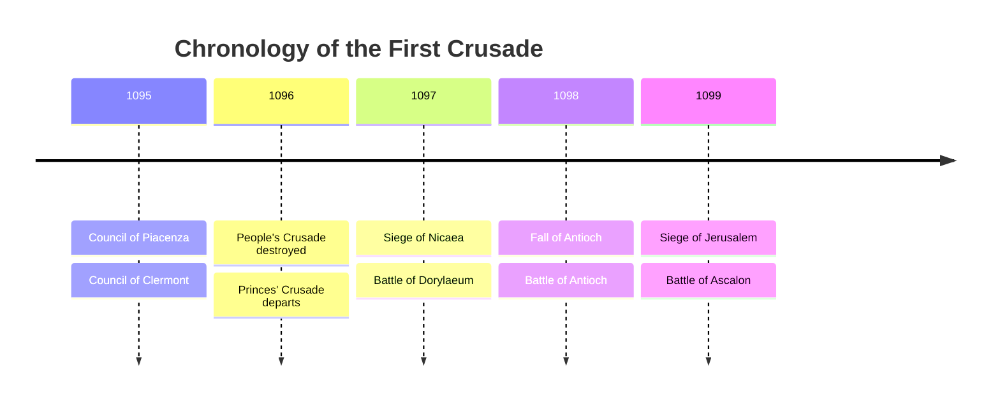

## Table of Contents

  - [The State of the World: 11th Century Geopolitics (Byzantines, Seljuks, the Papacy)](#the-state-of-the-world-11th-century-geopolitics-byzantines-seljuks-the-papacy)
  - [The Council of Clermont and the Call to Arms](#the-council-of-clermont-and-the-call-to-arms)
  - [The People's Crusade: Mobilization and Early Disasters](#the-peoples-crusade-mobilization-and-early-disasters)
  - [The Princes' Crusade: The Aristocratic Armies and Journey to Constantinople](#the-princes-crusade-the-aristocratic-armies-and-journey-to-constantinople)
  - [The Siege of Nicaea and the Battle of Dorylaeum](#the-siege-of-nicaea-and-the-battle-of-dorylaeum)
  - [The Siege of Antioch: Attrition and the Holy Lance](#the-siege-of-antioch-attrition-and-the-holy-lance)
  - [The March South and the Siege of Jerusalem](#the-march-south-and-the-siege-of-jerusalem)
  - [The Battle of Ascalon and the Establishment of the Crusader States](#the-battle-of-ascalon-and-the-establishment-of-the-crusader-states)
  - [Legacy, Historiography, and Influence in Literature and Media](#legacy-historiography-and-influence-in-literature-and-media)

> [!abstract] Table of Contents
> - [[#The State of the World: 11th Century Geopolitics (Byzantines, Seljuks, the Papacy)]]
>   - [[#The Byzantine Empire and the Seljuk Threat]]
>   - [[#The Seljuk Empire and Regional Fragmentation]]
>   - [[#The Papacy and Western European Dynamics]]
> - [[#The Council of Clermont and the Call to Arms]]
>   - [[#The Diplomatic Prelude: The Council of Piacenza]]
>   - [[#The Sermon at Clermont]]
>   - [[#The Mechanics of Mobilization]]
>   - [[#Ideological Impact and Unintended Consequences]]
> - [[#The People's Crusade: Mobilization and Early Disasters]]
>   - [[#Peter the Hermit and Popular Fervor]]
>   - [[#The Rhineland Massacres]]
>   - [[#The Journey Through the Balkans]]
>   - [[#Annihilation in Anatolia]]
> - [[#The Princes' Crusade: The Aristocratic Armies and Journey to Constantinople]]
>   - [[#The Major Contingents and their Commanders]]
>   - [[#The Logistics of the March]]
>   - [[#Arrival in Constantinople and the Oath to Alexios]]
> - [[#The Siege of Nicaea and the Battle of Dorylaeum]]
>   - [[#The Siege of Nicaea (May - June 1097)]]
>   - [[#The Battle of Dorylaeum (July 1, 1097)]]
> - [[#The Siege of Antioch: Attrition and the Holy Lance]]
>   - [[#The Long Blockade and the Winter of Starvation]]
>   - [[#The Fall of the City (June 1098)]]
>   - [[#The Second Siege and the Holy Lance]]
>   - [[#The Battle of Antioch (June 28, 1098)]]
> - [[#The March South and the Siege of Jerusalem]]
>   - [[#The Advance into the Levant]]
>   - [[#The Siege of Jerusalem (June - July 1099)]]
>   - [[#The Final Assault and the Massacre]]
> - [[#The Battle of Ascalon and the Establishment of the Crusader States]]
>   - [[#The Battle of Ascalon (August 1099)]]
>   - [[#The Foundation of the Crusader States]]
> - [[#Legacy, Historiography, and Influence in Literature and Media]]
>   - [[#Geopolitical and Cultural Legacy]]
>   - [[#Historiography]]
>   - [[#Influence in Literature and Media]]

| The First Crusade | |
| :--- | :--- |
| **Dates** | 1095 – 1099 |
| **Location** | Anatolia, Levant, Jerusalem |
| **Belligerents** | Western Crusaders, Byzantine Empire   vs.   Seljuk Empire, Fatimid Caliphate |
| **Key Figures** | Pope Urban II, Alexios I Komnenos, Peter the Hermit, Godfrey of Bouillon, Kilij Arslan I |
| **Outcome** | Decisive Crusader victory; establishment of the Crusader States. |

## The State of the World: 11th Century Geopolitics (Byzantines, Seljuks, the Papacy)

The geopolitical landscape of the late eleventh century was characterized by significant realignments of power across the Mediterranean and the broader Near East, setting the structural preconditions for the First Crusade. The primary actors in this theater were the Byzantine Empire, the ascendant Seljuk Empire, and the Papacy in Western Europe, each navigating internal crises and external pressures that culminated in the events of 1095.

### The Byzantine Empire and the Seljuk Threat
The Byzantine Empire, historically the dominant Christian power in the Eastern Mediterranean, had experienced a severe territorial and political crisis in the latter half of the eleventh century. Following a period of relative stability and expansion under the Macedonian dynasty, the empire faced internal factionalism and military deterioration. This weakness was acutely exposed by the migration and military expansion of the Seljuk Turks, a Sunni Muslim, Oghuz Turkic tribal confederation that had recently established a vast empire encompassing Persia, Mesopotamia, and the Levant.

The pivotal turning point occurred in 1071 at the Battle of Manzikert, where the Seljuk forces under Alp Arslan decisively defeated the Byzantine army, capturing Emperor Romanos IV Diogenes. While the battle itself was not an immediate death blow to the empire, the subsequent civil wars in Constantinople allowed the Seljuks and various allied Turkic tribes to migrate into the Anatolian peninsula largely unopposed. By the 1080s, the Seljuks had established the Sultanate of Rum, with its capital at Nicaea, perilously close to the Byzantine capital of Constantinople. The loss of Anatolia deprived the Byzantine Empire of its most vital recruiting grounds and a significant portion of its agricultural wealth, reducing it to a coastal and Balkan power heavily reliant on mercenary forces.

Emperor Alexios I Komnenos, who seized the Byzantine throne in 1081, inherited an empire besieged on multiple fronts: the Normans in the West, the Pechenegs in the North, and the Seljuks in the East. Alexios spent the first decade of his reign stabilizing the frontiers through a combination of military campaigns, diplomatic marriages, and financial subsidies. However, to reclaim the lost territories of Anatolia, Alexios recognized the necessity of external military assistance. His strategy involved appealing to Western European powers for mercenary contingents, an established practice in Byzantine statecraft, which he articulated in a series of diplomatic embassies to the West, most notably to the Council of Piacenza in 1095.

### The Seljuk Empire and Regional Fragmentation
While the Seljuks presented a formidable threat to the Byzantines, the Seljuk Empire itself was not a monolithic entity by the late eleventh century. Following the death of Sultan Malik-Shah I in 1092 and his powerful vizier Nizam al-Mulk, the Great Seljuk Empire descended into a protracted war of succession among his sons and various regional governors (atabegs). This fragmentation fractured the political unity of the Islamic Middle East.

In Anatolia, Kilij Arslan I ruled the Sultanate of Rum, frequently at odds with the Great Seljuks in Persia and other independent Turkic warlords such as the Danishmendids. Further south, in Syria and Palestine, the political situation was even more chaotic. The region was a contested frontier zone between the Sunni Seljuks and the Shia Fatimid Caliphate based in Egypt. Cities like Antioch, Aleppo, and Damascus were controlled by rival Seljuk emirs (such as Ridwan and Duqaq) who were often more concerned with fighting one another than addressing external threats.

> [!info]- The Status of Jerusalem
> Jerusalem, a city of profound religious significance to Judaism, Christianity, and Islam, had changed hands multiple times. Captured by the Seljuks from the Fatimids in the 1070s, traditional pilgrimage routes for Western Christians were disrupted. Although historical evidence suggests outright persecution was sporadic rather than systemic, the political instability made the journey significantly more dangerous, fueling the narrative of Christian suffering utilized by the Papacy.

### The Papacy and Western European Dynamics
In Western Europe, the late eleventh century was marked by the Investiture Controversy, a profound ideological and political conflict between the Papacy and the EMP - [[The Holy Roman Empire|The Holy Roman Empire]] regarding the authority to appoint church officials. Popes such as Gregory VII and his successor Pope Urban II sought to assert the supremacy of spiritual authority over secular rulers, aiming to reform the Church and consolidate papal power.

Pope Urban II, facing a rival antipope (Clement III) supported by the Holy Roman Emperor Henry IV, required mechanisms to assert his legitimacy and unify the fractured nobility of Western Europe under papal leadership. The societal structure of the West was characterized by an entrenched, militarized aristocracy engaged in endemic localized warfare. The Church had previously attempted to mitigate this violence through movements such as the Peace of God and the Truce of God, which sought to limit warfare on certain days and protect non-combatants, with limited success.

The Byzantine appeal for military aid provided Urban II with a unique strategic opportunity. By channeling the martial energies of the European nobility toward an external, religiously sanctioned objective, the Papacy could simultaneously assist eastern Christians, assert its role as the undisputed leader of Christendom, and export domestic violence to a distant frontier. 

**Core Causes of the First Crusade:**
- **Byzantine Military Necessity:** Loss of Anatolian recruiting grounds necessitated Western mercenary aid.
- **Seljuk Political Fragmentation:** The lack of a unified Islamic response created a window of vulnerability.
- **Papal Ambitions:** A desire to assert universal authority, heal the Great Schism, and unify a fractured European nobility.
- **Socio-Economic Pressures in Europe:** An entrenched, militarized aristocracy seeking outlets for systemic violence and spiritual salvation.

When Alexios I Komnenos requested a relatively modest force of western mercenaries, he inadvertently triggered a massive, ideologically driven migration that neither the Byzantines nor the Islamic powers of the Near East were prepared to handle.

## The Council of Clermont and the Call to Arms

The formal genesis of the First Crusade is localized to the Council of Clermont, a synod of ecclesiastics and laymen convened by Pope Urban II in November 1095. While the council initially addressed standard matters of church reform—such as the Cluniac reforms, clerical celibacy, and the continuation of the Investiture Controversy—its historical significance rests entirely on Urban's sermon delivered on November 27. This address transformed a diplomatic request for military aid from Emperor Alexios I Komnenos into a mass armed pilgrimage, introducing a novel synthesis of holy war and penitential devotion to Western Christendom.

### The Diplomatic Prelude: The Council of Piacenza
The ideological foundation for Clermont was laid earlier that year at the Council of Piacenza in March 1095. There, envoys from Alexios I Komnenos presented a direct appeal to Urban II and the assembled bishops. The Byzantine delegation detailed the territorial losses in Anatolia to the Seljuk Empire and emphasized the imminent threat to Eastern Christians, warning that without Western assistance, Constantinople itself might fall. 

Alexios's request was fundamentally traditional: he sought mercenary contingents from the West, specifically targeting the Norman and Frankish aristocracy whose martial prowess the Byzantines both respected and feared. Urban II received this appeal favorably. Supporting the Byzantines offered the Papacy a means to assert its authority over the Eastern Church, potentially healing the Great Schism of 1054, while simultaneously redirecting the systemic violence of Western European knights toward an external theater. Following Piacenza, Urban embarked on a strategic tour of France, carefully preparing the ground for a broader proclamation.

### The Sermon at Clermont
On November 27, 1095, in a field outside the eastern gate of Clermont, Urban II addressed a massive crowd of clerics and nobles. No exact transcript of Urban’s speech survives; the accounts we possess—written by chroniclers such as Fulcher of Chartres, Robert the Monk, Baldric of Dol, and Guibert of Nogent—were recorded years later, heavily influenced by the subsequent success of the crusade. However, a comparative analysis of these texts reveals the core rhetorical strategies Urban employed.

Urban systematically utilized graphic, often exaggerated, accounts of Seljuk atrocities against Eastern Christians and the desecration of holy sites to evoke outrage. He explicitly framed the Byzantine Empire as a defensive bulwark of Christendom that was currently failing. The papacy shifted the strategic objective away from mere mercenary assistance for Alexios; instead, the ultimate goal was defined as the liberation of Jerusalem and the Church of the Holy Sepulchre.

> [!quote]- The Rallying Cry
> The crowd reportedly responded with the spontaneous chant, *"Deus vult!"* ("God wills it!"), which became the rallying cry of the movement.

Crucially, Urban II inextricably linked military service with spiritual salvation. He promised a full remission of temporal penalties for sins—the plenary indulgence—for those who undertook the journey with pious intent. This theological innovation merged the traditions of pilgrimage (a penitential act) with holy war (previously justified primarily for defense, as seen in the Iberian Reconquista). 

### The Mechanics of Mobilization
The Papal call to arms was a meticulously engineered mass communication campaign. Immediately following the sermon, Bishop Adhemar of Le Puy stepped forward to take the cross, providing a high-profile clerical endorsement. Urban II subsequently appointed Adhemar as the papal legate and spiritual leader of the expedition, ensuring the Papacy maintained nominal control over the movement.

To disseminate the message, Urban utilized the extensive network of Cluniac monasteries and issued a series of papal letters. Bishops and abbots were instructed to preach the cross in their respective dioceses. The papacy explicitly sought to target the knighthood and the upper nobility—those possessing the logistical and financial capacity to wage war in the Levant. Urban specifically discouraged monks, the elderly, and women from participating, recognizing that non-combatants would be a logistical burden. Furthermore, he established a departure date of August 15, 1096, the Feast of the Assumption, to allow adequate time for preparation and the harvesting of crops.

### Ideological Impact and Unintended Consequences
The response to the Council of Clermont vastly exceeded Papal and Byzantine expectations. The synthesis of penitential salvation and martial duty resonated profoundly with a warrior aristocracy steeped in a culture of honor, violence, and religious anxiety. The offer of an indulgence provided a socially acceptable mechanism for knights to atone for the inherent sins of their profession without abandoning their martial identity.

However, the papacy quickly lost control of the narrative. While Urban intended for a structured, aristocratic military expedition, the message of immediate salvation sparked intense eschatological fervor among the lower classes. Charismatic popular preachers, most notably Peter the Hermit, began independently preaching the crusade, attracting massive crowds of peasants, minor clergy, and impoverished knights. 

**Immediate Effects of Clermont:**
- **Mass Mobilization:** A massive, religiously sanctioned military expedition was formalized.
- **Papal Prestige:** Elevated the prestige and perceived universal authority of the Papacy.
- **Unintended Fervor:** Unleashed uncontrollable popular movements (the People's Crusade).
- **Domestic Violence:** Set the stage for widespread anti-Semitic violence in Europe due to the volatile nature of the theological mechanism Urban II had engineered.

## The People's Crusade: Mobilization and Early Disasters

The immediate aftermath of the Council of Clermont witnessed a spontaneous and chaotic mobilization that fundamentally deviated from the Papacy's strategic vision. While Pope Urban II had mandated a structured departure of the armed nobility for August 1096, charismatic popular preachers rapidly disseminated the call to crusade among the lower socioeconomic strata of Western Europe. This unauthorized and premature mobilization, known to historiography as the People’s Crusade, resulted in widespread domestic violence and ended in total military disaster in Anatolia.

### Peter the Hermit and Popular Fervor
The primary architect of the People's Crusade was Peter the Hermit, a charismatic ascetic from Amiens. Peter traversed northern France and the Rhineland, riding a donkey and preaching to massive, impromptu crowds. His rhetoric bypassed the complex theological justifications of the Papacy, focusing instead on apocalyptic imagery, immediate spiritual salvation, and the visceral liberation of the Holy Land. 

The socioeconomic context of late eleventh-century Europe proved highly fertile for this message. Years of poor harvests, local famines, and the endemic violence of the feudal system had generated profound desperation among the peasantry. For many, the crusade offered not only spiritual remission but also a physical escape from agrarian servitude. Consequently, Peter the Hermit assembled a vast, heterogeneous horde numbering in the tens of thousands. This host was composed primarily of untrained peasants, the urban poor, women, children, and a small cadre of impoverished knights, such as Walter Sans Avoir (Walter the Penniless), who provided minimal military cohesion.

This mass migration was characterized by a distinct lack of logistical preparation. Operating under the theological assumption that God would provide sustenance for His pilgrims, the host embarked without adequate supply lines, funding, or disciplined leadership. This fundamental logistical failure dictated the disastrous trajectory of the expedition.

### The Rhineland Massacres
The ideological fervor of the People's Crusade quickly mutated into localized violence against non-Christian populations within Europe, specifically the Jewish communities of the Rhineland. If the objective was to destroy the "enemies of Christ" in the distant Levant, elements within the crusade—most notably bands led by Count Emicho of Leiningen and other minor nobles—reasoned that they should first eliminate the perceived enemies in their immediate vicinity.

> [!summary]- The Earliest Pogroms
> In the spring of 1096, these contingents initiated a systematic campaign of pogroms against the Jewish populations of Speyer, Worms, Mainz, and Cologne. Despite the protective interventions of local bishops, the crusader mobs breached the episcopal palaces and slaughtered thousands. These massacres represent some of the earliest recorded instances of widespread, ideologically driven anti-Semitic violence in medieval Europe.

### The Journey Through the Balkans
The main bodies of the People's Crusade, led sequentially by Walter Sans Avoir and Peter the Hermit, began their march through the Kingdom of Hungary and into the Byzantine Empire via the Balkans. The lack of provisions immediately triggered conflict. As the massive, starving host moved through Byzantine territories such as Belgrade and Niš, they resorted to pillaging local villages and farms to survive.

The Byzantine provincial governors, entirely unprepared for the premature arrival of a volatile, unsupplied mob instead of a disciplined mercenary army, responded with military force. Clashes erupted between the crusaders and Byzantine border garrisons, notably the Pecheneg and Hungarian mercenaries employed by the Empire. 

By the time the fractured remnants of the People's Crusade reached Constantinople in the summer of 1096, Emperor Alexios I Komnenos was confronted with a severe logistical and diplomatic crisis. Recognizing the military uselessness and the destabilizing potential of the mob, Alexios rapidly ferried them across the Bosporus to the Anatolian shore, specifically advising Peter the Hermit to wait for the arrival of the heavily armed Western nobility before engaging the Seljuks.

### Annihilation in Anatolia
Once in Anatolia, the crusaders established a base at the camp of Civetot, near the Seljuk capital of Nicaea. Discipline completely collapsed. Ignoring Byzantine warnings, splinter groups of French and German contingents began launching uncoordinated, predatory raids into Seljuk territory, pillaging local Greek Christian villages with the same ferocity they intended for the Muslims.

In October 1096, hearing rumors of the fall of Nicaea, the main body of the People's Crusade marched out from Civetot. They were immediately ambushed by the forces of Sultan Kilij Arslan I in a narrow valley near the village of Dracon. The lightly armed, unarmored mob was annihilated by Seljuk horse archers. Thousands were slaughtered, and the survivors were enslaved. 

The People's Crusade demonstrated the lethal consequences of ideological mobilization decoupled from logistical reality and military discipline. It provided the Seljuk Empire with a dangerously low estimation of Western military capability, a miscalculation that would prove critical when the disciplined, heavily armored armies of the Princes' Crusade arrived the following year.

## The Princes' Crusade: The Aristocratic Armies and Journey to Constantinople

While the People's Crusade disintegrated in Anatolia, the primary military instrument of the First Crusade—the armies of the Western European nobility—was mobilizing. This force, retrospectively termed the Princes' Crusade, did not constitute a single, unified army under a unified command structure. Instead, it was a coalition of distinct, highly organized feudal contingents, each commanded by a prominent regional magnate and accompanied by its own retinue of knights, infantry, logistics trains, and non-combatant pilgrims.

### The Major Contingents and their Commanders
The socio-political geography of late eleventh-century Europe dictated the composition of these armies. No crowned king participated in the First Crusade; King Philip I of France and Holy Roman Emperor Henry IV were both excommunicated by Pope Urban II at the time, and King William II of England was engaged in domestic consolidation. The leadership thus devolved to the upper echelons of the regional aristocracy, primarily from France, Norman Italy, and the Low Countries.

Four primary contingents emerged, departing Europe in late summer and autumn of 1096:

1. **The Northern French and Lotharingians:** Commanded by Godfrey of Bouillon, Duke of Lower Lorraine, and his brothers Eustace of Boulogne and Baldwin of Boulogne. This force was heavily influenced by the Germanic military traditions of the EMP - The Holy Roman Empire and included significant contingents of infantry.
2. **The Southern French (Provençals):** Led by Raymond IV, Count of Toulouse, the wealthiest and oldest of the secular leaders. He was accompanied by Adhemar of Le Puy, the papal legate, which gave his army a strong claim to spiritual primacy.
3. **The Northern French (Francians):** A coalition commanded by Hugh of Vermandois (brother of King Philip I of France), Robert Curthose (Duke of Normandy and brother of the English King), and Stephen, Count of Blois. This contingent represented the heartland of French feudalism.
4. **The Southern Italian Normans:** Commanded by Bohemond of Taranto and his nephew Tancred. These men were veterans of previous Norman campaigns against the Byzantine Empire in the Balkans, possessing unparalleled tactical experience against Byzantine and Islamic forces, but generating intense suspicion in Constantinople.

The total strength of these combined forces is a subject of ongoing historiographical debate, but modern estimates suggest a formidable host of approximately 60,000 to 90,000 individuals, of which roughly 7,000 to 10,000 were heavily armored knights. 

### The Logistics of the March
The logistics of moving such a massive, multi-national force across Europe were unprecedented since Roman antiquity. The contingents traveled via separate routes to ease the burden on local foraging and infrastructure. Godfrey marched through Germany and Hungary; Raymond of Toulouse traversed the Alps and the Dalmatian coast; the Northern French traveled through Italy and crossed the Adriatic Sea; and Bohemond crossed directly from Apulia to Epirus.

Financing the expedition required massive capital liquidation. Lords and knights mortgaged or sold their estates, castles, and rights to the Church or to secular rivals to afford armor, horses, and provisions for their retinues. This sudden transfer of wealth accelerated the monetization of the European economy and strengthened the political position of the institutions—primarily the Church and emerging monarchies—that remained behind to purchase these assets.

### Arrival in Constantinople and the Oath to Alexios
Between late 1096 and the spring of 1097, the various crusader armies converged on Constantinople. The arrival of this immense, heavily armed coalition presented a critical diplomatic and security challenge for Emperor Alexios I Komnenos. He had requested a controllable auxiliary force of perhaps a few thousand mercenaries; instead, he was presented with a massive, independent coalition possessing the military capacity to threaten the Byzantine capital itself. Furthermore, the presence of his old enemy, Bohemond of Taranto, heightened Byzantine anxieties.

Alexios’s primary strategic objective was to harness this Western military power to recover lost Byzantine territories in Anatolia, while ensuring the crusaders did not establish independent, hostile states on his borders or plunder his domains. To achieve this, he utilized a combination of financial bribery, logistical control, and diplomatic leverage. He refused to allow the entire crusader host to mass outside Constantinople at once, rapidly ferrying each contingent across the Bosporus to Asia Minor upon their arrival.

Crucially, Alexios demanded that the crusade leaders swear an oath of fealty to him before crossing into Anatolia. The specific terms of this oath required the crusaders to return any conquered territory that had formerly belonged to the Byzantine Empire to Byzantine control. In exchange, Alexios promised military support, supplies, and guides.

The demand for an oath provoked significant friction. The Western lords, accustomed to feudal relationships based on mutual obligation, were deeply suspicious of Byzantine statecraft. Raymond of Toulouse vehemently refused to swear the primary oath, offering only a modified pledge not to harm the Emperor’s life or honor. Godfrey of Bouillon initially resisted but capitulated after Alexios temporarily cut off his supplies and skirmishes erupted outside the city walls. Bohemond, conversely, enthusiastically swore the oath, allegedly requesting the prestigious Byzantine title of *Domestic of the East* to position himself as the overall commander, a request Alexios adroitly evaded.

By May 1097, through masterful, albeit tense, diplomacy, Alexios had secured the oaths of the principal leaders and successfully transitioned the crusader armies into Anatolia without a major conflict breaking out in Constantinople. The fragile alliance between the Orthodox Byzantine state and the Catholic Western armies was established, setting the stage for the first major military engagements against the Seljuk Empire.

## The Siege of Nicaea and the Battle of Dorylaeum

The first major military objective of the combined crusader and Byzantine forces was the city of Nicaea, the capital of the Seljuk Sultanate of Rum under Kilij Arslan I. Nicaea was strategically vital; located on the eastern shore of the Askanian Lake, it controlled the primary military routes leading into the Anatolian interior. Its capture was essential for securing the Byzantine supply lines and facilitating the crusaders' advance toward the Levant.

### The Siege of Nicaea (May - June 1097)
When the vanguard of the crusader army, led by Godfrey of Bouillon, arrived at Nicaea in early May 1097, Kilij Arslan I was absent. Having easily annihilated the People's Crusade the previous year, the Sultan had fundamentally underestimated the military capability of the Princes' Crusade. He was engaged in a regional conflict against the Danishmendids in eastern Anatolia, leaving his capital relatively lightly defended, although its fortifications—massive Roman-era walls boasting over one hundred towers—were formidable.

The crusaders established a blockade around the landward sides of the city. As subsequent contingents under Bohemond of Taranto, Raymond of Toulouse, and Robert of Flanders arrived throughout May, the siege lines tightened. However, the blockade was incomplete; Nicaea's western wall bordered the Askanian Lake, allowing the Seljuk garrison to receive supplies and reinforcements via watercraft.

Realizing the threat, Kilij Arslan broke off his eastern campaign and force-marched his cavalry back to his capital. On May 16, he launched a sudden, massive assault against the southern crusader siege lines, commanded by Raymond of Toulouse. The engagement was brutal and closely fought. Unlike the unarmored peasants of the previous year, the Seljuk horse archers now faced disciplined, heavily armored Western knights fighting in tight formations, supported by infantry armed with crossbows. The crusader heavy cavalry charges repeatedly disrupted the Seljuk skirmish tactics. After suffering severe casualties, Kilij Arslan recognized the tactical reality that he could not break the siege and withdrew, effectively abandoning Nicaea to its fate.

Despite the Sultan's retreat, the city continued to resist. To complete the blockade, Emperor Alexios I Komnenos dispatched a fleet of shallow-draft Byzantine vessels, commanded by Manuel Boutoumites, which were dragged overland and launched into the Askanian Lake. This maneuver severed the garrison's final lifeline.

Faced with imminent starvation and an impending crusader assault, the Seljuk garrison initiated secret surrender negotiations—not with the crusaders, but with the Byzantine commanders. On the morning of June 19, 1097, as the crusaders prepared for a massive general assault, they awoke to find Byzantine standards flying from the towers of Nicaea. Alexios had successfully negotiated a bloodless capitulation, securing the city and taking the Seljuk elite, including Kilij Arslan’s family, into protective custody (they were later released as a diplomatic gesture).

The secret surrender deeply fractured the alliance. The Western rank-and-file, anticipating the customary right to plunder a city taken by siege, felt cheated by Byzantine statecraft. Although Alexios distributed substantial financial gifts to the crusade leaders to placate them, the episode sowed deep seeds of distrust that would significantly impact future campaigns.

### The Battle of Dorylaeum (July 1, 1097)
Following the capture of Nicaea, the crusader army resumed its march southeast into the arid Anatolian plateau in late June. To ease the logistical burden of foraging, the army divided into two distinct columns marching a day apart. The vanguard was commanded by Bohemond of Taranto, accompanied by Robert Curthose and Stephen of Blois; the rearguard was led by Godfrey of Bouillon, Raymond of Toulouse, and Adhemar of Le Puy.

Kilij Arslan, having retreated and formed a coalition with his former enemy, the Danishmendid Emir Gazi, as well as Cappadocian Turks, had assembled a massive army of horse archers. On July 1, 1097, near the ruined Byzantine city of Dorylaeum, the Seljuk coalition ambushed Bohemond's vanguard.

The Seljuk tactical doctrine relied on mobility, avoiding close-quarters combat while raining continuous, devastating volleys of arrows upon the enemy. Bohemond, demonstrating significant tactical acumen, recognized the danger of ordering a premature heavy cavalry charge against a faster enemy. Instead, he ordered his knights to dismount and form a dense, defensive perimeter around the non-combatants and the baggage train, relying on the heavy armor of his infantry and the shields of the knights to absorb the missile fire.

For several hours, the vanguard endured a punishing bombardment. The heat, lack of water, and continuous casualties strained the crusader lines to the breaking point. However, Bohemond's defensive posture bought critical time. Messengers had been dispatched to the rearguard at the onset of the attack.

By mid-day, the crusader rearguard arrived on the battlefield. Godfrey of Bouillon and Hugh of Vermandois led their heavy cavalry over the surrounding ridges, plunging directly into the exposed flanks of the Seljuk army. Simultaneously, Adhemar of Le Puy executed a flanking maneuver, attacking the Seljuk camp from the rear. 

Caught between Bohemond's holding force and the devastating shock of the arriving heavy cavalry, the Seljuk tactical formation collapsed. The Turks, unable to withstand the kinetic impact of the armored Frankish charge, broke and routed, abandoning their camp, treasury, and provisions. 

The Battle of Dorylaeum was a decisive, paradigm-shifting victory. It decisively shattered Seljuk military power in western Anatolia, effectively eliminating them as a major strategic threat to the crusader advance. It validated the tactical superiority of the Western heavy cavalry charge when properly supported, and conversely, it demonstrated to the Seljuks that the crusaders could not be destroyed through harassment alone. The victory allowed the crusader host to traverse the grueling Anatolian interior—a march that would inflict horrific casualties through starvation and dehydration—without facing another major pitched battle before reaching the strategic linchpin of the Near East: Antioch.

## The Siege of Antioch: Attrition and the Holy Lance

The crusader army reached the environs of Antioch in October 1097, having survived a brutal crossing of the Anatolian plateau and the Taurus Mountains. Antioch, situated on the Orontes River in northern Syria, was one of the great metropolises of the ancient and medieval world. It was heavily fortified with massive walls climbing Mount Silpius and was commanded by the Seljuk governor Yaghi-Siyan. The ensuing siege, which lasted from October 1097 to June 1098, was the defining military and psychological crucible of the First Crusade.

### The Long Blockade and the Winter of Starvation
Antioch's fortifications were too extensive for the crusaders to fully invest. The city had multiple gates, and the Seljuk garrison maintained communication and supply lines with the surrounding countryside for months. The crusader strategy devolved into a grueling war of attrition, characterized by blockades of specific gates, continuous skirmishing, and a desperate struggle for logistics.

The winter of 1097-1098 proved catastrophic. The crusaders, having exhausted local foraging grounds, faced mass starvation. The sophisticated logistical network they had enjoyed in Byzantine territory was gone, and supply lines from the port of St. Symeon (seized by a crusader naval contingent) were under constant harassment by Seljuk raiders. Disease, famine, and desertion decimated the ranks. Horses, vital for the heavy cavalry, starved or were eaten; by some estimates, fewer than two thousand warhorses survived the winter. 

During this period, the political cohesion of the crusade fractured. Emperor Alexios I Komnenos had provided a small Byzantine contingent under Tatikios, but as conditions deteriorated, Tatikios departed—ostensibly to fetch reinforcements from Cyprus, though the Western leaders accused him of desertion. Stephen of Blois, a prominent leader, also abandoned the siege and retreated toward Constantinople. When he encountered Emperor Alexios marching with a relief army, Stephen erroneously reported that the crusader army was doomed, prompting Alexios to turn back. This perceived betrayal severed the Franco-Byzantine alliance; Bohemond of Taranto seized upon this to argue that the Byzantine Emperor had forfeited his rights to Antioch under the oaths sworn in 1097.

### The Fall of the City (June 1098)
As the siege dragged on, the strategic situation became desperate. A massive relief army commanded by Kerbogha, the Atabeg of Mosul, was marching toward Antioch. If the crusaders were caught between the city walls and Kerbogha's host, annihilation was certain.

The impasse was broken by subterfuge. Bohemond of Taranto had established secret contact with Firouz, an Armenian Christian serving in Yaghi-Siyan’s garrison who commanded the Tower of the Two Sisters. Firouz, reportedly holding a personal grievance against the governor, agreed to betray his post. On the night of June 2, 1098, a small contingent of Norman knights scaled the tower, eliminated the guards, and opened the gates. 

The crusader army poured into Antioch. In the ensuing chaos, Yaghi-Siyan fled but was killed by local peasants, while his son retreated to the heavily fortified citadel on Mount Silpius, which the crusaders could not take. The capture of the city was accompanied by a brutal massacre of its Muslim, and even some Christian, inhabitants. 

### The Second Siege and the Holy Lance
The crusaders' victory was immediately followed by a profound reversal of fortune. On June 4, merely two days after taking the city, Kerbogha's massive relief army arrived and besieged the crusaders within Antioch. The besiegers were now the besieged. The city had been stripped of provisions during the eight-month blockade, and starvation immediately set in among the crusader ranks. Morale collapsed, and desertions (the "rope-dancers" who fled over the walls at night) increased.

> [!info]- The Discovery of the Holy Lance
> In this atmosphere of extreme physical deprivation and psychological despair, a Provençal peasant named Peter Bartholomew claimed to have received visions from St. Andrew, revealing the location of the Holy Lance—the spear that pierced the side of Christ—buried beneath the Cathedral of St. Peter in Antioch. On June 14, after extensive excavation, Peter "discovered" a piece of iron in the dirt. While the papal legate Adhemar of Le Puy viewed the discovery with profound skepticism, the relic exerted an electrifying psychological effect on the rank-and-file. It was interpreted as a definitive sign of divine favor.

### The Battle of Antioch (June 28, 1098)
Empowered by religious fervor and facing certain death by starvation, the crusade leaders resolved to launch a desperate sally against Kerbogha's forces. Command of the battle was granted to Bohemond of Taranto, universally recognized as the most capable tactician among them.

On June 28, 1098, the starving crusader army marched out of the city gates in strictly disciplined, mutually supporting divisions. Despite their numerical inferiority and the severe lack of cavalry (many knights fought on foot or rode mules), their infantry cohesion was absolute.

Kerbogha's army, though massive, was politically fractured. It was a fragile coalition of rival emirs who distrusted Kerbogha's ambitions as much as they hated the Franks. When the crusaders deployed, Kerbogha hesitated, failing to attack the contingents as they emerged from the gates. When he finally engaged, the crusader infantry held firm against the Turkish horse archers, preventing the typical feigned retreat tactics from breaking their lines. 

Seeing the crusader resolve and unwilling to bleed their own forces to secure Kerbogha's hegemony, several key emirs, including Duqaq of Damascus, abandoned the field. The Seljuk coalition collapsed into a disorganized rout. The crusaders overran the Muslim camp, securing vast quantities of provisions, horses, and wealth. The citadel subsequently surrendered, bringing the entirety of Antioch under crusader control.

The victory at Antioch was the military climax of the First Crusade. However, it immediately sparked a bitter, months-long political dispute between Bohemond, who claimed the city by right of conquest, and Raymond of Toulouse, who argued it must be returned to the Byzantines in accordance with their oaths. This dispute halted the crusade's advance for nearly a year.

## The March South and the Siege of Jerusalem

Following the grueling victory at Antioch in June 1098, the crusading army remained stalled in northern Syria for nearly a year. This delay was driven by a combination of political infighting among the leadership, epidemic disease (which claimed the life of the papal legate, Adhemar of Le Puy), and the logistical necessity of securing the surrounding territory. It was only the threat of open mutiny from the rank-and-file, who demanded to fulfill their vows at the Holy Sepulchre, that finally forced the advance to resume in the spring of 1099.

### The Advance into the Levant
The march south through the Levant was remarkably swift and relatively unopposed compared to the campaign in Anatolia. The geopolitical fragmentation of the region worked to the crusaders' advantage. The local Arab and Seljuk emirs of coastal cities such as Tripoli, Beirut, and Tyre, deeply divided and intimidated by the crusaders' reputation after the fall of Antioch, opted to provide tribute, supplies, and safe passage rather than risk a siege. 

Raymond of Toulouse, having lost Antioch to Bohemond (who remained behind to consolidate his new principality), assumed de facto leadership of the march. The crusade essentially bypassed the major inland power centers like Damascus, maintaining a coastal route supported by naval contingents from Genoa and England that had secured the Mediterranean sea lanes.

During this period, the political landscape shifted again. The Shia Fatimid Caliphate of Egypt, taking advantage of the Seljuk distraction caused by the crusade, launched a sudden offensive and captured Jerusalem from its Sunni Seljuk garrison in August 1098. Thus, when the crusaders finally approached their ultimate objective, they were facing Fatimid Egyptian defenders, not the Seljuks who had been the original casus belli. Fatimid attempts to negotiate a division of the Levant with the crusaders were categorically rejected; the Franks had not marched thousands of miles to accept a diplomatic compromise over the Holy City.

### The Siege of Jerusalem (June - July 1099)
On June 7, 1099, the crusader army—now reduced by casualties, garrisons left behind, and desertions to a hardened core of perhaps 1,200 knights and 12,000 infantry—arrived before the walls of Jerusalem. The Fatimid governor, Iftikhar ad-Daula, had prepared extensively. He expelled the city's Christian population to conserve food, poisoned the wells outside the walls, and heavily fortified the massive defenses.

The initial crusader assault on June 13, driven by religious zeal rather than sound engineering, failed disastrously against the formidable walls. The crusaders quickly realized that without siege engines, capturing Jerusalem was impossible. Their situation was precarious; a massive Fatimid relief army was assembling in Egypt, creating a strict operational deadline. 

The logistical crisis was alleviated by the arrival of a Genoese fleet at Jaffa, which brought vital supplies and skilled engineers, notably Guglielmo Embriaco. Utilizing timber scavenged from the distant forests of Samaria, the crusaders constructed two massive, multi-story siege towers. One was commanded by Raymond of Toulouse on the southern wall (Mount Zion), and the other by Godfrey of Bouillon on the northern wall.

### The Final Assault and the Massacre
In early July, to unify the fractured army and invoke divine assistance, the crusaders engaged in a solemn penitential procession around the city walls, led by the clergy, reminiscent of the biblical Siege of Jericho. 

The final, coordinated assault began on July 13. The fighting was intensely fierce, involving heavy use of Greek fire by the defenders. On the night of July 14, Godfrey of Bouillon executed a brilliant tactical maneuver, dismantling his siege tower and moving it under the cover of darkness to a weaker, less defended section of the northern wall. 

On the morning of July 15, 1099, Godfrey's tower reached the wall. The drawbridge was lowered, and two Flemish knights, Lethald and Engelbert of Tournai, were the first to breach the defenses, followed immediately by Godfrey and his retinue. The northern defenses collapsed, and the crusader army poured into the city. Recognizing that the city was lost, Iftikhar ad-Daula negotiated a surrender with Raymond of Toulouse in the south, exchanging the Tower of David for safe passage to Ascalon for himself and his immediate bodyguard.

However, no quarter was offered to the general population. The capture of Jerusalem culminated in one of the most infamous massacres in medieval history. Over the next two days, the crusaders systematically slaughtered the city's Muslim and Jewish inhabitants—men, women, and children. Jews who had sought refuge in the central synagogue were burned alive, and Muslims were killed in the streets and atop the Temple Mount (the Haram al-Sharif). While medieval chronicles on both sides routinely exaggerated casualty figures (often citing tens of thousands, which exceeds the city's estimated population), the scale and brutality of the violence were profound and deeply traumatized the Islamic world. The crusaders justified the massacre through an extreme interpretation of holy war, viewing the \"cleansing\" of the city as the violent culmination of their penitential vow.

## The Battle of Ascalon and the Establishment of the Crusader States

The capture of Jerusalem represented the fulfillment of the crusader vow, but it did not secure the geopolitical reality of the conquest. The primary strategic threat—the Fatimid relief army from Egypt—was still advancing. 

### The Battle of Ascalon (August 1099)
In early August, a massive Fatimid army commanded by the vizier al-Afdal Shahanshah encamped near the coastal fortress of Ascalon, south of Jerusalem. The crusaders, displaying the aggressive tactical doctrine that had defined their campaign, decided against waiting out a siege within Jerusalem.

Commanded by Godfrey of Bouillon, the crusader army marched out to meet the Fatimid threat. On August 12, 1099, the crusaders achieved tactical surprise, catching the Fatimid army unprepared in its camp at dawn. The crusader heavy cavalry, operating with practiced cohesion, launched a devastating charge that shattered the Fatimid lines before they could fully deploy. The Fatimid army routed completely, suffering heavy casualties and abandoning their camp, treasury, and siege equipment. 

The Battle of Ascalon definitively secured the conquest of Jerusalem. The Fatimid threat was neutralized for a generation, and the immediate military objectives of the First Crusade were achieved. However, due to political squabbling—Raymond of Toulouse and Godfrey of Bouillon could not agree on who would control the city of Ascalon—the fortress itself was not taken, remaining a thorn in the side of the crusaders for decades.

### The Foundation of the Crusader States
Following the victory at Ascalon, the majority of the surviving crusaders, considering their vows fulfilled, returned to Europe, bringing back relics, wealth, and immense prestige. The monumental task of defending and organizing the newly conquered territories fell to a tiny fraction of the original army who chose to remain in the Levant, establishing four distinct geopolitical entities known as the Crusader States (Outremer).

1. **The Kingdom of Jerusalem:** The preeminent Crusader State. Raymond of Toulouse had refused the crown, arguing he could not wear a crown of gold where Christ had worn a crown of thorns. Godfrey of Bouillon accepted leadership, taking the modest title *Advocatus Sancti Sepulchri* (Defender of the Holy Sepulchre). Upon Godfrey's death in 1100, his brother Baldwin of Boulogne arrived from Edessa and was formally crowned King Baldwin I of Jerusalem, firmly establishing a secular monarchy.
2. **The Principality of Antioch:** Founded by Bohemond of Taranto in 1098. It dominated northern Syria and functioned as a heavily militarized frontier state, in constant conflict with the Seljuks of Aleppo and the Byzantine Empire, which continually sought to reclaim it based on the crusaders' original oaths.
3. **The County of Edessa:** The first Crusader State, established by Baldwin of Boulogne in 1098 after he splintered from the main army and exploited local Armenian political rivalries. Situated east of the Euphrates, it was heavily populated by Armenian Christians and served as a crucial buffer state against the Seljuks of Mosul and Mesopotamia.
4. **The County of Tripoli:** Founded slightly later (established systematically between 1102 and 1109) by Raymond of Toulouse and his successors, occupying the coastal strip between the Principality of Antioch and the Kingdom of Jerusalem.

The Crusader States functioned as a European colonial outpost, importing Western feudal structures, law, and ecclesiastical organization into the Levant. However, they were demographically precarious. The Franks constituted a tiny ruling elite superimposed over a vast, heterogeneous population of Eastern Orthodox Christians, Syrian Jacobites, Armenians, Muslims, and Jews. Consequently, the crusaders were forced to adopt a highly pragmatic approach to governance, largely tolerating local religious practices and relying heavily on indigenous populations for agriculture and administration. 

Militarily, the defense of Outremer relied on the construction of massive concentric castles (like Krak des Chevaliers) to control territory with minimal manpower, and the eventual creation of the Military Orders—the Knights Templar and the Knights Hospitaller—who combined monastic vows with elite martial prowess to provide a permanent standing army.

## Legacy, Historiography, and Influence in Literature and Media

The First Crusade profoundly altered the geopolitical and cultural trajectory of both Europe and the Middle East, leaving a legacy that resonates into the modern era.

### Geopolitical and Cultural Legacy
- **The Validation of Holy War:** For Western Europe, the success of the First Crusade validated the ideology of holy war and elevated the prestige of the Papacy to its zenith. 
- **Cultural Exchange & The Renaissance:** It demonstrated the military viability of a united Latin Christendom and stimulated increased trade, cultural exchange, and intellectual contact with the East, subtly laying the groundwork for the Renaissance.
- **The Great Schism Finalized:** The crusade finalized the schism between the Catholic West and the Orthodox East; the betrayal and violence of the campaign poisoned relations between Constantinople and Rome permanently.
- **The Islamic Counter-Crusade (Jihad):** For the Islamic world, the sudden intrusion of the "Franks" (Ifranj) into the Levant deeply traumatized the region. It catalyzed the slow but powerful development of a unified Islamic counter-crusade, a movement that would eventually be realized under leaders like Zengi, Nur ad-Din, and ultimately Saladin.

### Historiography
The historiography of the First Crusade has evolved dramatically. 
* **Medieval Chronicles:** Early Western accounts (e.g., Fulcher of Chartres, William of Tyre) framed the crusade providentially, as the manifest will of God executed by pious warriors. Islamic chroniclers (like Ibn al-Athir) documented the tragedy and framed the Franks as brutal, uncultured barbarians.
* **The Enlightenment:** Thinkers like Edward Gibbon and Voltaire viewed the crusades with profound disdain, characterizing them as outbreaks of savage fanaticism, superstition, and greed that interrupted the progress of civilization.
* **19th Century Romanticism:** The Victorian era witnessed a romantic rehabilitation of the crusades, heavily influenced by authors like Sir Walter Scott. The crusader knight was idealized as a paragon of chivalry and noble intent.
* **Modern Scholarship:** Contemporary historians emphasize the extreme complexity of crusader motivations, moving away from monocausal explanations (like pure greed or pure piety). Scholars analyze the deep intertwining of genuine religious anxiety with socioeconomic pressures, feudal obligations, and demographic expansion.

### Influence in Literature and Media
The imagery and narrative of the First Crusade have deeply permeated Western cultural consciousness. 
* **Literature:** The epic poems of the medieval period, such as the *Chanson d'Antioche* and Torquato Tasso’s Renaissance masterpiece *Jerusalem Delivered* (1581), romanticized the heroes of the First Crusade (particularly Godfrey of Bouillon and Tancred). Sir Walter Scott’s *The Talisman* (though technically set during the Third Crusade) cemented the romantic image of crusading chivalry in the popular mind.
* **Modern Media:** The term "crusade" itself has been heavily secularized to denote any vigorous moral campaign. In visual media, the Crusades are frequently depicted, though often focusing on later conflicts (like Ridley Scott’s *Kingdom of Heaven*). The First Crusade specifically remains a touchstone for exploring themes of religious extremism, cultural collision, and the devastating human cost of ideological warfare.

## See Also
- [[_History - Map of Contents|History MOC]]
