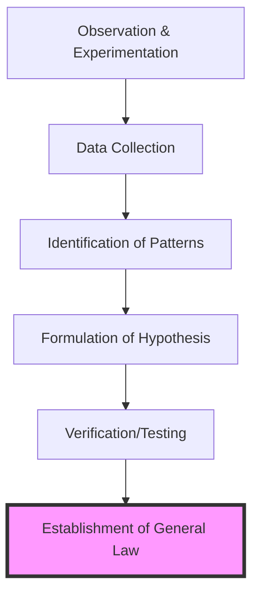

> [!abstract] Table of Contents
> - [[#1. The Theocentric Worldview: Early Medieval Scholasticism]]
>   - [[#The Role of the Church as the Repository of Order]]
>   - [[#St. Augustine of Hippo: The Architect of the Medieval Mind]]
>   - [[#Boethius: The Last of the Romans and the Bridge of Logic]]
>   - [[#The Synthesis of Faith and Reason in Early Scholasticism]]
>   - [[#Conclusion: The Foundation of the Western Intellectual Tradition]]
> - [[#2. The 12th Century Renaissance and the Rediscovery of Aristotle]]
>   - [[#The Great Transmission: Islamic Frontiers and the Translation Movement]]
>   - [[#The Rise of Universities: The Institutionalization of Reason]]
>   - [[#The Aristotelian Challenge: Reason vs. Revelation]]
>   - [[#Thomas Aquinas: The Thomistic Synthesis]]
>   - [[#Conclusion: The Intellectual Inheritance]]
> - [[#3. Renaissance Humanism: The Recovery of Antiquity]]
>   - [[#3.1 Francesco Petrarca and the Concept of the "Dark Ages"]]
>   - [[#3.2 The *Studia Humanitatis* and the Shift in Education]]
>   - [[#3.3 The North and Christian Humanism: Desiderius Erasmus]]
>   - [[#3.4 The Catalyst: The Printing Press and the Democratization of Knowledge]]
>   - [[#3.5 Institutionalization and Legacy]]
> - [[#4. The Reformation: The Fragmentation of Religious Authority]]
>   - [[#Martin Luther: The Theological Wedge and the Primacy of Conscience]]
>   - [[#The Printing Press and the Impact of the Vernacular Bible]]
>   - [[#John Calvin: The Systematization of Reform and the Protestant Ethic]]
>   - [[#The Radical Reformation: The Logic of Fragmentation Pushed to the Brink]]
>   - [[#The Breakdown of the Respublica Christiana and the Rise of Sovereignty]]
> - [[#5. The Scientific Revolution: The Empiricist Turn]]
>   - [[#5.1 The Collapse of the Aristotelian-Ptolemaic Synthesis]]
>   - [[#5.2 Nicolaus Copernicus and the Heliocentric Displacement]]
>   - [[#5.3 Johannes Kepler: Breaking the Perfect Circle]]
>   - [[#5.4 Galileo Galilei: Observation and the Experimental Method]]
>   - [[#5.5 Isaac Newton and the Newtonian Synthesis]]
>   - [[#5.6 The Methodological Shift: From Deduction to Induction]]
> - [[#6. The Enlightenment: The Supremacy of Rationalism]]
>   - [[#6.1 The Cartesian Foundation: Radical Doubt and the Mathematical Method]]
>   - [[#6.2 Spinozism: The Geometric Order of Nature]]
>   - [[#6.3 John Locke and the Empiricist Shift]]
>   - [[#6.4 The Emergence of the 'Philosophes' and the Republic of Letters]]
>   - [[#6.5 Voltaire: The Apotheosis of Enlightenment Rationalism]]
>   - [[#6.6 The Legacy of Rationalism in European Thought]]
> - [[#7. The Rise of Secularism and the Modern Mind]]
>   - [[#The Structural Divorce: The Separation of Church and State]]
>   - [[#The Darwinian Challenge: The Biological Re-centering of Humanity]]
>   - [[#The Final Transition: The Secularized Intellectual Framework]]

# HIST - Evolution of Intellectual Thought in Europe

## 1. The Theocentric Worldview: Early Medieval Scholasticism

The early medieval period, spanning roughly from the fall of the Western Roman Empire in 476 AD to the 11th century, was characterized by a fundamental shift in the orientation of human inquiry. This era saw the emergence of a theocentric worldview, where God was the primary locus of reality, value, and meaning. Intellectual thought was not an independent pursuit but was deeply embedded within the institutional and theological framework of the Christian Church. This period laid the groundwork for Scholasticism, a method of critical thought which dominated medieval universities and sought to reconcile Christian dogma with classical philosophy.

### The Role of the Church as the Repository of Order
In the wake of the Roman collapse, the Church became the sole institution capable of maintaining a semblance of administrative and intellectual continuity across Europe. With the disintegration of secular educational systems, the monasteries and cathedral schools became the primary sites of literacy and learning. The clergy were the only significant literate class, which meant that the "Republic of Letters" was essentially a "Republic of the Church." Consequently, the purpose of learning was primarily directed toward the understanding of Scripture and the administration of the sacraments. Knowledge was viewed through a teleological lens: it was useful only insofar as it led the soul toward salvation. Secular philosophy, which had flourished in Athens and Rome, was now re-evaluated. If it could serve the faith, it was preserved; if it contradicted it, it was often suppressed or ignored. This "Ancilla Theologiae" (Philosophy as the Handmaid of Theology) became the defining relationship of the intellectual landscape. The Church's control over the written word ensured that intellectual inquiry remained tethered to orthodox interpretation, preventing the radical skepticism that had sometimes characterized late antiquity.

### St. Augustine of Hippo: The Architect of the Medieval Mind
No figure was more influential in shaping this theocentric worldview than St. Augustine of Hippo (354–430). Operating at the twilight of the Roman era, Augustine provided the intellectual synthesis that would sustain Western thought for nearly a millennium. His primary contribution was the integration of Neoplatonism with Christian theology. Augustine argued that the truths discovered by Plato and the Neoplatonists—such as the existence of a transcendent, immutable reality—were actually glimpses of the Christian God. He famously stated that whatever truth is found in the writings of the philosophers should be "claimed for our use" from those who "possess it unlawfully," comparing the process to the Israelites despoiling the Egyptians.

In his seminal work, *De Civitate Dei* (The City of God), Augustine articulated a linear view of history as a struggle between two cities: the earthly city (driven by love of self) and the heavenly city (driven by love of God). This established the paradigm of dualism that would define medieval politics and ethics for centuries, placing the spiritual authority of the Church above the temporal authority of kings. Philosophically, Augustine championed the concept of "divine illumination," suggesting that human reason is insufficient on its own to grasp truth. Instead, the mind requires the "light" of God to perceive eternal realities. This led to his famous maxim, *credo ut intelligam* ("I believe so that I may understand"), which prioritized faith as the necessary precondition for rational comprehension. For Augustine, reason was not an end in itself but a tool to explore the depths of a faith already accepted. This subordination of logic to faith remained the dominant intellectual posture of Europe until the rediscovery of the full Aristotelian corpus.

### Boethius: The Last of the Romans and the Bridge of Logic
While Augustine provided the theological depth, Anicius Manlius Severinus Boethius (c. 477–524) provided the logical machinery. Often called "the last of the Romans," Boethius served as the crucial bridge between classical antiquity and the medieval world. Living under the Ostrogothic rule of Theodoric the Great, Boethius recognized that Greek learning was rapidly disappearing from the West. He embarked on a monumental project to translate all the works of Plato and Aristotle into Latin to preserve the rational heritage of the West. Although he was executed before completing this task, his translations of Aristotle’s logical works (the *Organon*) and Porphyry's *Isagoge* became the foundational texts for medieval logic.

Boethius is perhaps best known for *De Consolatione Philosophiae* (The Consolation of Philosophy), written while he was imprisoned and awaiting execution on charges of treason. In this work, he presented a dialogue with Lady Philosophy, who uses rational argument to console him regarding the fickleness of Fortune and the nature of the Good. Crucially, the *Consolation* is notably secular in its language, relying on reason rather than direct biblical quotation, yet it addresses deeply theological themes such as divine providence, the nature of evil, and human free will. By doing so, Boethius demonstrated that classical reason could be used to address the most profound questions of existence within a Christian framework. His work on the *Quadrivium* (arithmetic, geometry, music, and astronomy) and the *Trivium* (grammar, logic, and rhetoric) also standardized the "seven liberal arts" that would form the core of the medieval university curriculum. Without Boethius, the logical rigor that would later define High Scholasticism would have lacked its primary Latin vocabulary.

### The Synthesis of Faith and Reason in Early Scholasticism
Early Scholasticism was not a rejection of reason, but a specific application of it to the data of revelation. The period involves a rigorous effort to harmonize the disparate sources of authority: the Bible, the Church Fathers (especially Augustine), and the logic of Aristotle as transmitted by Boethius. The primary intellectual method was dialectical—the process of identifying apparent contradictions in authoritative texts and attempting to resolve them through precise logical distinction. This method assumed that truth was consistent and that any perceived conflict between faith and reason was a result of human misunderstanding.

The role of the monasteries, particularly under the Rule of St. Benedict, was vital in this process. Monastic scriptoria became the engines of book production and preservation. In these quiet centers of industry, monks painstakingly copied not only religious texts but also classical works on logic, grammar, and natural history. The Carolingian Renaissance, spearheaded by Charlemagne and his advisor Alcuin of York in the late 8th century, further institutionalized this learning. Charlemagne’s *Admonitio Generalis* demanded that every monastery and cathedral establish a school to ensure a literate clergy capable of correct worship. This effort was not intended to spark "new" discoveries in the modern sense but to "restore" and "purify" the wisdom of the past, ensuring its total compatibility with Christian orthodoxy. Knowledge was seen as a static treasure to be guarded and transmitted, rather than a frontier to be expanded.

In this worldview, the universe was seen as a coherent, hierarchical system—a "Great Chain of Being"—where every element reflected the wisdom of its Creator. Intellectual thought was a form of worship, an attempt to decipher the "Book of Nature" alongside the "Book of Scripture." Every animal, plant, and celestial body was treated as a symbol of a higher spiritual truth. By the time the 11th century dawned, this synthesis had created a robust, if closed, intellectual system. It provided the stability necessary for Europe to eventually encounter the influx of "new" Aristelian texts from the Islamic world and the Byzantine Empire, which would eventually challenge and expand this early medieval framework into the High Scholasticism of Thomas Aquinas.

### Conclusion: The Foundation of the Western Intellectual Tradition
The theocentric worldview of Early Medieval Scholasticism established the foundational belief that truth is a single, unified whole. There was no "secular" vs. "sacred" divide in the way modern thinkers understand it; instead, all knowledge was part of a grand hierarchy of being. Augustine provided the spiritual and metaphysical framework, integrating the soul's quest for God with the intellect's quest for truth. Boethius provided the linguistic and logical tools, ensuring that the methods of classical inquiry remained available to the Western mind. Together, they ensured that the light of classical antiquity was not extinguished but was instead redirected to illuminate the path of the medieval faithful. This era, far from being an intellectual void, created the rigorous logical infrastructure and the institutional foundations of the cathedral schools that would eventually give birth to the first universities, the Renaissance, and the subsequent evolution of Western thought.

- - -

## 2. The 12th Century Renaissance and the Rediscovery of Aristotle

The 12th Century Renaissance represents the pivotal transition of Latin Christendom from a fragmented, agrarian, and philosophically insular society into a rigorous, urbanized, and intellectually ambitious civilization. This era was characterized not by a rejection of the past, but by an aggressive retrieval of it—a systematic effort to reconcile the salvaged remnants of Roman law and Christian theology with the overwhelming logical force of the newly rediscovered Greek philosophical corpus. At the center of this movement was the figure of Aristotle, "The Philosopher," whose works had been lost to the Latin West for nearly seven centuries, preserved only in the libraries of Byzantium and, more crucially, the intellectual hubs of the Islamic world.

### The Great Transmission: Islamic Frontiers and the Translation Movement

The rediscovery of Aristotle was not an internal European phenomenon; it was the result of a profound cultural and intellectual debt to the Islamic Golden Age. Following the collapse of the Western Roman Empire, the Latin West was left with only fragments of Greek thought, primarily the works of Plato as interpreted through St. Augustine and the basic logic of Boethius. In contrast, the Abbasid Caliphate had initiated the "Translation Movement" in 8th-century Baghdad, where Greek, Persian, and Indian texts were translated into Arabic. By the 11th and 12th centuries, as the borders of Christendom expanded into Islamic territories, European scholars encountered a civilization that was technically and philosophically superior to their own.

The primary conduits for this knowledge were Islamic Spain (Al-Andalus) and the Kingdom of Sicily. Following the fall of Toledo in 1085, the city became a crucible of intellectual exchange. Under the patronage of Archbishop Raymond, a multilingual translation movement emerged, involving Christian clerics, Jewish scholars, and Muslim intellectuals. Figures such as Gerard of Cremona traveled to Toledo specifically to find Ptolemy’s *Almagest* but discovered a vast corpus of Aristotelian works previously unknown to the West. The translation process was often collaborative: texts were rendered from Arabic into a vernacular Romance language (such as Castilian) and then into Latin. This labor-intensive process introduced the Latin West to the "New Logic" (*Logica Nova*), as well as Aristotle’s *Physics*, *Metaphysics*, *On the Soul* (*De Anima*), and his biological treatises. These translations were often accompanied by the rigorous commentaries of Islamic polymaths such as [[BIO - Ibn Sina|Ibn Sina]] (Avicenna) and Ibn Rushd (Averroes), whose analytical methods provided the blueprint for Western Scholasticism.

### The Rise of Universities: The Institutionalization of Reason

This flood of new information necessitated a new institutional framework. The monastic schools of the early Middle Ages, focused on the contemplative study of scripture and the *Seven Liberal Arts*, were ill-equipped to handle the rigorous, secular logic of the Aristotelian corpus. The result was the rise of the *studium generale*, or the university, emerging first in Bologna, Paris, and Oxford. Unlike the monasteries, universities were urban guilds—corporations of students and masters that claimed a degree of autonomy from both the Church and the State.

The university curriculum was structured around the *Trivium* (grammar, logic, rhetoric) and the *Quadrivium* (arithmetic, geometry, music, astronomy), but the arrival of Aristotle’s "Natural Philosophy" (*Libri Naturales*) radically expanded the scope of academic inquiry. Logic, once a mere tool for clarifying theology, became the primary lens through which all reality was viewed. The Faculty of Arts became a site of intense debate, as scholars used Aristotelian syllogisms to dissect everything from the movements of the stars to the nature of political power. The university provided the "neutral ground" required for the development of a professional intellectual class—men who sought truth not through mystical revelation, but through the rigorous application of reason (*ratio*). This institutional shift was the essential precursor to the modern scientific and legal systems of the West.

### The Aristotelian Challenge: Reason vs. Revelation

The "Rediscovery of Aristotle" was not without significant friction. The Aristotelian world-view presented a direct challenge to the dominant Neoplatonic-Augustinian theology of the Church. Aristotle argued for the eternity of the world, denied the personal immortality of the individual soul (in certain interpretations), and emphasized a purely empirical approach to knowledge—all of which seemed to contradict the biblical account of creation and the necessity of divine grace. The impact of the "Latin Averroists" in the 13th century, who championed the independence of secular reason, led to a crisis of faith. The Church responded with the Condemnations of 1210, 1270, and 1277, banning the teaching of certain Aristotelian propositions at the University of Paris.

This conflict forced a fundamental re-evaluation of the relationship between faith and reason. It was no longer sufficient to rely on the authority of the Church Fathers; the intellectual landscape now demanded a systematic reconciliation of the "Two Truths." Scholars like Albertus Magnus began the work of "Christianizing" Aristotle, arguing that the study of the natural world was a valid path to understanding the Creator. However, it was his student, Thomas Aquinas, who would achieve the definitive synthesis.

### Thomas Aquinas: The Thomistic Synthesis

St. Thomas Aquinas (1225–1274) represents the apex of medieval intellectual thought. His life's work was the creation of a unified system that could contain the entirety of Aristotelian logic within the framework of Catholic dogma. In his *Summa Theologica* and *Summa Contra Gentiles*, Aquinas utilized the Aristotelian method of *disputatio*—presenting a question, listing objections, and then providing a reasoned resolution.

Aquinas’s core breakthrough was the assertion that "Grace does not destroy nature but perfects it" (*gratia non tollit naturam sed perficit eam*). He argued that reason and revelation are two distinct but complementary paths to the same ultimate truth. Reason, guided by Aristotle’s logic, could prove the existence of God (through his "Five Ways"), the immortality of the soul, and the principles of natural law. However, reason has limits; it cannot grasp the mysteries of the Trinity or the Incarnation, which require faith. By defining the boundaries of reason, Aquinas paradoxically liberated it to operate autonomously within its own sphere—the study of the natural and political world.

Aquinas’s synthesis transformed the West. He validated the human intellect as a reflection of the divine mind, thereby justifying the pursuit of science and law as religious obligations. His development of "Natural Law" provided a rational basis for ethics and governance that transcended sectarian divides, laying the groundwork for later theories of international law and human rights. Under Aquinas, the "Dark Ages" were officially over; the West had successfully internalized the logic of antiquity and the science of Islam, creating a new, aggressive intellectual system that favored analysis, categorization, and the systematic expansion of knowledge.

### Conclusion: The Intellectual Inheritance

The 12th Century Renaissance and the subsequent Scholastic synthesis established the structural foundations of the Western mind. The rediscovery of Aristotle, facilitated by Islamic translations and institutionalized in the university, shifted the locus of European thought from the contemplative to the analytical. This era created a culture of inquiry that prioritized rigorous evidence and logical consistency, providing the intellectual machinery that would eventually drive the Scientific Revolution and the Enlightenment. The synthesis of Aquinas ensured that the West would not choose between faith and reason, but would instead attempt to master both—a dual focus that remains the hallmark of Western intellectual history.

- - -

## 3. Renaissance Humanism: The Recovery of Antiquity

Renaissance Humanism was the primary intellectual movement of the 14th to 16th centuries, representing a fundamental shift in European thought from the abstract, logic-heavy framework of medieval Scholasticism toward a program of study rooted in the literature, rhetoric, and moral philosophy of Classical Antiquity. Often termed the *studia humanitatis*, this educational and cultural program sought to revive the values and eloquence of ancient Greece and Rome to create a well-rounded, virtuous citizenry capable of participating in civic life. Unlike the medieval focus on the "contemplative life" (*vita contemplativa*)—primarily within monastic or ecclesiastical settings—Humanism championed the "active life" (*vita activa*), emphasizing the practical application of knowledge to the state, the economy, and social relations.

### 3.1 Francesco Petrarca and the Concept of the "Dark Ages"
The genesis of this movement is inseparable from the work of Francesco Petrarca (1304–1374), commonly known as Petrarch. Petrarch is widely regarded as the "Father of Humanism" for his dual role as a scholar and a cultural critic. In the mid-14th century, Petrarch articulated a revolutionary historical perspective: he categorized the period between the fall of the Western Roman Empire and his own time as a "Dark Age," characterized by the decay of Latin letters and the corruption of classical wisdom. This tripartite division of history—Antiquity, the Middle Ages, and the current era of rebirth—provided the conceptual foundation for the Renaissance.

Petrarch’s contribution was primarily philological and psychological. In 1345, he discovered a collection of Cicero’s letters (*Epistulae ad Atticum*) in the cathedral library of Verona. This discovery revealed a side of the Roman statesman that was deeply personal and politically engaged, contrasting sharply with the stiff, idealized Cicero of medieval textbooks. Petrarch’s subsequent efforts to recover, transcribe, and emulate the "pure" Latin of the classical era set the standard for future humanists. His famous "Ascent of Mount Ventoux" is often cited as a metaphor for the humanist transition, where he combined a physical journey with an inward, Augustinian reflection on the capacity of the human mind to grasp the sublime, separate from the rigid structures of the medieval university.

### 3.2 The *Studia Humanitatis* and the Shift in Education
By the 15th century, the humanist program had coalesced into a specific curriculum known as the *studia humanitatis*. This curriculum moved away from the medieval *trivium* (grammar, logic, rhetoric) and *quadrivium* (arithmetic, geometry, music, astronomy) by prioritizing five key disciplines:
1.  **Grammar**: The study of Latin (and later Greek) syntax and usage, aimed at achieving classical purity.
2.  **Rhetoric**: The art of persuasive speaking and writing, viewed as essential for leadership and civic engagement.
3.  **Poetry**: Seen as a medium for moral instruction and the cultivation of refined sensibilities.
4.  **History**: The study of past examples of virtue and vice to guide contemporary political action.
5.  **Moral Philosophy**: The application of ethics to daily life and governance, often drawing on Stoicism and Platonism.

The shift was significant because it challenged the dominance of logic (*dialectica*) and metaphysics in the university system. Humanists argued that Scholasticism had become a "language of the schools"—a technical jargon that was intellectually sterile and disconnected from the needs of the ruling elite. By focusing on rhetoric and history, humanists provided the Italian city-states with a class of secretaries, diplomats, and advisors who were eloquent, adaptable, and grounded in the practical wisdom of the ancients.

### 3.3 The North and Christian Humanism: Desiderius Erasmus
As the movement spread across the Alps in the late 15th and early 16th centuries, it took on a more religious and reform-oriented character, known as Northern or Christian Humanism. The preeminent figure of this era was Desiderius Erasmus of Rotterdam (1466–1536). Erasmus applied the philological tools of Italian humanism to the foundational texts of Christianity. His motto, *Ad Fontes* ("to the sources"), encapsulated the humanist desire to bypass centuries of medieval commentary and return to the original Greek and Hebrew scriptures and the writings of the Early Church Fathers.

In 1516, Erasmus published his *Novum Instrumentum omne*, the first printed edition of the New Testament in the original Greek, accompanied by a new Latin translation. This work exposed numerous discrepancies between the Greek text and the Latin Vulgate, which had been the standard Bible of the Western Church for a millennium. Erasmus’s critique of the Vulgate and his satirical attacks on clerical corruption and scholastic pedantry (most notably in *The Praise of Folly*) laid the intellectual groundwork for the Protestant Reformation, even as Erasmus himself remained a committed, albeit critical, member of the Catholic Church. He argued for a "Philosophy of Christ" that emphasized inner piety and ethical conduct over external rituals and dogmatic disputes.

### 3.4 The Catalyst: The Printing Press and the Democratization of Knowledge
The rapid dissemination of humanist ideas was made possible by the most significant technological innovation of the era: the movable-type printing press, developed by Johannes Gutenberg in Mainz around 1440. Prior to the press, books were laboriously hand-copied on vellum or parchment, making them prohibitively expensive and prone to transcription errors. The printing press transformed the European intellectual landscape in several critical ways:
*   **Volume and Cost**: By 1500, millions of books were in circulation. The drastic reduction in cost allowed students, merchants, and lower-level clergy to own books that were previously accessible only to the wealthiest institutions.
*   **Standardization and Accuracy**: Printing allowed for the production of identical copies of a text. This was crucial for humanist scholarship, which relied on the precise comparison of different manuscripts. Standardized editions of Virgil, Cicero, and Aristotle became the basis for a shared European intellectual culture.
*   **The Rise of the Vernacular**: While Latin remained the language of the international "Republic of Letters," the press also fueled the production of works in vernacular languages (Italian, French, English, German). This expanded the audience for humanist ideas and fostered the development of national literatures.
*   **Fixed Knowledge**: The ability to preserve information without the risk of "manuscript drift" allowed knowledge to accumulate over generations, providing a stable foundation for the eventual Scientific Revolution.

### 3.5 Institutionalization and Legacy
The humanist movement eventually reshaped the European university. Old bastions of Scholasticism, such as the University of Paris and Oxford, were forced to incorporate chairs of Greek and Hebrew. New institutions, like the *Collège de France*, were founded specifically to promote humanist learning. Beyond the academy, humanism influenced the arts, architecture, and the very concept of the "Renaissance Man"—the individual who achieved excellence across multiple fields of human endeavor.

In summary, Renaissance Humanism was not merely a literary fashion but a profound reorientation of the European mind. By recovering the texts and values of Antiquity, humanists provided the tools for a more critical approach to history, a more persuasive mode of communication, and a more ethical framework for public life. Through the figures of Petrarch and Erasmus, and the revolutionary medium of the printing press, the *studia humanitatis* transitioned Europe from the localized, theological focus of the Middle Ages toward the expansive, secular, and empirical inquiries of the modern era.

## 4. The Reformation: The Fragmentation of Religious Authority

The sixteenth century in Europe was defined by an intellectual and spiritual cataclysm that fundamentally altered the geography of power, the nature of knowledge, and the concept of the individual. For a millennium, the Roman Catholic Church had existed as the singular, undisputed arbiter of reality in the West. It was an institution that claimed not only spiritual jurisdiction but also a metaphysical monopoly on the interpretation of the divine. This "unified ecclesiastical hierarchy" served as the primary scaffolding for European life, providing a shared moral language, a universal political validator for monarchs, and a coherent explanation for the universe. The Reformation, initiated by the scholarly defiance of Martin Luther and systematized by the legalistic brilliance of John Calvin, shattered this monolithic structure. In its place, it left a fragmented continent where authority was no longer a top-down, unquestionable gift from Rome, but a contested territory shaped by text, conscience, and the burgeoning power of the sovereign state.

### Martin Luther: The Theological Wedge and the Primacy of Conscience
The initial breach in the Catholic hegemony occurred in [[The Holy Roman Empire|the Holy Roman Empire]], a decentralized patchwork of principalities where the tensions between local autonomy and Roman centralized power were most acute. In 1517, Martin Luther, an Augustinian friar and professor at the University of Wittenberg, issued his *Ninety-five Theses*. While the immediate target was the "sale of indulgences"—a practice whereby the Church claimed to reduce the temporal punishment for sins in exchange for monetary contributions—the underlying critique was a direct assault on the Church's metaphysical authority.

Luther’s theological revolution rested on two primary pillars: *Sola Fide* (Faith Alone) and *Sola Scriptura* (Scripture Alone). The doctrine of *Sola Fide* proposed that justification—the process by which a sinner is made right before God—occurred through faith as a free gift of divine grace, independent of "good works" or sacramental participation. This effectively rendered the entire sacerdotal system—the priesthood, the mass, the rituals of penance—obsolete as a mechanism for salvation. If the individual stood directly before God, the priest was no longer a necessary mediator. 

The second pillar, *Sola Scriptura*, shifted the locus of authority from the institutional Church and its traditions to the text of the Bible itself. For Luther, the Pope, the Church Councils, and the Canon Law were all fallible human inventions. Only the Word of God was inerrant. This move was profoundly disruptive; it challenged the very principle of apostolic succession and the notion that the Church was the living voice of God on earth. By subordinating the hierarchy to the text, Luther invited a culture of critical inquiry that would eventually extend beyond theology into the realms of politics and natural philosophy. At the Diet of Worms in 1521, when Luther famously declared, "My conscience is captive to the Word of God... to go against conscience is neither right nor safe," he established the individual as an autonomous moral agent, standing in judgment over the most powerful institutions of the age.

### The Printing Press and the Impact of the Vernacular Bible
The success of Luther’s intellectual rebellion was inseparable from the technological revolution of the printing press. Before the sixteenth century, the Bible existed almost exclusively in the Latin Vulgate, a language reserved for the clerical and academic elite. This linguistic barrier ensured that the Church maintained a strict "interpretive monopoly" over the sacred mysteries. Luther’s translation of the Bible into the German vernacular (completed in 1534) was an act of intellectual liberation that weaponized the common tongue.

When the Scriptures were rendered in the "mother tongue," the mystical aura surrounding the Latin liturgy began to evaporate. The printing press allowed for the mass production of these vernacular Bibles, making them the first truly "public" documents of the modern era. This democratization of knowledge meant that the common man could now read the foundational texts of his culture for himself. This had a profound "desacralizing" effect: when the laity could compare the humble, suffering Christ of the Gospels with the opulent, warring popes of the Renaissance, the institutional Church’s credibility collapsed. 

However, the "Scripture Alone" principle contained an inherent paradox that would lead to further fragmentation. Without a central authority to dictate the "correct" interpretation, the Bible became a site of endless contestation. The Reformation, which sought to restore a single, primitive truth, instead birthed a multitude of conflicting dogmas. From this linguistic and textual democratization emerged not a new unity, but an explosion of private judgment. The vernacular Bible turned every literate Christian into a potential theologian, and as the central authority of Rome was rejected, there was no logical stopping point for further interpretation. This fragmentation of the "Truth" would eventually pave the way for the scientific revolution’s emphasis on empirical evidence and the Enlightenment’s focus on human reason as the final judge of validity.

### John Calvin: The Systematization of Reform and the Protestant Ethic
While Luther provided the initial spark, it was John Calvin who provided the architectural stability and the rigorous logic for the Reformation to survive as a global movement. His *Institutes of the Christian Religion* (1536) offered a comprehensive and logically airtight system of theology that stood in stark contrast to the perceived "superstitions" and "excesses" of Rome.

Calvinism introduced a new, more severe conception of authority based on the absolute sovereignty of God and the doctrine of predestination. This worldview produced a "Protestant Ethic" that encouraged a life of disciplined, methodical labor as a sign of one’s election. Politically, Calvinism was even more radical than Lutheranism. In his "Genevan experiment," Calvin established a theocratic model where the "Consistory"—a body of pastors and lay elders—supervised every aspect of public and private life with a precision that rivaled the Roman Inquisition. 

Despite its authoritarian nature in practice, Calvinist ecclesiology was structurally more decentralized and representative than the Roman episcopacy. The use of "presbyters" (elders) and the emphasis on the local congregation provided a model for representative governance. Furthermore, the Calvinist doctrine of the "right of resistance" suggested that if a magistrate or king commanded something contrary to God’s law, the "lesser magistrates" had a duty to oppose him. This concept was a crucial stepping stone toward modern constitutionalism and the idea that political authority is a conditional arrangement—a "covenant"—rather than an absolute right. By emphasizing the legalistic nature of faith and the sovereignty of God over all earthly rulers, Calvinism laid the groundwork for the social contract theories that would dominate the following centuries.

### The Radical Reformation: The Logic of Fragmentation Pushed to the Brink
The fragmentation of religious authority reached its logical extreme in the "Radical Reformation," represented by groups such as the Anabaptists. While Luther and Calvin maintained that the church should still be a territorial institution supported by the state, the Radicals argued for a total separation of the "community of saints" from the "fallen world." 

These groups rejected infant baptism, arguing that faith must be a conscious, adult choice. This was an even more radical assertion of individual autonomy than Luther’s, as it denied the state or the family any role in the spiritual identity of the individual. By arguing for a voluntary church, the Anabaptists challenged the very concept of a "Christian society." They were the first to suggest that the state had no jurisdiction over the soul, an idea that was so disruptive to the sixteenth-century order that they were persecuted by Catholics and mainstream Protestants alike. Their existence ensured that the "fragmentation" of Europe was not just a split between two sides, but a shattering into a thousand different pieces. This plurality made the eventual rise of secularism and religious toleration a practical necessity; when no single group could achieve total dominance, the "Peace of Westphalia" style of pluralism became the only way to prevent perpetual civil war.

### The Breakdown of the Respublica Christiana and the Rise of Sovereignty
The ultimate consequence of the Reformation was the irreversible collapse of the *Respublica Christiana*—the medieval ideal of a unified European civilization under the dual leadership of the Pope and the Holy Roman Emperor. The fragmentation was horizontal as well as vertical. Europe was carved into competing religious territories, a reality formalized by the Peace of Augsburg (1555) with the principle of *Cuius regio, eius religio* (Whose realm, his religion). 

This principle effectively handed control over the spiritual life of the people to the secular princes, accelerating the rise of the modern sovereign state. Religion, once the universal bond of Europe, became an instrument of state power and national identity. The "Universal Church" had become a collection of territorial churches, and the Pope’s role as the international arbiter of kings was effectively ended. 

Intellectually, the Reformation’s greatest legacy was the elevation of individual conscience over institutional mandate. While its leaders did not intend to champion modern relativism, their insistence on the priority of the individual's conviction became the bedrock of Western intellectual life. The world was "disenchanted"—stripped of its monolithic sacramental magic—and in the vacuum left by the fragmented Church, the modern world began to take shape. The fragmentation of authority necessitated new ways of organizing human society, leading eventually to the rise of science, capitalism, and the secular state, as the "sacred canopy" that once covered all of Europe was torn into a thousand pieces.

- - -

## 5. The Scientific Revolution: The Empiricist Turn

### 5.1 The Collapse of the Aristotelian-Ptolemaic Synthesis
For over a millennium, the intellectual architecture of Europe was anchored in the **Aristotelian-Ptolemaic** synthesis. This framework was not merely a collection of astronomical observations but a comprehensive physical and theological worldview that defined the medieval "Great Chain of Being." Aristotle’s physics categorized motion into "natural"—heavenly bodies moving in eternal, perfect circles—and "violent," where terrestrial objects required a continuous force to remain in motion. This teleological view of nature, which sought the "final cause" or purpose of things, aligned seamlessly with the Catholic Church’s geocentric interpretation of the cosmos. Ptolemy’s *Almagest* provided the mathematical mechanics for this geocentrism, utilizing a complex system of **epicycles**, **deferents**, and **equants** to account for the retrograde motion of planets while maintaining the Earth as the immobile center of the universe.

By the late 15th century, this model was under severe technical strain. The internal complexity required to maintain the geocentric premise had become mathematically cumbersome, and the inaccuracies in the Julian calendar necessitated a more precise understanding of the tropical year. The "Empiricist Turn" began not as a sudden rejection of tradition, but as a technical necessity that eventually dissolved the metaphysical foundations of Scholasticism.

### 5.2 Nicolaus Copernicus and the Heliocentric Displacement
The publication of **Nicolaus Copernicus**’s *De revolutionibus orbium coelestium* (On the Revolutions of the Heavenly Spheres) in 1543 marks the formal inception point of the Scientific Revolution. Copernicus, a Polish canon and mathematician, proposed a **heliocentric** model in which the Sun was the center of the universe and the Earth was relegated to the status of a planet orbiting it.

Copernicus’s contribution was primarily structural rather than observational. He did not possess new data, but rather reordered the existing Ptolemaic data to achieve a more "elegant" mathematical symmetry. By placing the Sun at the center, he explained retrograde motion as an optical effect caused by the varying orbital speeds of the Earth and other planets, thereby removing the need for Ptolemy’s equants. However, Copernicus remained a transitional figure; he still relied on circular orbits and a small number of epicycles to maintain precision. The significance of the Copernican displacement was profound; it challenged the medieval notion that the human domain was the physical and ontological center of the cosmos, initiating what would become a total re-evaluation of humanity's place in the universe.

### 5.3 Johannes Kepler: Breaking the Perfect Circle
While Copernicus provided the structural blueprint, **Johannes Kepler** provided the empirical proof that destroyed the ancient obsession with "celestial perfection." Utilizing the exhaustive and highly precise observational data of the Danish astronomer **Tycho Brahe**, Kepler spent years attempting to map the orbit of Mars. In his 1609 work, *Astronomia nova*, Kepler made the radical break from two thousand years of tradition: he abandoned the "perfect circle."

Kepler’s Three Laws of Planetary Motion transformed astronomy from a branch of geometry into a branch of physics:
1.  **The Law of Ellipses**: Planets move in elliptical orbits with the Sun at one focus. This removed the aesthetic requirement of circular motion in favor of empirical reality.
2.  **The Law of Equal Areas**: A line segment joining a planet and the Sun sweeps out equal areas during equal intervals of time. This proved that a planet's speed varies depending on its distance from the Sun, moving faster at **perihelion** and slower at **aphelion**.
3.  **The Harmonic Law** (1619): The square of a planet's orbital period is proportional to the cube of its average distance from the Sun, establishing a mathematical unity that applied to the entire solar system.

Kepler’s work demonstrated that the heavens were governed by physical laws that could be quantified, rather than divine geometric ideals.

### 5.4 Galileo Galilei: Observation and the Experimental Method
**[[BIO - Galileo Galilei|Galileo Galilei]]** represents the transition from theoretical mathematics to practical, instrumental empiricism. In 1609, Galileo turned the newly invented telescope toward the heavens, providing the first sensory evidence for the heliocentric theory. His observations were devastating to the Aristotelian model:
-   **The Moons of Jupiter**: Proved that bodies could orbit a center other than the Earth.
-   **The Phases of Venus**: Provided visual proof that the planet must orbit the Sun.
-   **The Moon’s Surface**: Revealed craters and mountains, proving that heavenly bodies were not "perfect" spheres of ether but material bodies like Earth.

Beyond astronomy, Galileo’s work in mechanics laid the foundation for modern physics. Through his experiments with inclined planes, he demonstrated that the Aristotelian view of motion—where heavier objects fall faster—was fundamentally flawed. He established that, in a vacuum, all objects fall at the same rate, and he formulated the principle of **inertia**, which stated that an object in motion stays in motion unless acted upon by an external force. Galileo’s insistence that the "Book of Nature" was written in the language of mathematics shifted the focus of science from "why" things happen (teleology) to "how" they happen (kinematics). This shift precipitated a crisis with the **Catholic Church**, culminating in his 1633 trial and the placement of his works on the *Index Librorum Prohibitorum*.

### 5.5 Isaac Newton and the Newtonian Synthesis
The Scientific Revolution reached its apex with **Isaac Newton**, whose 1687 masterpiece, *Philosophiæ Naturalis Principia Mathematica*, synthesized the disparate threads of the century into a single, coherent system of laws. Newton’s genius lay in his ability to unite Galileo’s terrestrial mechanics with Kepler’s celestial laws.

Newton’s **Three Laws of Motion** and his **Law of Universal Gravitation** established that the same physical forces operate throughout the universe. He proved through mathematical derivation that the force pulling an apple to the ground was the same force keeping the Moon in orbit around the Earth. This "Grand Synthesis" created a deterministic, "clockwork" universe governed by universal gravitation ($F = G \frac{m_1 m_2}{r^2}$). Newton’s famous statement, "*Hypotheses non fingo*" (I do not frame hypotheses), signaled a refusal to speculate on the "hidden qualities" or metaphysical "essences" of things, focusing instead on describing the quantifiable laws that governed observable phenomena.

| Astronomer | Key Work | Major Contribution | Impact |
|:-----------|:---------|:-------------------|:-------|
| **Copernicus** | *De revolutionibus* (1543) | Heliocentric model | Displaced Earth as the center of the universe. |
| **Kepler** | *Astronomia nova* (1609) | Elliptical orbits | Abandoned circular motion for empirical data. |
| **Galileo** | *Sidereus Nuncius* (1610) | Telescopic evidence | Provided visual confirmation of heliocentrism. |
| **Newton** | *Principia* (1687) | Universal Gravitation | Unified celestial and terrestrial mechanics. |

### 5.6 The Methodological Shift: From Deduction to Induction
The most significant intellectual legacy of this era was the fundamental shift in the methodology of knowledge production. For centuries, the **Deductive Method** of Aristotle and the Scholastics had dominated; it started with accepted general principles (e.g., "The Heavens are perfect and unchanging") and used syllogistic logic to derive specific conclusions. This method was often insulated from contradictory evidence, as the "first principles" were considered infallible truths.

The Scientific Revolution championed the **Inductive Method**, most notably articulated by **Francis Bacon** in his *Novum Organum* (1620). Induction proceeds in the opposite direction: it starts with specific observations and experiments, and from this data, it builds toward general laws. Bacon argued that the human mind must be purged of its "idols" (prejudices and false traditions) to truly observe nature.

This "Empiricist Turn" did not merely change what humanity knew about the world; it changed how humanity knew it. By prioritizing sensory data over authority and mathematics over metaphysics, the thinkers of the Scientific Revolution established the template for the modern scientific method. This transition from a closed, finite world of qualitative essences to an open, infinite universe of quantitative laws made possible the subsequent Enlightenment and the Industrial Revolution.

- - -
**Summary of the Shift:**
-   **Aristotelian Scholasticism**: Relies on authority, syllogisms, and teleology (Final Causes).
-   **Modern Science (Empiricism)**: Relies on observation, experimentation, and mechanics (Efficient Causes).
## 6. The Enlightenment: The Supremacy of Rationalism

The Enlightenment, or the "Age of Reason," represents a seismic shift in the European intellectual landscape, characterized by the conviction that human reason, rather than divine revelation or ancestral tradition, constitutes the primary authority for knowledge and social organization. This era was not a single, monolithic movement but a diverse constellation of thought that emerged from the scientific and philosophical breakthroughs of the 17th century, culminating in a radical restructuring of politics, ethics, and metaphysics. At its core sat the supremacy of rationalism—the belief that the universe is governed by immutable laws accessible to the human mind through systematic inquiry.

### 6.1 The Cartesian Foundation: Radical Doubt and the Mathematical Method
The transition from late Scholasticism to modern rationalism was spearheaded by René Descartes (1596–1650). In his seminal works, *Discourse on the Method* (1637) and *Meditations on First Philosophy* (1641), Descartes sought to establish a foundation for knowledge that was as certain as mathematical demonstration. To achieve this, he employed "methodological doubt," discarding any belief that could be subjected to even the slightest uncertainty. 

This process led to his famous ontological starting point: *Cogito, ergo sum* ("I think, therefore I am"). By identifying the thinking self as the only indubitable reality, Descartes shifted the locus of certainty from the external world and institutional authority to the internal, subjective mind. His dualism—the sharp distinction between *res cogitans* (thinking substance) and *res extensa* (extended, material substance)—mechanized the natural world, stripping it of the teleological and spiritual qualities it had possessed in the Aristotelian-Medieval synthesis. Nature became a machine, governed by geometry and physics, setting the stage for the Enlightenment's drive to master the environment through technology and calculation.

### 6.2 Spinozism: The Geometric Order of Nature
Baruch Spinoza (1632–1677) represents the most radical extension of Cartesian rationalism. In his posthumously published *Ethics* (1677), Spinoza utilized a "geometric method," proceeding from definitions and axioms to propositions and demonstrations, modeled after [[BIO - Euclid|Euclid]]’s *Elements*. Spinoza’s philosophy moved beyond Descartes’ dualism to a rigorous monism. He argued that there is only one substance, which he termed "God or Nature" (*Deus sive Natura*).

Spinoza's rationalism was uncompromising; he rejected the idea of a personal, providential God who intervenes in human affairs. Instead, he proposed a deterministic universe where everything follows necessarily from the nature of the infinite substance. This perspective challenged the foundations of traditional Judeo-Christian theology and established a framework for a secular, naturalistic understanding of the world. For Spinoza, human freedom was not the ability to act against the laws of nature, but the rational understanding of those laws, allowing the individual to transcend passive emotions. His work provided the subterranean intellectual current that would later fuel the more overt radicalism of the 18th-century *Philosophes*.

### 6.3 John Locke and the Empiricist Shift
While Continental rationalism emphasized innate ideas and deductive reasoning, the English philosopher John Locke (1632–1704) introduced an empiricist counter-weight that proved equally vital to the Enlightenment. In *An Essay Concerning Human Understanding* (1689), Locke famously argued that the human mind at birth is a *tabula rasa* (blank slate). He rejected the Cartesian notion of innate ideas, asserting that all knowledge is derived from experience, through sensation and reflection.

Locke’s epistemological humility—acknowledging the limits of human understanding—had profound political and social implications. If the mind is shaped by its environment, then the improvement of society through education and rational legislation becomes the primary duty of the state. Locke’s *Two Treatises of Government* (1689) further applied rationalism to politics, arguing that political authority is not divinely ordained but rests on a social contract designed to protect the "natural rights" of life, liberty, and property. This synthesis of empiricism and rationalism provided the pragmatic toolkit for 18th-century reformers.

### 6.4 The Emergence of the 'Philosophes' and the Republic of Letters
By the mid-18th century, the specialized investigations of 17th-century "natural philosophers" expanded into a broader cultural movement led by the *Philosophes*. These were not academic philosophers in the traditional sense, but public intellectuals—writers, journalists, and scientists—who sought to apply reason to every aspect of human life. Central to their project was the belief in progress: the idea that human conditions could be indefinitely improved through the application of rational principles.

The *Philosophes* operated within what they termed the "Republic of Letters," an international, informal network of intellectuals that transcended national borders and religious divisions. This infrastructure was supported by new social spaces: the salons of Paris, the coffee houses of London, and the burgeoning print culture of journals and pamphlets. The defining monument of this collaborative spirit was the *Encyclopédie* (1751–1772), edited by Denis Diderot and Jean le Rond d'Alembert. This massive undertaking sought to "change the general way of thinking" by collecting and systematizing all human knowledge, emphasizing the mechanical arts and secular sciences over traditional theology.

### 6.5 Voltaire: The Apotheosis of Enlightenment Rationalism
François-Marie Arouet, known by his pen name Voltaire (1694–1778), was the most visible and influential figure of the Enlightenment. Following a period of exile in England, Voltaire became a fervent admirer of Newton’s science and Locke’s philosophy, which he popularized in France through his *Letters on the English* (1733). Voltaire’s brand of rationalism was characterized by a relentless critique of institutional religion and "superstition," which he viewed as the primary obstacles to human happiness and social stability.

Voltaire did not advocate for atheism; rather, he championed Deism—a "rational religion" based on the belief in a creator who established the laws of the universe but does not interfere with its operation. His activism was defined by his defense of civil liberties and his famous slogan *Écrasez l'infâme!* ("Crush the loathsome thing!"), directed at the intolerance and corruption of the Catholic Church. Through his voluminous correspondence, satirical novels like *Candide* (1759), and philosophical dictionaries, Voltaire transformed rationalism from an abstract philosophical method into a potent weapon for social and political change.

### 6.6 The Legacy of Rationalism in European Thought
The Enlightenment’s supremacy of rationalism fundamentally altered the trajectory of European history. By the end of the 18th century, the intellectual landscape had been decisively secularized. The "Great Chain of Being" that had structured the medieval and early modern world was replaced by a worldview that prioritized human agency, scientific verification, and the inherent rights of the individual. While later movements like Romanticism would challenge the Enlightenment's perceived over-reliance on cold logic, the rationalist framework remained the bedrock of modern Western political institutions, legal systems, and scientific methodology. The era proved that ideas, when systematically applied, possess the power to dismantle ancient regimes and construct new social realities based on the perceived clarity of reason.

- - -

## 7. The Rise of Secularism and the Modern Mind

The transition of European intellectual thought from a predominantly theological framework to a secularized, empirical model represents perhaps the most radical rupture in the history of Western consciousness. This evolution was not a sudden event but a protracted process of structural and metaphysical displacement, where the traditional anchors of divine authority were systematically replaced by the dual pillars of state sovereignty and biological determinism. By the late 19th century, the "Modern Mind" had emerged—a framework characterized by the privatization of faith and the elevation of reason, utility, and material causality as the sole arbiters of public truth.

### The Structural Divorce: The Separation of Church and State

The journey toward secularism began as a pragmatic solution to the blood-soaked religious conflicts of the 16th and 17th centuries. The Peace of Westphalia (1648) had already introduced the principle of *cuius regio, eius religio*, but it was the Enlightenment that provided the philosophical justification for a permanent structural divorce between the altar and the throne. Thinkers like John Locke and later the architects of the French Revolution argued that the state’s legitimacy was derived not from a divine mandate, but from a social contract designed to protect natural rights and civil order.

This separation was more than a mere administrative adjustment; it was a fundamental redefinition of the "public square." In the medieval synthesis, the Church provided the moral and metaphysical canopy under which all human activity—politics, economics, and law—took place. Secularization shattered this canopy. The state emerged as a neutral, bureaucratic entity, while religion was increasingly relegated to the private sphere of individual conscience. This process, termed *laïcité* in the French tradition, aimed to ensure that no single theological dogma could dictate the policy of a pluralistic society. Consequently, the intellectual focus shifted from the "City of God" to the "City of Man," emphasizing the management of material welfare and the expansion of civil liberties over the salvation of souls.

### The Darwinian Challenge: The Biological Re-centering of Humanity

While the political separation of Church and State provided the structural framework for secularism, it was the scientific revolution of the 19th century that delivered the decisive metaphysical blow. The publication of Charles Darwin’s *On the Origin of Species* (1859) and *The Descent of Man* (1871) fundamentally altered the Western understanding of human origins and purpose. Before Darwin, the prevailing intellectual framework—even among many secular deists—maintained a "Natural Theology" that saw the complexity of the world as evidence of a Divine Designer.

Darwinism dismantled this teleological view. By introducing the mechanisms of natural selection and random mutation, Darwin demonstrated that complexity and "design" could emerge from purely material, unguided processes over vast stretches of geological time. The "Darwinian Challenge" was not merely a dispute over biology; it was a challenge to the concept of the *Imago Dei*—the belief that humans are uniquely created in the image of God. By placing humanity firmly within the animal kingdom, Darwinian thought suggested that human morality, social structures, and even consciousness were products of evolutionary utility rather than divine endowment.

The intellectual fallout was immense. The "Modern Mind" had to grapple with the realization that nature was not a harmonious creation but a site of "struggle for existence" where the weak were eliminated by the strong. This shifted the focus of European thought toward social Darwinism, positivism, and a burgeoning materialist psychology. The world was no longer seen as a theater of divine providence, but as a closed system of cause and effect, accessible only through the rigors of the scientific method.

### The Final Transition: The Secularized Intellectual Framework

By the turn of the 20th century, the transition into a fully secularized intellectual framework was largely complete among the European intelligentsia. This era saw the rise of what Max Weber called the "disenchantment of the world." The mysteries of existence were no longer attributed to the supernatural; they were viewed as technical problems awaiting scientific solution. 

This framework was defined by three core tenets. First, **Empiricism** became the exclusive criterion for truth. If a proposition could not be measured, observed, or falsified, it was excluded from the realm of serious intellectual discourse. Second, **Relativism** emerged as a necessary consequence of the decline of universal moral authority. Without a divine Lawgiver, values were increasingly seen as culturally contingent or psychologically motivated. Third, **Progressivism** replaced the Christian hope for the afterlife with a secular faith in the inevitable advancement of technology and social organization.

Figures like Friedrich Nietzsche, Karl Marx, and Sigmund Freud further accelerated this transition by providing "master narratives" that explained religion away as a product of power dynamics, economic alienation, or psychological neurosis. Nietzsche’s proclamation that "God is dead" was not a celebratory shout but a sobering sociological observation: the Christian metaphysical framework had ceased to be the vital force animating European culture. The modern mind was left to construct its own meaning in a silent universe, leading to the rise of existentialism and the various "isms" of the 20th century—communism, fascism, and liberal consumerism—which acted as secular surrogates for the religious impulse.

In conclusion, the rise of secularism in Europe was the result of a profound convergence: the political necessity of state neutrality, the scientific discovery of biological evolution, and the philosophical move toward radical autonomy. The resulting intellectual framework is one where human reason is the final judge, the material world is the only reality, and the pursuit of truth is conducted without reference to the transcendent. This shift created the modern Western world, providing the foundations for unparalleled technological mastery while simultaneously introducing the profound existential anxieties that define the contemporary age.

- - -
