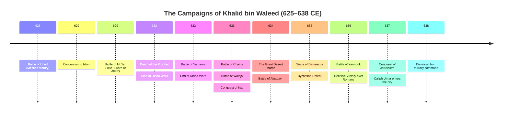

# BIO - Khalid bin Waleed

**At-a-Glance**
| Attribute | Details |
|-----------|---------|
| Full Name | Khalid ibn al-Walid ibn al-Mughira al-Makhzumi |
| Title | Saif Allah al-Maslul (The Drawn Sword of Allah) |
| Born | c. 585 CE, Mecca |
| Died | 642 CE, Homs, Syria |
| Allegiance | Quraysh (Pre-627), Rashidun Caliphate (627–642) |
| Battles | Uhud, Trench, Mu'tah, Conquest of Mecca, Ridda Wars, Conquest of Iraq, Conquest of Syria, Yarmouk |
| Record | Undefeated in over 50 battles |

- - -

## Section 1: Early Life, Military Beginnings, and Conversion to Islam

Khalid ibn al-Walid was born into the prestigious Banu Makhzum clan of the Quraysh tribe in Mecca. The Banu Makhzum were the aristocrats of war among the Quraysh, responsible for the tribe’s military affairs. His father, Al-Walid ibn al-Mughira, was a wealthy and influential leader known for his wisdom and generosity, but also for his staunch opposition to the early message of Islam. From an early age, Khalid was trained in the arts of desert warfare, horsemanship, and strategy. His physical prowess and innate understanding of terrain and movement soon distinguished him as one of Mecca’s most capable young commanders.

During the early conflict between the Meccans and the Prophet Muhammad’s growing community in Medina, Khalid remained loyal to his clan. His first major historical impact occurred at the Battle of Uhud (625 CE). While the Muslim forces initially gained the upper hand and forced the Meccan infantry to retreat, the Muslim archers abandoned their strategic position on the hill of Rumat to collect spoils. Khalid, commanding the Meccan right-wing cavalry, immediately recognized the opening. He led a rapid flanking maneuver around the hill, striking the Muslim rear and turning a near-certain Meccan defeat into a chaotic victory. This maneuver remains one of the most famous examples of cavalry repositioning in early Islamic history.

At the Battle of the Trench (627 CE), Khalid again played a role in the confederate siege of Medina, though the trench tactic neutralized the traditional cavalry charge he favored. Following the Treaty of Hudaybiyyah, Khalid began to reflect on the resilience and conviction of the Muslim community. In 629 CE (7 AH), he travelled to Medina alongside Amr ibn al-As and Uthman ibn Talha to embrace Islam. Upon his conversion, the Prophet Muhammad recognized his military talent, eventually bestowing upon him the title *Saif Allah* (The Sword of Allah) after his brilliant rearguard action at the Battle of Mu'tah, where he managed to save the retreating Muslim army from total annihilation by a significantly larger Byzantine force.

- - -

## Section 2: The Ridda Wars: Securing the Arabian Peninsula

Upon the death of the Prophet Muhammad in 632 CE, the nascent Islamic state faced an existential crisis known as the Ridda (Apostasy) Wars. Many tribes across the Arabian Peninsula, who had pledged allegiance to the Prophet, refused to pay the Zakat (alms) or recognize the authority of the first Caliph, Abu Bakr. Some followed "false prophets" like Musaylima al-Kadhdhab in the Yamama region. Abu Bakr appointed Khalid bin Waleed as the supreme commander of the Rashidun forces to suppress the rebellion.

Khalid’s campaign was characterized by extreme mobility and psychological pressure. He first moved against Tulayha, a self-proclaimed prophet of the Banu Asad, defeating him at the Battle of Buzakha. Khalid’s ability to coordinate disparate tribal levies into a cohesive fighting force was evident here. He then turned his attention to the Banu Tamim before marching toward the greatest threat: the forces of Musaylima in the central plateau of Nejd.

The Battle of Yamama (632 CE) was the bloodiest conflict of the Ridda Wars. Musaylima had gathered an army of nearly 40,000 battle-hardened warriors. The Rashidun forces initially faltered under the weight of the Banu Hanifa’s fierce defense. Recognizing the danger, Khalid reorganized his lines, placing tribal contingents under their own leaders to foster competition and honor. He led from the front, eventually breaking through the enemy lines and forcing them into a fortified orchard known as the "Garden of Death." The resulting slaughter ended the rebellion in central Arabia. Khalid’s victory at Yamama secured the interior of the peninsula, allowing the Caliphate to turn its gaze toward the neighboring empires of Persia and Byzantium.

- - -

## Section 3: The Persian Campaign: The Conquest of Iraq (633 CE)

Following the stabilization of the Arabian Peninsula, Caliph Abu Bakr dispatched Khalid bin Waleed to the Sassanid frontier in Lower Mesopotamia (Iraq). This campaign was Khalid’s first test against the superpower of the East, a professional empire with heavy cavalry (the *Savaran*) and centuries of military tradition. Khalid’s strategy in Iraq was a masterclass in asymmetrical warfare, utilizing the desert as a safe haven from which he could strike and then retreat.

The campaign began with the Battle of Chains (Hafir), so named because the Persian infantry had chained themselves together to form an immovable wall. Khalid utilized a "exhaustion" tactic, repeatedly repositioning his light cavalry to force the heavily armored Persians to move across difficult terrain in the heat. When the Persian commander, Hormizd, accepted a duel, Khalid slew him, and the subsequent Rashidun charge broke the demoralized and exhausted Persian ranks. This victory was followed by the Battle of the River, where Khalid defeated a combined Persian-Arab Christian force.

The most tactically brilliant encounter in the Persian campaign was the Battle of Walaja (May 633 CE). Facing a numerically superior Persian force, Khalid executed a perfect double envelopment—a maneuver famously used by Hannibal at Cannae but rare in the medieval world. He hid two cavalry contingents behind ridges, and once the Persian center was pinned down by the Rashidun infantry, the hidden cavalry struck the Persian flanks and rear. The Persian army was completely destroyed. Following this, the Battle of Ullais (the "Blood River") witnessed the defeat of a massive Persian relief force. Khalid’s ruthless determination to break Persian resistance led to the occupation of Al-Hirah, the strategic capital of the Lakhmid Arabs and the gateway to central Iraq. Within months, Khalid had effectively dismantled Sassanid control over the lower Euphrates, a feat that had eluded previous invaders for centuries.

- - -

## Section 4: The Roman Campaign: The Invasion of Syria (634 CE)

While Khalid was consolidating his gains in Iraq, the Rashidun armies in Syria were struggling against the massive mobilizations of the Byzantine Empire under Emperor Heraclius. Abu Bakr issued a historic order to Khalid: "March to Syria... until you join the Muslim forces there." What followed was one of the most legendary feats of endurance in military history: the desert march from Iraq to Syria across the "Waterless Wilderness."

Khalid took a small force of nearly 9,000 men through the Syrian desert, bypassing the heavily fortified Byzantine border posts. To sustain his horses and camels through the 500-kilometer trek where no water sources were known, Khalid allegedly forced some of the camels to drink vast quantities of water, then bound their mouths to prevent them from ruminating, effectively using them as mobile water tanks. He emerged near Damascus, surprising the Byzantine garrison and sending shockwaves through the empire.

His arrival in Syria immediately turned the tide. He took overall command of the four Rashidun armies and consolidated them at Ajnadayn (July 634 CE). At the Battle of Ajnadayn, Khalid faced a Byzantine army of approximately 90,000 men. He utilized his mobility to isolate Byzantine units and strike their centers of command. The Rashidun victory at Ajnadayn shattered Byzantine prestige in the Levant and paved the way for the siege of Damascus. Khalid’s ability to transition from the river-dominated warfare of Iraq to the hilly, urban-centric warfare of Syria demonstrated his versatility as a general. His presence alone acted as a force multiplier, instilling a sense of divine inevitability in his troops.

- - -

### Timeline of Campaigns

- - -

## Section 5: The Battle of Yarmouk: The Final Victory

In August 636 CE, the Byzantine Empire made its final, massive effort to reclaim Syria. Emperor Heraclius assembled an army of approximately 150,000 men (estimates vary), including Greeks, Slavs, Franks, and Christian Arabs (Ghassanids). The Rashidun forces, numbering around 40,000, retreated to the Yarmouk River, south of the Sea of Galilee, a position Khalid had chosen for its strategic topography.

The Battle of Yarmouk lasted six days. On each day, the Byzantine heavy infantry and cavalry launched waves of attacks, attempting to break the Muslim lines. Khalid’s tactical innovations were on full display. He created a "Mobile Guard"—an elite cavalry reserve of nearly 4,000 riders under his personal command—that he used to plug any gaps in the Muslim line. Every time a Byzantine unit managed to break a section of the Rashidun infantry, Khalid would charge his Mobile Guard into the flank of the Byzantine breakthrough, forcing them back.

On the sixth and final day, Khalid launched a decisive counter-offensive. He reorganized his cavalry into a single mass and executed a sweeping maneuver that separated the Byzantine cavalry from their infantry. Once the Byzantine cavalry was driven from the field, the infantry was trapped between the Muslim army and the deep ravines of the Yarmouk River. The Byzantine retreat turned into a catastrophic rout. The defeat at Yarmouk effectively ended Byzantine rule in the Levant and opened the gates to the conquest of Jerusalem and eventually Egypt. Emperor Heraclius famously lamented as he boarded a ship for Constantinople: "Farewell, a long farewell to Syria, my fair province."

- - -

## Section 6: Tactical Brilliance: Analysis of Techniques and Innovations

Khalid bin Waleed’s success was not merely a result of religious zeal or tribal bravery; it was rooted in a sophisticated understanding of operational mobility and psychological warfare. His "Great March" from Iraq to Syria is considered one of the most successful examples of an "indirect approach" in military history, striking the enemy where they were least prepared and most vulnerable.

One of his core techniques was the use of **Interior Lines**. By centralizing his command and maintaining high mobility, he could strike individual segments of a larger enemy force before they could consolidate. In both Iraq and Syria, he often faced armies that outnumbered him 3-to-1, yet he achieved victory by ensuring that at the point of contact, his forces were locally superior or more mobile. He was also a pioneer of **Psychological Warfare**, frequently challenging enemy commanders to duels. By slaying Hormizd, Vahan, and others in single combat, he demoralized the enemy ranks before the main battle even began.

His use of the **Cavalry Reserve** (The Mobile Guard) was another innovation. Unlike the Byzantine or Persian armies, which used their cavalry as a primary shock force, Khalid often held his best riders in reserve, using them surgically to stabilize the line or deliver the killing blow to an overextended enemy. This required immense discipline and a panoramic view of the battlefield—traits Khalid possessed in abundance. His tactical flexibility allowed him to adapt the Rashidun light infantry into a force capable of weathering the heavy armored charges of the Sassanids and Byzantines alike.

- - -

## Section 7: Retirement and Legacy

Despite his undefeated record and the adoration of his troops, Khalid’s military career came to an abrupt end in 638 CE. Caliph Umar ibn al-Khattab, who had succeeded Abu Bakr, dismissed Khalid from his command. The reasons were complex: Umar was concerned that the people were beginning to attribute victory to Khalid rather than to God, and there were also administrative tensions regarding Khalid’s handling of war booty. Khalid, showing remarkable humility for a man of his stature, accepted the dismissal and retired to Homs.

Khalid bin Waleed died in 642 CE. On his deathbed, he famously expressed his sorrow that he was dying in bed like a "dying camel" rather than on the battlefield, pointing to the hundreds of scars on his body from sword wounds, spear thrusts, and arrows. He is remembered in history as one of the few generals never to have lost a battle. His campaigns laid the foundation for the expansion of Islam and the dismantling of the old world order of antiquity. To this day, military academies around the world study his maneuvers at Walaja and Yarmouk as prime examples of strategic mobility and the double envelopment.

- - -
