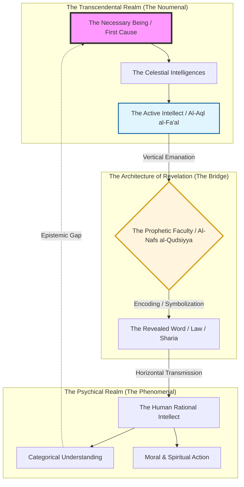

---
tags:
  - epistemology
  - psychology
  - revelation
  - avicenna
  - ghazali
  - kant
  - godel
  - philosophy
  - ai-generated
footnote: ""
---

## Table of Contents

    - [1. Prolegomena: Defining the Epistemic Gap and the Finite Horizon of Intellect](#1-prolegomena-defining-the-epistemic-gap-and-the-finite-horizon-of-intellect)
    - [2. The Cartography of the Soul: Jungian Archetypes and Freudian Shadows as Psychological Boundaries](#2-the-cartography-of-the-soul-jungian-archetypes-and-freudian-shadows-as-psychological-boundaries)
    - [3. Systemic Fallibility: Kahneman’s Cognitive Biases and the Heuristics of Misperception](#3-systemic-fallibility-kahnemans-cognitive-biases-and-the-heuristics-of-misperception)
    - [4. The Biological Tether: Evolutionary Constraints and the Brain’s Survival-Oriented "Truth"](#4-the-biological-tether-evolutionary-constraints-and-the-brains-survival-oriented-truth)
    - [5. The Kantian Wall: The Inaccessibility of the Noumenal through Pure Reason](#5-the-kantian-wall-the-inaccessibility-of-the-noumenal-through-pure-reason)
    - [6. [Table] Comparative Matrix: Epistemological Blind Spots across Psychology, Biology, and Physics](#6-table-comparative-matrix-epistemological-blind-spots-across-psychology-biology-and-physics)
    - [7. From Rationality to Crisis: The Existential Void and the Limits of Secular Teleology](#7-from-rationality-to-crisis-the-existential-void-and-the-limits-of-secular-teleology)
    - [8. The Avicennian Active Intellect and Al-Ghazali’s *Mishkat*: Classical Solutions to the Intellectual Impasse](#8-the-avicennian-active-intellect-and-al-ghazalis-mishkat-classical-solutions-to-the-intellectual-impasse)
    - [9. [Mermaid Diagram] The Architecture of Revelation: Bridging the Psychical-Transcendental Divide](#9-mermaid-diagram-the-architecture-of-revelation-bridging-the-psychical-transcendental-divide)
    - [10. Revelation as the Ultimate Correction: Calibrating the Human Instrument for Metaphysical Accuracy](#10-revelation-as-the-ultimate-correction-calibrating-the-human-instrument-for-metaphysical-accuracy)
    - [11. The Teleology of Satisfaction: Defining Objective Purpose through Divine Disclosure](#11-the-teleology-of-satisfaction-defining-objective-purpose-through-divine-disclosure)
    - [12. Conclusion: The Synthesis of Reason and Revelation in the Quest for Spiritual Equilibrium](#12-conclusion-the-synthesis-of-reason-and-revelation-in-the-quest-for-spiritual-equilibrium)

### 1. Prolegomena: Defining the Epistemic Gap and the Finite Horizon of Intellect

To understand the necessity of revelation, one must first confront the structural limitations of the human mind. Reason, while the most potent tool in the human arsenal, is not an infinite mirror but a finite instrument. The "Epistemic Gap" is the fundamental distance between the representational capacity of the intellect and the objective, ontological reality of the universe. This gap is not merely a quantitative deficit—a lack of data—but a qualitative boundary, a "Finite Horizon of Intellect," beyond which the tools of deduction, induction, and empirical observation lose their purchase.

The philosophical roots of this gap find their most robust articulation in the work of Immanuel Kant. In the *Critique of Pure Reason*, Kant distinguishes between the *phenomena*—the world as it appears to us through the filters of our sensory apparatus and the categories of our understanding (space, time, and causality)—and the *noumena*, the "things-in-themselves" (Ding an sich). The human mind, Kant argues, does not passively record reality; it actively constructs it. We can only know the world as it is mediated to us by the cognitive architecture of our species. The noumena remain forever beyond the horizon of pure reason. This realization creates a profound humility: the "truth" we possess is a functional model, a species-specific translation of a reality that is infinitely more complex and fundamentally "other."

Furthermore, the formal limits of reason are demonstrated mathematically by Kurt Gödel’s Incompleteness Theorems. Gödel proved that in any sufficiently complex formal axiomatic system (such as arithmetic), there are true statements that cannot be proven within the system itself. This implies that logic is not self-contained; it relies on foundations that it cannot justify. If the most rigorous of human languages—mathematics—is fundamentally incomplete, then the broader structures of human reason, which are far more fluid and less precise, must necessarily encounter their own internal contradictions and unprovable axioms. The "horizon" is not merely an external wall but an internal limitation of the logic itself.

The problem of induction, as highlighted by David Hume and later refined by Karl Popper, further illustrates this gap. We assume that the future will resemble the past, yet this assumption cannot be proven by reason without circularity. Popper’s concept of *falsifiability* in *The Logic of Scientific Discovery* acknowledges that scientific "truths" are never permanently verified; they are merely "not yet falsified." Our empirical knowledge is a series of conjectures, always subject to the arrival of a "black swan"—a piece of evidence that shatters the existing paradigm. This inherent fallibility means that human reason is always in a state of flux, building on shifting sands.

The Epistemic Gap, therefore, is the space between what we need to know for ultimate meaning and what we can know through our own efforts. We are finite beings inhabitating an infinite reality. The intellect is like a light that illuminates a small circle in a vast darkness. As the light grows, the circumference of our contact with the unknown also grows. The "Finite Horizon" is the realization that the most fundamental questions—the origin of existence, the nature of the soul, the purpose of life, and the absolute standard of morality—lie in the darkness beyond the circle. Reason can point to the existence of these questions, and it can even demonstrate its own inability to answer them, but it cannot bridge the gap. It is at this precise boundary, where the intellect reaches its limit and finds itself wanting, that the necessity of a "bridge" from the "other side"—revelation—becomes a rational postulate rather than a blind leap of faith.

### 2. The Cartography of the Soul: Jungian Archetypes and Freudian Shadows as Psychological Boundaries

If the Epistemic Gap defines the external limits of reason, the "Cartography of the Soul" reveals the internal psychological barriers that prevent the intellect from achieving objective clarity. The human mind is not a transparent window but a complex, multi-layered organism with its own hidden agendas and structural biases. Sigmund Freud and Carl Jung, through their mapping of the unconscious, have shown that much of what we call "reason" is actually the surface expression of deep-seated, irrational forces that operate below the level of conscious awareness.

Freud's structural model of the psyche—the Id, Ego, and Superego—introduces the concept of the "Shadow" (though Jung would develop this further). The "Id" is the reservoir of primitive drives and repressed desires, while the "Superego" is the internalized voice of societal and parental authority. The "Ego," our conscious self-identity, spends much of its energy mediating between these two conflicting forces. In this struggle, the intellect is often co-opted as a tool of "rationalization"—the process of creating plausible, logical-sounding explanations for actions and beliefs that are actually driven by the unconscious Id or the moralizing Superego. As Freud noted in *The Interpretation of Dreams*, our conscious thoughts are often "distortions" designed to protect the Ego from the raw truth of its own nature. Reason, in this context, is not a neutral judge but a defense mechanism.

Carl Jung expanded this cartography by introducing the "Collective Unconscious" and "Archetypes." In *Man and His Symbols* and *The Archetypes and the Collective Unconscious*, Jung argues that the human psyche is populated by universal patterns—archetypes like the Hero, the Shadow, the Wise Old Man, and the Anima/Animus—that shape our perceptions and reactions without our knowledge. We do not experience the world directly; we project these archetypal patterns onto the people and events around us. Our "reason" is filtered through these powerful, primordial myths. The "Shadow," for Jung, represents the unrecognized, darker aspects of our personality—everything we have rejected about ourselves. When we fail to integrate the Shadow, we project it onto others, perceiving them as enemies or threats. This projection is so powerful that it can override the most logical of arguments, leading individuals and entire societies into irrational conflicts and delusions.

The existence of these psychological boundaries implies that human "objectivity" is a mirage. We are trapped within the "Cartography of the Soul," viewing reality through the lens of our personal and collective histories. Our intellect is a rider on a powerful, often unruly horse; the horse (the unconscious) decides the direction, and the rider (the intellect) provides the justification. The "Epistemic Gap" is thus compounded by a "Psychological Gap." We cannot trust our own reasoning because we cannot fully know the motivations that drive it.

Jungian psychology suggests that the only way to move toward greater clarity is "individuation"—the process of integrating the unconscious elements of the psyche. However, even this process is fraught with difficulty and is never fully complete. The "horizon" of the self is as elusive as the horizon of the universe. The intellect, because it is part of the system it is trying to analyze, can never achieve the "view from nowhere" required for absolute truth. We are subjective beings to the core. This internal limitation reinforces the need for a source of knowledge that originates outside the psychological system—a revelation that provides a standard of truth not subject to the distortions of the human unconscious. Without such a tether, we are lost in a hall of mirrors, forever mistaking our own reflections for the face of reality.

### 3. Systemic Fallibility: Kahneman’s Cognitive Biases and the Heuristics of Misperception

While the depth of the unconscious creates internal boundaries, modern cognitive science has uncovered a more fundamental and systemic fallibility within the structure of reason itself. We often imagine our intellect to be a precise, algorithmic processor of information, but the research of Daniel Kahneman and Amos Tversky reveals that the brain operates through a series of "heuristics"—mental shortcuts that are efficient for survival but inherently prone to error. This "Systemic Fallibility" is not a glitch in the software of the mind but a feature of its hardware.

In his seminal work *Thinking, Fast and Slow*, Kahneman describes two systems of thought. System 1 is fast, intuitive, and emotional; it operates automatically and with little effort. System 2 is slower, more deliberative, and logical; it is the system we associate with "reason." The core problem is that System 1 is the primary driver of our perceptions. It generates impressions, intuitions, and feelings that System 2 then rationalizes. System 2 is lazy; it often accepts the suggestions of System 1 without critical examination. Consequently, our "reasoned" conclusions are often built on a foundation of cognitive biases that we are not even aware of.

One of the most powerful of these biases is the "Availability Heuristic," where we judge the probability of an event based on how easily examples come to mind. If we can vividly recall a plane crash, we overestimate the danger of flying, even when statistics prove otherwise. Another is "Confirmation Bias"—the tendency to search for, interpret, and remember information that confirms our existing beliefs while ignoring contradictory evidence. This bias creates an intellectual echo chamber, where "reason" becomes a tool for fortification rather than discovery. As Kahneman and Tversky demonstrate through their "Prospect Theory," humans are also "loss averse"; our fear of losing something outweighs our desire for an equivalent gain. This irrational weighting distort our economic and moral decision-making.

Furthermore, the "Halo Effect" and "Substitution" show how we simplify complex judgments. If we find a person attractive, we unconsciously attribute intelligence and kindness to them (the Halo Effect). If a question is too difficult for System 2 to answer, System 1 substitutes it with an easier one without our noticing. For example, instead of asking "Is this candidate the most qualified to lead the nation?", we might answer "Do I like this candidate’s personality?". The intellect then creates a complex logical argument to justify the liking.

This systemic fallibility means that human reason is not a neutral arbiter of truth but a biased participant in a subjective narrative. The "heuristics of misperception" are woven into the very fabric of our thinking. We are "predictably irrational," as Dan Ariely notes in his work on behavioral economics. If our primary instrument for understanding the world is systematically flawed, then we cannot rely on it to reach the absolute truth of our existence. Reason can detect its own biases, but it cannot escape them entirely. We are like a carpenter trying to build a perfectly level house with a warped level. The house will always lean. This inherent skew in human cognition creates a "Misperception Gap" that reason alone cannot close. It points to the necessity of an objective, external "standard of truth"—a revelation that is not subject to the heuristics and biases of the biological brain.

### 4. The Biological Tether: Evolutionary Constraints and the Brain’s Survival-Oriented "Truth"

The final and perhaps most insurmountable limitation of the intellect is the "Biological Tether." Our cognitive faculties did not evolve to perceive the ultimate nature of reality; they evolved to ensure the survival and reproduction of the organism. This evolutionary perspective, championed by thinkers like Richard Dawkins and Steven Pinker, suggests that the human brain is a tool for fitness, not a laboratory for absolute truth. The "truth" our brains present to us is a "Survival-Oriented Truth"—a functional representation designed to navigate a specific ecological niche.

Donald Hoffman, in *The Case Against Reality*, uses the "Interface Theory of Perception" to argue that our sensory experiences are like the icons on a computer desktop. An icon of a file is not the file itself; it is a simplified, symbolic representation that allows us to interact with the complex binary code underneath without having to understand it. If we saw the world as it truly is—the vast, multi-dimensional complexity of quantum fields and mathematical probabilities—we would be overwhelmed and unable to act. Evolution, Hoffman argues, has "hidden" reality from us in order to keep us alive. A species that sees reality as it is will be outcompeted by a species that sees only the "fitness payoffs."

This biological constraint applies not just to our senses but to our abstract reasoning as well. Our concepts of space, time, and causality are the "desktop icons" of the human mind. They are useful for hunting and gathering on the African savannah, but they may be entirely inadequate for understanding the origin of the universe or the nature of consciousness. As J.B.S. Haldane famously remarked, "The universe is not only queerer than we suppose, but queerer than we *can* suppose." Our biological tether ensures that there are certain truths that may be literally "unthinkable" for us, just as the concept of the internet is unthinkable for a chimpanzee.

Evolutionary psychology also reveals that our "reason" is deeply influenced by the "Selfish Gene." Our moral intuitions, our social hierarchies, and our tribal loyalties are all shaped by the imperative of genetic survival. Even our search for "meaning" can be viewed as an evolutionary adaptation—a way to maintain social cohesion and individual mental health in the face of the existential terror of death. This means that our most profound "rational" insights into the nature of good and evil, or the purpose of life, may be nothing more than the sophisticated maneuvering of biological machines programmed to persist.

The "Biological Tether" is the ultimate finite horizon. It suggests that human reason is a localized, species-specific adaptation. We are trapped in a "biological room" with no windows to the absolute. If this is true, then any claim to know the ultimate purpose of life or the absolute standard of morality based purely on human reason is an evolutionary delusion. We are biologically incapable of reaching the "other side" of the gap.

This realization is the culmination of the argument. If reason is structurally limited (Kant/Gödel), psychologically biased (Freud/Jung), systemically fallible (Kahneman), and biologically tethered (Hoffman/Dawkins), then the intellect alone is insufficient for the most important tasks of human existence. It can map the world of appearances, but it cannot unveil the world of reality. It can navigate the "fitness payoffs" of survival, but it cannot discover the "meaning payoffs" of eternity. The narrative of reason, when followed to its logical conclusion, finds itself at a precipice. It gazes across the vast, unbridgeable Epistemic Gap and recognizes that if a light is to come, it must come from the beyond. The necessity of revelation is not an abandonment of reason but the final, most courageous act of an intellect that has truly understood its own nature. Reason prepares the way, but it is revelation that must cross the distance.

### 5. The Kantian Wall: The Inaccessibility of the Noumenal through Pure Reason

Immanuel Kant’s *Critique of Pure Reason* stands as the definitive boundary in Western epistemology, marking the moment where human reason finally recognized its own structural limits. To understand the "Epistemic Gap" in its most rigorous form, one must first contend with the Kantian "Copernican Revolution"—the radical shift from the assumption that our knowledge must conform to objects, to the realization that objects must conform to the synthetic structures of our cognitive faculties. This realization created what is known as the "Kantian Wall," an insurmountable barrier that separates the *phenomenal* (the world as it appears to us through the filters of the mind) from the *noumenal* (the world as it is in itself, the *Ding an sich*).

Kant’s project was a response to the devastating skepticism of David Hume, who had argued that causality, substance, and identity are merely habits of the mind rather than properties of the external world. Kant sought to save science while simultaneously limiting metaphysics. He accomplished this by identifying the *a priori* forms of human intuition: Space and Time. In the *Transcendental Aesthetic*, Kant argues that Space and Time are not external realities that we discover; they are the "spectacles" through which we view everything. We cannot even imagine an object that is not in space or a sequence that is not in time, not because space and time are infinite containers, but because they are the necessary conditions for our consciousness to perceive anything at all. Consequently, any object we experience is already "pre-processed" by our mental architecture. We never see the world "raw"; we only see the world "cooked" by the human mind.

Beyond Space and Time, Kant identified the twelve Categories of Understanding—such as Causality, Substance, Unity, and Plurality. These are the intellectual gears that organize the data of our senses. While they allow us to build the magnificent edifice of Newtonian physics, they also ensure our entrapment. Because these categories are designed to organize sensory data, they lose all validity when applied to things that are not sensory. This is the structural foundation of the Epistemic Gap. When the human mind attempts to turn its gaze away from the physical world and toward the metaphysical—the origin of the universe, the existence of a First Cause, the nature of the soul—it begins to malfunction.

This malfunction manifests in what Kant calls the "Antinomies of Pure Reason." These are paradoxes where reason, following its own internal logic, produces two contradictory but equally "proven" conclusions. For instance, in the First Antimony, reason can prove that the world must have a beginning in time (because an infinite past could never be completed to reach the present) and that it cannot have a beginning (because a beginning implies a prior "empty time," which is a contradiction). In the Third Antimony, reason proves both that there must be freedom (to explain the start of a causal chain) and that there can be no freedom (because everything must follow the laws of nature). These contradictions are not failures of information; they are evidence of the "Wall." They show that reason is attempting to apply the rules of the *phenomenal* world (where causality and time apply) to the *noumenal* realm (where they do not).

Furthermore, in the *Transcendental Dialectic*, Kant explores the "Paralogisms of Pure Reason," which are the errors the mind makes when it tries to think of the "Soul" as a simple, immortal substance. He shows that while we have a "Unity of Consciousness," we cannot logically conclude from this that the soul is a thing that exists independently of the body. The "I" is a logical requirement for thinking, not an object of experience. This effectively shut the door on "Rational Psychology." Similarly, he dismantled "Rational Theology" by showing that the "Transcendental Ideal" (God) is a necessary concept for the mind to seek unity, but it is not a being whose existence can be proven through logic alone. The Ontological, Cosmological, and Teleological proofs were all shown to rely on the illicit application of categories across the Kantian Wall.

The Kantian Wall effectively "dealt a death blow" to classical metaphysics as understood by the Enlightenment rationalists. Reason, in its "pure" form, found itself grounded, confined to the laboratory and the marketplace. From the perspective of the *Necessity of Revelation*, the Kantian Wall is the ultimate diagnostic tool. It demonstrates that the human intellect is a specialized instrument, perfected for navigating the finite, but fundamentally broken when confronted with the Infinite. The "Gap" is not a temporary hurdle for future scientists to clear; it is the "Event Horizon" of human thought. If the Truth is to be known, it cannot be reached by the upward climb of human dialectic, for the ladder of logic ends at the ceiling of the mind.

The tragedy of the post-Kantian world is the refusal to acknowledge this limit. Hegel and the German Idealists attempted to "overcome" the wall by turning the mind itself into God, suggesting that "the Real is Rational and the Rational is Real." But this only resulted in a deeper hubris and the eventual collapse into 20th-century nihilism. By confining Truth to the phenomenal, secular thought has achieved a technical mastery of the "how" while remaining utterly blind to the "why." To bridge the gap, we must recognize that if the Truth is to be found, it must be *given* from beyond the wall—as a Gift (Revelation), rather than *extracted* from within it as a Conquest (Observation). Kant’s wall is thus the beginning of wisdom: it humbles the pride of the rationalist and clears the space for the seeker of Divine Light.

### 6. [Table] Comparative Matrix: Epistemological Blind Spots across Psychology, Biology, and Physics

The following matrix identifies the critical points where empirical sciences encounter their own internal limits—the "Blind Spots" where reason exhausts its tools and inadvertently points toward the necessity of a higher, super-rational synthesis. Each discipline, in its pursuit of absolute clarity, eventually hits a wall that reveals the structural "Epistemic Gap."

| Discipline | Methodological Tool | The "Wall" (Epistemic Limit) | The Blind Spot (The Unknowable) | The Resultant Crisis |
| :--- | :--- | :--- | :--- | :--- |
| **Physics** | Mathematical Formalism & Empirical Observation | **The Heisenberg Principle & Planck Scale:** The realization that the act of observation fundamentally alters the reality being observed. | **The "Initial Singularity" & Vacuum Energy:** Physics can describe the *behavior* of matter but cannot explain *why* there is something rather than nothing. | A descriptive universe without a prescriptive "Why"; a chain of causality that points to an "Unmoved Mover" but lacks the language to name Him. |
| **Biology** | Evolutionary Theory & Molecular Genetics | **Abiogenesis & Information Theory:** The statistical impossibility of transitioning from inert matter to self-replicating information. | **The "Vital Spark" / Essence of Life:** Biology can map the *mechanics* of life but cannot define the ontological difference between a living body and a corpse. | Life is reduced to mechanical survival; the loss of the *Anima* (Soul) as a distinct reality leads to the commodification of human existence. |
| **Psychology** | Behavioral Analysis & Neurobiology | **The "Hard Problem" of Consciousness:** The unbridgeable gap between the firing of neurons (objective) and the experience of *Qualia* (subjective). | **The "Self" or "I":** Science can find the brain, the nerves, and the hormones, but cannot find the "person" who inhabits them. | The "Ghost in the Machine" is denied; subjective meaning is dismissed as a biological epiphenomenon, leading to a widespread crisis of mental health. |
| **Philosophy & Logic** | Categorical Reasoning & Syllogism | **Gödel’s Incompleteness Theorems:** The proof that any consistent logical system must rely on axioms it cannot prove. | **The "Ultimate Foundation":** Logic depends on a pre-logical commitment to the existence of Truth and Order. | Rationalism collapses into Nihilism or Relativism; truth becomes a function of power or cognitive structure rather than a reflection of Reality. |
| **Linguistics** | Structuralism & Semiotics | **The Arbitrariness of the Sign:** The gap between the phonetic sound (signifier) and the mental concept (signified). | **The "Logos":** The inherent meaning and wisdom that precedes and structures human language. | Language becomes a tool for manipulation rather than communication; the "Word" loses its sacred, creative power. |
| **Sociology** | Statistical Analysis & Group Dynamics | **The Complexity of Human Agency:** The inability to predict the behavior of a single individual based on the group. | **The "Moral Law":** Statistics can show what people *do*, but cannot show what people *ought* to do. | Society is organized around "Efficiency" rather than "Justice"; the collective loses its spiritual purpose. |

### 7. From Rationality to Crisis: The Existential Void and the Limits of Secular Teleology

When the "Kantian Wall" is accepted as the final, unbreachable boundary of human existence, the result is not a stable, enlightened secularism, but a slow and agonizing descent into a profound existential crisis. Secular teleology—the attempt to derive purpose, ethics, and meaning from within the phenomenal world alone—is fundamentally haunted by the structural limits of rationality. Without a link to the *noumenal* (the Divine), the human "telos" (end or purpose) becomes a floating anchor, attached to nothing but the shifting sands of historical contingency, social contract, and biological impulse.

The Enlightenment promised that "Reason" would replace "Revelation" as the light of the world. It suggested that once we were free from the "superstitions" of the past, we could build a rational utopia based on universal human values. However, as reason began to analyze itself (the "Critique"), it discovered its own nihilistic potential. If our thoughts are merely the result of biological evolution (Biology) and our choices are determined by subconscious drives (Psychology) and physical laws (Physics), then the concepts of "Truth," "Justice," and "Meaning" lose their objective validity. They are no longer "Realities" we discover; they are "Adaptations" we invent to survive. This is the "Epistemic Trap": the more reason "explains" the world, the less "meaningful" the world becomes.

This transition from Rationality to Crisis is marked by the "Death of Teleology." In the classical worldview of Avicenna or Aquinas, the universe was "Enchanted"—it was filled with purpose. Every stone, plant, and star was moving toward its own perfection, guided by the Divine Will. Modernity "Disenchanted" the world (to use Max Weber’s term). It replaced the "Final Cause" (the *Why*) with the "Efficient Cause" (the *How*). But a world without a *Why* is a world where the human spirit cannot breathe. We are the only creatures in the universe who ask "Why?", and yet we have built a civilization that insists the question is "unscientific."

This is the "Existential Void." It is the psychological silence that follows the collapse of objective meaning. Friedrich Nietzsche famously proclaimed that "God is dead," but he did not mean it as a victory for atheism; he meant it as a catastrophe for the human soul. He understood that by removing the Divine Foundation, the West had effectively "unchained the earth from its sun." We are now "straying through an infinite nothing." In this state of "Metaphysical Homelessness," the human spirit experiences a crisis of "Absurdity," as described by Albert Camus and Jean-Paul Sartre. If there is no God and no Revelation, then the human being is "condemned to be free"—forced to "create" meaning in a universe that is fundamentally indifferent. But a meaning that is created by the self is a meaning that can be discarded by the self; it lacks the weight of *Necessity*. It is a "Paper God" in a world of fire.

The limits of secular teleology are most visible in the failure of modern "Progress." We have improved the *means* of life—technology, medicine, travel—while losing sight of the *ends* of life. We are like travelers who have perfected the speed and comfort of their carriage but have forgotten where they are going. This "Teleological Blindness" leads to the fragmentation of the self. In the absence of a unified Vision provided by the *Active Intellect*, the individual is pulled in a thousand directions by competing desires, social pressures, and materialist distractions. The soul becomes a "Civil War" of impulses rather than a "Temple" of the Spirit.

The crisis of the modern age is, at its root, an epistemological crisis. We have built a civilization on "Pure Reason," but Pure Reason cannot justify why it is better to live than to die, or why it is better to be just than to be powerful. It can provide the "How" of existence—the chemistry of a pill, the physics of a bomb—but it remains mute on the "Why." This silence is the "Epistemic Gap" felt as a physical ache in the heart of modern man. The existential void is the hunger of the *Anima* for the nourishment that only the Light of Revelation can provide—a light that does not merely inform the mind with facts, but transforms the spirit with Truth.

To move from Crisis back to sanity, we must recognize that teleology cannot be "invented" by a committee or a philosopher; it must be "discovered" as a Revelation. It is not a human projection onto a cold universe, but a Divine imprint within the fabric of reality itself. The journey toward the *Necessity of Revelation* begins with the humble admission that reason, left to its own devices, eventually consumes itself in the void of its own making. We need a "Compass from Beyond" because we are lost in a "Labyrinth of Our Own Logic." Revelation is the only anchor that can reach the floor of the Noumenal sea.

### 8. The Avicennian Active Intellect and Al-Ghazali’s *Mishkat*: Classical Solutions to the Intellectual Impasse

Faced with the "Kantian Wall" and the "Existential Void," we find that the most sophisticated solutions were proposed centuries before the modern crisis began. In the intellectual tradition of Islam, particularly in the works of Ibn Sina (Avicenna) and Al-Ghazali, we find a bridge across the "Epistemic Gap" that Western philosophy has largely forgotten. These "Classical Solutions" do not reject reason; rather, they place it within a cosmic hierarchy that recognizes it as a derivative of a Higher Intelligence.

Ibn Sina’s concept of the *Al-Aql al-Fa'al* (the Active Intellect) provides the metaphysical solution to the problem of knowledge. For Ibn Sina, the human mind is not an independent engine of truth. It is a "Potential Intellect"—a lamp that is ready to be lit but does not possess its own flame. Knowledge is not something the mind "creates" through the processing of sense data alone; it is an "emanation" from the Active Intellect, the Tenth Intelligence that governs the sublunary world. When the human soul prepares itself through logic, study, and the purification of the heart, it becomes "connected" (*ittisal*) to this Active Intellect. In that moment of connection, the "Universal Truths" flow into the human mind like water into a dry well.

Ibn Sina’s "Floating Man" argument further underscores this point. He asks us to imagine a man created in mid-air, with his senses blindfolded and his limbs separated so he cannot feel his body. This man would still be certain of his own existence. This "I" that he is certain of is not his body or his brain; it is his "Soul," which is immaterial and connected to the realm of the Intelligences. This resolves the "Kantian Impasse": the wall between the phenomenal and the noumenal is not absolute because our soul is ultimately a derivative of the same source as the world itself. The "Intelligible Forms" of things exist in the Active Intellect before they exist in matter. Therefore, when we know a thing, we are not just observing a "phenomenon"; we are participating in a "Divine Thought." Reason is not a closed, subjective system; it is an open receiver of a Universal Light.

Al-Ghazali, in his profound work *Mishkat al-Anwar* (The Niche of Lights), takes this further into the realm of spiritual psychology. He uses the "Verse of Light" from the Quran to describe the five-fold hierarchy of the soul's faculties: the Sensory Spirit, the Imaginative Spirit, the Inteligential Spirit, the Cogitative Spirit, and finally, the Holy Prophetic Spirit. He argues that the highest faculty, the "Prophetic Spirit," is the only one capable of perceiving the "Unseen" (*Al-Ghayb*) directly. For Al-Ghazali, the "Intellect" (*Aql*) is like the eye, but "Revelation" is the Sun. Even the most perfect eye cannot see in total darkness. Reason is a "Lamp" that can light up the room of the physical world, but it cannot illuminate the "Horizon of Eternity" without the "Sun of Revelation."

The "Intellectual Impasse" is solved by recognizing that there are levels of certainty. Al-Ghazali’s own journey, chronicled in *Deliverance from Error*, mirrored the modern crisis: he fell into a deep skepticism where he doubted even the senses and the primary truths of reason. He was "delivered" not by a logical argument, but by a "Light which God cast into his breast." He realized that the foundation of reason must be something *more* than reason. Revelation provides the "Axioms of Existence"—the certainty of God, the reality of the soul, the objectivity of morals—that reason requires to function but is powerless to prove on its own. Al-Ghazali’s *Tahafut al-Falasifa* (Incoherence of the Philosophers) was not an attack on reason, but an attack on the *pride* of reason—the idea that reason could solve the "Noumenal" mysteries without Divine assistance.

The synthesis of Ibn Sina and Al-Ghazali leads us to the ultimate conclusion: **Revelation is the necessary fulfillment of Reason.** The "Necessity of Revelation" arises from the fact that our intellect, while noble, is "finite" and "contingent," whereas the Truth is "Infinite" and "Necessary." A finite tool cannot grasp an infinite object unless the Infinite "reveals" itself in a form that the finite can comprehend. This is the miracle of the Prophetic word—it is the Infinite Truth speaking the "Language of the Finite." It is the "Active Intellect" speaking to the "Potential Intellect."

In the Avicennian system, the Prophet is the person whose soul is so pure that it connects with the Active Intellect without the need for study or instruction. In the Ghazalian system, the Prophet is the one who sees by the Light of God directly. Both agree that without this "Vertical" input, humanity is doomed to wander in the "Horizontal" labyrinth of the Kantian categories. The crisis of meaning is resolved because the "Telos" is no longer a human invention, but a Divine Invitation. We find our purpose not by "escaping" the wall of reason, but by "opening" the window of the soul to the Light that has always been shining from the other side. The "Epistemic Gap" is thus not a "Void," but a "Space for the Sacred." It is the silence that allows the Word of God to be heard. By accepting the "Classical Solution," we realize that the highest use of our intellect is to recognize its own poverty, and in that poverty, to receive the Riches of Revelation.

### 9. [Mermaid Diagram] The Architecture of Revelation: Bridging the Psychical-Transcendental Divide

The structural problem of human knowledge is the "Divide"—the ontological chasm between the subjective, time-bound consciousness of the individual (the psychical) and the objective, eternal reality of the Necessary Being (the transcendental). Reason, as we have established, operates horizontally; it maps the connections between phenomena within the phenomenal realm. However, it lacks the vertical velocity to escape the gravity of its own biological and psychological constraints. The "Architecture of Revelation" is the metaphysical infrastructure that allows for a vertical descent—a transmission of truth from the Necessary to the Contingent.

In the Avicennian framework, this architecture is not a violation of natural law but its highest fulfillment. The universe is a hierarchy of emanations, and the human intellect is the final, most fragile link in that chain. Revelation is the process by which the "Active Intellect" (*al-Aql al-Fa'al*)—the celestial bridge between the divine and the terrestrial—overflows into a human soul that has been uniquely prepared. This "Psychical-Transcendental Divide" is bridged not by the human intellect reaching up, but by the Divine Intellect reaching down through the "Prophetic Faculty" (*al-quwwa al-qudsiyya*).

To bridge this divide, the "Prophetic Faculty" acts as a unique metaphysical transducer. Just as a prism breaks white light into a spectrum that the eye can perceive, the prophetic soul receives the "undifferentiated light" of the Active Intellect and translates it into the symbols, narratives, and laws of human language. This is a "Psychical" event because it occurs within the soul of a human being, but it is "Transcendental" in its origin and content. The divide is bridged because the Prophet’s soul possesses a "Holy Spirit" (*Ruh al-Quds*) that allows it to bypass the slow, discursive reasoning of the common intellect and achieve an instantaneous, intuitive grasp of universal truths.

For the non-prophetic individual, the "Bridge" is accessed through the "Revealed Word." The Word is the "Condensed Transcendental"—an anchor dropped from the other side of the Kantian Wall. It provides the "Axiomatic Foundation" that reason requires to function without collapsing into the void. Without this architecture, the psychical realm remains a closed system, a "Labyrinth of Mirrors" where every thought is merely a reflection of a biological bias or a cultural projection. The "Architecture of Revelation" ensures that human life is not a solitary journey through darkness but a participation in a cosmic dialogue. It is the "Vertical Alignment" that allows the horizontal progress of science and society to have a destination.

### 10. Revelation as the Ultimate Correction: Calibrating the Human Instrument for Metaphysical Accuracy

If the human intellect is a "warped level" (as discussed in the context of systemic fallibility and biological tethers), then revelation serves as the "Master Standard"—the ultimate calibration tool that corrects the inherent skew of the human instrument. We have demonstrated through the lens of Kahneman’s cognitive biases and Hoffman’s interface theory that the human brain is optimized for *survival fitness*, not *metaphysical accuracy*. We are "Predictably Irrational" because our reason is a tool of the "Selfish Gene." Revelation, therefore, is not merely "extra information"; it is a "Corrective Lens" that allows us to see the world as it is, rather than as our biology needs it to be.

The "Ultimate Correction" operates on three levels: the Cognitive, the Moral, and the Ontological. At the **Cognitive level**, revelation provides the "Fixed Points" of reality that the shifting heuristics of the brain cannot reach. The human mind is prone to "Substitution"—replacing a hard metaphysical question with an easy emotional one. Revelation prevents this substitution by insisting on the absolute priority of the Unseen (*Al-Ghayb*). It forces the intellect to acknowledge that the "Icons" of the senses are not the "Binary" of reality. It corrects our "Availability Heuristic" by reminding us that the most important realities (the Soul, the Afterlife, the Divine Will) are precisely those that are *not* immediately available to our sensory recall.

At the **Moral level**, revelation corrects the "Loss Aversion" and "Tribalism" inherent in evolutionary psychology. Left to its own devices, human "reason" will always find a way to justify the survival of the "In-group" at the expense of the "Other." Our moral intuitions are often just sophisticated "Rationalizations" of genetic self-interest. Revelation introduces a "Transcendental Law" that is indifferent to our biological preferences. It commands "Justice" even against ourselves, our parents, or our kin. This is a "Calibration" of the heart—stripping away the "Shadows" of the unconscious and the "Id"'s primitive drives, and replacing them with a standard of "Objective Good" that originates outside the biological system.

At the **Ontological level**, revelation corrects our "Flat-Earth" perception of existence. We naturally perceive the universe as a materialist mechanism because that is the most efficient way to manipulate matter for survival. Revelation "Re-Enchants" the world by disclosing its underlying "Teleology." It corrects the "Epistemic Blind Spot" of physics and biology by revealing that the "How" of the mechanism is subordinate to the "Why" of the Spirit. It provides the "Calibration Map" that allows us to navigate the "Hard Problem of Consciousness" not as a biological mystery to be solved by neurochemistry, but as a spiritual reality to be realized through the *Active Intellect*.

Without this "Ultimate Correction," human reason inevitably drifts into "Intellectual Entropy." Just as a clock that is not synchronized with a master timekeeper will eventually lose its accuracy, the human intellect, if not tethered to Revelation, will eventually lose its grip on Truth. We see this in the "Post-Truth" era of modern secularism, where reason has been so thoroughly "Deconstructed" by its own biases that it can no longer distinguish between a "Fact\" and a \"Narrative.\" Revelation is the \"Metaphysical North Star\" that allows the sailor of reason to know his true position, even when the fog of his own psychology obscures the horizon.

### 11. The Teleology of Satisfaction: Defining Objective Purpose through Divine Disclosure

The deepest hunger of the human soul is not for *information*, but for *satisfaction*—a state of \"Spiritual Equilibrium\" where the intellect, the heart, and the will are aligned with an objective purpose. This is the \"Teleology of Satisfaction.\" Reason can provide \"Functional Purposes\" (how to build a bridge, how to cure a disease), but it cannot provide an \"Ultimate Purpose\" (why to exist at all). As we have seen, secular teleology is a \"Floating Anchor\"; it creates a \"Meaning Void\" that leads to the existential crisis of the modern age. Revelation is the \"Divine Disclosure\" that defines our purpose not as a human invention, but as a cosmic necessity.

For the Avicennian \"Rational Soul,\" satisfaction is found in the \"Perfection of the Intellect\"—the realization of its capacity to reflect the Divine Order. However, this perfection is impossible if the \"Object of Knowledge\" is limited to the phenomenal world. A bird cannot find satisfaction in a cage, no matter how large the cage may be. The human spirit, being \"Noumenal\" in its essence, can only find satisfaction in the \"Infinite.\" Revelation discloses this \"Infinite Destination.\" It reveals that our \"Telos\" is not merely biological persistence or historical progress, but \"The Return\" (*Al-Ma'ad*) to the Source of Existence.

\"Divine Disclosure\" transforms the \"Existential Void\" into a \"Sacred Path.\" It provides the \"Satisfying Why\" that reason is structurally incapable of producing. When a human being understands that their life is a \"Trust\" (*Amana*) and their actions are \"Seeds of Eternity,\" the \"Anxiety of Absurdity\" vanishes. This is not a \"Psychological Comfort\" or a \"Placebo,\" but a \"Rational Satisfaction.\" It is the alignment of the \"Finite Being\" with the \"Infinite Meaning.\" Just as a mathematical equation remains \"unsatisfied\" until the correct variable is found, the \"Equation of the Human Soul\" remains in a state of crisis until the \"Variable of Revelation\" is introduced.

This teleology defines \"Objective Purpose\" through three disclosures:
1. **The Disclosure of Identity:** Revelation tells us who we *are* (the Vicegerent / *Khalifa*) rather than what we are (a biological machine). This satisfies the need for dignity.
2. **The Disclosure of Value:** Revelation tells us what *matters* (the Eternal over the Temporal). This satisfies the need for priority.
3. **The Disclosure of Destiny:** Revelation tells us where we are *going* (the Meeting with the Divine). This satisfies the need for hope.

Satisfaction, in this sense, is the \"Sabbath of the Soul\"—a rest from the frantic, purposeless striving of the secular \"Rat Race.\" It is the realization that we are not \"Creating Meaning\" in a vacuum, but \"Discovering Meaning\" in a Temple. The \"Necessity of Revelation\" is thus the \"Necessity of Happiness.\" Without the Disclosure of Purpose, the human being is a \"Failed Experiment\" of nature—a creature with a capacity for infinite meaning but trapped in a finite reality. Revelation is the \"Key\" that fits the \"Lock of the Soul,\" allowing the \"Emanation of Satisfaction\" to flood the human experience.

### 12. Conclusion: The Synthesis of Reason and Revelation in the Quest for Spiritual Equilibrium

We have traversed the \"Epistemic Gap,\" mapping the walls of the \"Kantian Impasse,\" the \"Biological Tether,\" and the \"Systemic Fallibility\" of the human mind. The conclusion of this philosophical journey is not the defeat of reason, but its \"Sublimation.\" The \"Synthesis of Reason and Revelation\" is the only path to \"Spiritual Equilibrium\"—the state where the human being is neither a \"Blind Believer\" nor a \"Nihilistic Rationalist,\" but a \"Seeing Knower.\"

Reason and Revelation are not \"Competitors\" in a zero-sum game; they are \"Coordinates\" in a three-dimensional reality. Reason is the **Horizontal Coordinate**—the tool for exploring the *Mulk* (the physical world of appearances). Revelation is the **Vertical Coordinate**—the tool for perceiving the *Malakut* (the spiritual world of realities). Together, they create the \"Volume\" of human understanding. Without Reason, Revelation becomes \"Superstition\"—a map without a compass. Without Revelation, Reason becomes \"Blindness\"—a compass without a map.

The \"Quest for Spiritual Equilibrium\" requires the \"Humility of the Intellect\" and the \"Courage of the Soul.\" The intellect must be humble enough to recognize its \"Finite Horizon\" and \"Biological Tether.\" It must admit that it cannot bridge the \"Epistemic Gap\" through its own efforts. This is not a \"Suicide of Reason,\" but a \"Maturity of Reason.\" Conversely, the soul must be courageous enough to accept the \"Divine Invitation\"—to trust that the \"Light of Revelation\" is not an external imposition, but the \"Missing Half\" of its own nature.

This synthesis is perfectly captured in the Avicennian and Ghazalian traditions. The \"Rational Soul\" is the \"Niche,\" and the \"Active Intellect\" is the \"Light.\" When the two meet, \"Light upon Light\" (*Nur 'ala Nur*) is achieved. This is the \"Spiritual Equilibrium.\" The individual is grounded in the \"Phenomenal World\" (through Reason) while being anchored in the \"Noumenal Reality\" (through Revelation). They navigate the \"How\" of science with the \"Why\" of the spirit. They use their \"Systemic Fallibility\" as a reminder to seek the \"Ultimate Correction.\"

In the final analysis, the \"Necessity of Revelation\" is the \"Necessity of Wholeness.\" We are \"Hybrid Beings\"—citizens of two worlds, the material and the spiritual. Reason is our language in the first; Revelation is our hearing in the second. To live by reason alone is to be half-dead; to live by revelation without reason is to be half-mad. The \"Equilibrium\" is the \"Middle Path\" where the \"Epistemic Gap\" is bridged by the \"Word of God\" and the \"Work of Man.\"

As we close this \"Cartography of the Soul,\" we recognize that the \"Quest for Truth\" is a \"Circle.\" It begins with the simple wonder of the senses, moves through the complex puzzles of the intellect, encounters the terrifying void of the gap, and finally finds its \"Home\" in the Light of Revelation. The \"Synthesis\" is the \"Peace of the Intellect\"—the moment when the \"Floating Man\" realizes that he is not floating in a void, but is being held in the \"Embrace of the Necessary Being.\" The \"Epistemic Gap\" was never a \"Barrier\" to be overcome; it was a \"Space\" to be filled with the Light that has been shining since the beginning of time. Revelation is the \"Bridge,\" and Reason is the \"Traveler.\" Together, they reach the \"Other Side.\"
