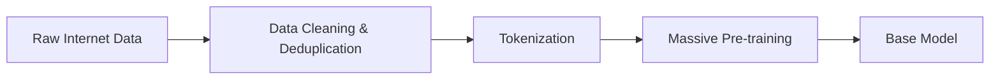
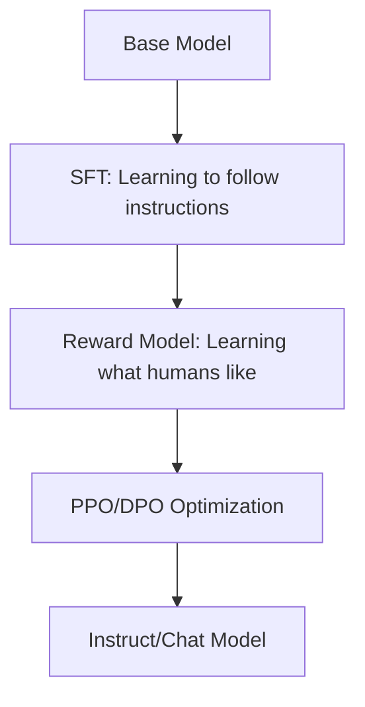

# AI - Large Language Models: Architecture and Mechanics

- - -

**Abstract:**
A comprehensive examination of the underlying systems that power modern Large Language Models (LLMs). This note dissects the journey from raw data to tokenization, the mathematical core of the Transformer architecture, and the competitive landscape of current frontier models.

- - -

## 1. Introduction: The Paradigm Shift of Generative AI

The emergence of Large Language Models (LLMs) represents a fundamental shift in computing: from **deterministic logic** to **probabilistic prediction**. At their simplest, LLMs are next-token predictors. However, at scale, these statistical systems exhibit emergent behaviors that mimic reasoning, creativity, and comprehension.

Traditional NLP (Natural Language Processing) relied on hand-coded rules and shallow statistical methods. The leap to LLMs was catalyzed by three primary factors:
1. **The Transformer Architecture**: A breakthrough in parallel processing of sequential data.
2. **Compute Scaling**: The utilization of thousands of H100/A100 GPUs.
3. **Data Abundance**: The ingestion of trillions of tokens from the public internet, books, and code.

- - -

## 2. Data & Pre-training: The Foundation of Intelligence

Before an LLM can reason, it must "see" the world. The pre-training phase is an unsupervised learning task where the model is fed a massive corpus (e.g., Common Crawl, Pile, GitHub).

**The Task:**
Predict the next word in a sentence. By doing this billions of times, the model implicitly learns grammar, facts, coding syntax, and even social nuances.

**Key Data Characteristics:**
- **Volume**: Measured in Terabytes or Petabytes.
- **Diversity**: Code (for logic), Literature (for narrative), and Scientific Papers (for structure).
- **Curation**: Modern labs use deduplication and toxicity filtering to ensure the model doesn't learn junk.

- - -

## 3. Tokenization: The Alphabet of Machines

Machines do not read words; they process numbers. Tokenization is the process of converting strings of text into a sequence of numerical IDs.

**Tokens vs. Words:**
A token is often a sub-word unit. For example, "unbelievable" might be split into `un`, `believ`, `able`.
- **Rule of Thumb**: 1,000 tokens ≈ 750 words.

**Types of Tokenizers:**
- **Byte-Pair Encoding (BPE)**: Used by GPT models.
- **WordPiece**: Used by BERT.
- **SentencePiece**: Used by Gemini/Llama.

| Term | Description | Example |
|------|-------------|---------|
| **Vocabulary** | The set of all possible tokens a model knows. | GPT-4 vocab size ~100k |
| **Embedding** | A high-dimensional vector representing a token's meaning. | [0.12, -0.45, 0.88...] |

- - -

## 4. The Transformer Architecture: Attention is All You Need

The "Transformer" is the engine under the hood. Its defining feature is the **Self-Attention Mechanism**.

**How Self-Attention Works:**
When the model processes a word, it doesn't just look at the word itself; it looks at every other word in the sequence to understand context.
*Example: "The bank of the river" vs. "The bank was robbed."*
The word "bank" receives different mathematical weightings based on whether "river" or "robbed" appears nearby.

**Mathematical Flow:**
1. **Input Embedding**: Text → Vectors.
2. **Positional Encoding**: Telling the model where words are in a sentence (since Transformers process words in parallel, not one by one).
3. **Multi-Head Attention**: Multiple "eyes" looking at different parts of the sentence simultaneously.
4. **Feed-Forward Networks**: Processing the information gathered by attention.

- - -

## 5. Context Windows & Memory: The Infinite Scroll

The **Context Window** is the maximum number of tokens a model can "keep in mind" at one time.

| Model | Context Window (Tokens) | Comparison |
|-------|-------------------------|------------|
| GPT 5.3 Codex | 1,024,000 | A full technical library |
| Claude Opus 4.6 | 2,500,000 | The complete legal archives of a corporation |
| Gemini 3.1 Pro | 10,000,000+ | An entire lifetime of correspondence + HD video |

**The "Lost in the Middle" Problem:**
Models historically struggled to retrieve information from the middle of a very long context window. Recent architectures (like RMT or modified Ring Attention) have significantly improved this.

- - -

## 6. Fine-tuning & RLHF: Alignment with Human Intent

A base model (trained on the internet) is just a "text completer." If you ask it "How do I make a cake?", it might respond with "Ingredients for a pie" because that's what follows on a recipe blog.

To make it an **Assistant**, we use:
1. **SFT (Supervised Fine-Tuning)**: Training on high-quality Q&A pairs.
2. **RLHF (Reinforcement Learning from Human Feedback)**: Humans rank model responses. The model learns to prefer helpful, safe, and concise answers.

- - -

## 7. Comparative Analysis: GPT vs. Gemini vs. Claude

| Feature | GPT 5.3 Codex (OpenAI) | Claude Opus 4.6 (Anthropic) | Gemini 3.1 Pro (Google) |
|---------|-----------------|------------------------|---------------------|
| **Philosophy** | Logic-native, zero-shot code synthesis. | Recursive self-correction, hyper-nuance. | Universal multi-modality, infinite retrieval. |
| **Best For** | Systems architecture, complex debugging. | Deep research, philosophical synthesis. | Global data mapping, multi-hour video analysis. |
| **Architecture** | Dynamic MoE with Sparse Attention | Constitutional AI v4 Architecture | Native Multi-modal Transformer (NMT) |

- - -

## 8. Challenges & Future Frontiers: Hallucination to AGI

Despite their brilliance, LLMs face critical hurdles:
- **Hallucination**: Confidently stating false information.
- **Inference Cost**: The massive energy and compute power required to run them.
- **Reasoning Gaps**: They are better at pattern matching than pure logical deduction.

**The Road Ahead:**
- **Agents**: LLMs that can use tools (browsers, Python scripts) to execute tasks autonomously.
- **Reasoning Models (o1-style)**: Incorporating Chain of Thought (CoT) during inference to verify logic before outputting.

- - -

**Related Notes:**
- [[AI - 1.0 - Neural Networks]]
- [[AI - 2.0 - CNNs]]
- [[CS - Software Design Techniques]]

- - -
*Created on 2026-03-05 by GeminiCLI (Agent: Ibn Haytham)*
