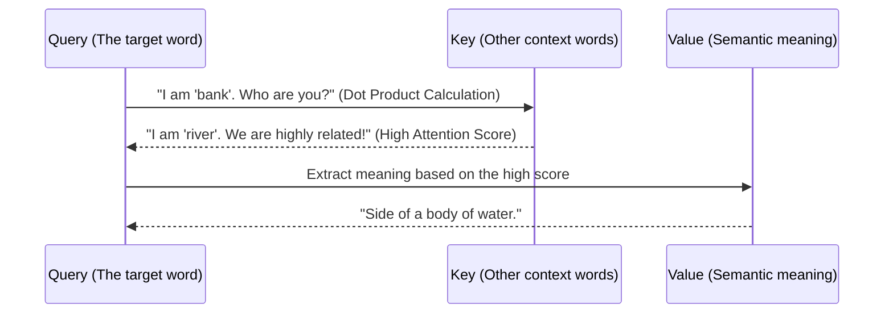

# Transformer Models vs Diffusion in Agentic AI, LLMs and SLMs

## 1. The Crucible - Sequential Bottlenecks and Generative Noise

How do you process information in real-time? When you read a book, do you memorize the first word, then the second, and hold onto a growing, fragile chain of memory until the sentence concludes? 

For decades, this is exactly how the architecture of [[1.0 - Neural Networks|artificial neural networks]] processed language. Recurrent Neural Networks (RNNs) and their more advanced successors, Long Short-Term Memory networks (LSTMs), were the undisputed state-of-the-art for any sequential data. They processed text word by word, step by step. But *why* is sequential processing such a catastrophic bottleneck in modern computation?

The answer lies in two fundamental flaws inherent to the architecture: the vanishing gradient and the impossibility of parallelization. As an RNN processes a long sequence—say, an entire document or a complex piece of code—the hidden state must carry the mathematical context of all previous tokens. If the sequence stretches into the hundreds or thousands of tokens, the mathematical influence of the very first word exponentially decays. By the time the network reaches the end of a paragraph, it has "forgotten" the beginning. 

Furthermore, because computation at step $t$ fundamentally depends on the completed computation of step $t-1$, you cannot compute the sequence simultaneously. You must wait. But what if you have a modern GPU with tens of thousands of cores? An RNN leaves the vast majority of those cores completely idle while computing the current step. 

*How do we break the chain of time?* That was the question that plagued researchers. We needed a mechanism that could look at the entire sequence all at once, in parallel, without losing the structural meaning of order.

Now, let us shift our gaze to a different domain entirely: visual generation. Creating an image from a text description is a monumentally different task than translating text. Before diffusion models captured the world's imagination, we relied heavily on Generative Adversarial Networks (GANs). 

A GAN operates by pitting two neural networks against each other in a zero-sum game—a generator trying to create fake images from random noise, and a discriminator trying to catch the fakes. It was a brilliant concept, but *why* were GANs so notoriously difficult to train and deploy at scale?

The core problem was "mode collapse." In a GAN, the generator might discover one single mathematical "trick" or specific image type that perfectly fools the discriminator. Instead of learning to generate an infinite variety of faces, it learns to generate *one* incredibly convincing face and repeats it endlessly. It doesn't learn the true underlying distribution of the data; it just learns a cheap hack to win the game. Training a GAN is like trying to balance a pencil on its incredibly sharp tip—any slight imbalance in the learning rates of the two networks causes the entire system to crash.

*What if, instead of trying to generate absolute perfection in one massive leap, we started with absolute chaos and slowly, mathematically, sculpted it into order?*

Consider the physical laws of thermodynamics. If you place a drop of blue ink into a glass of clear water, it diffuses over time until it becomes a uniform, cloudy mixture. This process increases entropy and is mathematically predictable. But what if we could run time backward? What if we could learn the exact mathematical steps to separate the ink from the water, pixel by pixel? 

This profound shift in perspective was the crucible that birthed Diffusion models. By intentionally corrupting pristine data with Gaussian noise step by step, we create a highly tractable, step-by-step problem. The neural network no longer has to imagine an entire universe from scratch; it only has to learn one very simple, iterative task: given an image with a microscopic layer of noise, predict and remove just that noise.

These two distinct crises—the sequential computing bottleneck in natural language and the generative instability in computer vision—created the intense academic pressure from which modern AI was forged. The limitations were clear, the hardware was waiting, and the stage was set for two of the most important architectural breakthroughs in computer science history. 

But how do these systems actually overcome these bottlenecks under the hood?

- - -

This raises the fundamental question: if sequential processing is the ultimate bottleneck, how does a neural architecture process an entire sequence simultaneously without losing the structural meaning of order?

## 2. The Zenith: Transformers - Attention and the LLM/SLM Engine

The absolute genius of the Transformer architecture is its complete rejection of sequence in favor of pure, parallel relationship mapping. But this immediately raises a profound question: *how* does a neural network understand the syntax and order of words if it processes them all simultaneously in a single massive matrix multiplication?

First, it injects Positional Encoding. Before the text enters the network, a mathematical sine and cosine wave is added to the word embeddings. This ensures the network knows exactly *where* the word is in the sentence, without having to process the sentence in a linear order.

Then comes the true core engine: **Self-Attention**. 

What does "attention" actually mean in a mathematical sense? It is simply a dynamically weighted sum of values. For every single word in a given sequence, the network asks: *which other words are most relevant to my meaning right now?*

Consider the sentence: "The bank of the river." Does the word "bank" mean a financial institution, or does it mean the muddy side of a river? To determine this, the embedding for "bank" must pay *attention* to the word "river". 



In the standard attention mechanism, every token generates three distinct vectors: a Query (what I'm looking for), a Key (what I contain), and a Value (what I actually represent). We compute the dot product of a Query against all available Keys. A high dot product means high alignment. 

```python
# Why-centric implementation of Scaled Dot-Product Attention
import torch
import torch.nn.functional as F
import math

def self_attention(query, key, value):
    # WHY: We take the dot product of query and key to find the correlation (similarity).
    # Tokens that are highly relevant to each other will produce large positive numbers.
    d_k = query.size(-1)
    scores = torch.matmul(query, key.transpose(-2, -1))
    
    # WHY: We divide by the square root of the dimension size. 
    # If dimensions are very large, dot products explode in magnitude, pushing the 
    # softmax function into extremely flat regions with near-zero gradients.
    scores = scores / math.sqrt(d_k)
    
    # WHY: Softmax converts the raw unnormalized scores into a probability distribution that sums to 1.
    attention_weights = F.softmax(scores, dim=-1)
    
    # WHY: We multiply these normalized weights by the actual values. 
    # Irrelevant words get weights near 0 and vanish. Relevant words are amplified.
    return torch.matmul(attention_weights, value)
```

This specific architecture is the foundation of modern [[Large Language Models - Architecture and Mechanics|Large Language Models (LLMs)]] and Small Language Models (SLMs). But *what if* you don't need to hold the entirety of human knowledge in a massive cluster of servers? What if you only need a model to run on a local device for specific reasoning tasks?

| Feature | Large Language Models (LLMs) | Small Language Models (SLMs) |
|---------|------------------------------|------------------------------|
| **Parameter Count** | 70 Billion to 1 Trillion+ | 1 Billion to 8 Billion |
| **Primary Use Case**| General open-ended reasoning, vast factual knowledge retrieval, complex multi-step coding | Edge computing, task-specific pipelines, real-time local processing, privacy-preserving tasks |
| **Hardware / Latency** | High latency, requires massive clusters of specialized GPUs (H100s) | Low latency, can run locally on consumer hardware (MacBooks, mobile phones) |
| **Notable Examples** | GPT-4, Claude 3.5 Opus, Gemini 1.5 Pro, Llama-3-70B | Llama-3-8B, Phi-3-Mini, Gemma-2-9B |
| **Attention Mechanism** | Standard Multi-Head Attention, Grouped Query Attention | Often relies heavily on highly optimized Grouped Query Attention to save memory bandwidth |

By scaling the depth of the layers and the width of the embeddings, the Transformer scales remarkably well. It is an engine of pure discrete logic. But can a Transformer draw a highly detailed photograph? It can, through tokenization, but not nearly as efficiently as a model designed specifically to sculpt noise.

- - -

This limitation prompts a shift in perspective: if Transformers excel at discrete logic, what architecture must we employ to govern the continuous, hyper-dimensional spaces of visual and physical reality?

## 3. The Zenith: Diffusion - Denoising and Agentic Perception

If Transformers are the undisputed masters of discrete tokens, Diffusion models are the masters of continuous, multi-dimensional space. But the fundamental question remains: *why* add noise to perfectly good data only to remove it? 

Because learning to map pure static to a perfect high-resolution image in one single pass is mathematically intractable. The latent space of all possible images is simply too vast and complex. However, if you take a photograph of a cat, add a tiny, almost microscopic layer of Gaussian static, and ask a neural network to predict *just that specific layer of static*, the problem becomes incredibly solvable. 

This process relies on a Markov Chain. We repeat this forward corruption process $T$ times (e.g., $T=1000$ steps) until the image is completely destroyed into pure, unrecognizable Gaussian noise. 


The true magic happens in the **Reverse Process**. We start with pure noise $x_T$. We pass it into a U-Net architecture (a highly specialized type of [[2.0 - CNNs|convolutional network]] with skip connections). The network doesn't predict the cat itself; it predicts the *noise*. We subtract a highly calibrated fraction of that noise to arrive at $x_{T-1}$. We repeat this iterative denoising process hundreds of times. 

But how does it know to generate a *cat* and not a *dog*? This is where Cross-Attention bridges the gap between text and image. A text prompt is encoded by a standard Transformer, and the resulting dense embeddings are injected directly into the U-Net layers. The network uses the text to condition its noise prediction.

```python
# Why-centric conceptual loop of Reverse Diffusion
def generate_image(prompt_embedding, num_steps=1000):
    # WHY: We must start from a state of maximum entropy (pure Gaussian noise)
    # This acts as a blank canvas from which any possible image can be carved.
    image_state = generate_random_gaussian_noise()
    
    for t in reversed(range(num_steps)):
        # WHY: The model predicts the exact noise present at this specific time step, 
        # heavily guided by the semantic meaning of the text prompt.
        predicted_noise = unet_model(image_state, time_step=t, context=prompt_embedding)
        
        # WHY: We carefully subtract a scaled portion of the predicted noise.
        # If we subtracted all of it at once, the image would shatter due to prediction inaccuracies.
        # Iteration guarantees a smooth descent into the correct probability distribution.
        image_state = remove_noise_fraction(image_state, predicted_noise, t)
        
    return image_state
```

In the rapidly evolving realm of **Agentic AI**, this process isn't just used for generating aesthetically pleasing pictures. What if the "image" isn't an array of pixels, but a continuous trajectory path for an autonomous robot arm? Diffusion models are now being actively integrated into reinforcement learning pipelines to generate complex, continuous action plans. The agent perceives the physical world, and literally *diffuses* a safe, optimal path through 3D space to grasp an object or navigate a room.

- - -

Recognizing that neither discrete reasoning nor continuous spatial generation alone is sufficient for true autonomy, we must ask: how do these distinct paradigms integrate to form a complete, interactive intelligence?

## 4. The Legacy - Convergence in Agentic AI

We have deeply explored the two foundational pillars of modern artificial intelligence: the Transformer, mapping vast semantic relationships across sequences of discrete thought, and the Diffusion model, mathematically sculpting continuous reality out of pure entropy. But the most important question for the future is: *what happens when we fuse these two architectures together into a single system?*

This convergence is the birth of **Agentic AI**. 

An agent is vastly different from a passive generative tool. It is not simply a chatbot that answers a localized query; it is a holistic entity that perceives a complex environment, reasons about its current state, formulates a multi-step plan, and executes precise actions to achieve an overarching goal. 

Consider an autonomous robotics system deployed to pack fragile items in a warehouse:
1. **The Brain (Transformer/LLM):** The system receives a high-level, abstract instruction: "Pack the fragile glass vases safely into the shipping container." It uses its vast pre-trained world knowledge to logically reason: *Glass is highly fragile. It should be wrapped in bubble wrap and placed at the top of the box, ensuring it is not crushed by heavy items.*
2. **The Perception (Vision-Language Model):** The agent looks at the work table. A Transformer-based visual encoder tokenizes the physical scene, perfectly identifying the vase, the protective wrap, and the target box.
3. **The Hands (Diffusion Policy):** The LLM outputs a discrete, logical plan. But a robot arm cannot execute a text command like "wrap the vase" directly. It requires precise, continuous motor torques. A Diffusion model takes the LLM's high-level plan as a conditioning prompt and iteratively *denoises* a physical trajectory for the robotic arm, calculating the exact, smooth physical movements required to execute the task without breaking the glass.

| Capability Area | Transformers (LLMs & SLMs) | Diffusion Models | Role in Agentic AI Framework |
|-----------------|-----------------------------|------------------|------------------------------|
| **Primary Domain** | Discrete symbolic tokens (Text, Code, API calls, Logic) | Continuous dimensional space (Images, Audio, Physical Trajectories) | **Transformers:** The Strategic Planner and Logical Reasoning Engine |
| **Core Strengths** | Abstract reasoning, sequence prediction, in-context learning, semantic retrieval | Handling highly complex, multimodal continuous distributions | **Diffusion:** The Motor Cortex and Spatial Visualizer |
| **Weaknesses**| Struggles to natively model smooth, continuous physical spaces | Slow inference due to iterative nature, poor at abstract symbolic logic | Working in tandem, they form a complete, closed-loop autonomous agent |

*So what is the ultimate legacy of this convergence?*

The legacy of these combined architectures is the paradigm shift from **Generative AI** to **Interactive, Agentic AI**. We are no longer simply generating a poem or a painting in a digital vacuum. We are deploying autonomous systems that actively reason about their own outputs, critique their own mistakes, and physically or digitally manipulate the real world. 

The Transformer gave the machine a voice, a memory, and a logical mind; Diffusion gave it a spatial imagination and the capacity for continuous action. 

The most pressing question for computer scientists is no longer *can the machine generate a correct output?* The question is now: *what will the machine do with the outputs it generates, and how will it act upon the world?*

- - -

## Related Notes
- [[Large Language Models - Architecture and Mechanics]]
- [[1.0 - Neural Networks]]
- [[2.0 - CNNs]]