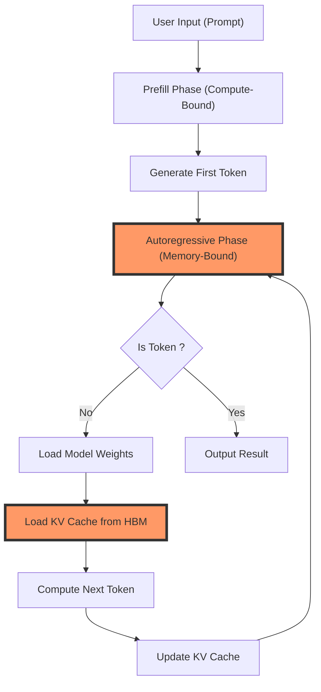
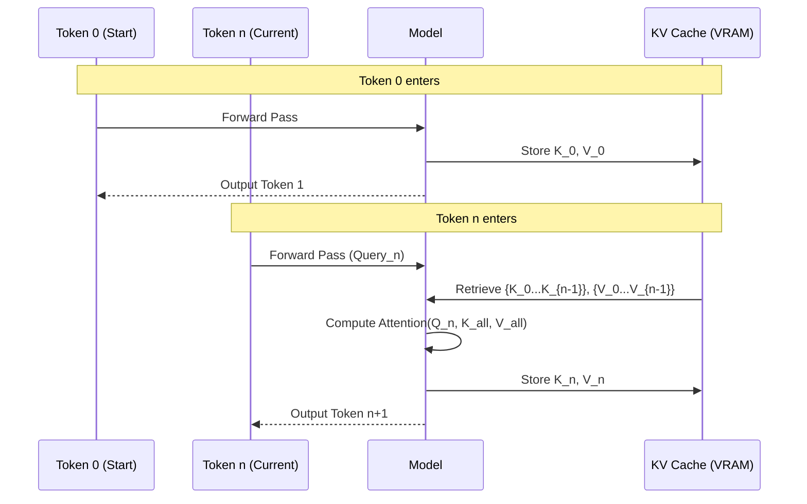
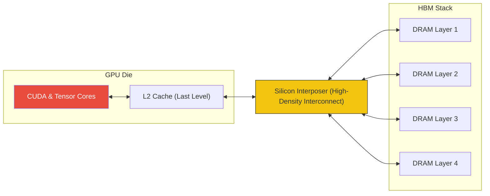
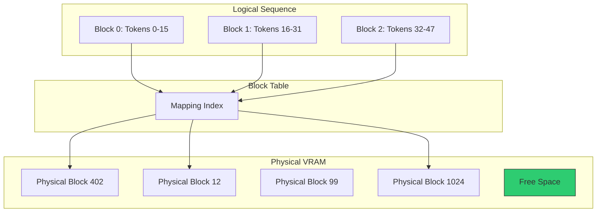

# KV Cache and Hardware for Context and Memory

In the realm of [[Large Language Models - Architecture and Mechanics|Large Language Models (LLMs)]], hardware constraints have shifted from raw computation to data retrieval speeds. Modern AI accelerators are increasingly defined by their memory bandwidth rather than their floating-point operation (FLOP) capacity. This structural bottleneck is known as the **Memory Wall**. The **KV Cache** serves as the primary architectural mechanism to mitigate this bottleneck, trading memory capacity for temporal efficiency during inference.

## Table of Contents
1. [[#The Memory Wall: The Fundamental Shift from Compute to Memory-Bound AI]]
2. [[#The KV Cache: Mechanisms, Math, and State Retention]]
3. [[#HBM and GPU Silicon: The Physical Limits of High-Speed Inference]]
4. [[#Paging the Future: PagedAttention and Memory Virtualization]]
5. [[#The Road to Infinite Context: FlashAttention, GQA, and Hardware Evolution]]

- - -

## The Memory Wall: The Fundamental Shift from Compute to Memory-Bound AI

LLM inference, specifically the autoregressive generation phase, is primarily constrained by the rate of data movement between memory and the processor. This era of the **Memory Wall** represents a divergence where processor speed significantly outpaces memory bandwidth.

### Arithmetic Intensity in Inference

Performance is determined by the **arithmetic intensity** of a task—the ratio of total floating-point operations (FLOPs) to total bytes moved from memory.
- **Compute-Bound Tasks**: High arithmetic intensity (e.g., dense matrix multiplication during training). Performance is limited by TFLOPS.
- **Memory-Bound Tasks**: Low arithmetic intensity (e.g., autoregressive LLM inference). To generate a single token, the GPU must load every weight and every previous Key-Value (KV) pair from memory. Performance is limited by GB/s bandwidth.

### Processor-Memory Bottleneck
The "chef and basement refrigerator" analogy illustrates this: a processor (chef) capable of extreme speeds is limited by the latency and bandwidth of the memory bus (elevator). Adding more compute cores yields zero performance gain if the memory interface is saturated.

### The Shift from Training to Inference
Training utilizes massive batches to maximize arithmetic intensity, making it compute-bound. Inference, particularly in real-time chat with small batch sizes, requires sweeping through entire memory banks for each individual token generated. As [[Large Language Models - Architecture and Mechanics#5. Context Windows & Memory: The Infinite Scroll|context windows]] scale, memory pressure increases exponentially.

### Strategic Role of the KV Cache
In the [[Large Language Models - Architecture and Mechanics#4. The Transformer Architecture: Attention is All You Need|Transformer architecture]], the attention mechanism compares the current token to every previous token. Without caching, the "Key" and "Value" vectors for every past token would require re-computation for every new token, resulting in $O(N^3)$ complexity.

The KV Cache reduces this to $O(N^2)$ by storing these vectors in VRAM. This effectively trades memory space for computational savings. However, the cache grows with every token, competing with model weights for high-speed memory.

### VRAM Scaling Constraints
For a model with a hidden dimension of 4096 and 32 layers, each token adds roughly 0.5 MB to the KV Cache (in FP16).
- 1,000 tokens: 500 MB
- 128,000 tokens: 64 GB

Achieving a 1-million token context window requires approximately 500 GB of high-speed memory for the cache alone, defining the current hardware crisis in AI scaling.

- - -

## The KV Cache: Mechanisms, Math, and State Retention

The "memory" of a Transformer is a retrieved mathematical state. Understanding the KV Cache requires a breakdown of the [[Large Language Models - Architecture and Mechanics|Transformer]] **[[Large Language Models - Architecture and Mechanics#4. The Transformer Architecture: Attention is All You Need|Self-Attention]]** mechanism.

### Vector Components: Q, K, and V
Every token is transformed into three vectors:
1.  **Query (Q)**: Represents the current token's search criteria.
2.  **Key (K)**: Represents the semantic content of previous tokens available for matching.
3.  **Value (V)**: Contains the information to be retrieved if a match occurs.

The attention formula is:
$$ \text{Attention}(Q, K, V) = \text{softmax}\left(\frac{QK^T}{\sqrt{d_k}}\right)V $$

### Logic of Key-Value Caching
The Query is specific to the current token and is discarded after processing. However, Keys and Values are static properties of processed tokens. Caching them avoids the redundant work of re-passing all previous tokens through the model for every generation step.

### State Retention Analogy
Consider a diver exploring a cave (the sequence). The **KV Cache** acts as an oxygen tank representing the state of previous exploration. While it allows deep navigation without returning to the surface (re-computing from the start), the tank's increasing size eventually hits the physical limit of the diver's capacity—the **VRAM Limit.**

### Mathematical Footprint
The VRAM footprint per token is calculated as follows:
$$ \text{Memory}_{\text{token}} = 2 \times n_{\text{layers}} \times d_{\text{model}} \times 2 \times \text{precision} $$

For **Llama-3-70B** (80 layers, 8192 hidden dimension, BF16 precision):
$$ 2 \times 80 \times 8192 \times 2 = 2.5 \text{ MB/token} $$

A single user request with an 8,192 token window consumes **20.48 GB**. Simultaneous multi-user serving quickly exceeds the 80GB capacity of industry-standard A100/H100 GPUs.

### Precision and Quantization
Reducing precision (e.g., from FP16 to INT4) can shrink the cache by 4x. However, this incurs a cost in semantic accuracy, potentially losing the ability to follow complex logical relationships that depend on precise numerical weights.

- - -

## HBM and GPU Silicon: The Physical Limits of High-Speed Inference

The "Memory Wall" is enforced by the physics of data movement. High-speed inference requires **High Bandwidth Memory (HBM)** to feed the processor cores at sufficient rates.

### HBM Architecture vs. DDR5
Standard CPU memory (DDR5) lacks the necessary bandwidth due to latency and bus width constraints. HBM uses vertical (3D) stacking of memory chips on the same silicon package as the GPU. They are linked via a **Silicon Interposer**, enabling tens of thousands of connections and achieving bandwidths measured in terabytes per second.

### Bottleneck Analysis: A100 vs. H100

| Specification | NVIDIA A100 (80GB) | NVIDIA H100 (80GB) | Delta |
| :--- | :--- | :--- | :--- |
| **Compute (FP16/BF16)** | 312 TFLOPS | 1,979 TFLOPS | ~6.3x |
| **Memory Bandwidth** | 2.0 TB/s | 3.35 TB/s | ~1.7x |

The disparity between compute gains (6.3x) and bandwidth gains (1.7x) highlights the Memory Wall. For memory-bound inference tasks, the H100 is often only 1.5x to 2x faster than its predecessor because the memory interface cannot keep pace with the increased core count.

### Memory Sweeps and Token Generation
Generating a single token requires:
1.  **Weight Loading**: ~140GB for a 70B model.
2.  **KV Cache Loading**: 10-50GB depending on context.
3.  **HBM Writeback**: Storing the new KV entry.

At 3.35 TB/s (H100), loading 160GB of data takes roughly 48ms, setting a hard physical ceiling on tokens per second regardless of software optimization.

### Allocation and Fragmentation
Contiguous memory allocation in standard GPU drivers leads to **Swiss Cheese** fragmentation as users join and leave sessions. This often results in "Out of Memory" errors even when substantial VRAM is technically free.

- - -

## Paging the Future: PagedAttention and Memory Virtualization

The development of **PagedAttention** (implemented in **vLLM**) addressed the VRAM waste caused by internal and external fragmentation.

### The Fragmentation Crisis
Traditional serving reserved a single, contiguous block for the maximum possible context window. This led to:
1.  **Over-reservation**: Space reserved but never used.
2.  **Internal Fragmentation**: Wasted space within reserved blocks.
3.  **External Fragmentation**: Gaps between blocks preventing new user allocation.

Research indicated that up to **80% of VRAM** was frequently wasted on these empty reservations.

### Virtualizing the KV Cache
PagedAttention applies OS virtual memory principles to the GPU. The KV Cache is divided into small, fixed-size **Blocks** (e.g., 16 tokens). These blocks are mapped logically to the sequence but stored physically anywhere in VRAM.

-   **Block Table**: Maps logical sequence to physical memory locations.
-   **Dynamic Allocation**: Blocks are allocated only when tokens are generated.

### Performance Gains
PagedAttention enables **Zero-copy Parallel Sampling** through **Copy-on-Write**. Multiple generations from the same prompt can share the physical memory blocks of that prompt, only creating new blocks for their unique outputs.

| Scenario | Contiguous Method | PagedAttention |
| :--- | :--- | :--- |
| **Throughput** | Baseline | ~2x - 4x Increase |
| **Utilization** | 20-40% | 90%+ |
| **Batch Size** | Limited by Max Window | Limited by Average Window |

- - -

## The Road to Infinite Context: FlashAttention, GQA, and Hardware Evolution

Cheat the physical limits of memory requires radical changes to the attention mechanism and the math supporting it.

### Architectural Optimization: GQA and MQA
Standard Multi-Head Attention (MHA) creates redundant KV pairs. 
- **Multi-Query Attention (MQA)**: All Query heads share a single Key/Value pair (32x reduction, higher accuracy loss).
- **Grouped-Query Attention (GQA)**: Query heads are divided into groups sharing a Key/Value pair. Used in Llama-3, this provides an 8x reduction in cache size with minimal accuracy impact.

### IO-Awareness: FlashAttention
**FlashAttention** recognizes that the GPU's **SRAM** (L1/L2 cache) is 10x faster than HBM but too small for full matrices. It "tiles" the attention matrix, performing math in chunks within SRAM and minimizing slow HBM trips. This fused approach extended context limits from 2k to 128k+ tokens on existing hardware.

### Specialized AI Silicon
- **Groq (LPU)**: Architecture utilizing **SRAM only**. By eliminating HBM and the associated latency, it achieves speeds of 500+ tokens/sec, though it requires massive chip counts for large models.
- **Cerebras**: The **Wafer-Scale Engine** eliminates the memory bus entirely by keeping all memory and compute on one piece of silicon.

### Emergent Architectures: SSMs and Mamba
Architectures like **State Space Models (SSMs)** and **Mamba** offer $O(N)$ scaling with a constant-size hidden state. They eliminate the growing KV Cache but face a trade-off between **Compression** (constant memory) and **Entropy** (the perfect recall of Transformers).

- - -

## References

### The Memory Bottleneck (Theory)
* **Pope, R., et al. (2022).** *Efficiently Scaling Transformer Inference.* arXiv:2211.05102.
* **Vaswani, A., et al. (2017).** *Attention Is All You Need.* NeurIPS 2017.

### Algorithmic Breakthroughs (I/O and Paging)
* **Kwon, Woosuk, et al. (2023).** *Efficient Memory Management for Large Language Model Serving with PagedAttention.* SOSP 2023.
* **Dao, T., et al. (2022).** *FlashAttention: Fast and Memory-Efficient Exact Attention with IO-Awareness.* NeurIPS 2022.
* **Dao, T. (2024).** *FlashAttention-3: Fast and Accurate Attention with Asynchrony and FP8.* arXiv:2407.08608.

### Cache Optimization and Eviction
* **Zhang, Z., et al. (2023).** *H2O: Heavy-Hitter Oracle for Efficient Generative Inference of Large Language Models.* NeurIPS 2023.
* **Liu, Z., et al. (2024).** *KIVI: 2-bit KV Cache Quantization with Residual Tuning.* ICLR 2024.

### Hardware Reference
* **NVIDIA Corporation. (2024).** *NVIDIA H100 Tensor Core GPU Architecture Whitepaper.*

- - -

## Related Notes
- [[Large Language Models - Architecture and Mechanics]]
- [[Transformer Models vs Diffusion in Agentic AI, LLMs and SLMs]]
- [[Large Language Model Reasoning]]
- [[1.0 - Neural Networks]]
- [[Map of Contents - Computer Science]]
