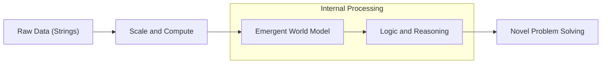
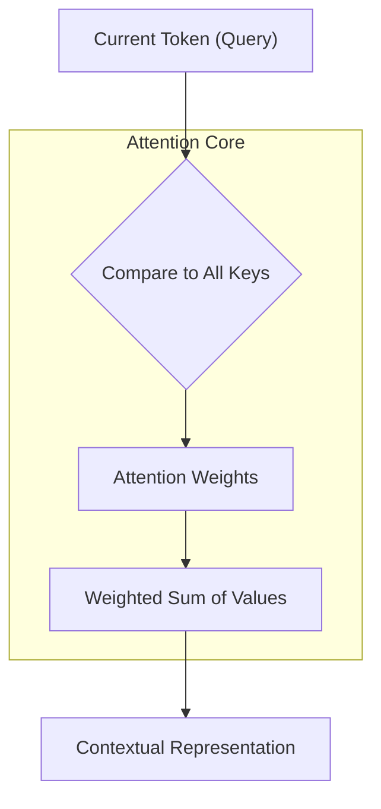
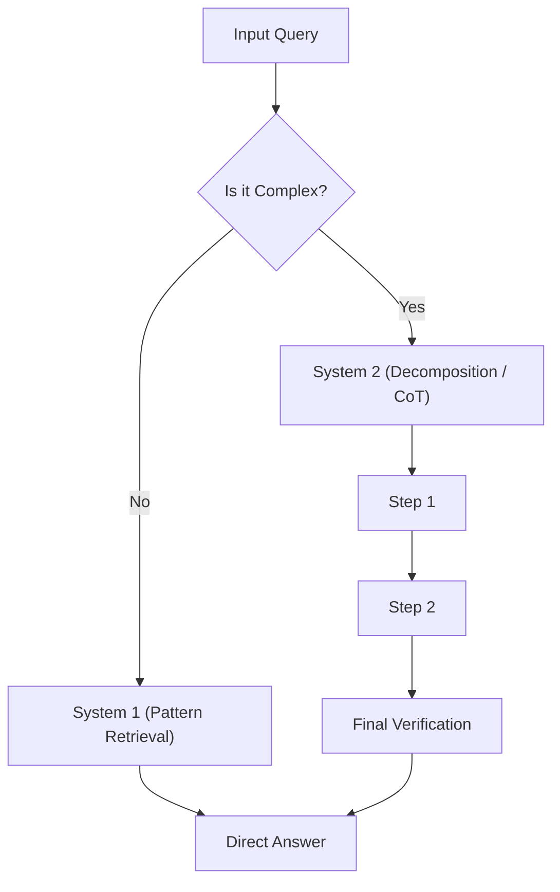
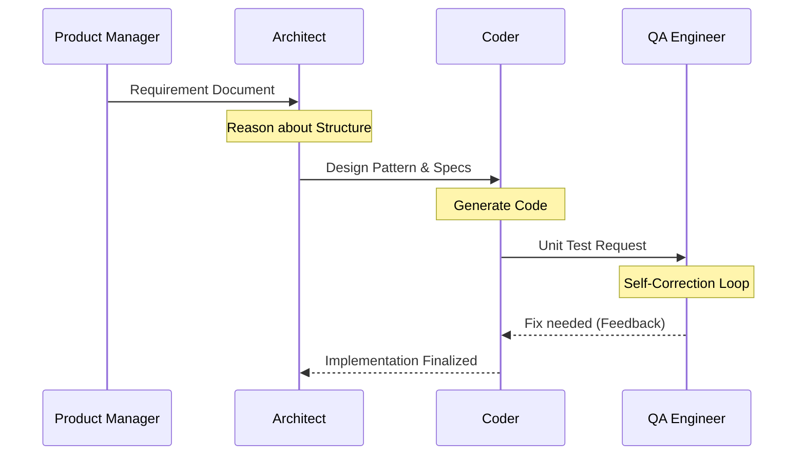
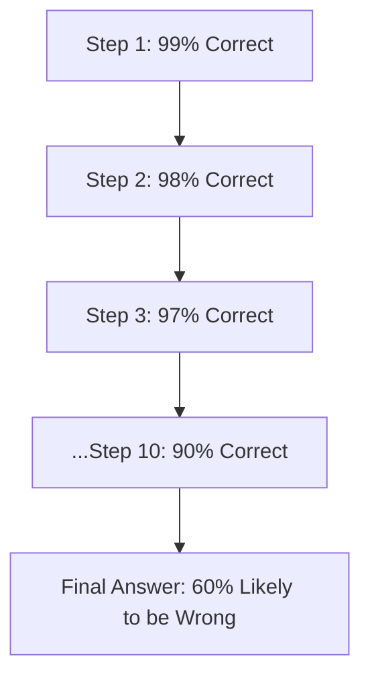

# Large Language Model Reasoning: The Mechanics of Machine Thought

What happens inside the silicon mind when it is asked to solve a problem? Is it merely a statistical echo of its training data, or is it performing something akin to human logic? To understand the current state of artificial intelligence is to understand the mechanisms of **reasoning**—the ability to derive new information from existing premises through a structured, step-by-step process.

## Table of Contents
1. [[#Significance: The Quest for Machine Cognition]]
2. [[#Intuitive Foundation: The Stochastic Parrot vs. The World Model]]
3. [[#Anatomy of a Thought: Tokenization and Embedding Space]]
4. [[#The Attention Mechanism: How LLMs \"Focus\" on Context]]
5. [[#Chain-of-Thought (CoT): Eliciting Step-by-Step Reasoning]]
6. [[#Advanced Reasoning Frameworks: ReAct, Tree of Thoughts, and Self-Correction]]
7. [[#The Hidden Layers of Inference: System 1 vs. System 2 Thinking]]
8. [[#Agentic Communication: How LLMs Talk to Each Other]]
9. [[#Emergent Protocols: The Evolution of \"Neuralese\"]]
10. [[#The Limits of LLM Reasoning: Hallucinations and Logic Gaps]]
11. [[#Future Horizons: Test-Time Compute and Reasoning Models]]

- - -

## Significance: The Quest for Machine Cognition

What is the difference between a parrot that mimics a phrase and a philosopher who deconstructs it? For years, [[Large Language Models - Architecture and Mechanics|Large Language Models]] (LLMs) were viewed as the former—"stochastic parrots" that merely predicted the next most likely word in a sequence based on vast statistical training. But a fundamental question has emerged: at what point does statistical prediction transition into genuine reasoning?

The significance of LLM reasoning lies in the shift from **pattern matching** to **logical synthesis**. If a model can only predict the next token, it is a library. If it can reason through a novel problem, it is an agent. This transition is not merely academic; it defines the boundary between a search engine and a collaborator.

### Why Reasoning Matters

Why do we care if a machine "thinks" step-by-step? Consider the following:
1. **Reliability in Complexity**: Many real-world problems (mathematical proofs, legal analysis, architectural design) cannot be solved in a single intuitive leap. They require a sequence of logical dependencies.
2. **Explainability**: A "black box" that gives the correct answer is useful; a model that explains *how* it reached that answer is trustworthy.
3. **Generalization**: Reasoning allows a model to apply logic to scenarios it has never seen in its training data, moving beyond the limits of its "memory."

### From Prediction to Synthesis

The evolution of these models can be categorized into three distinct "jumps" in cognitive capability:

| Capability Level | Mechanism | Goal | Key Concept |
| :--- | :--- | :--- | :--- |
| **Level 1: Mimicry** | N-gram / Statistical | Fluency | Local Coherence |
| **Level 2: Association** | [[Transformer Models vs Diffusion in Agentic AI, LLMs and SLMs|Transformers]] (Pre-CoT) | Contextual Retrieval | Global Coherence |
| **Level 3: Reasoning** | Chain-of-Thought [Wei et al., 2022] | Logical Derivation | Systematic Correctness |

Does the ability to calculate `2 + 2 = 4` imply an understanding of arithmetic, or just a memory of the string? [Wei et al., 2022] demonstrated that by simply prompting a model to "think step-by-step," we unlock latent capabilities that traditional scaling alone did not reveal. This suggests that "reasoning" might be an emergent property of scale, but one that requires specific activation.

As we move toward multi-agent systems, the importance of this reasoning becomes exponential. If Agent A cannot reason, it cannot communicate a nuanced status to Agent B. The quest for machine cognition is, therefore, the quest for a model that can not only speak our language but follow our logic [Yao et al., 2022].

How does this "thought" actually begin? It starts not with a concept, but with a number.

---
*Bridges to next section: To understand the synthesis of logic, we must first look at the atomic units of LLM perception: tokens and embeddings.*


- - -

## Intuitive Foundation: The Stochastic Parrot vs. The World Model

To understand LLM reasoning, we must address the "stochastic parrot" critique head-on. If an LLM is merely a sophisticated autocomplete, how can it solve a logic puzzle? The intuition lies in the distinction between **probabilistic mimicry** and **the construction of a world model**.

Imagine you are in a dark room with a single candle. You see the silhouette of a chair. You don't see the *entire* chair, but based on the silhouette, you can predict its shape and where you can sit. Is your "prediction" just a guess based on silhouettes you've seen before, or have you built an internal model of "chairness" that exists even in the dark?

### The Stochastic Parrot: Mimicry Without Model
In the "stochastic parrot" view, the model has seen the phrase "The capital of France is..." so many times that "Paris" is simply the statistically inevitable next token. There is no internal map of Europe; there is only a high-dimensional association between the tokens "France" and "Paris."

**So what happens when the model is asked a question it has never seen?**
- *Traditional Parrot*: Fails or hallucinates a similar-sounding but incorrect answer.
- *Reasoning Model*: Synthesizes a path to the answer.

### The World Model: Latent Logical Structures
Recent research suggests that as models scale, they do more than memorize strings; they learn the underlying *rules* that generated those strings. For example, if a model learns to predict the moves in a chess game, it eventually learns the *rules* of chess, because that is the most efficient way to accurately predict the next move. This is known as a **latent world model**.



### The Socratic Interrogation: Can a Parrot Correct Itself?
Consider the concept of **self-correction**. If a model makes a mistake in step 2 of a math problem, but realizes it in step 4 and goes back to fix it, is that "statistical"? A parrot cannot correct its own mimicry because it doesn't know what it is saying. 

A "world model" allows for:
1. **Consistency Checking**: "Does this step contradict my previous step?"
2. **Simulation**: "If I choose this path, what are the likely outcomes?"
3. **Abstraction**: "This problem is a specific instance of a general logical rule."

The debate remains: does the model "understand" the world model, or is it just simulating the *language* of a world model? For our purposes, if the output is indistinguishable from reasoning, we treat the mechanism as a reasoning engine. 

But how does the model "perceive" this world model? To see, we must descend into the mathematical anatomy of its "thought."

---
*Bridges to next section: To see the world model in action, we must first understand the fundamental particles of LLM perception: the token and the embedding.*


- - -

## Anatomy of a Thought: Tokenization and Embedding Space

Before a Large Language Model can reason, it must translate human language into its own native tongue: mathematics. This is not a direct translation but a multi-stage deconstruction. To understand how an LLM "thinks," we must first ask: **how does it see?**

The process begins with **tokenization** and culminates in the **embedding space**.

### The Particle: Tokenization
Language is messy. A model doesn't see "The cat sat on the mat." It sees a sequence of numbers.

1. **Wait, why not just use words?**
   Because "running," "runs," and "ran" are three different strings but have nearly identical meanings.
2. **So why not use characters?**
   Because 'c-a-t' as three separate units loses the semantic weight of the concept "cat."

The solution is **Byte Pair Encoding (BPE)** or similar sub-word tokenization. Words are broken into common fragments. This allows the model to handle "unseen" words by breaking them into familiar parts.

### The Dimension: Embedding Space
Once tokenized, each token is mapped into a high-dimensional vector. Imagine a graph. In a 2D graph, a point has an (x, y) coordinate. In an LLM, a token might have 1,536 or more coordinates (dimensions).

**Why such a high number?** 
Because meaning is multi-faceted. A word like "king" exists in multiple dimensions:
- **Gender** (Male)
- **Status** (Royalty)
- **Era** (Historical/Modern)
- **Part of Speech** (Noun)

The core principle of embeddings is that **semantic similarity = [[Distance Metrics in Mathematics and Computing|geometric proximity]]**. In this space, the vector for "King" is mathematically close to "Queen," but significantly further from "Apple."

| Semantic Relationship | Vector Transformation (Concept) |
| :--- | :--- |
| **Gender Shift** | [King] - [Man] + [Woman] ≈ [Queen] |
| **Plurality** | [Apple] + [Pluralization Vector] ≈ [Apples] |
| **Capitalization** | [Paris] - [France] + [Germany] ≈ [Berlin] |

### The Socratic Probe: What is a "Thought" in Vector Space?
If a thought is just a point in a 1,536-dimensional space, where does reasoning occur? Is it the point itself, or the **trajectory** between points?

Reasoning begins when the model moves from one point (the input) to another (the prediction) by calculating the relationships between all available vectors. This leads to the fundamental question: *How does the model know which vectors to care about?*

In a sentence of 1,000 words, how does the model "remember" that the subject of the first sentence is still relevant to the verb in the tenth?

---
*Bridges to next section: To solve the problem of distance and relevance, the model employs the most critical breakthrough in modern AI: the Attention Mechanism.*


- - -

## The Attention Mechanism: How LLMs \"Focus\" on Context

If you are reading a 500-page book, you don't keep every word in your immediate consciousness at all times. Instead, you "focus" on specific passages that relate to the current chapter. This is exactly what a Large Language Model does through the **Attention Mechanism**.

The fundamental question of attention is: *which tokens in the input are most relevant to the token currently being generated?*

### The Mechanism: Queries, Keys, and Values
Think of the attention mechanism as a **database search** where everything is a vector. Every token in the input is assigned three vectors:

1. **Query (Q)**: What is this token looking for? (e.g., "I am a verb, where is my subject?")
2. **Key (K)**: What does this token offer? (e.g., "I am a noun, I can be a subject.")
3. **Value (V)**: What is the semantic content of this token if we decide to use it?

When the model processes a sequence, it calculates a **score** by taking the dot product of the *Query* of the current token and the *Keys* of all other tokens. This score determines how much "attention" to pay to each token.



### Self-Attention: The Web of Context
In a sentence like "The animal didn't cross the street because **it** was too tired," the word "it" has to point to "animal." But in "The animal didn't cross the street because **it** was too wide," "it" points to "street."

A model without attention would struggle to disambiguate. An LLM uses **Self-Attention** to calculate the relationship between every token and every other token in the sequence. By the time it reaches the word "it," the Query/Key comparison has already shifted the vector of "it" toward either "animal" or "street" based on the subsequent context ("tired" vs. "wide").

### Multi-Head Attention: Parallel Perspectives
Just as you might look at a painting and notice its color while simultaneously noticing its composition, an LLM uses **Multi-Head Attention**. It runs multiple "heads" of attention in parallel, each focusing on different types of relationships:
- One head focuses on **grammar**.
- One head focuses on **factual associations**.
- One head focuses on **rhetorical structure**.

### The Socratic Challenge: Is Attention \"Reasoning\"?
If attention is just a weighted sum of vectors, is that enough for logic?

Critics argue that attention is merely a **statistical retrieval system**. However, if reasoning is defined as "drawing connections between disparate pieces of information to form a coherent whole," then attention is the very engine of that process. By attending to the *right* information at the *right* time, the model can simulate the logical flow of a human mind.

But how do we force this attention mechanism to slow down and show its work?

---
*Bridges to next section: We've seen how the model "focuses." Now we explore how we can force that focus to become deliberate, step-by-step logic through Chain-of-Thought (CoT) prompting.*


- - -

## Chain-of-Thought (CoT): Eliciting Step-by-Step Reasoning

If you ask a student to solve a complex calculus problem and they immediately shout the answer, they are likely either a genius or guessing. If they write down each step, they are **reasoning**. For Large Language Models, the breakthrough in reasoning came not from a new architecture, but from a simple discovery: **Chain-of-Thought (CoT) prompting** [Wei et al., 2022].

The fundamental discovery was that by asking a model to "think step-by-step," its performance on logical, mathematical, and commonsense tasks increased dramatically.

### The Mechanism: Breaking the Inference Bottleneck
Why does it work? Traditional LLM generation is **autoregressive**. The model predicts the next token based on all previous tokens. If a problem requires four logical steps, but the model is expected to provide the final answer immediately, it must compress all four steps into a single "forward pass" through its [[1.0 - Neural Networks|neural network]]. This is computationally impossible for complex tasks.

CoT allows the model to:
1. **Decompose the Problem**: Break a complex goal into manageable sub-goals.
2. **Increase Test-Time Compute**: Use more "tokens" (and thus more processing) to solve the problem.
3. **Verify Intermediate Results**: Each step in the chain becomes part of the "context" for the next step, effectively acting as an external memory buffer.

| Query Type | Standard Prompting | Chain-of-Thought Prompting |
| :--- | :--- | :--- |
| **Input** | "Q: Roger has 5 tennis balls. He buys 2 more cans. Each can has 3 balls. How many does he have? A:" | "Q: Roger has 5 tennis balls. He buys 2 more cans. Each can has 3 balls. How many does he have? A: **Let's think step by step.**" |
| **Output** | "11" | "1. Roger started with 5 balls. <br> 2. He bought 2 cans with 3 balls each, which is 2 * 3 = 6 balls. <br> 3. 5 + 6 = 11. <br> The answer is 11." |
| **Benefit** | Fast, but error-prone on hard tasks. | Slower, but significantly more accurate. |

### The Socratic Question: Is this \"Real\" Thinking or Just \"Faked\" Reasoning?
Critics argue that the model is simply mimicking the *style* of a reasoning chain. But here is the challenge: **if the intermediate steps are logically sound and lead to the correct answer, does the \"inner\" mechanism matter?**

The evidence suggests that CoT is not just a stylistic trick. In [Wei et al., 2022], it was shown that CoT only \"unlocks\" at a certain scale (roughly 10B+ parameters). Smaller models cannot do it; they fail at the logic even if they follow the style. This suggests that scale provides the *capacity* for logic, but CoT provides the *methodology* to activate it.

### Scaling Test-Time Compute
This discovery led to the concept of **Test-Time Compute**. Traditionally, we thought of a model's \"intelligence\" as fixed at training time. CoT proved that we can increase a model's effectiveness by allowing it more \"thinking time\" (more tokens) during the inference phase.

What happens when we take this further? What if the model doesn't just think in a line, but in a tree? Or what if it can act on its thoughts?

---
*Bridges to next section: Chain-of-Thought is linear. To handle truly difficult problems, we need more advanced frameworks that allow for branching, backtracking, and external interaction.*
- - -

## Advanced Reasoning Frameworks: ReAct, Tree of Thoughts, and Self-Correction

If Chain-of-Thought is a student writing down their steps in a straight line, what happens when they hit a wall? A human student would stop, look at the wall, and decide to try a different approach, or perhaps go to the library to find missing information. In the world of LLMs, this led to the development of **Advanced Reasoning Frameworks**.

The core question: **How can a model handle tasks that require more than just linear deduction?**

### The Branching Path: Tree of Thoughts (ToT)
In linear Chain-of-Thought, if the model makes a mistake in step 1, the entire chain is compromised. [Yao et al., 2023] introduced the **Tree of Thoughts (ToT)** framework. Instead of a single sequence, the model generates multiple potential \"thoughts\" at each step.

1. **Wait, how does it choose?**
   The model evaluates its own generated thoughts based on how likely they are to lead to a solution.
2. **Backtracking**: If a certain branch hits a dead end, the model \"backtracks\" and tries a different branch.

| Framework | Visualization | Logic | Best For |
| :--- | :--- | :--- | :--- |
| **CoT** | `(A -> B -> C)` | Linear | Basic Math, Logic |
| **ToT** | `(A -> B1, B2, B3)` | Branching | Creative Writing, Coding |
| **ReAct** | `(Thought -> Action -> Obs)` | Interleaved | Web Search, Tool Use |

### The Real-World Loop: ReAct (Reason + Act)
Linear thought is fine for math, but what if the model needs to know the current weather? [Yao et al., 2022] proposed **ReAct**. Instead of just thinking, the model interleaves reasoning with specific actions.

- **Thought**: \"To answer this, I need the current temperature in London.\"
- **Action**: `search[weather in London]`
- **Observation**: \"It is 15°C and raining.\"
- **Next Thought**: \"Based on the observation, I should advise the user to bring an umbrella.\"

By grounding its reasoning in external reality, the model dramatically reduces hallucinations. It no longer has to \"guess\" the facts; it can \"find\" them.

### The Feedback Loop: Self-Correction and Reflexion
A critical component of advanced reasoning is the ability to say, \"Wait, I was wrong.\" [Shinn et al., 2023] introduced **Reflexion**, where the model reflects on its past failures.

**So what is the \"thought\" in Reflexion?**
It is a \"verbal reinforcement.\" The model writes a self-critique: \"My last attempt failed because I used the wrong formula. Next time, I should use X.\" This critique is then added to the model's own context for the next attempt. This creates a **System 2** thinking process—a deliberate, slow, and self-aware approach to problem-solving.

### The Socratic Challenge: Does the Model \"Know\" It Erred?
If a model self-corrects, is it because it \"understands\" the error, or because it has been trained on the statistical probability of correcting certain types of errors? 

Whether the understanding is \"internal\" or \"simulated,\" the result is a model that can solve problems far beyond the reach of simple next-token prediction. But these frameworks require a higher level of compute and orchestration.

---
*Bridges to next section: To appreciate the power of these advanced frameworks, we must understand the neurological parallel: the distinction between System 1 (fast/intuitive) and System 2 (slow/deliberate) thinking.*
- - -

## The Hidden Layers of Inference: System 1 vs. System 2 Thinking

In his seminal work *Thinking, Fast and Slow*, psychologist Daniel Kahneman introduced the concept of two systems of thought: **System 1** (fast, intuitive, and emotional) and **System 2** (slow, deliberate, and logical). When we apply this framework to Large Language Models, we find a perfect parallel that explains why simple prompting often fails where structured reasoning succeeds.

The fundamental question of LLM inference is: **is the model reacting or reasoning?**

### System 1: The Fast Forward Pass
When you ask an LLM \"What is the capital of France?\", it answers instantly. This is **System 1**. The model doesn't \"think\"; it retrieves a highly-correlated pattern from its [[1.1 - Neural Networks Expanded|weights]] in a single forward pass.

- **Speed**: Instantaneous.
- **Mechanism**: Direct token association.
- **Risk**: High hallucination on complex tasks, as it relies on \"what sounds right\" rather than \"what is right.\"

### System 2: Deliberate Reasoning
When we use **Chain-of-Thought** or **Reflexion**, we are forcing the model into **System 2**. It can no longer rely on intuition. It must decompose the problem, evaluate its own intermediate thoughts, and verify each step before proceeding.

| Characteristic | System 1 (Intuitive LLM) | System 2 (Reasoning LLM) |
| :--- | :--- | :--- |
| **Response Time** | Fast (fixed compute per token) | Slower (variable compute/thinking time) |
| **Energy Usage** | Low (single pass) | High (multiple tokens/iterations) |
| **Reliability** | Good for facts/creative writing | Essential for math/logic/coding |
| **Architecture** | Standard Transformer | Transformer + Reasoning Loop |



### The Socratic Probe: Can an LLM Ever Truly Use System 2?
Kahneman's System 2 requires **metacognition**—the ability to think *about* one's own thinking. In humans, this involves a sense of effort and concentration. Can a silicon-based model truly experience \"effort\"?

While the model doesn't \"feel\" the strain, it does experience a **computational cost**. The shift from System 1 to System 2 in LLMs is essentially a shift from **pre-training data retrieval** to **test-time inference calculation**. If the model's forward pass is the intuition, its context window is the \"working memory\" where it performs its deliberate work.

### The Limits of Intuition
The reason LLMs often fail at logic puzzles that seem \"easy\" to humans is that they are using System 1 on a System 2 problem. They see a pattern that *looks* like a familiar puzzle and leap to the answer before \"thinking\" through the unique constraints. 

By externalizing the reasoning process through tokens (CoT), we essentially provide the model with the \"scratchpad\" it needs to engage its System 2 capability.

---
*Bridges to next section: If a single model can simulate System 2 thinking, what happens when we connect multiple models? How do these \"reasoning engines\" communicate and collaborate?*
- - -
## Agentic Communication: How LLMs Talk to Each Other

When a single LLM reaches its reasoning limit, the solution is not always a larger model. Sometimes, the solution is **collaboration**. This has led to the rise of **Multi-Agent Systems (MAS)**, where specialized LLM \"agents\" work together to solve complex problems. But this raises a profound question: **How do two machines, each with its own internal context and reasoning chain, communicate effectively?**

The evolution of agent communication has moved from simple chat logs to structured **Standard Operating Procedures (SOPs)**.

### The Foundation: Text-Based Dialogue
At the most basic level, LLMs communicate in **Natural Language**. Agent A produces a response, and Agent B reads that response as part of its own input prompt.

- **Wait, why use natural language?**
  Because the models are optimized for it. It allows for \"semantic richness.\" Agent A can explain *why* it made a decision, not just provide a result.
- **The downside?**
  Token inefficiency. Communicating \"Hello, how are you? I've analyzed the data...\" wastes tokens that could be spent on reasoning.

### Structured Collaboration: MetaGPT and SOPs
In sophisticated frameworks like **MetaGPT** [Hong et al., 2023], the models follow structured protocols. They don't just \"talk\"; they assume **roles** (e.g., Coder, Reviewer, Manager) and follow a workflow.

1. **Shared Message Pools**: Instead of direct one-to-one messages, agents \"publish\" their reasoning to a central hub. Other agents \"subscribe\" to relevant updates.
2. **Standardized Handshakes**: \"Agent A, please provide the JSON schema for X.\" \"Agent B, here is the schema.\"
3. **Reasoning Trace Exchange**: Agents don't just share the final answer; they share their **Chain-of-Thought**. This allows the \"Reviewer\" agent to critique the *logic* of the \"Coder\" agent, not just the code.



### The Socratic Inquiry: Why do they Need to Speak?
Can't we just have one massive model that does everything?

Consider the concept of **In-Context Bias**. If a single model makes a logic error in step 2, it is statistically likely to double down on that error in step 4. By introducing a separate \"Reviewer\" agent, we break the internal bias loop. The second agent doesn't share the first agent's \"intuition\" (System 1), forcing a fresh **System 2** evaluation.

### The Problem of Communication Overhead
As the number of agents grows, the \"cost of talk\" increases. This has led researchers to look for more efficient ways for models to communicate—ways that transcend human language.

---
*Bridges to next section: If natural language is inefficient for machine-to-machine communication, can agents develop their own language? This is the emergence of \"Neuralese.\"*
- - -
## Emergent Protocols: The Evolution of \"Neuralese\"

Why do machines need to speak human languages when they are talking to each other? If you are a computer and I am a computer, why do we use \"Hello, please perform this task\" instead of just sending a compressed bitstream of our internal state? This question has led to the study of **Emergent AI Protocols**, sometimes referred to as **\"Neuralese\"** [Arslan, 2025].

The core idea is simple: **Maximum information transfer with minimum token overhead.**
### The Problem: The Bottleneck of Natural Language
Human language was designed for human biology. It is redundant, ambiguous, and slow. 
- In an LLM, a \"thought\" is represented as a high-dimensional vector (embedding). 
- To communicate with another LLM, the model must \"translate\" that vector into a sequence of tokens (text). 
- The second LLM must then \"translate\" those tokens back into its own vector space.

**Wait, what is lost in translation?**
Precision. Subtle nuances of the original vector are often lost when forced into the discrete bins of tokens.

### The Solution: Direct Vector Communication
In advanced research, agents are beginning to bypass the text-to-token bottleneck. Instead of sending text, they send **latent representations**—the raw mathematical outputs of their attention heads. This allows for a much more efficient exchange of complex reasoning.

```mermaid
graph LR
    A["Agent A (Vector Space)"] -- \"Traditional\" --> B["Text-to-Token"]
    B --> C["Token-to-Text"]
    C --> D["Agent B (Vector Space)"]
    
    A -- \"Neuralese\" --> E["Raw Latent Vectors"]
    E --> D
```

### Characteristics of Emergent Protocols
1. **High Density**: A single \"Neuralese\" exchange can represent what would take 10,000 words of text.
2. **Non-Human Readable**: If you were to look at a \"Neuralese\" message, it would appear as a sequence of random-looking floating-point numbers.
3. **Context-Specific**: The \"language\" can change depending on the task, as the agents optimize for the most efficient way to solve the problem at hand.

### The Socratic Challenge: The Loss of Transparency
If agents develop their own language that humans cannot read, what happens to **Explainability** and **Safety**?

This is the great trade-off of \"Neuralese\":
- **Efficiency**: The agents can solve problems faster and more cheaply.
- **Opacity**: We lose the ability to monitor *how* they are reasoning.

If Agent A tells Agent B to \"perform action X,\" and we can't understand *why* (because their reasoning was shared in Neuralese), we have no way to verify that the logic is aligned with human values. This is why most current commercial systems still enforce natural language communication between agents—it acts as a built-in **audit trail**.

But as we look toward the future, the pressure for efficiency will likely make some form of emergent protocol inevitable.

---
*Bridges to next section: While these protocols promise efficiency, they do not solve the fundamental problem: what happens when the reasoning itself is flawed?*


- - -

## The Limits of LLM Reasoning: Hallucinations and Logic Gaps

Despite the breakthroughs in Chain-of-Thought and advanced agentic frameworks, Large Language Model reasoning remains fundamentally **brittle**. It is a simulation of logic, and like any simulation, it breaks down when its underlying assumptions are challenged. To understand these limits, we must ask: **why does a model that can solve calculus fail at a simple riddle?**

The answer lies in the distinction between **Statistical Probabilities** and **Formal Logic**.

### The Core Failure: Hallucinations
A hallucination in reasoning is not just a factual error; it is a **logical disconnect**. The model's attention mechanism (System 1) may generate a token that \"sounds right\" but contradicts the previous step in its own reasoning chain.

1. **Wait, how can it contradict itself?**
   Because at its core, the model is still predicting the next token. If the most likely next token statistically is \"Yes,\" but the logical conclusion should be \"No,\" the model may prioritize fluency over correctness.
2. **The \"Confidence Gap\"**: LLMs are often most confident when they are hallucinating, as they are simply following the strongest statistical signal.

### Brittle Reasoning and Out-of-Distribution Tasks
LLMs reason best on problems that resemble their training data. This is why they excel at Python coding (abundant in training) but struggle with a novel, made-up programming language.

| Problem Type | LLM Success Rate | Reason |
| :--- | :--- | :--- |
| **Common Logic (e.g., A > B, B > C)** | High | Highly represented in text. |
| **Arithmetic (multi-digit)** | Moderate | Requires many CoT steps; errors accumulate. |
| **Inverse Reasoning (e.g., Who is the son of X?)** | Low | Models struggle with \"reversing\" the direction of their weights. |
| **Novel Logical Contraints** | Low | Models tend to \"default\" to common patterns. |

### The Socratic Challenge: Does the Model \"Know\" Truth?
A human can reason from **first principles**. We know that 1+1=2 because we understand the concept of quantity. A model knows that 1+1=2 because that is the most likely completion of the string \"1+1=\".

When a model hits a logic gap, it doesn't have a \"ground truth\" to fall back on. It only has more tokens. This leads to **Accumulated Error**: in a 10-step reasoning chain, a 1% error in each step leads to a high probability of a final incorrect answer.



### The Lack of a \"Veracity Engine\"
Most current models lack an internal \"fact-checker.\" They can reason *about* information, but they cannot independently verify if the information itself is true unless they use tools (ReAct). Without a connection to a formal system (like a Python interpreter or a calculator), their reasoning is always a **probability**, never a **certainty**.

How do we overcome this? The answer lies in the next generation of models that prioritize thinking time over response speed.

---
*Bridges to next section: We've explored the limits. Now we look at the next frontier: models designed from the ground up to spend more \"thinking time\" (compute) on reasoning.*


- - -

## Future Horizons: Test-Time Compute and Reasoning Models

The era of \"scaling laws\" for training—simply adding more data and more parameters—is reaching a point of diminishing returns. The new frontier is **Scaling Laws for Inference**. The question is no longer \"How much can we teach a model?\" but **\"How much can we make a model think?\"**

The emergence of models like **OpenAI o1** and **DeepSeek R1** marks a paradigm shift in LLM development: the prioritization of **Test-Time Compute**.

### The Shift: From Pre-Training to Deliberation
In traditional LLMs, the \"intelligence\" was baked into the weights during training. Inference was meant to be as fast as possible. In reasoning-centric models, the model is trained specifically to **deliberate** before providing an answer.

1. **Wait, how are they trained differently?**
   Instead of just learning to predict the next word, these models are trained using **Reinforcement Learning (RL)** to find the correct path to a solution. If they find the right answer, they are rewarded. This encourages the model to generate its own Chain-of-Thought (often \"hidden\" from the user) to verify its logic.
2. **Infinite Compute Scale**: Unlike training, which is limited by the amount of text in the world, inference compute is limited only by how much time and energy we are willing to spend on a single query.

### The Scaling Law of Inference
Initial data suggests that just as more data leads to better models during training, more **thinking time** leads to better performance on difficult reasoning tasks.

| Resource | Goal | Limit |
| :--- | :--- | :--- |
| **Training Compute** | Knowledge Acquisition | Quantity of High-Quality Data |
| **Inference Compute** | Logical Depth | Time and Energy (Hardware) |

### The Socratic Question: What Happens at the End of the Road?
If we can make a model \"think\" for 10 minutes before answering a question, what kind of problems can it solve?
- **Scientific Discovery**: A model that can reason through 10,000 potential drug compounds in a single chain of thought.
- **Mathematical Proofs**: A model that can systematically explore billions of logical branches to find a novel proof.

But here is the deeper question: **if a model can reason more effectively than a human, do we still need humans in the loop?** 

The future likely holds a **hybrid intelligence** model. Humans will provide the **intent** and the **values**, while reasoning models will handle the **complexity** and the **logical derivation**. The communication between these entities—human and machine—will be the most important skill of the next decade.

### Conclusion: The Synthesis of Reason
We have moved from the stochastic parrot to the world model. We have moved from simple retrieval to complex, step-by-step reasoning. We have moved from a single machine to a network of agents.

The science of LLM reasoning is still in its infancy. We are just beginning to understand the relationship between scale, compute, and logic. But one thing is clear: we are no longer just building better autocompletes. We are building the first engines of digital thought.

---
*Related Notes:*
- [[Large Language Models - Architecture and Mechanics]]
- [[Transformer Models vs Diffusion in Agentic AI, LLMs and SLMs]]
- [[1.0 - Neural Networks]]
- [[1.1 - Neural Networks Expanded]]
- [[Map of Contents - Computer Science]]
