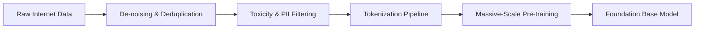
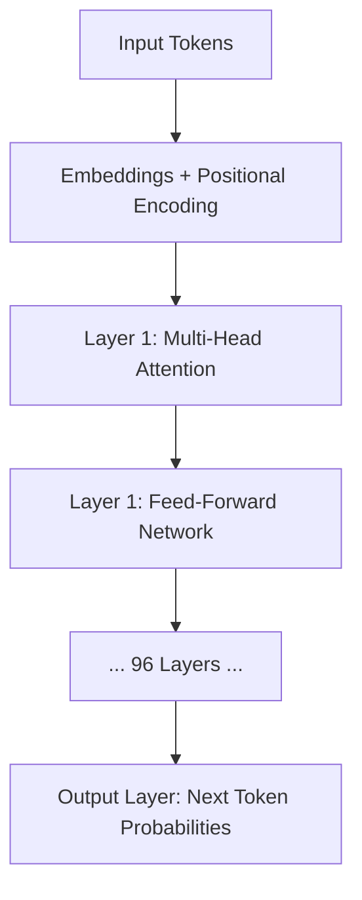
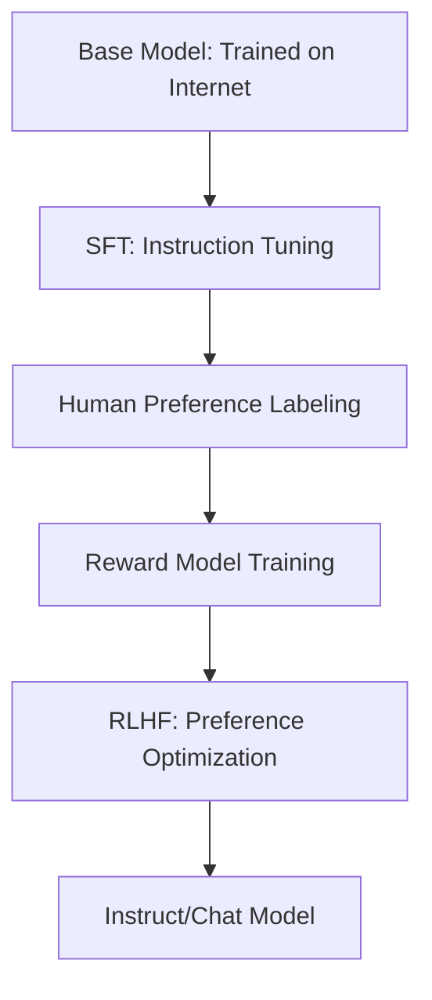

> [!abstract] Table of Contents
> - [[#1. Introduction: The Paradigm Shift of Generative AI]]
> - [[#2. Data & Pre-training: The Foundation of Intelligence]]
> - [[#3. Tokenization: The Alphabet of Machines]]
> - [[#4. The Transformer Architecture: Attention is All You Need]]
> - [[#5. Context Windows & Memory: The Infinite Scroll]]
> - [[#6. Fine-tuning & RLHF: Alignment with Human Intent]]
> - [[#7. Comparative Analysis: GPT vs. Gemini vs. Claude]]
> - [[#8. Challenges & Future Frontiers: Hallucination to AGI]]

- - -
**Abstract:**
A comprehensive examination of the underlying systems that power modern Large Language Models (LLMs). This note dissects the journey from raw data to tokenization, the mathematical core of the Transformer architecture, and the competitive landscape of current frontier models.
- - -
## 1. Introduction: The Paradigm Shift of Generative AI

The emergence of Large Language Models (LLMs) represents a fundamental shift in the history of computing: the transition from **deterministic, rule-based logic** to **probabilistic, emergent prediction**. For decades, artificial intelligence was constrained by the "knowledge bottleneck"—the requirement that humans manually encode rules, grammars, and facts into a machine-readable format. Traditional Natural Language Processing (NLP) relied on complex linguistic trees and hand-crafted features. LLMs have dismantled this paradigm by demonstrating that intelligence can be "learned" through massive-scale statistical correlation.

At its most fundamental mathematical level, a Large Language Model is an autoregressive function designed to predict the next token in a sequence. However, this simple objective function, when applied to trillions of parameters across petabytes of data, yields behaviors that transcend mere statistics. This phenomenon, known as **Emergence**, is the threshold where a model suddenly acquires capabilities—such as multi-step reasoning, zero-shot translation, or code synthesis—that were not explicitly present in its training objective. 

The shift to Generative AI was catalyzed by a "perfect storm" of three technological pillars. First, the **Transformer Architecture**, introduced by Google researchers in 2017, provided a way to process sequential data in parallel while maintaining deep contextual relationships through self-attention. Unlike previous Recurrent Neural Networks (RNNs) or Long Short-Term Memory (LSTM) units, Transformers do not need to process words one-by-one; they can look at an entire paragraph simultaneously, identifying the crucial connections between a pronoun at the end of a sentence and a noun at the beginning.

Second, the **Scaling Laws** of deep learning were empirically verified. Researchers at OpenAI and elsewhere discovered that model performance follows a predictable power law: as you increase the number of parameters, the amount of training data, and the total compute (FLOPs), the cross-entropy loss (the model's "error rate") decreases linearly on a log-log scale. This realization led to the construction of massive GPU clusters, utilizing tens of thousands of NVIDIA H100s to train models with hundreds of billions, or even trillions, of parameters.

Finally, the **Digitization of Human Knowledge** provided the fuel for these engines. The ingestion of the Common Crawl (a snapshot of the public internet), the entirety of GitHub's public repositories, and massive digital libraries like The Pile allowed models to learn the "latent space" of human thought. By training on code, models learned formal logic; by training on literature, they learned narrative structure; by training on scientific papers, they learned the structure of empirical inquiry.

In the current landscape, LLMs are no longer just chatbots; they are becoming **World Models**. They possess a high-dimensional representation of how concepts relate to one another. When we speak of a "paradigm shift," we are referring to a world where the primary interface between human and machine is no longer a set of buttons or a specific syntax, but natural language itself. This transition marks the end of the era where humans had to learn the language of machines, and the beginning of the era where machines have finally learned the language of humans.

- - -
## 2. Data & Pre-training: The Foundation of Intelligence

Before an LLM can simulate reasoning, it must be exposed to the vast, multi-modal tapestry of human civilization. The **Pre-training** phase is an unsupervised learning task on an unprecedented scale. At this stage, the model's objective is deceptively simple: given a sequence of words, what is the most statistically likely next word? To achieve this, models are fed an immense corpus that can span multiple petabytes of raw data. 

**The Dataset Ecosystem:**
Modern training corpora are not just random text; they are meticulously curated mixtures of different sources. The most common components include:
- **The Common Crawl**: A massive, periodic snapshot of the public internet. This provides breadth but requires intense cleaning to remove spam, low-quality blog posts, and duplicate content.
- **Scientific Papers & ArXiv**: These sources provide the model with a grounding in structured inquiry, formal citation, and rigorous argumentation.
- **GitHub & Code Repositories**: Training on code is essential. Researchers have found that exposure to code significantly improves the model's ability to reason logically and follow multi-step instructions, even when responding to non-technical queries.
- **Books (Project Gutenberg, LibGen, etc.)**: Literature provides the model with a "long-range dependency" understanding—how a plot point in chapter one relates to a character arc in chapter ten.

**The Pre-training Process:**
During pre-training, the model is initialized with random weights. As it iterates through the corpus, it constantly adjusts these millions of parameters to minimize its **Cross-Entropy Loss**. This is essentially its "surprise" at seeing a word it didn't expect. If the text says "The capital of France is Paris," and the model initially predicted "London," its weights are updated until "Paris" becomes the dominant prediction. 

This is an **unsupervised** task; no human labeler tells the model "this is a noun" or "this is a fact." The model must implicitly discover the rules of grammar, the facts of history, and the syntax of Python by identifying patterns in the distribution of tokens. This process is incredibly compute-intensive, often requiring the parallelization of training across thousands of H100 or A100 GPUs for weeks or months.

**Data Curation & Filtering:**
A significant portion of the "secret sauce" in frontier models (like GPT 5.3 or Claude Opus 4.6) lies in the quality of the data mixture. Models that are fed "junk" data will exhibit "junk" reasoning—a phenomenon known as "garbage in, garbage out." High-performance labs use sophisticated deduplication algorithms (like MinHash or LSH) to ensure the model doesn't over-memorize specific phrases that appear thousands of times across the web.

- - -

## 3. Tokenization: The Alphabet of Machines

Machines do not process language through phonemes or semantics; they process **Numbers**. Tokenization is the critical bridge between the infinite flexibility of human language and the rigid mathematical requirements of a neural network. It is the process of decomposing a string of characters into a sequence of discrete units called **Tokens**.

**The Evolution of Units:**
Early NLP systems used **Word-level Tokenization** (where every word is a token). However, this failed when encountering "out-of-vocabulary" (OOV) words. A model that knows "walk" and "walking" as separate tokens wouldn't understand "walked" if it hadn't seen it exactly. **Character-level Tokenization** (where every letter is a token) solved the OOV problem but resulted in extremely long sequences that made it difficult for the model to capture meaning.

Modern LLMs use **Sub-word Tokenization**, primarily algorithms like **Byte-Pair Encoding (BPE)**, **WordPiece**, and **SentencePiece**. These algorithms identify the most frequent character sequences in a language and treat them as a single unit. For example, the word "transformation" might be decomposed into `trans`, `form`, and `ation`. This allows the model to handle rare words by breaking them down into meaningful, recognizable roots.

**Mathematical Embeddings:**
Once a piece of text is tokenized, each token is assigned a unique numerical ID from the model's **Vocabulary** (which usually ranges from 50,000 to 256,000 unique tokens). However, these IDs (e.g., token #432 for "cat") are still arbitrary. To give them meaning, each token ID is mapped to an **Embedding Vector**—a high-dimensional array of numbers (e.g., 4,096 or 12,288 dimensions).

In this high-dimensional "Embedding Space," words with similar meanings are mathematically close to each other. The vector for "King" and the vector for "Queen" are adjacent, while the vector for "King" and "Apple" are far apart. This allows the model to "calculate" meaning: famously, `Vector(King) - Vector(Man) + Vector(Woman) ≈ Vector(Queen)`.

| Term | Technical Role | Dimensionality/Scale |
|------|----------------|----------------------|
| **Vocabulary Size** | The total number of unique tokens the model "knows." | 50,000 to 256,000 |
| **Embedding Dimension** | The length of the vector representing a token's meaning. | 4,096 to 12,288 |
| **Token-to-Word Ratio** | The average number of tokens required per word. | ~1.3 tokens per word (English) |

**The Tokenization Bottleneck:**
Tokenizers are not universal. A tokenizer optimized for English will struggle with languages like Arabic or Japanese, often requiring many more tokens to represent the same meaning. This makes training and inference more "expensive" for non-English users. Furthermore, tokenization is why LLMs struggle with simple tasks like counting letters in a word or reversing a string—the model doesn't see the letters; it only sees the sub-word chunks.

- - -

## 4. The Transformer Architecture: Attention is All You Need

The "Transformer" is the mathematical engine that powers every modern LLM, from the GPT series to [[GEMINI|Gemini]] and Llama. Introduced by Google researchers in the seminal 2017 paper *"Attention Is All You Need,"* the architecture replaced previous sequential models (like RNNs and LSTMs) that were slow to train and struggled with long-range dependencies. The defining breakthrough of the Transformer is the **Self-Attention Mechanism**.

**The Mechanics of Self-Attention:**
In traditional models, words were processed one-by-one, meaning the model often "forgot" the beginning of a sentence by the time it reached the end. Self-attention allows the model to process all tokens in a sequence simultaneously, but more importantly, it allows each token to "attend" to every other token.

When the model processes the word "it" in the sentence *"The robot pushed the box because it was heavy,"* the attention mechanism calculates a high mathematical weight between "it" and "box." However, in the sentence *"The robot pushed the box because it was tired,"* the model shifts that weight to "robot." This isn't done through linguistic rules, but through three learnable vectors for every token:
1. **Query (Q)**: What am I looking for?
2. **Key (K)**: What do I contain?
3. **Value (V)**: If I am relevant, what information do I provide?

The model calculates a "score" by taking the dot product of the Query of one token with the Key of all other tokens. This score determines how much of the "Value" from other tokens should be mixed into the current token's representation.

**The Multi-Head Advantage:**
Modern Transformers use **Multi-Head Attention**, which essentially means the model has multiple "eyes" looking at the sentence simultaneously. One head might focus on grammatical structure, another on factual relationships, and a third on emotional tone. By combining these perspectives, the model builds a rich, multi-layered understanding of the text.

**The Layered Hierarchy:**
A Transformer consists of many such blocks stacked on top of each other (frontier models often have 80 to 120 layers).
1. **Positional Encoding**: Since Transformers process tokens in parallel, they don't natively know the order of words. Positional encodings are mathematical "tags" added to embeddings to indicate where a word sits in a sequence.
2. **Feed-Forward Networks (FFN)**: After the attention step, each token's representation is passed through a deep neural network to further process the gathered information.
3. **Layer Normalization & Residual Connections**: These are structural techniques that allow gradients to flow through very deep networks without "vanishing," enabling the training of models with trillions of parameters.

- - -

## 5. Context Windows & Memory: The Infinite Scroll

The **Context Window** represents the "short-term memory" of an LLM. It is the maximum number of tokens the model can process and "keep in mind" during a single inference session. Historically, this was a major limitation; GPT-3 had a context window of just 2,048 tokens, making it impossible to analyze long documents or maintain a coherent conversation over many turns.

**The Scaling of Memory:**
The cost of the standard attention mechanism grows **quadratically** with the length of the input. Doubling the context window quadruples the compute required. However, recent breakthroughs in "Linear Attention," "Flash Attention," and "Ring Attention" have allowed labs to push these boundaries into the millions of tokens.

| Model | Context Window (Tokens) | Comparison |
|-------|-------------------------|------------|
| GPT 5.3 Codex | 1,024,000 | A full technical library |
| Claude Opus 4.6 | 2,500,000 | The complete legal archives of a corporation |
| Gemini 3.1 Pro | 10,000,000+ | An entire lifetime of correspondence + HD video |

**The "Lost in the Middle" Phenomenon:**
A large context window is only useful if the model can actually retrieve information from it. Early long-context models exhibited a "U-shaped" performance curve: they could remember the beginning and end of a prompt but were "forgetful" about information buried in the middle. Frontier models solve this through **Needle-in-a-Haystack (NIAH)** testing—a rigorous evaluation where a random fact is hidden in a 1-million-token document, and the model must retrieve it with 100% accuracy.

**RAG vs. Long Context:**
There is a persistent debate between using **Retrieval-Augmented Generation (RAG)**—where a separate system searches a database for relevant snippets—and using a **Large Context Window**.
- **RAG** is cheaper and can access infinite data, but it is limited by the quality of the search engine.
- **Long Context** is more powerful and "holistic," as the model can see the entire document's internal relationships, but it is computationally expensive.
Modern systems often use a hybrid approach: RAG to find the relevant books, and Long Context to "read" those books in their entirety.

**KV Caching:**
To make long-context conversations fast, models use a **KV Cache**. Instead of re-calculating the Query, Key, and Value vectors for every word in a long chat history every time you send a new message, the model stores the Keys and Values in memory. This is why LLMs use so much VRAM; a large KV cache for a 1-million-token window can require hundreds of gigabytes of memory.

- - -

## 6. Fine-tuning & RLHF: Alignment with Human Intent

A raw "Base Model" is a formidable statistical engine, but it is not a helpful assistant. If you ask a base model "What is the capital of France?", it might respond with "And what is its population?" because it thinks you are providing the first line of a quiz it saw on the internet. To transform this base intelligence into a conversational agent that follows instructions, researchers use a two-stage alignment process: **Supervised Fine-Tuning (SFT)** and **Reinforcement Learning from Human Feedback (RLHF)**.

**1. Supervised Fine-Tuning (SFT):**
In this stage, the model is trained on a high-quality, human-curated dataset of prompts and their ideal responses.
- **Example Prompt**: "Write a Python function to sort a list."
- **Example Response**: `def sort_list(lst): return sorted(lst)`
By seeing thousands of these examples, the model learns the "Instruction-Response" pattern. It stops trying to complete the internet and starts trying to answer the user. This is often referred to as the "Instruction Tuning" phase.

**2. RLHF (Reinforcement Learning from Human Feedback):**
While SFT tells the model *how* to answer, RLHF tells the model *which* answers are better. Humans are presented with two model-generated responses to the same prompt and asked to rank them based on criteria like **Helpfulness, Honesty, and Harmlessness (the HHH framework)**.
- **The Reward Model**: These human rankings are used to train a separate, smaller neural network called a "Reward Model." This model learns to predict what a human would find helpful.
- **Optimization (PPO or DPO)**: The main LLM is then "nudged" to maximize its score from the Reward Model. It learns that being polite, structured, and factual yields a high score, while being toxic or repetitive yields a low score.

**Alignment Challenges:**
Alignment is as much a social problem as a technical one. If human labelers are biased, the model will inherit those biases. Furthermore, "over-alignment" can lead to the model becoming overly cautious or "refusing" to answer harmless queries because they superficially resemble sensitive topics—a phenomenon known as the "Preachiness" or "Sycophancy" problem.

- - -

## 7. Comparative Analysis: GPT vs. Gemini vs. Claude

As of 2026, the AI landscape is dominated by three primary families of frontier models. Each has a distinct architectural philosophy and specialized strengths.

| Feature | GPT 5.3 Codex (OpenAI) | Claude Opus 4.6 (Anthropic) | Gemini 3.1 Pro (Google) |
|---------|-----------------|------------------------|---------------------|
| **Primary Philosophy** | Logic-native, zero-shot code synthesis, and extreme reasoning. | Constitutional AI, ethical safety, and "human-like" narrative nuance. | Native Multi-modality, deep Google ecosystem integration. |
| **Best For** | Systems architecture, complex debugging, scientific simulation. | Legal analysis, creative writing, long-form document synthesis. | Large-scale data processing, video reasoning, multi-lingual research. |
| **Context Window** | 1,024,000 Tokens | 2,500,000 Tokens | 10,000,000+ Tokens |
| **Key Architecture** | Dynamic MoE (Mixture of Experts) with Sparse Attention. | Constitutional AI v4 (Self-Correcting Attention). | Native Multi-modal Transformer (NMT). |

**1. GPT 5.3 Codex (OpenAI):**
OpenAI has pivoted GPT 5 towards "System 2 Reasoning." Unlike previous models that guessed the next token instantly, GPT 5.3 incorporates internal "Chain of Thought" cycles before outputting text. This makes it slower but significantly more accurate for logic-heavy tasks. Its "Codex" engine remains the industry standard for autonomous code generation and software engineering assistance.

**2. Claude Opus 4.6 (Anthropic):**
Anthropic's "Constitutional AI" approach remains its defining trait. Claude Opus is designed to be the most "thoughtful" model, frequently explaining its reasoning and admitting uncertainty. It excels in long-form creative tasks where tone and style are paramount. Its 2.5-million-token context window is highly optimized for "Recall Fidelity," meaning it rarely misses details even in the most massive documents.

**3. Gemini 3.1 Pro (Google):**
Gemini's unique advantage is its **Native Multi-modality**. While other models "patch in" vision or audio, Gemini was trained from day one on video, audio, code, and text simultaneously. This allows it to "watch" an hour-long video and pinpoint the exact frame where a specific event occurs. Its 10-million-token context window is the largest in the industry, effectively allowing it to act as a "Temporary Database" for entire projects.

**The "Mixture of Experts" (MoE) Paradigm:**
Most of these frontier models are not one single giant network. Instead, they use an **MoE Architecture**. When you ask a question about math, only the "Math Expert" sub-networks are activated. When you ask about cooking, the "culinary" sub-networks take over. This allows the model to have the knowledge of a 2-trillion-parameter network while only using the compute of a much smaller one during inference.

- - -

## 8. Challenges & Future Frontiers: Hallucination to AGI

While Large Language Models (LLMs) have demonstrated extraordinary capabilities, they are not yet synonymous with **Artificial General Intelligence (AGI)**. To reach the next stage of cognitive computing, the industry must overcome several critical, and currently unsolved, hurdles.

**1. The Hallucination Problem:**
The most persistent challenge in Generative AI is "Confabulation" or **Hallucination**. Because LLMs are probabilistic word-predictors, they prioritize "looking plausible" over "being factual." A model that is 99% accurate is still 1% dangerous in high-stakes environments like medicine or law. Modern solutions, such as **RAG (Retrieval-Augmented Generation)** and **Verifiable Reasoning**, aim to ground model outputs in external databases, but the core architecture still lacks a fundamental "World Truth" anchor.

**2. Reasoning vs. Pattern Matching:**
There is an ongoing debate about whether LLMs truly "reason" or if they are simply performing sophisticated pattern matching across a multi-trillion-word corpus. While frontier models like GPT 5.3 can solve complex puzzles, they often fail when presented with a simple logic task that has been slightly modified from its training data. The frontier of **"System 2 Thinking"**—where a model deliberately pauses to verify its own logic before responding—is the primary focus of the next generation of AI development.

**3. The Compute & Energy Crisis:**
The training and inference of models with trillions of parameters require immense energy. A single training run for a frontier model can consume more electricity than thousands of households use in a year. The future of AI hinges on **Architectural Efficiency**—developing smaller, more efficient "Compact Models" that rival the performance of massive ones, or moving towards specialized hardware (like TPUs or neuromorphic chips) that mimics the energy efficiency of the human brain.

**4. The Road to Agents:**
We are currently transitioning from the era of "Passive LLMs" (chatbots) to the era of **"Autonomous Agents."** These are LLMs that can not only talk but also **Act**. An agent can browse the web to book a flight, write and execute a Python script to analyze a dataset, or coordinate with other agents to build a piece of software. This requires the model to have long-term planning, tool-use capability, and self-correction.

**5. Multi-modal Integration:**
The future is not just text. It is the seamless integration of vision, audio, tactile sensor data, and video. Models that can see the physical world (through cameras) and hear its nuances (through high-fidelity audio) will gain a "common sense" understanding that is currently impossible for text-only models. This is the foundation of **Physical AI**—bringing LLM brains into robotic bodies.

**Conclusion:**
Large Language Models have fundamentally rewritten the contract between humanity and technology. We are no longer limited by the syntax of machines; we are only limited by our ability to prompt, reason, and collaborate with them. As we move closer to AGI, the focus will shift from "What can the model do?" to "How can we ensure the model remains aligned with human values?"

- - -

**Related Notes:**
- [[1.0 - Neural Networks]]
- [[2.0 - CNNs]]
- [[CS - Software Design Techniques]]

- - -
*Created on 2026-03-05 by GeminiCLI (Agent: Ibn Haytham)*

## See Also

- [[GEMINI]] — Concept referenced in text.
- [[_Science - Map of Contents|Science MOC]]
