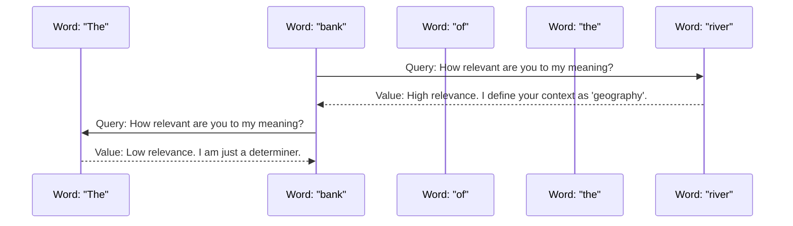
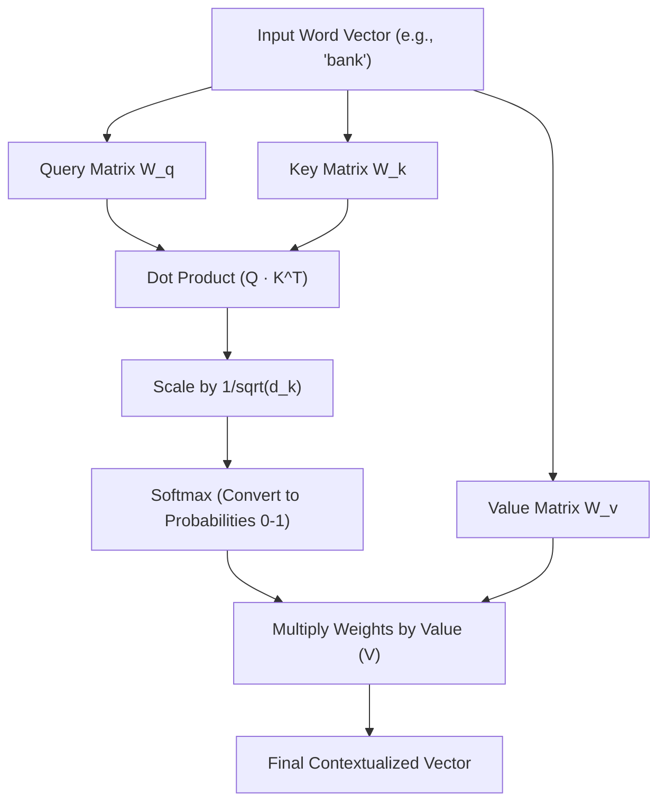
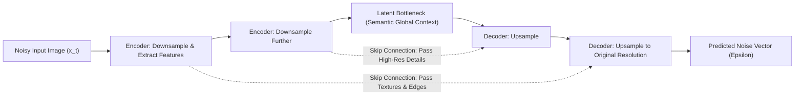
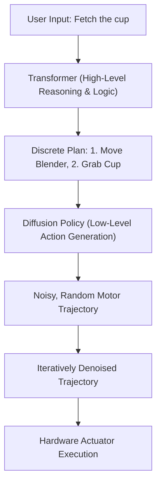
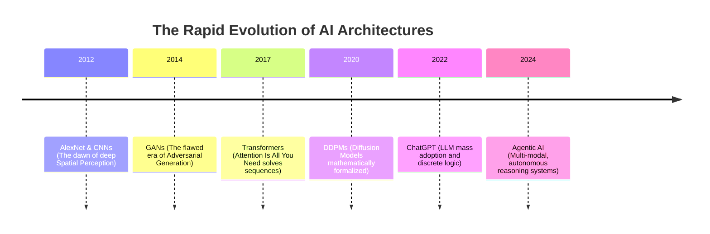

# Transformer Models vs Diffusion in Agentic AI, LLMs and SLMs

## 1. The Core Problem: Why Did AI Need a Paradigm Shift?

Before we can understand the architecture of modern AI, we must first ask the most fundamental question: *what were we doing wrong?* For years, the dominant paradigms for sequence processing and natural language were Recurrent Neural Networks (RNNs) and their more advanced variants, Long Short-Term Memory networks (LSTMs). These models processed text exactly how a human reads a sentence—word by word, left to right. But is that truly how deep comprehension works?

When you read a complex sentence, do you simply stack words on top of each other like bricks, or do you instantly cross-reference new words with concepts you read pages ago? The fatal flaw of RNNs was what we call their **sequential bottleneck**. Because they processed data linearly, the mathematical computation for step $t$ could only be executed after the computation for step $t-1$ was finalized. This strict temporal dependency led to two catastrophic failures in scaling.

First, consider the problem of **Vanishing Gradients**. As the sequence of words grew longer, the memory of earlier words inherently faded. If a sentence was 100 words long, the network would practically "forget" the primary subject by the time it reached the final verb. *Why does this happen mathematically?* Because every sequential step required a matrix multiplication. If you take a fraction (a small weight matrix) and multiply it by itself a hundred times during backpropagation, it asymptotically approaches zero. The gradient vanishes. The network is left blind to long-term dependencies. You might ask: *Why couldn't we just make the RNN deeper or increase the hidden state size?* Because a fixed-size vector can only hold so much information. Forcing an entire paragraph into a single mathematical vector is like trying to compress a high-definition movie into a single JPEG image—the nuance is irrevocably lost.

Second, consider the hardware implications. We live in the era of parallel processing. A modern GPU has tens of thousands of cores designed to perform independent matrix multiplications simultaneously. But if your algorithm's input is strictly sequential, you cannot use these cores efficiently. You are forcing a 10,000-lane superhighway to collapse into a single-lane road. *What happens when we want an AI to read a whole book?* An RNN would take months to train, endlessly bottlenecked by its inability to look at the whole text at once.

Convolutional Neural Networks (CNNs), the undeniable champions of image processing, attempted to fix this sequence problem by applying sliding windows over text. But this introduced its own paradox: *how wide should the window be?* If the convolutional window is 5 words wide, it completely misses the context 10 words away. If you make the window too large, the computational cost explodes quadratically without actually capturing syntactic structure.        

So the core problem emerges clearly: *How can a network look at everything at once, while still understanding the relative position and syntactic importance of each element?* We needed a mechanism that didn't just passively remember the past, but actively **searched** for relevance across the entire input sequence simultaneously. We needed a revolution in how machines process time. We needed to abandon sequential memory entirely and shift to a paradigm of global, parallel attention.

- - -

This naturally prompts the question: if sequential memory is abandoned, what mechanism can simultaneously grasp an entire text without losing the structural meaning of individual elements? To answer this, we must shift our perspective from the linear reading of words to the dynamic allocation of focus.

## 2. Intuitive Foundation: From Sequential Reading to Global Attention

To deeply understand the concept of Attention, we must abandon the linear timeline. Imagine walking into a crowded party. Do you process every single face, every overlapping conversation, and every piece of furniture from left to right, one by one? Or do your eyes immediately dart to the loudest laugh, the most colorful dress, or the familiar face of a friend?

Human perception is not a conveyor belt; it is a highly optimized search engine. We dynamically assign **attention weights** to our environment based on relevance to our current internal goal. This is exactly what the Transformer model, introduced in the seminal 2017 paper "Attention Is All You Need", formalized: a robust mathematical framework for selective focus.

But *how* do we quantify relevance in a machine? If the network sees the word "bank", how does it know whether to associate it with the word "river" (indicating a geographical feature) or the word "money" (indicating a financial institution)? The answer lies in replacing the hidden state of the RNN with a global context matrix. Instead of passing a highly compressed, lossy memory vector forward step-by-step, every single word in the sequence is allowed to "look" at every other word simultaneously.

The underlying intuition is this: the true meaning of a word is not inherent in the word itself, but in the intricate web of connections it forms with its surrounding neighbors. By mathematically calculating the compatibility between every single pair of words in a sentence, the network can dynamically shift its focus.

But we must Socratically interrogate this design: *what breaks if we remove the sequence entirely?* Since the attention mechanism looks at everything simultaneously, the words lose their inherent chronological order. To a pure attention mechanism, "The dog bit the man" is mathematically indistinguishable from "The man bit the dog." If we evaluate all words in parallel, we lose the concept of time.

To solve this paradox, Transformers inject **Positional Encoding**—a complex pattern of sine and cosine waves added directly to the input word vectors. *But why sine waves? Why not just append the numbers 1, 2, 3?* Because appending absolute integers causes the values to grow infinitely as the sequence extends, distorting the neural network's weights. Sine waves provide a normalized, periodic signal. They allow the model to easily learn relative positions; a shift in position corresponds to a predictable linear projection on the wave.

Thus, the model doesn't read left-to-right. It reads everything in a single instant, utilizing the geometric timestamps of the waves to deduce order. It is a profound shift from temporal processing to spatial processing.

- - -

Yet, while the conceptual leap to spatial processing is elegant, we must ask: how is this intuitive global focus mathematically formalized in the underlying architecture? The solution lies in a structural mechanism that functions much like a massive, simultaneous database query.

## 3. The Mechanics of Transformers: Self-Attention and Parallel Processing

We have established the intuition of global focus, but *how does this actually function at a lower, mathematical level?* How do words mathematically "ask" each other for context without a central controller? The mechanism is called **Self-Attention**, and it intelligently borrows its architecture from database retrieval systems. It operates using three learned vectors for every word: Queries (Q), Keys (K), and Values (V).

When you search for a video on YouTube, you type a **Query** into the search bar. The database engine matches your query against the **Keys** (video titles, metadata tags, descriptions) of all available videos. When a strong match is found, it returns the **Value** (the video payload itself). A Transformer executes this exact algorithm, but internally, for every word, simultaneously.

For every word vector in the input sequence, the network generates a Q, K, and V vector by multiplying the word by three distinct learned weight matrices ($W_q$, $W_k$, $W_v$).
- **Query**: What specific context am I looking for? (e.g., "I am an adjective; I am looking for the noun I modify.")
- **Key**: What grammatical and semantic role am I? (e.g., "I am a singular noun referring to a financial institution.")
- **Value**: What semantic meaning do I actually contribute to the output?

The attention score between any two words is calculated by taking the dot product of the Query of word A and the Key of word B. *Why the dot product?* Because in high-dimensional geometry, the dot product is the ultimate measure of similarity. If two vectors point in exactly the same direction in latent space, their dot product is large. If they are orthogonal (unrelated), it is zero.

But what if a word needs to attend to multiple, highly distinct semantic concepts simultaneously? The word "bank" might need to look at "river" for its physical geography, but also look at "steep" for its physical shape, and "the" for its grammar. If we only have one set of Q, K, V vectors, the model is forced to average these distinct needs, blurring the meaning.

This is exactly why the architecture uses **Multi-Head Attention**. Instead of one set of matrices, we use dozens (e.g., 96 heads in GPT-3). Each "head" learns to pay attention to a completely different aspect of language. One head becomes an expert at tracking subject-verb agreement. Another head tracks emotional sentiment. Another tracks chronological order.

The true breakthrough, however, is **Massive Parallel Processing**. Because the Q, K, and V matrices for every single word can be calculated independently, we can compute the entire attention matrix using optimized GPU matrix multiplication in one massive swoop. We completely eliminated the sequential bottleneck.

- - -

Having dismantled the sequential bottleneck, the immediate architectural impulse was to scale these models to monolithic, computationally exhausting proportions. However, this raises a critical practical dilemma: how can such massive intelligence be practically deployed when real-world tasks demand low latency and constrained energy envelopes?

## 4. Scaling Down: The Rise of Small Language Models (SLMs) vs LLMs

Once the Transformer architecture proved its undisputed dominance, the AI industry entered a phase of brute-force scaling. The logic was dangerously simple: if a 1-billion parameter model is smart, a 100-billion parameter model must be brilliant. This philosophy gave rise to Large Language Models (LLMs) like GPT-4, Claude 3 Opus, and Gemini Ultra. But here we must critically challenge our assumptions: *is bigger always inherently better?*

What actually happens when we attempt to deploy a 70-billion parameter model to summarize a simple text message on a consumer smartphone? It rapidly drains the battery, takes several seconds to stream a response, and often requires offloading the computation to massive, centralized server farms. We violently collide with the physical limits of memory bandwidth, silicon manufacturing, and thermal output. So, what if we could compress the broad intelligence of a giant into the hyper-efficient footprint of a mouse?

This exact crucible forged the era of **Small Language Models (SLMs)**. SLMs (typically categorized as models under 7 billion parameters, such as Llama-3-8B, Phi-3, or Mistral) do not try to know everything about everything. Instead of memorizing the capital of every obscure country and the esoteric syntax of dead programming languages, they focus on high-quality reasoning within limited, practical domains.

*How do we train a smaller model to be just as smart as a massive one?* We don't just use fewer parameters; we fundamentally change the training data through **Knowledge Distillation** and synthetic curriculum. We use the massive LLM as an untiring "teacher" to generate perfectly curated, high-quality synthetic textbooks. The SLM "student" learns from this concentrated, error-free knowledge rather than scraping the noisy, chaotic, unfiltered internet.     

| Feature | Large Language Models (LLMs) | Small Language Models (SLMs) |
|---------|-----------------------------|------------------------------|
| **Parameter Count** | 30 Billion to 1 Trillion+ | 500 Million to 8 Billion |
| **Hardware Required** | Clusters of H100 GPUs | Single GPU, Edge devices, Mobile |
| **Knowledge Scope** | Encyclopedic, Generalist | Domain-specific, highly curated reasoning |
| **Inference Latency** | Hundreds of milliseconds to seconds | Real-time, single-digit milliseconds |
| **Deployment Cost** | Tens of thousands of dollars per day | Pennies per day, completely localized |

You might naturally assume that an SLM is just a statistically worse LLM. But consider the vital metric of latency. In an Agentic AI system where a model needs to make 50 intermediate, logical decisions to execute a workflow, a 500ms delay per decision results in a 25-second wait. An SLM making identical logical decisions in 10ms executes the workflow almost instantly. We are moving away from monolithic, omniscient oracles and towards coordinated swarms of specialized, lightweight experts.

- - -

While Transformers and lightweight SLMs resolved the fundamental challenges of discrete logic and sequential reasoning, we must confront an entirely different modality: the generation of continuous spatial and visual data. If language relies on structured attention, how can a network reliably construct complex imagery without collapsing into disorganized noise?

## 5. The Intuition of Diffusion: Reversing the Arrow of Entropy

While Transformers utterly conquered the domains of language and discrete logic, the realm of continuous visual and spatial intelligence required a radically different paradigm. For years, Generative Adversarial Networks (GANs) were the gold standard, pitting a generator network against a discriminator network. But GANs were notoriously unstable during training and highly prone to "mode collapse"—the network would just memorize a few high-quality images and aggressively refuse to innovate.

We needed a completely new mathematical foundation for image creation. Enter **Diffusion Models**. But *why diffusion?* What does the physical laws of thermodynamics have to do with generating a highly detailed picture of a cat on a skateboard?

Imagine a single drop of highly concentrated ink falling into a clear glass of water. At first, the ink is a highly structured, organized dot. Over time, physical diffusion occurs; the molecules spread out randomly until the water becomes a uniform, cloudy gray. This is the arrow of entropy—structured order inevitably degrading into pure chaos. This forward process is mathematically trivial to simulate: we just keep adding random Gaussian noise to a digital image step by step until the image looks like pure television static.

But here is the profound, almost magical question: *What if we could mathematically reverse the arrow of time?* What if we could start with the cloudy, chaotic water, and calculate exactly how every single ink molecule should move backward in space to reform the original, perfect drop?

If we can train a neural network to look at a slightly noisy image and predict the precise mathematical noise that was added at that specific step, we can subtract that noise. We can literally carve a high-resolution image out of pure static, step by microscopic step.

This process is fundamentally and philosophically different from how a Transformer operates. A Transformer predicts the next discrete token in a finite sequence. A Diffusion model continuously sculpts a vast, continuous spatial medium.

*Why is it always easier to destroy an image than to build one?* Because destruction requires absolutely no intelligence. It is merely the application of random variance. But reversing that destruction requires a deep, structural understanding of what the world is actually supposed to look like. The network must deeply internalize the *statistical distribution* of reality itself. It doesn't memorize images; it memorizes the rules of physics, light, and geometry that make an image possible.

- - -

This conceptual reversal of thermodynamic decay is compelling, but it forces us to interrogate the mechanics: what mathematical structure could possibly execute this iterative reconstruction of reality? Formalizing this process requires a rigorous application of probability and a highly specialized neural architecture.

## 6. Formalizing Diffusion: U-Nets, Markov Chains, and Denoising

To formalize this beautiful intuition into a computable architecture, we turn to the rigorous mathematics of **Markov Chains**. A Markov Chain is a sequence of probabilistic events where the probability of each event depends *strictly and only* on the state attained in the immediately previous event. It has no long-term memory.

In the **Forward Diffusion Process**, we define a Markov chain that systematically destroys data. Given a pristine original image $x_0$, we inject a calculated variance $\beta_t$ at each timestep $t$ to produce a noisier image $x_t$. After a set number of $T$ steps (usually 1000), the final image $x_T$ is mathematically indistinguishable from pure, isotropic Gaussian noise.

The monumental challenge lies in the **Reverse Process**. How do we approximate the reverse probability distribution $p(x_{t-1} | x_t)$? Because the noise we added at each microscopic forward step is strictly Gaussian, the reverse step is also guaranteed to be Gaussian (provided the step size is infinitesimally small). We therefore only need a neural network to predict the mean vector of this Gaussian distribution.

*But why do we use a U-Net architecture specifically for this denoising prediction?*

A U-Net is an encoder-decoder neural architecture equipped with crucial **skip connections**.
1. **The Encoder (Downsampling)**: It aggressively compresses the high-resolution noisy image into a low-dimensional spatial bottleneck. This violently forces the network to abandon pixel-level details and understand the *global semantic context* (e.g., "the overall shape of this noisy blob implies a human face").
2. **The Decoder (Upsampling)**: It reconstructs the spatial data back to its original high resolution to predict the noise for every pixel.
3. **Skip Connections**: These are the secret weapon. They wire the high-resolution feature maps from the early encoder layers directly into the late decoder layers, completely bypassing the bottleneck.

If we didn't utilize skip connections, the bottleneck would understand that it needs to draw a face, but it would blur out all the vital, high-frequency details like individual eyelashes, skin pores, and sharp edges. The U-Net seamlessly allows the model to simultaneously reason about the global semantic structure (*what is this object?*) and the local pixel-level details (*where exactly do these sharp edges belong?*).

By combining the U-Net with Text-to-Image capabilities—often using a *Transformer text encoder* (like CLIP) to process the user's prompt and forcefully inject it into the U-Net via cross-attention layers—we give the Diffusion model a steering wheel. It doesn't just denoise randomly into any valid image; it denoises randomly into any valid image; it denoises aggressively *towards* the semantic mathematical vector provided by the text.

- - -

With the mathematical foundations of both discrete reasoning (Transformers) and continuous spatial generation (Diffusion) firmly established, a synthesis becomes inevitable. We must explore what happens when the logical engine that plans an action is inextricably fused with the perceptual engine that can physically execute it.

## 7. Agentic AI: The Convergence of Reasoning (Transformers) and Perception (Diffusion)

We now possess two supreme titans of Artificial Intelligence: Transformers, the undisputed masters of sequential reasoning, logic, and discrete language, and Diffusion models, the sovereign masters of spatial perception and continuous generation. For years, these architectures existed in isolated silos. You used ChatGPT to logically write Python code, and you used Midjourney to creatively generate digital art. But what happens when an AI doesn't just converse passively, but *acts autonomously*?

This is the chaotic, exhilarating frontier of **Agentic AI**. An agent is an autonomous system that can perceive its environment, form a multi-step logical plan, utilize external tools, and execute physical or digital actions to achieve an abstract goal.

If a Transformer provides the internal logical monologue, and a Diffusion model provides the spatial sensory synthesis, how do they practically communicate? Consider a complex robotics scenario. A robotic arm must navigate a heavily cluttered kitchen counter to fetch a fragile coffee cup.
- The **Transformer (Large Vision-Language Model)** analyzes the camera feed and reasons discretely: "The cup is completely blocked by the blender. Therefore, I must safely move the blender first."
- But *how* does it actually move the blender? A Transformer outputs discrete, categorical tokens. It possesses zero inherent understanding of the continuous physics, inertia, and 3D geometry of a robotic arm.
- This is exactly where **Diffusion Policies** step in. Instead of generating colored pixels for an image, a Diffusion model can be trained to generate *continuous action trajectories*. It starts with a completely random, noisy path for the robot's joints, and iteratively denoises it into a smooth, kinematically valid, collision-free trajectory that perfectly grasps the blender.

*Why is this convergence absolutely necessary?* Because the physical real world is fundamentally not a discrete sequence of text tokens. It is wildly noisy, completely continuous, and highly unpredictable. A pure Transformer algorithm struggles massively with continuous spatial action because it lacks an inherent mathematical understanding of physical geometry and torque. Conversely, a pure Diffusion model struggles with logic because it has zero internal memory, no causal reasoning, and no multi-step planning mechanism.

By inextricably linking them, we mechanically mirror the architecture of the human brain. The prefrontal cortex (the Transformer) handles the logic, abstract planning, and language. The motor cortex and visual processing system (the Diffusion model) handle the continuous spatial translation of those plans into smooth physical reality.

- - -

Understanding this biomimetic convergence leads to the ultimate practical inquiry: how is this unified architecture already reshaping the landscape of autonomous systems? The historical trajectory of these paradigms points toward a future defined not by isolated algorithms, but by holistic, multi-modal entities.

## 8. Real-World Applications and Historical Context: The Path Forward

The explosive evolution of these AI paradigms has not occurred in a vacuum. It is a rapid, compounding historical trajectory driven by humanity's insatiable demand for total automation and synthetic intelligence. We are transitioning from systems that merely classify data to systems that generate data, and finally to systems that take autonomous action based on that data.

Where does this convergence lead us in practical reality?

First, consider the rise of **AI Software Engineers**, such as Devin, OpenDevin, or sophisticated multi-agent coding frameworks. These are no longer just advanced autocomplete tools living in an IDE. They are fully autonomous agents powered by massive context-window Transformers that can independently read an entire legacy codebase, plan a complex feature architecture, write the implementation code, run the unit tests, and iteratively debug compiler errors. They brilliantly utilize SLMs for rapid, syntax-level code generation (achieving near-zero latency) and reserve massive LLMs for high-level architectural reasoning and complex bug diagnosis.

Second, consider the critical field of **Synthetic Data Generation**. As LLMs voraciously exhaust the high-quality text available on the human internet, we are violently crashing into a "data wall." There is simply not enough human-generated text left to train the next trillion-parameter model. Diffusion models and generative agents are now being heavily deployed to mathematically simulate complex environments, generating billions of hours of synthetic video, physical interaction data, and logical reasoning traces to train the next generation of foundational models.   

But as we build these omnipotent systems, we must ask: *what becomes the ultimate bottleneck?* Is it merely compute scaling and silicon fabrication, or is it human alignment? As agents rapidly gain the ability to act autonomously—booking international flights, executing high-frequency financial trades, operating heavy robotic machinery—the core question profoundly shifts from "Can the model technically execute this?" to "Should the model be permitted to execute this?"

We have successfully and irreversibly reverse-engineered the core mechanics of human intelligence: global attention for abstract reasoning, and iterative denoising for continuous spatial perception. The next decade of human history will not be defined merely by training larger models on more GPUs, but by orchestrating *integrated, multi-architecture systems*. We will see ecosystems where SLMs, LLMs, and Diffusion architectures function as seamlessly specialized organs within a single, highly autonomous, Agentic entity.

### Socratic Synthesis: The Convergence of Compute and Purpose

To truly grasp the magnitude of this technological era, we must ask one final, crucial question: *Are we simply building faster calculators, or are we engineering entirely new architectures of cognition?*

Consider the fundamental difference between a machine that calculates and a machine that infers. For the first fifty years of computing history, our systems were deterministic. If you provided the exact same input, you received the exact same output, routed through predetermined logic gates. But Transformers and Diffusion models broke this determinism. They operate probabilistically. They hallucinate, they guess, they interpolate.

*Why is probabilistic behavior a feature rather than a catastrophic bug?* Because the physical reality we inhabit is fundamentally probabilistic. If a self-driving car encounters a plastic bag blowing across the highway, there is no deterministic rule in its codebase for "plastic bag at 64 miles per hour." It must guess. It must creatively infer the material physics of the object based on its visual distribution, and it must logically reason about whether to brake or swerve.

This requires the seamless integration of our two titans.
1. **The Diffusion Policy** (the perceptual engine) must rapidly generate a continuous probability distribution of action: "I am 98% certain I can drive straight through this without damaging the chassis."
2. **The Transformer** (the logical engine) must evaluate the safety constraints: "Even if it is just a bag, standard safety protocol mandates a slight deceleration to verify."

As we look toward the next horizon, the integration of these models into Agentic AI systems poses profound engineering challenges. The primary obstacle is no longer theoretical mathematics—we have the U-Nets, the Multi-Head Attention, the RLHF (Reinforcement Learning from Human Feedback), and the Knowledge Distillation pipelines. The obstacle is now **system architecture and physical latency**.

How do we physically package a 7-billion parameter SLM (for logic) and a lightweight Diffusion model (for spatial navigation) into the energy envelope of a humanoid robot's battery? The answer lies in specialized silicon. We are moving away from general-purpose GPUs toward ASICs (Application-Specific Integrated Circuits) designed specifically to execute attention mechanisms and reverse-Markov chains at the speed of light.

Furthermore, how do we solve the *Context Window* problem in Agentic AI? A Transformer's memory is bounded by its token limit. If an AI software engineer is working on a codebase for six months, how does it remember a bug it fixed on day three? The industry is aggressively experimenting with hybrid architectures—combining the parallel attention of Transformers with the infinite-horizon memory compression of advanced RNN variants (like Mamba or SSMs).      

Ultimately, we are building systems that mirror the bicameral nature of the human mind: the rigid, sequential logic of the left hemisphere mapped to the Transformer, and the continuous, spatial, creative intuition of the right hemisphere mapped to the Diffusion model. By bringing them together, we are not just optimizing code; we are attempting to reverse-engineer the physical mechanics of consciousness itself.

- - -

## Related Notes

