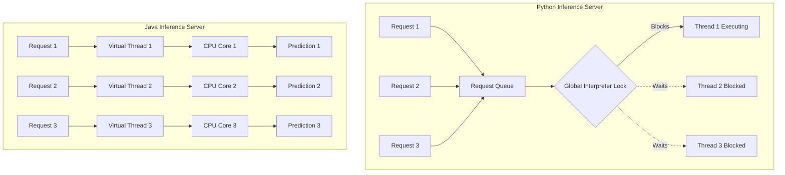
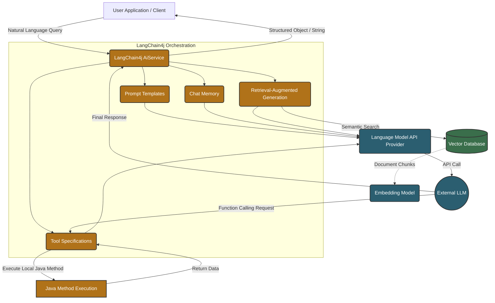
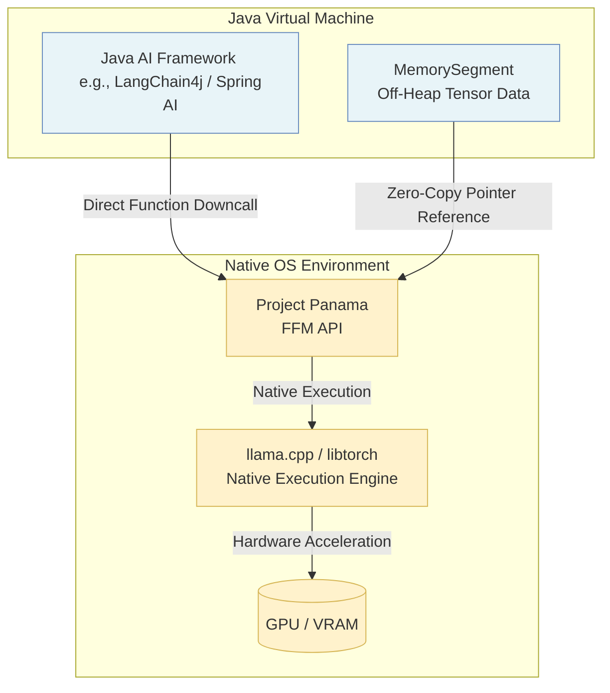
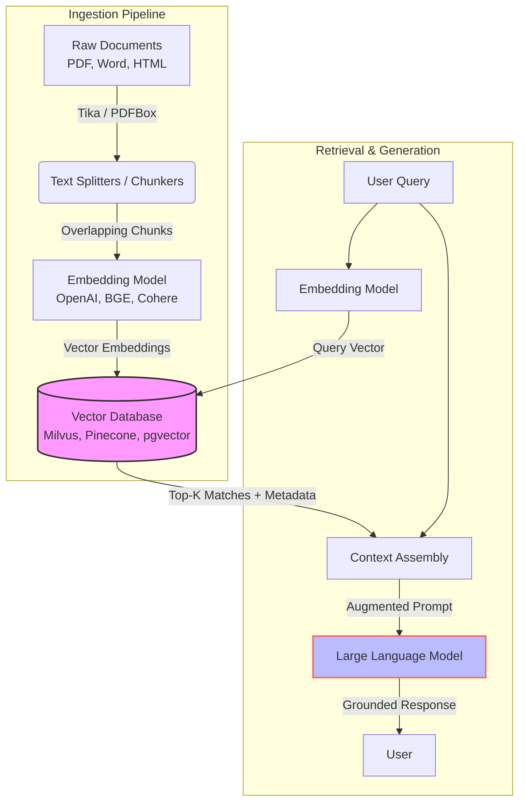

> [!abstract] Table of Contents
> - [[#Introduction: The Enterprise Giant in the AI Era]]
> - [[#Historical Context: Java's Early AI Ecosystem]]
> - [[#The Deployment Gap: Why Enterprise AI Needs Java]]
> - [[#The Modern Renaissance: LangChain4j and LLM Orchestration]]
> - [[#Architectural Shifts: Project Loom, Panama, and High-Concurrency AI]]
> - [[#RAG and Vector Data Management on the JVM]]
> - [[#Conclusion: The Bifurcated Future of AI]]

- - -
## Introduction: The Enterprise Giant in the AI Era

In the contemporary discourse surrounding Artificial Intelligence (AI) and Machine Learning (ML), the conversation is overwhelmingly dominated by Python. Python has indisputably secured its position as the lingua franca of AI research, rapid prototyping, and algorithmic development, driven by its syntactic simplicity and an unparalleled ecosystem of specialized libraries such as TensorFlow, PyTorch, and Scikit-learn. However, to view the AI landscape exclusively through a Pythonic lens is to observe only the tip of the iceberg. Beneath the surface of research and development lies the massive, complex infrastructure of enterprise deployment, where Java—the battle-tested workhorse of global industry—reigns supreme. The narrative of AI is not merely about building isolated models; it is increasingly about operationalizing them at scale, a domain where Java's architectural strengths are indispensable.

### The Empirical Reality of AI Deployment

While Python is the undisputed leader in data science workflows, empirical data reveals a starkly different reality when transitioning from the controlled laboratory environment to the chaotic, high-stakes realm of production. According to extensive industry surveys, a vast majority of Fortune 500 companies rely fundamentally on Java for their core backend services, high-frequency transaction processing, and massive data orchestration pipelines. When an AI model is deployed to serve millions of concurrent requests per second, integrate with legacy relational databases, or execute within strict latency, compliance, and security constraints, it rarely operates in a vacuum. It is typically embedded within a broader, highly regulated enterprise architecture, which is frequently constructed on the robust foundation of the Java Virtual Machine (JVM).

This creates a structural dichotomy in the AI lifecycle: models are trained in Python environments but deployed and consumed in Java ecosystems. This impedance mismatch has driven the evolution of robust, cross-platform deployment strategies. Techniques such as exporting trained models to the Open Neural Network Exchange (ONNX) format or utilizing Java-native inference engines allow Java applications to execute models trained in Python frameworks with near-native performance. The JVM's mature Just-In-Time (JIT) compiler dynamically optimizes code execution at runtime based on actual workload patterns. Combined with advanced, low-pause garbage collection algorithms (such as ZGC and Shenandoah) and highly refined multithreading capabilities, the JVM provides an execution environment uniquely capable of handling the immense computational throughput and strict service-level agreements (SLAs) required for real-time AI inference at an enterprise scale.

### R&D Dominance vs. Enterprise Orchestration

To understand the synergistic relationship between these two languages, we must contrast their respective domains of dominance and the underlying design philosophies that shaped them. Python's design prioritizes developer velocity, expressiveness, and rapid iteration. Its dynamic typing and interpreter-based execution make it ideal for the trial-and-error nature of training deep neural networks. Data scientists and researchers can rapidly experiment with novel algorithmic architectures, tweak hyperparameters, and visualize data without the overhead of compilation or strict, ahead-of-time type checking. 

Conversely, Java's design meticulously prioritizes system stability, horizontal and vertical scalability, and long-term maintainability over decades of a project's lifecycle. Its static typing, rigid object-oriented structure, and rigorous compile-time error checking are features that, while sometimes perceived as verbose or restrictive during rapid prototyping, become critical assets in systems comprising millions of lines of code managed by distributed, continuously evolving engineering teams. 

In the context of Artificial Intelligence, "orchestration" refers to the complex, critical logic surrounding the predictive model itself. This includes massive-scale data ingestion, distributed preprocessing pipelines, strict security and authentication protocols, highly available API gateways, resilient load balancing, and seamless integration with downstream enterprise microservices. Furthermore, the foundational tools of Big Data engineering—Apache Hadoop, Apache Spark, Apache Kafka, and Apache Flink—are written in Java and Scala (which runs on the JVM). Because AI models require massive datasets for continuous learning and inference, Java's native integration with these data processing behemoths gives it an unparalleled advantage in building end-to-end, data-intensive AI systems.

### Comparative Analysis: Python vs. Java in the AI Lifecycle

The following table empirically delineates the architectural and functional distinctions between Python and Java across the various phases of the Artificial Intelligence lifecycle, illustrating why both are necessary for a complete solution:

| Feature / Domain | Python | Java |
| :--- | :--- | :--- |
| **Primary Paradigm** | Dynamic, Interpreted, Expressive | Static, Compiled (Bytecode/JIT), Robust |
| **Core Strength** | R&D, Training, Prototyping, Data Exploration | Deployment, Scaling, Concurrency, Orchestration |
| **Typing System** | Duck/Dynamic Typing (Prone to runtime errors) | Strong/Static Typing (Compile-time safety) |
| **Performance (Raw)** | Generally slower (Constrained by GIL) | High (JIT optimization, advanced memory management)|
| **Concurrency Model**| Limited by Global Interpreter Lock (GIL) | Advanced (Platform threads, Virtual Threads via Loom)|
| **Ecosystem (Training)**| Unrivaled (PyTorch, TensorFlow, Keras) | Limited but growing (Deeplearning4j, Tribuo) |
| **Ecosystem (Serving)** | Flask, FastAPI, Uvicorn (Often requires WSGI) | Spring Boot, Quarkus, Micronaut, Jakarta EE |
| **Model Integration** | Native execution within the framework | ONNX Runtime, TensorFlow Java API, DJL |
| **Memory Management** | Reference counting + basic Garbage Collection | Highly tuned, concurrent, low-latency GCs |
| **Big Data Symbiosis**| Moderate (Often relies on wrappers like PySpark)| Ubiquitous (Native to Hadoop, Spark, Kafka, Flink) |

### The JVM's Adaptation to the AI Epoch

Recognizing the undeniable shift toward AI-integrated software architectures, the Java ecosystem has not remained stagnant. The Java Community Process (JCP) and various prominent open-source initiatives have actively evolved the platform to accommodate the intensive mathematical and computational demands of modern machine learning workloads. 

Significant architectural enhancements are currently underway, most notably **Project Panama** (the Foreign Function & Memory API). Panama drastically simplifies and accelerates Java's ability to interoperate safely and efficiently with native C/C++ libraries. This is crucial for AI, as it allows Java applications to leverage underlying hardware acceleration—such as NVIDIA's CUDA or cuDNN for GPU processing—without the historical performance overhead and brittleness of the Java Native Interface (JNI).

Furthermore, the introduction of the **Vector API** (currently incubating) empowers Java developers to express complex vector computations that compile at runtime to optimal Single Instruction, Multiple Data (SIMD) vector instructions on supported CPU architectures (e.g., AVX-512 on x86, or ARM NEON). This enables significant performance optimizations for the matrix multiplications, tensor operations, and linear algebra transformations that form the mathematical bedrock of neural networks and deep learning models.

Beyond language-level and virtual machine enhancements, frameworks specifically designed for the Generative AI era are rapidly gaining traction within the Java community. **LangChain4j**, a comprehensive Java port of the popular Python framework, allows enterprise developers to seamlessly integrate Large Language Models (LLMs) into their existing Java stacks. It facilitates the construction of Retrieval-Augmented Generation (RAG) systems, autonomous AI agents, semantic search engines, and conversational interfaces without forcing teams to abandon the safety, monitoring, and tooling of the JVM. Similarly, libraries like the **Deep Java Library (DJL)** developed by Amazon Web Services, **Deeplearning4j (DL4J)**, and Oracle's **Tribuo** provide native Java implementations and high-level APIs for traditional ML algorithms, deep learning inference, and model serving.

### Conclusion: The Symbiotic Future of Enterprise AI

The popular narrative pitting Java against Python in the realm of Artificial Intelligence is fundamentally flawed; it establishes a false dichotomy that misunderstands the engineering lifecycle. They are not mutually exclusive competitors fighting for the same territory, but rather complementary forces occupying vital, distinct strata of the modern technology stack. Python builds the brain—the algorithmic intelligence derived from data. Java builds the nervous system, the skeletal structure, and the resilient body that operationalizes and sustains that brain in the real world.

As Artificial Intelligence matures, transitioning from experimental prototypes and isolated research papers to mission-critical, enterprise-grade applications, the requirement for robust orchestration, extreme scalability, and seamless integration with legacy infrastructure becomes the primary engineering challenge. In this era, Java's role is not diminished by the rise of AI; rather, it is elevated. It stands as the enterprise giant, uniquely equipped with the performance, concurrency, and ecosystem necessary to operationalize the algorithmic breakthroughs of the AI revolution, ensuring that intelligence is reliably and securely delivered at scale to power the global economy.
- - -

To fully appreciate Java's current role in operationalizing these modern AI workflows, we must first look back at how its initial capabilities laid the groundwork for large-scale data processing. This historical perspective reveals why the ecosystem eventually split, with Java focusing on infrastructure while Python captured the research domain.
## Historical Context: Java's Early AI Ecosystem

The relationship between Java and Artificial Intelligence is characterized by an early dominance in robust, enterprise-grade machine learning applications, followed by a gradual bifurcation. Over time, Java cemented its role as the undisputed king of big data infrastructure while yielding the experimental research crown to Python. To understand the current landscape of AI, one must examine the foundational Java libraries that pioneered early machine learning and the architectural divergence that shaped the modern AI stack.

### The Pioneering Libraries: Weka, MOA, and OpenNLP

Long before the current deep learning renaissance driven by neural networks, machine learning was dominated by statistical methods, decision trees, and classical algorithms. In this era, Java was a primary vehicle for both research and production.

**Weka (Waikato Environment for Knowledge Analysis)**
Developed at the University of Waikato in New Zealand, Weka stands as one of the most historically significant machine learning workbenches. Written entirely in Java, it provided a comprehensive suite of machine learning algorithms for data mining tasks. Weka was revolutionary because it offered both a graphical user interface (GUI) for researchers to easily visualize data and run algorithms (like C4.5, Random Forests, and Support Vector Machines) and a robust Java API for developers to embed these models into enterprise applications. Its reliance on the Java Virtual Machine (JVM) meant that models trained on a researcher's desktop could be deployed seamlessly onto enterprise servers without translation or recompilation.

**MOA (Massive Online Analysis)**
As data scales grew, the need to process continuous streams of data—rather than static batches—became critical. MOA emerged as the premier open-source framework for data stream mining. Tightly integrated with Weka, MOA was designed to handle massive, infinite data streams with strict time and memory constraints. Written in Java, it implemented advanced algorithms for classification, regression, clustering, and outlier detection over evolving data streams. MOA's architecture leveraged Java's strong object-oriented principles to provide extensible frameworks for concept drift detection, making it indispensable for early real-time analytics platforms in finance and telecommunications.

**Apache OpenNLP**
Natural Language Processing (NLP) also saw early, robust implementations in Java. Apache OpenNLP provided a machine learning-based toolkit for the processing of natural language text. It supported the most common NLP tasks, such as tokenization, sentence segmentation, part-of-speech tagging, named entity extraction, chunking, parsing, and coreference resolution. OpenNLP relied heavily on maximum entropy and perceptron machine learning models. Because it was a Java library, it became the backbone for text processing in countless enterprise search engines, document management systems, and early customer service bots, benefiting from Java's stability and multithreading capabilities for high-throughput text processing.

### The Rise of Deeplearning4j

As the paradigm shifted toward deep learning, Java needed a framework that could compete with the emerging C++ and Python-based libraries (like Theano, Caffe, and early TensorFlow). Deeplearning4j (DL4J) was created to fill this void. 

DL4J was distinct in its mission: it was explicitly designed for the enterprise environment rather than academic research. It provided a deep learning programming library written for Java and the JVM. Crucially, DL4J integrated natively with Hadoop and Apache Spark, allowing distributed training of neural networks across massive commodity clusters. It utilized a library called ND4J (N-Dimensional Arrays for Java), which provided NumPy-like operations for the JVM, optimized with C++ backends (via Java Native Interface) to harness hardware acceleration like GPUs. DL4J supported Convolutional Neural Networks (CNNs), Recurrent Neural Networks (RNNs), and reinforcement learning, allowing organizations to run complex AI models within their existing Java-based big data pipelines.

### The Great Bifurcation: Why Python Won Research and Java Won Infrastructure

Despite these powerful libraries, the mid-2010s saw a definitive split: Python became the *lingua franca* of AI research and model training, while Java became the bedrock of data engineering and pipeline infrastructure. This divergence was driven by fundamentally different needs in the AI lifecycle.

**Why Python Won the Research Lab**
The victory of Python in the research domain was not due to execution speed—Python is notoriously slow. Instead, it won on developer velocity, syntactic flexibility, and a highly optimized ecosystem.

1. **Dynamic Typing and Conciseness:** Researchers, mathematicians, and data scientists required a language that felt like executable pseudocode. Python's dynamic typing and minimal boilerplate allowed for rapid prototyping. Iterating on a mathematical model was simply faster in Python than in Java, which requires explicit type declarations, compilation steps, and rigid object-oriented scaffolding.
2. **The SciPy Ecosystem:** Python cultivated an unparalleled ecosystem of scientific computing tools early on. NumPy provided lightning-fast, C-backed multi-dimensional arrays; Pandas offered intuitive data manipulation; and Matplotlib allowed for immediate visualization. This trifecta created a gravitational pull that attracted researchers away from MATLAB and Java.
3. **C-Bindings and Hardware Acceleration:** Python effectively acted as a "glue" language. The computational heavy lifting for deep learning (matrix multiplications) was written in C/C++ and CUDA. Python simply provided the high-level, human-readable API to interface with these compiled libraries. Frameworks like TensorFlow and PyTorch exploited this, offering elegant Python APIs while bypassing Python's performance bottlenecks via underlying C++ engines.

**Why Java Won the Data Pipeline**
While Python dominated model training, the actual deployment, scaling, and operationalization of data—the prerequisite for any enterprise AI—was conquered by Java (and its JVM sibling, Scala).

1. **The JVM and Ecosystem Maturity:** The JVM is a marvel of engineering, offering highly optimized Just-In-Time (JIT) compilation, sophisticated garbage collection, and extreme stability for long-running processes. Enterprises trusted the JVM to run mission-critical systems with minimal downtime.
2. **Big Data Infrastructure:** The foundation of modern AI is massive data. The tools built to store, move, and process this data—Apache Hadoop, Apache Spark, Apache Kafka, and Apache Flink—were all built on the JVM. Java's robust multithreading model, memory management, and network IO capabilities made it the natural choice for building distributed, fault-tolerant data systems. You could not train an AI without data, and that data lived in Java-based infrastructure.
3. **Strong Typing and Maintainability:** Data engineering requires rigorous data contracts and schema enforcement. Java's strict, static typing prevents entire classes of runtime errors that plague dynamic languages. For data pipelines processing terabytes of information across thousands of nodes, the predictability, refactorability, and tooling (like Maven and IntelliJ) provided by Java were non-negotiable.

In summary, the early Java AI ecosystem provided the robust, object-oriented foundations for classical machine learning and text processing. However, the operational reality of modern AI fractured the landscape. Python provided the agility necessary for the mathematical experimentation of neural networks, while Java provided the industrial-strength plumbing required to feed the data into those networks and serve the resulting models at planetary scale.

- - -

This historical divergence naturally leads to the core challenge faced by modern engineering teams: how to bridge the gap between Python's research agility and Java's infrastructural solidity. Understanding this friction is essential for deploying reliable, enterprise-grade AI applications.
## The Deployment Gap: Why Enterprise AI Needs Java

The lifecycle of an Artificial Intelligence model typically begins in an experimental, highly iterative environment. Data scientists and machine learning engineers rely on Python and interactive tools like Jupyter Notebooks to explore datasets, train models, and validate hypotheses. However, a stark divergence emerges when a successful prototype must be operationalized into a mission-critical, high-traffic corporate system. This divergence is widely recognized as the **Deployment Gap**. 

While Python excels in expressiveness and mathematical ecosystem support, enterprise production environments demand a different set of guarantees: strict type safety, predictable multi-threading, rigorous security compliance, and seamless integration with decades of existing infrastructure. For many Fortune 500 companies, core banking, global logistics, and large-scale ERP systems are built on the Java Virtual Machine (JVM). Attempting to staple a Python-based Flask or FastAPI microservice to a high-throughput Java architecture often introduces unacceptable latency, operational overhead, and maintenance friction.

| Requirement Domain | Experimental Phase (Python / Jupyter) | Enterprise Production (Java / JVM) |
| :--- | :--- | :--- |
| **Primary Goal** | Fast iteration, data exploration, model accuracy. | High availability, resilience, fault tolerance. |
| **Execution Environment** | Interactive notebooks, ephemeral cloud instances. | Containerized microservices, JVM clusters, Kubernetes. |
| **Typing System** | Dynamic (Duck typing), flexible but error-prone. | Static, strongly typed, enforced contracts. |
| **Concurrency** | Single-threaded (GIL constrained), multiprocess workarounds. | Highly concurrent, multithreaded (OS & Virtual Threads). |
| **Observability** | Basic print statements, ad-hoc logging. | Deep JVM metrics, OpenTelemetry, JMX, Micrometer. |
| **Security** | Often isolated or loosely secured during R&D. | Strict corporate governance, LDAP/AD integration, deep TLS. |

### Type Safety and Contract Enforcement

One of the most profound challenges in moving AI models from Python to production is the lack of strict contract enforcement. In a dynamic language, a model might expect a dictionary with specific keys, but structural drift in upstream data can cause catastrophic runtime failures that are notoriously difficult to debug.

Java's static type system provides a compile-time guarantee of data structures. When an AI model is served or integrated via Java, the inputs and outputs are defined by rigid classes or records. This ensures that any data schema mismatch is caught during the CI/CD pipeline rather than in production.

```java
// Java: Enforcing strict AI Model Inference Contracts
public record InferenceRequest(
    @NotNull String customerId, 
    @Min(0) double transactionAmount, 
    @NotBlank String merchantCategory
) {}

public record InferenceResult(
    double fraudProbability, 
    boolean isFlagged, 
    String explanation
) {}

public class FraudDetectionService {
    private final ModelPredictor predictor;

    public InferenceResult evaluateTransaction(InferenceRequest request) {
        // The JVM ensures 'request' structure is guaranteed before execution
        float[] tensorInput = Vectorize(request.transactionAmount(), request.merchantCategory());
        float[] output = predictor.predict(tensorInput);
        
        return new InferenceResult(
            output[0], 
            output[0] > 0.85, 
            "Threshold evaluated at 85%"
        );
    }
}
```

This strictness eliminates entire categories of runtime errors, which is critical when a machine learning model is integrated into a transaction processing pipeline operating at thousands of requests per second.

### The Concurrency Challenge: GIL vs. The JVM

Python's Global Interpreter Lock (GIL) is a well-known bottleneck. It prevents multiple native threads from executing Python bytecodes at once. While workarounds like multiprocessing or asynchronous I/O exist, they introduce significant memory overhead and complexity. In high-throughput environments, a Python-based inference server can quickly become choked under load.

Java, inherently designed for massive concurrency, does not suffer from a GIL. The JVM maps Java threads directly to OS threads, allowing true parallel execution across multi-core processors. Furthermore, with the introduction of Project Loom and Virtual Threads in modern Java, the platform can handle millions of concurrent connections with minimal hardware footprint.



When deploying deep learning models or complex ensemble methods, Java can effectively utilize thread pools to handle incoming API requests, pre-process data in parallel, and batch inference tasks efficiently, maximizing GPU or CPU utilization without the artificial ceiling of an interpreter lock.

### Security and Deep Observability

Enterprise environments require absolute visibility into application behavior. A deployed AI model is a black box if it cannot be monitored. The JVM ecosystem provides decades of hardened observability tools. Libraries like Micrometer, coupled with OpenTelemetry, allow Java applications to export granular metrics—such as garbage collection pauses, thread contention, memory heap usage, and model inference latency—directly to monitoring systems like Prometheus and Grafana.

Furthermore, security in Java is deeply embedded. From bytecode verification to mature frameworks like Spring Security, Java applications integrate seamlessly with enterprise authentication protocols (OAuth2, SAML, Active Directory). Attempting to secure a standalone Python AI service often requires deploying sidecar proxies or custom API gateways, adding network hops and architectural complexity. Java allows the AI inference engine to live securely within the existing corporate firewall, adhering to identical security policies as the rest of the banking or retail infrastructure.

### The Reality of Legacy Integration

The most compelling argument for Java in Enterprise AI is gravity. The world's financial, logistical, and healthcare data resides in relational databases, mainframes, and messaging queues (like Kafka or RabbitMQ) tightly integrated with Java applications. 

Exporting data from these systems to a Python environment for inference, only to send the decision back to Java, introduces latency and points of failure. By utilizing Java-based AI frameworks (like Deeplearning4j, Tribuo, or leveraging the ONNX Runtime and TensorFlow Java APIs), enterprises can embed AI directly into the existing monolithic or microservice architecture. This "in-process" inference means the model evaluates data securely and instantaneously, operating on the exact same JVM memory heap as the business logic, effectively bridging the deployment gap and transforming experimental AI into a reliable enterprise asset.
- - -

While solving the deployment gap for traditional machine learning was a significant hurdle, the emergence of Large Language Models introduced entirely new architectural complexities. To manage this generative AI paradigm, the Java ecosystem required a specialized orchestration layer capable of seamlessly bridging deterministic business logic with non-deterministic language models.
## The Modern Renaissance: LangChain4j and LLM Orchestration



| Component | Function within LangChain4j | Enterprise Equivalent / Alternative |
| :--- | :--- | :--- |
| **AiService** | Declarative Java interfaces defining agent behavior. | Spring AI `@ChatClient`, Semantic Kernel `@SystemMessage` |
| **ChatMemory** | Maintains conversational context across stateless HTTP bounds. | Custom session state, Redis-backed memory |
| **VectorStore** | Unified API for vector databases (Milvus, PgVector, Qdrant). | Raw database drivers, Spring Data Vector |
| **Tool Calling** | Maps LLM function requests to standard Java methods via `@Tool`. | Manual JSON Schema parsing and routing |
| **EmbeddingModel** | Converts text into high-dimensional float arrays. | Direct API calls to OpenAI/HuggingFace |

```java
import dev.langchain4j.memory.chat.MessageWindowChatMemory;
import dev.langchain4j.model.chat.ChatLanguageModel;
import dev.langchain4j.model.openai.OpenAiChatModel;
import dev.langchain4j.service.AiServices;
import dev.langchain4j.service.SystemMessage;
import dev.langchain4j.service.UserMessage;
import dev.langchain4j.agent.tool.Tool;

import java.time.LocalDateTime;

public class IntelligentJavaAgent {

    // 1. Declarative AI Service Interface
    interface CustomerSupportAgent {
        @SystemMessage({
            "You are a highly polite customer support agent for a bank.",
            "You can fetch account details and process simple requests.",
            "Always respond in a professional tone."
        })
        String chat(@UserMessage String userMessage);
    }

    // 2. Local Java Methods Exposed as Tools
    static class BankingTools {
        @Tool("Fetches the current balance for a given account ID")
        public double getAccountBalance(String accountId) {
            // Simulated database lookup
            System.out.println("Executing local method: getAccountBalance for " + accountId);
            return accountId.equals("12345") ? 1500.75 : 0.0;
        }

        @Tool("Fetches the current date and time for transaction logging")
        public String getCurrentTime() {
            return LocalDateTime.now().toString();
        }
    }

    public static void main(String[] args) {
        // 3. Model Configuration (Interchangeable Provider)
        ChatLanguageModel model = OpenAiChatModel.builder()
                .apiKey(System.getenv("OPENAI_API_KEY"))
                .modelName("gpt-4-turbo")
                .temperature(0.3)
                .build();

        // 4. Orchestration Assembly
        CustomerSupportAgent agent = AiServices.builder(CustomerSupportAgent.class)
                .chatLanguageModel(model)
                .chatMemory(MessageWindowChatMemory.withMaxMessages(10))
                .tools(new BankingTools())
                .build();

        // 5. Execution
        String response = agent.chat("Hello, what is the balance of account 12345?");
        System.out.println("Agent: " + response);
        // The LLM recognizes the need for the balance, calls getAccountBalance("12345"),
        // LangChain4j executes it, feeds the result back, and the LLM formulates the final answer.
    }
}
```

The advent of Large Language Models (LLMs) fundamentally disrupted the artificial intelligence landscape, shifting the paradigm from training bespoke, narrow-domain neural networks to orchestrating massive, pre-trained foundation models. For the Java ecosystem, which had historically lagged behind Python in the initial prototyping and training phases of deep learning, this shift represented a critical renaissance. The integration of AI was no longer about tensor calculus, CUDA optimizations, or managing backpropagation algorithms; it evolved into an engineering challenge of distributed systems, complex API orchestration, deterministic state management, and strict data governance—domains where the Java Virtual Machine (JVM) and its surrounding enterprise ecosystem excel.

At the vanguard of this modern renaissance is **LangChain4j**, a framework designed specifically to bridge the severe impedance mismatch between the non-deterministic, probabilistic nature of generative LLMs and the strongly typed, highly deterministic world of enterprise Java. Inspired conceptually by the Python-centric LangChain, LangChain4j was not merely ported but entirely re-architected for the JVM. It embraces Java's object-oriented paradigms, robust annotations, and highly concurrent threading models. It provides a unified, vendor-agnostic abstraction layer that allows Java applications to interact seamlessly with a multitude of AI providers (such as OpenAI, Anthropic, Google Gemini, Cohere, and local models via Ollama) without tightly coupling the enterprise codebase to a single vendor's proprietary API schema.

### The Architecture of Abstraction

The core brilliance of LangChain4j lies in its elegant abstraction of the LLM orchestration lifecycle. Working directly with raw LLM APIs involves tedious boilerplate: managing retries for HTTP requests, parsing complex nested JSON structures, handling stream interruptions, calculating token limits, and manually maintaining conversational state across stateless network bounds. LangChain4j encapsulates these low-level concerns into powerful, intuitive Java primitives. The framework abstracts the text-generation models into highly interchangeable `ChatLanguageModel` interfaces and embedding models into `EmbeddingModel` interfaces. This strict decoupling means that switching a massive enterprise application from a proprietary cloud model to a locally hosted open-weight model (like Llama 3 or Mistral) requires changing merely a few lines of initialization configuration, leaving the vast majority of the business and orchestration logic completely untouched.

Furthermore, LangChain4j introduces the concept of `AiServices`, which allows developers to define AI interactions declaratively using standard Java interfaces. By annotating a simple interface with `@SystemMessage` and `@UserMessage`, developers instruct the framework to dynamically generate a proxy implementation at runtime. This proxy translates method calls and string parameters into highly engineered LLM prompts. This declarative approach effectively hides the complexity of prompt engineering and JSON parsing behind familiar, type-safe Java method signatures. Crucially, when a method is defined to return a custom Java object (a POJO or a Java 14+ Record), LangChain4j automatically injects the necessary JSON Schema instructions into the LLM prompt. Upon receiving the LLM's response, it seamlessly deserializes the resulting JSON back into the strongly-typed Java object, elegantly bridging the chaotic gap between natural language generation and structured application data.

### Stateful Orchestration: Memory and RAG

Unlike traditional RESTful web services, conversational LLMs are fundamentally stateless. Every single API request must contain the entire conversational history to maintain context. In a high-throughput Java backend, manually managing this context—especially within the hard mathematical constraints of strict LLM token limits—is computationally precarious and error-prone. LangChain4j provides sophisticated `ChatMemory` implementations, such as the `MessageWindowChatMemory` or the more advanced `TokenWindowChatMemory`. These memory managers automatically prune and compress historical messages to ensure that the context window never exceeds the model's maximum capacity while aggressively retaining the most semantically relevant conversational threads. This memory architecture can be easily backed by enterprise databases like Redis, PostgreSQL, or Cassandra, ensuring that conversational state survives JVM restarts and stateless horizontal scaling across Kubernetes pods.

Moreover, the integration of proprietary enterprise data into LLMs without the immense cost of retraining—a technique known universally as Retrieval-Augmented Generation (RAG)—is handled natively by the framework. LangChain4j abstracts the entire data ingestion pipeline. It utilizes libraries like Apache Tika to parse PDFs, Word documents, and HTML, applying sophisticated document chunking algorithms (with overlapping windows to preserve semantic context boundaries) before generating embeddings. It offers out-of-the-box integrations with over a dozen specialized vector databases (including Milvus, Qdrant, Pinecone, and PostgreSQL via pgvector). When a Java application receives a user query, LangChain4j automatically embeds the query, performs a cosine similarity or Euclidean distance search against the vector store, retrieves the most relevant document chunks, and seamlessly injects them into the LLM's prompt context. This enables the AI to answer questions based on proprietary, highly secure enterprise data without that data ever being part of the LLM's initial training set.

### Agentic Capabilities: The Power of Tools

Perhaps the most transformative capability brought to the Java ecosystem by LangChain4j is the implementation of LLM "Tool Calling" (often referred to as Function Calling). While an LLM can reason brilliantly and generate text, it is inherently isolated from the live operational environment; it cannot inherently query a live SQL database, trigger a Stripe payment gateway, or check a real-time weather API. LangChain4j obliterates this isolation boundary by allowing developers to annotate standard Java methods with the `@Tool` annotation.

When an `AiService` is equipped with these tools, LangChain4j utilizes Java reflection to automatically serialize the method signatures, parameter types, and their natural-language descriptions into a standardized JSON Schema, which it passes to the LLM during the initial prompt. The LLM, acting as an autonomous reasoning engine, can analyze the user's request and determine if it needs external data or side-effects to fulfill it. Instead of answering immediately, the LLM responds with a structured request to execute a specific tool. LangChain4j intercepts this JSON payload, invokes the corresponding local Java method, and feeds the deterministic, programmatic result back to the LLM. The LLM then synthesizes this raw data into a coherent natural language response. This paradigm elevates the Java application from a simple text-generator to an autonomous agent capable of orchestrating complex multi-step workflows, validating strict business rules, and executing critical side effects securely within the enterprise boundary.

### The Enterprise Synergy and Future Trajectory

The integration of LangChain4j into the broader Java ecosystem marks a fundamental maturation of AI application development. Mainstream enterprise frameworks like Spring Boot and Quarkus have rapidly developed deep integrations and extensions (such as Spring AI and Quarkus LangChain4j) that run parallel to or directly incorporate concepts from LangChain4j. These integrations offer seamless compatibility with Spring's dependency injection container, auto-configuration modules, and reactive programming models like Project Reactor and Mutiny. 

Furthermore, this synergy ensures that AI orchestration benefits from the JVM's world-class operational standards. LLM interactions can be seamlessly monitored using Micrometer and OpenTelemetry, providing distributed tracing for API calls that often span multiple seconds. With the advent of GraalVM, Java AI agents built with LangChain4j can be compiled Ahead-of-Time (AOT) into native binaries, dramatically reducing startup times and memory footprints—making them ideal for serverless deployments on AWS Lambda or Google Cloud Run. The modern Java developer is no longer a bystander in the AI revolution; equipped with architectural marvels like LangChain4j, they are uniquely positioned to architect robust, scalable, and highly intelligent systems that operationalize the cognitive capabilities of Large Language Models within the rigorous, unforgiving constraints of enterprise software engineering.
- - -

However, orchestrating these complex LLM workflows and autonomous agents exposes new systemic bottlenecks, particularly regarding network I/O and intensive memory access. Overcoming these performance limits necessitated foundational enhancements to the Java Virtual Machine itself, ushering in an era of unprecedented concurrency.
## Architectural Shifts: Project Loom, Panama, and High-Concurrency AI

With the rapid integration of generative Artificial Intelligence, Retrieval-Augmented Generation (RAG), and deep learning workflows into enterprise software, the fundamental operational constraints of Java applications have dramatically shifted. Traditional AI orchestration workloads are heavily bound by two distinct bottlenecks:
1. **Network I/O Latency**: The massive delays involved in calling external Large Language Model (LLM) APIs (such as OpenAI, Anthropic, or distributed inference servers).
2. **Compute and Memory Access**: The immense overhead of transferring multidimensional arrays (tensors) from Java's managed heap to native CPU/GPU memory for hardware acceleration.

To address these systemic bottlenecks, the OpenJDK community has introduced structural changes through **Project Loom** (Virtual Threads) and **Project Panama** (Foreign Function & Memory API), alongside the incubating **Vector API**. Together, these innovations reshape Java from a language traditionally reliant on heavy operating system threads and costly Java Native Interface (JNI) bridges into a high-concurrency, low-latency platform natively suited for AI orchestration.

### Project Loom: Virtual Threads and I/O Bottlenecks

In the realm of AI orchestration, applications frequently act as complex middleware. A single user prompt might trigger an embedding generation, a vector database semantic search, a web scraping operation, and finally, an LLM generation. Because LLM token generation is inherently slow—often taking several seconds to stream tokens back to the client—the application threads spend the vast majority of their lifecycle blocked on network I/O.

#### The Traditional Threading Problem

Historically, Java’s `java.lang.Thread` mapped in a 1:1 ratio to underlying operating system (OS) threads. OS threads are "heavy" resources:
- They require approximately 1-2 MB of memory stack space per thread.
- Context switching between OS threads requires traps into the OS kernel, which is computationally expensive and introduces microsecond-level latency.
- A standard enterprise server typically maxes out at a few thousand concurrent OS threads before suffering from memory exhaustion or context-switching thrashing.

When thousands of concurrent users request LLM generations, a standard Thread-per-request model quickly exhausts the application server's thread pool. The system grinds to a halt, leading to massive latency spikes, even when the server's actual CPU utilization is hovering near zero.

#### Virtual Threads as the Solution

Introduced as a stable feature in Java 21, **Project Loom** provides **Virtual Threads**—lightweight, user-mode threads managed entirely by the Java Virtual Machine (JVM) rather than the host OS.

- **M:N Multiplexing**: Millions of virtual threads are efficiently multiplexed onto a very small pool of carrier OS threads (typically equal to the number of CPU cores).
- **Cheap Blocking**: When a virtual thread executes a blocking network call (e.g., waiting for a streaming LLM response), the JVM simply unmounts it from the carrier thread and suspends its stack to the heap. It then mounts another virtual thread that is ready to execute. The blocking operation costs mere bytes of heap space, rather than megabytes of OS memory.

```java
// Example: High-Concurrency LLM API Orchestration using Virtual Threads
import java.util.concurrent.Executors;
import java.util.stream.IntStream;

public class AILoomOrchestrator {
    public static void main(String[] args) {
        long startTime = System.currentTimeMillis();
        
        // Safely spawn 100,000 concurrent LLM requests
        try (var executor = Executors.newVirtualThreadPerTaskExecutor()) {
            IntStream.range(0, 100_000).forEach(i -> {
                executor.submit(() -> {
                    // This blocking call will not block an OS thread
                    String embedding = generateEmbedding("Context " + i);
                    String response = streamLlmInference(embedding);
                    processResponse(response);
                });
            });
        } // The executor automatically awaits the completion of all virtual threads
        
        long duration = System.currentTimeMillis() - startTime;
        System.out.println("Orchestrated 100,000 AI pipelines in " + duration + " ms");
    }

    private static String generateEmbedding(String context) {
        // Simulated I/O bound blocking call to an embedding model
        try { Thread.sleep(500); } catch (InterruptedException e) {}
        return "embedding_vector_" + context.hashCode();
    }

    private static String streamLlmInference(String embedding) {
        // Simulated I/O bound blocking call to an LLM provider
        try { Thread.sleep(2000); } catch (InterruptedException e) {}
        return "Generated response based on: " + embedding;
    }
    
    private static void processResponse(String response) {
        // Processing and routing logic
    }
}
```

#### Impact on Agentic AI Systems
By utilizing Virtual Threads, a standard Java backend can orchestrate millions of concurrent generative AI pipelines and autonomous agents without requiring complex, callback-heavy asynchronous frameworks like WebFlux or Project Reactor. The code remains imperative, synchronous, highly readable, and exceptionally scalable.

---

### Project Panama: Bridging Native GPU and Tensor Operations

While Project Loom gracefully solves the I/O wait-time problem, deep learning training and local model inference are strictly compute-bound. These tasks rely heavily on massive matrix multiplications that must be offloaded to GPUs (via NVIDIA CUDA or AMD ROCm) or executed via highly optimized native C/C++ libraries like `libtorch` (PyTorch) or `llama.cpp`.

#### The JNI Bottleneck
Historically, bridging Java to these C/C++ libraries required the Java Native Interface (JNI). JNI is notoriously slow, fragile, and cumbersome:
- It requires developers to write boilerplate C/C++ glue code to map Java methods to native functions.
- Data transferred between the Java Heap (which is managed and moved by the Garbage Collector) and native memory must be copied back and forth, completely destroying memory bandwidth performance for large multi-dimensional tensors.
- JNI transitions form an opaque boundary that cannot be easily optimized or inline-compiled by the JVM’s Just-In-Time (JIT) compiler.

#### Foreign Function & Memory API (FFM)

**Project Panama** (stabilized in Java 22) introduces the **Foreign Function & Memory API (FFM)**, a paradigm shift that completely bypasses JNI. It provides two critical capabilities for AI:

1. **Foreign Memory Access**: Allows Java applications to allocate, read, and write off-heap native memory directly and safely, avoiding Garbage Collection pauses and heap limitations.
2. **Foreign Function Access**: Allows Java to dynamically link and invoke C/C++ functions directly by looking up their memory addresses, providing near-native execution speed.



#### Zero-Copy Tensor Manipulation
In deep learning, an embedding might be represented as a dense vector of 1536 floating-point numbers. Moving millions of these vectors across the JNI boundary to perform a cosine similarity search would cripple performance.

With Project Panama, Java can allocate a `MemorySegment` directly off-heap. The Java application can populate this segment, and then pass its raw, unmanaged memory pointer directly to a native library like `llama.cpp` or cuBLAS. The GPU or native C code reads the data directly from the allocated native memory space. **Zero copies are made**, and GC overhead is eliminated.

```java
// Conceptual Example: Project Panama executing a Zero-Copy Tensor Operation
import java.lang.foreign.*;
import java.lang.invoke.MethodHandle;

public class PanamaTensorOps {
    public static void main(String[] args) throws Throwable {
        Linker linker = Linker.nativeLinker();
        SymbolLookup stdlib = linker.defaultLookup();
        
        // Locate a C function in a loaded AI library (e.g., a native tensor math engine)
        MethodHandle computeTensor = linker.downcallHandle(
            stdlib.find("compute_tensor_sim").orElseThrow(),
            FunctionDescriptor.ofVoid(ValueLayout.ADDRESS, ValueLayout.JAVA_INT)
        );

        // Safely allocate off-heap native memory for a large tensor (e.g., 1024 floats)
        try (Arena arena = Arena.ofConfined()) {
            MemorySegment tensorData = arena.allocate(ValueLayout.JAVA_FLOAT, 1024);
            
            // Populate tensor data directly in native memory from Java
            for (int i = 0; i < 1024; i++) {
                tensorData.setAtIndex(ValueLayout.JAVA_FLOAT, i, (float) Math.random());
            }
            
            // Pass the off-heap pointer directly to the native C/C++ GPU engine
            // Execution happens with zero data copying across the language boundary
            computeTensor.invoke(tensorData, 1024);
        }
    }
}
```

### The Vector API: CPU-Level SIMD for Local Inference

Complementing Project Panama is the **Vector API**, an incubating feature designed to express vector computations that reliably compile at runtime to optimal vector instructions on supported CPU architectures (like AVX-512 on x86 or NEON on ARM). 

In local AI inference or in-memory vector databases, operations like Cosine Similarity are executed millions of times per second. By leveraging the Vector API, Java can execute Single Instruction, Multiple Data (SIMD) operations. Instead of looping through an array of floats and multiplying them one by one, the Vector API allows the JVM to multiply 8, 16, or 32 floats in a single CPU clock cycle. When combined with Panama's off-heap memory, Java achieves compute performance that directly rivals native C++ implementations.

### Synergy in the AI Era

The confluence of Project Loom, Project Panama, and the Vector API positions Java uniquely in the modern AI ecosystem:
- **Python** remains the undisputed lingua franca of data science, model training, and research due to its deeply entrenched ecosystem and frameworks like PyTorch and TensorFlow.
- However, for **Enterprise AI Orchestration**—where deployment scale, static type safety, seamless integration with legacy microservices, and extreme concurrency are paramount—Java is experiencing a technical renaissance.

An enterprise backend can now use **Virtual Threads** to effortlessly manage 100,000 concurrent agentic LLM conversations, while simultaneously using **Project Panama** and the **Vector API** to execute low-latency, zero-copy RAG vector similarity searches against a highly optimized C++ native backend. Together, they eliminate the historical limitations of the JVM, forging Java into a formidable, scalable architecture for deploying high-concurrency Artificial Intelligence systems.
- - -

With the JVM now optimized for extreme concurrency and zero-copy memory operations, the infrastructure is perfectly primed for data-intensive AI patterns. Chief among these is the ability to securely ground language models in proprietary enterprise data through specialized retrieval mechanisms.
## RAG and Vector Data Management on the JVM

Retrieval-Augmented Generation (RAG) represents the prevailing architecture for grounding Large Language Models (LLMs) in proprietary or dynamic enterprise data. By combining an information retrieval system with a generative model, RAG mitigates hallucination, enforces access controls, and provides strict traceability for generated answers. On the Java Virtual Machine (JVM), the ecosystem for RAG and vector data management has matured rapidly, moving beyond experimental Python scripts to robust, type-safe architectures that allow enterprise systems to integrate semantic search seamlessly into existing high-throughput microservices.



### Document Parsing and Semantic Ingestion

Before data can be queried, it must be transformed into a format mathematically digestible by machine learning models—specifically, high-dimensional floating-point arrays known as embeddings. In enterprise Java environments, this ingestion pipeline is orchestrated using frameworks like **LangChain4j** or **Spring AI**, which abstract away the complexity of document processing and API integration.

**1. Document Parsing and Extraction:**
Enterprise data is rarely clean plain-text. It is locked in PDFs, Word documents, Confluence wikis, and legacy relational databases. In the JVM ecosystem, robust battle-tested libraries like Apache Tika and Apache PDFBox serve as the foundation for extracting text. Both LangChain4j and Spring AI provide document loader abstractions that wrap these libraries, converting binary streams into structured `Document` objects containing both text and provenance metadata.

**2. Intelligent Chunking Strategies:**
Once extracted, text must be divided into manageable segments (chunks) that fit within an embedding model's maximum token limit (often 512 to 8192 tokens). Effective chunking is arguably the most critical variable in RAG precision. If a chunk is too small, it loses semantic context; if it is too large, the "needle" gets lost in the "haystack" during retrieval. 

Java developers typically utilize `DocumentSplitter` utilities. A common approach is the recursive character text splitter, which divides text by paragraphs, then sentences, then words, ensuring a specific chunk size (e.g., 1000 characters) with an overlap (e.g., 200 characters) to prevent cutting context in half.

```java
// LangChain4j Chunking Example
import dev.langchain4j.data.document.Document;
import dev.langchain4j.data.document.parser.apache.pdfbox.ApachePdfBoxDocumentParser;
import dev.langchain4j.data.document.splitter.DocumentSplitters;
import dev.langchain4j.data.segment.TextSegment;
import java.io.InputStream;
import java.util.List;

public class IngestionService {
    public List<TextSegment> parseAndChunk(InputStream pdfStream) {
        Document document = new ApachePdfBoxDocumentParser().parse(pdfStream);
        
        // Split into chunks of max 1000 characters, with 200 character overlap
        var splitter = DocumentSplitters.recursive(1000, 200);
        return splitter.split(document);
    }
}
```

**3. Embedding Generation:**
A chunk of text is passed to an embedding model, outputting a high-dimensional vector. While cloud providers like OpenAI or Cohere are popular, enterprise compliance often requires local embedding generation. The JVM excels here: libraries like Deep Java Library (DJL) or LangChain4j's ONNX integration allow developers to run open-source models (like `BGE-m3` or `MiniLM`) entirely within the Java process, avoiding network latency and data exfiltration risks.

### JVM Drivers and Vector Databases

The backbone of a RAG system is the Vector Database—a specialized data store optimized for querying high-dimensional arrays using approximate nearest neighbor (ANN) algorithms like Hierarchical Navigable Small World (HNSW) or Inverted File Index (IVF). The JVM is supported by a rich tapestry of database drivers.

| Vector Database | JVM Integration Strategy | Enterprise Use Case Suitability |
| :--- | :--- | :--- |
| **pgvector (PostgreSQL)** | Hibernate / JPA Dialects, Spring Data | Excellent for augmenting existing relational workloads. Simplifies infrastructure by keeping vectors alongside transactional data. |
| **Milvus** | Native Java SDK (gRPC) | Designed for massive scale. Ideal when vector counts exceed hundreds of millions. Requires dedicated clustered infrastructure. |
| **Pinecone** | Java REST SDK / Spring AI | Managed SaaS offering. Perfect for teams seeking zero-infrastructure overhead and rapid prototyping with strong metadata filtering. |
| **Qdrant** | Native Java SDK (gRPC) | High-performance Rust-based DB with a robust asynchronous Java client. Exceptional for complex hybrid search workloads. |

#### Implementing pgvector in Spring Boot

For many Java enterprise applications, PostgreSQL is already the system of record. The `pgvector` extension allows developers to store embeddings in standard tables. Using **Spring AI**, a vector repository can be established relying on standard JDBC paradigms, drastically reducing operational complexity.

```java
import org.springframework.ai.vectorstore.VectorStore;
import org.springframework.ai.vectorstore.PgVectorStore;
import org.springframework.jdbc.core.JdbcTemplate;
import org.springframework.ai.embedding.EmbeddingClient;
import org.springframework.context.annotation.Bean;
import org.springframework.context.annotation.Configuration;

@Configuration
public class VectorStoreConfig {

    @Bean
    public VectorStore pgVectorStore(JdbcTemplate jdbcTemplate, EmbeddingClient embeddingClient) {
        // Spring AI handles the embedding generation and the storage/retrieval 
        // of vectors using pgvector specific syntax (e.g., the <-> distance operator)
        return new PgVectorStore(jdbcTemplate, embeddingClient);
    }
}
```

#### Orchestrating the Full RAG Retrieval Flow

With documents parsed, embedded, and indexed, the retrieval phase executes. The application intercepts the user's query, embeds it, searches the vector database, assembles a prompt, and streams the output from the LLM.

```java
import org.springframework.ai.chat.ChatClient;
import org.springframework.ai.chat.messages.UserMessage;
import org.springframework.ai.chat.prompt.Prompt;
import org.springframework.ai.chat.prompt.SystemPromptTemplate;
import org.springframework.ai.document.Document;
import org.springframework.ai.vectorstore.SearchRequest;
import org.springframework.ai.vectorstore.VectorStore;
import org.springframework.stereotype.Service;

import java.util.List;
import java.util.Map;
import java.util.stream.Collectors;

@Service
public class RagService {

    private final ChatClient chatClient;
    private final VectorStore vectorStore;

    public RagService(ChatClient chatClient, VectorStore vectorStore) {
        this.chatClient = chatClient;
        this.vectorStore = vectorStore;
    }

    public String answerQuestion(String query) {
        // 1. Retrieve the top 5 most relevant document chunks based on semantic distance
        List<Document> similarDocuments = vectorStore.similaritySearch(
            SearchRequest.query(query).withTopK(5)
        );

        // 2. Extract text content and provenance metadata
        String context = similarDocuments.stream()
                .map(doc -> doc.getContent() + " [Source: " + doc.getMetadata().get("filename") + "]")
                .collect(Collectors.joining("\n\n---\n\n"));

        // 3. Construct a prompt template incorporating the context
        String systemPromptText = """
            You are a senior technical architect. 
            Answer the user's question using ONLY the provided architectural context below.
            If the context does not contain sufficient information, state "Insufficient context."
            Always cite your sources using the provided metadata.
            
            CONTEXT:
            {context}
            """;
            
        SystemPromptTemplate systemPromptTemplate = new SystemPromptTemplate(systemPromptText);
        var systemMessage = systemPromptTemplate.createMessage(Map.of("context", context));
        var userMessage = new UserMessage(query);

        // 4. Dispatch the augmented prompt to the LLM
        Prompt prompt = new Prompt(List.of(systemMessage, userMessage));
        return chatClient.call(prompt).getResult().getOutput().getContent();
    }
}
```

### Empirical Engineering Considerations for JVM RAG

Scaling RAG architectures in a JVM environment necessitates rigorous empirical testing and system tuning. The transition from a local prototype to a production-grade system exposes several engineering constraints:

1. **Connection Pooling and gRPC Multiplexing:** High-performance vector databases like Milvus and Qdrant utilize gRPC. Unlike traditional JDBC connection pools, gRPC channels rely on HTTP/2 multiplexing. In Java, managing the lifecycle of these channels—configuring keep-alives, implementing retry logic with exponential backoff, and avoiding channel exhaustion—is paramount. Java 21's Virtual Threads are highly effective here, allowing thousands of concurrent vector searches to block on network I/O without exhausting the operating system's thread capacity.

2. **Hybrid Search and Metadata Filtering:** Pure dense vector search often yields low precision in multi-tenant or highly partitioned data domains. An enterprise implementation must utilize hybrid search—combining semantic vector similarity with deterministic scalar metadata filters (e.g., finding relevant documents `WHERE tenant_id = 'ABC-123' AND clearance_level = 'CONFIDENTIAL'`). The JVM drivers for Pinecone, Milvus, and pgvector allow developers to build complex boolean predicates that execute push-down filtering directly at the database layer, drastically improving retrieval precision and security.

3. **Garbage Collection (GC) Overhead:** The ingestion phase of RAG is highly memory-intensive. Parsing massive proprietary documents (such as 500-page legal PDFs) and buffering large JSON responses from embedding APIs generates severe short-lived object allocations. In high-throughput Java applications, profiling the JVM to optimize GC—often by migrating from G1GC to ZGC or Shenandoah for sub-millisecond pause times—ensures that bulk ingestion routines do not induce stop-the-world pauses that cascade into the synchronous retrieval APIs.

By adhering to these structural patterns and leveraging the strongly-typed nature of the JVM ecosystem, enterprise teams can effectively transform inert data silos into dynamic, context-aware reasoning engines that power the next generation of artificial intelligence applications.
- - -

Having established the robust capabilities of the JVM for orchestration, concurrency, and data retrieval, it becomes evident that the future of enterprise AI relies on a dual-ecosystem approach. This architectural harmony allows both research and deployment environments to operate at their peak potential.
## Conclusion: The Bifurcated Future of AI

The evolution of artificial intelligence has reached a critical inflection point, not merely in the sophistication of its models, but in the architectural foundations that support its deployment. For years, a persistent narrative suggested a monolithic future dominated by a single language—often Python—due to its undeniable supremacy in the research and prototyping phases. However, empirical observation of large-scale enterprise deployments reveals a different reality: a bifurcated future where the ecosystem is divided structurally between the *creation* of intelligence and the *orchestration* of intelligence. This bifurcation is not a fracture, but a natural optimization of resources, where Python and Java each assume the mantle of their respective architectural strengths.

### The Training vs. Orchestration Divide

To understand this bifurcation, we must observe the fundamental differences in computational profiles between training models and deploying agentic systems at an enterprise scale.

The training phase is characterized by intense, synchronous, and highly parallelized mathematical operations—primarily matrix multiplications performed on Graphical Processing Units (GPUs) or Tensor Processing Units (TPUs). Python, acting as a syntactic wrapper over highly optimized C/C++ and CUDA libraries (like PyTorch and TensorFlow), offers the fluidity and rapid iteration cycles required by researchers. It is the language of hypothesis, experimentation, and structural definition. The global data science community has coalesced around Python, making it the lingua franca for algorithmic innovation.

Conversely, the inference and orchestration phase presents an entirely different computational profile. Once a model is trained and its weights are frozen, the challenge shifts from mathematical optimization to systemic integration, high-concurrency request handling, state management, and stringent security protocols. Here, the architectural demands align precisely with the historic strengths of the Java Virtual Machine (JVM).

### Visualizing the Bifurcated Architecture

```mermaid
flowchart TD
    subgraph Research & Training [Research & Training Layer]
        P1[Python Ecosystem]
        T1[PyTorch / TensorFlow]
        D1[Data Processing: Pandas / Polars]
        C1[CUDA / Hardware Acceleration]
        
        P1 --> T1
        T1 --> C1
        D1 --> T1
    end

    subgraph Artifact [Model Artifact]
        W[Frozen Weights / GGUF / ONNX]
    end

    subgraph Enterprise Orchestration [Enterprise Orchestration Layer]
        J1[Java / JVM Ecosystem]
        L1[LangChain4j / Spring AI]
        S1[Microservices / Spring Boot]
        V1[Virtual Threads / Project Loom]
        DB[Enterprise Data / Vector Stores]
        
        J1 --> L1
        L1 --> S1
        S1 --> V1
        S1 <--> DB
    end

    Research & Training -->|Export| Artifact
    Artifact -->|Deployment| Enterprise Orchestration
```

### The Decoupling: Standardization of Model Artifacts

The standardization of model artifacts further accelerates this bifurcation and makes it structurally viable. Formats such as ONNX (Open Neural Network Exchange) and GGUF (GPT-Generated Unified Format) allow models trained in PyTorch or JAX to be exported into universally consumable binaries. Once exported, these artifacts are completely language-agnostic. 

A Java application, utilizing the ONNX Runtime for Java or a native binding to `llama.cpp`, can load and execute these models directly. This decoupling of the training environment from the inference environment is the critical mechanism that allows enterprises to train in Python but deploy in Java, maximizing the utility of both ecosystems without forcing either to perform tasks outside its domain of excellence.

### The Rise of Java in Agentic Orchestration

The integration of Generative AI into enterprise systems has evolved from simple "chat over your data" implementations into complex, autonomous agentic workflows. These AI agents must interact with external APIs, query relational databases, manage multi-turn conversational memory, and execute tools asynchronously.

In this domain, Java's recent evolutionary leaps—particularly the introduction of Virtual Threads (Project Loom) in Java 21—have fundamentally redefined its capability to handle orchestrations. Agentic workflows are overwhelmingly I/O-bound; an agent spends the majority of its execution time waiting for the Large Language Model (LLM) to return a token stream, or for a vector database to return a similarity search result. 

Traditional OS-level thread-per-request models become prohibitively expensive under such conditions, as threads block and consume significant memory while waiting for network responses. Python's Global Interpreter Lock (GIL) and its `asyncio` event loop provide workarounds, but they introduce significant architectural complexity and struggle to scale elegantly across multiple cores without heavy multiprocessing overhead. 

Java's Virtual Threads, however, allow developers to write simple, synchronous-looking code while the JVM maps millions of virtual threads onto a small pool of carrier threads. This enables a Java-based orchestrator to handle tens of thousands of concurrent agentic requests, managing tool-use, RAG (Retrieval-Augmented Generation) pipelines, and database transactions with unparalleled efficiency, minimal memory footprint, and high stability.

### Evolving JVM Horizons: Project Panama

Furthermore, the JVM is actively evolving to support native AI workloads more directly. Project Panama, introducing the Foreign Function & Memory API (FFM), is fundamentally altering how Java interacts with native code and memory. Historically, calling highly optimized C/C++ libraries from Java required the cumbersome Java Native Interface (JNI). 

Panama allows Java to efficiently access specialized hardware instructions (such as AVX-512 for SIMD operations) and interface directly with high-performance C++ libraries without the latency overhead traditionally associated with JNI. This means that even local, on-premise inference of quantized models can be executed with near-native performance directly from a Java application, bypassing Python entirely in the localized deployment phase.

### The Enterprise Integration Mandate

Beyond concurrency and hardware access, the future of AI deployment is heavily dictated by existing infrastructure. The vast majority of global enterprise systems, banking architectures, healthcare platforms, and critical backend services are written in Java. Introducing AI into these systems requires seamless integration with established security frameworks, transaction managers, and monitoring tools.

Frameworks such as **Spring AI** and **LangChain4j** have emerged as the definitive bridges across this divide. They do not attempt to replicate Python's training libraries; instead, they focus strictly on integrating LLM capabilities into the Java ecosystem. By abstracting the complexities of interacting with OpenAI, Anthropic, or local Ollama models, these frameworks allow Java engineers to embed intelligence directly into existing Spring Boot microservices. 

This synergistic approach offers several profound advantages for production-grade deployments:

1. **Type Safety and Predictability:** LLM outputs are inherently probabilistic and unstructured (typically plain text or JSON). Java's strong, static typing forces developers to build robust parsing, mapping, and validation layers. This ensures that generative outputs conform to strict enterprise data contracts before they are allowed to trigger actions in core systems.
2. **Observability:** The JVM ecosystem possesses the most mature observability tooling in the industry (e.g., Micrometer, OpenTelemetry, Grafana). Tracing an unpredictable LLM request through a complex agentic pipeline is far more manageable within a strongly instrumented JVM environment.
3. **Security and Access Control:** Enterprise RAG systems require granular, document-level access control. Integrating a vector search within a Java backend allows the application to leverage existing Spring Security contexts, ensuring users only retrieve information they are explicitly authorized to view, preventing semantic data leaks.

### A Synergistic Ecosystem

The trajectory is clear: the future of AI is not a zero-sum competition between programming languages, but a symbiotic relationship based on architectural fitness. Python will continue to reign supreme in the laboratories, the data science notebooks, and the model training clusters. It will remain the vanguard of algorithmic innovation, data manipulation, and neural network design.

However, as AI transitions from the laboratory to the production floor—as it becomes deeply woven into the fabric of global commerce, logistics, and automated operations—Java will serve as the bedrock of its deployment. The orchestration of multiple LLMs, the management of complex RAG pipelines, the execution of agentic tools, and the secure integration with legacy data stores demand the scalability, reliability, and concurrency that the JVM provides.

In this bifurcated future, the most successful engineering organizations will be those that embrace both paradigms: leveraging Python to forge the intelligence, and relying on Java to unleash it upon the world. The architecture of tomorrow is a testament to this structural harmony, ensuring that the profound capabilities of Artificial Intelligence are deployed with the rigor, safety, and resilience required by the enterprise scale.

- - -

## Related Notes

*None*

