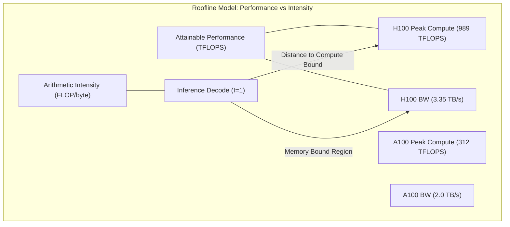
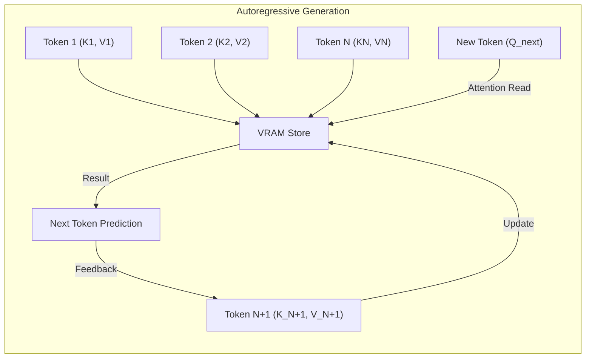
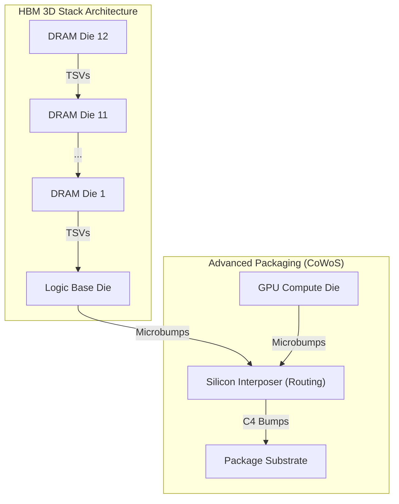
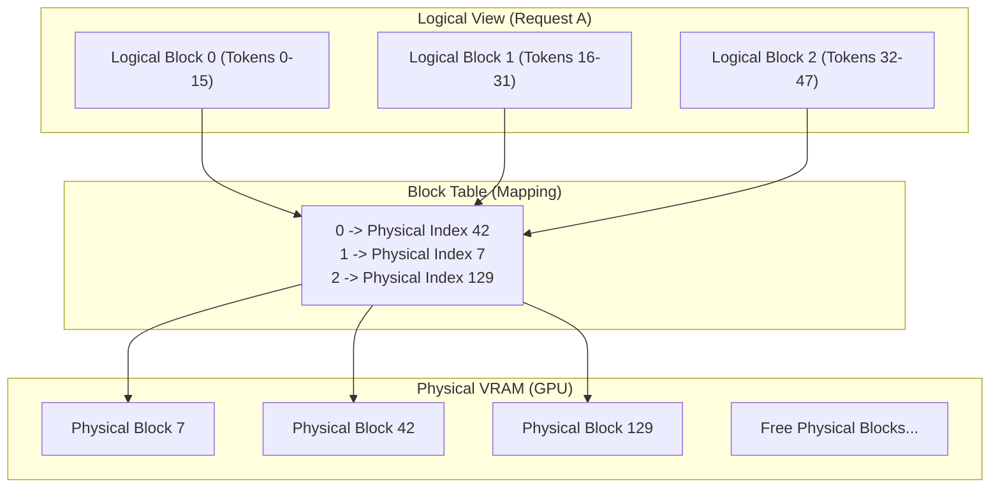
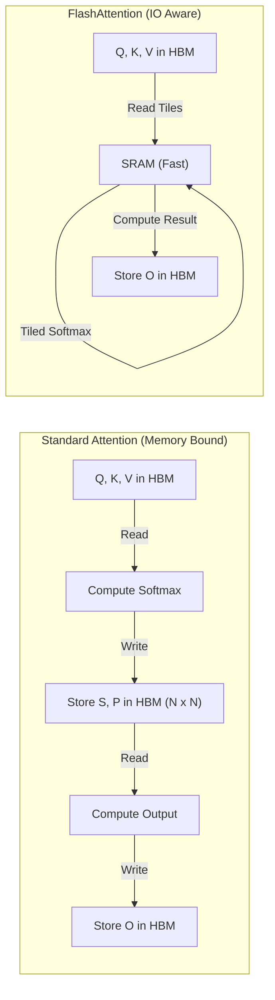
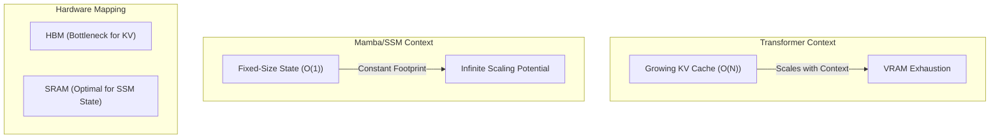

# KV Cache and Hardware for Context and Memory

# 1. The Physics of the Memory Wall: Bandwidth vs Compute, Arithmetic Intensity, and Silicon Constraints

The contemporary landscape of Artificial Intelligence, specifically the deployment and scaling of [[Large Language Models - Architecture and Mechanics|Large Language Models (LLMs)]], is not primarily constrained by the theoretical peak of floating-point operations per second (FLOPS), but by the physical movement of data. This phenomenon, colloquially termed the "Memory Wall," represents a divergence in the scaling laws of compute throughput versus memory bandwidth. While logic density and switching speeds have historically followed Moore’s Law—doubling roughly every two years—the ability to shuttle bits from off-chip storage to the execution units has grown at a significantly more sluggish pace. In the context of [[Transformer Models vs Diffusion in Agentic AI, LLMs and SLMs|transformer]] inference, where billions of parameters and even more transient Key-Value (KV) pairs must be fetched for every token generated, the memory wall becomes the primary determinant of latency and cost-to-serve.

## The Arithmetic Intensity Gradient

To quantify the memory wall, we must analyze the **Arithmetic Intensity ($I$)** of the workload. Arithmetic Intensity is defined as the ratio of floating-point operations ($F$) to the amount of data moved ($B$, in bytes):

$$I = \frac{F}{B}$$

For a generative LLM in the inference phase (specifically the decode stage), the model must load every parameter from memory to the processor to calculate the next token. If we have a 70B parameter model (FP16), we must load 140 GB of data. The compute performed for a single token generation is roughly $2 \times \text{Parameters}$ FLOPs (considering the fused multiply-add operations). Thus, the arithmetic intensity is:

$$I_{\text{decode}} = \frac{2 \times 70 \times 10^9 \text{ FLOPs}}{140 \times 10^9 \text{ Bytes}} = 1 \text{ FLOP/byte}$$

Modern GPUs, such as the NVIDIA H100 (SXM5), provide a theoretical peak performance of roughly 989 TFLOPS (FP16) but a memory bandwidth of only 3.35 TB/s. The **machine balance** ($B_m$) of the hardware is the ratio of its peak compute to its peak bandwidth:

$$B_m = \frac{989 \times 10^{12} \text{ FLOPs/s}}{3.35 \times 10^{12} \text{ Bytes/s}} \approx 295 \text{ FLOP/byte}$$

When $I < B_m$, the workload is **memory-bound**. When $I > B_m$, the workload is **compute-bound**. The decode stage of LLM inference, with an intensity near 1, is approximately 300 times more memory-bound than the hardware's equilibrium point. This discrepancy is the essence of the memory wall: our silicon "engines" are spinning at 30,000 RPM, but our "fuel lines" can only supply enough petrol for 100 RPM.

## The Roofline Model: A100 vs H100 Analysis

The Roofline Model provides a visual representation of these constraints. The horizontal "roof" represents the peak compute performance, while the slanted "eave" represents the peak memory bandwidth.

As the diagram illustrates, even the massive jump in compute from A100 (Ampere) to H100 (Hopper) does not significantly accelerate the single-user decode latency, because the bandwidth (the slope of the eave) only improved by a factor of ~1.7x, whereas the compute throughput improved by ~3x. The gap between what the silicon *could* calculate and what it *actually* calculates for LLMs is widening.

### Hardware Specification Comparison

| Feature | NVIDIA A100 (SXM4) | NVIDIA H100 (SXM5) | Delta (x) |
|:---|:---|:---|:---|
| Architecture | Ampere | Hopper | - |
| Process Node | TSMC 7nm (N7) | TSMC 4nm (N4) | - |
| Transistor Count | 54.2 Billion | 80 Billion | 1.47x |
| Peak FP16 Compute | 312 TFLOPS | 989 TFLOPS | 3.17x |
| HBM Type | HBM2e | HBM3 | - |
| Memory Bandwidth | 2.039 TB/s | 3.352 TB/s | 1.64x |
| TDP (Thermal Design Power) | 400W | 700W | 1.75x |
| L2 Cache Size | 40 MB | 50 MB | 1.25x |

## Silicon Constraints and the Packaging Crisis

The stagnation of memory bandwidth relative to compute is not a failure of imagination but a consequence of fundamental physics and material science. Several silicon-level constraints prevent us from simply "making the bus wider."

### 1. Pin Density and IO Limits
Traditional DDR memory communicates via signals sent through the PCB. However, the energy required to move a bit across a PCB is orders of magnitude higher than moving it within the silicon die. To achieve TB/s speeds, we must move the memory closer to the compute. This led to **High Bandwidth Memory (HBM)**, which uses **Through-Silicon Vias (TSVs)** to stack DRAM dies vertically and connect them to the GPU via a silicon interposer.

The physical bottleneck here is the **bump pitch**—the distance between the micro-bumps that connect the HBM stack to the interposer. As we shrink the pitch, signal interference and manufacturing defects increase. We are reaching the limits of how many electrical "lanes" can be crammed into the few square millimeters surrounding the GPU core. 

### 2. The HBM Stacking Ceiling
Modern HBM3 employs 8-high or 12-high stacks. Increasing the stack height improves capacity but creates significant **thermal resistance**. DRAM is extremely sensitive to heat; if the bottom dies in a stack (closest to the hot GPU) exceed 85-100°C, the refresh rates must increase, which consumes bandwidth and eventually leads to data corruption. Cooling a 12-layer sandwich of silicon that is sitting next to a 700W heat source (the H100) is one of the greatest engineering challenges in modern computing.

### 3. Energy Per Bit ($pJ/bit$)
The cost of computing (performing a 16-bit multiply-add) is now significantly cheaper than the cost of fetching the operands. Moving a bit from HBM to the register file consumes roughly 100x more energy than the actual mathematical operation. In a TDP-constrained environment (like a 700W H100), every watt spent moving data is a watt that cannot be spent on FLOPs. If we were to increase bandwidth by 10x using current technology, the power required for the memory controller and IO alone would exceed the total power budget of the chip.

## The Role of the KV Cache in this Paradigm

In the context of this memory wall, the **KV Cache** is both a savior and a burden. During the prefill stage (when the model processes the input prompt), the workload is largely compute-bound because many tokens are processed in parallel ($I$ is high). However, during the decode stage, we generate one token at a time.

If we did not use a KV Cache, we would have to recompute the self-attention keys and values for every previous token in the sequence for every new token generated. This would result in $O(N^2)$ compute. With the KV Cache, we store these tensors in HBM, reducing compute to $O(N)$.

But here is the trade-off: we have traded **Compute Intensity** for **Memory Capacity and Bandwidth**. By storing the KV Cache, we are no longer re-calculating (compute-bound), but we are now loading a massive, ever-growing tensor from memory for every token (memory-bound). As the context window scales from 8k to 128k or 1M tokens, the KV Cache itself begins to dominate the VRAM, eventually squeezing the model weights out of memory and hitting the memory wall with even greater force.

## Conclusion of Physical Constraints

The physics of silicon packaging, thermal dissipation, and signal integrity dictate that we cannot "brute force" our way out of the memory wall.

- - -

Understanding the rigid physical constraints of the memory wall explains why we must trade compute for storage. This leads us to the mechanical implementation of the KV Cache itself—the specific way we store and retrieve the tensors that allow us to bypass redundant calculations.

## 2. The Mechanics of the Key-Value (KV) Cache: Attention State, Token Appending, and Mechanical Redundancy

The Key-Value (KV) Cache is the fundamental "state" of a generative Transformer during inference. To avoid the quadratic computational cost of re-calculating the representations of every previous token in a sequence, we cache the linear transformations of those tokens—specifically their Keys ($K$) and Values ($V$). While this transformation reduces the compute complexity from $O(N^2)$ to $O(N)$, it introduces a linear memory requirement that eventually threatens to saturate the available High Bandwidth Memory (HBM).

## The Autoregressive Loop and the Cache

In the generative decode phase, the model predicts the $(N+1)$-th token based on the previous $N$ tokens. In a standard self-attention layer:
1. The new token is transformed into Query ($Q$), Key ($K$), and Value ($V$) vectors.
2. The $Q$ vector must be compared (dot-product) against the $K$ vectors of *all* previous tokens to determine attention scores.
3. These scores are used to weight the $V$ vectors of *all* previous tokens.

The KV Cache eliminates the need to re-run the linear layers for the first $N$ tokens. We simply append the new token's $K$ and $V$ to the existing cache and perform the attention calculation.

## The Dynamics of Key and Value Tensors

It is critical to distinguish between the roles of the Key and Value tensors within the cache.

### 1. Key Tensors and Positional Encoding
The Key tensors represent "what the token is about" and are used to compute the attention scores via the dot product with the Query. In modern architectures, **Rotary Positional Embeddings (RoPE)** are applied to the keys before they are stored in the cache. This means that each Key tensor in the cache is "aware" of its absolute position.     

### 2. Value Tensors and Semantic Information
The Value tensors represent the actual information to be aggregated. When the attention scores are applied to the values, we are effectively performing a weighted sum of the semantic content of previous tokens. Unlike the Query and Key, the Value tensor is often stored without positional bias, as its significance is determined by the attention score (which already incorporates position via $Q$ and $K$).

## Redundancy and the "Memory-to-Compute" Ratio

The primary mechanical inefficiency in traditional Multi-Head Attention (MHA) is that every single attention head has its own unique set of Keys and Values. For a model with 64 heads, we store 64 distinct $K$ and $V$ vectors for every single token.

Research into the internal state of these models (such as in the GQA and MQA papers) has shown that many heads exhibit redundant attention patterns. The "Mechanical Redundancy" of MHA is a significant factor in the context scaling limit.

### Key-Value Compression Strategies

Before the advent of algorithmic solutions like Multi-Query Attention (MQA), engineers attempted several "mechanical" elimination strategies:

| Strategy | Description | Impact on Quality | Impact on VRAM |
|:---|:---|:---|:---|
| **Quantization (INT8/FP8)** | Storing KV tensors in 8-bit instead of 16-bit. | Minimal degradation with calibration. | 50% Reduction |
| **KV Cache Offloading** | Moving "cold" parts of the cache to System RAM or SSD. | High Latency (PCIe bottleneck). | Infinite (virtually) |
| **Token Dropping** | Evicting tokens with low attention scores from the cache. | High (breaks long-range logic). | Variable |
| **Multi-Query Attention (MQA)** | All Query heads share a single KV head. | Notable degradation. | ~95%+ Reduction |

## The Mechanics of Sequence Appending

From a system engineering perspective, the KV Cache is a "growing" tensor. In naive implementations (like those in early HuggingFace Transformers versions), the KV Cache was managed as a contiguous tensor. For every new token, the system would allocate a *new* tensor of size $N+1$, copy the $N$ previous values, and append the new value.       

This **reallocation-and-copy** pattern created two massive problems:
1. **Memory Fragmentation**: Large contiguous blocks of VRAM are rare. The system would frequently fail to allocate even if total free VRAM was sufficient.
2. **Computational Overhead**: $O(N^2)$ data movement just to manage the cache state.

The resolution to this mechanical flaw—**PagedAttention**—represents the transition of KV Cache management from simple tensor manipulation to operating-system-level memory virtualization, which we will analyze in Section 4.       

## Summary of Mechanical Dynamics

The KV Cache is the "working memory" of the model. Its size is determined by the architectural breadth (layers, heads, dimensions) and the temporal depth (sequence length). Its growth is relentless and linear, eventually colliding with the physical limits of HBM capacity. Understanding this mechanical structure is the prerequisite for appreciating why "algorithmic surgery" like FlashAttention is not just an optimization, but a necessity for the survival of the Transformer architecture in the era of million-token context.

- - -

The mechanical growth of these tensors places an immense burden on the physical storage medium. To support the throughput required for modern LLMs, hardware engineering has evolved from standard memory modules to the high-density, 3D-stacked architectures of HBM and Silicon Interposers.

## 3. High Bandwidth Memory (HBM) and Interposer Engineering: 3D Stacking, Silicon Packaging, A100 vs H100 Analysis 

The resolution of the "Memory Wall" described in Section 1 required a radical departure from traditional von Neumann memory architectures. Standard DDR (Double Data Rate) and GDDR (Graphics Double Data Rate) memory, while effective for general-purpose computing and consumer graphics, failed to scale to the multi-terabyte-per-second requirements of Large Language Model (LLM) inference. The engineering solution—High Bandwidth Memory (HBM)—represents the pinnacle of 3D silicon integration and advanced packaging.

## The Architecture of 3D Stacking

HBM achieves its throughput not by increasing clock speeds to extreme levels (which would be power-prohibitive), but by utilizing massive parallelism. Unlike GDDR6, which uses a wide 32-bit or 64-bit interface per chip, HBM utilizes a 1024-bit wide interface per stack.

### Through-Silicon Vias (TSVs) and Microbumps
To achieve this width, HBM stacks multiple DRAM dies vertically. The connection between these dies is made via **Through-Silicon Vias (TSVs)**—microscopic vertical conduits etched directly through the silicon wafers.

1. **Die Stacking**: A typical HBM3 stack consists of a base logic die and 8 to 12 DRAM dies.
2. **Microbumps**: Each die is connected to the one below it via thousands of microbumps. The pitch (distance) between these bumps is a critical engineering bottleneck; as of HBM3, we are operating at a pitch of approximately 30-40 microns.
3. **Hybrid Bonding**: To scale beyond 12-high stacks, the industry is moving toward "bumpless" hybrid bonding, where copper pads on the silicon surface are fused directly, allowing for even higher interconnect density and reduced thermal resistance.

## Silicon Interposer Engineering (CoWoS)

The HBM stack cannot be connected to the GPU via a standard PCB because the wiring density required for a 1024-bit bus (per stack) is physically impossible on organic substrates. Instead, both the GPU die and the HBM stacks are mounted on a **Silicon Interposer**.

### TSMC’s CoWoS (Chip on Wafer on Substrate)
NVIDIA’s A100 and H100 GPUs utilize TSMC’s CoWoS-S technology. The interposer is essentially a passive silicon wafer that has been etched with incredibly fine metal wires (RDL - Redistribution Layers).

- **Wiring Density**: The interposer allows for wire traces with a pitch of less than 1 micron, which is 100x denser than what is possible on a high-end PCB.
- **Latency**: Because the distance between the HBM and the GPU is measured in millimeters rather than centimeters, the time-of-flight latency is minimized.
- **Signal Integrity**: Silicon-on-silicon connections are much less susceptible to the electromagnetic interference (EMI) and capacitance issues that plague high-speed PCB traces.

## Evolution: A100 (HBM2e) vs. H100 (HBM3)

The transition from the A100 to the H100 marked a significant leap in memory engineering, necessitated by the exponential growth in transformer parameter counts.

| Specification | A100 (80GB SXM4) | H100 (80GB SXM5) | Engineering Implication |
|:---|:---|:---|:---|
| **Memory Type** | HBM2e | HBM3 | Leap in pin speed from 3.2Gbps to 5.2Gbps. |
| **Max Bandwidth** | 2.039 TB/s | 3.352 TB/s | Essential for maintaining throughput in large batches. |
| **Bus Width** | 5120-bit (5 stacks) | 5120-bit (5 active stacks) | Constant width, but higher frequency per pin. |
| **Interconnect** | CoWoS-S | CoWoS-S (Enhanced) | Improved RDL density for H100. |
| **Power Consumption** | ~400W | ~700W | Significant portion of H100 TDP is memory IO. |

### The "Hidden" HBM Stack
Interestingly, the H100 physical die is surrounded by **six** HBM3 sites, but only **five** are typically active in the 80GB SXM5 version. This is a yield-maximization strategy. By designing the chip for six stacks but requiring only five for the specification, NVIDIA can still sell chips where one HBM site or one memory controller has a manufacturing defect.

## Thermal Challenges of HBM3e and Beyond

As we move toward HBM3e (found in the H200 and Blackwell B100/B200), the thermal constraints are becoming the primary design hurdle.

1. **Thermal Shadowing**: The HBM stacks are placed extremely close to the GPU compute die. Under heavy LLM workloads, the GPU generates intense heat that radiates laterally through the interposer into the HBM base die.
2. **Refresh Rate Penalty**: DRAM requires periodic electrical refreshes. As temperature increases, the "leakage" of the capacitors in the DRAM cells accelerates, requiring more frequent refreshes. Each refresh cycle consumes bandwidth that could have been used for data transfer.
3. **The 85°C Wall**: If the HBM temperature exceeds approximately 85-95°C, the reliability drops precipitously. This necessitates the exotic cooling solutions seen in modern data centers, such as direct-to-chip liquid cooling (DLC) or immersion cooling.

## Memory Controllers and Logic Die Sophistication

The base die (the "logic die") at the bottom of the HBM stack is often overlooked but is a masterpiece of logic design. It is responsible for:
- **ECC (Error Correction Code)**: HBM3 includes sophisticated on-die ECC to handle the higher bit-error rates (BER) associated with 3D stacking and high-speed signaling.
- **Memory Scheduling**: The logic die manages the complex timing required to access data across 8-12 different DRAM layers.
- **Power Management**: It regulates the voltage across the stack to ensure that vertical power delivery doesn't create "hot spots" in the middle of the sandwich.

## Conclusion: The Interposer as the True Constraint

While we often focus on the GPU's TFLOPS, the **Interposer Surface Area** is the real bottleneck of AI hardware. A GPU can only have as much memory as can physically fit around its perimeter on the silicon interposer. This physical "real estate" limitation is why we are seeing the rise of **multi-die GPUs** (like the Blackwell B200), where two GPU dies are linked to double the perimeter, thereby allowing for twice the number of HBM stacks. The engineering of memory is no longer just about storage; it is about the geometry of the silicon package.

- - -

Even with the massive bandwidth provided by HBM, the way we manage that memory at the software level determines the actual efficiency of the system. This necessitates a shift from hardware specifications to OS-level abstractions like PagedAttention, which virtualizes the VRAM to eliminate fragmentation.

## 4. Memory Virtualization and PagedAttention: OS-level abstractions for GPU VRAM and Fragmentation Mechanics      

As LLM inference moved from research prototypes to production systems, the primary bottleneck shifted from raw compute throughput to memory management efficiency. The "naive" approach to KV Cache management—allocating contiguous buffers for each request—resulted in catastrophic memory wastage and limited the effective throughput of high-end GPUs like the A100. The introduction of **PagedAttention**, pioneered by the vLLM team, represented a paradigm shift: the application of classic operating system (OS) memory virtualization concepts to the specialized domain of GPU VRAM.

## The Crisis of Contiguous Allocation

In early inference engines, the KV Cache for a request was allocated as a single, contiguous tensor. For a maximum context length of 2048 tokens, the system would pre-allocate enough space for 2048 tokens at the start of the request, regardless of whether the actual prompt and generation would use that much space.

This approach suffered from three distinct forms of memory fragmentation:

### 1. Internal Fragmentation
Internal fragmentation occurs when the system allocates more memory than is currently needed. If a request is expected to reach 2048 tokens but currently only has 100 tokens, 1948 "slots" in the KV Cache are sitting idle, yet reserved. This memory cannot be used for other concurrent requests.

### 2. External Fragmentation
External fragmentation occurs when the free memory is split into small, non-contiguous gaps. Even if a GPU has 10GB of free VRAM, if it is not in a single contiguous block, the system cannot start a new request that requires a 2GB contiguous KV Cache.

### 3. Reservoir Fragmentation (The "Safety Margin")
Systems often reserved an additional buffer to account for the uncertainty of generation length. This "over-provisioning" further reduced the available space for batching.

| Fragmentation Type | Cause | Impact on Throughput |
|:---|:---|:---|
| **Internal** | Pre-allocating for max sequence length. | High (up to 60-80% wastage). |
| **External** | Variable request lifetimes and sizes. | Moderate (causes allocation failures). |
| **Reservoir** | Uncertainty in autoregressive output length. | Low to Moderate. |

## PagedAttention: Virtualizing the KV Cache

PagedAttention solves these issues by allowing the KV Cache to be stored in non-contiguous memory blocks. Inspired by the paging mechanism in traditional CPUs, PagedAttention partitions the KV Cache into fixed-size **physical blocks**.

### The Mapping Mechanism
Each request maintains a **Logical KV Cache**, which appears to be a contiguous sequence of tokens. However, this logical view is mapped to a set of **Physical KV Blocks** scattered throughout the GPU's memory.

### Key Advantages of PagedAttention

1. **Near-Zero Fragmentation**: Because blocks are fixed-size (e.g., 16 tokens), internal fragmentation is limited to the very last block of a request. Across a large batch, this wastage is negligible (typically <4%).
2. **Dynamic Allocation**: Memory is only allocated when a new block is needed. If a request finishes early, its blocks are immediately returned to the free pool.
3. **Efficient Memory Sharing**: In scenarios like **Parallel Sampling** (generating multiple outputs from one prompt) or **Beam Search**, multiple requests can point to the same physical blocks for the shared prefix (the prompt). This is essentially a "Copy-on-Write" mechanism for KV Caches.

## Impact on Throughput: Continuous Batching

The true power of PagedAttention is realized when combined with **Continuous Batching** (also known as Iteration-level Scheduling).

In traditional "static" batching, all requests in a batch must finish before a new batch can start. If one request generates 1000 tokens and another generates only 10, the second request must wait for the first to finish, idling the GPU's compute.

With PagedAttention's dynamic memory management, the scheduler can "insert" new requests into the batch as soon as VRAM blocks become available. This leads to a significant increase in GPU utilization.

### Performance Comparison: vLLM vs. Naive Systems

| Metric | Naive (Contiguous) | vLLM (PagedAttention) | Improvement |
|:---|:---|:---|:---|
| **Throughput (req/sec)** | 1.0x | 2x - 4x | 200% - 400% |
| **Memory Utilization** | 20% - 40% | 90% - 96% | 2.5x Increase |
| **Latency (p99)** | High (due to batch waiting) | Low (continuous flow) | Significant Reduction |
| **Context Length Support** | Limited by contiguous VRAM | Limited by total VRAM | Massive Scaling |

## The Mechanics of a PagedAttention Kernel

From a CUDA programming perspective, PagedAttention requires a specialized kernel. In a standard attention kernel, the GPU threads read keys and values from a contiguous memory address. In PagedAttention, the kernel must:

1. Look up the logical token index in the **Block Table**.
2. Retrieve the physical block address.
3. Calculate the offset within that block.
4. Perform the memory fetch.

To minimize the overhead of these lookups, vLLM utilizes highly optimized CUDA kernels that cache block table entries in the GPU's **L1/L2 cache** or shared memory. The overhead of the extra indirection is significantly outweighed by the gains in batching efficiency.

## Conclusion: Memory as a System Resource

The success of PagedAttention demonstrates that as AI models grow in complexity, they begin to resemble operating systems more than simple mathematical functions. Managing the KV Cache is no longer a task for the model architecture itself, but for a sophisticated **memory manager** that abstracts physical hardware constraints. By virtualizing VRAM, we have unlocked the ability to serve LLMs at the scale required for global applications, moving one step closer to bridging the gap between silicon limits and contextual infinitude.

- - -

While virtualization optimizes how we store existing data, the next frontier of efficiency involves changing the data itself. By performing 'algorithmic surgery' on the attention mechanism, we can reduce the memory footprint or reconfigure the IO patterns to stay within the limits of the hardware.

## 5. Algorithmic Surgery for Context Scaling: GQA, FlashAttention, and IO-Aware Optimization

As physical hardware reached its architectural limits, the focus of the AI research community shifted from "brute-force" scaling to algorithmic optimizations. These "surgeries" on the attention mechanism are designed to minimize the impact of the memory wall by either reducing the amount of data that must be stored (GQA) or by fundamentally changing how that data is accessed and computed (FlashAttention).

## Grouped Query Attention (GQA): Redundancy Elimination

As discussed in Section 2, standard Multi-Head Attention (MHA) is extremely memory-intensive because every Query head ($Q$) is paired with a unique Key ($K$) and Value ($V$) head. Grouped Query Attention (GQA) is an evolutionary step that balances the memory efficiency of Multi-Query Attention (MQA) with the representational power of MHA.     

### The Mathematics of the GQA Ratio
In GQA, we divide the Query heads into $G$ groups. All Query heads within a group share a single Key and Value head.

Let:
- $H_Q$ be the number of Query heads.
- $H_{KV}$ be the number of Key/Value heads.
- $G$ be the number of groups, where $G = H_{KV}$.

The reduction in KV Cache size is exactly the ratio $H_Q / H_{KV}$. For a model like Llama-3 70B:
- $H_Q = 64$
- $H_{KV} = 8$
- Reduction: $64 / 8 = 8\times$ reduction in KV Cache memory.

| Attention Type | Heads Ratio ($Q:KV$) | Memory Footprint | Quality (Perplexity) |
|:---|:---|:---|:---|
| **Multi-Head (MHA)** | $1:1$ | High ($100\%$) | Baseline (Highest) |
| **Multi-Query (MQA)** | $N:1$ | Minimal ($\sim 1-2\%$) | Lower (Loss of detail) |
| **Grouped Query (GQA)** | $8:1$ | Low ($\sim 12.5\%$) | Near-MHA (Optimal) |

GQA allows for much larger batch sizes and context windows on existing hardware by physically shrinking the "working memory" needed for each request without sacrificing the model's ability to attend to complex patterns.

## FlashAttention: IO-Awareness and the SRAM Revolution

Even with GQA, the standard attention implementation was still inefficient due to "Memory-Compute" mismatches. Standard attention requires writing and reading large intermediate matrices (the attention matrix $S$ and $P$) to and from HBM.

FlashAttention, introduced by Tri Dao et al., is a "fast and memory-efficient" attention algorithm that achieves speedup by being **IO-Aware**.

### The Hierarchy of GPU Memory
To understand FlashAttention, one must understand the GPU memory hierarchy:
1. **HBM (High Bandwidth Memory)**: Large (80GB+), relatively slow ($\sim 3$ TB/s).
2. **SRAM (Shared Memory/L1 Cache)**: Very small ($\sim 100-200$ KB per Streaming Multiprocessor), incredibly fast ($\sim 19$ TB/s).

Standard attention is memory-bound because it constantly moves data between HBM and the GPU registers. FlashAttention keeps the data in SRAM as much as possible using **Tiling**.

### Tiling and Recomputation
FlashAttention breaks the $Q, K, V$ matrices into small blocks (tiles) that fit into SRAM. It then computes the attention in a single pass without ever materializing the full $N \times N$ attention matrix in HBM.

1. **Forward Pass**: FlashAttention uses a technique called **Softmax Tiling** to compute the softmax in blocks. It only stores the final output and some small normalization statistics.
2. **Backward Pass**: Instead of reading a massive $N \times N$ matrix from HBM (which would be slow), FlashAttention **recomputes** the attention matrix on-the-fly from the stored tiles in SRAM. This is a classic "Compute vs. Memory" trade-off: it is faster to re-do the math than to wait for the memory to fetch the bits.

## FlashAttention-2 and the Future of Scaling

FlashAttention-2 further improved this by optimizing the parallelism across the GPU's Streaming Multiprocessors (SMs). By reducing the number of non-matmul operations (like those required for softmax) and improving how the GPU manages its registers, FlashAttention-2 achieves up to 2x speedup over the original version, approaching the theoretical limit of the hardware's throughput.

### Impact on Context Scaling
Algorithmic optimizations have enabled a massive expansion in context window capability:

- **Pre-FlashAttention**: $2k$ to $8k$ tokens were the practical limit for high-performance inference.
- **Post-FlashAttention + GQA**: $32k$ to $128k$ tokens became standard (e.g., GPT-4, Llama-3).
- **Recent Developments**: Architectures like **LongRoPE** and **Ring Attention** are now pushing toward $1M+$ tokens, relying entirely on the IO-aware foundation laid by FlashAttention.

## The Cost of the "Surgery"

While GQA and FlashAttention are transformative, they are not free of complexity.
1. **Kernel Engineering**: Implementing these algorithms requires writing highly specialized CUDA or Triton kernels. This makes the models harder to port to non-NVIDIA hardware.
2. **Precision Sensitivity**: The recomputation and tiling in FlashAttention can lead to subtle numerical differences compared to the "standard" implementation, requiring careful validation.

## Conclusion

The transition from MHA to GQA, and from standard attention to FlashAttention, marks the end of the "Naive Transformer" era. We are now in the era of **Systems-First AI**, where the architectural design of the model is inextricably linked to the physical constraints of memory IO and SRAM capacity. These algorithmic surgeries are what allow us to "cheat" the memory wall, providing the illusion of infinite context within the finite bounds of HBM.

- - -

These algorithmic refinements push the current Transformer/GPU paradigm to its absolute limit. However, as we look toward the future of context scaling, we must consider whether the solution lies in specialized, non-GPU hardware or in entirely new model architectures that redefine how memory is represented.

## 6. Specialized AI Accelerators and Non-Transformer Horizons: Groq LPUs, Cerebras, and SSM/Mamba State Logic      

The memory wall and the linear growth of the KV Cache have reached a point where the fundamental architecture of the Transformer—and the general-purpose GPU—is being challenged. As we look toward the horizon of AI infrastructure, two distinct paths are emerging: the development of **highly specialized accelerators** designed to bypass the HBM bottleneck, and the rise of **alternative model architectures** that eliminate the need for an $O(N)$ KV Cache entirely.

## Bypassing HBM: The SRAM-Only Paradigm

The most radical hardware-level responses to the memory wall involve abandoning High Bandwidth Memory in favor of purely on-chip memory (SRAM). As established in Section 5, SRAM is orders of magnitude faster than HBM, but its density is much lower.

### 1. The Groq Language Processing Unit (LPU)
Groq’s architecture is a departure from the asynchronous, many-core design of the GPU. The LPU is a **Deterministic Tensor Streaming** processor.

- **No HBM**: Groq chips contain only 230MB of on-chip SRAM. There is no external memory.
- **Deterministic Scheduling**: Unlike GPUs, where memory access and thread scheduling are managed by complex on-chip logic at runtime, Groq’s compiler schedules every single instruction and memory move in advance.
- **Latency and Throughput**: Because there is no HBM "wait time" and no stochastic scheduling, Groq can achieve token generation speeds (e.g., 500+ tokens/sec for Llama-3 70B) that are impossible on GPUs.
- **The Scaling Trade-off**: The catch is capacity. Since each chip only has 230MB, a 70B parameter model requires hundreds of Groq chips linked together. The "Memory Wall" is solved by physically distributing the model across a massive fabric of silicon.

### 2. Cerebras Wafer-Scale Engine (WSE-3)
Cerebras takes the opposite approach to distribution: instead of many small chips, they build one massive chip the size of an entire silicon wafer.

- **44GB of On-Chip SRAM**: The WSE-3 has enough on-chip memory to hold the weights and KV Cache of significant models entirely within the silicon's high-speed fabric.
- **Zero IO Bottleneck**: On the WSE, the memory is literally adjacent to the compute cores. The "bandwidth" is measured in petabytes per second, not terabytes.

| Feature | NVIDIA H100 (GPU) | Groq LPU | Cerebras WSE-3 |
|:---|:---|:---|:---|
| **Memory Strategy** | HBM3 (Off-chip) | SRAM (On-chip, Distributed) | SRAM (On-chip, Monolithic) |
| **Max Bandwidth** | 3.3 TB/s | ~80 TB/s (Inter-chip) | 21 PB/s (On-wafer) |
| **Deterministic?** | No | Yes | No |
| **Ideal Workload** | General Training/Inf. | Low-latency Inference | Large-scale Training |

## Beyond Transformers: The Rise of SSMs and Mamba

While hardware engineers are building faster "fuel lines," algorithmic researchers are trying to build "engines" that don't need constant fueling. The most promising contender is the **Selective State Space Model (SSM)**, exemplified by [[Transformer Models vs Diffusion in Agentic AI, LLMs and SLMs|Mamba]].

### The $O(1)$ State vs. $O(N)$ KV Cache
The fatal flaw of the Transformer is that its memory of the past (the KV Cache) grows with every token. In contrast, an [[Transformer Models vs Diffusion in Agentic AI, LLMs and SLMs|Selective State Space Model (SSM)]] compresses the entire history of the sequence into a **fixed-size hidden state** ($h_t$).

$$\text{State Update: } h_t = \bar{A}h_{t-1} + \bar{B}x_t$$
$$\text{Output: } y_t = Ch_t + Dx_t$$

Regardless of whether the model has seen 100 tokens or 1,000,000 tokens, the "state" it carries forward is exactly the same size. This effectively eliminates the KV Cache as we know it.

### Hardware Implications of the Selective Scan
Mathematically, Mamba's core operation is a **Scan** (a prefix sum), which is inherently sequential and difficult to parallelize. This would normally be a disaster for GPUs. However, the Mamba authors introduced a **Hardware-Aware Scan** that uses:
1. **Kernel Fusion**: Fusing the scan into a single CUDA kernel to avoid writing intermediate states to HBM.       
2. **SRAM Utilization**: Performing the entire state update within the fast SRAM of the GPU SM.

## The "Hybrid" Future: Jamba and Griffin
The industry is currently gravitating toward hybrid architectures that combine the strengths of both worlds. Models like **Jamba** (AI21 Labs) utilize a mix of Transformer layers (for high-fidelity [[Large Language Model Reasoning|reasoning]]) and Mamba layers (for efficient long-context handling).

This hybrid approach allows the model to:
- Maintain a small, manageable KV Cache for recent or high-attention tokens.
- Use the SSM state to remember the broad context of millions of tokens without bankrupting the VRAM budget.       

## Conclusion: The End of the Transformer Hegemony?

The reign of the pure Transformer is under siege by the laws of physics. As we demand context windows that span entire libraries and video streams, the $O(N^2)$ compute and $O(N)$ memory requirements of self-attention are becoming unsustainable.

Whether the solution lies in **Wafer-Scale silicon** that treats memory and compute as one, **Deterministic LPUs** that treat inference as a plumbing problem, or **State-Space Models** that treat context as a compression problem, one thing is certain: the future of AI will not be written in FLOPS alone. It will be written in the engineering of data movement, the virtualization of memory, and the algorithmic ingenuity required to scale context toward the infinite.

- - -

## References

### The Memory Bottleneck (Theory)
* **Pope, R., et al. (2022).** *Efficiently Scaling Transformer Inference.* arXiv:2211.05102.
* **Vaswani, A., et al. (2017).** *Attention Is All You Need.* NeurIPS 2017.

### Algorithmic Breakthroughs (I/O and Paging)
* **Kwon, Woosuk, et al. (2023).** *Efficient Memory Management for Large Language Model Serving with PagedAttention.* SOSP 2023.
* **Dao, T., et al. (2022).** *FlashAttention: Fast and Memory-Efficient Exact Attention with IO-Awareness.* NeurIPS 2022.
* **Dao, T. (2024).** *FlashAttention-3: Fast and Accurate Attention with Asynchrony and FP8.* arXiv:2407.08608.

### Cache Optimization and Eviction
* **Zhang, Z., et al. (2023).** *H2O: Heavy-Hitter Oracle for Efficient Generative Inference of Large Language Models.* NeurIPS 2023.
* **Liu, Z., et al. (2024).** *KIVI: 2-bit KV Cache Quantization with Residual Tuning.* ICLR 2024.

### Hardware Reference
* **NVIDIA Corporation. (2024).** *NVIDIA H100 Tensor Core GPU Architecture Whitepaper.*

- - -

## Related Notes

* [[Large Language Models - Architecture and Mechanics]]
* [[Transformer Models vs Diffusion in Agentic AI, LLMs and SLMs]]
* [[Large Language Model Reasoning]]
