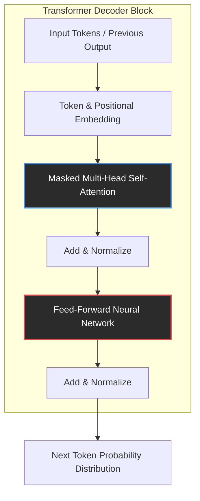
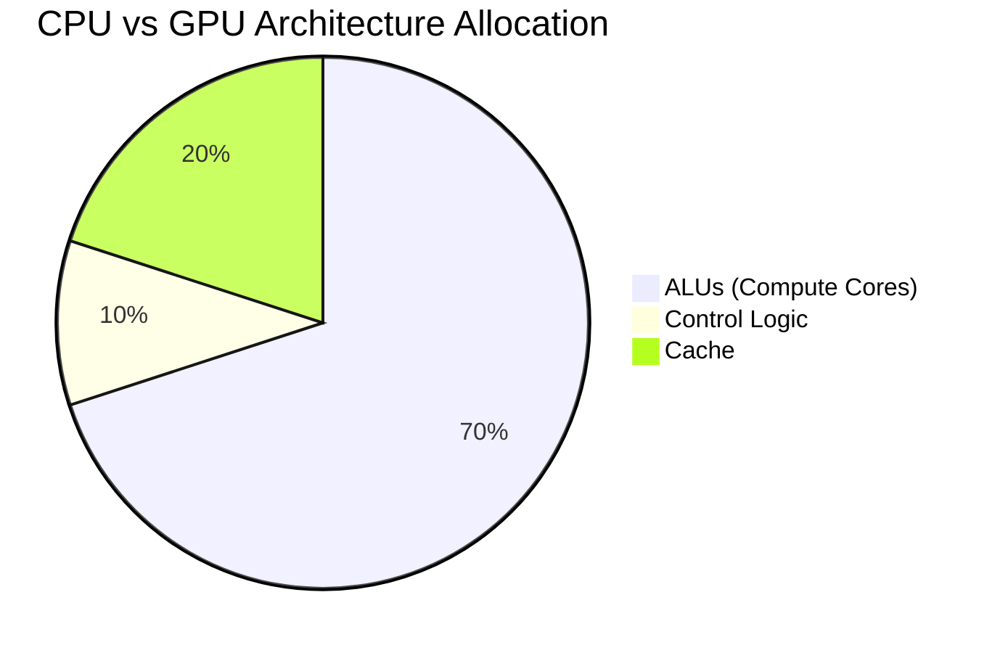
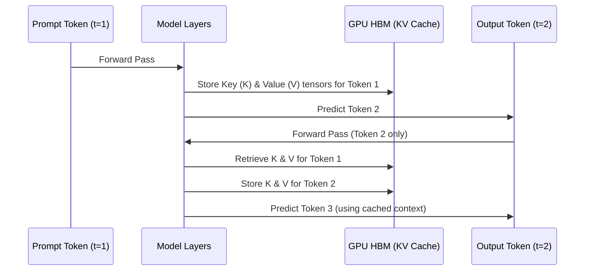

# LLMs for Reasoning

## The Nature and Architecture of Large Language Models

To comprehend how a [[Large Language Models - Architecture and Mechanics|Large Language Model]] (LLM) "reasons," we must first empirically dissect its anatomy. From a scientific standpoint, an LLM is not a reasoning engine in the human, deductive sense; it is a highly sophisticated, multi-dimensional probabilistic automaton. It maps the statistical distribution of human language and reconstructs it. The foundation of this capability is the [[Transformer Models vs Diffusion in Agentic AI, LLMs and SLMs|Transformer]] architecture, which shifted the paradigm of artificial intelligence from sequential processing to parallelized contextual mapping.

### The Transformer: Escaping Sequential Limits

Prior to 2017, natural language processing relied primarily on Recurrent [[1.0 - Neural Networks|Neural Networks]] (RNNs) and Long Short-Term Memory (LSTMs) networks. These architectures processed tokens sequentially, meaning the computation of the $t$-th token depended strictly on the completion of the $t-1$-th token. This created a rigid temporal bottleneck, preventing massive parallelization and limiting the model's ability to retain context over long distances. Information from the beginning of a paragraph would "fade" by the time the network reached the end.

The Transformer architecture eliminated recurrence entirely. Instead, it relies on a mechanism called **Self-Attention**. By processing all tokens in a sequence simultaneously, the Transformer allows the model to map dependencies across vast contexts in a single forward pass.



### Embeddings: The Geometry of Meaning

Before a Transformer can process text, words must be translated into a mathematical format the network can understand. This is achieved through **Embeddings**.

A token (which may be a word, a sub-word, or a single character) is mapped to a dense, high-dimensional vector space—often containing thousands of dimensions. In this geometric space, semantic relationships are represented by spatial proximity. Words with similar meanings (e.g., "king" and "queen") are mapped close to one another.

Because the Transformer processes all tokens simultaneously, it inherently lacks a sense of word order. The phrase "The dog bit the man" would look identical to "The man bit the dog" if not for **Positional Encoding**. The network injects a mathematical signature (often using sine and cosine functions of different frequencies) into the embedding vector to indicate the token's absolute and relative position in the sequence.

### Multi-Head Self-Attention

Once the text is embedded and positionally encoded, it enters the core of the Transformer: the Multi-Head Self-Attention mechanism.

Self-attention allows the model to look at a specific word and determine how much "focus" or "weight" it should give to every other word in the sequence to understand its current context. For example, in the sentence "The bank of the river," the attention mechanism calculates the relationship between "bank" and "river," identifying that "bank" refers to topography rather than a financial institution.

The term "Multi-Head" refers to the model running multiple attention mechanisms in parallel. Each "head" learns to focus on different linguistic or semantic relationships. One head might track subject-verb agreement, another might track pronouns to their antecedents, and a third might track emotional sentiment.

### The Illusion of Cognition

After the attention mechanism contextualizes the tokens, the data is passed through a **Feed-Forward Network (FFN)**. The FFN acts as a massive memory bank, applying non-linear transformations to the contextualized vectors. It is within the parameters of the FFN that the model stores the world knowledge it acquired during training.

Ultimately, what we perceive as "understanding" or "reasoning" is the result of these stacked layers—often dozens or hundreds of them—processing information billions of times over. During its pre-training phase, the model is exposed to a massive dataset (terabytes of text) and tasked with predicting the next token. By continuously adjusting its internal parameters via backpropagation to minimize prediction error, the model inadvertently learns the underlying structures of human language, logic, and reality.

When prompted, the LLM uses this internalized, multi-dimensional statistical map to generate a response, token by token. It does not possess a conscious mind formulating a thought; it possesses a geometric representation of language, finding the mathematically most probable path through its parameter space. To support this massive computational geometry, we must examine the specific hardware reality that makes it possible.

- - -

If reasoning in a language model is fundamentally a multi-dimensional statistical traversal rather than a conscious process, how exactly is such immense computational geometry executed in the physical world? This prompts a necessary investigation into the silicon architectures capable of sustaining these billions of simultaneous calculations.

## Hardware Foundations of LLM Reasoning

The abstract geometry of an LLM is tethered to an incredibly demanding physical reality. The sheer scale of modern LLMs—ranging from 7 billion to over 1 trillion parameters—means that reasoning is not merely an algorithmic challenge; it is a massive hardware orchestration problem. The capacity of an LLM to reason is strictly bounded by the silicon it runs on.

### The Domination of the GPU

Unlike traditional deterministic software, which executes sequential logic efficiently on Central Processing Units (CPUs), LLMs rely entirely on Graphics Processing Units (GPUs) or specialized Tensor Processing Units (TPUs).      

A CPU is designed to execute complex, varied instructions quickly, typically possessing 16 to 64 highly capable cores. A modern data center GPU, such as the NVIDIA H100, possesses tens of thousands of smaller, specialized cores designed specifically to execute floating-point math in massive parallel arrays.


*(In a GPU, the vast majority of die space is dedicated to Arithmetic Logic Units (ALUs) for parallel compute, whereas CPUs dedicate significant space to complex control logic and large caches.)*

When an LLM "reasons," it is performing billions of matrix multiplications. Every token passed through every layer of the Transformer requires calculating attention scores and passing vectors through feed-forward networks. The GPU’s architecture allows these independent calculations to occur simultaneously across thousands of cores.

### The Memory Wall: Bandwidth over Compute

While FLOPs (Floating Point Operations Per Second) are a critical metric, the true physical bottleneck of LLM reasoning is **Memory Bandwidth**.

During inference (the act of generating text), the model’s parameters (its weights) must be loaded from the GPU's High Bandwidth Memory (HBM) into the compute cores for *every single token generated*.

| Hardware Component | Metric | Capacity / Speed | Implication for LLMs |
| :--- | :--- | :--- | :--- |
| **NVIDIA A100 (80GB)** | Memory Capacity | 80 GB HBM2e | Can hold a ~40B parameter model (at 16-bit precision). |
| **NVIDIA A100 (80GB)** | Memory Bandwidth | 2.0 TB/s | The speed at which parameters can be moved to compute cores. |
| **NVIDIA H100 (80GB)** | Memory Bandwidth | 3.3 TB/s | Allows for significantly faster token generation due to reduced memory bottlenecks. |

If a model has 100 billion parameters stored in 16-bit precision, it occupies 200 GB of memory. To generate one token, the GPU must theoretically read 200 GB of data. If the memory bandwidth is 2 TB/s, the absolute physical limit of the system is 10 tokens per second—even if the compute cores are sitting idle waiting for data. This phenomenon is known as the **Memory Wall**.

### The Key-Value (KV) Cache: The Working Memory of Reasoning

As an LLM generates a response, it must maintain the context of the user's prompt and all the tokens it has generated so far. In a naive implementation, the model would have to recalculate the attention scores for the entire sequence from scratch every time it wanted to predict the next word. This is computationally impossible for long contexts.

To resolve this, hardware implementations utilize a **Key-Value (KV) Cache**.



During the attention calculation, the model generates Query (Q), Key (K), and Value (V) matrices. Instead of discarding the Keys and Values after a token is processed, the system stores them in the GPU's HBM. When generating the next token, the model only computes the Query for the *new* token and compares it against the *cached* Keys and Values of all previous tokens.

The KV Cache acts as the LLM's short-term working memory. However, this cache grows linearly with the sequence length. A 100,000-token context window can consume tens of gigabytes of VRAM strictly for the KV cache. When the KV cache exceeds the available memory, reasoning fails, or the system must offload to slower CPU RAM, destroying generation speed.

### Multi-GPU Orchestration

Because the parameters and KV cache of frontier models (like GPT-4 or Gemini 1.5 Pro) vastly exceed the 80-144 GB capacity of a single GPU, reasoning must be distributed across massive clusters. Techniques like **Tensor Parallelism** (splitting a single matrix multiplication across multiple GPUs) and **Pipeline Parallelism** (putting different layers of the model on different GPUs) are employed.

This requires an ultra-high-speed interconnect fabric (like NVLink), allowing GPUs to share memory and compute results with microsecond latency. Thus, advanced reasoning is not just an algorithmic feat; it is the culmination of bleeding-edge materials science, memory architecture, and networking infrastructure.

- - -

Given the sheer scale of the hardware required to prevent the memory wall from halting inference, one must ask: how do these physical constraints shape the actual mechanics of generation? If the GPU array merely computes attention scores, what specific algorithmic structures emerge from this silicon to produce the illusion of logical deduction?

## Mechanisms of Reasoning: Attention and In-Context Learning

Having established the probabilistic nature of the Transformer and the physical hardware that powers it, we must ask: how does a system that merely predicts the next word actually *reason*? The answer lies in the empirical mechanics of the Attention mechanism acting as dynamic circuits, enabling a phenomenon known as In-Context Learning.      

### The Mathematics of Attention

At the heart of the Transformer's reasoning capability is the Scaled Dot-Product Attention function. This mathematical operation allows the model to dynamically route information and compare concepts.

```python
# Pseudo-code representation of Scaled Dot-Product Attention
def attention(query, key, value, d_k):
    # 1. Calculate similarity between queries and keys
    scores = dot_product(query, transpose(key))

    # 2. Scale down to prevent vanishing gradients
    scaled_scores = scores / sqrt(d_k)

    # 3. Apply softmax to get normalized probabilities (attention weights)
    attention_weights = softmax(scaled_scores)

    # 4. Multiply weights by the values to get the final context vector
    output = dot_product(attention_weights, value)

    return output
```

When a user poses a logical puzzle, the **Query** represents the current token the model is analyzing, the **Keys** represent the identities of all other tokens in the context, and the **Values** represent the underlying semantic meaning of those tokens.

If the prompt is: *"The CEO of Microsoft is Jensen Huang. The CEO of Apple is Satya Nadella. Wait, that's wrong. The CEO of Microsoft is..."*

The model's attention mechanism uses the final "is" as the Query. It compares this Query against the Keys of previous tokens. Because of its training, it recognizes the pattern of correction ("Wait, that's wrong"). The attention weights heavily prioritize the semantic Values associated with "CEO of Microsoft" while actively suppressing the hallucinated "Jensen Huang" from the earlier sentence. The Feed-Forward Network then translates this localized, highly weighted context into the statistically correct output: "Satya Nadella."

### In-Context Learning and Induction Heads

The most profound empirical observation regarding LLM reasoning is **In-Context Learning (ICL)**. ICL is the ability of an LLM to learn a new task at inference time—without any changes to its underlying weights—simply by observing examples provided in the prompt.

If you provide an LLM with three examples of an obscure, newly invented logical rule (e.g., "If an object is a Blargh, it is blue. A Glorp is a Blargh. Therefore, a Glorp is blue."), and then ask it to solve a fourth, it will generally succeed.

Researchers (such as those at Anthropic) have identified specific structures within the attention layers responsible for this: **Induction Heads**.

```mermaid
graph LR
    A[Token A] -- occurs before --> B[Token B]
    C[Later occurrence of Token A] -- Induction Head triggers --> D[Predicts Token B]

    style A fill:#333,stroke:#fff
    style B fill:#1e4d2b,stroke:#fff
    style C fill:#333,stroke:#fff
    style D fill:#1e4d2b,stroke:#fff
```



An induction head is a specific attention circuit that searches the context for previous instances of the current token (or a semantically similar token), identifies the token that *followed* it previously, and increases the probability of outputting that following token again.

This mechanism is the root of pattern matching. By recognizing the structural pattern of the user's logic in the prompt, the induction heads dynamically wire the model to follow that exact logical syntax for the completion, effectively "reasoning" by mirroring the logical structure provided in the context.

### The Boundary Between Pattern Matching and Logic

This mechanism explains why LLMs excel at tasks that can be mapped to linguistic structures (like summarizing text, writing code, or solving standard logic puzzles they have seen in training data).

However, it also explains their primary failure mode: **Hallucination and Logical Fragility**. Because the reasoning is fundamentally a statistical approximation driven by attention weights and induction heads, it lacks a ground-truth logical verification engine.

If a user presents a problem where the statistical linguistic pattern directly contradicts the mathematical logic (a "trick question"), the model will often follow the linguistic pattern and arrive at the wrong mathematical conclusion. The model does not know what is "true"; it only knows what is statistically contiguous. To bridge the gap between pattern matching and robust logical deduction, researchers have developed advanced prompting techniques that force the model to externalize its computational process.

- - -

If a model’s reasoning relies heavily on statistical contiguity rather than grounded truth, how can we compel it to engage in robust deduction without succumbing to logical fragility? The answer lies in transforming its own output into a scratchpad, thereby bypassing the constraints of a single forward pass.

## Advanced Reasoning: Chain of Thought and Emergent Logic

The realization that an LLM's reasoning is bounded by the depth of a single forward pass led to a paradigm shift in how we interact with these models. If an LLM cannot hold a complex logical deduction in its internal activations during a single step, the solution is to force it to write out its thoughts, turning its own output into an external memory buffer.

### Chain of Thought (CoT) Prompting

Introduced prominently by researchers at Google (Wei et al., 2022), **Chain of Thought (CoT)** prompting is the practice of instructing the model to articulate intermediate reasoning steps before providing a final answer.

In standard prompting, the model is asked a question and expected to output the answer immediately. For complex math or logic, this requires the model to jump from the problem embedding directly to the solution embedding in one pass.

```mermaid
graph TD
    subgraph Standard Prompting
    A[Complex Problem] -->|Single Forward Pass| B[Final Answer]
    end

    subgraph Chain of Thought Prompting
    C[Complex Problem] --> D[Intermediate Step 1]
    D --> E[Intermediate Step 2]
    E --> F[Intermediate Step 3]
    F --> G[Final Answer]
    end

    style A fill:#4a2b2b,stroke:#fff
    style B fill:#6b2b2b,stroke:#fff
    style C fill:#2b4a2b,stroke:#fff
    style G fill:#2b6b2b,stroke:#fff
```



By adding a simple phrase like *"Let's think step by step,"* the model shifts its probabilistic generation. It begins outputting intermediate logical tokens.

Crucially, **these output tokens are immediately appended to the KV Cache**. The model is now using the context window as a scratchpad. When it generates Step 2, it is attending to both the original problem AND the verified logic of Step 1. This converts a deep, intractable computational problem into a series of shallow, easily solved pattern-matching operations. The reasoning happens *across time* in the context window, rather than *across depth* in the neural network layers.

### Emergence and Model Scale

Empirical studies reveal a fascinating property of Chain of Thought reasoning: it is an **Emergent Ability**.      

Emergent abilities are capabilities that are completely absent in small models but suddenly manifest when a model's parameter count and training compute cross a critical threshold.

| Model Scale | Behavior with CoT Prompting |
| :--- | :--- |
| **< 10 Billion Parameters** | Performance degrades. The model generates nonsensical or grammatically broken intermediate steps, leading to incorrect answers. |
| **10B - 50B Parameters** | Flat performance. CoT neither significantly helps nor harms. |
| **> 100 Billion Parameters** | Performance violently spikes. The model successfully uses intermediate steps to solve problems it fails on via standard prompting. |

This indicates that reasoning is not hard-coded; it is a geometrical property of immense scale. Only at massive scale does the model's internal representation of concepts become dense enough, and its attention heads sophisticated enough, to maintain a coherent logical thread across dozens or hundreds of generated tokens without degrading into statistical noise.

### Advanced Topologies: Tree of Thoughts (ToT)

The frontier of LLM reasoning pushes beyond a single linear chain of thought. If an LLM can simulate a single logical path, it can simulate multiple paths and evaluate them.

**Tree of Thoughts (ToT)** allows the model to explore multiple reasoning branches simultaneously.

1. **Decomposition:** The model breaks the problem into sub-tasks.
2. **Generation:** It generates multiple potential solutions for the first sub-task.
3. **Evaluation (State Evaluation):** It evaluates each potential solution, grading them on likelihood of success (e.g., "Sure/Likely/Impossible").
4. **Search:** Using algorithms like Breadth-First Search (BFS) or Depth-First Search (DFS), it abandons failing branches and expands on the promising ones.

This effectively wraps the LLM in an outer loop of classical search algorithms. The LLM acts as the heuristic generator and evaluator, while the external script manages the tree structure. This transforms the LLM from a fast, instinctive pattern matcher (System 1 thinking) into a deliberate, planning, and self-correcting reasoning engine (System 2 thinking).

### Conclusion

Large Language Models do not possess innate consciousness or a deductive logic module. Their reasoning is an optical illusion created by the interaction of multi-head self-attention, immense scale, and carefully orchestrated prompt engineering. By understanding the hardware limits of the KV cache and the software mechanisms of induction heads and Chain of Thought, we recognize that LLM reasoning is fundamentally the act of a high-dimensional statistical engine navigating a geometrical representation of human logic, externalizing its computation one token at a time.    

- - -
## Related Notes
- [[Large Language Models - Architecture and Mechanics]]
- [[Transformer Models vs Diffusion in Agentic AI, LLMs and SLMs]]
- [[1.0 - Neural Networks]]
