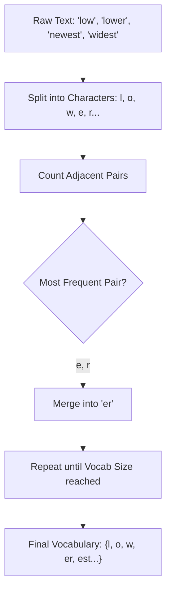
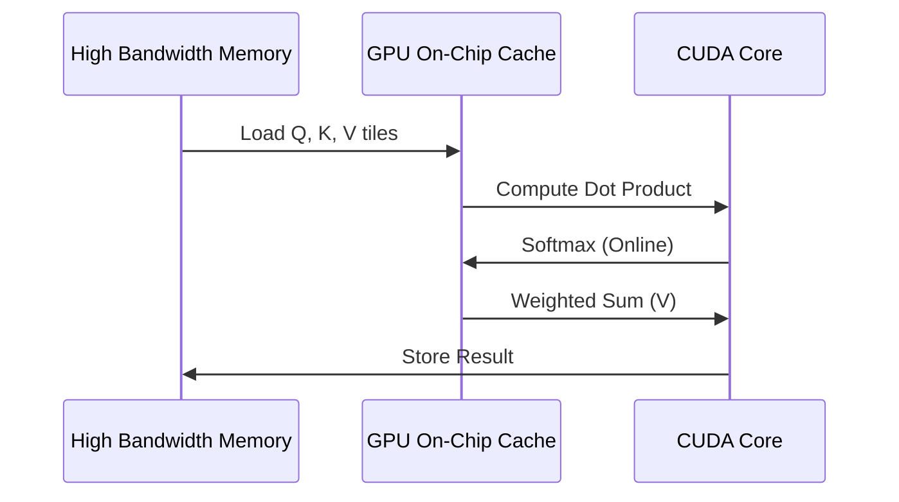
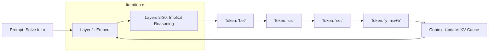
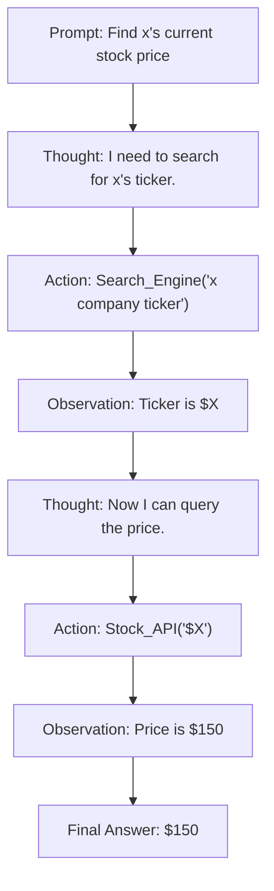
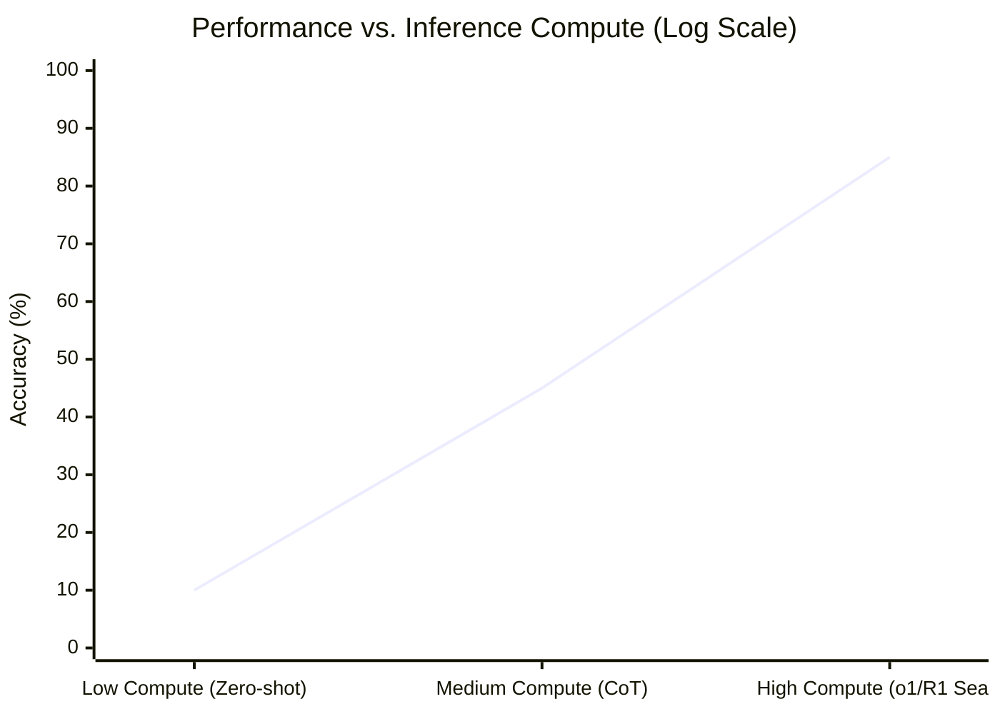
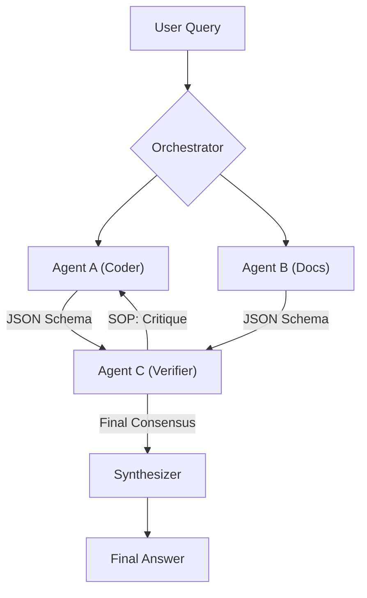

# Large Language Model Reasoning

The cognitive architecture of a Large Language Model (LLM) does not begin with words, but with the discretization of continuous linguistic flow into a finite vocabulary of symbols. This transition—from raw text to numerical vectors—is the most critical bottleneck in the [[Large Language Models - Architecture and Mechanics|transformer architecture]]. If the perception layer fails to capture the structural or semantic nuances of the input, the subsequent attention and feed-forward layers are effectively operating on a corrupted signal. To understand LLM reasoning, one must first formalize the mathematical framework through which these models perceive the world.

## 1.1 The Discrete-Continuous Interface: Formalizing Tokenization

Tokenization is the process of mapping a string of characters $S$ into a sequence of discrete integers $T = \{t_1, t_2, ..., t_n\}$. Modern LLMs almost exclusively use sub-word tokenization algorithms, such as Byte-Pair Encoding (BPE) (Sennrich et al., 2016) or WordPiece (Schuster & Nakajima, 2012), to balance vocabulary size with sequence length.

### The Lossy Nature of Discretization
While often viewed as a simple lookup table, tokenization is a lossy compression mechanism. In BPE, we start with a character-level vocabulary and iteratively merge the most frequent adjacent pairs. The resulting vocabulary $V$ represents a compromise: it must be small enough to fit in memory (typically 32k to 128k tokens) but expressive enough to represent any sequence without excessive fragmentation.

Mathematically, tokenization can be viewed as an optimization problem:
$$ \arg\min_{T} \sum_{i=1}^{n} \text{bits}(t_i) $$
subject to the constraint that $T$ can perfectly reconstruct $S$. However, because the merging is based on frequency rather than semantics, "tokens" often bear little resemblance to morphemes. This leads to the "tokenization gap," where models struggle with tasks requiring character-level precision (e.g., spelling, base-64 decoding, or mathematical carrying) because the model "sees" the number `1234` as a single unit rather than a sequence of digits.      

### BPE Merge Process

## 1.2 High-Dimensional Embedding Spaces and the Manifold Hypothesis

Once tokenized, each token index $t_i$ is mapped to a vector $v_i \in \mathbb{R}^d$, where $d$ is the model dimension (e.g., $d=4096$ for Llama-2-7B). This mapping is performed via an embedding matrix $E \in \mathbb{R}^{|V| \times d}$.

### The Topology of the $d_{model}$ Manifold
The embedding space is not an arbitrary cloud of points. According to the **Manifold Hypothesis**, high-dimensional data (like human language) tends to lie on a lower-dimensional manifold within the ambient $\mathbb{R}^d$ space. The training process essentially "unfolds" this manifold, ensuring that tokens with similar semantic or syntactic roles are positioned close to each other in terms of **Cosine Similarity**:
$$ \text{sim}(u, v) = \frac{u \cdot v}{\|u\| \|v\|} $$

In this hypersphere, direction encodes meaning while magnitude often encodes frequency or "certainty." For instance, common function words like "the" or "of" often cluster near the origin or along specific axes that represent grammatical structurality, while rare, high-information nouns are projected further into the periphery.

### Semantic Arithmetic and Linear Transformations
The "King - Man + Woman = Queen" analogy popularized by Word2Vec remains relevant, though scaled to massive complexity. In modern transformers, the embedding space is not static. Each layer of the model applies a series of linear and non-linear transformations ([[Large Language Models - Architecture and Mechanics#The Attention Mechanism|Attention]] and MLPs) that shift the position of $v_i$ based on its context.

If we denote the output of the $k$-th layer as $H^{(k)}$, the reasoning process can be viewed as the trajectory of a vector through the latent manifold:
$$ H^{(k+1)} = \text{LayerNorm}(H^{(k)} + \text{SelfAttention}(H^{(k)}) + \text{MLP}(H^{(k)})) $$
Each step refines the token’s representation, moving it from a "dictionary definition" (input embedding) to a "contextualized meaning" (final hidden state).

## 1.3 Positional Encoding: From Sinusoids to Rotary Embeddings

Transformers are permutation-invariant by default; they treat a sentence as a "bag of tokens" unless position is explicitly injected. The original Transformer (Vaswani et al., 2017) used absolute sinusoidal encodings:
$$ PE_{(pos, 2i)} = \sin(pos / 10000^{2i/d}) $$
$$ PE_{(pos, 2i+1)} = \cos(pos / 10000^{2i/d}) $$

However, this method fails to generalize to sequence lengths beyond what was seen during training. Enter **Rotary Positional Embeddings (RoPE)** (Su et al., 2021).

### The Math of RoPE
RoPE encodes relative position by rotating the query ($q$) and key ($k$) vectors in the complex plane. Given a vector $x = [x_1, x_2]$, the rotation for position $m$ is:
$$ \text{RoPE}(x, m) = \begin{pmatrix} \cos m\theta & -\sin m\theta \\ \sin m\theta & \cos m\theta \end{pmatrix} \begin{pmatrix} x_1 \\ x_2 \end{pmatrix} $$
The beauty of RoPE lies in the fact that the inner product of two rotated vectors depends only on their relative distance $(m - n)$:
$$ \langle \text{RoPE}(q, m), \text{RoPE}(k, n) \rangle = g(q, k, m-n) $$
This allows the model to maintain a "sense of distance" that is robust across long contexts, facilitating the long-range reasoning required for complex logic.

| Encoding Type | Mechanism | Extrapolation | Computation Cost |
| :--- | :--- | :--- | :--- |
| **Absolute** | Additive vectors | Poor | Low |
| **ALiBi** | Attention bias | Excellent | Low |
| **RoPE** | Multiplicative rotation | Moderate/High | Medium |

## 1.4 Normalization and Numerical Stability: RMSNorm

As the signal passes through dozens of layers, the variance of the hidden states can explode or vanish. Standard LayerNorm centers the distribution (mean=0) and scales it (variance=1). However, modern LLMs (like Llama and Mistral) utilize **Root Mean Square Layer Normalization (RMSNorm)** (Zhang & Sennrich, 2019).

RMSNorm dispenses with the mean-centering, focusing only on the scaling:
$$ \bar{a}_i = \frac{a_i}{\sqrt{\frac{1}{n} \sum_{j=1}^n a_j^2 + \epsilon}} g_i $$
This is computationally more efficient and, crucially, maintains the directional information of the vector (the "angle" in the manifold) while suppressing the noise in magnitude that accumulates during deep inference. For a reasoning engine, preserving these angular relationships is paramount, as they encode the "logical distance" between concepts.

## 1.5 Synthesis: The Vector Space Logic
LLM perception is thus a transition from **Discrete Tokens** $\rightarrow$ **Static Embeddings** $\rightarrow$ **Rotated Contextual Embeddings**. The "logic" of an LLM is essentially a sequence of high-dimensional geometric operations. When we ask a model to "reason," we are asking it to perform a series of vector transformations such that the final vector $h_n$ points toward the most probable next token in the semantic manifold.

The complexity of these transformations determines the "intelligence" of the model. In the next section, we will explore how the [[Large Language Models - Architecture and Mechanics#The Attention Mechanism|Attention mechanism]] acts as the retrieval engine that drives these transformations.

- - -

Having established the vector space logic through which LLMs perceive and embed discrete tokens, the next question is how these models dynamically retrieve and route information within these high-dimensional manifolds to perform complex reasoning.

## Attention as a Logical Retrieval Engine: Multi-Head Mechanics, Contextual Routing, and Information Bottlenecks   

If embeddings represent the "nouns" and "concepts" of the LLM’s internal world, the **Self-Attention mechanism** is the "verb"—the dynamic engine that computes relationships and retrieves relevant information from the past to inform the present. In a reasoning context, Attention is best understood as a **context-dependent database query**.

## 2.1 The QKV Formalism: Logic as Information Retrieval

The core of Attention is the Query ($Q$), Key ($K$), and Value ($V$) interaction. For each token $i$, the model computes:
$$ Q_i = H_i W^Q, \quad K_i = H_i W^K, \quad V_i = H_i W^V $$
The attention score between token $i$ and token $j$ is the dot product of the query and the key, scaled by the square root of the dimension $d_k$:
$$ \text{Attn}(i, j) = \text{Softmax}\left(\frac{Q_i K_j^T}{\sqrt{d_k}}\right) $$
The final representation for token $i$ is the weighted sum of all values $V$:
$$ \text{Output}_i = \sum_j \text{Attn}(i, j) V_j $$

### Logic Gate Analogy
In a reasoning task, the Query represents the "question" (e.g., "What was the value of variable $x$?"), the Key represents the "index" (e.g., "This token defines variable $x$"), and the Value represents the "content" (e.g., "The value is 42"). Through these dot products, the model effectively performs a differentiable lookup, allowing information to "flow" from the past into the current reasoning step.

## 2.2 Induction Heads: The Birth of In-Context Learning

A critical discovery in transformer interpretability (Elhage et al., 2021) is the existence of **Induction Heads**. These are specific attention heads that learn a simple but powerful algorithm: "If I see $A$ followed by $B$, and I see $A$ again, the next token should be $B$."

Induction heads are the primary driver of **In-Context Learning (ICL)**. They allow the model to copy patterns and follow few-shot examples without updating its weights. For a reasoning engine, this is the mechanism that allows it to follow a specific logical template provided in the prompt.

## 2.3 Efficiency and Scalability: MQA, GQA, and the KV Cache

In modern LLMs with massive context windows (128k+ tokens), the cost of storing the $K$ and $V$ matrices for every head becomes the primary bottleneck in inference.

| Variant | Query Heads | Key/Value Heads | Performance/Efficiency Tradeoff |
| :--- | :--- | :--- | :--- |
| **Multi-Head (MHA)** | $N$ | $N$ | High fidelity, high memory overhead |
| **Multi-Query (MQA)** | $N$ | 1 | Low fidelity, extremely fast |
| **Grouped-Query ([[KV Cache and Hardware for Context and Memory#Grouped-Query Attention (GQA)|GQA]])** | $N$ | $G$ | The "Golden Mean" used in Llama-3 |

**Grouped-Query Attention (GQA)** (Ainslie et al., 2023) allows multiple query heads to share a single set of key/value heads. This reduces the **[[KV Cache and Hardware for Context and Memory|KV Cache]]** footprint significantly, allowing for longer "thinking" sequences without running out of VRAM.

## 2.4 Flash Attention: IO-Aware Computational Optimization

Reasoning speed is not just about FLOPs; it is about memory bandwidth. Standard attention has a complexity of $O(n^2)$ and requires reading/writing the large $N \times N$ attention matrix to HBM (High Bandwidth Memory).

**[[KV Cache and Hardware for Context and Memory#Flash Attention|Flash Attention]]** (Dao et al., 2022) re-engineers this by using **Tiling**. It breaks the $Q, K, V$ matrices into blocks that fit into SRAM (the fast, small cache on the GPU). By performing the softmax in chunks and never materializing the full $O(n^2)$ matrix, Flash Attention provides a 2x-4x speedup, enabling the dense "reasoning loops" required for sophisticated chain-of-thought.

## 2.5 Information Bottlenecks and Contextual Routing

In a deep transformer, each layer acts as a filter. In the early layers, attention is "broad," attending to syntactic markers and local context. As we move deeper, attention becomes "sparse" and "sharp," focusing on specific semantic anchors.

This can be analyzed through the lens of the **Information Bottleneck Principle**. The model is trying to compress the entire input history into a fixed-width vector that contains only the information necessary for the next prediction.

**Contextual Routing** occurs when the attention heads in middle layers "route" information from disparate parts of the prompt into a central "reasoning buffer" (often the last few tokens or specific "anchor" tokens). For example, in a math problem, the attention heads will route the values of variables $x$ and $y$ from the problem statement directly into the hidden state of the current step in the calculation.

## 2.6 The Limits of Attention: The "Lost in the Middle" Phenomenon

Despite its power, attention is not perfect. Research (Liu et al., 2023) shows that LLMs are significantly better at retrieving information from the very beginning or the very end of a context window than from the middle. This "U-shaped" performance curve suggests that the competitive bottleneck of softmax tends to favor tokens with high positional saliency or recent activation.

For complex reasoning tasks involving large datasets, this limitation necessitates techniques like **Retrieval-Augmented Generation (RAG)** or **Long-Context Fine-Tuning**, which adjust the positional bias of the attention heads to be more uniform across the sequence.

## 2.7 Summary: Attention as Retrieval
The Attention mechanism is the dynamical system that allows the LLM to "think" by selectively aggregating information. It is not a static calculation but a context-dependent retrieval engine. By understanding how $Q, K, V$ interactions form "circuits," we can begin to see how simple arithmetic operations emerge into the complex behavior we call "reasoning."

In the next section, we will explore how these attention-driven retrieval steps are chained together in **Autoregressive Decoding** to produce coherent sequences of logic.

- - -

While the attention mechanism provides the essential retrieval engine for contextualized processing, true logical deduction requires a temporal scaffolding that extends beyond a single forward pass—a concept formalized through the autoregressive generation of coherent chains of thought.

## Formalizing Chain-of-Thought: Computational Complexity of Autoregressive Decoding and Implicit vs Explicit Reasoning

While attention provides the retrieval mechanism, **Chain-of-Thought (CoT)** reasoning provides the temporal scaffolding required for complex logical deduction. In this section, we formalize the relationship between the autoregressive generation process and the computational work required to solve problems that cannot be "collapsed" into a single forward pass.

## 3.1 The Autoregressive Paradigm: Sequential Probability Estimation

Large Language Models are, fundamentally, probability estimators. The generation of a sequence $Y = \{y_1, y_2, ..., y_n\}$ given a prompt $X$ is governed by the chain rule of probability:
$$ P(Y|X) = \prod_{t=1}^{n} P(y_t | y_{<t}, X) $$

Each $y_t$ is sampled from the output distribution (logits) produced by the final layer of the transformer. This serial nature is both a limitation and a strength. Unlike a human who might "pre-calculate" an entire thought before speaking, the LLM "reifies" its reasoning token by token. Each token generated becomes part of the immutable context $y_{<t}$ for all future tokens, effectively acting as an externalized working memory.

## 3.2 Chain-of-Thought as Extended Working Memory

The seminal work of Wei et al. (2022) demonstrated that for complex tasks (math, symbolic logic, commonsense reasoning), prompting the model to "think step by step" dramatically improves performance.

### Computational Work and Tokenization of Logic
In a standard response, the model must map the input $X$ to a final answer $A$ in a single traversal of its $L$ layers. If the complexity of the transformation $X \rightarrow A$ exceeds the capacity of $L$ layers, the model fails.

CoT breaks this $X \rightarrow A$ transformation into a sequence of intermediate steps $Z_1, Z_2, ..., Z_k$:       
$$ X \rightarrow Z_1 \rightarrow Z_2 \rightarrow ... \rightarrow Z_k \rightarrow A $$
By generating these intermediate tokens, the model effectively **increases its total compute**. Instead of $L$ layers of computation, it now utilizes $k \times L$ layers. Each step $Z_i$ allows the model to "save" an intermediate state in the context window, which can then be "retrieved" by the attention mechanism in the next step.

| Reasoner Type | Compute per Logic Unit | Scalability | State Management |
| :--- | :--- | :--- | :--- |
| **System 1 (Fast)** | Fixed ($L$ layers) | Limited by model depth | Implicit (Hidden states) |
| **System 2 (Slow)** | Dynamic ($k \times L$ layers) | Scalable by token count | Explicit (Context window) |      

## 3.3 Implicit vs Explicit Reasoning

A critical question in AI research is whether models can perform "thinking" without generating tokens. This is the distinction between **Implicit** and **Explicit** reasoning.

### Implicit Reasoning: The Forward Pass as Logic
Inside a single forward pass, a transformer performs a massive amount of parallel computation. Through its multi-head attention and MLP layers, it can simulate logic gates, lookup tables, and even small-scale algorithms. However, this is "bounded" reasoning. The depth of the "logic tree" the model can solve in one pass is strictly limited by the number of layers.

### Explicit Reasoning: The Serial Bottleneck
Explicit reasoning (CoT) bypasses this depth limit by spreading the logic across the time dimension. However, it introduces the **Serial Bottleneck**: because each token depends on the previous one, this process cannot be parallelized.

### The "Pause Token" Hypothesis
Recent research (Goyal et al., 2023) has explored the idea of "Pause Tokens"—tokens that don't represent a word but simply allow the model to perform extra computation (extra forward passes) before producing an answer. This suggests that the mere act of "processing" without "expressing" can enhance the quality of the latent representations, moving more of the reasoning from the explicit context into the implicit hidden states.

## 3.4 The Stochastic Search: Logits, Temperature, and Top-p

Reasoning in LLMs is not a deterministic path but a stochastic traversal of the probability manifold. At each step $t$, the model produces a vector of logits $z_t \in \mathbb{R}^d$. These are transformed into a probability distribution via the **Softmax with Temperature**:
$$ P(y_t = i) = \frac{\exp(z_i / T)}{\sum_j \exp(z_j / T)} $$

- **$T \rightarrow 0$ (Greedy):** The model always picks the most likely token. This is often suboptimal for reasoning as it can get stuck in local minima or repetitive loops.
- **$T > 1$ (High Entropy):** The model explores lower-probability branches of the reasoning tree.

For complex logic, a "Goldilocks" temperature (typically 0.7 to 0.9) is used to allow the model to occasionally "drift" into creative but logically valid paths that a greedy search would miss. This is often combined with **Top-p (Nucleus) Sampling**, which limits the search to the most probable "mass" of tokens, preventing the model from descending into pure gibberish.

## 3.5 Error Accumulation and the "Drift" Problem

The serial nature of CoT introduces the risk of **Sequential Error Accumulation**. If a model makes a minor logical error at step $Z_2$, that error is now "fact" for step $Z_3$. Unlike humans, who can "cross out" a mistake on paper, a standard autoregressive model cannot undo a token once it is in the KV cache (though it can backtrack via prompting or external frameworks).

Mathematically, if the probability of a "correct" reasoning step is $p < 1$, the probability of a correct $k$-step chain is $p^k$. As $k$ increases, the probability of failure grows exponentially. This is why long CoT chains often "hallucinate" halfway through a calculation—the model's "internal state" has drifted too far from the ground truth.

## 3.6 Visualizing the Reasoning Path

## 3.7 Conclusion: Tokens as Compute
The fundamental takeaway is that for an LLM, **tokens are compute**. Chain-of-Thought is the mechanism that allows a fixed-depth model to solve problems of arbitrary depth. However, this relies on a delicate balance of stochastic sampling and serial dependence. In the next section, we will explore how we can wrap this autoregressive process in **Advanced Planning Frameworks** to mitigate the drift problem and enable true "search-based" reasoning.

- - -

This linear autoregressive process, while powerful, remains susceptible to cumulative errors and lacks the ability to backtrack; addressing these limitations necessitates the integration of higher-order planning frameworks that move from simple chains to complex trees of search and reasoning.

## Advanced Planning Frameworks: Tree of Thoughts, MCTS, ReAct, and Cognitive Architectures

The inherent limitations of autoregressive "System 1" generation—specifically the linear nature of Chain-of-Thought (CoT) and the lack of backtracking—have catalyzed the development of higher-order cognitive frameworks. These frameworks wrap the LLM's raw generation capabilities in classical search and planning algorithms, effectively moving toward a "System 2" architecture (Kahneman, 2011).

## 4.1 From Linear Chains to Trees: The Tree of Thoughts (ToT)

A standard CoT response is a single path through a reasoning graph. If a model encounters a logical fork where one path is a dead end, it has no native mechanism to "re-evaluate" its previous choices. **Tree of Thoughts (ToT)** (Yao et al., 2023) generalizes CoT by allowing the model to explore multiple reasoning branches simultaneously.      

### BFS and DFS over Thought Units
In ToT, the reasoning process is decomposed into "thoughts"—discrete segments of logic (e.g., one step of a math proof). At each step, the model generates several potential "next thoughts." A separate **Value Function** (either a smaller LLM or the same model with a "self-evaluation" prompt) then scores these thoughts based on their promise toward a solution.

- **Breadth-First Search (BFS):** Best for tasks with a clear horizontal branching factor, like brainstorming or multi-variable optimization.
- **Depth-First Search (DFS):** Ideal for deep logical derivation where the model needs to probe a single path to completion before backtracking.

This framework explicitly addresses the **Error Accumulation** problem by enabling the system to discard low-value branches and backtrack to a previous "known good" state.

## 4.2 Monte Carlo Tree Search (MCTS) and LLMs

Taking inspiration from AlphaGo, recent architectures have implemented **Monte Carlo Tree Search (MCTS)** over the token or thought space. This is particularly prevalent in models designed for coding (e.g., AlphaCode) and mathematics.

### The Four Stages of MCTS in Reasoning
1. **Selection:** The system traverses the existing tree using the **Upper Confidence Bound (UCB)** formula to balance exploration (new branches) and exploitation (known high-value branches).
2. **Expansion:** The LLM generates new candidate thought steps from a selected node.
3. **Simulation (Rollout):** The model performs a fast "rollout" to predict the final outcome of a branch.
4. **Backpropagation:** The reward from the simulation is used to update the "Value" scores of all parent nodes.   

MCTS provides a mathematically rigorous way to allocate "thinking time." Instead of just generating the most likely token, the system spends compute looking for the *most optimal* token over a large search horizon.

## 4.3 ReAct: Interleaving Reasoning and Acting

Logic alone is often insufficient when solving real-world problems. **ReAct** (Reason + Act) (Yao et al., 2022) is a framework that allows LLMs to interleave reasoning traces with external actions (e.g., API calls, SQL queries, or Web searches).

### The Synergy of Internal Thought and External State
In the ReAct loop, the model generates a "Thought" to analyze the situation, an "Action" to gather new information, and then receives an "Observation" from the environment.

This interleaving anchors the model's reasoning in external ground truth, dramatically reducing hallucinations and allowing the model to correct its internal state based on empirical evidence.

## 4.4 The LLM-as-CPU: Cognitive Architectures

A broader paradigm shift is occurring where the LLM is no longer viewed as the "whole brain," but as the **Central Processing Unit (CPU)** of a larger cognitive system.

### Components of a Neural-Symbolic System
- **LLM (Logic/Routing):** Handles semantic parsing, instruction following, and high-level strategy.
- **Vector Database (Long-Term Memory):** Provides a RAG-based storage layer for facts and historical context.     
- **Scratchpad (Short-Term Memory):** The context window where active variables and CoT steps reside.
- **Toolbox (Peripherals):** Code interpreters, calculators, and specialized models (e.g., a Vision Transformer).  

In this architecture, "reasoning" is the act of the LLM orchestrating these components. For example, if asked to solve a complex calculus problem, the LLM-CPU might decide to:
1. Parse the problem.
2. Retrieve similar solved problems from the Vector DB.
3. Write a Python script to perform the integration.
4. Execute the script in the Code Interpreter and verify the output.

## 4.5 Self-Correction and Verification Loops

A major focus of current engineering is the **Verifier** model. In systems like OpenAI's o1 (and the o1-mini), a separate "Outcome Reward Model" (ORM) or "Process Reward Model" (PRM) is used to verify the correctness of each step in a reasoning chain.

- **Outcome Reward (ORM):** Rewards the model only if the final answer is correct.
- **Process Reward (PRM):** Rewards the model for *every correct step* in the reasoning chain (Lightman et al., 2023).

PRMs have been shown to be significantly more effective for math and logic, as they provide a denser training signal and prevent the model from arriving at a "correct answer for the wrong reasons."

## 4.6 Comparative Analysis of Frameworks

| Framework | Primary Mechanism | Best Use-Case | Latency |
| :--- | :--- | :--- | :--- |
| **CoT** | Linear expansion | Simple logic, explanation | Low |
| **ToT** | BFS/DFS Search | Creative writing, optimization | Medium |
| **MCTS** | Probabilistic Search | Coding, Math, Games | High |
| **ReAct** | Tool-use loops | Info retrieval, Automation | Variable |

## 4.7 Summary: Moving Toward System 2
Advanced planning frameworks transform the LLM from a "probabilistic parrot" into a "strategic reasoner." By decoupling the **generation** of thoughts from the **evaluation** of thoughts, we can build systems that are robust to error and capable of solving multi-step problems with high reliability.

In the next section, we will explore the **Scaling Laws of Inference**, analyzing how increasing the compute budget at test-time (through these planning loops) changes the fundamental paradigm of AI performance.

- - -

As we transition from heuristic search frameworks to more robust cognitive architectures, a fundamental shift is occurring in how we value compute—moving from the heavy lifting of pre-training to the strategic allocation of inference-time search, a paradigm shift characterized by the emergence of scaling laws for reasoning.

## Test-Time Compute and Inference Scaling Laws: The o1/R1 Paradigm Shift and Reinforcement Learning for Logic      

For years, the "Scaling Laws" of AI (Kaplan et al., 2020) suggested that performance was primarily a function of two variables: **Model Size (Parameters)** and **Training Data (Tokens)**. However, the emergence of models like OpenAI's **o1** and DeepSeek's **R1** has introduced a third, transformative pillar: **Inference Compute**. This shift marks the transition from models that "predict the next token" to models that "search for the best logic."

## 5.1 The Inference Scaling Law: Why More Thinking Time Matters

The core thesis of the o1/R1 paradigm is that for complex reasoning, the quality of the answer scales with the amount of compute spent during the inference phase, independent of the model's pre-training budget.

### The Search-Compute Equivalence
In classical search (like Chess or Go), we can trade model "intelligence" for "search depth." A simple evaluation function with deep MCTS can beat a sophisticated evaluation function with shallow search. We are now seeing a similar phenomenon in LLMs. By allowing a model to generate thousands of internal "thought tokens" and evaluate them before producing an answer, a 7B parameter model can sometimes outperform a 70B parameter model that is forced to respond "zero-shot."

Mathematically, we can express the total reasoning capability $C$ as:
$$ C \propto f(P_{train}, D_{train}) + g(C_{inference}, S_{search}) $$
where $P$ is parameters, $D$ is training data, $C_{inference}$ is test-time compute, and $S_{search}$ is the efficiency of the search algorithm.

## 5.2 The o1/R1 Paradigm: RL for Long-Chain Reasoning

Standard RLHF (Reinforcement Learning from Human Feedback) is used to align models with human preferences (e.g., being helpful and polite). However, it is insufficient for training deep reasoning. For logic, we need **Process-Supervised Reinforcement Learning**.

### From RLHF to RLAIF and Beyond
In the o1/R1 paradigm, models are trained via **Reinforcement Learning from AI Feedback (RLAIF)** or through automated verifiers (PRMs). The reward signal is not "Does a human like this?" but "Is this mathematical step correct?" or "Does this code pass the unit tests?"

#### The RL Loop for Logic:
1. **Initial Policy ($\pi$):** A pre-trained LLM.
2. **Sampling:** The model generates multiple reasoning chains for a set of problems.
3. **Verification:** A process-based verifier assigns rewards to each step.
4. **Policy Update:** Using an algorithm like **Proximal Policy Optimization (PPO)** or **Direct Preference Optimization (DPO)**, the model is updated to favor the successful reasoning chains.

Over time, this process "distills" the search behavior into the model's weights. The model learns which types of "thought paths" lead to dead ends and which lead to solutions, effectively internalizing the MCTS search.

## 5.3 Proximal Policy Optimization (PPO) vs. Direct Preference Optimization (DPO)

There is a significant technical debate over the best way to perform this logic-based alignment.

- **PPO:** An "on-policy" algorithm that maintains an actor model and a critic model. The critic estimates the value of a state (a sequence of tokens), and the actor is updated to maximize the expected reward while staying close to the original "safe" model (via a KL-divergence penalty).
- **DPO (Rafailov et al., 2023):** An "off-policy" alternative that simplifies RL by framing it as a classification task between "preferred" and "rejected" reasoning chains. DPO is computationally cheaper and more stable, but it may lack the iterative "self-improvement" capabilities of PPO for extremely complex search.

| Feature | PPO | DPO |
| :--- | :--- | :--- |
| **Complexity** | High (Actor, Critic, Reward, Ref models) | Low (Actor, Ref models) |
| **Stability** | Low (Sensitive to hyperparameters) | High |
| **Memory** | Very High (Multiple copies of model) | Low |
| **Iterative** | Yes (Can improve beyond initial data) | Limited |

## 5.4 The "Bitter Lesson" and Inference Compute

Rich Sutton’s seminal essay, **"The Bitter Lesson,"** argued that in the long run, general methods that leverage computation (search and learning) always beat methods that rely on human-engineered features or specific domain knowledge.

The o1/R1 paradigm is the realization of the "Bitter Lesson" for reasoning. Instead of trying to teach a model specific rules of logic, we give it the compute to search for logic and use RL to reward it when it succeeds. This allows the model to discover "alien" reasoning strategies that a human might never have encoded.

## 5.5 Scaling Laws Visualization: The Performance Frontier

As we move toward "High Compute" inference, the curve shows a distinct nonlinear jump for complex tasks (e.g., IMO-level math). This is because many reasoning tasks have a "threshold" of complexity—if you don't search deep enough, you are guaranteed to fail. Once you cross the threshold, your probability of success jumps dramatically.

## 5.6 The Future: Dynamic Compute Allocation

The ultimate goal of inference scaling is **Dynamic Compute**. Not every question requires a "strawberry-style" deep search. A simple question like "What is 2+2?" should use zero-shot inference (minimal compute), while a question like "Design a novel protein for plastic degradation" should trigger an massive MCTS-driven search (maximal compute).

This leads to the concept of **Adaptive Thinking**:
1. **Gatekeeper:** A small, fast model evaluates the complexity of the query.
2. **Router:** If the query is complex, it is routed to a high-compute inference pipeline.
3. **Execution:** The reasoning engine expands its search tree until a high-confidence solution is found or the compute budget is exhausted.

## 5.7 Summary: Scaling Beyond Training
Test-time compute represents the new frontier of AI development. By moving the "thinking" from the training phase to the inference phase, we enable models to solve problems that were previously thought impossible for their parameter size. This paradigm shift ensures that LLMs are not just knowledge retrieval systems, but active logical engines.

In our final section, we will explore how these individual reasoning agents communicate in **Multi-Agent Systems**, creating a form of **Distributed Cognition**.

- - -

With the advent of models capable of deep individual reasoning through test-time compute scaling, the final layer of complexity lies in how these discrete logical engines can be networked together into multi-agent systems, creating a distributed cognitive architecture that exceeds the capacity of any single node.

## Communication Protocols in Multi-Agent Systems: SOPs, Neuralese, and Distributed Cognition

The final frontier of LLM reasoning is not the individual model, but the collective behavior of **Multi-Agent Systems (MAS)**. In these architectures, intelligence is decentralized, and complex problem-solving emerges from the interaction of specialized agents. This requires the formalization of communication protocols that can bridge the gap between human-readable logic and high-bandwidth machine interaction.

## 6.1 The Collective Intelligence Paradigm

When multiple agents collaborate, they can overcome the individual limitations of context windows and memory. A single agent might "drift" or "hallucinate" during a long reasoning chain, but a swarm of agents with a robust verification protocol can self-correct.

### Agent Specialization and Task Decomposition
In a reasoning-heavy MAS (e.g., AutoGPT, MetaGPT, or CrewAI), a problem is decomposed into sub-tasks:
1. **The Planner:** Architectures the overall reasoning strategy.
2. **The Specialist:** Executes a specific domain task (e.g., Python coding).
3. **The Reviewer:** Critiques the Specialist's output.
4. **The Synthesizer:** Aggregates all sub-outputs into a final response.

This decomposition allows for **Parallel Reasoning**, where different branches of a problem are explored by different agents simultaneously, significantly reducing the total wall-clock time required for deep search.

## 6.2 Natural Language as a Protocol: The SOP Framework

The most common communication protocol in MAS is **Natural Language**. Agents send text-based instructions to one another, often governed by **Standard Operating Procedures (SOPs)**.

### Advantages of Natural Language SOPs
- **Human-in-the-Loop:** Humans can monitor and audit the "thinking" process by reading the inter-agent logs.      
- **Flexibility:** Agents can express nuance and uncertainty that might be lost in rigid structured formats.       
- **Prompt-Based Routing:** Modern models are highly optimized to follow semantic instructions ("If you see an error, send it to the Debugger agent").

However, natural language is **Low-Bandwidth**. A single paragraph of text contains only a few hundred bits of information, while the hidden state of an LLM contains thousands of floating-point values.

## 6.3 Neuralese: Hidden-State Communication

A more advanced (though currently experimental) protocol is **Neuralese**—the idea of models communicating by exchanging their raw hidden-state vectors rather than decoding them into tokens.

### The High-Bandwidth Latent Space
If Agent A can pass its internal $h_n \in \mathbb{R}^d$ vector directly to Agent B, it is conveying the full contextualized meaning of its "thought" without the lossy compression of tokenization.

Mathematically, this can be modeled as a cross-attention mechanism between the internal states of two separate models:
$$ H_{Agent B} = \text{CrossAttention}(H_{Agent B}, H_{Agent A}) $$
where Agent B's queries attend to Agent A's keys/values.

**The "Inter-Model Interpretability" Challenge:**
The primary barrier to Neuralese is that different models (e.g., GPT-4 vs. Claude 3) have different latent space topologies. For "Model A" to understand "Model B's" vectors, they must be trained on a shared "Rosetta Stone" embedding space, or a "Neural-Bridge" network must be used to translate between manifolds.

## 6.4 Structured Protocols: JSON, XML, and Tool-Calling

To improve reliability, many MAS frameworks use structured formats.

| Protocol | Reliability | Human-Readability | Bandwidth |
| :--- | :--- | :--- | :--- |
| **Natural Language** | Low | High | Low |
| **Structured (JSON)** | High | Moderate | Low |
| **Neuralese (Vector)** | Unknown | Low | Very High |

By forcing agents to communicate via JSON schemas, we can programmatically validate their "thoughts." For example, an agent can only proceed to the next step if its output matches a specific schema: `{ "step": 1, "thought": "...", "confidence": 0.9 }`. This prevents the "hallucination cascade" common in unstructured multi-agent dialogue.      

## 6.5 Distributed Cognition: Emergence and Swarm Intelligence

In **Distributed Cognition**, the "reasoning" doesn't reside in any one model but in the **Process**. This is analogous to how a human organization (like NASA or a law firm) can solve problems that no single employee could grasp. 

### The "Debate" Framework
One of the most effective multi-agent reasoning strategies is **AI Debate** (Irving et al., 2018). Two agents are given opposing sides of an argument and must convince a "Judge" agent of their correctness. This adversarial process forces each agent to find the most robust evidence and exposes logical fallacies in the opponent's chain-of-thought.

### The "Consensus" Framework
In contrast, **Consensus-based** systems use voting mechanisms. Multiple agents solve the same problem independently, and their answers are compared. If the majority agrees on a specific step or answer (Self-Consistency), the confidence in that result is significantly higher.

## 6.6 Visualizing Multi-Agent Reasoning

## 6.7 Conclusion: The Architecture of Intelligence

We have moved through the entire stack of LLM reasoning:
1. **Mathematical Foundations:** The manifold where meaning is mapped to vectors.
2. **Attention:** The engine that retrieves and routes information.
3. **Autoregressive Decoding:** The serial process that builds chains of logic.
4. **Planning Frameworks:** The "System 2" wrapper that allows for search and backtracking.
5. **Inference Scaling:** The paradigm of spending more compute to find better answers.
6. **Multi-Agent Systems:** The distributed network that enables collective intelligence.

The "Technical Reasoning" of an LLM is not a single feature; it is an emergent property of these six layers working in concert. As we continue to scale inference compute and refine the protocols of neural communication, the boundary between "predictive text" and "strategic thought" will continue to dissolve, leading to systems capable of scientific discovery and autonomous problem-solving.

---

**References:**
- Ainslie, J., et al. (2023). "GQA: Training Generalized Multi-Query Transformer Models from Multi-Head Checkpoints."
- Dao, T., et al. (2022). "FlashAttention: Fast and Memory-Efficient Exact Attention with IO-Awareness."
- Elhage, N., et al. (2021). "A Mathematical Framework for Transformer Circuits."
- Goyal, K., et al. (2023). "Think Before You Speak: Training Language Models with Pause Tokens."
- Kaplan, J., et al. (2020). "Scaling Laws for Neural Language Models."
- Lightman, H., et al. (2023). "Let's Verify Step by Step."
- Liu, N. F., et al. (2023). "Lost in the Middle: How Language Models Use Long Contexts."
- Sennrich, R., et al. (2016). "Neural Machine Translation of Rare Words with Subword Units."
- Su, J., et al. (2021). "RoFormer: Enhanced Transformer with Rotary Position Embedding."
- Vaswani, A., et al. (2017). "Attention Is All You Need."
- Wei, J., et al. (2022). "Chain-of-Thought Prompting Elicits Reasoning in Large Language Models."
- Yao, S., et al. (2022). "ReAct: Synergizing Reasoning and Acting in Language Models."
- Yao, S., et al. (2023). "Tree of Thoughts: Deliberate Problem Solving with Large Language Models."
- Zhang, B., & Sennrich, R. (2019). "Root Mean Square Layer Normalization."

- - -

## References

### Foundational "System 2" Reasoning
* **Wei, J., et al. (2022).** *Chain-of-Thought Prompting Elicits Reasoning in Large Language Models.* NeurIPS 2022.
* **Kojima, T., et al. (2022).** *Large Language Models are Zero-Shot Reasoners.* arXiv:2205.11916.
* **Wang, Y., et al. (2022).** *Self-Consistency Improves Chain of Thought Reasoning in Language Models.* ICLR 2023.

### Search and Planning Architectures
* **Yao, S., et al. (2023).** *Tree of Thoughts: Deliberate Problem Solving with Large Language Models.* NeurIPS 2023.
* **Hao, S., et al. (2023).** *Reasoning with Language Model is Planning with World Models.* arXiv:2305.14992.

### Scaling and Reinforcement Learning
* **DeepSeek-AI. (2025).** *DeepSeek-R1: Incentivizing Reasoning Capability in LLMs via Reinforcement Learning.* arXiv:2501.12948.
* **Brown, B., et al. (2024).** *Large Language Monkeys: Scaling Inference Compute with Repeated Sampling.* arXiv:2407.21787.

- - -

## Related Notes

- [[Large Language Models - Architecture and Mechanics]] — Foundational details on transformer components and pre-training.
- [[KV Cache and Hardware for Context and Memory]] — Deep dive into the hardware and memory constraints of LLM inference.
- [[Transformer Models vs Diffusion in Agentic AI, LLMs and SLMs]] — Comparison of core architectures in the current AI landscape.
- [[Large Language Model Reasoning (Legacy)]] — Earlier conceptual overview of machine thought mechanisms.
