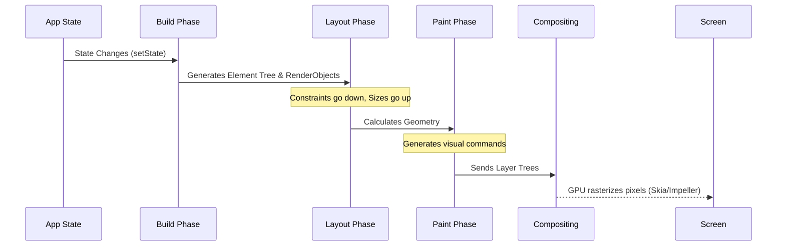

# CS - Flutter and Dart: Architecture and Mechanics

Observation and empirical understanding must precede mastery. When exploring modern application development, **Flutter** and its underlying language, **Dart**, represent a fascinating deviation from traditional UI frameworks. Rather than relying on the host platform's native UI components (like OEM widgets in iOS or Android) or a webview (like Cordova), Flutter paints every pixel to the screen itself using a high-performance graphics engine.

This note dissects the mechanical, historical, and architectural underpinnings of the Flutter toolkit and the Dart programming language.

- - -

## 1. Architectural Overview

To understand Flutter, we must first visualize its strata. It is designed as an extensible, layered system. It exists as a series of independent libraries that depend on the underlying layer.


*(Diagram: The three-tier architecture of Flutter. The Dart framework delegates down to the C++ engine, which interfaces with platform-specific embedders.)*

- - -

## 2. History and Evolution

The evolution of these technologies demonstrates a clear path toward UI-first computing.

| Year | Event / Milestone | Significance |
| :--- | :--- | :--- |
| **2011** | Dart Unveiled by Google | Initially positioned as a "JavaScript killer" for the web, focusing on structured web apps. |
| **2015** | "Sky" Experiment | The earliest prototype of Flutter. It demonstrated a UI engine rendering at 120 FPS. |
| **2017** | Flutter Alpha Release | Shifted focus strictly to mobile (iOS and Android) cross-platform development. |
| **2018** | Flutter 1.0 & Dart 2.0 | Dart 2.0 introduced strong static typing. Flutter hit stable, gaining rapid adoption. |
| **2021** | Flutter 2.0 | Added stable support for Web and Desktop. The paradigm shifted to "ambient computing." |
| **2023+** | Impeller Graphics Engine | Replacement of Skia on iOS (and later Android) to eliminate compilation jank and optimize 3D/modern graphics. |

- - -

## 3. Dart: The Mechanical Core

Why did Google choose Dart over JavaScript, TypeScript, or Kotlin for Flutter? The answer lies in its dual-compilation capability and UI-optimized memory allocation.

### The AOT and JIT Duality
Dart is unique because it perfectly serves two distinct phases of the software development lifecycle:
1. **Just-In-Time (JIT) Compilation (Development):** During development, Dart runs in a VM with JIT compilation. This enables **Stateful Hot Reload**—developers can inject updated source code into the running Dart Virtual Machine (Isolate) without losing the application state.
2. **Ahead-Of-Time (AOT) Compilation (Production):** For release builds, Dart compiles down to native ARM or x86 machine code. This eliminates the need for a JavaScript bridge (like React Native) and ensures near-native performance.

### UI-Optimized Garbage Collection
Dart allocates objects in continuous blocks of memory. Because UI rendering involves creating and destroying thousands of short-lived objects (widgets) every frame (16ms for 60fps), Dart uses a **Generational Garbage Collector**. Young generation collection is extremely fast and lock-free, preventing frame drops.

### Code Mechanics: Dart Syntax
```dart
// A simple Dart program demonstrating async operations and object-oriented structure
class OrbitCalculator {
  final double gravitationalConstant = 6.67430e-11;

  // Asynchronous computation simulating complex physics
  Future<double> calculateEscapeVelocity(double mass, double radius) async {
    // Await artificial delay
    await Future.delayed(Duration(milliseconds: 500));
    return (2 * gravitationalConstant * mass) / radius;
  }
}

void main() async {
  var calculator = OrbitCalculator();
  print('Calculating...');
  
  try {
    // Earth's mass (kg) and radius (m)
    double velocitySq = await calculator.calculateEscapeVelocity(5.972e24, 6371000);
    print('Escape Velocity Squared: $velocitySq');
  } catch (e) {
    print('Error in computation: $e');
  }
}
```

- - -

## 4. Flutter: The UI Toolkit

In Flutter, **Everything is a Widget**. A Widget is an immutable description of part of a user interface. 

### The Render Pipeline
Unlike web browsers that use the DOM, or native apps that use XML/Storyboards, Flutter controls the entire rendering pipeline.



1. **Build:** The framework creates a tree of widgets based on state.
2. **Layout:** The framework walks the render tree. **Constraints go down, sizes go up, and the parent sets the position.** This simple rule guarantees single-pass layout algorithms (O(N)), avoiding the reflow nightmares common in CSS.
3. **Paint:** Render objects are translated into visual commands.
4. **Composite:** Layers are sent to the GPU to be drawn onto the physical screen.

- - -

## 5. Unique Attributes & Differentiators

| Feature | Description | Mechanical Advantage |
| :--- | :--- | :--- |
| **No OEM Widgets** | Flutter draws its own UI components rather than wrapping native iOS/Android buttons. | Guarantees absolute consistency across devices. A button looks identical on Android 10 and iOS 17. |
| **Impeller Engine** | A custom rendering engine that precompiles shaders. | Eliminates the "early jank" present in older Skia-based rendering when compiling complex animations. |
| **Isolates** | Dart's approach to concurrency. Memory is isolated; there is no shared state between threads. | Eliminates data races and the need for Mutex locks, forcing clean message-passing architectures. |
| **Single Codebase** | Write once, compile to iOS, Android, Web, Windows, macOS, and Linux. | Vastly reduces time-to-market and unifies engineering teams. |

- - -

## 6. Applications: Where and Why

**Where to use Flutter:**
- Applications requiring highly custom, branded, and animated user interfaces.
- Startups needing to validate on iOS and Android simultaneously with limited resources.
- Applications where UI consistency across platforms is paramount.

**Where to reconsider:**
- **Tiny Web Apps:** The Flutter Web payload (shipping the engine via WebAssembly/CanvasKit) can be heavy for simple static content (like a blog). See [[WEB - Evolution of Web Development]].
- **Deeply Native Intensive Apps:** Apps that are essentially wrappers around highly specific native SDKs (like advanced ARKit/ARCore apps) might require too much Platform Channel code, negating the benefit of cross-platform.
- **Dynamic UIs via Server:** If the UI structure must be entirely downloaded from a server (Server-Driven UI), native or React Native often have more mature ecosystems for pushing executable JS.

- - -

## Related Notes
- [[CS - Software Development Techniques]]
- [[WEB - JavaScript Frameworks]]
- [[WEB - Evolution of Web Development]]
