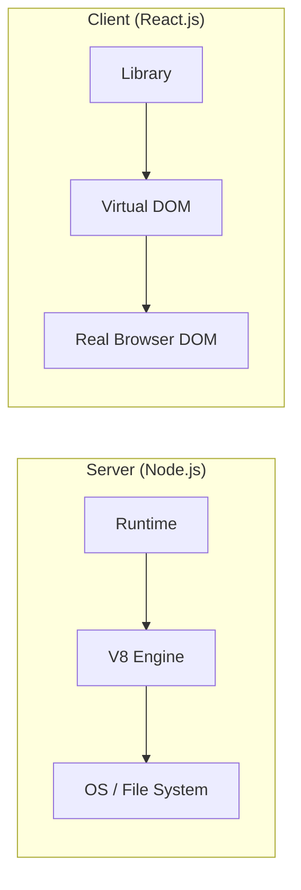

# WEB - Comparison of Node.js, React.js, and Next.js: The Full-Stack Ecosystem

The modern JavaScript ecosystem is defined by three interconnected yet distinct technologies: **Node.js**, **React.js**, and **Next.js**. These tools do not exist in isolation; they are parts of a symbiotic architecture that spans the server, the browser, and the "Edge." This note explores their individual logic, their historical inception, and the synergy that powers the world's most performant web applications.

- - -

## Act I: The Crucible (2009–2013) - The Runtime and the Library

The "Crucible" was a period where the server and client were clearly delineated. Node and React each solved a specific, localized problem.

### 1. Node.js (2009): The Server-Side Paradigm Shift
In 2009, **Ryan Dahl** introduced **Node.js** at JSConf EU. He wanted to solve the "I/O Problem" in existing server-side languages like Ruby and Python, where each connection required a new thread, consuming massive resources.

#### Theoretical Foundation: Non-blocking I/O and V8
Node.js isn't a language; it's a **runtime**. It took Chrome's **V8 Engine** (written by **Lars Bak** at Google) and exposed it to the operating system.
- **Event Loop**: A single-threaded architecture that handles concurrency without the overhead of threads.
- **Libuv**: The underlying library that manages asynchronous I/O operations (file systems, network calls).

### 2. React.js (2013): The Browser-Side Declarative Library
**Jordan Walke** at Facebook released **React** as an open-source library in 2013. Its primary goal was to handle the "UI-Sync" problem (keeping the DOM updated when data changed) using a **declarative** model.

#### Theoretical Foundation: The One-Way Data Flow
React established that the **UI is a function of state**: `UI = f(State)`. By ensuring data only flows in one direction, React made complex interfaces predictable and testable.



- - -

## Act II: The Zenith (2016–2022) - The Meta-Framework Synthesis

The "Zenith" represents the rise of **Next.js**, which bridged the gap between Node and React to solve the "SEO and Performance" problem.

### 1. Next.js (2016): The Orchestrator
**Guillermo Rauch** and the team at **Zeit** (now **Vercel**) created **Next.js**. They realized that while React was great for interactivity, "Pure" SPAs suffered from slow initial loads and poor SEO because the browser had to download a massive JS bundle before rendering anything.

#### Theoretical Foundation: Server-Side Rendering (SSR)
Next.js leverages Node.js to pre-render React components into HTML on the server. When the browser receives the HTML, it's already "complete." React then "hydrates" the HTML, making it interactive.

### 2. Comparison of the Core Stack
| Feature | Node.js | React.js | Next.js |
|---------|---------|----------|---------|
| **Role** | Runtime Environment | UI Library | Full-Stack Framework |
| **Primary Platform** | Server (V8) | Browser (DOM) | Hybrid (Node + Browser) |
| **SEO Impact** | N/A (Data only) | Poor (Client-side) | Excellent (Server-side) |
| **Rendering** | No View Layer | Client-side Rendering | SSR, SSG, ISR, Client |
| **Routing** | Manual (Express/Koa) | React Router (External) | Built-in (File-system) |
| **Key Inception** | Ryan Dahl (2009) | Jordan Walke (2013) | Guillermo Rauch (2016) |

- - -

## Act III: The Legacy (2023–Future) - The Converged Web

The "Legacy" is a new paradigm where the server and client are no longer separate entities but a single, unified execution graph.

### 1. React Server Components (RSC): The Ultimate Synergy
The introduction of the **App Router** in Next.js (based on React v18+) represents the "Final Synthesis." 

#### Theoretical Innovation: Zero-Bundle-Size Components
RSCs allow developers to write components that **only** run on the server (in the Node context). These components can access databases directly and **zero** JavaScript is sent to the client for them.

```typescript
// A Next.js 14+ Server Component
import { db } from '@/lib/database';

export default async function ProfilePage() {
  // Logic runs on Node.js at request time (or build time)
  const user = await db.user.findUnique({ where: { id: 1 } });

  return (
    <section>
      <h1>{user.name}</h1>
      {/* Interactive Client Component hydrated with user data */}
      <FollowButton userId={user.id} /> 
    </section>
  );
}
```

### 2. The Deno and Bun Revolution
The legacy of Node.js is being challenged by its own creator. **Ryan Dahl** created **Deno** to fix "mistakes" in Node's design (security, package management). Simultaneously, **Jarred Sumner**'s **Bun** runtime is pushing the performance of the Node ecosystem to its absolute limit using **Zig** and **JavaScriptCore**.

### 3. Conclusion: The Unified Execution Graph
The "Legacy" of these three technologies is the end of the "Frontend/Backend" divide. We are moving toward a world of **Unified Runtimes**, where the same code can run on the server, the edge, or the browser, optimized automatically by the framework (Next.js) and the runtime (Node/Bun).

- - -

## Related Notes
- [[WEB - Evolution of Web Development]]
- [[WEB - JavaScript Frameworks]]
- [[CS - Software Design Techniques]]
