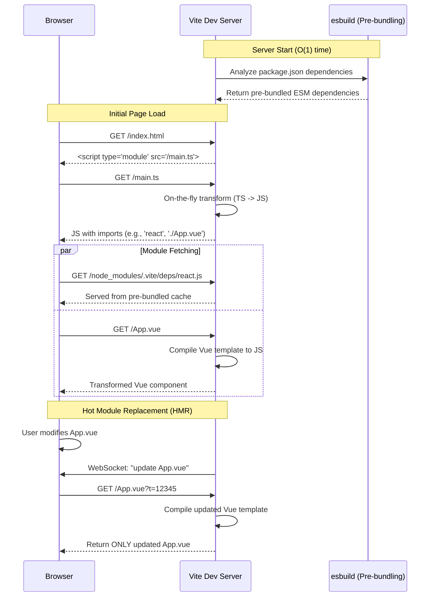

# CS - Vite and Tauri

The landscape of modern web and desktop application development has undergone a radical transformation in recent years. For a long time, the industry standard relied heavily on Webpack for frontend bundling and Electron for cross-platform desktop deployment. However, as applications grew in complexity, the scaling limitations of these tools became painfully apparent. In response, a new generation of tooling has emerged, spearheaded by Vite and Tauri. This document provides a profound, mechanical, and theoretical deep dive into these technologies, exploring how they dismantle the old paradigms, the exact architectural mechanisms that make them hyper-efficient, and why their combination represents the future of desktop-grade web applications.

## 1. Introduction & The Shift in Modern Tooling

To understand the sheer magnitude of the shift that Vite and Tauri represent, we must first analyze the conditions that made their predecessors both ubiquitous and ultimately inadequate. In the 2010s, the JavaScript ecosystem was chaotic. We did not have a universal module system native to the browser. Instead, developers relied on a fractured ecosystem of CommonJS, AMD, and UMD. To make these modules run in a browser, we needed bundlers. 

Webpack became the undisputed king of this era. The Webpack paradigm dictates that before a development server can serve your application, it must crawl your entire project, resolve every single dependency, transpile it, and stitch it all together into one or more bundled files. This approach was revolutionary because it allowed developers to use modern JavaScript (ES6+), TypeScript, and CSS preprocessors, knowing that Webpack would output universally compatible static assets.

However, Webpack's fatal flaw is its scaling characteristic. The time it takes to build the dependency graph and bundle the application scales linearly—or worse—with the total number of modules. In enterprise applications with thousands of modules, spinning up the Webpack development server could take minutes. Furthermore, every time a developer saved a file, Webpack had to reconstruct large portions of the bundle, leading to agonizingly slow Hot Module Replacement (HMR). The feedback loop, which is the lifeblood of developer productivity, was broken.

Simultaneously, on the desktop front, Electron emerged as the standard for bringing web applications to the desktop (e.g., Slack, Discord, VS Code). Electron's philosophy is conceptually simple: bundle a complete Chromium rendering engine and a Node.js runtime with your web application. This guaranteed that your application would look and behave exactly the same across Windows, macOS, and Linux, because it was running in the exact same Chromium instance.

But this convenience came at an exorbitant cost. A simple "Hello World" Electron application weighs in at over 100 megabytes because it carries an entire web browser within its binary. Electron applications are notorious for memory gluttony, as each application spins up multiple Chromium processes (a main process and several renderer processes). Running three or four Electron applications simultaneously can easily consume gigabytes of RAM. The start-up time is sluggish, and the OS-level integration always feels slightly uncanny and non-native.

The turning point occurred when two critical technological milestones were reached. First, "evergreen" browsers—modern browsers that update themselves automatically—achieved near-universal support for Native ES Modules (ESM). Second, operating systems began providing highly capable, natively embedded webviews (Edge WebView2 on Windows, WebKit on macOS, and WebKitGTK on Linux). These two shifts rendered the heavy-handed approaches of Webpack and Electron obsolete. Vite was born to exploit Native ESM, and Tauri was born to exploit OS-native webviews.

## 2. The Mechanics of Vite: The Unbundled Era

Vite (French for "fast") completely flips the Webpack bundling paradigm on its head by fundamentally changing the relationship between the development server and the source code. Instead of bundling the entire application before serving it, Vite serves the application in an "unbundled" state, leveraging the browser's native ability to understand ES Modules via `<script type="module">`.

When you run a Vite development server, the start-up time is typically less than 300 milliseconds, regardless of whether your application has ten files or ten thousand. This O(1) start-up time is achieved through a strict categorization of your code into two distinct groups: **Dependencies** and **Source Code**.

### Deep Dive: Dependencies and Pre-bundling with `esbuild`
Dependencies are the libraries you install from npm (like React, Vue, or lodash). These rarely change during your development session. However, dependencies often consist of hundreds of tiny files and might be shipped in CommonJS format, which native ESM cannot understand.

Vite solves this by employing `esbuild`, a bundler written in Go. Before the server starts, `esbuild` pre-bundles all your dependencies into single, highly optimized ES modules. Why Go? Go is a compiled, statically typed language designed for immense parallelization. Unlike JavaScript-based bundlers (like Webpack or Parcel) that suffer from JIT compilation overhead and single-threaded bottlenecks, `esbuild` shares Abstract Syntax Trees (ASTs) across threads and manages memory with extreme efficiency. It processes dependencies 10x to 100x faster than JS-based alternatives. If you import `lodash-es` (which consists of 600+ internal modules), `esbuild` crushes it into a single module. This prevents the browser from making 600 concurrent HTTP requests, which would overwhelm the browser's network stack.

### Deep Dive: Source Code and HMR over Native ESM
Source Code is the actual application logic you are writing and editing. It changes constantly. Vite serves this code directly as native ES modules. When the browser encounters an `import` statement in your HTML, it makes an HTTP request back to the Vite dev server for that specific file. Vite dynamically transforms the file on the fly (e.g., stripping TypeScript types or compiling Vue/Svelte templates) and sends it to the browser. 

The true magic of Vite lies in its Hot Module Replacement (HMR). In a traditional bundler, modifying a file requires the bundler to rebuild the module and everything that depends on it. In Vite, when you save a file, Vite simply invalidates the cache for that specific module. It sends a tiny message via a WebSocket to the browser, telling it to re-fetch *only* that exact module. The browser requests the single file, Vite transforms it instantly, and the UI updates in milliseconds. The HMR update speed is completely decoupled from the total size of the application.

### Production Builds with Rollup
While unbundled development is a miracle for the developer experience, shipping an unbundled application to production is disastrous. The latency of establishing hundreds of HTTP connections for individual small files would cripple load times. Therefore, Vite must bundle for production.

Interestingly, Vite does not use `esbuild` for its production build; it uses Rollup. While `esbuild` is incredibly fast, it lacks the mature, deeply customizable API necessary for advanced production optimizations. Rollup excels at sophisticated chunking, highly efficient tree-shaking (eliminating dead code), and CSS extraction. Vite abstracts Rollup's complex configuration, providing sane defaults that yield highly optimized static assets ready for deployment.

### Vite Dev Server Request Waterfall



## 3. The Architecture of Tauri: Rust and The OS Webview

If Vite is the remedy to the heavy, monolithic bundler, Tauri is the remedy to the heavy, monolithic desktop framework. Tauri's mission is to build smaller, faster, and more secure desktop applications by ruthlessly cutting out the fat—specifically, by eliminating the embedded Chromium browser that defines Electron.

### The Death of Chromium-Bundling
Every modern operating system already comes with a sophisticated, highly optimized web rendering engine. Windows 10/11 includes Edge WebView2 (based on Chromium), macOS relies on WebKit (the engine behind Safari), and Linux systems utilize WebKitGTK. Tauri asks a fundamental question: instead of forcing the user to download an entire browser inside your app, why not just use the browser that is already deeply integrated into the user's OS?

By abandoning Chromium, Tauri apps experience a dramatic reduction in binary size. While an Electron app starts at ~100MB, a Tauri application can easily be shipped in a 3MB to 5MB executable. Memory consumption drops proportionally because the OS shares the memory footprint of the webview with other system processes, avoiding the overhead of running an entirely separate browser sandbox.

### Deep Dive: WRY - The Webview Rendering Library
To achieve this cross-platform magic without forcing the developer to write OS-specific integration code, Tauri relies on a foundational Rust crate called `WRY`. WRY acts as the unified abstraction layer over the disparate OS webviews.

When a Tauri application launches, the Rust backend invokes WRY. On Windows, WRY communicates with the Microsoft Edge WebView2 runtime via COM interfaces. On macOS, it bridges into Objective-C to instantiate a `WKWebView`. On Linux, it uses C bindings to interface with `webkit2gtk`. WRY handles all the idiosyncratic lifecycle management, ensuring that regardless of the underlying engine, the frontend web application is rendered correctly and given a consistent environment to execute.

### Deep Dive: TAO - Cross-Platform Window Creation
Rendering a webview is only half the battle; you still need a window to put it in. For this, Tauri utilizes `TAO`, another Rust crate specifically designed for application window creation and event loop management. TAO is a fork of the popular `winit` crate, but it has been heavily customized to support desktop app features that `winit` historically ignored, such as system tray icons, global menu bars, multi-monitor DPI awareness, transparent window backgrounds, and customized window decorations (frameless windows).

The combination of Rust Core, TAO, and WRY forms a lightweight, robust shell that wraps the frontend code, executing at native machine speeds.

### Tauri Architectural Diagram


## 4. Inter-Process Communication (IPC): The Bridge

Because the frontend (JS/TS) runs inside the isolated OS webview and the backend runs as a native Rust process, they cannot directly share memory. They require an Inter-Process Communication (IPC) mechanism. This is the nervous system of a Tauri application, allowing the beautiful frontend to trigger deep system-level operations.

### Asynchronous Message Passing
Unlike Electron, which historically allowed synchronous Node.js integration directly within the frontend (a notorious security risk and performance bottleneck), Tauri strictly enforces an asynchronous message-passing model. The frontend serializes its request into a JSON string and sends it across the boundary using a custom protocol scheme (e.g., `tauri://` or `ipc://`).

Under the hood, the webview utilizes native bindings (like `window.postMessage` or injected script handlers via WRY) to pass this serialized payload to the Rust backend. Rust deserializes the JSON using `serde`, executes the requested command asynchronously (often using `tokio` for async execution), and serializes the result back to the frontend. This ensures the UI thread is never blocked by a heavy backend operation, such as reading a massive file or performing complex cryptography.

### Strict Scoping and Security Implications
Security is arguably Tauri's greatest triumph over Electron. In Electron, developers frequently enabled `nodeIntegration`, granting the web view unrestricted access to the user's file system and shell. If the frontend suffered a Cross-Site Scripting (XSS) vulnerability, an attacker could trivially execute `require('child_process').exec('rm -rf /')`.

Tauri is designed with a "secure-by-default" philosophy. It completely denies the webview access to native OS APIs. Instead, developers must explicitly whitelist specific capabilities in the `tauri.conf.json` file. Even if you allow the frontend to read files, you must define strictly scoped rules—for instance, allowing access *only* to the user's `$APPDATA` directory. If an attacker breaches the frontend, their access is mathematically confined to the granular permissions explicitly declared in the Rust core.

### Code Examples

**1. The Rust Command (Backend)**
In Rust, you define functions and decorate them with the `#[tauri::command]` macro. This macro automatically handles the complex IPC serialization boilerplate.

```rust
// src-tauri/src/main.rs
#![cfg_attr(
    all(not(debug_assertions), target_os = "windows"),
    windows_subsystem = "windows"
)]

use tauri::command;

// A simple command that takes a string and returns a formatted response
#[command]
async fn perform_heavy_computation(input: String) -> Result<String, String> {
    // Imagine some complex Rust logic here
    if input.is_empty() {
        return Err("Input cannot be empty".into());
    }
    let result = format!("Rust has processed: {}", input);
    Ok(result)
}

fn main() {
    tauri::Builder::default()
        // Register the command so the frontend can invoke it
        .invoke_handler(tauri::generate_handler![perform_heavy_computation])
        .run(tauri::generate_context!())
        .expect("error while running tauri application");
}
```

**2. The Frontend Invoke (JS/TS)**
On the frontend, you import the `invoke` function from the Tauri API package and call the Rust command by its string name, passing arguments as a JSON object.

```typescript
// src/App.ts
import { invoke } from '@tauri-apps/api/core';

async function handleData() {
    try {
        // Calls the Rust function 'perform_heavy_computation'
        const response = await invoke<string>('perform_heavy_computation', { 
            input: 'Process this matrix' 
        });
        console.log("Success:", response);
    } catch (error) {
        // Rust errors (Err variant) are caught here
        console.error("Backend failed:", error);
    }
}
```

## 5. Synergy: Why Vite and Tauri Belong Together

Vite and Tauri are distinct tools, but they share a fundamental philosophy: pushing complex, heavy computational workloads to system-level, compiled languages (Go and Rust) while keeping the developer API declarative and ergonomic. When combined, they create an unprecedented developer experience and highly optimized end-products.

The synergy begins in the development environment. The Tauri CLI seamlessly wraps the Vite development server. When you run `tauri dev`, Tauri first boots up the Vite server to handle the frontend on a local port (e.g., `localhost:5173`). Simultaneously, it compiles the Rust backend and launches the native window, pointing the webview directly at Vite's local port. 

This creates a dual-layered hot-reload environment. If you alter a React component or a CSS file, Vite's HMR kicks in, and the UI updates in milliseconds without the native window ever closing or losing its Rust state. If you modify the Rust `main.rs`, the Tauri CLI detects the change, incrementally recompiles the Rust binary using `cargo`, and reboots the native window. The feedback loop is airtight.

Furthermore, this stack aligns perfectly with modern CI/CD practices and performance expectations. The resulting artifact is a hybrid marvel: a sleek, instant-loading frontend (optimized by Rollup/Vite) tightly coupled with a bare-metal executable (compiled by Rust). You achieve the UI fluidity of the web with the raw computational horsepower and low memory profile of a systems language. The era of compromising performance for cross-platform compatibility is over.

## 6. Applications & Limitations

While the Vite/Tauri stack is revolutionary, it is critical to understand its exact application domain and its inherent architectural limitations. Engineering is about trade-offs, and choosing Tauri over Electron involves accepting specific compromises.

### Where This Stack Excels
This stack is absolute perfection for a wide array of applications:
- **System Utilities & Menu Bar Apps:** Applications that run constantly in the background (like clipboard managers or VPN clients) benefit massively from Tauri's negligible RAM footprint.
- **Dashboards and Data Visualization:** Utilizing web technologies (D3.js, WebGL, Canvas) via Vite allows for stunning UIs, while Rust handles the heavy lifting of parsing gigabytes of local telemetry or CSV data, entirely bypassing V8 engine limitations.
- **Resource-Constrained Environments:** When targeting embedded systems, older hardware, or IoT devices, Electron's Chromium overhead is unviable. Tauri's lean footprint makes web-based UIs possible in these environments.
- **Security-Critical Software:** Crypto wallets, password managers, and secure communication tools benefit deeply from Rust's memory safety and Tauri's draconian IPC capability scoping.

### Limitations and The Chromium Trade-off
The primary limitation of Tauri stems directly from its greatest strength: relying on OS-native webviews. Electron developers enjoy the luxury of knowing that their application runs in exactly the same version of V8 and Blink regardless of the operating system. If a CSS grid layout works on the developer's Mac, it will work identically on a user's Windows machine.

Tauri shatters this guarantee. When you deploy a Tauri application, your frontend UI is at the mercy of three different rendering engines:
1. **macOS/iOS:** WebKit (Safari engine).
2. **Windows:** Edge WebView2 (Blink/Chromium engine).
3. **Linux:** WebKitGTK (WebKit engine).

This introduces the dreaded "browser compatibility" issue back into desktop development. A cutting-edge CSS property or a newly drafted Web API might be fully supported by WebView2 on Windows but utterly broken in an older version of WebKit on macOS. You cannot ship a specific browser version with your app; you must rely on the OS being relatively up-to-date. This necessitates rigorous cross-platform testing. You must verify UI consistency and API availability on Mac, Windows, and Linux simultaneously.

Furthermore, cross-compilation is notoriously difficult. While Rust's `cargo` handles cross-compiling logic beautifully, the underlying C dependencies (like WebKitGTK on Linux) make it exceptionally painful to compile a Linux binary from a Windows machine or a Mac binary from Linux. To deploy a Tauri application properly, you are essentially forced to use a cloud-based CI/CD pipeline (like GitHub Actions) to spin up native macOS, Windows, and Linux runners to build their respective binaries.

Despite these hurdles, the trade-off is overwhelmingly positive. For the vast majority of applications, the minimal aesthetic inconsistencies across OS webviews are a negligible price to pay for the massive gains in performance, memory efficiency, and binary size. The Vite and Tauri stack is not just an alternative to Webpack and Electron; it is their evolutionary successor.
