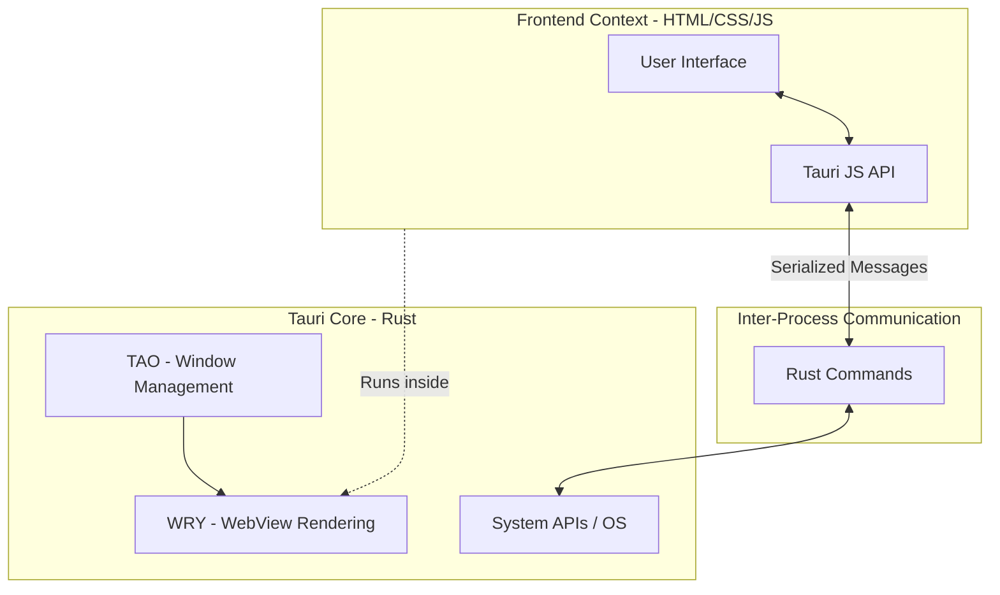
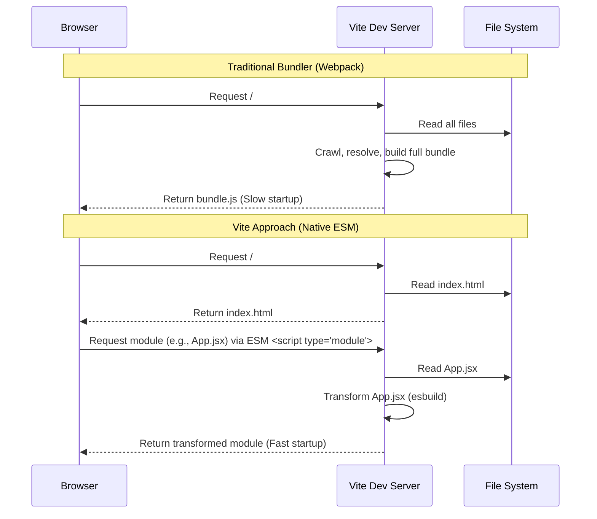

## 1. Introduction: The Modern Web-to-Desktop Paradigm

The intersection of modern web development and desktop application design has birthed a new paradigm where performance and developer experience do not have to be mutually exclusive. **Vite** and **Tauri** represent the bleeding edge of this synthesis. Where previous generations relied on heavy bundled processes (Webpack) and resource-intensive Chromium wrappers (Electron), the new standard leverages native browser features, rapid language tooling (Go, Rust), and OS-level webviews.

This architecture fundamentally shifts how we approach [[CS - Software Development Techniques]], bringing the agility of [[WEB - JavaScript Frameworks]] to native desktop execution without the historical bloat.

- - -

## 2. The Architecture of Tauri

Tauri is a framework for building tiny, blazing-fast binaries for all major desktop platforms. Developers can integrate any web frontend framework to build the user interface, while Tauri manages the window creation and system-level interactions using a secure Rust core.

### Visualizing the Tauri Stack



### Deep Dive into Core Components

*   **Rust Core:** The backend of a Tauri application is entirely written in Rust, conferring memory safety, zero-cost abstractions, and highly concurrent performance capabilities.
*   **TAO:** A cross-platform window creation library (a fork of `winit`). It abstracts the deeply fragmented APIs of Windows, macOS, and Linux to spawn application windows consistently.
*   **WRY:** The cross-platform WebView rendering library. Unlike Electron, which ships a full Chromium instance with every app, WRY hooks into the OS's native web engine (Edge WebView2 on Windows, WebKitGTK on macOS, WebKitGTK/WPEWebKit on Linux). This reduces the binary size dramatically.
*   **Security Isolation:** Tauri implements a strict boundary between the webview and the system. By default, the webview has no access to the OS. System capabilities must be explicitly opted into via an API allowlist and executed through the IPC bridge.

- - -

## 3. The Mechanics of Vite

Vite (French for "fast") rethinks the development server by dividing the application modules into two categories: **Dependencies** and **Source code**.

### Bundler vs. Native ESM (Dev Server)



### Core Technologies

*   **esbuild (Pre-bundling):** Vite uses `esbuild` (written in Go) to pre-bundle dependencies. Dependencies are mostly plain JavaScript that do not change often. esbuild is 10-100x faster than JavaScript-based bundlers, eliminating the massive node_modules parsing bottleneck.
*   **Native ESM and HMR:** For application source code, Vite serves files over native ES modules. When a file is edited, Vite simply invalidates the chain between the edited module and its closest HMR boundary. Hot Module Replacement is consistently instantaneous, regardless of app size.
*   **Rollup (Production):** While native ESM is great for dev, shipping unbundled modules in production results in excessive network round-trips. Vite uses **Rollup** under the hood for the production build to extract highly optimized, tree-shaken static assets.

- - -

## 4. Synergistic Ecosystem: Tauri + Vite

The pairing of Tauri and Vite is considered the modern "golden path" for cross-platform desktop development. 

During **development**, Vite hosts a local server (`localhost:5173`). Tauri spawns a native window containing a WRY webview, which is simply pointed at the Vite server URL. The developer gets instant HMR for UI changes, and Tauri hot-reloading for Rust backend changes.

During **production build**, Vite compiles the frontend into static files (HTML, JS, CSS) inside a `dist` directory. Tauri's build step then ingests this `dist` directory and embeds the assets directly into the final standalone Rust executable.

### Comparative Analysis

| Feature | Tauri + Vite | Electron + Webpack |
| :--- | :--- | :--- |
| **Binary Size** | ~3MB - 10MB | ~50MB - 150MB |
| **Memory Usage** | Minimal (Native OS Webview) | High (Embedded Chromium) |
| **Dev Server Startup**| < 500ms (esbuild/ESM) | Seconds to minutes |
| **Backend Language**| Rust (Memory safe, fast) | Node.js (V8) |
| **Frontend Agnostic** | Yes (React, Vue, Svelte, Solid) | Yes |

- - -

## 5. IPC (Inter-Process Communication)

The bridge between the Vite-powered frontend and the Tauri Rust backend is the IPC system. It operates via asynchronous message passing to ensure the UI thread is never blocked by heavy system operations.

### Example: Invoking a Rust Command from JS

**Rust (Backend):**
```rust
// main.rs
#[tauri::command]
fn perform_heavy_computation(input: String) -> String {
    // Rust handles the OS-level or heavy CPU work
    format!("Computed: {}", input)
}

fn main() {
    tauri::Builder::default()
        .invoke_handler(tauri::generate_handler![perform_heavy_computation])
        .run(tauri::generate_context!())
        .expect("error while running tauri application");
}
```

**JavaScript/TypeScript (Frontend):**
```typescript
// App.tsx
import { invoke } from '@tauri-apps/api/tauri';

async function calculate() {
    // Calls the Rust command via IPC
    const result = await invoke('perform_heavy_computation', { input: "Data" });
    console.log(result); // "Computed: Data"
}
```
- - -