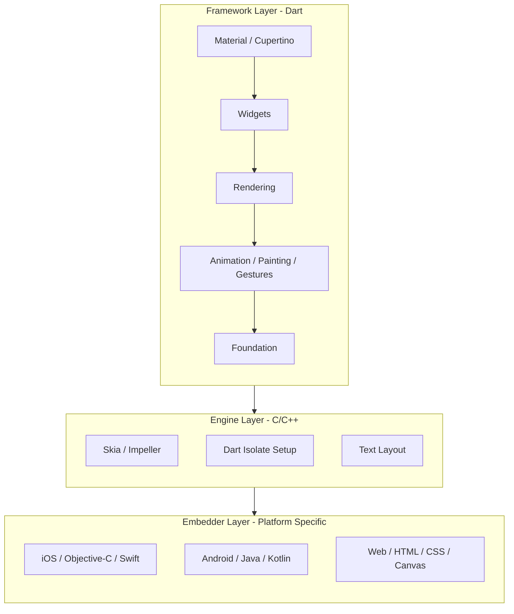

> [!abstract] Table of Contents
> - [[#1. Introduction and Historical Context]]
> - [[#2. Dart: The Mechanical Core]]
>   - [[#2.1 The Event Loop and Asynchronous Execution]]
>   - [[#2.2 The Isolate Memory Model]]
>   - [[#2.3 Compilation Strategies: JIT vs. AOT]]
> - [[#3. The Layered Architecture]]
>   - [[#3.1 The Framework Layer (Dart)]]
>   - [[#3.2 The Engine Layer (C/C++)]]
>   - [[#3.3 The Embedder Layer]]
> - [[#4. The Rendering Pipeline and the Impeller Revolution]]
>   - [[#4.1 Skia vs. Impeller]]
>   - [[#4.2 The Mechanics of Impeller]]
> - [[#5. The Widget Ecosystem and Lifecycle]]
>   - [[#5.1 The Three Trees]]
>   - [[#5.2 The Stateful Lifecycle]]
> - [[#6. State Management Paradigms]]
>   - [[#6.1 Ephemeral vs. App State]]
>   - [[#6.2 The Evolution of State Management]]
> - [[#7. Conclusion]]

## 1. Introduction and Historical Context

Flutter is not merely another framework in the crowded landscape of frontend development; it represents a fundamental paradigm shift in how we conceive of and render user interfaces across multiple platforms. Unlike traditional cross-platform solutions that rely on web views (like Cordova or Ionic) or those that act as wrappers around OEM widgets (like React Native or Xamarin), Flutter chooses a radically different approach: it paints every single pixel to the screen itself, bypassing the platform's native UI controls entirely.

To understand Flutter, we must first understand its origins within Google. The project, initially codenamed "Sky," was born out of an experiment by members of the Chrome browser team. They asked a simple question: "What if we stripped away all the legacy baggage of the web—the DOM, CSS, HTML parsing—and just kept the bare minimum required to render 120 frames per second?" The result was a fast, hardware-accelerated rendering engine. 

However, an engine needs a language. The team evaluated numerous options, including JavaScript and Java, but ultimately selected Dart, a language developed internally at Google by Lars Bak and Kasper Lund. Dart offered a unique combination of features: it could be Just-In-Time (JIT) compiled for rapid development cycles (enabling Flutter's famous "Stateful Hot Reload") and Ahead-Of-Time (AOT) compiled to highly optimized native ARM machine code for production release.

Since its beta release in 2018, Flutter has evolved from a mobile-only framework to a multi-platform behemoth, supporting iOS, Android, Web, Windows, macOS, and Linux from a single codebase.

- - -

## 2. Dart: The Mechanical Core

Dart is the lifeblood of Flutter. While often criticized in its early days for lacking the syntactic sugar of newer languages, Dart has matured into a robust, strictly typed, and soundly null-safe language tailored specifically for UI development.

### 2.1 The Event Loop and Asynchronous Execution

Like JavaScript, Dart is single-threaded. It executes code sequentially within a single execution context. However, modern UIs require handling multiple concurrent operations—network requests, user interactions, and file I/O—without freezing the UI. Dart handles this via an **Event Loop**.

The Event Loop continuously monitors two queues:
1.  **The Microtask Queue:** Used for short, synchronous tasks that must be executed immediately after the current execution completes but before yielding back to the event loop.
2.  **The Event Queue:** Used for external events, timers, I/O, and asynchronous operations (`Futures` and `Streams`).

When a Dart application starts, it executes the `main()` function synchronously. Once `main()` completes, the Event Loop takes over, checking the Microtask Queue first. Only when the Microtask Queue is empty does it process the next item in the Event Queue. This precise choreography ensures predictable execution order, preventing the classic race conditions often found in multithreaded environments.

### 2.2 The Isolate Memory Model

While Dart is single-threaded by default, computationally intensive tasks (like parsing massive JSON payloads or complex image processing) will block the Event Loop, causing the UI to stutter (jank). To solve this, Dart introduces **Isolates**.

An Isolate is exactly what it sounds like: an isolated execution context. Unlike threads in Java or C++, which share a common memory heap and require complex locking mechanisms (mutexes, semaphores) to prevent memory corruption, **Isolates do not share memory**. 

Each Isolate has its own independent memory heap and its own Event Loop. Because there is no shared memory, there is no need for locks, completely eliminating the risk of deadlocks. Communication between Isolates is achieved strictly through **message passing** via `SendPort` and `ReceivePort`. When Isolate A needs to send data to Isolate B, the data is copied (or transferred, in the case of specific data structures) rather than shared via a pointer.

This actor-model concurrency makes Dart inherently safer for concurrent programming, aligning perfectly with Flutter's demand for consistently smooth frame rates.

### 2.3 Compilation Strategies: JIT vs. AOT

Dart's dual-compilation capability is perhaps its greatest asset in the context of Flutter.

*   **JIT (Just-In-Time) Compilation:** During development, the Dart Virtual Machine (VM) runs the code, compiling it on the fly. This enables **Stateful Hot Reload**. When a developer saves a file, the Dart VM injects the updated source code into the running application, re-evaluates the widget tree, and repaints the screen in milliseconds, all while preserving the application's current state.
*   **AOT (Ahead-Of-Time) Compilation:** For release builds, the Dart compiler translates the entire codebase into highly optimized, platform-specific native ARM or x86 machine code. The Dart VM is stripped out, leaving only a tiny runtime environment for garbage collection and basic type checking. This results in minimal startup times and predictable, high-performance execution.

- - -

## 3. The Layered Architecture

Flutter is constructed as an extensible, layered system. It exists as a series of independent libraries that depend on the underlying layer. No layer has privileged access to the layer below it, and every part of the framework level is replaceable.

### 3.1 The Framework Layer (Dart)

This is the layer developers interact with directly. It is written entirely in Dart and provides a rich set of reactive, composable widgets.
*   **Foundation:** Basic utility classes and services.
*   **Rendering:** An abstraction over the engine, providing the `RenderObject` tree which handles layout and painting.
*   **Widgets:** The core compositional units.
*   **Material/Cupertino:** Comprehensive libraries implementing Google's Material Design and Apple's Human Interface Guidelines.

### 3.2 The Engine Layer (C/C++)

The engine is the core workhorse, written in C/C++. It takes the instructions from the framework and translates them into pixels. It handles:
*   **Graphics Rendering:** Historically via Skia, now transitioning to Impeller.
*   **Text Layout:** Using libraries like HarfBuzz.
*   **Dart Runtime:** Hosting the Dart AOT runtime and garbage collector.
*   **Platform Channels:** Managing the asynchronous messaging system between Dart and the native host.

### 3.3 The Embedder Layer

The embedder is the platform-specific code that hosts the Flutter engine. It provides the entry point, manages the event loop for the host operating system, and provides access to native APIs (camera, sensors, Bluetooth) via Platform Channels.

- - -

## 4. The Rendering Pipeline and the Impeller Revolution

Flutter's rendering pipeline is a precise sequence of events that occurs every time a frame needs to be drawn (ideally 60 or 120 times per second). The pipeline consists of:
1.  **User Input:** Touch, gestures, keyboard.
2.  **Animation:** Tickers advance.
3.  **Build:** The widget tree is constructed/updated.
4.  **Layout:** The size and position of every element are calculated (constraints go down, sizes go up).
5.  **Paint:** Visual commands are generated.
6.  **Composition:** Layers are combined.
7.  **Rasterization:** The vector commands are translated into a bitmap by the rendering engine.

### 4.1 Skia vs. Impeller

For years, Flutter relied on **Skia**, a mature, open-source 2D graphics library also used by Google Chrome and Android. Skia works beautifully for the web, but mobile architectures present unique challenges.

The primary issue with Skia on mobile iOS devices was **shader compilation jank**. Modern GPUs require specialized programs called "shaders" to draw graphics. Skia generates these shaders dynamically at runtime. When an app encounters a new graphic effect it hasn't seen before, Skia must pause the UI thread to compile the necessary shader. This compilation takes milliseconds—far longer than the 16ms budget for a 60fps frame—resulting in a noticeable stutter the first time an animation runs.

To solve this fundamentally, the Flutter team built **Impeller**, a brand-new rendering engine designed from scratch for Flutter.

### 4.2 The Mechanics of Impeller

Impeller completely eliminates runtime shader compilation jank through a radically different architecture:

1.  **Pre-compiled Shaders:** Impeller pre-compiles a smaller, deterministic set of shaders ahead of time during the application build process. When the app runs, the shaders are already compiled and ready on the GPU.
2.  **Modern Graphics APIs:** Skia was built in an era of OpenGL. Impeller is designed from the ground up to leverage the full power of modern, low-overhead graphics APIs like **Apple's Metal** and **Vulkan** on Android.
3.  **Explicit Memory Management:** Impeller takes finer-grained control over GPU memory, optimizing texture caching and buffer allocation specifically for Flutter's rendering patterns.

The transition to Impeller represents a monumental shift, providing buttery-smooth performance and eliminating the most persistent performance complaint in the framework's history.

- - -

## 5. The Widget Ecosystem and Lifecycle

In Flutter, the famous mantra is "Everything is a widget." However, this is a slight oversimplification that hides the true genius of the architecture. A Widget is actually just an immutable configuration blueprint. It is cheap to create and destroy. 

### 5.1 The Three Trees

Under the hood, Flutter manages three distinct trees:

1.  **The Widget Tree:** The immutable configuration provided by the developer. It describes *what* the UI should look like.
2.  **The Element Tree:** The logical structure of the UI. Elements are instantiated from Widgets. While Widgets are destroyed and rebuilt constantly, Elements are remarkably persistent. They represent the *actual instance* of a widget at a specific location in the tree. The Element tree manages the lifecycle and state.
3.  **The RenderObject Tree:** The physical manifestation. RenderObjects handle the heavy lifting of sizing, laying out constraints, and painting to the canvas. They are highly optimized and mutable.

When `setState()` is called, Flutter walks the Element tree, comparing the new Widget tree with the old one. If the runtime type and key of the new Widget match the old Widget at that location, the Element merely updates its reference to the new Widget and triggers an update in the RenderObject. This diffing algorithm (`Widget.canUpdate()`) is what makes Flutter incredibly performant despite aggressively rebuilding the Widget tree.

### 5.2 The Stateful Lifecycle

A `StatefulWidget` introduces a separate `State` object that lives longer than the widget itself. Its critical lifecycle methods include:

*   `initState()`: Called exactly once when the State object is inserted into the Element tree. Used for one-time initialization (e.g., subscribing to streams, initializing animation controllers).
*   `didChangeDependencies()`: Called immediately after `initState` and whenever a dependency (like an `InheritedWidget`) changes.
*   `build()`: The core method. Called frequently. Must be pure, side-effect-free, and return a Widget tree.
*   `dispose()`: Called when the State object is permanently removed from the tree. Crucial for memory management (canceling subscriptions, disposing controllers).

- - -

## 6. State Management Paradigms

As applications scale, passing state down the widget tree via constructor arguments (prop-drilling) becomes untenable. Flutter's architecture necessitates dedicated state management solutions.

### 6.1 Ephemeral vs. App State

*   **Ephemeral (Local) State:** State contained within a single widget (e.g., the current tab in a `BottomNavigationBar`, the text in a `TextField`). Handled perfectly by `StatefulWidget` and `setState()`.
*   **App (Shared) State:** State that needs to be accessed across disparate parts of the application (e.g., user authentication status, shopping cart contents, theme preferences).

### 6.2 The Evolution of State Management

The ecosystem has evolved rapidly to handle App State:

1.  **InheritedWidget:** The foundational mechanism provided by the framework. It allows data to be pushed down the tree and for descendant widgets to subscribe to changes. However, it is verbose and difficult to manage for complex, mutable state.
2.  **Provider:** Created by the community and endorsed by Google, Provider is essentially a wrapper around `InheritedWidget` that dramatically simplifies syntax and adds dependency injection capabilities.
3.  **Riverpod:** A modern rewrite of Provider by the same author (Remi Rousselet). Riverpod moves state outside the widget tree entirely, making it compile-safe, preventing `ProviderNotFoundException`, and vastly simplifying asynchronous state handling and testing.
4.  **BLoC (Business Logic Component):** An architectural pattern utilizing Dart `Streams`. BLoC strictly separates presentation from business logic. The UI sends `Events` to the BLoC, and the BLoC yields new `States` back to the UI. It is highly structured, predictable, and heavily favored in enterprise applications where testability is paramount.

- - -
## 7. Conclusion
Flutter represents a bold departure from traditional application development. By controlling the entire stack—from the Dart language designed for UI to the Impeller engine rendering the pixels—it achieves a level of consistency and performance rarely seen in cross-platform frameworks. Its architecture, built around immutable widgets, persistent elements, and isolated concurrent execution, provides a robust foundation for building the next generation of beautiful, highly interactive software.

## See Also

- [[_Science - Map of Contents|Science MOC]]
