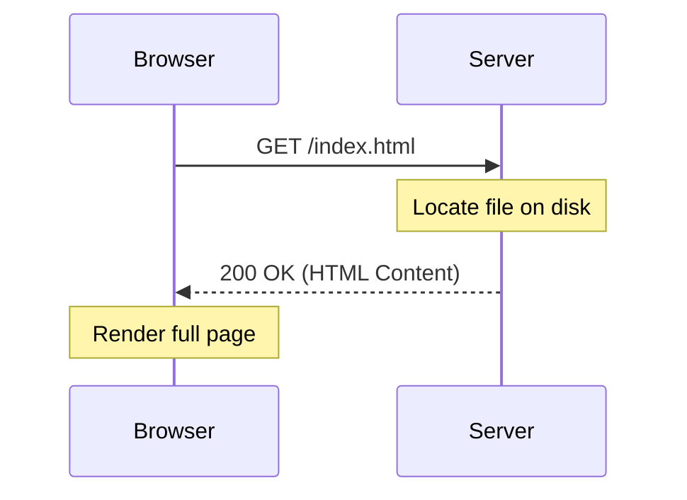
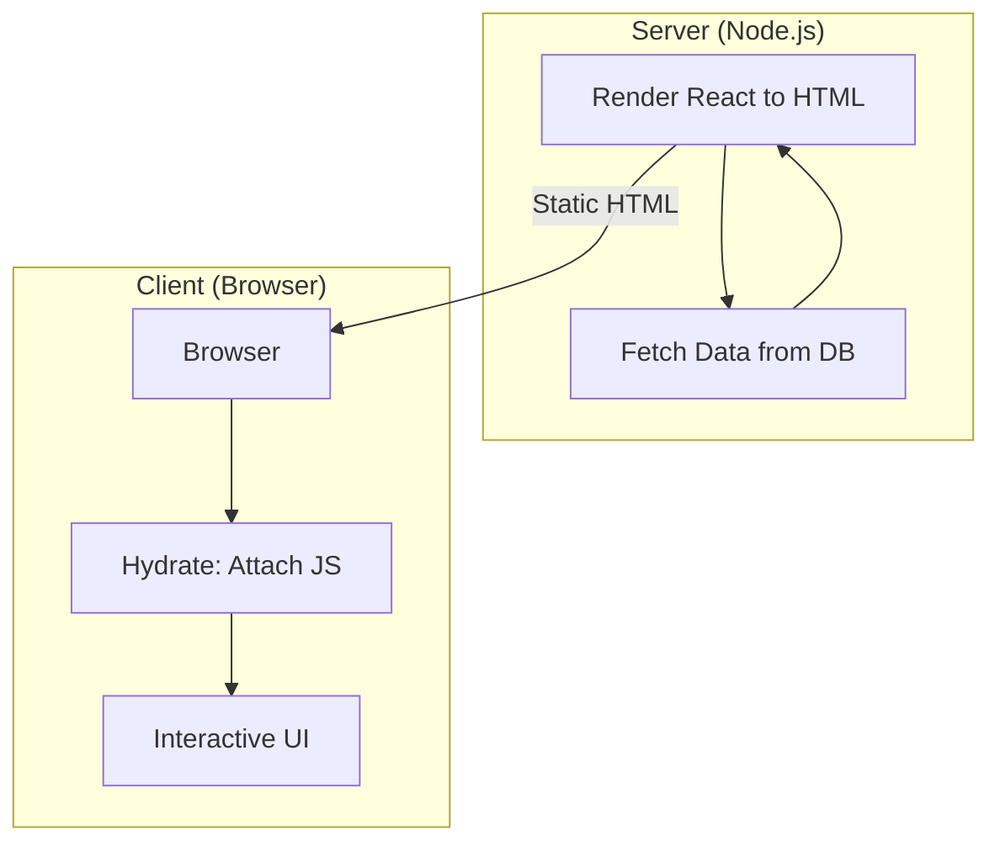

# WEB - Evolution of Web Development: A Technical and Historical Odyssey

Web development is the architectural manifestation of the "global brain." It is a domain where the abstract logic of information retrieval meets the visceral requirements of human interface. To understand the modern web is to understand a series of pivotal technological "pivot points"—moments where the locus of computation shifted in response to the growing complexity of human digital interaction.

- - -

## Act I: The Crucible (1989–2000) - The Document Web

The "Crucible" was defined by the transition from localized information silos to a universal, decentralized document-sharing protocol.

### 1. The Inception: Tim Berners-Lee and the CERN Proposal
In March 1989, **Tim Berners-Lee**, a software engineer at CERN, authored "Information Management: A Proposal." His goal was not a global social network, but a solution to the "information loss" occurring in large scientific projects. He envisioned a "web" of nodes linked by hypertext.

#### The Theoretical Foundation
The early web relied on three pillars:
1.  **HTML (HyperText Markup Language)**: A semantic way to structure documents.
2.  **HTTP (HyperText Transfer Protocol)**: A stateless request-response protocol.
3.  **URL (Uniform Resource Locator)**: A universal addressing system.

### 2. The Browser Wars and the Birth of Programmability
The 1990s were defined by the rivalry between **Netscape Navigator** and **Microsoft Internet Explorer**. This era saw the introduction of the first visual elements (the `<img` tag) and, most crucially, **JavaScript**.

#### Historical Context: The 10-Day Miracle
In May 1995, **Brendan Eich** was tasked by Netscape to create a "glue language" for the browser. He wrote the first version of JavaScript in just 10 days. While initially dismissed as a "toy language," its integration into the browser environment established the first programmable client-side layer.

### 3. Early Rendering Logic (Static SSR)
Early web servers (like NCSA HTTPd) served static `.html` files. The theoretical model was a simple 1:1 mapping between a URL and a file on disk.

- - -

## Act II: The Zenith (2000–2015) - The Social and Application Web

The "Zenith" represents the transition from a "Web of Pages" to a "Web of Applications." The primary theoretical breakthrough was **asynchronicity**.

### 1. The AJAX Revolution (2005)
Before 2005, every user interaction required a full page reload. **Jesse James Garrett** popularized **AJAX** (Asynchronous JavaScript and XML), which utilized the `XMLHttpRequest` object (originally developed by Microsoft for Outlook Web Access) to request data in the background.

#### Theoretical Shift: Decoupling Data from UI
This era introduced the concept of the **Single Page Application (SPA)**. Instead of the server sending a complete HTML page, it sent a "shell" (HTML/CSS/JS), and subsequent data updates were handled via JSON payloads.

### 2. The Great Framework Consolidation
As logic moved to the client, developers needed better ways to manage state.
- **jQuery (2006)**: Standardized the "Write Less, Do More" philosophy, bridging browser inconsistencies.
- **AngularJS (2010)**: Google's attempt to bring MVC patterns to the browser.
- **React (2013)**: Facebook's solution to the "State Problem" in their newsfeed, introducing the **Virtual DOM**.

### 3. Comparison of Evolutionary Eras
| Attribute | Web 1.0 (Document) | Web 2.0 (Application) | Modern Web (Distributed) |
|-----------|-------------------|-----------------------|-------------------------|
| **Primary Interaction** | Read-only / Navigation | Read-Write / Interaction | Immersive / Intelligence |
| **Data Flow** | Unidirectional (Server-to-Client) | Bi-directional (API/JSON) | Real-time / Streaming |
| **State Management** | URL-based / Cookies | Browser-based (Redux/Vuex) | Hybrid (Server Components/Signals) |
| **Key Creators** | Tim Berners-Lee | Eich, Garrett, Zuckerberg | Vercel, Meta, Google AI |

- - -

## Act III: The Legacy (2015–Present) - The Converged Web

The "Legacy" is a synthesis where the boundaries between server and client have dissolved into a single execution graph.

### 1. The Meta-Framework Synthesis
Modern development is dominated by meta-frameworks like **Next.js**, **Remix**, and **Astro**. These tools solve the "SPA Problem" (slow initial load, poor SEO) by bringing back **Server-Side Rendering (SSR)** but with client-side "hydration."

#### Theoretical Innovation: Hydration and Partial Rendering
Hydration is the process of attaching event listeners to a server-rendered HTML structure to make it interactive. 

### 2. The Rise of the Edge
Computation is moving away from centralized data centers to the "Edge"—servers located geographically close to the user (e.g., **Cloudflare Workers**, **Vercel Edge**). This reduces latency to near-zero.

### 3. WebAssembly (Wasm) and the Performance Peak
Wasm allows high-performance languages like **C++** and **Rust** to run at near-native speed in the browser. This has enabled "Impossible Apps" like Photoshop and Figma to exist entirely on the web.

### 4. The Human Element: Inception and Popular Works
The web's evolution is marked by legendary projects:
- **Mosaic (1993)**: The first popular browser (Marc Andreessen).
- **Google Search (1998)**: Applied the PageRank algorithm to the Document Web.
- **Gmail (2004)**: Proved that a complex application could live in a browser.
- **React (2013)**: Reified the "UI as a function of state" philosophy.

The legacy of web development is the democratization of information. By abstracting the complexity of the network into a universal interface, we have created the first truly global infrastructure for thought.

- - -

## See Also

- [[_Science - Map of Contents|Science MOC]]
