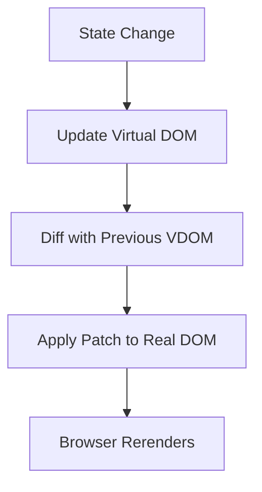

---
tags:
  - web-dev
  - computer-science
  - javascript
  - frameworks
  - history
  - ai-generated
footnote: ""
---

# WEB - JavaScript Frameworks: The Architecture of Modern Interfaces

JavaScript frameworks are the "Great Architects" of the digital age. They are not merely collections of functions; they are cohesive systems that define the relationship between state, data, and the user interface. This note explores the dominant paradigms, the historical "why" behind their inception, and the theoretical logic that powers the modern frontend.

- - -

## Act I: The Crucible (2006–2013) - The Rise of the Declarative UI

The "Crucible" was a period of intense fragmentation, where developers struggled to manage the growing complexity of web applications using imperative DOM manipulation (jQuery).

### 1. The Inception: Why Frameworks?
Before frameworks, developers used **jQuery** to manually select elements and update their values: `$('#element').text('New Value')`. As apps like Facebook and Gmail grew, "spaghetti code" became inevitable. State (the data) and the UI (the representation) would frequently fall out of sync.

### 2. The Angular Revolution (2010): Google's Opinionated MVC
**Misko Hevery** at Google created **AngularJS** to solve the internal "Google Feedback" project's complexity. 

#### Theoretical Innovation: Two-Way Data Binding
Angular's core innovation was the **Digest Cycle**. When a variable changed in the code, the UI updated automatically, and vice-versa. While powerful, this led to performance "bottlenecks" in large applications as the browser spent too much time checking for changes.

### 3. The React Revolution (2013): Facebook's Newsfeed Problem
By 2011, Facebook's engineers (led by **Jordan Walke**) were struggling with the complexity of their real-time notification system and newsfeed. Traditional MVC patterns were failing them.

#### Theoretical Innovation: The Virtual DOM
React introduced the **Virtual DOM** (VDOM)—an in-memory representation of the real DOM. Instead of updating the browser's slow DOM directly, React updates the VDOM and then uses a **Diffing Algorithm** to surgically update only the changed elements in the real DOM.



- - -

## Act II: The Zenith (2014–2022) - Ecosystem Maturity and Choice

The "Zenith" represents the maturation of the "Big Three" frameworks and the introduction of new reactive paradigms.

### 1. Vue.js (2014): The Progressive Framework
**Evan You**, a former Google engineer, created **Vue.js** as a "lightweight" alternative to Angular. He wanted to take the best of Angular (Directives/Templating) and combine it with React's performance (Virtual DOM). 

#### Historical Context: Community-Driven Innovation
Unlike React (Facebook) or Angular (Google), Vue is entirely community-funded. Its focus on **Developer Experience (DX)** and its intuitive **Options API** made it a favorite for rapid prototyping and medium-scale apps.

### 2. Svelte (2016): The Compiler Revolution
**Rich Harris** (The New York Times) introduced **Svelte** with a radical proposition: "What if the framework wasn't a library you shipped to the client, but a compiler that ran at build time?"

#### Theoretical Innovation: Zero-Runtime Overhead
Svelte compiles your code into highly efficient, imperative JavaScript that updates the DOM directly. It has **no Virtual DOM**, resulting in smaller bundle sizes and faster execution.

### 3. Comparison of Framework Architectures
| Feature | React.js | Angular | Vue.js | Svelte |
|---------|----------|---------|--------|--------|
| **Creator** | Jordan Walke (Meta) | Misko Hevery (Google) | Evan You | Rich Harris |
| **Philosophy** | Unidirectional Data Flow | Opinionated MVC | Progressive / Hybrid | Build-time Compiler |
| **Reactivity** | Virtual DOM Diffing | Zone.js / Digest Cycle | Proxies / Observe | Variable Instrumentation |
| **Learning Curve** | Moderate | Steep (TypeScript) | Low | Very Low |
| **Primary State** | `useState` / `useReducer` | Services / RxJS | Pinia / Reactive | Writable Stores |

- - -

## Act III: The Legacy (2023–Future) - The Post-Virtual DOM Era

The "Legacy" is being written by frameworks that prioritize **performance-at-scale** and **instant-on** interactions.

### 1. Signals: The New Reactivity Standard
In 2023, the industry shifted toward **Signals** (popularized by **Solid.js** and **Preact**). 

#### Theoretical Innovation: Fine-Grained Reactivity
Unlike React, which re-renders an entire component when state changes, Signals allow for "fine-grained" updates. Only the specific part of the DOM that depends on the signal is updated, bypassing the need for a Virtual DOM diff entirely.

```typescript
// A Signal-based approach (Solid.js style)
const [count, setCount] = createSignal(0);

// Only this <span> updates when count changes, not the whole component!
return <span>{count()}</span>;
```

### 2. Island Architecture and Resumability
- **Astro (2021)**: Introduced "Islands of Interactivity," where most of the page is static HTML, and JS is only loaded for specific components.
- **Qwik (2022)**: Introduced "Resumability," allowing the browser to resume execution from where the server left off without the cost of **Hydration**.

### 3. Conclusion: The Convergence of Theory and Practice
The legacy of JavaScript frameworks is the abstraction of the DOM. We have moved from manipulating "strings" of HTML to architecting "systems" of state. Whether through the Virtual DOM of React or the compile-time logic of Svelte, the goal remains the same: a seamless, high-performance interface for human-computer interaction.

- - -

## See Also

- [[_Science - Map of Contents|Science MOC]]
