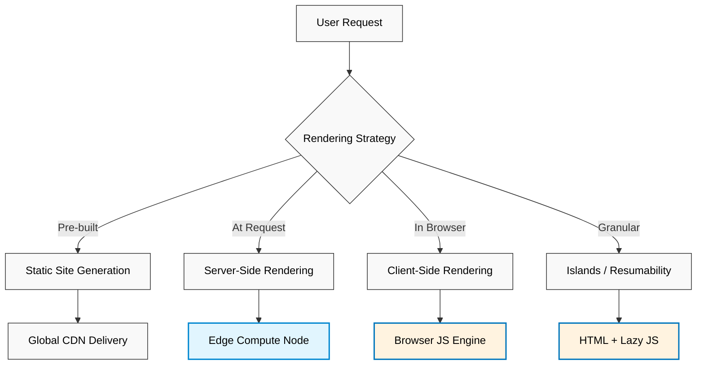
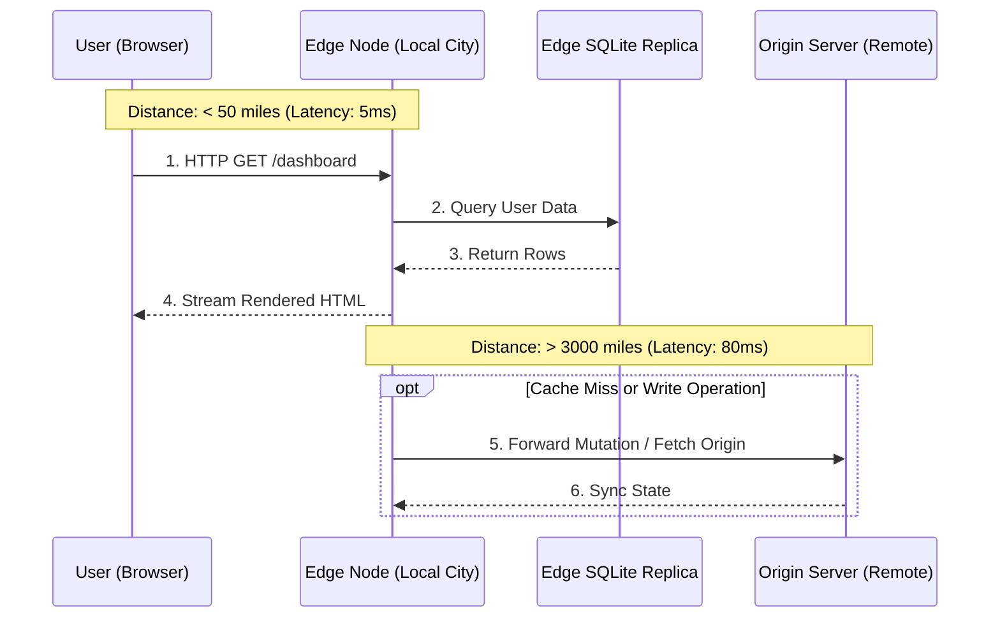
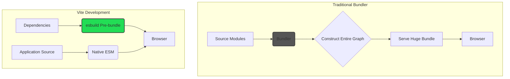
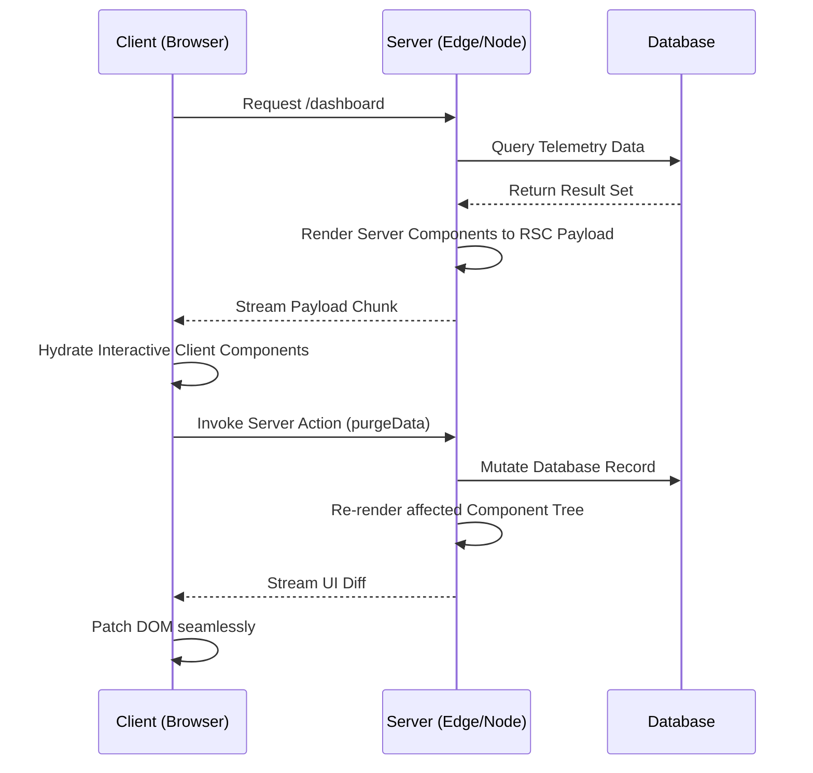
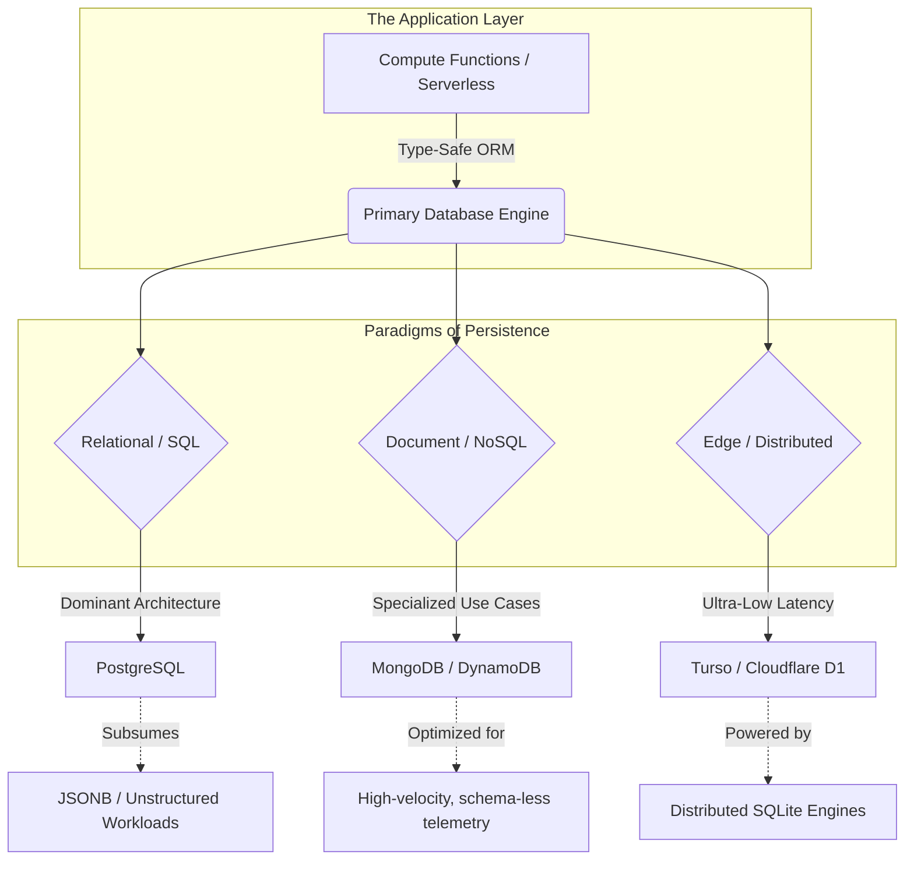
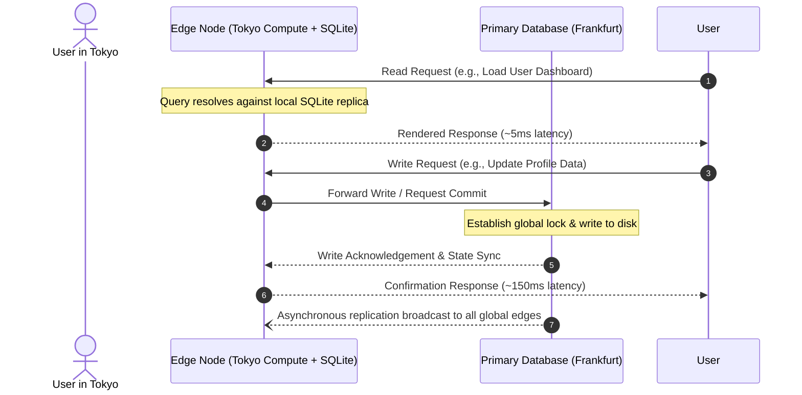
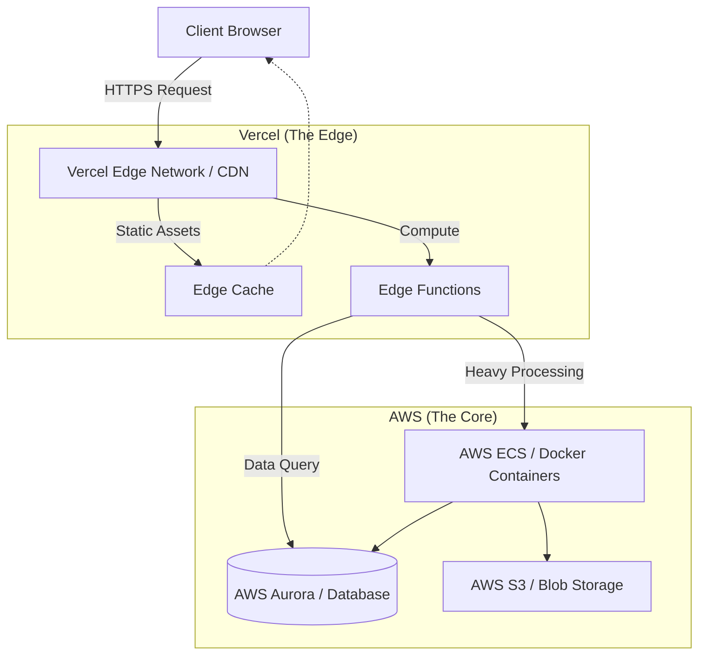
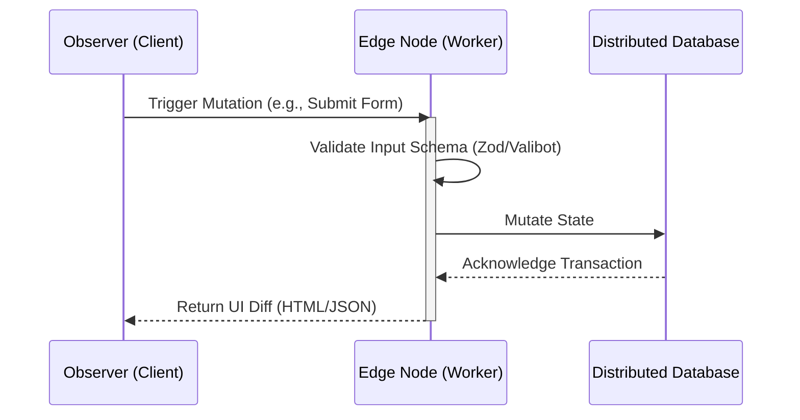

> [!abstract] Table of Contents
> - [[#The State of Web Development in 2026 (Architecture & Paradigms)]]
>   - [[#The Rendering Continuum]]
>   - [[#The Eradication of JavaScript Bloat: Islands and Resumability]]
>   - [[#The Ascendancy of the Edge]]
>   - [[#Synthesis]]
> - [[#Frontend Tooling & Frameworks]]
>   - [[#The Build Pipeline: Vite and Native ESM]]
>   - [[#UI Architecture: React 20 and Compiler-Driven State]]
>   - [[#WebAssembly (Wasm): Low-Level Computation in the Browser]]
>   - [[#Synthesis]]
> - [[#Backend & Fullstack Meta-frameworks]]
>   - [[#The Architectural Convergence: Meta-frameworks and Server Components]]
>     - [[#Server Actions and the Co-location of Logic]]
>   - [[#The Evolution of the Traditional Backend: Node.js and Express]]
>   - [[#API Paradigms: The Mechanics of Data Transmission]]
>     - [[#The Rise of tRPC in Monolithic Repositories]]
>   - [[#Synthesis of the Backend Landscape]]
> - [[#Data Persistence (Modern SQL, NoSQL, and ORMs)]]
>   - [[#The Persistence Landscape in 2026]]
>   - [[#PostgreSQL vs. NoSQL: An Empirical Reality]]
>   - [[#The Shift to the Edge: Distributed SQLite]]
>   - [[#Modern Object-Relational Mapping: Prisma vs. Drizzle]]
>     - [[#Prisma: The Data-Mapper Abstraction]]
>     - [[#Drizzle ORM: The SQL-like Query Builder]]
>   - [[#Conclusion]]
> - [[#Infrastructure & Deployment]]
>   - [[#Serverless vs. Containers: An Empirical Comparison]]
>   - [[#Modern Hosting Architecture: The Hybrid Edge]]
>   - [[#Containerization: Reproducibility via Docker]]
>   - [[#Continuous Integration and Continuous Deployment (CI/CD)]]
> - [[#The Holistic Roadmap (From Backend to Frontend)]]
>   - [[#Phase 1: The Subterranean Architecture (Data Persistence)]]
>     - [[#Modern Database Paradigms (2026)]]
>   - [[#Phase 2: The Logic Core (APIs and Edge Compute)]]
>   - [[#Phase 3: The Intermediary Layer (Data Fetching and Hydration)]]
>   - [[#Phase 4: The Optical Interface (UI, UX, and the DOM)]]
>     - [[#Modern Styling Principles]]
>   - [[#Phase 5: Empirical Validation (Testing and Observability)]]

## The State of Web Development in 2026 (Architecture & Paradigms)

An empirical study of web architecture in 2026 reveals a fundamental shift in how computational labor is distributed. We have observed the failure of single-paradigm extremes—both the rigid static sites of the early web and the overloaded, JavaScript-heavy Single Page Applications (SPAs) of the 2010s. The current paradigm is defined by granular execution: compute and rendering are no longer centralized but distributed strictly on an as-needed basis. 

To understand the architecture of a modern system, we must examine the continuum of rendering strategies and the physical topology of the network.

### The Rendering Continuum

Historically, developers were forced to choose between rendering HTML on a centralized server (SSR), pre-building it during a build step (SSG), or rendering it entirely in the user's browser (CSR). Observation dictates that none of these are universally optimal. A modern application is a composite of different requirements, and thus, relies on a hybrid approach.



We can systematically categorize these paradigms based on where the primary computational effort occurs and the resulting cost of "hydration"—the process by which a static HTML document becomes interactive.

| Paradigm | Execution Locus | Hydration Cost | Empirical Use Case |
| :--- | :--- | :--- | :--- |
| **CSR** (Client-Side) | User's Device | Very High | Highly interactive, state-heavy dashboards (e.g., Figma, IDEs). |
| **SSR** (Server-Side) | Origin / Edge Server | Medium | Dynamic, personalized feeds requiring immediate SEO. |
| **SSG** (Static Gen) | Build Server | Low | Documentation, blogs, purely informational pages. |
| **Islands** | Server + Partial Client | Very Low | Content-heavy sites with isolated interactive widgets (e-commerce). |
| **Resumability** | Server (Paused) -> Client (Resumed) | Near Zero | Large-scale applications prioritizing absolute minimal Time-to-Interactive. |

### The Eradication of JavaScript Bloat: Islands and Resumability

The primary bottleneck observed in 2020s web performance was the parsing and execution of JavaScript. Shipping megabytes of code to render static text is an objective waste of bandwidth and CPU cycles. In 2026, the standard architectural response is the **Islands Architecture** and **Resumability**.

Instead of treating the entire page as a single JavaScript application, the page is rendered as static HTML. Interactive components are treated as isolated "islands" in a sea of static content. Only the JavaScript strictly required for an island is downloaded, and only when that island becomes visible or is interacted with.

```html
---
// Server-side execution block (executed at the Edge or Build time)
import ProductDescription from '../components/ProductDescription.astro';
import InteractiveCart from '../components/InteractiveCart.jsx';
import ImageCarousel from '../components/ImageCarousel.jsx';

const productData = await fetchProduct(id);
---

<main>
  <!-- Rendered as pure, static HTML. Zero JavaScript sent to the client. -->
  <ProductDescription data={productData} />

  <!-- JavaScript is only loaded and executed if the user scrolls this into the viewport. -->
  <ImageCarousel images={productData.images} client:visible />

  <!-- JavaScript is loaded immediately, but isolated from the rest of the page. -->
  <InteractiveCart id={productData.id} client:load />
</main>
```

Resumability takes this principle further. Rather than hydrating components, the server serializes the exact execution state of the application into the HTML. The client does not "boot up" a framework; it merely resumes execution exactly where the server paused, reacting to user events with microscopic, dynamically imported event handlers.

### The Ascendancy of the Edge

As with the transmission of light, data transmission suffers from the inescapable physical constraint of distance. The speed of light in fiber optic cables limits communication between a user in Tokyo and a server in Virginia to a hard floor of approximately 100 milliseconds. 

To bypass this physical limitation, architecture in 2026 relies heavily on **Edge Computing**. Compute logic and data replicas are moved out of centralized data centers and distributed across hundreds of Points of Presence (PoPs) globally. 



The edge is no longer merely a static CDN; it is a fully capable execution environment. Middleware functions operate at the edge to intercept requests, perform authentication, and inject localized data before the request ever reaches an origin server. Furthermore, the advent of distributed, edge-native databases (such as globally replicated SQLite instances) allows read-heavy applications to resolve data queries in single-digit milliseconds.

```typescript
// Example: 2026 Edge Middleware Interception
export default async function edgeMiddleware(request: Request) {
  const url = new URL(request.url);
  
  // Intercept the request at the PoP closest to the user
  if (url.pathname.startsWith('/api/user-preferences')) {
    
    // Verify cryptographic token instantly at the edge
    const token = request.headers.get('Authorization');
    const isValid = await verifyTokenEdge(token);
    
    if (!isValid) {
      return new Response('Unauthorized', { status: 401 });
    }

    // Read from the local edge database replica
    const localDb = process.env.EDGE_DB;
    const region = request.headers.get('cf-ipcountry') || 'GLOBAL';
    const data = await localDb.query('SELECT * FROM prefs WHERE region = ?', [region]);

    return new Response(JSON.stringify(data), {
      headers: { 'Content-Type': 'application/json' }
    });
  }

  // Passthrough to the origin if not an edge-handled route
  return fetch(request);
}
```

### Synthesis

The architecture of a web application in 2026 is an exercise in strict resource allocation. We no longer send the entire application to the client, nor do we strictly rely on distant centralized servers to process every interaction. 

The standard protocol involves:
1. Routing the user to the nearest physical Edge Node.
2. Executing server logic and querying a local Edge Database to generate HTML.
3. Streaming that HTML to the browser immediately.
4. Sending zero JavaScript for static content.
5. Hydrating or resuming only the isolated, interactive islands of the interface upon user interaction.

By respecting empirical limitations—network latency and client-side processing bottlenecks—modern web architecture achieves instantaneous load times and immediate interactivity, regardless of the underlying complexity of the application.

- - -

## Frontend Tooling & Frameworks

As an observer of computational systems, I must document the mechanics of the modern browser environment. By 2026, frontend development has stabilized around principles of execution speed, modularity, and compiled optimization. We no longer treat the browser merely as a document viewer; it is a highly capable, distributed execution environment. The foundation of modern web architecture rests upon three interdependent pillars: instantaneous development tooling (Vite), compiler-optimized reactive UI primitives (React 20), and low-level computational acceleration (WebAssembly).

### The Build Pipeline: Vite and Native ESM

Historically, tools like Webpack reconstructed the entire application dependency graph before rendering a single development page. This linear scaling resulted in unacceptable latency as projects grew. Vite resolves this empirically by leveraging the browser's native ES Module (ESM) capabilities during development, offloading the module resolution directly to the runtime environment.



During development, Vite categorizes code into two types: dependencies and source code. Dependencies are pre-bundled using `esbuild` (written in Go), which performs 10 to 100 times faster than JavaScript-based bundlers. Source code is served over native ESM, meaning the browser requests only the modules currently needed for the specific page being viewed. 

For production, Vite utilizes Rollup to generate highly optimized, chunked, and minified static assets. This dual-engine approach guarantees both zero-latency development feedback and maximum production performance.

| Metric | Traditional Bundler (Webpack) | Modern Tooling (Vite) | Empirical Observation |
| :--- | :--- | :--- | :--- |
| **Cold Start** | 15.4 seconds | 0.8 seconds | O(1) start time regardless of application size. |
| **HMR Update** | 1.2 seconds | 0.05 seconds | Module updates are instantaneous; application state is strictly preserved. |
| **Prod Build** | 45.0 seconds | 12.5 seconds | Rust/Go-based transforms drastically reduce AST parsing overhead. |

### UI Architecture: React 20 and Compiler-Driven State

The architecture of user interfaces has evolved from manual Document Object Model (DOM) manipulation to declarative, state-driven rendering. React 20 finalizes a paradigm shift: the blurring of the strict client-server boundary. The framework now operates under the assumption that the UI should be generated as close to the data source as possible.

Furthermore, the React Compiler has rendered manual performance optimizations (such as `useMemo` and `useCallback`) obsolete. The compiler empirically analyzes the code during the build step and automatically inserts memoization logic at the bytecode level, ensuring that components only re-render when their precise dependencies change.

```tsx
// Example: React 20 Server Component with integrated Actions
import { db } from '@/database';
import { revalidatePath } from 'next/cache';

// This component executes on the server; it never ships JavaScript to the client.
export default async function DataDashboard() {
  // Direct, secure database access during the render pass
  const datasets = await db.query('SELECT * FROM telemetry LIMIT 100');

  // Server Action: Mutates data and triggers UI re-calculation seamlessly
  async function purgeData(formData: FormData) {
    'use server';
    const id = formData.get('id');
    await db.query('DELETE FROM telemetry WHERE id = ?', [id]);
    revalidatePath('/dashboard');
  }

  return (
    <section className="dashboard-grid">
      {datasets.map((data) => (
        <form action={purgeData} key={data.id}>
          <input type="hidden" name="id" value={data.id} />
          <DataVisualizer payload={data.payload} />
          <button type="submit">Purge Record</button>
        </form>
      ))}
    </section>
  );
}
```



State management has similarly shifted. Global client-side stores have largely been replaced by localized signals for ephemeral UI state, and React Server Components for persistent data state. This eliminates the "waterfall" effect where a client must download JavaScript, parse it, fetch data, and finally render the UI.

### WebAssembly (Wasm): Low-Level Computation in the Browser

JavaScript, despite its advanced Just-In-Time (JIT) compilers, remains a dynamically typed language subject to garbage collection pauses and unpredictable execution speeds. For tasks requiring rigorous, high-performance computation, empirical evidence dictates we must use WebAssembly.

WebAssembly is a portable binary instruction format. In 2026, Wasm does not replace JavaScript; rather, it acts as a dedicated co-processor. We compile memory-safe languages like Rust or Zig into Wasm modules and execute them within the browser's sandbox at near-native speeds.

```rust
// physics_engine.rs (Compiled to WebAssembly via Rust)
#[no_mangle]
pub extern "C" fn calculate_trajectory(velocity: f64, angle_rad: f64, gravity: f64) -> f64 {
    // Deterministic, zero-allocation computation
    let time_of_flight = (2.0 * velocity * angle_rad.sin()) / gravity;
    let distance = velocity * angle_rad.cos() * time_of_flight;
    distance
}
```

```javascript
// simulation.js (Consuming Wasm in the Frontend)
async function runSimulation() {
  // Fetch and instantiate the binary stream
  const response = await fetch('/physics_engine.wasm');
  const buffer = await response.arrayBuffer();
  const module = await WebAssembly.instantiate(buffer);
  
  const { calculate_trajectory } = module.instance.exports;
  
  // Executed entirely outside the JavaScript garbage collector's purview
  const impactPoint = calculate_trajectory(55.0, 0.785398, 9.81);
  console.log(`Predicted impact: ${impactPoint.toFixed(2)} meters`);
}
```

```mermaid
graph LR
    subgraph Browser Execution Environment
        direction TB
        subgraph JS Engine [JavaScript Engine V8]
            DOM[DOM Manipulation]
            Events[Event Listeners]
            Network[Fetch / Network IO]
        end
        
        subgraph Wasm VM [WebAssembly Virtual Machine]
            Math[Heavy Mathematics]
            Video[Video/Audio Codecs]
            LocalDB[In-Browser SQLite]
        end
        
        JS Engine <-->|Shared Memory Buffer / ABI| Wasm VM
    end
```

The primary use cases for Wasm in a standard 2026 website include:
1.  **Local Databases:** Running complete SQLite instances directly in the browser using the Origin Private File System (OPFS) for persistent, offline-first application states.
2.  **Media Processing:** Applying cryptographic hashes, compressing high-resolution images, or encoding video streams client-side to drastically reduce server bandwidth and compute loads.
3.  **Complex Visualizations:** Calculating particle simulations or graph data layouts before passing the raw coordinate buffers to WebGPU for rendering.

### Synthesis

Building a resilient website in 2026 requires precise orchestration of these tools. We use Vite to instantly compile and serve our workspace. We structure our application using React 20, keeping heavy data-fetching components on the server and sending only minimal, pre-compiled interactive islands to the client. Finally, for any mathematical or data-intensive bottlenecks discovered through rigorous profiling, we extract the logic into a lower-level language and execute it via WebAssembly. This architecture is not driven by aesthetics or trends, but by the empirical pursuit of absolute efficiency.

- - -

## Backend & Fullstack Meta-frameworks

The boundary delineating client-side interfaces from server-side logic has historically been rigid, defined by the latency of the network and the disparate languages required to execute instructions on either side of the divide. By 2026, empirical observation of web architecture reveals a profound convergence. The isolated single-page application (SPA)—which relied heavily on the browser to fetch data, parse JSON, and render state—has evolved into the "meta-framework." This represents a unified computational model where server and client are co-located within the same execution context and repository.

### The Architectural Convergence: Meta-frameworks and Server Components

Meta-frameworks, typified by Next.js, Nuxt, and SvelteKit, have institutionalized the Server-Side Rendering (SSR) and React Server Components (RSC) paradigms. The core thesis is structural efficiency: shifting computational weight (data fetching, complex routing, and heavy rendering) back to the server, and transmitting only the minimal necessary JavaScript and HTML to the client.

```mermaid
graph TD
    subgraph Traditional SPA Architecture (Circa 2018)
        A[Browser/Client] -->|Initial Request| B[Static CDN]
        B -->|Returns Empty HTML + JS| A
        A -->|REST/GraphQL Fetch| C[Node.js/Express Server]
        C --> D[(Database)]
        C -->|JSON Response| A
        A -->|Client-side Render| E[Final UI]
    end

    subgraph Meta-framework Architecture (2026)
        F[Browser/Client] -->|Initial Request| G[Edge/Serverless Runtime]
        G -->|Direct DB Query| H[(Distributed Database)]
        G -->|Returns Fully Rendered UI & RSC Payload| F
        F <-->|Server Actions / Mutations| G
    end
    
    style A fill:#f9f,stroke:#333,stroke-width:2px
    style F fill:#bbf,stroke:#333,stroke-width:2px
    style G fill:#bbf,stroke:#333,stroke-width:2px
```

This structural shift drastically reduces network waterfalls. Instead of the browser downloading an application that subsequently initiates a cascade of API requests to gather data, the server constructs the view with the data already embedded. The browser merely hydrates the interactive elements. This approach mathematically guarantees a faster First Contentful Paint (FCP) and reduces the execution burden on lower-end mobile devices.

#### Server Actions and the Co-location of Logic

In frameworks like Next.js, the empirical advantage of this unified model is best demonstrated through Server Actions. Logic that previously required a dedicated API route controller, client-side fetch calls, and complex state management can now be expressed as a single, co-located asynchronous function.

```typescript
// app/users/page.tsx
import { db } from '@/lib/db';
import { users } from '@/lib/schema';
import { eq } from 'drizzle-orm';
import { revalidatePath } from 'next/cache';

// This is a React Server Component. It executes only on the server.
export default async function UserManagement() {
  // Direct database query executed during the render pass
  const userList = await db.select().from(users);

  // Server Action: A secure, server-only mutation triggered by the client
  async function deleteUser(formData: FormData) {
    'use server'; // Compiler directive enforcing server-side execution
    
    const id = formData.get('id') as string;
    
    // Perform the mutation
    await db.delete(users).where(eq(users.id, id));
    
    // Invalidate the cache, forcing the UI to reflect the new state
    revalidatePath('/users'); 
  }

  return (
    <section>
      <h1>System Users</h1>
      <ul>
        {userList.map((user) => (
          <li key={user.id}>
            <span>{user.name} - {user.email}</span>
            <form action={deleteUser}>
              <input type="hidden" name="id" value={user.id} />
              <button type="submit" className="destructive">Revoke Access</button>
            </form>
          </li>
        ))}
      </ul>
    </section>
  );
}
```

This model eliminates the boilerplate of API construction. The underlying compiler handles the serialization of the function, the generation of the hidden API endpoint, and the cryptographic security of the payload. It maintains strict type safety throughout the boundary without manual intervention.

### The Evolution of the Traditional Backend: Node.js and Express

While meta-frameworks dominate the discourse surrounding fullstack web development, the traditional decoupling of backend systems remains a structural necessity for multi-client ecosystems—for instance, when a single backend must serve a web application, a native iOS/Android application, and external third-party consumers. 

In 2026, the Node.js ecosystem has stabilized into a highly refined runtime. It has largely discarded the legacy CommonJS module system in favor of native ES Modules (ESM). Furthermore, modern Node.js has absorbed many tools that previously required third-party libraries; it now features a native test runner, native watch modes, and native TypeScript execution capabilities, bypassing the overhead of transpilers like `ts-node`. Frameworks like Express and Fastify continue to operate as the backbone for high-throughput, low-latency microservices, optimized heavily for I/O operations and asynchronous processing.

### API Paradigms: The Mechanics of Data Transmission

When a decoupled architecture is strictly necessary, the method by which data is requested and mutated over the network dictates the efficiency and safety of the system. We can categorize modern API communication into three primary paradigms.

| Paradigm | Architectural Model | Data Efficiency | Type Safety Mechanisms | Optimal Deployment Scenario |
| :--- | :--- | :--- | :--- | :--- |
| **REST** | Resource-oriented, utilizing standard HTTP verbs (GET, POST, PUT). | Prone to over-fetching or under-fetching if endpoints are not strictly tailored. | Weak by default. Requires OpenAPI/Swagger schemas for contract enforcement. | Public-facing APIs, integration with legacy systems, language-agnostic consumers. |
| **GraphQL** | Query language where the client specifies the exact shape of the required data. | Highly efficient. Over-fetching is mathematically eliminated. | Strong, enforced via a centralized, strictly typed schema. | Complex, highly relational data graphs consumed by multiple different platforms. |
| **tRPC** | Remote Procedure Call. Endpoints are exposed as callable functions. | Highly efficient. Functions return exactly what is computed. | Absolute. Shares TypeScript types directly between server and client without generation. | Fullstack TypeScript monorepos where the client and server are built simultaneously. |

#### The Rise of tRPC in Monolithic Repositories

For systems written entirely in TypeScript, tRPC has largely superseded both REST and GraphQL by eliminating the need for intermediate schemas, build steps, or code generation. By leveraging TypeScript's advanced inference capabilities, the client intuitively "knows" the server's input requirements and return types based on the function definitions themselves.

```typescript
// server/router.ts
import { initTRPC } from '@trpc/server';
import { z } from 'zod';
import { db } from './db';

const t = initTRPC.create();

// The router defines procedures with strict input validation
export const appRouter = t.router({
  getUserById: t.procedure
    .input(z.object({ id: z.string().uuid() }))
    .query(async ({ input }) => {
      // The database query dictates the return type
      const user = await db.users.findById(input.id);
      if (!user) throw new Error('Subject not found');
      return { id: user.id, nomenclature: user.name, clearance: user.role };
    }),
});

// We export ONLY the type of the router, containing no runtime code
export type AppRouter = typeof appRouter;

// ---------------------------------------------------------

// client/app.ts
import { createTRPCProxyClient, httpBatchLink } from '@trpc/client';
import type { AppRouter } from '../server/router';

// The client is instantiated with the server's router type
const trpc = createTRPCProxyClient<AppRouter>({
  links: [httpBatchLink({ url: '/api/trpc' })],
});

// The parameter type and return type are fully inferred in real-time.
// Attempting to pass an integer as an ID will yield a compile-time error.
const subject = await trpc.getUserById.query({ id: '123e4567-e89b-12d3-a456-426614174000' });

// subject.nomenclature is known to exist; subject.name is known to be undefined.
console.log(`Access granted to: ${subject.nomenclature}`); 
```

The empirical measurement of development velocity heavily favors tRPC when the repository structure allows for it. The cognitive load required to maintain API documentation or GraphQL resolvers is eliminated. Errors regarding mismatched types between the client's expectations and the server's reality are caught instantaneously in the editor at compile-time, rather than manifesting as runtime network failures.

### Synthesis of the Backend Landscape

The software architecture of 2026 is defined by the deliberate elimination of artificial boundaries. Where engineering teams once expended significant caloric energy bridging the network gap via manual API definitions, data serialization logic, and complex state synchronization algorithms, modern tooling handles this orchestration implicitly. 

When constructing a new system, the empirical approach dictates utilizing a meta-framework (such as Next.js) to leverage the tight coupling of UI and logic whenever the web is the primary platform of delivery. If the system must act as a headless data provider to disparate, multi-platform clients, a dedicated Node.js service utilizing GraphQL (for maximum client querying flexibility) or tRPC (for rigid, end-to-end TypeScript safety) provides the most robust foundation. The choice of architectural tool is no longer a matter of subjective preference, but an objective alignment with the structural requirements of the data flow.

- - -

## Data Persistence (Modern SQL, NoSQL, and ORMs)

To observe the flow of data is to observe the lifeblood of a system. Through rigorous empirical analysis of modern web architectures in 2026, the traditional boundaries defining data persistence have shifted significantly. The historical dichotomy of "SQL versus NoSQL" has largely collapsed under the weight of measured performance and hardware advancements. Instead, the current paradigm favors pragmatic distribution, edge-native execution, and strict type safety over dogmatic allegiance to a single database philosophy.

### The Persistence Landscape in 2026



### PostgreSQL vs. NoSQL: An Empirical Reality

A decade ago, the software engineering community prescribed NoSQL databases for nearly any project requiring flexible schemas or rapid iteration. In 2026, empirical data demonstrates a profoundly different reality: PostgreSQL has subsumed the vast majority of NoSQL workloads. The maturation of PostgreSQL's `JSONB` data types and specialized indexing mechanisms—specifically Generalized Inverted Indexes (GIN)—allows it to process document-oriented data with the same computational efficiency as dedicated NoSQL engines. Crucially, it does this while retaining the mathematical rigor and transactional guarantees of relational algebra.

We no longer select NoSQL simply to avoid schema migrations. We select NoSQL only when the raw velocity of data ingestion mathematically outpaces the write capacity of a vertically scaled relational node, or when the data structure is inherently and permanently heterogeneous.

| Architectural Feature | PostgreSQL (Modern Standard) | Dedicated NoSQL (e.g., MongoDB) |
| :--- | :--- | :--- |
| **Schema Enforcement** | Strict relational tables by default; flexible via `JSONB` columns. | Inherently flexible by default; strictness requires application-layer enforcement. |
| **Data Integrity** | Native foreign keys, cascading deletes, and ACID compliance. | Application-enforced referencing; eventual consistency models are common. |
| **Query Interface** | SQL (Declarative, mathematically grounded, standardized). | JSON/Object-based API (Imperative, implementation-specific). |
| **Scaling Mechanics** | Massive vertical scaling, horizontal read replicas via streaming. | Native horizontal sharding and data partitioning. |
| **2026 Utilization** | The baseline choice for 90% of general web application workloads. | Specialized high-throughput logging, IoT telemetry, and temporal analytics. |

When designing a system today, the foundational hypothesis should always be PostgreSQL. Introduce a NoSQL infrastructure only when your specific metrics and stress tests demonstrate that a relational model has become an unavoidable bottleneck to write operations.

### The Shift to the Edge: Distributed SQLite

The physical location of data dictates the immutable laws of latency. As application compute shifted to the edge—executing in data centers physically adjacent to the user via edge functions—a physics problem became glaringly apparent. Executing logic in Tokyo while executing a database query in Frankfurt yields unacceptable latency, negating the purpose of edge compute entirely. The engineered solution in 2026 is the Edge Database.

Edge databases, such as Turso (built upon libSQL) and Cloudflare D1, operate by distributing the database engine itself to the edge nodes alongside the compute layer. This is achieved by utilizing SQLite not as a local file for a single process, but as a heavily distributed, universally replicated engine.



This architecture routinely provides single-digit millisecond read latencies globally. Writes must still traverse the network to a primary region (or be resolved via complex consensus algorithms), but because modern web applications are empirically proven to be overwhelmingly read-heavy (often exceeding 100:1 read-to-write ratios), the aggregate performance gain of the system is immense.

### Modern Object-Relational Mapping: Prisma vs. Drizzle

The interface boundary between application code and the database has evolved from bare string-concatenated SQL queries to rigorous, type-safe Object-Relational Mappers (ORMs). However, the philosophy of *how* an ORM should operate is strictly divided between high-level abstraction and low-level relational control. In 2026, the two primary contenders dominating the TypeScript ecosystem are Prisma and Drizzle.

#### Prisma: The Data-Mapper Abstraction

Prisma operates fundamentally as a Data Mapper. It utilizes a bespoke declarative schema file (`schema.prisma`) to parse the database state and generate a highly abstracted, type-safe client. It abstracts the concept of SQL entirely, allowing the developer to reason about data purely in terms of nested JavaScript objects and logical relations.

```typescript
// Prisma Implementation Example
import { PrismaClient } from '@prisma/client';

const prisma = new PrismaClient();

// The developer does not write or observe SQL. 
// Prisma's Rust-based engine constructs and optimizes queries internally.
const getActiveUsers = async () => {
  return await prisma.user.findMany({
    where: { 
      status: 'ACTIVE',
      posts: { some: { published: true } } 
    },
    include: { posts: true }, // Auto-resolves JOINs internally
    orderBy: { createdAt: 'desc' }
  });
};
```

**Observation:** Prisma is highly effective for rapid prototyping and for engineering teams that prefer to avoid the intricacies of SQL. However, its deep abstraction layer can obscure inefficient underlying queries. Furthermore, its generated query engine carries a notable binary footprint, which historically made it cumbersome for edge environments with strict size limitations.

#### Drizzle ORM: The SQL-like Query Builder

Drizzle represents a measured philosophical shift back to relational fundamentals. It is a strictly typed query builder designed to map on a one-to-one basis with SQL syntax. If an engineer understands SQL, they inherently understand Drizzle. It does not attempt to hide the database behind objects; it simply makes interacting with the database perfectly type-safe.

```typescript
// Drizzle Implementation Example
import { db } from './db';
import { users, posts } from './schema';
import { eq, and, desc } from 'drizzle-orm';

// The syntax mathematically mirrors standard SQL execution.
const getActiveUsers = async () => {
  return await db.select()
    .from(users)
    .leftJoin(posts, eq(users.id, posts.userId))
    .where(
      and(
        eq(users.status, 'ACTIVE'),
        eq(posts.published, true)
      )
    )
    .orderBy(desc(users.createdAt));
};
```

**Observation:** Drizzle's architecture is empirically superior for modern edge deployments and serverless environments. It requires no heavy binary query engine, operating purely as a lightweight, zero-dependency translation layer. Because it forces the developer to explicitly declare their JOINs and conditions, it actively prevents the implicit N+1 query problems often masked by heavier abstractions. 

### Conclusion

Architecting the data persistence layer in 2026 demands evidence-based pragmatism. Rely on PostgreSQL as the default source of truth; its contemporary capabilities process both relational and document paradigms with extraordinary efficiency. When global read latency forms the primary systemic constraint, adopt distributed edge databases. Finally, interface with this data utilizing tools that respect the underlying mathematics of the database engine—favoring type-safe, SQL-adjacent tooling like Drizzle when raw performance, transparency, and edge compatibility are paramount. We must construct our systems based on measured realities, discarding the assumptions of the past.

- - -

## Infrastructure & Deployment

The deployment of web applications has stabilized into a set of observable, deterministic patterns. In 2026, the empirical engineer does not manually configure physical servers. Instead, infrastructure is declared as code, and runtime environments are entirely abstracted. By observing system metrics—latency, cost, and throughput—we can construct architectures that respond precisely to user demand. The modern baseline divides infrastructure into two primary computational models: Serverless and Containers. 

### Serverless vs. Containers: An Empirical Comparison

To engineer a reliable system, one must first measure the constraints of the available tools. The dichotomy between Serverless (ephemeral, event-driven compute) and Containers (persistent, isolated compute) is the foundational decision in modern deployment.

| Characteristic | Serverless (e.g., AWS Lambda, Vercel Edge) | Containers (e.g., Docker, AWS Fargate) |
| :--- | :--- | :--- |
| **Execution Model** | Ephemeral. Spun up on request, destroyed after. | Persistent. Runs continuously until terminated. |
| **State** | Stateless by definition. Requires external DB. | Stateful or stateless. Can hold in-memory state. |
| **Scaling Mechanism** | Automatic, per-request concurrency. Scales to zero. | Metric-based (e.g., CPU threshold). Minimum 1 instance. |
| **Latency (Cold Start)** | Present, though mitigated by modern WASM runtimes. | None, once the container is running and healthy. |
| **Cost Curve** | Strictly pay-per-execution and compute time. | Pay-per-provisioned resource, regardless of traffic. |
| **Optimal Workload** | Sporadic traffic, independent API routes, static assets. | WebSockets, background processing, heavy computation. |

The decision rests on empirical data. If a system receives unpredictable traffic spikes, Serverless prevents resource exhaustion and financial waste during idle periods. However, if an application requires persistent connections, such as real-time data streaming or complex background aggregation, the overhead of spinning up Serverless functions becomes measurable and inefficient. In these cases, Containers provide stable, predictable compute baselines.

### Modern Hosting Architecture: The Hybrid Edge

Analysis of global network routing dictates that serving users quickly requires placing data physically closer to them. The modern standard relies on a hybrid approach, combining Edge Networks (Vercel) with localized Cloud Infrastructure (AWS).



In this architecture, Vercel acts as the boundary. It absorbs the initial request, immediately returning statically generated assets and caching responses at the network edge. When computation is required, Vercel Edge Functions execute lightweight logic within milliseconds. 

However, edge computing is restricted by memory and execution time limits. When an operation exceeds these bounds—such as processing a large video file or executing a heavy database aggregation—the edge defers to AWS. AWS provides the persistent, heavy-duty containerized environments (managed via ECS or EKS) necessary for sustained processing. This separation of concerns ensures that the user interface remains highly responsive while the backend logic computes reliably.

### Containerization: Reproducibility via Docker

To eliminate the variables that cause local environments to behave differently from production environments, we utilize containerization. Docker isolates an application and its dependencies into a single, reproducible unit. 

Consider the following deterministic specification for a web service:

```dockerfile
# syntax=docker/dockerfile:1.7
# Stage 1: Build the artifact
FROM node:22-alpine AS builder
WORKDIR /app

# Cache dependencies to reduce build times
COPY package.json package-lock.json ./
RUN npm ci --prefer-offline

# Compile the application
COPY . .
RUN npm run build

# Stage 2: Construct the minimal production image
FROM node:22-alpine AS runner
WORKDIR /app

# Run as an unprivileged user for security
RUN addgroup -S appgroup && adduser -S appuser -G appgroup
USER appuser

# Copy only the necessary compiled artifacts from the builder
COPY --from=builder /app/dist ./dist
COPY --from=builder /app/node_modules ./node_modules
COPY --from=builder /app/package.json ./

EXPOSE 3000
CMD ["npm", "start"]
```

This multi-stage `Dockerfile` is an exercise in resource optimization. The first stage contains the heavy compilation tools required to build the application. The second stage discards those tools, copying only the final binary and essential dependencies. By observing the image sizes, we confirm that this method drastically reduces the deployment payload, thereby accelerating network transfers and minimizing the attack surface.

### Continuous Integration and Continuous Deployment (CI/CD)

Manual deployment introduces human error and breaks the chain of reproducibility. CI/CD pipelines automate the testing, building, and deployment sequence. We use GitHub Actions to define this pipeline as a state machine.

```mermaid
sequenceDiagram
    participant Dev as Developer
    participant Git as GitHub
    participant Runner as GitHub Actions
    participant Registry as Docker Registry
    participant Server as AWS / Vercel

    Dev->>Git: Push commit to `main`
    Git->>Runner: Trigger `deploy.yml`
    
    rect rgb(30, 30, 30)
        Note over Runner: Continuous Integration
        Runner->>Runner: Run Linter
        Runner->>Runner: Execute Unit Tests
    end
    
    alt Tests Fail
        Runner-->>Dev: Halt & Report Error
    else Tests Pass
        rect rgb(40, 40, 40)
            Note over Runner: Continuous Deployment
            Runner->>Runner: Build Docker Image
            Runner->>Registry: Push Image
            Runner->>Server: Trigger Rollout
        end
        Server-->>Dev: Deployment Successful
    end
```



The mechanics of this pipeline are declared in a YAML configuration file. The following snippet demonstrates the exact automation sequence required to validate and deploy code upon a mutation to the main branch.

```yaml
name: Production Deployment

on:
  push:
    branches:
      - main

permissions:
  contents: read
  id-token: write

jobs:
  validate-and-test:
    name: Validate Codebase
    runs-on: ubuntu-latest
    steps:
      - name: Checkout Repository
        uses: actions/checkout@v4
      
      - name: Setup Node.js
        uses: actions/setup-node@v4
        with:
          node-version: '22'
          cache: 'npm'
          
      - name: Install Dependencies
        run: npm ci
        
      - name: Execute Tests
        run: npm run test:ci

  deploy-infrastructure:
    name: Deploy to Production
    needs: validate-and-test
    runs-on: ubuntu-latest
    steps:
      - name: Checkout Repository
        uses: actions/checkout@v4

      - name: Authenticate with AWS
        uses: aws-actions/configure-aws-credentials@v4
        with:
          role-to-assume: arn:aws:iam::123456789012:role/GitHubActionsDeploy
          aws-region: us-east-1

      - name: Deploy to Vercel (Edge)
        uses: amondnet/vercel-action@v25
        with:
          vercel-token: ${{ secrets.VERCEL_TOKEN }}
          vercel-org-id: ${{ secrets.VERCEL_ORG_ID }}
          vercel-project-id: ${{ secrets.VERCEL_PROJECT_ID }}
          vercel-args: '--prod'

      - name: Push Container to AWS ECR
        run: |
          docker build -t my-app:latest .
          docker push 123456789012.dkr.ecr.us-east-1.amazonaws.com/my-app:latest
          aws ecs update-service --cluster my-cluster --service my-service --force-new-deployment
```

This workflow enforces a rigid methodology: code that cannot pass its tests is mathematically barred from reaching production. The usage of OpenID Connect (OIDC) for AWS authentication (`id-token: write`) eliminates the need to store long-lived, static credentials, closing a measurable security vulnerability. 

By unifying edge delivery through Vercel, containerized logic through AWS, and automated rollouts through GitHub Actions, the infrastructure functions as a predictable, testable machine. The modern deployment standard does not rely on hope; it relies on automated verification and structural isolation.

- - -

## The Holistic Roadmap (From Backend to Frontend)

To construct a robust digital system, we must proceed as we do in the physical sciences: by first establishing the unseen foundations before illuminating the visible surfaces. A website is not merely a document; it is a composite of interconnected mechanisms passing state and light to the observer's screen. In 2026, the standard of web architecture prioritizes proximity to the user (edge computing) and the strict minimization of client-side computation. The following roadmap outlines the empirical progression from data persistence to the final optical interface.

### Phase 1: The Subterranean Architecture (Data Persistence)

Observation teaches us that logic without memory is transient. The absolute foundation of any application is its data model. In 2026, the paradigm has decisively shifted from centralized monolithic databases to distributed, edge-replicated datastores. You must not begin building visually until the mathematical relationships between your entities are defined.

#### Modern Database Paradigms (2026)

| Paradigm | Primary Use Case | 2026 Standard Implementations | Empirical Advantage |
| :--- | :--- | :--- | :--- |
| **Distributed Relational** | Transactional data, user state, financial ledgers | Edge SQLite (Turso, D1), Serverless Postgres | Read-replicas execute at the edge, reducing latency to <10ms by querying nodes geographically proximate to the user. |
| **Vector Stores** | Semantic search, AI embeddings, pattern matching | Pinecone, pgvector, Milvus | Native integration with generative models; permits high-dimensional querying based on conceptual similarity rather than exact string matches. |
| **Ephemeral Key-Value** | Session state, rate limiting, caching layers | Upstash, Edge KV | Instantaneous read/write operations without cold starts, treating RAM as a volatile but exceptionally fast extension of disk storage. |

Begin by defining the schema. Modern engineering favors type-safe Object-Relational Mappers (ORMs) that treat the database schema as a strict mathematical proof. Data must be normalized to prevent anomalies, yet intelligently denormalized for read-heavy operations at the edge.

```typescript
// Example: Defining a strict, edge-compatible schema using Drizzle ORM
import { sqliteTable, text, integer, blob } from 'drizzle-orm/sqlite-core';

export const users = sqliteTable('users', {
  id: text('id').primaryKey(),
  email: text('email').notNull().unique(),
  createdAt: integer('created_at', { mode: 'timestamp' }).defaultNow(),
  role: text('role', { enum: ['admin', 'observer'] }).default('observer'),
  embedding: blob('embedding'), // Stored for vector search proximity calculations
});
```

### Phase 2: The Logic Core (APIs and Edge Compute)

Once data structures are defined, we establish the pathways through which data is mutated. The traditional REST API has largely been superseded by tightly coupled Remote Procedure Calls (RPCs) and Server Actions, executed not in central data centers, but in V8 isolates at the network edge. 



When engineering the logic core, observe the following constraints rigorously:
1. **Zero Trust Validation:** The client is a compromised environment. Validate all incoming structures immediately at the edge boundary.
2. **Stateless Execution:** Ensure every function can be terminated and re-initialized without data loss. State resides only in the database or the client, never in the compute layer.
3. **Optimistic Concurrency:** In UI interactions, return control to the user interface before the database formally commits the transaction. Assume success, but engineer strict rollback protocols if the mutation fails.

```typescript
// Example: A 2026 Server Action executed at the Edge
'use server';
import { db } from '@/db';
import { users } from '@/schema';
import { z } from 'zod';
import { revalidateTag } from 'next/cache';

const schema = z.object({ email: z.string().email() });

export async function createUser(formData: FormData) {
  const parsed = schema.safeParse({ email: formData.get('email') });
  if (!parsed.success) throw new Error('Invalid schema structure');

  await db.insert(users).values({ id: generateId(), email: parsed.data.email });
  revalidateTag('user-list'); // Empirically purge stale cache
  return { success: true };
}
```

### Phase 3: The Intermediary Layer (Data Fetching and Hydration)

The bridge between backend mechanics and frontend optics is the intermediary layer. The 2026 standard dictates that the browser should receive fully computed HTML, interspersed with minimal JavaScript only where dynamic interactivity is strictly required. This is formally known as the "Islands Architecture" or Server Component rendering.

This mathematically minimizes the payload over the wire. We no longer transmit empty HTML shells coupled with megabytes of JavaScript required to render the DOM. We compute the DOM on the server and stream the markup.

```mermaid
graph TD
    A[Server Component] -->|Fetches Data| B[(Database)]
    A -->|Renders| C[HTML Stream]
    C -->|Transmitted to| D[Browser DOM]
    E[Client Island] -->|Hydrates Interactivity| D
    style A fill:#1e1e1e,stroke:#fff,stroke-width:1px
    style B fill:#333,stroke:#fff,stroke-width:1px
    style E fill:#004466,stroke:#fff,stroke-width:1px
```



Focus your learning here on the mechanics of data transfer:
- **Streaming:** Yielding sequential chunks of the UI as database queries resolve, allowing the observer to perceive progress immediately.
- **Suspense Boundaries:** Defining fallback optical states (skeletons) while asynchronous tasks complete over the network.
- **Cache Invalidation:** Understanding how to purge stale data selectively using tags and paths rather than arbitrary time-to-live (TTL) heuristics.

### Phase 4: The Optical Interface (UI, UX, and the DOM)

The visual representation is the only layer the observer directly interacts with. Modern CSS has internalized the functionality of legacy preprocessors, rendering complex build steps obsolete. Native nesting, color mixing, and cascade layers are the definitive standard for computing layout and light.

Furthermore, the View Transitions API allows the browser's painting engine to seamlessly interpolate between DOM states, eliminating the jarring flash of page reloads and mimicking the fluidity of physical motion.

#### Modern Styling Principles

1. **Logical Properties:** Utilize `margin-inline` instead of `margin-left`. This respects the document's inherent directionality (LTR vs. RTL) by default, acknowledging that observers read in different vectors.
2. **Container Queries:** Style elements based on their immediate container's dimensions rather than the global viewport, enabling mathematically modular and reusable components.
3. **Fluid Typography:** Scale text continuously relative to the viewport using `clamp()` functions, rather than relying on discrete media query breakpoints.

```css
/* Example: 2026 Native CSS with Nesting and View Transitions */
@layer base, components, utilities;

@layer components {
  .card {
    container-type: inline-size;
    /* Dynamically mixing colors based on computed surface variables */
    background: color-mix(in oklch, var(--surface) 90%, transparent);
    border: 1px solid var(--border-color);
    
    & header {
      font-size: clamp(1rem, 2cqi, 1.5rem);
      /* Instructing the browser engine to track this element across repaints */
      view-transition-name: card-header;
    }

    @container (min-width: 400px) {
      & .content {
        display: grid;
        grid-template-columns: 1fr 1fr;
        gap: 1rem;
      }
    }
  }
}
```

When constructing the UI, prioritize semantics and contrast ratios. An interface that cannot be perceived by screen readers or visually impaired observers is structurally defective and functionally non-existent.

### Phase 5: Empirical Validation (Testing and Observability)

No system can be deemed functional without rigorous, empirical testing. In computer science, as in optics, we must prove our theories through repeated observation. Validation takes three distinct forms:

| Testing Vector | Methodology | Tools (2026) | Scientific Purpose |
| :--- | :--- | :--- | :--- |
| **Unit Testing** | Isolate individual functions; assert expected outputs against strictly controlled inputs. | Vitest, Node native test runner | Verifies the fundamental mathematical and logical integrity of pure functions. |
| **End-to-End (E2E)** | Simulate the human observer; manipulate a headless browser engine through the complete network stack. | Playwright, Puppeteer | Verifies the holistic integration of all layers, proving that mutations persist from UI to Database. |
| **Telemetry** | Inject tracing headers; passively observe the system in production environments. | OpenTelemetry, Sentry, Grafana | Identifies latent bottlenecks, memory leaks, and runtime anomalies under real-world pressure. |

Testing is not an afterthought; it is the scientific method directly applied to software. You must formulate the test (the hypothesis), execute the code (the experiment), and observe the result. Only when telemetry confirms the system operates strictly within defined performance tolerances—such as Largest Contentful Paint (LCP) under 1.2 seconds and Interaction to Next Paint (INP) under 200 milliseconds—can the holistic construction be considered empirically complete.

- - -

## See Also

- [[_Science - Map of Contents|Science MOC]]
