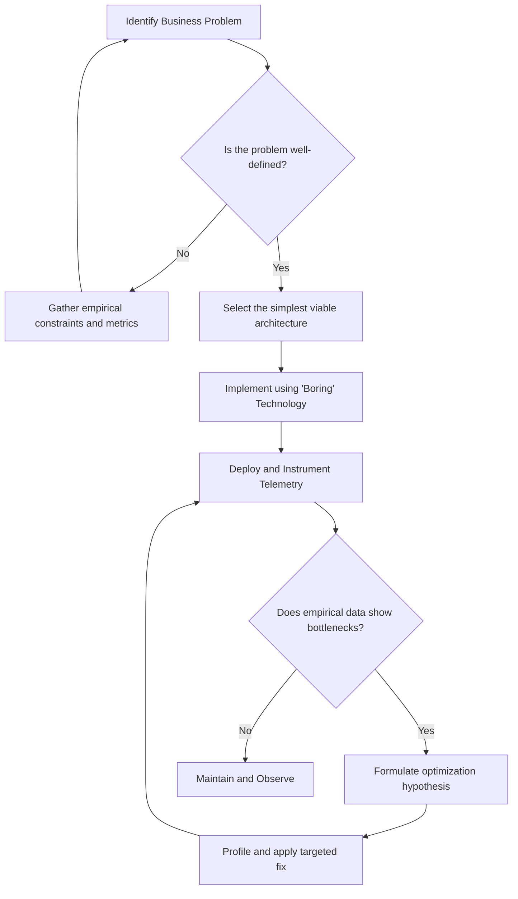
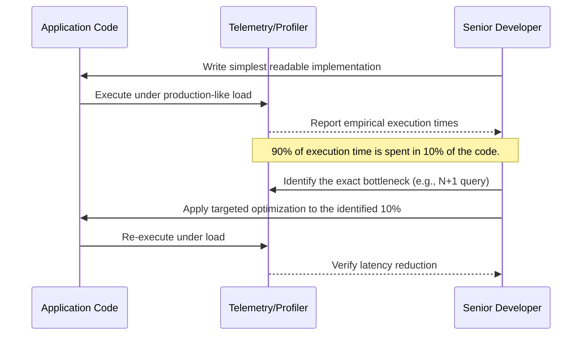
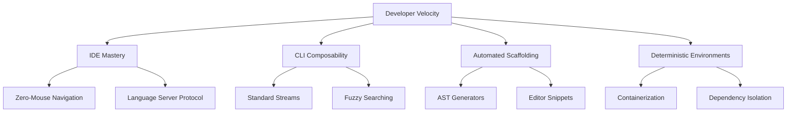
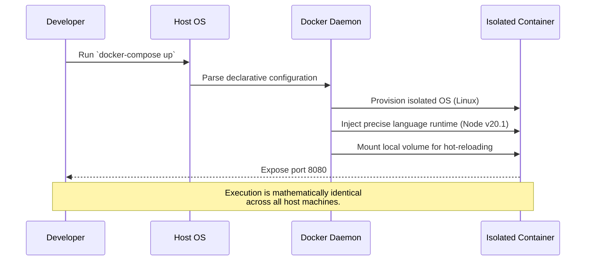
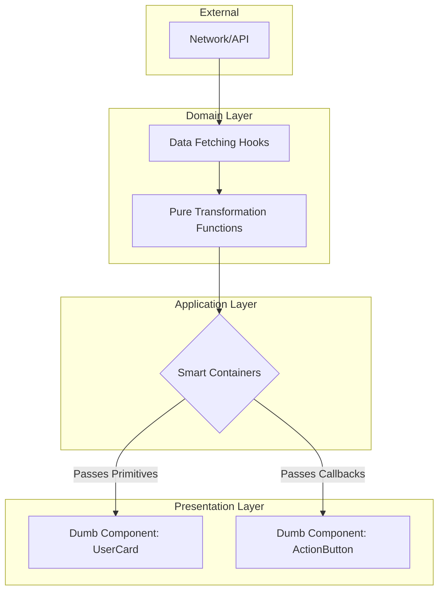
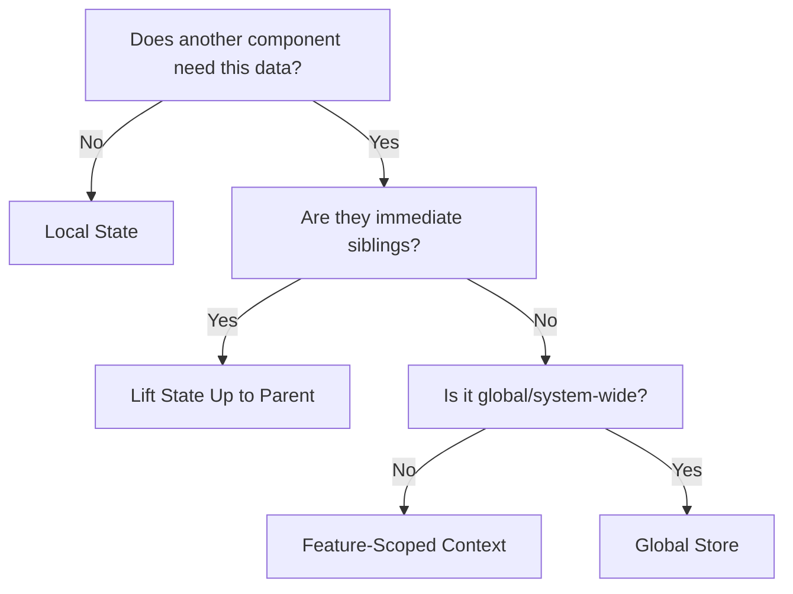
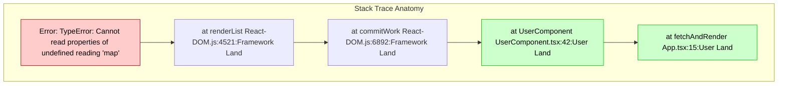
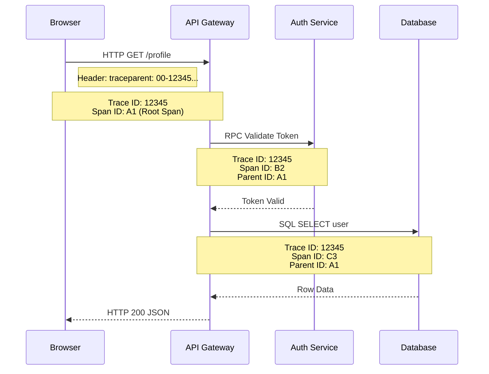
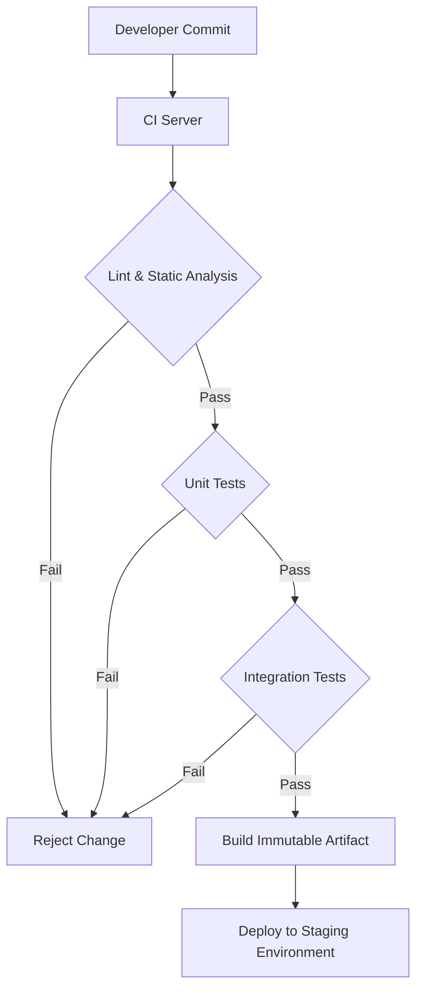
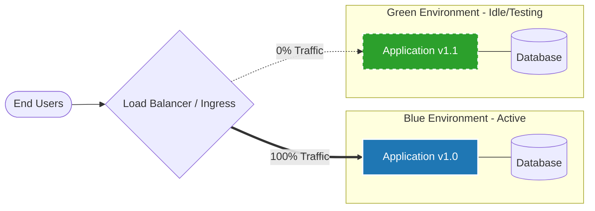

## Table of Contents

- [Strategic Planning & Architectural Restraint](#strategic-planning-architectural-restraint)
  - [1. Defining Empirical Requirements](#1-defining-empirical-requirements)
  - [2. The Superiority of the "Boring" Stack](#2-the-superiority-of-the-boring-stack)
  - [3. The Fallacy of Premature Optimization](#3-the-fallacy-of-premature-optimization)
  - [4. Designing for Inevitable Systemic Failure](#4-designing-for-inevitable-systemic-failure)
- [Development Velocity & Tooling Mastery](#development-velocity-tooling-mastery)
  - [The IDE as an Extension of Mind](#the-ide-as-an-extension-of-mind)
  - [Command Line Tooling and Composability](#command-line-tooling-and-composability)
  - [Automated Scaffolding and Snippets](#automated-scaffolding-and-snippets)
  - [Deterministic Local Environments](#deterministic-local-environments)
- [Code Architecture & Maintainability](#code-architecture-maintainability)
  - [State Management Heuristics](#state-management-heuristics)
  - [Pure Functions & Predictability](#pure-functions-predictability)
  - [Principle of Least Privilege in Data Access](#principle-of-least-privilege-in-data-access)
- [Debugging & Telemetry Tactics](#debugging-telemetry-tactics)
  - [1. Browser Developer Tools: Empirical Observation](#1-browser-developer-tools-empirical-observation)
  - [2. Structural Interpretation of Stack Traces](#2-structural-interpretation-of-stack-traces)
  - [3. Structured Logging](#3-structured-logging)
  - [4. OpenTelemetry and Distributed Tracing](#4-opentelemetry-and-distributed-tracing)
- [Continuous Integration & Defensive Deployment](#continuous-integration-defensive-deployment)
  - [Trunk-Based Development: A Single Source of Truth](#trunk-based-development-a-single-source-of-truth)
  - [Automated Testing Enforcement: The Apparatus of Verification](#automated-testing-enforcement-the-apparatus-of-verification)
  - [Blue-Green Deployments: The Controlled Experiment](#blue-green-deployments-the-controlled-experiment)
  - [Feature Flags: Decoupling Deployment from Release](#feature-flags-decoupling-deployment-from-release)
  - [Conclusion: The Empirical Engineering Mandate](#conclusion-the-empirical-engineering-mandate)


# CS - Senior Developer Tips for Building Websites

## Strategic Planning & Architectural Restraint

In the study of optics, an image is not made clear by allowing every available ray of light to strike the surface; it is made clear by a carefully constrained aperture that forces the light to converge. The construction of software systems operates on the identical principle. Novices widen the aperture prematurely, allowing a flood of novel frameworks, distributed patterns, and complex abstractions to distort the system's baseline logic. The senior developer exercises strict architectural restraint. We must treat the system as a physical phenomenon: subject to gravity, friction, and entropy. Every architectural decision is a hypothesis; it must be grounded in empirical necessity rather than speculation.



### 1. Defining Empirical Requirements

Before a single line of code is written, the boundaries of the system must be measured. Development without empirical constraints is indistinguishable from guesswork. Senior developers do not ask, "What scale might we need?" They ask, "What are the physical limits of the current hardware, and what is the exact throughput required by the client today?"

| Theoretical Assumption (The Novice) | Empirical Constraint (The Senior) | Instrumentation / Measurement Tool |
| :--- | :--- | :--- |
| "We need real-time websocket synchronization for all users." | "The data changes once per hour. A 60-second cache with standard HTTP polling is sufficient." | Traffic analysis, database write-frequency logs. |
| "We must build for millions of concurrent connections." | "Current user base is 500 daily active users. A single standard server can handle 10,000 requests per second." | Load testing (e.g., Apache JMeter, k6). |
| "We need a distributed microservices architecture." | "The domain logic is highly coupled. Network latency between services will exceed our 200ms response budget." | Network boundary profiling, latency tracing. |

You must extract hard numbers. Define the maximum acceptable latency, the exact shape of the data payloads, and the required uptime. Write these constraints down. If a proposed technological choice does not solve a measurable constraint documented in this phase, it must be discarded. Complexity is a liability that must be justified by immediate, measurable utility.

### 2. The Superiority of the "Boring" Stack

Technology selection is not an aesthetic exercise; it is risk management. Senior developers default to the "boring" stack—technologies that have survived a decade of brutal, real-world attrition. PostgreSQL, boring HTML forms, server-rendered pages, and monolithic application servers are highly predictable. Their failure modes, memory leaks, and operational ceilings are exhaustively documented.

```javascript
// The Novice Approach: Distributed, fragile, heavily abstracted
async function handleUserRequest(req, res) {
    try {
        // Requires maintaining 3 separate systems, network latency, and eventual consistency
        const auth = await grpcClient.invoke('auth-service', req.headers);
        const data = await redisCache.get(`user:${auth.id}`);
        await messageQueue.publish('user-activity', { id: auth.id, action: 'read' });
        return res.json(data);
    } catch (err) {
        // Cascading failures are difficult to trace across service boundaries
    }
}

// The Senior Approach: Cohesive, predictable, fast
async function handleUserRequest(req, res) {
    try {
        // Single database boundary, immediate consistency, easy to profile
        const user = await db.query(
            `SELECT u.data FROM users u WHERE u.session_token = $1`, 
            [req.cookies.session]
        );
        return res.json(user);
    } catch (err) {
        log.error("Database query failed", err);
        return res.status(500).send("Internal Error");
    }
}
```

When you choose a hyper-modern, untested framework, you are volunteering to act as an unpaid quality assurance tester for its creators. You will discover its undocumented edge cases in a production environment, usually during a high-traffic event. By selecting a mature, monolithic stack, you reduce the surface area of the unknown. You can focus your mental bandwidth on solving the actual business problem rather than debugging the plumbing of a distributed message queue that you never needed in the first place.

### 3. The Fallacy of Premature Optimization

Optimization without measurement is merely superstition. Senior developers fiercely resist the urge to optimize code during the initial drafting phase. They understand that developer intuition regarding where a system will bottleneck is almost universally incorrect. 



Instead of prematurely caching data, writing complex bitwise operations, or denormalizing databases in anticipation of future load, the senior developer optimizes for *readability and deletability*. Code must be easy to understand and easy to replace. 

Once the system is running, we apply the scientific method. We introduce profiling tools to observe the executing code. If an endpoint is slow, we do not guess; we look at the flame graph. We isolate the function consuming the most CPU cycles or the database query scanning too many rows. We formulate a hypothesis ("Adding a composite index on `(user_id, status)` will reduce query time by 80%"), we deploy the index, and we measure the result. Optimization is a surgical procedure applied only to areas where empirical evidence demands it.

### 4. Designing for Inevitable Systemic Failure

A system is not defined by how it behaves under ideal conditions, but by how it degrades when its dependencies collapse. The empirical reality of computer networks is that they are hostile environments. Packets will be dropped, databases will lock, third-party APIs will return malformed data, and memory will exhaust. 

| Component | Inevitable Failure State | Senior Engineering Mitigation |
| :--- | :--- | :--- |
| **External API** | Rate limits exceeded or silent timeouts. | Implement Circuit Breakers. Halt requests immediately after 3 failures to prevent connection pool exhaustion. Provide cached fallback data. |
| **Database** | High CPU load causing query queuing and deadlocks. | Implement strict query timeouts (e.g., `statement_timeout = 5s`). It is better to fail one request quickly than to lock the entire table and crash the application. |
| **Job Queue** | Worker nodes crash mid-process, leaving data in a partial state. | Design all background jobs for Idempotency. A job must be safe to execute twice without corrupting the database. |
| **Client UI** | Network connection drops while submitting a form. | Implement graceful degradation. Save state to `localStorage` prior to submission. Disable submission buttons immediately upon click to prevent duplicate POSTs. |

Planning for failure requires architectural pessimism. You must assume that any code executing over a network boundary will eventually fail. To counter this, senior developers implement bounded contexts. If the recommendation engine goes offline, the core checkout process must remain operational. We use retry mechanisms with exponential backoff to handle transient network blips, and we enforce strict timeouts on all external calls. By treating failure as a baseline characteristic of the system rather than an anomaly, we construct websites that bend rather than break.

- - -

## Development Velocity & Tooling Mastery



Observation of the software development lifecycle reveals that the primary bottleneck is rarely machine execution time; it is the latency between a developer's intention and its materialization in code. Velocity is not achieved by typing faster, but by structurally eliminating friction. A scientific approach to web development treats the local environment as an apparatus that must be calibrated for maximum throughput and exact reproducibility. We achieve this through mastery of the editor, composable command-line tools, automated generation of repetitive structures, and the isolation of runtime environments.

### The IDE as an Extension of Mind

| Action Category | Target Mechanism | Cognitive Benefit |
| :--- | :--- | :--- |
| **Navigation** | Fuzzy file search (`Ctrl+P` / `Cmd+P`) | Bypasses visual scanning of directory trees. |
| **Symbol Resolution** | Go to Definition (`F12` / `gd`) | Eliminates manual searching across multiple files. |
| **Refactoring** | Symbol Renaming (`F2` / `cgn`) | Ensures global, AST-aware consistency without regex errors. |
| **Window Management** | Split manipulation (`Ctrl+w` / `Cmd+\`) | Maintains context across multiple files without hiding reference data. |
| **Selection** | Multiple Cursors (`Ctrl+D` / `Cmd+D`) | Enables parallel editing of repeated local structures. |

The physical mechanics of programming dictate that switching the hand from the keyboard to the mouse introduces an average latency of one to two seconds per action. Over a single session, this compounds into a severe cognitive interruption, breaking the state of flow. Mastery of the Integrated Development Environment (IDE) demands a strict zero-mouse policy for routine actions. 

Furthermore, the modern IDE is not merely a text editor; it is a graphical interface for the Language Server Protocol (LSP). The LSP parses the Abstract Syntax Tree (AST) of your codebase in real-time. Developers must internalize the keyboard shortcuts that query this AST. Instead of manually utilizing `Find in Files` to locate a variable's usage, invoking "Find All References" guarantees mathematically accurate results because it understands the code's lexical scope, not just its string representation. By configuring your editor to format on save and lint on keystroke, you offload the cognitive burden of stylistic compliance entirely to the machine.

### Command Line Tooling and Composability

```bash
# Example: Aggregating shell aliases for high-frequency actions
alias gco="git checkout $(git branch -a | fzf)"
alias dc-nuke="docker-compose down -v --rmi all --remove-orphans"
alias serve="npx serve -s build -l 3000"

# Example: Chaining small utilities to process structured data
cat server.log | grep "ERROR" | jq '.message' | sort | uniq -c | sort -nr
```

Graphical user interfaces hide complexity but fundamentally limit composability. The Command Line Interface (CLI) adheres to the Unix philosophy: programs should do one thing perfectly and communicate via standard streams (stdin, stdout, stderr). This allows developers to chain independent tools together to create ad-hoc, highly specific data processing pipelines.

To accelerate velocity, developers must curate a dotfile (`.bashrc`, `.zshrc`) containing aliases and functions for high-frequency operations. Typing `git checkout feature-branch-name` is inefficient. Piping the output of `git branch` into a fuzzy finder like `fzf` allows you to navigate branches using partial keystrokes. Similarly, parsing logs or JSON responses directly in the terminal using `grep`, `awk`, and `jq` is exponentially faster than writing custom scripts or pasting data into browser-based formatters. The terminal is a read-eval-print loop (REPL) for your entire operating system; mastering it grants immediate, scriptable access to the file system, network layer, and version control.

### Automated Scaffolding and Snippets

```json
// Example: VS Code snippet for a strictly typed React component
{
  "Strict React Component": {
    "prefix": "rc",
    "body": [
      "import type { FC } from 'react';",
      "",
      "interface ${1:ComponentName}Props {",
      "  ${2:propName}: ${3:string};",
      "}",
      "",
      "export const ${1:ComponentName}: FC<${1:ComponentName}Props> = ({ ${2:propName} }) => {",
      "  return (",
      "    <div className=\"$1-wrapper\">",
      "      {${2:propName}}",
      "    </div>",
      "  );",
      "};"
    ],
    "description": "Generate a boilerplate React component with TypeScript interfaces"
  }
}
```

Typing boilerplate code is a mechanical failure. If a file structure or syntax pattern is predictable, it must be automated. Manual typing introduces typographical errors and consumes time that should be allocated to complex logic. 

Scaffolding occurs on two levels: micro and macro. On the micro level, editor snippets (as demonstrated above) utilize tab-stops and variable injection to generate entire functions, classes, or test blocks from a two-letter prefix. On the macro level, developers should employ CLI generators (like `plop.js` or custom bash scripts) to scaffold entire feature domains. When you require a new application route, a scaffolding tool should simultaneously generate the route controller, the view component, the test file, and the styling module, automatically wiring the necessary imports. This ensures architectural consistency across the project; every developer generates modules that adhere to the exact same structural topology.

### Deterministic Local Environments



```yaml
# Example: docker-compose.yml ensuring environmental parity
version: '3.8'
services:
  api:
    build: 
      context: .
      target: development
    ports:
      - "8080:8080"
    volumes:
      - ./src:/usr/src/app/src
    environment:
      - NODE_ENV=development
      - DATABASE_URL=postgres://user:pass@db:5432/app
    depends_on:
      - db
  db:
    image: postgres:15-alpine
    ports:
      - "5432:5432"
    volumes:
      - pgdata:/var/lib/postgresql/data

volumes:
  pgdata:
```

The hypothesis "it works on my machine" is an empirical failure in software engineering. A rigorous approach to web development requires state reproducibility. Variations in global host machine configurations—differing Node.js versions, globally installed Python packages, or conflicting database instances—introduce variables that invalidate tests and corrupt local execution.

Containerization via Docker isolates the application's runtime dependencies from the host operating system. By defining the infrastructure declaratively in a `Dockerfile` and `docker-compose.yml`, the local environment becomes an exact, version-controlled replica of the production environment. When a new developer joins a project, or when a senior developer switches machines, provisioning the infrastructure requires zero manual installation of databases, caches, or language runtimes. A single command (`docker-compose up`) orchestrates the entire topological network. Volume mounting allows the container to read the host's source code in real-time, preserving hot-reloading capabilities while executing the code within a sterile, deterministic vacuum. This eliminates environment-specific bugs, shifting the developer's focus entirely from operational maintenance to software construction.

- - -

## Code Architecture & Maintainability



```typescript
// Anti-pattern: Coupled Logic and Presentation
function UserProfile({ userId }: { userId: string }) {
  const [user, setUser] = useState(null);
  useEffect(() => {
    fetch(`/api/users/${userId}`).then(res => res.json()).then(setUser);
  }, [userId]);

  if (!user) return <Spinner />;
  return <div>{user.name} - {user.status}</div>;
}

// Empirical Pattern: Segregated Components
// 1. Hook for data (Domain)
function useUser(userId: string) {
  // fetch logic here...
}

// 2. Pure UI Component (Presentation)
function UserProfileView({ name, status }: { name: string, status: string }) {
  return <div>{name} - {status}</div>;
}

// 3. Smart Container (Application)
function UserProfileContainer({ userId }: { userId: string }) {
  const { user, loading } = useUser(userId);
  if (loading) return <Spinner />;
  return <UserProfileView name={user.name} status={user.status} />;
}
```

A software system's longevity is inversely proportional to its internal entanglement. Architecture is not an abstract philosophy; it is the physical arrangement of code to optimize for human cognition and mechanical predictable execution. To build maintainable websites, we must segregate components strictly by their functional domains. 

When we observe complex, failing front-end systems, the root cause is almost uniformly a violation of boundaries. A component should not fetch data, format it, and render the DOM simultaneously. We segregate systems into three distinct strata: the Presentation Layer, the Application Layer, and the Domain Layer. Presentational components must be "dumb"; they accept data via parameters and emit events. They maintain no knowledge of the network or the database. Container components act as the routing mechanisms, fetching data from the Domain Layer and passing it downward. By isolating presentation from logic, we render the interface entirely testable without mocking network requests, and we allow domain logic to be reused across disparate views. 

### State Management Heuristics



| State Classification | Empirical Definition | Example | Recommended Tool |
| :--- | :--- | :--- | :--- |
| **Local State** | Data used strictly within a single component. | Form inputs, modal toggle, hover states. | `useState`, `useReducer` |
| **Lifted State** | Data shared between immediate sibling components. | Accordion group, sibling list and detail view. | Parent `useState` passed down |
| **Feature State** | Data shared across a specific branch of the DOM tree. | Multi-step checkout wizard, dashboard filters. | React Context, Zustand (scoped) |
| **Global State** | Immutable or highly accessed system-wide data. | User authentication token, UI theme, language. | Redux, Zustand (global) |
| **Server State** | Asynchronous data mirrored from an external database. | User profiles, product catalogs, comments. | TanStack Query, Apollo, SWR |

The distribution of state dictates the rendering performance and cognitive overhead of a frontend application. We must rely on an empirical heuristic: state must live as close to its point of consumption as physically possible. 

Developers frequently err by defaulting to a Global Store for all variables, under the false assumption that centralized data is easier to manage. Observation proves the opposite. When local UI state (such as the open/closed status of a dropdown) is stored globally, any change forces the global state tree to update, triggering widespread, unnecessary render cycles across unrelated component boundaries. 

Rigorously classify your data before storing it. Server state is fundamentally different from UI state; server state is an asynchronous cache of a remote database, subject to latency, failure, and staleness. It must be managed by specialized caching libraries, not a generic state store. Limit global state strictly to data that affects the entire application layout, such as user authorization objects or theme preferences. For everything else, default to local state, lifting it up the DOM tree only when empirical evidence demands it.

### Pure Functions & Predictability

```typescript
// Impure Function: Unpredictable, difficult to test
let currentFormat = "en-US";
function formatCurrencyImpure(amount: number) {
  // Relies on external mutable state
  return new Intl.NumberFormat(currentFormat).format(amount);
}

// Pure Function: Predictable, isolated, cacheable
function formatCurrency(amount: number, locale: string): string {
  // Output relies solely on inputs
  return new Intl.NumberFormat(locale).format(amount);
}
```

Predictability is the cornerstone of engineering. A system that cannot be predicted cannot be trusted. In software, predictability is achieved through pure functions. A pure function adheres to two unbending laws: it must always return the identical output given the identical input, and it must produce zero observable side effects in the external environment.

When we embed domain logic inside component lifecycles or allow functions to read from global window variables, we destroy predictability. The function `formatCurrencyImpure` behaves differently depending on when it is called and what other system processes have occurred. To test it, one must set up a mock environment and carefully manage the global `currentFormat` variable. 

Conversely, `formatCurrency` is pure. It requires no environment setup. It can be tested with a simple assertion, it can be executed in parallel web workers, and its results can be safely memoized to save computational cycles. You must extract all data transformation, mathematical calculation, and string formatting out of your UI components and into isolated, pure utility functions. 

### Principle of Least Privilege in Data Access

```typescript
type User = {
  id: string;
  name: string;
  email: string;
  role: string;
  lastLogin: string;
  paymentStripeId: string; // Sensitive
}

// Anti-pattern: Passing the entire object
function UserAvatar({ user }: { user: User }) {
  // Component has access to email and paymentStripeId, which it does not need.
  // Component re-renders if user.lastLogin changes, even though UI is identical.
  return ;
}

// Empirical Pattern: Principle of Least Privilege
function UserAvatar({ userId, userName }: { userId: string, userName: string }) {
  // Component only knows what it strictly requires.
  return ;
}
```

In security, the principle of least privilege dictates that a module should only possess the permissions strictly required to perform its task. We must apply this exact principle to data access within component architecture. Passing complete data objects down the component tree is a widespread and detrimental habit.

Observe the anti-pattern above. By passing the complete `User` object to the `UserAvatar` component, we introduce two distinct mechanical failures. First, we violate encapsulation; a purely visual component now has memory access to sensitive billing identifiers. Second, we destroy rendering performance. Modern UI frameworks rely on shallow equality checks to determine if a component should update. If the user logs in, the `lastLogin` timestamp changes, creating a new `User` object reference. The `UserAvatar` component will re-render, expending CPU cycles, despite the fact that the `id` and `name` used to draw the avatar remain entirely unchanged.

By enforcing the principle of least privilege—passing only primitive strings or numbers—we construct an interface that is highly resistant to unnecessary rendering and tightly secured against unauthorized data consumption. Components must declare their exact data requirements explicitly. This explicitness acts as self-documenting code, ensuring that any engineer can look at a component's signature and immediately comprehend its exact dependencies.

- - -

## Debugging & Telemetry Tactics

Debugging is the empirical study of an anomaly within a system. A novice guesses at the root cause; a senior developer instruments the system and observes. In modern web architecture, state is distributed across the client Document Object Model (DOM), the network, and multiple backend microservices. Relying on intuition is mathematically inefficient. We must deploy rigorous telemetry to make the invisible visible, capturing structured data that allows us to reconstruct the exact state of the application at the precise moment of failure. 

### 1. Browser Developer Tools: Empirical Observation

The browser is a complex rendering engine and JavaScript runtime. Using `console.log` is a primitive instrument. Senior developers utilize the full suite of browser developer tools to pause execution, inspect memory, and simulate adverse network conditions.

| Technique | Purpose | Empirical Value |
| :--- | :--- | :--- |
| **Conditional Breakpoints** | Pausing execution only when a specific boolean condition evaluates to true. | Isolates the anomaly without forcing the developer to manually step through thousands of loop iterations or animation frames. |
| **DOM Breakpoints** | Pausing execution when a DOM node is modified, its attributes change, or it is removed. | Rapidly identifies which isolated JavaScript module or third-party library is responsible for an unexpected UI mutation. |
| **Network Throttling** | Simulating 3G, Edge, or offline network conditions. | Validates application resilience, timeout thresholds, and race conditions that only manifest under high latency. |
| **Heap Snapshots** | Comparing memory allocation before and after an operation. | Identifies detached DOM nodes and un-garbage-collected event listeners causing memory leaks over long sessions. |
| **Local Overrides** | Intercepting network requests to serve modified local files over production data. | Tests a hypothesized fix against production infrastructure and real data without deploying code. |

```javascript
// Beyond primitive logging: Advanced Console Instrumentation
console.time("Render Matrix");
const matrix = computeComplexMatrix(10000);
console.timeEnd("Render Matrix"); // Measures exact execution duration in milliseconds

// Outputs structured arrays or objects as a readable table for visual inspection
console.table([{ id: 1, state: 'idle' }, { id: 2, state: 'active' }]);

// Emits a full stack trace to the console without throwing an exception
console.trace("Execution reached this isolated branch");

// Programmatically triggers the DevTools debugger if tools are open
function criticalOperation(data) {
  if (!data.isValid) {
    debugger; 
  }
  processState(data);
}
```

### 2. Structural Interpretation of Stack Traces

A stack trace is a historical record of function calls leading to an exception. Novices often discard them if they appear overwhelmingly large. Senior developers parse them structurally, filtering out framework noise to locate the boundary between user-authored code and library code.



When interpreting stack traces, apply the following rigorous method:
1. **Identify the Exception Type and Message:** The top line dictates the nature of the failure. A `TypeError` implies a data structure mismatch or null reference; a `ReferenceError` implies scoping constraints were violated; a `NetworkError` implies Input/Output failure.
2. **Scan for User Land Boundaries:** Read strictly from top to bottom. Ignore the internal execution frames of open-source libraries (e.g., `react-dom.development.js`, `express/lib/router`). Stop at the first file that you or your organization authored. This boundary is statistically the highest probability source of the anomaly.
3. **Trace the Asynchronous Boundary:** In modern JavaScript, asynchronous operations (`Promises`, `async/await`) sever the synchronous stack trace. The engine often loses the context of the function that originally initiated the asynchronous IO call. Look for the closest `await` or `then` block in your codebase to understand the preceding state.
4. **Source Map Translation:** In production environments, JavaScript is heavily minified. A stack trace reading `at a.b (app.min.js:1:245)` is useless. You must securely upload source maps to your telemetry platform during the build pipeline. This allows the platform to translate the minified coordinates back into the original TypeScript or JavaScript coordinates (`at calculateTax (cart.ts:45:12)`).

### 3. Structured Logging

Text-based logs are inadequate at scale. When a system processes thousands of concurrent requests, searching through flat text files with string-matching tools like `grep` is slow and error-prone. Structured logging emits log entries as machine-readable objects, typically strictly formatted JSON. This allows log aggregation systems to index, filter, and mathematically query the telemetry data.

| Feature | Unstructured Logging | Structured Logging |
| :--- | :--- | :--- |
| **Format Structure** | `[INFO] User 123 failed to checkout at 10:45 AM` | `{"level": "info", "userId": 123, "action": "checkout_failed"}` |
| **Queryability** | Requires complex, brittle Regular Expressions. | Simple key-value indexing (e.g., `action="checkout_failed" AND userId=123`). |
| **Compute Cost** | High. Parsers must extract fields dynamically at ingestion. | Low. Native JSON parsing directly maps to database columns. |
| **Schema Extensibility** | Adding new context breaks existing Regex parsers. | Adding new keys like `{"cartSize": 5}` does not violate the existing schema. |

```javascript
// Node.js example using a high-performance structured logger (e.g., Pino)
const logger = require('pino')();

function processPayment(user, cart) {
  // Inefficient: Concatenated string destroys queryability
  // logger.info(`Processing payment for ${user.id} with total ${cart.total}`);

  // Efficient: Structured JSON object allows filtering by userId or cartTotal
  logger.info({
    event: 'payment_initiated',
    userId: user.id,
    cartTotal: cart.total,
    itemCount: cart.items.length
  }, 'Processing payment transaction');

  try {
    charge(user, cart.total);
  } catch (error) {
    logger.error({
      event: 'payment_failed',
      userId: user.id,
      err_message: error.message,
      err_stack: error.stack
    }, 'Payment transaction failed due to gateway timeout');
  }
}
```

### 4. OpenTelemetry and Distributed Tracing

As web applications evolve into distributed systems, a single user interaction on the frontend may traverse a load balancer, an authentication service, a primary API, and a database. Logs alone cannot correlate a database deadlock in a backend service to the exact button click on the client's browser. 

OpenTelemetry (OTel) is the industry standard for generating and collecting telemetry data. The fundamental unit of distributed tracing is the **Trace**, which represents the entire lifecycle of a request. A trace is composed of multiple **Spans**, each representing a discrete logical operation within that journey.



To implement distributed tracing correctly, adhere to the following principles:

1. **Context Propagation:** The architecture must transmit context (specifically the Trace ID and Parent Span ID) between discrete services. In web applications, this is universally handled via HTTP headers (the W3C `traceparent` header).
2. **Auto-instrumentation:** Do not manually author spans for every database query or HTTP request. Utilize OpenTelemetry libraries to automatically instrument frameworks (Express, React, PostgreSQL drivers). These libraries inject and extract context implicitly, wrapping standard network calls in spans without polluting your business logic.
3. **High-Cardinality Attributes:** Enrich spans with specific, highly variable data. Tag spans with `tenant_id`, `browser_version`, or `feature_flag_status`. If a performance degradation occurs, you can mathematically group traces by these attributes to isolate the specific variable causing the anomaly.

```javascript
// Setting up a manual OpenTelemetry Span to measure a specific operation
const { trace } = require('@opentelemetry/api');
const tracer = trace.getTracer('user-service');

async function getUserProfile(req, res) {
  // Start an active span. The tracer automatically links this to the incoming 
  // trace if the API Gateway passed a valid traceparent header.
  return tracer.startActiveSpan('fetch_user_data', async (span) => {
    try {
      // Inject high-cardinality attributes for aggregation
      span.setAttribute('user.id', req.user.id);
      span.setAttribute('tenant.id', req.user.tenantId);
      
      const data = await db.query('SELECT * FROM users WHERE id = $1', [req.user.id]);
      
      span.setAttribute('db.rows_returned', data.rowCount);
      span.setStatus({ code: 1 }); // Status: OK
      
      res.json(data.rows[0]);
    } catch (error) {
      // Record the exception empirically within the trace
      span.recordException(error);
      span.setStatus({ code: 2, message: error.message }); // Status: ERROR
      res.status(500).send('Internal Server Error');
    } finally {
      span.end(); // Seal the measurement and transmit to the collector
    }
  });
}
```

A senior developer does not guess; they measure. By mastering browser internals, structurally analyzing failures, structuring logs, and tracing distributed state, you replace assumptions with empirical evidence. This is the foundation of building resilient software systems.

- - -

## Continuous Integration & Defensive Deployment

In the study of systems, as in the study of light and optics, we cannot rely on conjecture; we must rely on observation and rigorous testing. To deploy software is to introduce a new variable into an otherwise stable environment. A defensive deployment strategy operates on a fundamental premise: we assume that failure is the natural state of complex systems unless proven otherwise through empirical verification. We must build pipelines that observe, measure, and validate every change before it reaches the user. The methodology of Continuous Integration (CI) and defensive deployment constitutes our modern apparatus for this necessary verification.

### Trunk-Based Development: A Single Source of Truth

The foundation of a reliable system is a single, agreed-upon state of truth. In version control, this is the trunk (or main branch). When developers hoard code in long-lived branches for days or weeks, they accumulate untested assumptions about the system's state. When they finally attempt to merge, these assumptions collide with the reality of what other engineers have concurrently introduced. The result is integration shock: broken builds, complex merge conflicts, and untraceable regressions.

Trunk-based development dictates that all developers merge their changes to the main branch frequently—often multiple times a single day. This practice minimizes deviation. By observing small, incremental changes, we can pinpoint the exact moment a system deviates from its expected behavior. If a commit introduces a defect, the delta is small enough that the cause is immediately obvious, and the remedy is trivial.

```bash
# The empirical approach: frequent integration of small, verifiable changes
git checkout main
git pull origin main
git checkout -b feature/small-observable-change

# Make targeted modifications and write corresponding tests...
git add .
git commit -m "Refactor authentication module for predictable state"
git push origin feature/small-observable-change

# Merge immediately after automated pipeline verification
```

### Automated Testing Enforcement: The Apparatus of Verification

Human observation is flawed and slow; automated tests are our calibrated instruments. A Continuous Integration pipeline must be entirely uncompromising. If a proposed change fails a test, it must not proceed. This is the strict enforcement of empirical standards. We do not deploy on faith; we deploy on mathematical proof.

A robust testing apparatus operates in layers, each designed to measure a specific dimension of the system's structural integrity.

| Test Category | Empirical Purpose | Execution Frequency | Permissible Failure Rate |
| :--- | :--- | :--- | :--- |
| **Unit Tests** | Verify the fundamental properties of isolated functions and logic. | On every commit. | 0% |
| **Integration Tests** | Observe the interactions and contracts between connected components. | On every merge request. | 0% |
| **End-to-End (E2E)** | Measure the system's behavior holistically from the user's perspective. | Post-deployment to staging. | 0% (Flakiness must be fixed immediately) |
| **Load Tests** | Ascertain the system's breaking point under simulated stress. | Pre-release or scheduled. | Defined by SLA thresholds |



### Blue-Green Deployments: The Controlled Experiment

When transitioning a system from one state to another, we must ensure absolute continuity of service. In-place upgrades are hazardous because they destroy the previous known-good state. Blue-green deployment is the architectural equivalent of a controlled scientific experiment with a control group and an experimental group.

We maintain two identical production environments: Blue (currently active) and Green (idle). The new software artifact is deployed exclusively to the Green environment. Here, we conduct final, rigorous observations—health checks, smoke tests, and performance baseline comparisons—without exposing users to potential instability. Once the Green environment is empirically proven stable, we switch the load balancer's routing to point to Green. If anomalies occur, we instantly route traffic back to Blue.



To execute a blue-green deployment safely, the stateful layer requires meticulous handling. Database schemas must be both forward and backward compatible during the transition phase, as both Blue and Green applications may connect to the same data store simultaneously. Destructive schema changes must be broken down into discrete, observable phases: deploy the new column, update code to write to both, update code to read from the new column, and finally, drop the old column.

### Feature Flags: Decoupling Deployment from Release

Deployment is the mechanical act of installing software on a server. Release is the business act of exposing that software to users. Historically, these events occurred simultaneously, creating immense risk. Feature flags allow us to sever this coupling, turning the release process into an adjustable, observable variable.

By wrapping new functionality in conditional logic evaluated at runtime, we deploy dormant code. We can then expose this code to a small, controlled sample of users—a canary release—and monitor our error rates and performance metrics in real-time. If the new code behaves erratically, we disable it instantly via configuration, bypassing the latency of a full system rollback.

```javascript
// Example: A defensive implementation using a feature flag service
import { checkFlag } from './lib/feature-flags';
import { calculateTaxesNew, calculateTaxesLegacy } from './modules/tax-engine';
import { logObservation } from './lib/telemetry';

async function processOrder(order) {
    // We observe the flag state at runtime. 
    // This allows instantaneous revocation of the feature without redeploying.
    const useNewTaxEngine = await checkFlag('enable_new_tax_calculation', order.userId);
    
    if (useNewTaxEngine) {
        try {
            const result = calculateTaxesNew(order);
            logObservation('tax_engine_success', { version: 'new' });
            return result;
        } catch (error) {
            // Defensive fallback: If the experimental logic fails, 
            // record the anomaly and seamlessly fall back to the known-good state.
            logObservation('tax_engine_failure', { error: error.message });
            return calculateTaxesLegacy(order);
        }
    }
    
    return calculateTaxesLegacy(order);
}
```

Feature flags demand strict scientific discipline. They introduce cyclomatic complexity and technical debt if left unchecked. A mature engineering team systematically removes flags once a feature's efficacy is proven and fully released. Every flag must have a strict expiration date to keep the system legible.

### Conclusion: The Empirical Engineering Mandate

Building robust websites and distributed systems is not an act of faith; it is an exercise in applied logic and empirical measurement. A senior developer does not trust that code will work; they construct a mechanism that proves it works, alongside a fail-safe for when it inevitably falters. Continuous Integration enforces the standard of proof. Trunk-based development ensures our operational reality remains singular and coherent. Blue-green deployments provide the laboratory for safe transitions, and feature flags give us granular control over our variables in production. 

To deploy defensively is to acknowledge the limits of human foresight. By relying on rigorous automation, immutable artifacts, and observable metrics, we protect the user from our errors and ensure the system remains a reliable conduit of function and information. We must measure carefully, integrate constantly, and release cautiously.

- - -

## See Also

- [[_Science - Map of Contents|Science MOC]]
