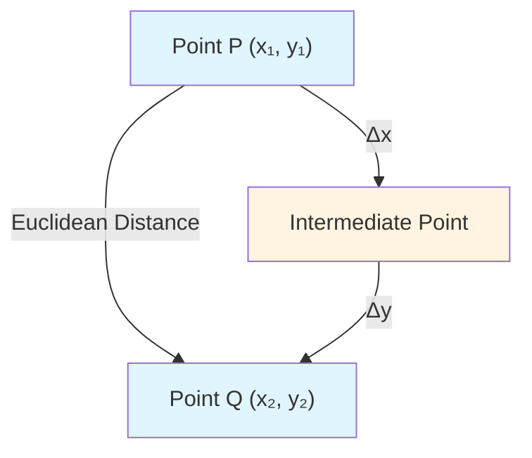
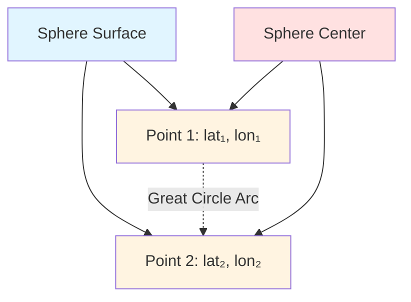
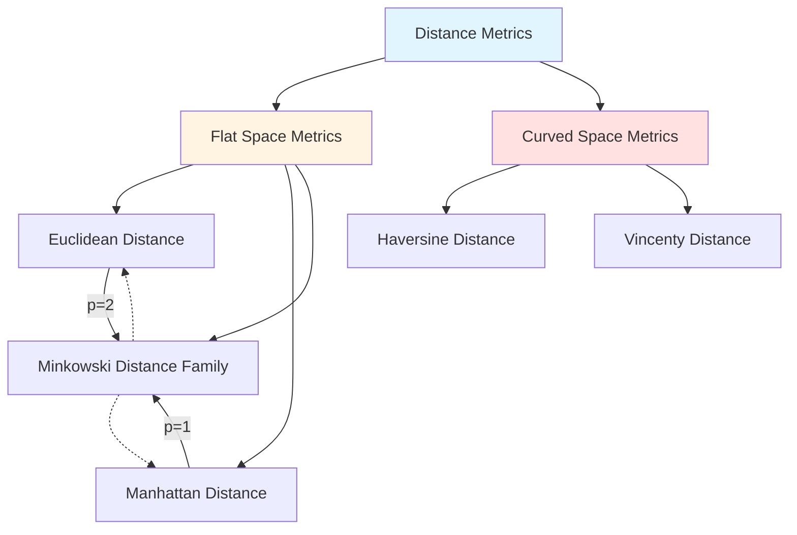
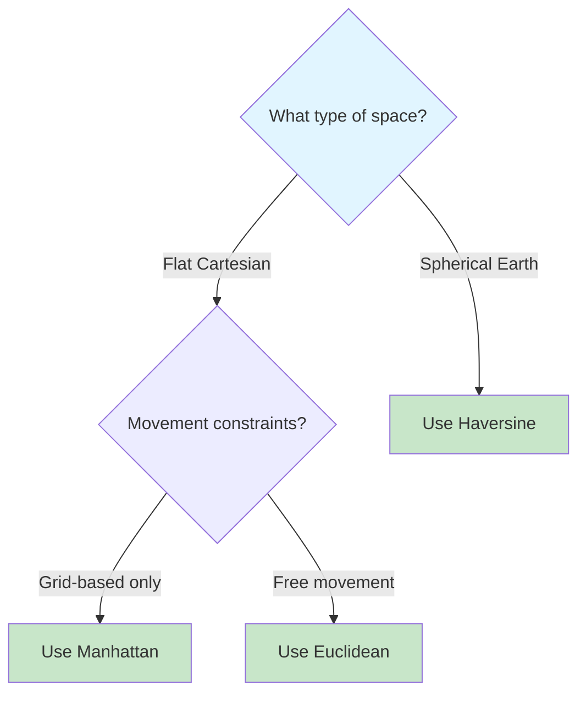

- - -
## Historical Development

Distance metrics emerged from different mathematical and practical needs throughout history. Euclidean distance, rooted in ancient Greek geometry, formalized the intuitive notion of "straight-line" distance in space. Manhattan distance arose from the practical constraints of navigating grid-based city layouts. Haversine distance developed from the need to calculate great-circle distances on spherical surfaces, crucial for navigation and astronomy.
## I. Euclidean Distance

### Origin and First Use
Euclidean distance derives its name from [[Euclid|Euclid]] of Alexandria (c. 300 BCE), whose seminal work _Elements_ laid the foundations of classical geometry. While Euclid didn't explicitly formulate the distance formula as we know it today, his geometric principles underpinned the concept. The algebraic formulation emerged much later with the development of coordinate geometry by René Descartes in the 17th century and was fully formalized with the advent of vector spaces in the 19th century.
### Definition
Euclidean distance measures the straight-line distance between two points in Euclidean space. For two points **p** = (p₁, p₂, ..., pₙ) and **q** = (q₁, q₂, ..., qₙ) in n-dimensional space:
$$d_{Euclidean}(\mathbf{p}, \mathbf{q}) = \sqrt{\sum_{i=1}^{n}(q_i - p_i)^2}$$
In two dimensions, this simplifies to the familiar Pythagorean theorem:
$$d_{Euclidean}(p, q) = \sqrt{(q_1 - p_1)^2 + (q_2 - p_2)^2}$$
### Geometric Interpretation



## II. Manhattan Distance

### Origin and First Use

Manhattan distance, also known as taxicab or city block distance, takes its name from the grid layout of Manhattan, New York City. The metric reflects the distance a taxi would travel on a rectangular street grid. While the mathematical concept existed earlier in lattice theory, its popularization in computer science and data analysis occurred in the mid-20th century, particularly with the rise of digital computing and pattern recognition algorithms in the 1950s and 1960s.
### Definition
Manhattan distance measures the sum of absolute differences between coordinates. For two points **p** and **q** in n-dimensional space:
$$d_{Manhattan}(\mathbf{p}, \mathbf{q}) = \sum_{i=1}^{n}|q_i - p_i|$$
In two dimensions:

$$d_{Manhattan}(p, q) = |q_1 - p_1| + |q_2 - p_2|$$

### Geometric Interpretation

```mermaid
graph LR
    A["Point P"] -->|horizontal: |Δx|| B["Corner"]
    B -->|vertical: |Δy|| C["Point Q"]
    A -.->|Euclidean: √(Δx² + Δy²)| C
    style A fill:#e1f5ff
    style B fill:#fff4e1
    style C fill:#e1f5ff
```

## III. Haversine Distance
### Origin and First Use
The haversine formula has its roots in spherical trigonometry, dating back to medieval Islamic mathematics and European navigation in the Age of Exploration. The term "haversine" (half-versed-sine) was coined in the 19th century. The formula gained prominence with the publication of haversine tables, which simplified navigation calculations before the advent of electronic computers. It was extensively used in maritime and aerial navigation from the 18th century onward.
### Definition
Haversine distance calculates the great-circle distance between two points on a sphere given their longitudes and latitudes. For two points with coordinates (φ₁, λ₁) and (φ₂, λ₂) where φ represents latitude and λ represents longitude:

$$a = \sin^2\left(\frac{\varphi_2 - \varphi_1}{2}\right) + \cos(\varphi_1) \cdot \cos(\varphi_2) \cdot \sin^2\left(\frac{\lambda_2 - \lambda_1}{2}\right)$$

$$c = 2 \cdot \arctan2\left(\sqrt{a}, \sqrt{1-a}\right)$$

$$d_{Haversine} = R \cdot c$$

where R is the radius of the sphere (Earth's mean radius ≈ 6,371 km).

### Geometric Interpretation



## Comparative Analysis

### Key Differences

|Aspect|Euclidean|Manhattan|Haversine|
|---|---|---|---|
|**Space Type**|Flat Euclidean space|Rectilinear/grid space|Spherical surface|
|**Path Type**|Straight line|Orthogonal segments|Great circle arc|
|**Dimensionality**|Any n-dimensional|Any n-dimensional|Specifically 2D on sphere|
|**Computation**|Moderate (square root)|Simple (absolute values)|Complex (trigonometric)|
|**Use Cases**|General distance, ML clustering|Grid navigation, feature similarity|Geographic coordinates, navigation|
|**Coordinate System**|Cartesian|Cartesian|Spherical (lat/lon)|

### Mathematical Properties

|Property|Euclidean|Manhattan|Haversine|
|---|---|---|---|
|**Metric Space**|Yes|Yes|Yes|
|**Triangle Inequality**|Satisfied|Satisfied|Satisfied|
|**Rotation Invariant**|Yes|No|N/A (spherical)|
|**Computational Complexity**|O(n)|O(n)|O(1) for fixed dimension|

### Distance Comparison Example

For two points P(0, 0) and Q(3, 4) in 2D Cartesian space:

|Metric|Calculation|Result|
|---|---|---|
|**Euclidean**|√((3-0)² + (4-0)²) = √(9 + 16)|5.0|
|**Manhattan**|\|3-0\| + \|4-0\||7.0|
|**Haversine**|Not applicable (requires lat/lon on sphere)|N/A|

### Relationship Visualization



### When to Use Each Metric



## Applications

### Euclidean Distance

- Machine learning algorithms (k-means clustering, k-NN classification)
- Computer vision and image processing
- Physics simulations
- Pattern recognition

### Manhattan Distance

- Urban planning and routing
- Chess and game theory (king's moves)
- Warehouse logistics
- Circuit design in VLSI

### Haversine Distance

- GPS navigation systems
- Flight path calculations
- Geographic information systems (GIS)
- Earthquake epicenter calculations
- Astronomy and celestial navigation

## Conclusion

These three distance metrics represent fundamental approaches to quantifying separation in different mathematical spaces. Euclidean distance captures our intuitive understanding of physical distance in flat space, Manhattan distance reflects constrained movement in rectilinear environments, and Haversine distance accounts for the curvature of spherical surfaces. Understanding their origins, mathematical formulations, and appropriate applications is essential for fields ranging from data science to navigation engineering.

## See Also

- [[_Science - Map of Contents|Science MOC]]
