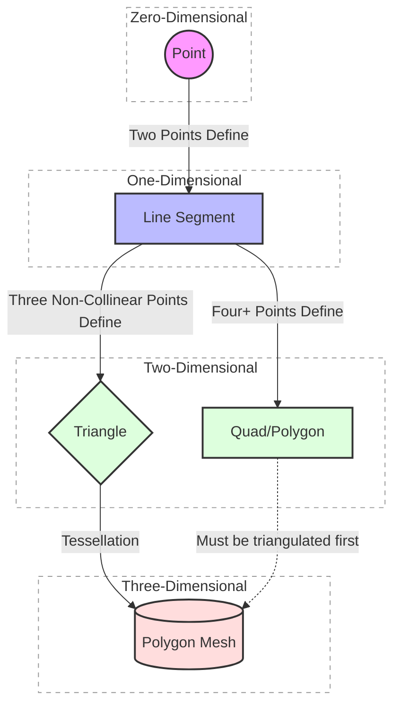
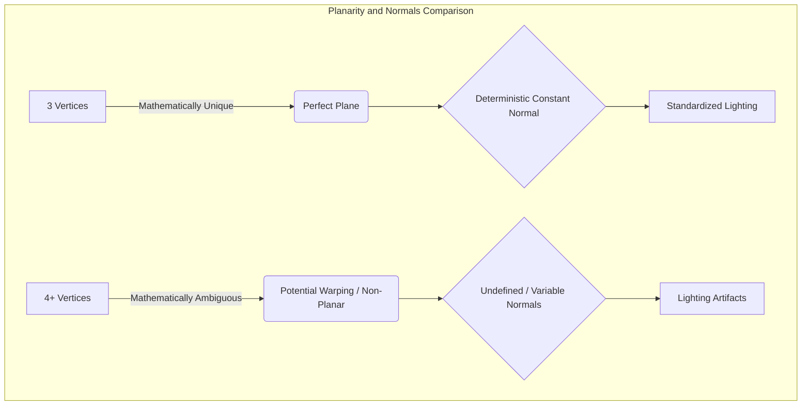
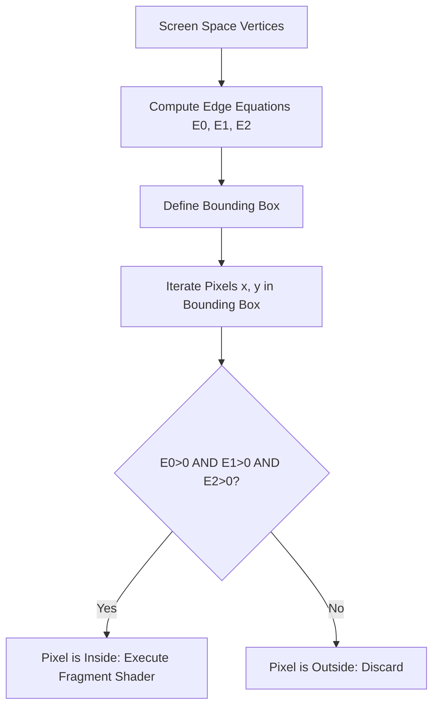
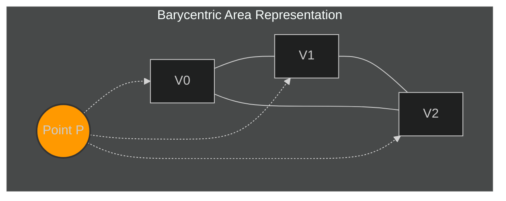
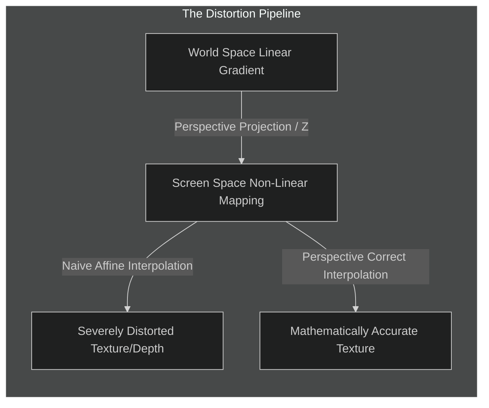
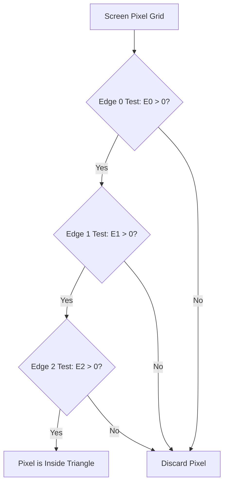
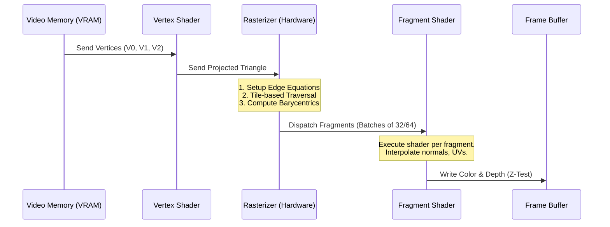

## Introduction: The Primitives of Digital Geometry

| Primitive Type    | Minimum Vertices | Guaranteed Planar? | Guaranteed Convex? | Barycentric Interpolation | Computational Cost | Hardware Support     |
| :---------------- | :--------------: | :----------------: | :----------------: | :------------------------ | :----------------- | :------------------- |
| **Point**         |        1         |        N/A         |        N/A         | N/A                       | Lowest             | Native               |
| **Line Segment**  |        2         |        N/A         |        N/A         | Linear (1D)               | Very Low           | Native               |
| **Triangle**      |        3         |      **Yes**       |      **Yes**       | **Trivial (2D)**          | **Low**            | **Native / Optimal** |
| **Quadrilateral** |        4         |         No         |         No         | Bilinear (Ambiguous)      | Moderate           | Often Triangulated   |
| **N-gon**         |      N > 3       |         No         |         No         | Complex                   | High               | Software Emulated    |


The grand enterprise of digital geometry and by extension, the entire field of computer graphics rests upon a profound philosophical and mathematical translation: the conversion of continuous, analytical reality into discrete, quantifiable representations. In the physical world, a surface is a continuous expanse, an infinite set of infinitesimal points mathematically described by equations of curves, spheres, and complex parametric manifolds. Yet, the architecture of modern computation is fundamentally discrete. Memory is finite, processing cycles are quantized, and the final output medium the digital display is a rigidly structured grid of pixels. To bridge this chasm between the infinite continuum of reality and the finite matrix of the screen, we must decompose complex forms into their most elementary, indivisible constituent parts. These fundamental building blocks are known as geometric primitives.

To understand why the triangle has ascended to its position of absolute supremacy in rendering, we must embark on a rigorous examination of dimensionality and spatial definition. We begin at the absolute void of dimension: the point. In Euclidean geometry, a point possesses location but lacks magnitude; it is a coordinate in space, an anchor denoting "where" but conveying nothing of "what." While points are the foundational data structures—the vertices that hold spatial information—they are insufficient for rendering continuous surfaces. A scatter plot of points, no matter how dense, leaves gaps. It does not define an interior or an exterior, nor does it establish a continuous boundary capable of catching light, casting shadows, or occluding objects behind it. 

Ascending to the first dimension, we connect two points to form a line segment. A line possesses length and direction but lacks width and area. Wireframe models, constructed entirely of lines, provide a skeletal understanding of shape and volume. They are computationally inexpensive to project and draw, and indeed, early flight simulators and computer-aided design (CAD) systems relied heavily upon them. However, lines suffer from the same fundamental limitation as points when attempting to simulate solid reality: they cannot be shaded. A line has no surface area across which a color gradient can be interpolated, nor does it possess a distinct "front" or "back" face to react realistically to virtual photons. To render a solid object, we must cross the threshold into two-dimensional topology. We must define a surface.

The intuitive leap might lead one to assume that any two-dimensional polygon a square, a pentagon, or an arbitrary n-gon would serve equally well as a foundational primitive. Human perception and architectural design often favor the right angle and the quadrilateral; a cube is constructed of six squares, a room of rectangular walls. Why, then, does the rasterization pipeline largely reject the quad in favor of the triangle? The answer lies in the unforgiving rigor of spatial mathematics and the relentless demand for computational determinism.

Consider the quadrilateral, defined by four vertices. In a theoretical, perfectly modeled environment, those four vertices might perfectly align on a single mathematical plane. However, in the chaotic reality of dynamic simulation—where vertices are constantly subjected to floating-point imprecision, skeletal animation transformations, and physical deformations—a catastrophic topological failure almost inevitably occurs: the vertices lose coplanarity. If one vertex of a quadrilateral moves out of alignment with the other three, the polygon is no longer flat. It becomes a warped, non-planar surface resembling a twisted piece of paper. A non-planar polygon presents a severe ambiguity for the rendering engine. How should the light be calculated across a surface that bends in undefined ways? Where precisely is the normal vector pointing? Furthermore, a quadrilateral can be concave; it can fold in on itself, forming a "dart" shape. Rasterizing a concave or non-planar polygon requires complex, mathematically expensive algorithms to subdivide and resolve the ambiguities before pixels can be drawn.

Herein lies the transcendent, unassailable elegance of the triangle. The triangle is the absolute minimal geometric entity required to define a two-dimensional surface. It is defined by exactly three non-collinear vertices. 

The profound power of the triangle stems from two inescapable mathematical truths. First, **any three non-collinear points in three-dimensional space are guaranteed to be coplanar**. They define one, and only one, perfectly flat plane. It is mathematically impossible to twist or warp a triangle. No matter how its vertices are translated, rotated, or subjected to rounding errors, the surface it bounds remains resolutely flat and mathematically well-defined. This absolute guarantee of coplanarity eliminates a massive class of computational ambiguities. A rendering engine never has to test whether a triangle is flat; it simply knows that it is. The surface normal—the vector perpendicular to the face, critical for all lighting calculations—can be derived instantly and unequivocally via the cross product of its edge vectors.

Second, **a triangle is guaranteed to be convex**. There is no arrangement of three points that can result in a concave shape. A line drawn between any two points within the interior of a triangle will never cross its boundary. This inherent convexity is paramount for the rasterization process. When the hardware needs to determine which pixels fall inside the boundaries of the projected shape, a convex primitive allows for highly optimized, deterministic algorithms. There are no internal corners to account for, no complex winding rules to evaluate. The rasterizer can sweep across the bounding box of the triangle, rapidly testing each pixel against the three edges. 

Beyond its structural immutability, the triangle offers unparalleled efficiency in data interpolation. When rendering a surface, we must calculate the exact attributes—color, depth, texture coordinates, and lighting normals—for every single pixel contained within its area. We only explicitly know these values at the three vertices. To find the values for the pixels inside, we must interpolate. The geometry of the triangle allows for the use of Barycentric coordinates—a beautifully simple and linear coordinate system relative to the three vertices. Barycentric interpolation guarantees a smooth, continuous, and unambiguous blending of values across the face of the triangle. Attempting to perform similar interpolation across a generic quadrilateral, especially a non-planar one, requires significantly more complex bilinear or perspective-correct non-linear interpolation schemes that consume precious silicon real estate and processing cycles.

Therefore, the triangle is not merely a choice among many; it is the fundamental atomic unit of digital geometry. It is the lowest common denominator to which all higher-order surfaces can be reduced. Any complex polygon, any curved parametric surface, any elaborate architectural construct can be, and inevitably must be, tessellated—broken down—into a mesh of interlocking triangles before it is fed to the ravenous maw of the graphics processing unit (GPU). Modern GPUs are not general-purpose geometry processors; they are hyper-specialized, massively parallel triangle-crunching leviathans, with billions of transistors dedicated solely to the rapid projection, clipping, culling, and rasterization of these three-sided primitives. By standardizing on the triangle, hardware engineers have been able to optimize the rendering pipeline to an extreme degree, achieving the staggering throughput of billions of triangles per second required to simulate photorealistic worlds in real-time. The triangle is the bridge between the infinite complexity of form and the discrete reality of the pixel.



- - -

## Mathematical Foundations: The Theoretical Supremacy of the Triangle (Planarity, Convexity, and Simplicity)

At the bedrock of computational geometry and rasterization lies an inescapable mathematical truth: the triangle is the simplest, most perfect geometric primitive. To understand why modern rendering pipelines—from the earliest software rasterizers to the massively parallel architecture of contemporary GPUs—are entirely built around the triangle, we must examine its theoretical supremacy through three fundamental mathematical properties: guaranteed planarity, inherent convexity, and structural simplicity. 

The decision to treat the triangle as the atomic unit of 3D graphics was not an arbitrary historical convention; rather, it is a consequence of linear algebra, topology, and the strict demands of computational efficiency.

### 1. Guaranteed Planarity: The Axiom of Three Points

In three-dimensional Euclidean space ($\mathbb{R}^3$), the definition of a plane requires exactly three non-collinear points. A triangle, being defined by exactly three vertices, is therefore *guaranteed* to be perfectly planar. 

Consider a polygon with four or more vertices (an $n$-gon where $n \geq 4$). As soon as a fourth vertex is introduced, there is absolutely no mathematical guarantee that it lies on the same plane defined by the first three. In rendering, a non-planar polygon—often described as a warped or twisted quad—introduces severe geometric and shading ambiguities. How should light interact with a surface that bends continuously in space? How should a singular normal vector be calculated for a surface that lacks a singular plane?

For a triangle defined by vertices $V_0, V_1, V_2$, the surface normal $\mathbf{\hat{n}}$ is unequivocally and deterministically defined by the normalized cross product of its edges:

$$ \mathbf{\hat{n}} = \frac{(V_1 - V_0) \times (V_2 - V_0)}{\|(V_1 - V_0) \times (V_2 - V_0)\|} $$

This elegant mathematical certainty ensures that lighting calculations (such as Lambertian reflectance or Phong shading), back-face culling, and ray-intersection tests are deterministic and mathematically sound. When the plane equation $Ax + By + Cz + D = 0$ is derived from these three points, it holds true for the entire surface area of the primitive.



### 2. Inherent Convexity and Barycentric Coordinates

A geometric set is defined as strictly convex if the line segment connecting any two points within the set lies entirely within the interior of the set. By definition, all triangles are strictly convex. This property is crucial for rasterization, particularly when determining if a specific screen-space pixel lies "inside" the polygon.

Because of its convexity and its status as a 2-simplex, any point $P$ inside a triangle can be uniquely expressed using **Barycentric Coordinates** $(\alpha, \beta, \gamma)$. These coordinates are normalized scalar weights representing the proportional areas of the sub-triangles formed by the point $P$ and the triangle's vertices.

For vertices $A, B, C$, any point $P$ is defined by the linear combination:
$$ P = \alpha A + \beta B + \gamma C $$
Subject to the strict normalization constraint:
$$ \alpha + \beta + \gamma = 1 $$

The true power of this coordinate system emerges during the interiority test. If $\alpha \geq 0$, $\beta \geq 0$, and $\gamma \geq 0$, the point $P$ lies definitively inside (or on the edge of) the triangle. This allows the rasterizer to test pixel inclusion through rapid algebraic inequalities.

Furthermore, Barycentric coordinates provide a mathematically rigorous framework for interpolating vertex attributes—such as color, depth ($z$), texture coordinates ($u,v$), and vertex normals—across the surface of the triangle.

#### The Complication of Perspective

While linear Barycentric interpolation works perfectly in 2D screen space, projecting 3D geometry onto a 2D screen introduces perspective distortion. Because division by depth ($z$) is a non-linear transformation, linearly interpolating texture coordinates in screen space leads to severe texture swimming and warping. 

To correct this, mathematics provides **Perspective-Correct Interpolation**. Instead of interpolating the attribute $u$ directly, we interpolate $\frac{u}{z}$ and $\frac{1}{z}$ linearly in screen space using the Barycentric coordinates, and then divide the former by the latter at the pixel level:

$$ u_{correct} = \frac{\alpha \frac{u_0}{z_0} + \beta \frac{u_1}{z_1} + \gamma \frac{u_2}{z_2}}{\alpha \frac{1}{z_0} + \beta \frac{1}{z_1} + \gamma \frac{1}{z_2}} $$

```cpp
// GLSL-style representation of perspective-correct interpolation
struct Vertex {
    vec4 clipPosition; // Contains w (depth)
    vec2 uv;
};

// Interpolating attributes across the triangle surface taking perspective into account
vec2 perspectiveCorrectUV(Vertex v0, Vertex v1, Vertex v2, float alpha, float beta, float gamma) {
    // Interpolate 1/w
    float invW = alpha * (1.0 / v0.clipPosition.w) + 
                 beta  * (1.0 / v1.clipPosition.w) + 
                 gamma * (1.0 / v2.clipPosition.w);
                 
    // Interpolate uv/w
    vec2 uvOverW = alpha * (v0.uv / v0.clipPosition.w) + 
                   beta  * (v1.uv / v1.clipPosition.w) + 
                   gamma * (v2.uv / v2.clipPosition.w);
                   
    // Recover perspective-correct UV
    return uvOverW / invW;
}
```

If we attempted to interpolate across a non-convex or complex $n$-gon, the weights would not be unique, and the mapping from screen space to parameter space would become mathematically ill-posed, requiring complex and computationally prohibitive triangulations on the fly.

### 3. Structural Simplicity and Algorithmic Elegance

In algebraic topology, a 2-simplex is a triangle. It is the minimal geometry required to enclose a 2D area. Any complex manifold or arbitrary polygonal surface can be systematically reduced to, and approximated by, a simplicial complex (a mesh of triangles) through a process called tessellation. 

By enforcing a paradigm where all geometry is reduced to triangles, graphics APIs (like OpenGL, Vulkan, and DirectX) and hardware manufacturers only need to optimize a single, highly specialized rasterization algorithm. If GPUs were required to natively rasterize quads, pentagons, and concave polygons, the silicon would require complex branching logic to handle the variable number of edges and the unpredictability of concave intersections.

| Geometric Primitive | Vertices ($n$) | Guaranteed Planar? | Strictly Convex? | Barycentric Interpolation | Hardware Branching Complexity |
|---------------------|----------------|--------------------|------------------|---------------------------|-------------------------------|
| **Triangle**        | $n = 3$        | **Yes**            | **Yes**          | **Unique & Linear**       | **Minimal ($O(1)$ branches)** |
| Quad                | $n = 4$        | No                 | Not Guaranteed   | Bilinear (Non-unique)     | High                          |
| Complex Polygon     | $n > 4$        | No                 | Not Guaranteed   | Ill-posed                 | Impractical / Unpredictable   |

### The Edge Equation Algorithm: Silicon-Friendly Math

The profound structural simplicity of the triangle gives rise to the **Edge Equation** approach to rasterization, famously pioneered by Juan Pineda in 1988. This method is the foundational math behind nearly all modern GPU rasterizers.

An edge function $E(x, y)$ defines a directed line passing through two vertices. For a triangle, we define exactly three edge functions corresponding to its three edges. The function mathematically evaluates the signed distance from a point $(x,y)$ to the edge line.

A point $(x, y)$—representing a pixel center—is deemed to be strictly inside the triangle if and only if it lies on the "positive" side of all three directed edges simultaneously. This is expressed elegantly as:

$$ E_0(x, y) > 0 \quad \land \quad E_1(x, y) > 0 \quad \land \quad E_2(x, y) > 0 $$



Because these edge equations are linear ($Ax + By + C = 0$), they can be evaluated incrementally. As the rasterizer steps from pixel $(x, y)$ to $(x+1, y)$, the edge function only changes by the constant $A$. This allows GPUs to utilize massive arrays of simple adders rather than complex multipliers, facilitating the massive parallelism that defines modern rendering.

In conclusion, the mathematical supremacy of the triangle forms the absolute bedrock of rendering algorithms. The triangle is the atomic unit of digital space, providing the minimal necessary structure to define a surface, bounded by the minimal necessary equations to render it efficiently. Its guarantees of planarity and convexity strip away geometric ambiguity, enabling the highly deterministic, parallelized computations that drive virtual worlds.

- - -

## Barycentric Coordinates and Perspective-Correct Interpolation

The rasterization of triangles relies on a foundational mathematical construct: **Barycentric Coordinates**. Named after the concept of the center of mass (barycenter) introduced by August Möbius in 1827, these coordinates provide a seamless, unified framework for interpolating vertex attributes—such as color, depth, texture coordinates, and surface normals—across the planar surface of a triangle. However, the projection from a three-dimensional view space to a two-dimensional screen introduces profound non-linear distortions. To maintain geometric and visual integrity, particularly for textures and depth maps, rendering pipelines must employ **Perspective-Correct Interpolation**.

### The Anatomy of Barycentric Coordinates

In Euclidean space, any point $P$ lying within the plane of a triangle defined by non-collinear vertices $V_0, V_1, V_2$ can be uniquely expressed as a convex combination of those vertices:

$$P = \alpha V_0 + \beta V_1 + \gamma V_2$$

Subject to the fundamental constraint of unity:
$$\alpha + \beta + \gamma = 1$$

The scalar coefficients $(\alpha, \beta, \gamma)$ are the barycentric coordinates of $P$. This coordinate system transcends global cartesian grids, offering a local framework intrinsically tied to the triangle's geometry. 

The signs of these coordinates act as an elegant, computationally efficient point-in-triangle test:
- If $\alpha \geq 0$, $\beta \geq 0$, and $\gamma \geq 0$, the point $P$ lies strictly within or on the boundary edges of the triangle.
- If any coefficient is less than zero, $P$ lies outside the triangle's boundaries.
- If one coefficient is exactly 1 (forcing the others to 0), $P$ coincides exactly with a vertex.

Geometrically, barycentric coordinates represent the ratio of areas of sub-triangles formed by the point $P$ and the vertices, relative to the total area of the primary triangle.

$$ \alpha = \frac{\text{Area}(P, V_1, V_2)}{\text{Area}(V_0, V_1, V_2)}, \quad \beta = \frac{\text{Area}(V_0, P, V_2)}{\text{Area}(V_0, V_1, V_2)}, \quad \gamma = \frac{\text{Area}(V_0, V_1, P)}{\text{Area}(V_0, V_1, V_2)} $$

This geometric interpretation is critical. It implies that the weights $\alpha$, $\beta$, and $\gamma$ naturally describe the proportional proximity and influence of each vertex on the point $P$.


*(Figure: Point P divides the triangle into three distinct sub-triangles. The ratio of their areas yields the scalar weights $\alpha, \beta, \gamma$.)*

### Calculating Barycentric Coordinates in Screen Space

During the rasterization stage, we iterate over a grid of pixels. To determine if a pixel center $P(x, y)$ resides inside a triangle, we compute its barycentric coordinates using edge equations, which are mathematically equivalent to computing 2D cross products.

Let the vertices in screen space be $V_0(x_0, y_0), V_1(x_1, y_1), V_2(x_2, y_2)$. The total area of the triangle (scaled by a factor of 2) is given by the determinant:

$$ 2 \times \text{Area} = (x_1 - x_0)(y_2 - y_0) - (x_2 - x_0)(y_1 - y_0) $$

For a point $P(x, y)$, the unnormalized weights can be computed efficiently:

$$ w_\alpha = (y_1 - y_2)(x - x_2) + (x_2 - x_1)(y - y_2) $$
$$ w_\beta = (y_2 - y_0)(x - x_2) + (x_0 - x_2)(y - y_2) $$

The final normalized barycentric coordinates are then:

$$ \alpha = \frac{w_\alpha}{2 \times \text{Area}} $$
$$ \beta = \frac{w_\beta}{2 \times \text{Area}} $$
$$ \gamma = 1 - \alpha - \beta $$

This calculation is the beating heart of the inner loop of a rasterizer. Once $(\alpha, \beta, \gamma)$ are found, any arbitrary vertex attribute $A$ (such as color $C$ or normal vector $\vec{N}$) at point $P$ can be linearly interpolated as:

$$ A_P = \alpha A_0 + \beta A_1 + \gamma A_2 $$

### The Crisis of Affine Interpolation

The aforementioned interpolation equation is strictly **affine**. It assumes that equal spatial steps across the 2D screen map to equal steps across the 3D surface in world space. However, the camera matrix and perspective projection mathematically shatter this linearity. 

Perspective projection relies on the division by depth ($Z$). Objects further away from the camera are compressed towards the vanishing point. This division by $Z$ is a non-linear operation.

If we map a high-frequency checkerboard texture to a floor plane receding into the distance, and apply standard affine interpolation using screen-space barycentric coordinates, the result is catastrophic visual distortion. The texture mapping will appear to warp, swim, and bend unnaturally at the shared edges of adjacent triangles. Straight lines in the texture will kink sharply, entirely breaking the illusion of three-dimensional depth.



### The Mathematics of Perspective-Correct Interpolation

To resolve this distortion, we must interpolate attributes in a mathematical space that respects the projective divide. While the projected coordinates $X$ and $Y$ scale non-linearly with actual depth $Z$, the inverse of the depth, $\frac{1}{Z}$, varies linearly across the screen-space polygon.

This profound realization means we cannot interpolate the attribute $A$ directly. Instead, we must interpolate the attribute divided by the depth ($\frac{A}{Z}$), and simultaneously interpolate the inverse depth ($\frac{1}{Z}$).

Let $Z_0, Z_1, Z_2$ be the true view-space depths of the vertices, and $A_0, A_1, A_2$ be the texture coordinates or normals at those vertices.

**Step 1: Interpolate the reciprocal of the depth.**
Because $1/Z$ is linear in screen space, we use our screen-space barycentric coordinates ($\alpha, \beta, \gamma$):
$$ \frac{1}{Z_P} = \alpha \frac{1}{Z_0} + \beta \frac{1}{Z_1} + \gamma \frac{1}{Z_2} $$

**Step 2: Interpolate the attribute divided by depth.**
Similarly, $A/Z$ is also linear in screen space:
$$ \left(\frac{A}{Z}\right)_P = \alpha \frac{A_0}{Z_0} + \beta \frac{A_1}{Z_1} + \gamma \frac{A_2}{Z_2} $$

**Step 3: Recover the accurate attribute.**
To find the actual attribute $A_P$ at the pixel, we multiply the interpolated $(A/Z)$ by the exact, perspective-correct depth $Z_P$ (which is the inverse of the result from Step 1):
$$ A_P = \left(\frac{A}{Z}\right)_P \times Z_P $$

Combining these steps yields the master equation for perspective-correct interpolation:

$$ A_P = \frac{\alpha \frac{A_0}{Z_0} + \beta \frac{A_1}{Z_1} + \gamma \frac{A_2}{Z_2}}{\alpha \frac{1}{Z_0} + \beta \frac{1}{Z_1} + \gamma \frac{1}{Z_2}} $$

This rigorous mathematical formulation guarantees that texture coordinates (typically denoted as $u, v$), vertex colors, and lighting normals map correctly to the 3D surface, preserving straight lines and uniform patterns regardless of the camera's viewing angle.

### Algorithmic Implementation in Hardware

In modern graphics processing units (GPUs) and software rendering pipelines, perspective-correct interpolation is computationally expensive due to the requirement of a division operation per pixel. Historically, this was a massive bottleneck. Early 3D games (like those on the original PlayStation) often skipped this step, resulting in the infamous "texture warping" effect.

Modern hardware solves this by optimizing the division operation and dedicating specialized silicon to barycentric coordinate generation and attribute interpolation.

Below is an illustration of how this is implemented within a high-performance rasterization loop.

```cpp
// C++ / GLSL conceptual snippet illustrating Perspective-Correct Interpolation
struct Vertex {
    Vector3 pos; // x, y are screen space, z is view-space depth
    Vector2 uv;  // Texture coordinates
};

// For a pixel at (px, py), calculate screen-space barycentric coordinates
float alpha, beta, gamma; 
ComputeBarycentric(px, py, v0.pos, v1.pos, v2.pos, alpha, beta, gamma);

// 1. Interpolate 1/Z linearly using screen-space weights
float z_inv = alpha * (1.0f / v0.pos.z) + 
              beta  * (1.0f / v1.pos.z) + 
              gamma * (1.0f / v2.pos.z);

// Recover the perspective-correct depth (crucial for Z-buffer visibility testing)
float z_correct = 1.0f / z_inv;

// 2. Interpolate UV / Z linearly
float u_over_z = alpha * (v0.uv.x / v0.pos.z) + 
                 beta  * (v1.uv.x / v1.pos.z) + 
                 gamma * (v2.uv.x / v2.pos.z);

float v_over_z = alpha * (v0.uv.y / v0.pos.z) + 
                 beta  * (v1.uv.y / v1.pos.z) + 
                 gamma * (v2.uv.y / v2.pos.z);

// 3. Multiply by correct Z to extract perspective-correct attributes
Vector2 correct_uv;
correct_uv.x = u_over_z * z_correct;
correct_uv.y = v_over_z * z_correct;

// The rasterizer now safely samples the texture using correct_uv
Color pixelColor = Texture2D(diffuseMap, correct_uv);
```

### Summary of Interpolation Properties

| Interpolation Paradigm | Mathematical Formulation | Computational Load | Accuracy & Fidelity | Primary Use Case |
| :--- | :--- | :--- | :--- | :--- |
| **Affine (Linear)** | $A = \alpha A_0 + \beta A_1 + \gamma A_2$ | Low (2 multiplications, 2 additions per channel) | Correct only for orthographic projections or co-planar surfaces parallel to the view plane. | UI rendering, 2D sprites, flat shading, legacy retro 3D graphics. |
| **Perspective-Correct** | $A = \frac{\sum (\alpha_i A_i / Z_i)}{\sum (\alpha_i / Z_i)}$ | High (Requires a costly division operation per pixel, per attribute) | Mathematically exact for 3D perspective projections. Prevents texture swimming. | Texture mapping, normal interpolation for Phong/Blinn shading, accurate Z-buffering. |

The transition from naive affine mapping to rigorous perspective correction represents one of the most critical leaps in the history of computer graphics. While barycentric coordinates provide the spatial weighting mechanism across a triangle's surface, it is the integration of the perspective divide that anchors this mathematical model firmly back into the realm of physical optics and realistic visual simulation.


- - -

## Algorithmic Rasterization: Edge Equations and Scanline Techniques

The process of translating an ideal, continuous geometric triangle into a discrete grid of pixels is the heart of rasterization. While the mathematical purity of barycentric coordinates provides an elegant solution for interpolation, evaluating them for every pixel on a screen is computationally expensive. To bridge the gap between theory and real-time performance, modern graphics algorithms rely on **scanline rendering** and **edge equations**.

### The Edge Equation

An edge equation is a mathematical formulation that determines which side of a directed line a given 2D point lies on. This is a profound leap in efficiency: instead of testing if a point is bounded by three line segments simultaneously, we test the point against three independent half-spaces.

Let a directed edge be defined by two vertices, $V_0 = (x_0, y_0)$ and $V_1 = (x_1, y_1)$. The edge equation for a point $P = (x, y)$ is given by the determinant of a $2 \times 2$ matrix, effectively computing the 2D cross product:

$$E(x, y) = (x - x_0)(y_1 - y_0) - (y - y_0)(x_1 - x_0)$$

The sign of $E(x, y)$ tells us the relative position of $P$:
- $E(x, y) > 0$: The point is to the "left" (or "inside", assuming counter-clockwise winding).
- $E(x, y) = 0$: The point lies exactly on the edge.
- $E(x, y) < 0$: The point is to the "right" (or "outside").

A pixel is considered inside the triangle if and only if it lies on the positive side of all three directed edges (or negative, depending on the chosen winding order convention).

### Visualizing the Half-Space Intersection

The triangle is the boolean intersection of three half-spaces defined by its edges.



### Scanline Rasterization

While checking every pixel on the screen against the edge equations is mathematically sound, it is incredibly inefficient. A $1920 \times 1080$ screen contains over 2 million pixels; checking them all for a triangle that covers only 100 pixels wastes immense computational power.

The **Scanline Algorithm** optimizes this by exploiting the spatial coherence of the triangle. It rasterizes the triangle row by row (scanline by scanline).

1. **Sort Vertices**: Sort the triangle's vertices by their Y-coordinates: $V_{top}$, $V_{mid}$, and $V_{bot}$.
2. **Determine Edges**: Identify the "long edge" (from $V_{top}$ to $V_{bot}$) and the two "short edges" ($V_{top}$ to $V_{mid}$, and $V_{mid}$ to $V_{bot}$).
3. **Interpolate X-bounds**: For each horizontal scanline (Y-value), calculate the starting X-coordinate (on the left edge) and ending X-coordinate (on the right edge) using linear interpolation (Digital Differential Analyzer or Bresenham's line algorithm).
4. **Fill Span**: Fill the pixels between the starting X and ending X on that scanline.

### C++ Implementation of a Scanline Rasterizer

Here is a simplified demonstration of how one might implement the core loop of a scanline rasterizer for a flat-bottom triangle. This highlights the iterative nature of the algorithm, avoiding costly per-pixel edge tests.

```cpp
struct Point2D { int x, y; };

void fillFlatBottomTriangle(Point2D v1, Point2D v2, Point2D v3) {
    // Assuming v1 is the top vertex, and v2, v3 form the flat bottom.
    // Ensure v2 is to the left of v3
    if (v2.x > v3.x) std::swap(v2, v3);

    // Calculate inverse slopes (dx/dy)
    float invslope1 = (float)(v2.x - v1.x) / (v2.y - v1.y);
    float invslope2 = (float)(v3.x - v1.x) / (v3.y - v1.y);

    float curx1 = v1.x;
    float curx2 = v1.x;

    // Scanline loop from top to bottom
    for (int scanlineY = v1.y; scanlineY <= v2.y; scanlineY++) {
        // Draw horizontal line between curx1 and curx2
        for (int x = (int)curx1; x <= (int)curx2; x++) {
            drawPixel(x, scanlineY);
        }
        // Increment X coordinates for the next scanline
        curx1 += invslope1;
        curx2 += invslope2;
    }
}
```

### The Top-Left Fill Rule

A critical edge case in rasterization occurs when two adjacent triangles share an edge. If a pixel's center lies exactly on this shared edge, both triangles might try to claim it, leading to "overdraw" (wasted computation, issues with blending) or visual artifacts.

To solve this, rendering APIs like OpenGL and DirectX enforce the **Top-Left Fill Rule**. A pixel exactly on an edge is only drawn if that edge is a "top" edge (perfectly horizontal and above the other edges) or a "left" edge (an edge that is not perfectly horizontal and is on the left side of the triangle). This rule guarantees that every pixel on a shared boundary is rasterized by exactly one triangle, ensuring watertight, artifact-free meshes.

Through edge equations and scanline traversal, the theoretical simplicity of the triangle is translated into raw, executable speed.


- - -

## The Modern Graphics Pipeline: Triangles at Scale

The transition from software rasterization to hardware acceleration marked a paradigm shift in computer science. The algorithms discussed previously—edge equations, scanline rendering, and barycentric interpolation—are no longer executed by general-purpose CPUs in modern rendering. Instead, they have been permanently etched into the silicon of Graphics Processing Units (GPUs), forming the physical manifestation of the **Graphics Pipeline**.

The modern GPU is an architectural marvel designed to process millions of triangles in parallel. To understand why the triangle is the ultimate primitive, we must look at how it flows through this pipeline.

### The Stages of the Graphics Pipeline

The graphics pipeline is a sequence of stages that transform 3D vertices into 2D screen pixels. The triangle serves as the primary data packet bridging these stages.

| Stage | Execution Context | Description | Triangle's Role |
| :--- | :--- | :--- | :--- |
| **Vertex Fetch** | Fixed-Function | Reads vertex data from memory into cache. | Vertices are gathered in groups of three. |
| **Vertex Shader** | Programmable | Transforms vertices from 3D model space to 2D clip space (projection). | Each vertex of the triangle is transformed independently. |
| **Primitive Assembly** | Fixed-Function | Groups vertices into primitives (points, lines, triangles). | The pipeline physically connects the three vertices to form the triangle face. |
| **Rasterization** | Fixed-Function | Converts the 2D triangle into discrete fragments (pixels) using edge equations. | The triangle is shattered into a grid of fragments; barycentric weights are computed. |
| **Fragment Shader** | Programmable | Computes the final color of each fragment based on textures, lighting, and material. | Receives interpolated vertex data across the triangle's surface. |
| **Output Merger** | Fixed-Function | Performs depth testing (Z-buffer), blending, and writes to the frame buffer. | Final pixels representing the visible parts of the triangle are written to the screen. |

### Parallelism and the Triangle

The GPU derives its massive throughput from SIMD (Single Instruction, Multiple Data) architecture. The triangle is perfectly suited for this because its rasterization is **embarrassingly parallel**.

Once a triangle reaches the rasterizer, the edge equations for all pixels within its bounding box can be evaluated simultaneously. Modern GPUs divide the screen into small tiles (e.g., $8 \times 8$ or $16 \times 16$ pixels). The GPU computes whether the triangle intersects a tile. If it does, the fragment shader is dispatched for all covered pixels in that tile simultaneously. 

Because the triangle is always convex and planar, there are no complex branching conditions or recursive checks required during rasterization. The math is simple, predictable, and identical for every pixel, allowing GPU manufacturers to optimize the silicon specifically for solving $E(x,y) = (x-x_0)(y_1-y_0) - (y-y_0)(x_1-x_0)$.

### Visualization: The Data Flow of a Triangle



### Advanced Hardware Features: Tessellation and Mesh Shaders

While the triangle remains the base unit, the pipeline has evolved to generate them dynamically. **Tessellation** allows the GPU to take a low-polygon base mesh and subdivide it into thousands of smaller triangles on the fly, adding microscopic detail based on displacement maps or distance from the camera.

More recently, **Mesh Shaders** have revolutionized the pipeline by replacing the traditional Vertex and Geometry shader stages. Instead of processing single vertices, Mesh Shaders operate on "meshlets" (small clusters of triangles). This allows for compute-shader-like flexibility in culling invisible triangles early, further proving that managing triangles efficiently is the key to modern rendering performance.

### Conclusion

The triangle is not merely a geometric convenience; it is the fundamental atom of the digital universe. Its planarity ensures unambiguous rendering, its convexity guarantees algorithmic simplicity, and its linear interpolative properties allow for the illusion of smooth, complex surfaces. From the early days of software scanline rendering to the teraflop architectures of modern GPUs, the entire field of computer graphics has been built as a monument to the triangle. It is the bridge between the continuous mathematics of the physical world and the discrete reality of the pixel.

