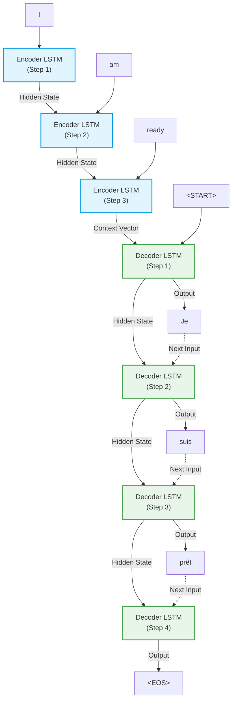

**Rayyan Ahmad Sultan**
**circa 14th April 2026**
# Introduction 
To even take an attempt at understanding what attention is, first we must establish the mathematical context within which it takes residence. Linear Algebra as we know it today has been vastly shaped by many notable figures of history that introduced groundbreaking concepts and innovative tools which enable modern day processors to run thousands upon thousands of calculations in fractions of a second. 'Foundations of Attention' aims to equip the reader with all the prerequisite knowledge they require to understand how the attention mechanism, a key part of LLMs, functions. 

Before we begin, I must highlight a fascinating discovery in regards to the history of mathematics that I was unfortunately not aware of. Hermann Grassman is a foundational figure in the philosophical and theoretical dimension of Linear Algebra. His work is responsible for enabling us to decouple vectors from observable reality. Before his "Theory of Extension", vectors were limited to 3 dimensions, reflecting reality and our observable space. His work established vectors as pure mathematical tools which we can use to represent complex, multi-faceted data. In fact, this is exactly the concept that makes vector embedding models even work. A 768 or 1000+ dimension vector can only be conceived once vectors themselves are separated from the world and are abstracted enough. I hope this small note sparked an interest in mathematics in you just like it did in me.

Nevertheless, I assume that the reader already knows about the basics of machine learning i.e. neural networks, backpropagation, gradient descent, cosine similarity etc. We will explore why these concepts are important, how they tie into the concept of attention, ultimately setting the ground for attention itself. Let's begin.
- - -
# The Problems That Arise With Neural Networks
There are two distinct problems that we need to discuss before we proceed to more complex topics. 
#### The Problem of Linearity
A neural network without activation functions would completely collapse the math that drives backpropagation.  When you stack a linear equation on top of another, you get just another linear equation: 

Take **this equation for example:** $$y = Wx + b$$This is what happens when you add the previous layer's equation into **this one:** 
$$y = W_2(W_1x + b_1) + b_2$$ $$y = (W_2W_1)x + (W_2b_1 + b_2)$$ $$y = W'x + b'$$This proves that without an activation function, multiple layers simplify into a single linear transformation, which completely defeats the purpose of a neural network. This is not regression, we do not require a straight line to dissect information accurately, we require complex divisions and weights/biases for each layer to recognize deep rooted patterns. Therefore, we require **Activation Functions**.  

By adding a non-linear activation function ($f$) after every layer, we prevent the weight matrices ($W_1$, $W_2$) from being factored together: $$y = W_2 f(W_1x + b_1) + b_2$$
Here, *f* denotes an activation function. Many exist, and we will get to the relevant ones in a second. The takeaway is that activation functions are essential. Now, this dependance results in another problem, arguably the biggest obstacle for NLP so far. 

### The Problem of The Chain Rule
When a network makes an error, it uses backpropagation to adjust its weights. It must learn from mistakes. This relies on the Chain Rule from calculus to send the error signal backward. (derivative of the loss function). The Chain Rule for a single weight matrix:

$$\frac{\partial L}{\partial W_1} = \frac{\partial L}{\partial y} \cdot \frac{\partial y}{\partial h} \cdot \frac{\partial h}{\partial W_1}$$

$\frac{\partial L}{\partial W_1}$ is the final gradient (how much to change the weight). $\frac{\partial y}{\partial h}$ is the exact point where the derivative of the activation function is multiplied into the chain. If the activation function has a derivative of zero, the chain rule multiplies the error signal by zero, the gradient vanishes, and the network stops learning. This is what we call the Vanishing Gradient Problem.

So this means it is very important for us to choose the right activation functions. Now early networks used a strict threshold, in the form of the step function, mimicking biological neurons. However, its derivative is zero almost everywhere, killing the gradient.

$$f(x) = \begin{cases} 0 & \text{if } x < 0 \\ 1 & \text{if } x \ge 0 \end{cases}$$

- Derivative: $f'(x) = 0 \quad (\text{for } x \neq 0)$
Sigmoid provided a smooth curve with a computable derivative, but its maximum derivative is too small (0.25). Multiplying this across deep networks causes the signal to decay exponentially (The Vanishing Gradient Problem).
$$\sigma(x) = \frac{1}{1 + e^{-x}}$$
- Derivative:$$\sigma'(x) = \sigma(x)(1 - \sigma(x))$$
**Proof of the 0.25 Limit:** To find the maximum possible value of this derivative, we substitute $\sigma(x)$ with a variable $S$:

$$y = S(1 - S) = S - S^2$$

To find the peak of this downward-facing parabola, we take the derivative with respect to $S$ and set it to zero:

$$\frac{dy}{dS} = 1 - 2S = 0 \implies S = 0.5$$

Plugging $S = 0.5$ back into our derivative equation gives the absolute maximum:

$$\text{Max} = 0.5 \cdot (1 - 0.5) = 0.25$$

Because the maximum multiplier is $0.25$, backpropagation through deep networks continuously multiplies fractions (e.g., $0.25 \times 0.25 \times 0.25 \dots$), causing the gradient to vanish exponentially.

Even though there are other activation functions in existence, these are the most relevant and that is because they do well to highlight the problem that arose, and even though the industry uses much better functions, the sigmoid function will still remain an important part of LLMs because the attention mechanism is dependent on a generalization of this very function, and the paper "Attention is all you need" completely sidesteps the entire architecture.
# Vector Embeddings: The Building Blocks
Before getting to attention, let's quickly go over one more thing: how the vectors we described are designed before they are sent to the neural network for training. The most obvious idea was **One-Hot Encoding.** 
	In one-hot encoding (sparse vectors), a vocabulary of 50,000 words means a 50,000-dimensional vector consisting of 49,999 zeros and a single `1`. It is incredibly inefficient, and mathematically, every word is exactly $90^\circ$ apart (cosine similarity is $0$). One-hot vectors cannot capture meaning, only existence. Technically valid, semantically useless. Geometrically, every word sits at the same distance from every other word. This representation would insist that "cat" is precisely as related to "dog" as it is to "democracy" or "Thursday." Every shred of meaning has been thrown away before the network even begins. 

To counter this, what we instead do is use **dense embeddings** in which every word is assigned a vector of dimension $d_{dim} = 512$ or more, every entry a random number, not 0 which are then treated as parameters, adjusted by backpropagation. Over training, the model itself would learn all there is to learn about the word in the given context or independently, and we discover something very fascinating: words with similar meanings have similar vectors.  This is what we call **distributional hypothesis**, first discovered by Chomsky's teacher **Zellig Harris**. 

The most important paper in this domain is the "Word2Vec" paper by **Tomas Mikolov** who discovered that words, as vectors, constitute more than just semantic significance; they had underlying directional relationships with other word vectors, and therefore could be added and subtracted to give a resultant vector that represents another word. The most frequently taught example is the $v_{king} - v_{man} + v_{woman} = v_{queen}$  example. 

Every single AI model you download has something called an **Embedding Matrix** stored inside it. The matrix contains all the worlds learned by the model, in the form of vectors (well, actually tokens, but that is a separate topic. For simplicity, let's assume vectors).  Mathematically it is denoted as:
$$E \in \mathbb{R}^{|V| \times d_{model}}$$
- - -
# Sequence Models
So far, we have setup the foundations of how machines represent words as numbers and how they learn through the calculus of backpropagation. But language is not just a bag of words; it is a sequence of time. Before 2017, the prevailing logic was that to understand a sentence, a neural network had to read it exactly like a human does: one word at a time, from left to right. This assumption gave rise to **Sequence Models**.

1) **Recurrent Neural Networks**: This neural network was outfitted with *short term memory* in the form of a hidden fixed-sized vector $h_t$. It kept a running summary of everything said so far (as in dissecting the prompt one word at a time from left to right). After the final word, $h_t$ would have a running summary of the entire input. 
$$ \mathbf{h}_t = \tanh(\mathbf{W}_{hh} \mathbf{h}_{t-1} + \mathbf{W}_{xh} \mathbf{x}_t + \mathbf{b}) $$

	Here is what each piece of that equation is doing:
	- **$\mathbf{h}_t$**: The new hidden state for the current step. This is the updated "summary."
	- **$\tanh$**: The hyperbolic tangent activation function. It squishes the resulting calculations into a range between -1 and 1, keeping the values stable as the network loops over and over.
	- **$\mathbf{W}_{hh} \mathbf{h}_{t-1}$**: This is where the "memory" comes in. The network takes the _previous_ hidden state ($\mathbf{h}_{t-1}$) and multiplies it by a dedicated weight matrix ($\mathbf{W}_{hh}$) to decide what past context to bring forward.
	- **$\mathbf{W}_{xh} \mathbf{x}_t$**: This handles the _new_ information. The network takes the current input word ($\mathbf{x}_t$) and multiplies it by its own weight matrix ($\mathbf{W}_{xh}$).    
	- **$\mathbf{b}$**: A standard bias vector to shift the activation function.
    
	Essentially, the network combines the past ($\mathbf{h}_{t-1}$) with the present ($\mathbf{x}_t$), squishes it through a $\tanh$ function, and outputs the new memory state ($\mathbf{h}_t$).

This elegant equation worked perfectly for reading a sequence. But a fatal flaw was hidden in the math, and it only revealed itself when the network tried to _learn_. Neural networks learn through backpropagation, but standard backpropagation is designed for straight lines, not temporal loops. To train an RNN, researchers had to conceptually "unroll" it. A 20-word sentence became a 20-layer deep network.

In standard networks, you might recall that activation functions like Sigmoid or $\tanh$ naturally squish gradients toward zero over many layers. RNNs suffer from this same squish, but they introduce a second, fatal compounding factor: the recurrent weight matrix, $\mathbf{W}_{hh}$. Because the RNN is a loop, the chain rule dictates that stepping backward through time requires multiplying the error by $\mathbf{W}_{hh}$. To step back 20 words means multiplying by $\mathbf{W}_{hh}$ 20 times. Combined with the $\tanh$ squish, this repeated exponentiation makes the gradient incredibly volatile, resulting in either a vanishing or exploding gradient. The most important takeaway is that the error signal simply vanishes. The network can easily update its understanding of the final words in a sentence, but it suffers total amnesia regarding the beginning. It became mathematically impossible for an RNN to connect a subject at the start of a long paragraph to a verb at the end.

2) **Long Short-Term Memory Models**: The holy grail of sequence models pre-2017.  Their entire purpose was to fix the vanishing memory of RNNs. They did so by introducing a new mechanism: **gating**. Instead of blindly overwriting their memory at every single time step, LSTMs learned how to forget. By giving the network the ability to selectively drop irrelevant past context and write new, critical information into an internal 'cell state', the vanishing gradient problem was finally **tamed**.

LSTMs introduced a core concept called the **cell state** ($\mathbf{C}_t$). Imagine it as a conveyor belt running straight down the entire chain of the unrolled network, with only minor linear interactions. This allows information to flow along it virtually unchanged, drastically improving the flow of gradients during backpropagation.

To control this conveyor belt, the LSTM employs a system of three distinct neural network layers acting as **gates**. These gates decide what information is added to or removed from the cell state. They use a sigmoid ($\sigma$) activation function, outputting numbers between 0 and 1. A zero means "let nothing through" (forgetting), and a one means "let everything through" (remembering).

Here is how the gates operate at each time step:

1. **The Forget Gate (**$\mathbf{f}_t$**):** This is the first step. It looks at the previous hidden state ($\mathbf{h}_{t-1}$) and the current input ($\mathbf{x}_t$) and outputs a number between 0 and 1 for each number in the cell state $\mathbf{C}_{t-1}$. This decides what past information is no longer relevant and should be discarded.
2. **The Input Gate (**$\mathbf{i}_t$**):** Next, the network decides what _new_ information is going to be stored in the cell state. The input gate decides which values we'll update. Simultaneously, a $\tanh$ layer creates a vector of new candidate values ($\tilde{\mathbf{C}}_t$) that could be added to the state.
3. **Updating the Cell State:** The old cell state ($\mathbf{C}_{t-1}$) is multiplied by the forget gate ($\mathbf{f}_t$), dropping the information we decided to forget. Then, we add the new candidate values ($\mathbf{i}_t * \tilde{\mathbf{C}}_t$). The cell state has now been successfully updated to $\mathbf{C}_t$.
4. **The Output Gate (**$\mathbf{o}_t$**):** Finally, the network decides what it's going to output (the new hidden state, $\mathbf{h}_t$). This output will be based on our newly updated cell state, but it will be a filtered version. The output gate decides what parts of the cell state make it to the output, and then the cell state is pushed through a $\tanh$ to ensure values are between -1 and 1.

By using these gates, the LSTM can maintain long-term dependencies much better than a standard RNN, acting like a smart filter that knows exactly what to remember and what to forget as it reads through a sequence.

Note that the vanishing gradient problem, as mentioned before, was **tamed**, not *solved*. They carried a second flaw that proved more decisive. Information still threads through the cell state one step at a time, and over truly long sequences early details can still fade. More fundamentally, an LSTM is inherently sequential: step cannot begin until step has finished. There is no way around this, it is baked into the recurrence. And that single fact becomes fatal at scale, because it means the computation cannot be parallelized. 

Beyond these scaling limitations, standard LSTMs faced a critical structural flaw when applied to real-world language tasks: they demanded a rigid, one-to-one mapping between input and output steps. If a network was fed a five-word sentence, it naturally wanted to output exactly five states. To achieve breakthroughs in tasks like machine translation, where sequence lengths constantly change, researchers had to decouple the input from the output. This requirement birthed the architectural bridge that would directly set the stage for Attention: the Encoder-Decoder network."
- - -
# Pre-Attention
The Encode-Decoder network is the most important concept pre-attention because it does two things: 
1) Fixes the problem with LSTMs
2) Introduces a bottleneck, which births Attention
### Encoder - Decoder Framework
The encoder is an LSTM that read the source sentence word for word, updating its internal hidden state as it goes. When it reaches the end, its final hidden state, which is named the **context vector**, is taken as a compressed representation of the entire input's meaning. The decoder is a second LSTM that generates the translation one at a time, conditioned by the context vector and on the words it has already produced. At each step it outputs a probability distribution over the whole vocabulary and selects the next word, continuing until it emits a special "end of sentence" token. 

To illustrate how this architecture operates in practice, consider the task of translating the English phrase **"I am ready"** into the French equivalent **"Je suis prêt"**. 

This process is split into two distinct phases, demonstrating exactly how the framework handles sequences without requiring a strict 1:1 input-output mapping.
##### 1. The Encoding Phase
The Encoder processes the input sequence one token at a time, continuously updating its internal state:
*   **Step 1:** The encoder reads the token `"I"`, updating its hidden state. No output is produced.
*   **Step 2:** The encoder reads `"am"` alongside its previous hidden state, updating its internal state again.
*   **Step 3:** The encoder reads `"ready"` and its previous state. Since this is the end of the input sequence, the final hidden state is captured as the **Context Vector**. 

This single Context Vector now serves as the dense, mathematical summary of the entire source sentence.

##### 2. The Decoding Phase
The Decoder takes over. Its initial state is seeded completely by the Context Vector, and it generates the translation step-by-step:
*   **Step 1:** Triggered by a special `<START>` token and conditioned by the Context Vector, the decoder outputs the highest probability word: `"Je"`.
*   **Step 2:** Taking its previous output (`"Je"`) as its new input, along with its updated internal state, it predicts the next word: `"suis"`.
*   **Step 3:** Taking `"suis"` as input, it updates and predicts `"prêt"`.
*   **Step 4:** Taking `"prêt"` as input, the network recognizes the phrase is complete and outputs the special `<EOS>` (End of Sentence) token, halting the generation.

### Visualizing the Architecture

The following diagram illustrates the flow of information through both LSTM chains, highlighting the critical role of the Context Vector as the singular bridge between them.

#### The Problem
The context vector itself had a fixed limit. In keeping with the technology present in 2014, up-to 2017, the LSTM could only properly support context vectors of dimensions 512 to 1024 before the GPU memory limits and parameter explosion made training unfeasible, since increased dimensions aren't just for the hidden state, but for each parameter of the model. This means a functional limit of 30-50 words before amnesia kicked in and the context vector had to drop old information in favor of newer information.  

#### The Precursor to Attention
In 2014, **Dzmitry Bahdanau**, then a master's student visiting Yoshua Bengio's lab in Montreal, together with some of his colleagues, proposed the fix that changed everything. Instead of forcing the entire source through one frozen context vector, why not let the decoder look back at all of the encoder's hidden states, one per source word,  and, at each step of generation, decide for itself which source words matter most right now? The intuition for this method comes from the fact that we, as humans, constantly glance back at the source text when writing an interpretation or translation, to understand which word or feeling to focus on.

Here is the mathematical breakdown of Bahdanau Attention, written in a semi-technical, explanatory voice with clean LaTeX formatting so you can easily drop it right into your report.

  

### The Mathematics of Bahdanau Attention

To understand how the Bahdanau Attention mechanism breaks the sequence bottleneck, we have to look at how it calculates a brand new, custom context vector at every single time step of the decoding process.

  

This process is broken down into three sequential calculations: scoring the alignment, converting those scores into probabilities, and calculating the final weighted sum.

  

#### 1. The Alignment Score (The "Energy" Calculation)

At any given decoding step $t$, the decoder has a current hidden state, denoted as $s_t$. Meanwhile, the encoder holds a sequence of hidden states, $h_j$, one for every word $j$ in the source sentence.

  

The first step is to calculate an alignment score, $e_{tj}$, which represents how relevant a specific encoder state $h_j$ is to the current decoder state $s_t$. Bahdanau computes this using a small feed-forward neural network:

  

$$e_{tj} = v^\top \tanh(W_s s_t + W_h h_j)$$

**What is happening here?**

  

- $W_s$ and $W_h$ are learnable weight matrices that transform the decoder state $s_t$ and the encoder state $h_j$ into a shared mathematical space.
    
      
    
- They are added together and passed through a $\tanh$ activation function to introduce non-linearity.
    
      
    
- Finally, the result is multiplied by a learnable weight vector $v^\top$ to collapse the matrix down into a single scalar number. This number is the raw attention score.
    
      
    

#### 2. The Attention Weights (Softmax Normalization)

The raw alignment scores ($e_{tj}$) can be any real number, which makes them difficult to interpret as a focused "glance." To fix this, the network passes all the raw scores for a given decoding step through a softmax function:

  

$$\alpha_{tj} = \frac{\exp(e_{tj})}{\sum_{k=1}^{T_x} \exp(e_{tk})}$$

**What is happening here?**

  

- The softmax function takes the raw score for the current word $j$ and divides it by the sum of the exponential scores for _all_ words $k$ in the source sequence (where $T_x$ is the total length of the input sequence).
    
      
    
- This transforms the raw scores into a probability distribution, $\alpha_{tj}$, where every value is between 0 and 1, and all values sum up to exactly 1.0.
    
      
    
- These are our **attention weights**. They tell the network exactly what percentage of its focus should be applied to each source word.
    
      
    

#### 3. The Dynamic Context Vector

In the original Encoder-Decoder architecture, the context vector was a static, frozen representation of the entire input. In the Bahdanau model, the context vector $c_t$ is dynamic—recalculated from scratch at every single step $t$:

  

$$c_t = \sum_{j=1}^{T_x} \alpha_{tj} h_j$$

**What is happening here?**

  

- The network takes each original encoder hidden state $h_j$ and multiplies it by its corresponding attention weight $\alpha_{tj}$.
    
      
    
- It then sums all of these weighted states together to produce $c_t$.
    
      
    
- Because the weights $\alpha_{tj}$ heavily favor the most relevant words, the resulting context vector $c_t$ is a custom-tailored summary of the input sequence, perfectly highlighting the exact information the decoder needs to generate its next specific word.