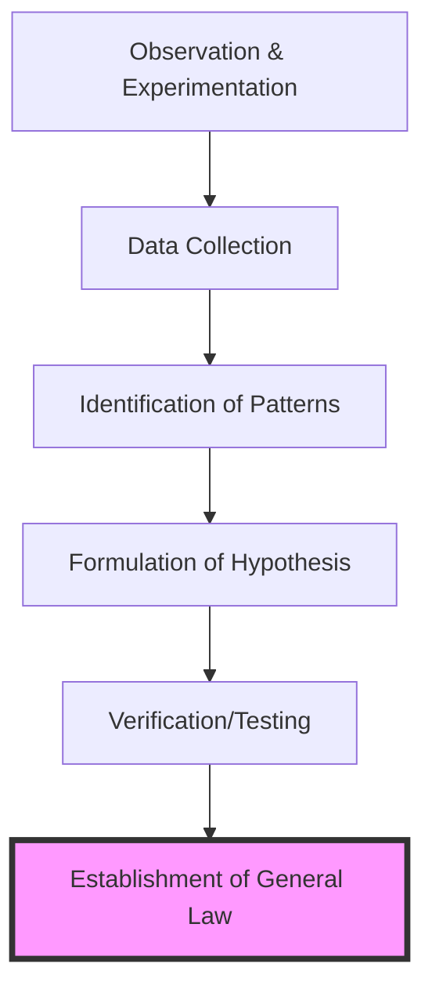

## 5. The Scientific Revolution: The Empiricist Turn

### 5.1 The Collapse of the Aristotelian-Ptolemaic Synthesis
For over a millennium, the intellectual architecture of Europe was anchored in the **Aristotelian-Ptolemaic** synthesis. This framework was not merely a collection of astronomical observations but a comprehensive physical and theological worldview that defined the medieval "Great Chain of Being." Aristotle’s physics categorized motion into "natural"—heavenly bodies moving in eternal, perfect circles—and "violent," where terrestrial objects required a continuous force to remain in motion. This teleological view of nature, which sought the "final cause" or purpose of things, aligned seamlessly with the Catholic Church’s geocentric interpretation of the cosmos. Ptolemy’s *Almagest* provided the mathematical mechanics for this geocentrism, utilizing a complex system of **epicycles**, **deferents**, and **equants** to account for the retrograde motion of planets while maintaining the Earth as the immobile center of the universe.

By the late 15th century, this model was under severe technical strain. The internal complexity required to maintain the geocentric premise had become mathematically cumbersome, and the inaccuracies in the Julian calendar necessitated a more precise understanding of the tropical year. The "Empiricist Turn" began not as a sudden rejection of tradition, but as a technical necessity that eventually dissolved the metaphysical foundations of Scholasticism.

### 5.2 Nicolaus Copernicus and the Heliocentric Displacement
The publication of **Nicolaus Copernicus**’s *De revolutionibus orbium coelestium* (On the Revolutions of the Heavenly Spheres) in 1543 marks the formal inception point of the Scientific Revolution. Copernicus, a Polish canon and mathematician, proposed a **heliocentric** model in which the Sun was the center of the universe and the Earth was relegated to the status of a planet orbiting it.

Copernicus’s contribution was primarily structural rather than observational. He did not possess new data, but rather reordered the existing Ptolemaic data to achieve a more "elegant" mathematical symmetry. By placing the Sun at the center, he explained retrograde motion as an optical effect caused by the varying orbital speeds of the Earth and other planets, thereby removing the need for Ptolemy’s equants. However, Copernicus remained a transitional figure; he still relied on circular orbits and a small number of epicycles to maintain precision. The significance of the Copernican displacement was profound; it challenged the medieval notion that the human domain was the physical and ontological center of the cosmos, initiating what would become a total re-evaluation of humanity's place in the universe.

### 5.3 Johannes Kepler: Breaking the Perfect Circle
While Copernicus provided the structural blueprint, **Johannes Kepler** provided the empirical proof that destroyed the ancient obsession with "celestial perfection." Utilizing the exhaustive and highly precise observational data of the Danish astronomer **Tycho Brahe**, Kepler spent years attempting to map the orbit of Mars. In his 1609 work, *Astronomia nova*, Kepler made the radical break from two thousand years of tradition: he abandoned the "perfect circle."

Kepler’s Three Laws of Planetary Motion transformed astronomy from a branch of geometry into a branch of physics:
1.  **The Law of Ellipses**: Planets move in elliptical orbits with the Sun at one focus. This removed the aesthetic requirement of circular motion in favor of empirical reality.
2.  **The Law of Equal Areas**: A line segment joining a planet and the Sun sweeps out equal areas during equal intervals of time. This proved that a planet's speed varies depending on its distance from the Sun, moving faster at **perihelion** and slower at **aphelion**.
3.  **The Harmonic Law** (1619): The square of a planet's orbital period is proportional to the cube of its average distance from the Sun, establishing a mathematical unity that applied to the entire solar system.

Kepler’s work demonstrated that the heavens were governed by physical laws that could be quantified, rather than divine geometric ideals.

### 5.4 Galileo Galilei: Observation and the Experimental Method
**Galileo Galilei** represents the transition from theoretical mathematics to practical, instrumental empiricism. In 1609, Galileo turned the newly invented telescope toward the heavens, providing the first sensory evidence for the heliocentric theory. His observations were devastating to the Aristotelian model:
-   **The Moons of Jupiter**: Proved that bodies could orbit a center other than the Earth.
-   **The Phases of Venus**: Provided visual proof that the planet must orbit the Sun.
-   **The Moon’s Surface**: Revealed craters and mountains, proving that heavenly bodies were not "perfect" spheres of ether but material bodies like Earth.

Beyond astronomy, Galileo’s work in mechanics laid the foundation for modern physics. Through his experiments with inclined planes, he demonstrated that the Aristotelian view of motion—where heavier objects fall faster—was fundamentally flawed. He established that, in a vacuum, all objects fall at the same rate, and he formulated the principle of **inertia**, which stated that an object in motion stays in motion unless acted upon by an external force. Galileo’s insistence that the "Book of Nature" was written in the language of mathematics shifted the focus of science from "why" things happen (teleology) to "how" they happen (kinematics). This shift precipitated a crisis with the **Catholic Church**, culminating in his 1633 trial and the placement of his works on the *Index Librorum Prohibitorum*.

### 5.5 Isaac Newton and the Newtonian Synthesis
The Scientific Revolution reached its apex with **Isaac Newton**, whose 1687 masterpiece, *Philosophiæ Naturalis Principia Mathematica*, synthesized the disparate threads of the century into a single, coherent system of laws. Newton’s genius lay in his ability to unite Galileo’s terrestrial mechanics with Kepler’s celestial laws.

Newton’s **Three Laws of Motion** and his **Law of Universal Gravitation** established that the same physical forces operate throughout the universe. He proved through mathematical derivation that the force pulling an apple to the ground was the same force keeping the Moon in orbit around the Earth. This "Grand Synthesis" created a deterministic, "clockwork" universe governed by universal gravitation ($F = G \frac{m_1 m_2}{r^2}$). Newton’s famous statement, "*Hypotheses non fingo*" (I do not frame hypotheses), signaled a refusal to speculate on the "hidden qualities" or metaphysical "essences" of things, focusing instead on describing the quantifiable laws that governed observable phenomena.

| Astronomer | Key Work | Major Contribution | Impact |
|:-----------|:---------|:-------------------|:-------|
| **Copernicus** | *De revolutionibus* (1543) | Heliocentric model | Displaced Earth as the center of the universe. |
| **Kepler** | *Astronomia nova* (1609) | Elliptical orbits | Abandoned circular motion for empirical data. |
| **Galileo** | *Sidereus Nuncius* (1610) | Telescopic evidence | Provided visual confirmation of heliocentrism. |
| **Newton** | *Principia* (1687) | Universal Gravitation | Unified celestial and terrestrial mechanics. |

### 5.6 The Methodological Shift: From Deduction to Induction
The most significant intellectual legacy of this era was the fundamental shift in the methodology of knowledge production. For centuries, the **Deductive Method** of Aristotle and the Scholastics had dominated; it started with accepted general principles (e.g., "The Heavens are perfect and unchanging") and used syllogistic logic to derive specific conclusions. This method was often insulated from contradictory evidence, as the "first principles" were considered infallible truths.

The Scientific Revolution championed the **Inductive Method**, most notably articulated by **Francis Bacon** in his *Novum Organum* (1620). Induction proceeds in the opposite direction: it starts with specific observations and experiments, and from this data, it builds toward general laws. Bacon argued that the human mind must be purged of its "idols" (prejudices and false traditions) to truly observe nature.

This "Empiricist Turn" did not merely change what humanity knew about the world; it changed how humanity knew it. By prioritizing sensory data over authority and mathematics over metaphysics, the thinkers of the Scientific Revolution established the template for the modern scientific method. This transition from a closed, finite world of qualitative essences to an open, infinite universe of quantitative laws made possible the subsequent Enlightenment and the Industrial Revolution.

- - -
**Summary of the Shift:**
-   **Aristotelian Scholasticism**: Relies on authority, syllogisms, and teleology (Final Causes).
-   **Modern Science (Empiricism)**: Relies on observation, experimentation, and mechanics (Efficient Causes).
- - -
#### **Related Notes**
- [[HIST - Medieval Europe]]
- [[BIO - Nicolaus Copernicus]]
- [[BIO - Johannes Kepler]]
- [[BIO - Galileo Galilei]]
- [[BIO - Isaac Newton]]
- [[REAS - Aristotelianism]]
- [[REAS - Empiricism]]
- [[SCI - Astronomy]]
