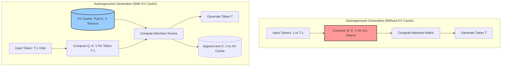

## Introduction to KV Caches and AI Hardware Architecture



| Bottleneck Classification | Description | Primary Hardware Limitation | LLM Phase Example | Architectural Mitigation |
| :--- | :--- | :--- | :--- | :--- |
| **Compute-Bound** | Execution time is determined by the raw speed of mathematical operations. Data is available faster than it can be processed. | Arithmetic Logic Units (ALUs), Tensor Cores, Clock Speed. | **Prefill Phase** (Prompt Processing), Training. | Adding more Tensor Cores, Matrix sparsity, lower precision (FP8/INT8). |
| **Memory-Bandwidth-Bound** | Execution time is determined by the speed at which data travels from memory to compute units. Compute units sit idle waiting for data. | High Bandwidth Memory (HBM) speed (GB/s), Bus Width, SRAM latency. | **Decode Phase** (Token Generation), KV Cache retrieval. | Faster memory (HBM3e), larger on-chip SRAM, Multi-Query Attention (MQA). |
| **Memory-Capacity-Bound** | The total size of the model and intermediate states exceeds the available physical memory on the accelerator. | Total VRAM capacity (e.g., 80GB on A100). | Large context windows, massive batch sizes. | Multi-GPU parallelism (Tensor/Pipeline Parallelism), Quantization. |

```python
import numpy as np

def generate_token_naive(prompt_tokens, weights):
    """
    Naive approach: Recomputes everything for the entire sequence.
    Time Complexity per token: O(N^2) where N is sequence length.
    Compute-heavy, but incredibly inefficient.
    """
    # Q, K, V must be recomputed for all tokens from 0 to N
    Q = np.dot(prompt_tokens, weights['W_q'])
    K = np.dot(prompt_tokens, weights['W_k'])
    V = np.dot(prompt_tokens, weights['W_v'])
    
    attention_scores = np.dot(Q, K.T) / np.sqrt(Q.shape[-1])
    attention_weights = softmax(attention_scores)
    
    return np.dot(attention_weights, V)[-1] # Return the last generated token

class KVCacheAccelerator:
    def __init__(self):
        # The KV Cache resides in the GPU's High Bandwidth Memory (HBM)
        self.cached_keys = []
        self.cached_values = []

    def generate_token_optimized(self, newest_token, weights):
        """
        Optimized approach: Only computes Q, K, V for the newest token.
        Time Complexity per token: O(N).
        Memory-heavy, bound by the speed of loading the cache.
        """
        # Compute Q, K, V ONLY for the single new token
        q_new = np.dot(newest_token, weights['W_q'])
        k_new = np.dot(newest_token, weights['W_k'])
        v_new = np.dot(newest_token, weights['W_v'])
        
        # Append to the ever-growing KV Cache
        self.cached_keys.append(k_new)
        self.cached_values.append(v_new)
        
        # Load the ENTIRE cache from HBM to SRAM for attention calculation
        K_past = np.concatenate(self.cached_keys, axis=0)
        V_past = np.concatenate(self.cached_values, axis=0)
        
        # Matrix-Vector multiplication (Memory Bandwidth Bound)
        attention_scores = np.dot(q_new, K_past.T) / np.sqrt(q_new.shape[-1])
        attention_weights = softmax(attention_scores)
        
        return np.dot(attention_weights, V_past)
```

The fundamental mechanics of modern Large Language Models (LLMs), which are predominantly based on the decoder-only Transformer architecture, dictate a strict autoregressive generation process. This means that text is generated sequentially, one token at a time, with each new token heavily dependent on the mathematical context of all previously generated tokens. While this architecture has unlocked unprecedented capabilities in artificial intelligence, it introduces severe computational and hardware-level challenges that dictate the very design of modern AI accelerators like GPUs and TPUs.

To understand these challenges, we must first dissect the two distinct phases of LLM inference: the **Prefill Phase** and the **Decode Phase**. During the prefill phase, the model ingests the user's prompt. Because the entire prompt is available simultaneously, the computation can be highly parallelized. The operations performed here are massive Matrix-Matrix multiplications (GEMMs - General Matrix Multiplications). In hardware terms, GEMMs possess high **Arithmetic Intensity**, meaning that for every byte of data loaded from the GPU's High Bandwidth Memory (HBM) into its compute cores (SRAM/Registers), a tremendously large number of floating-point operations (FLOPs) are performed. Thus, the prefill phase is typically **compute-bound**. The speed of processing the prompt is largely dictated by how many Tensor Cores the GPU possesses and how fast their internal clocks run.

However, the paradigm shifts violently during the decode phase. In this phase, the model generates the response token by token. To generate token $T$, the model must calculate the attention scores between the Query ($Q$) vector of token $T$ and the Key ($K$) and Value ($V$) vectors of all preceding tokens from $1$ to $T-1$. If we were to naively implement this logic without memory optimization, we would pass the entire sequence $1 \dots T$ through the enormous parameter layers of the neural network just to predict token $T+1$. As the sequence grows, the computational complexity explodes quadratically to $O(N^2)$ for each generation step, leading to an overall complexity of $O(N^3)$ for generating the full sequence. In a production environment serving billions of tokens, this naive approach is computationally suicidal.

The elegant mathematical mitigation to this is the **KV Cache** (Key-Value Cache). Because the Keys and Values of past tokens do not change as new tokens are generated, we can compute them once and store them in memory. When generating token $T$, we only need to compute $Q_T$, $K_T$, and $V_T$ for that single specific token. We then append the new $K_T$ and $V_T$ to our existing cache, and calculate attention by taking the dot product of the single $Q_T$ vector against the entire cached matrix of past Keys. This transforms the attention mechanism from an intense Matrix-Matrix multiplication into a Matrix-Vector multiplication (GEMV), effectively reducing the computational complexity of generating a new token from $O(N^2)$ to $O(N)$.

Yet, this mathematical triumph introduces a severe hardware bottleneck. By storing the Keys and Values for every token, across every attention head, for every layer of the network, the KV Cache grows to an astronomical size. For a standard 70-billion parameter model serving a batch of concurrent users with long contexts, the KV Cache can easily consume tens to hundreds of gigabytes of memory, far exceeding the size of the model's weights themselves.

This brings us to the crux of AI hardware architecture and the modern von Neumann bottleneck. The KV Cache is far too large to store locally, and thus must reside in the accelerator's main memory (the HBM). However, the actual mathematical computation of attention scores happens inside the compute units, which rely on extremely fast, but extremely small, localized memory (SRAM or L1/L2 caches). During the decode phase, to generate a single token, the *entire* set of model weights and the *entire* KV Cache for that specific sequence must be streamed from the HBM into the SRAM, multiplied by the single $Q_T$ vector, and then flushed out. 

Because we are multiplying a massive, gigabyte-scale matrix by a single, tiny vector, the Arithmetic Intensity collapses. For every byte of data we painstakingly move across the silicon, we perform perhaps only one or two mathematical operations. The Tensor Cores finish their calculations in fractions of a nanosecond and then sit completely idle, waiting for the memory bus to fetch the next chunk of the KV Cache. This state is defined as being **memory-bandwidth bound**. The speed at which an LLM types out text on your screen is not limited by how fast the GPU can "think" (compute), but strictly by how fast it can "read" (memory bandwidth).

To truly appreciate these constraints, we must visualize the memory hierarchy of an AI accelerator. At the bottom lies the High Bandwidth Memory (HBM), which is capacious (typically 80GB to 192GB) and relatively fast (up to 5 TB/s), but suffers from high latency compared to on-chip memory. Above the HBM is the L2 Cache, a global SRAM pool shared across the GPU, which is much faster but limited to around 50MB. Finally, at the top, we have the L1 Cache and registers located directly inside the Streaming Multiprocessors (SMs), where the actual Tensor Cores reside. 

When generating a token, the GPU must issue a memory read request to pull the massive KV Cache block from HBM into the L2 Cache, and subsequently into the L1 Cache, before the Tensor Cores can execute the calculation. Because the cache grows dynamically with every generated token, managing this memory allocation becomes a logistical nightmare. In naive implementations, memory for the KV Cache is pre-allocated contiguously based on the maximum possible sequence length. This leads to horrific memory fragmentation and waste; a user generating a 100-token response would tie up the memory reserved for 8,000 tokens, blocking other users from utilizing the GPU. 

This software-hardware friction birthed innovations like PagedAttention, inspired by virtual memory management in traditional operating systems. PagedAttention divides the KV Cache into non-contiguous blocks or "pages," allocating them on demand as the sequence grows. This eliminates internal fragmentation and allows the hardware to maximize its batch size—the number of concurrent users it can serve. By increasing the batch size, the system can amortize the cost of loading the model weights; it loads the weights once from HBM into SRAM and uses them to compute the forward pass for multiple users simultaneously, thereby slightly increasing the arithmetic intensity and clawing back efficiency from the memory bottleneck. 

This stark reality has driven a relentless evolution in silicon engineering. Traditional DDR memory, used in consumer electronics, is vastly insufficient. Modern accelerators utilize HBM, which achieves its colossal bandwidth by stacking memory dies directly on top of each other and connecting them to the compute die via a silicon interposer with thousands of microscopic TSVs (Through-Silicon Vias). While HBM2e provided bandwidths around 1.5 to 2.0 Terabytes per second (TB/s), the insatiable hunger of the KV Cache has forced the industry to rapidly develop HBM3 (e.g., 3.3 TB/s on the H100) and HBM3e (e.g., 4.8 TB/s on the H200). 

Furthermore, because moving data costs significantly more energy than computing it (fetching a value from HBM can cost orders of magnitude more picojoules than performing a floating-point multiplication), the memory bandwidth bottleneck is simultaneously a power bottleneck. If an architecture cannot feed the compute units efficiently, it wastes massive amounts of electricity simply keeping the silicon powered on while it waits for data. 

To mitigate this at the architectural level, researchers developed techniques specifically to shrink the KV Cache footprint. Multi-Query Attention (MQA) and Grouped-Query Attention (GQA) depart from standard Multi-Head Attention by forcing multiple Query heads to share a single Key and Value head. This drastically reduces the size of the KV Cache that must be stored and subsequently streamed across the memory bus during decode, trading a minuscule fraction of model accuracy for a massive increase in inference speed and batch size capacity. 

In conclusion, understanding the KV Cache is the absolute foundation to understanding the economics and engineering of modern artificial intelligence. The transition from the compute-bound prefill phase to the memory-bandwidth-bound decode phase dictates how models are served in production. It explains why inference providers obsess over batching algorithms, quantization, and specialized memory hardware. The future of AI scaling is not merely a question of building faster calculators, but of solving the fundamental physics of moving terabytes of cached context across silicon millimeters in fractions of a second.