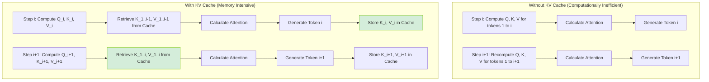
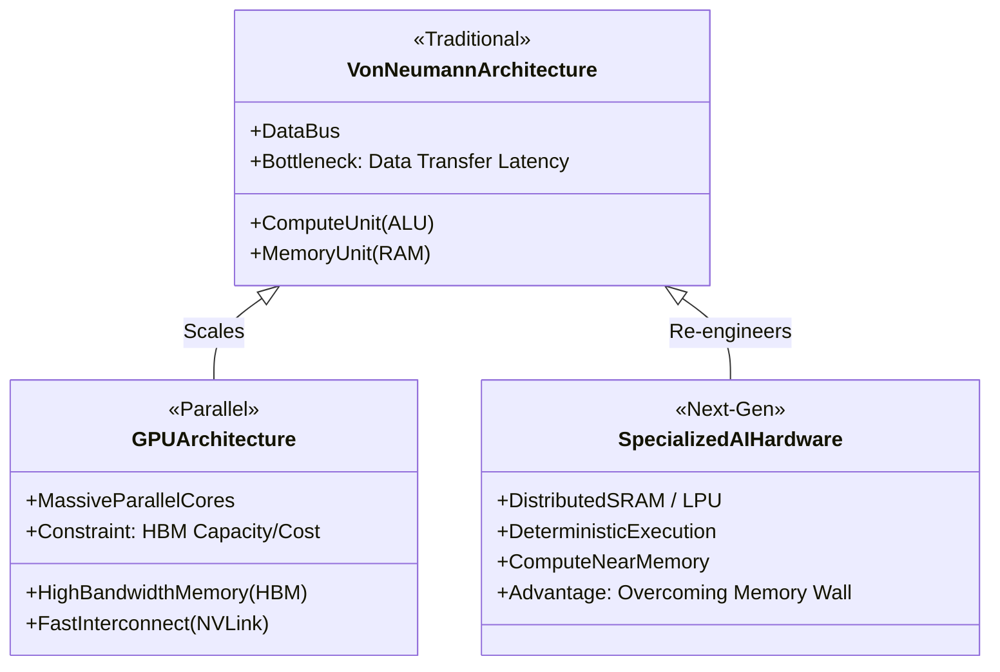

## Introduction to KV Caches and AI Hardware Architecture

At the heart of modern artificial intelligence, particularly within the domain of Large Language Models (LLMs), lies a profound and persistent tension: the disparity between the speed at which we can perform mathematical calculations and the speed at which we can retrieve data from memory. The architecture of these models, heavily reliant on the Transformer's attention mechanism, scales quadratically with sequence length. To understand the intricacies of optimizing these massive networks, we must first dissect the fundamental bottleneck of LLM inference—the clash between compute capacity (FLOPS) and memory bandwidth—and examine how the Key-Value (KV) Cache emerges as both a vital solution and a daunting new hardware challenge.

### The Fundamental Bottleneck: Memory Bandwidth vs. Compute

Inference in Large Language Models is not a uniform computational process. It is traditionally divided into two distinct and diametrically opposed phases: the **Prefill Phase** and the **Decode Phase**.

1. **Prefill Phase (Prompt Processing):** When an LLM receives an initial prompt, it processes the entire sequence of tokens simultaneously. This phase is heavily *compute-bound*. The hardware's arithmetic logic units (ALUs), such as those found in highly parallelized Tensor Cores, are fully utilized, performing massive matrix-matrix multiplications (GEMM). Because the data can be processed in large, contiguous blocks, the hardware reaches peak floating-point operations per second (FLOPS).
2. **Decode Phase (Token Generation):** Conversely, the model generates its response one token at a time, auto-regressively. Each new token depends on all previously generated tokens as well as the original prompt. This phase is notoriously *memory-bandwidth-bound*. To generate a single token, the model must read its entire set of weights (parameters) from high-bandwidth memory (HBM) into the compute units, perform a relatively small number of matrix-vector multiplications (GEMV), and write the result back. 

The disparity is stark. Modern Graphics Processing Units (GPUs) boast immense computational power (measured in teraFLOPS), but their memory bandwidth (measured in GB/s or TB/s) has not scaled at the same exponential rate. During the decode phase, the compute units often sit idle, starved of data, waiting for weights to arrive from memory. This phenomenon is universally referred to as hitting the "memory wall."

| Phase | Dominant Bottleneck | Hardware Utilization | Operation Type | Computational Complexity |
| :--- | :--- | :--- | :--- | :--- |
| **Prefill** | Compute (FLOPS) | High (Tensor Cores saturated) | Matrix-Matrix Multiplications (GEMM) | High arithmetic intensity |
| **Decode** | Memory Bandwidth | Low (Compute units starved) | Matrix-Vector Multiplications (GEMV) | Low arithmetic intensity |

### Understanding the Key-Value (KV) Cache

The mechanism of self-attention requires that to generate a new token $t_i$, the model must compare the Query ($Q$) representation of the current token against the Key ($K$) and Value ($V$) representations of all previous tokens ($t_1$ to $t_{i-1}$). Recomputing the $K$ and $V$ vectors for all historical tokens at every single generation step would be a computational disaster, shifting an inherently $O(N)$ operation into an $O(N^2)$ operation per step, rendering long-context generation impossible.

The **KV Cache** is the standard architectural optimization deployed to eliminate this redundant computation.

Instead of recalculating history, the model stores the Key and Value tensors for each token in memory as they are generated. During the decode phase, the model only computes the $Q$, $K$, and $V$ representations for the *newly* generated token. It then concatenates the new $K$ and $V$ vectors with the historical $K$ and $V$ tensors retrieved from the KV Cache to compute the attention scores.

While the KV Cache brilliantly solves the compute bottleneck, it aggressively exacerbates the memory wall. The memory footprint of the KV Cache grows linearly with the batch size and the sequence length.

**The KV Cache Size Equation:**
The memory required for the KV Cache (in bytes) can be approximated by the following formula:
`Size = 2 × (Sequence Length) × (Batch Size) × (Number of Layers) × (Hidden Size) × (Bytes per Parameter)`
*(The '2' multiplier accounts for storing both the Key and the Value tensors).*

For a flagship model operating at a large batch size with a long context window (e.g., 100,000 tokens), the KV Cache can quickly consume tens or even hundreds of gigabytes of VRAM. This introduces a severe operational constraint: the maximum batch size—and therefore the overall throughput of the system—is strictly limited by the available VRAM required to store the dynamic KV Cache, not by the sheer compute power of the chip.

### The Imperative of Hardware Architecture

Because the decode phase is memory-bound and the KV Cache dominates dynamic memory allocation, the underlying hardware architecture dictates the feasibility and efficiency of LLM deployment. The microscopic interaction between the processing units and their memory hierarchy has macroscopic implications for AI scaling.

#### GPU Architecture and High Bandwidth Memory (HBM)

Traditional Graphics Processing Units (GPUs), such as the NVIDIA Hopper (H100) or Ampere (A100) series, are the current apex predators of AI inference. Their architecture attempts to mitigate the memory wall through the integration of High Bandwidth Memory (HBM). HBM utilizes ultra-wide data buses and advanced 2.5D or 3D die-stacking technology (like TSMC's CoWoS) to place memory physically adjacent to the GPU die. This yields massive throughput, exceeding 3 TB/s on modern architectures.

However, HBM is fundamentally constrained by physics and economics. It is exceptionally expensive to manufacture and capacity-limited (typically capped between 80GB and 192GB per chip). When the static model weights combined with the dynamic KV Cache exceed this physical limit, engineers must resort to distributed orchestration techniques. Strategies like Tensor Parallelism (splitting matrix operations across chips) or Pipeline Parallelism (placing different layers on different chips) are employed over interconnects like NVLink. While necessary, these introduce network latency, further complicating the memory-bound nature of inference.

#### Innovations in KV Cache Management

To combat the memory capacity limits on GPUs, sophisticated software-hardware co-designs have emerged. Standard memory allocation for the KV Cache was traditionally contiguous. Because sequence lengths grow unpredictably in a batched environment, contiguous allocation led to severe internal and external memory fragmentation, wasting precious HBM. 

Techniques like **PagedAttention** (inspired by virtual memory paging in traditional operating systems) revolutionized this space. PagedAttention divides the KV Cache into fixed-size blocks, or "pages." This allows the KV Cache to be stored in non-contiguous physical memory spaces, nearly eliminating fragmentation. By optimizing memory utilization, systems can support significantly larger batch sizes on the same hardware footprint.

#### Alternative Silicon Architectures

The unforgiving nature of the memory wall has catalyzed a renaissance in specialized silicon design, moving beyond the traditional GPU paradigm to architectures explicitly designed to accelerate the decode phase.

1. **Language Processing Units (LPUs):** Innovators like Groq have engineered hardware that abandons the complex, hierarchical memory systems of GPUs (which rely on HBM and multi-level caches). Instead, they deploy massive amounts of highly deterministic, ultra-fast SRAM distributed directly adjacent to the compute ALUs. This architecture guarantees uniform, predictable memory bandwidth, eradicating the memory latency that starves compute units during auto-regressive generation.
2. **Unified Memory Systems:** Architectures like Apple's Apple Silicon (M-series) leverage unified memory. The Central Processing Unit (CPU), Graphics Processing Unit (GPU), and Neural Engine share a singular, massive pool of high-bandwidth memory (up to 192GB). While it may not achieve the extreme peak bandwidth of a dedicated H100, the vast, shared capacity eliminates the need to shuffle data across PCIe buses, making it highly efficient for running massive models locally.
3. **In-Memory Compute (Neuromorphic):** Looking further ahead, researchers are exploring analog and neuromorphic chips that perform mathematical operations directly within the memory cells themselves. This fundamentally collapses the von Neumann bottleneck by destroying the physical separation between memory and computation.

### Conclusion

In the modern era of Artificial Intelligence, mastering the KV Cache is not merely an exercise in algorithmic cleverness; it is the fundamental lens through which we must view the entire hardware-software stack. The relentless pursuit of longer context windows and instantaneous inference speeds is, at its core, a siege on the memory wall. As models continue to scale, the physical architecture of silicon will increasingly be dictated by the desperate need to feed data to compute units faster than the speed of light allows, defining the next generation of computing infrastructure.
