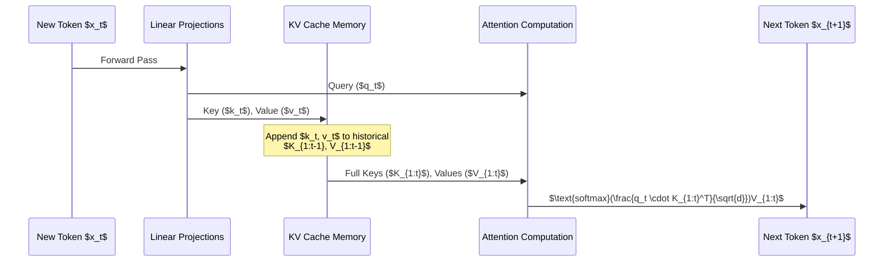

## The Anatomy of the KV Cache

In the architecture of modern Large Language Models (LLMs), the self-attention mechanism serves as the foundational computational engine, allowing the model to dynamically synthesize context, map long-range dependencies, and generate highly coherent text. However, this powerful engine is exceptionally resource-intensive, particularly during the auto-regressive decoding phase where tokens are generated sequentially, one by one. The Key-Value (KV) Cache emerges as the critical algorithmic optimization that prevents catastrophic computational collapse during this generative phase. 

By observing the empirical flow of data within a transformer block, we can see that for any newly generated token, the historical context—the sequence of tokens that came before it—remains perfectly static. Re-computing the dense matrix projections for these historical tokens at every single generation step introduces a profound and unsustainable redundancy. The KV Cache resolves this by persistently storing the computed Key ($K$) and Value ($V$) tensors for all prior tokens. By doing so, it effectively reduces the time complexity of the attention operation from $O(N^2)$ to $O(N)$ for each newly generated token, exchanging a massive computational burden for a heavy memory footprint.

### The Mechanism of Context Retention

To accurately visualize this mechanism, we must trace the flow of tensors during the generation cycle. When a new token is processed, it is projected into three distinct vectors: a Query ($Q$), a Key ($K$), and a Value ($V$). Instead of executing these projections for all past tokens over and over again, the model retrieves the previously cached $K$ and $V$ tensors from its memory banks. It then appends the new $K$ and $V$ vectors to this growing cache, and computes the attention scores solely using the newly generated $Q$ vector against the entire augmented $K$ cache.



This visualization highlights a fundamental asymmetry in auto-regressive generation: while the Query is always a single vector (with a dimension of $1 \times d$), the Keys and Values grow linearly with the sequence length (reaching dimensions of $t \times d$). This continually expanding state is what we term the "context window" in practical engineering terms.

The logic can be rigorously represented through the following PyTorch pseudo-code. This demonstrates how the cache is explicitly managed and updated during the forward pass of an attention layer:

```python
import torch
import torch.nn.functional as F

def autoregressive_attention(q_new, k_new, v_new, kv_cache=None):
    """
    Computes attention for a single new token using explicit KV caching.
    q_new, k_new, v_new: Tensors representing the current token, shape (batch, 1, num_heads, head_dim)
    """
    if kv_cache is not None:
        k_cache, v_cache = kv_cache
        # Concatenate the new K, V vectors with the historical cache along the sequence dimension
        K = torch.cat([k_cache, k_new], dim=1)
        V = torch.cat([v_cache, v_new], dim=1)
    else:
        # Processing the very first token (the prompt encoding phase)
        K, V = k_new, v_new
        
    # Update and persist the cache for the subsequent generation step
    updated_kv_cache = (K, V)
    
    # Compute attention scores using scaled dot-product
    # q_new: (b, 1, h, d) -> K^T: (b, h, d, t) -> scores: (b, h, 1, t)
    d_k = q_new.size(-1)
    scores = torch.matmul(q_new.transpose(1, 2), K.transpose(1, 2).transpose(-2, -1)) / (d_k ** 0.5)
    attention_weights = F.softmax(scores, dim=-1)
    
    # Compute final context-aware output vector
    # weights: (b, h, 1, t) -> V: (b, h, t, d) -> output: (b, h, 1, d)
    output = torch.matmul(attention_weights, V.transpose(1, 2))
    
    return output.transpose(1, 2), updated_kv_cache
```

### Memory Footprint of the Expanding Context

While the KV Cache elegantly solves the computation bottleneck, it inevitably introduces a severe memory bottleneck. The multidimensional tensors stored in the cache require dedicated VRAM (Video RAM) on the GPU. As the sequence length ($s$) grows, the memory required scales strictly linearly, but the constant factors multiplier derived from the model's architecture is enormous.

The exact memory footprint in bytes can be calculated using the following deterministic formula:

$$ \text{Memory (bytes)} = 2 \times b \times s \times L \times n \times d \times p $$

Where the variables are defined structurally as:
- $2$: Accounts for storing both the Key and Value tensors.
- $b$: Batch size (the number of concurrent user sequences being processed).
- $s$: Sequence length (the number of tokens present in the current context).
- $L$: Number of transformer layers or blocks within the model.
- $n$: Number of distinct attention heads per layer.
- $d$: Dimension of each individual attention head.
- $p$: Precision (bytes required per parameter, e.g., 2 bytes for FP16).

Let us apply this mathematical formula to a standard 7-Billion parameter open-weight model (such as LLaMA-2 7B) operating at FP16 precision ($p=2$ bytes). The baseline architectural parameters for this model are defined as: $L = 32$, $n = 32$, and $d = 128$. 

For a single sequence ($b=1$) and a context length of a single token ($s=1$), the cache requires:
$2 \times 1 \times 1 \times 32 \times 32 \times 128 \times 2 = 524,288 \text{ bytes (0.5 MB)}$

While 0.5 MB per token may seem mathematically trivial at first glance, observe the exponential explosion as the sequence length approaches the theoretical limits of modern extended-context models.

| Sequence Length ($s$) | Batch Size | Precision | Total KV Cache Size (LLaMA 7B) |
| :--- | :--- | :--- | :--- |
| 1,024 (Short prompt) | 1 | FP16 (2 bytes) | 0.5 GB |
| 4,096 (Standard doc) | 1 | FP16 (2 bytes) | 2.1 GB |
| 32,768 (Long context) | 1 | FP16 (2 bytes) | 17.1 GB |
| 32,768 (Long context) | 16 (Batched) | FP16 (2 bytes) | 274.8 GB |

As the empirical data in the table vividly demonstrates, processing a 32K context window for a single user requires 17.1 GB of VRAM strictly allocated for the KV Cache. This exceeds the memory required to hold the entire 7B model weights themselves (~14 GB in FP16). When an enterprise API attempts to serve multiple users concurrently (batching $b=16$), the memory requirements geometrically scale to 274.8 GB, rapidly exceeding the capacity of even the most advanced multi-GPU server nodes (such as an 8x 80GB A100 cluster), leading to catastrophic out-of-memory (OOM) failures. 

### Precision Degradation and Quantization Strategies

To actively combat this massive memory footprint, systems engineers must employ quantization—the systematic reduction of mathematical precision for the stored tensors. By default, models operate in 16-bit floating-point (FP16 or BF16). However, similar to biological neural networks, empirical research demonstrates that transformer models do not require flawless, lossless precision in their historical context to maintain semantic coherence.

By projecting the continuous 16-bit continuous values into discrete lower-precision buckets, we can significantly compress the memory requirements.

**8-bit Integer Quantization (INT8):**
INT8 quantization maps the FP16 values into 256 discrete computational levels. This reduces the parameter size from 2 bytes to exactly 1 byte ($p=1$).
- **Memory Reduction:** Achieves a 50% reduction in the total KV Cache footprint.
- **Computational Overhead:** Requires dynamic de-quantization during the attention matrix multiplication, introducing a slight, manageable latency penalty.
- **Quality Impact:** Generally considered near-lossless. The degradation in measured perplexity is mathematically visible but practically invisible in the generated textual outputs.

**4-bit Integer Quantization (INT4):**
INT4 quantization aggressively maps values into just 16 discrete levels, reducing the parameter size to a mere 0.5 bytes ($p=0.5$).
- **Memory Reduction:** Achieves a massive 75% reduction in the KV Cache footprint.
- **Computational Overhead:** Requires a significantly higher overhead due to complex, block-wise or group-wise quantization schemas required to maintain acceptable accuracy.
- **Quality Impact:** Results in measurable degradation, particularly noticeable in long-context retrieval tasks (e.g., finding a specific needle-in-a-haystack fact buried deep within a 100K token document).

| Quantization Method | Bytes per Element ($p$) | 32K Context Size (1 seq) | Perplexity Degradation |
| :--- | :--- | :--- | :--- |
| FP16 / BF16 (Baseline) | 2.0 | 17.1 GB | None |
| FP8 / INT8 | 1.0 | 8.5 GB | < 0.1% |
| INT4 | 0.5 | 4.2 GB | ~ 1.5% |

Modern architectures push these hardware boundaries even further through profound structural innovations rather than relying on pure quantization alone. **Grouped-Query Attention (GQA)** and **Multi-Query Attention (MQA)** fundamentally alter the $n$ (number of heads) variable in our memory formula. Instead of maintaining unique Key and Value heads for every single Query head, MQA shares a single, global KV head across all queries. GQA strikes a balance by grouping queries to share a smaller, optimized subset of KV heads. For a model initialized with 32 query heads, transitioning to a GQA architecture with 8 groups effectively divides the entire KV Cache memory footprint by a factor of 4, before any post-training quantization is even applied.

The anatomy of the KV cache reveals a fundamental tension in artificial intelligence design: the persistent, inescapable trade-off between computational speed, hardware memory capacity, and mathematical precision. By rigorously visualizing the data flow and calculating the empirical boundaries of our silicon, we can architect more intelligent, optimized structures that maximize context retention while actively preventing resource exhaustion.