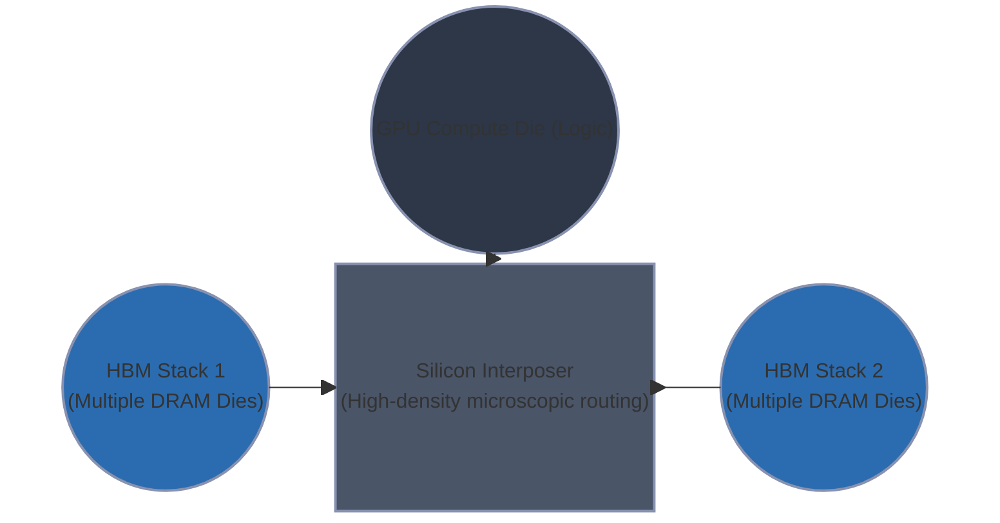

## Memory Bandwidth vs Compute Bound Operations

```mermaid
graph TD
    subgraph Prefill Phase ["Prefill Phase (Compute-Bound)"]
        A[Prompt Tokens: $x_1, x_2, ..., x_n$] --> B(Parallel Matrix-Matrix Multiplication)
        B --> C{High Arithmetic Intensity}
        C --> D[Compute Cores Fully Utilized]
        C --> E[Memory Bandwidth Sufficient]
    end

    subgraph Decoding Phase ["Decoding Phase (Memory-Bandwidth Bound)"]
        F[Current Token: $x_{n+1}$] --> G(Sequential Matrix-Vector Multiplication)
        K[(KV Cache in HBM)] <-->|Continuous Heavy Read| G
        L[(Model Weights in HBM)] <-->|Continuous Heavy Read| G
        G --> H{Low Arithmetic Intensity}
        H --> I[Memory Bandwidth Saturated]
        H --> J[Compute Cores Starved / Idle]
    end
```

### The Arithmetic Intensity of LLM Generation

To understand the fundamental physical constraints governing Large Language Model (LLM) inference, we must analyze the system through the lens of **Arithmetic Intensity (AI)**. Arithmetic Intensity is defined as the ratio of floating-point operations (FLOPs) performed to the number of bytes transferred from main memory (HBM).

$$ \text{Arithmetic Intensity} = \frac{\text{Total FLOPs}}{\text{Total Memory Accessed (Bytes)}} $$

The Roofline Model of computer architecture dictates that an operation will either hit the ceiling of the processor's maximum theoretical compute (measured in TFLOPs) or the ceiling of its memory bandwidth (measured in GB/s). 

| Phase | Operation | Batch Size | Arithmetic Intensity (FLOPs/Byte) | Complexity | Primary Bottleneck |
| :--- | :--- | :--- | :--- | :--- | :--- |
| **Prefill** | Matrix-Matrix (GEMM) | $N_{seq}$ (Large) | High ($\approx O(N_{seq})$) | $O(N^2 \cdot d)$ | **Compute (TFLOPs)** |
| **Decode** | Matrix-Vector (GEMV) | 1 (Per sequence) | Low ($\approx O(1)$) | $O(N \cdot d)$ | **Memory Bandwidth (GB/s)** |

*Table 1: Operational characteristics of the two primary phases of LLM inference.*

### The Prefill Phase: A Compute-Bound Regime

When a prompt is submitted to an LLM, the model must process all the input tokens simultaneously to understand the context and generate the initial Key and Value (KV) states for each token. This is known as the **Prefill Phase**.

Because the input consists of a sequence of tokens of length $N$, the operations heavily rely on General Matrix-Matrix Multiplications (GEMM). For a weight matrix $W$ of size $d \times d$ and an input matrix $X$ of size $N \times d$, computing the linear projections ($Q, K, V$) involves multiplying these two large matrices. 

In GEMM operations, data can be aggressively reused. A single weight loaded from High Bandwidth Memory (HBM) into the GPU's fast on-chip SRAM can be multiplied against multiple tokens in the input sequence. This data reuse yields a very high Arithmetic Intensity. Consequently, the GPU's streaming multiprocessors (SMs) are kept continuously fed with data, and the bottleneck becomes the sheer number of arithmetic calculations the tensor cores can perform. The system is **Compute-Bound**.

### The Decoding Phase: A Memory-Bandwidth Bound Regime

The paradigm shifts entirely once the first token is generated. In the **Decoding Phase**, the model generates text autoregressively—one token at a time. Each new token depends on the previous token, making parallel processing of the sequence impossible.

For a batch size of 1, generating a single token requires multiplying the token's feature vector (size $1 \times d$) against the model's weight matrices (size $d \times d$). This is a General Matrix-Vector Multiplication (GEMV). 

The catastrophic inefficiency of GEMV lies in its Arithmetic Intensity. To perform the calculation for one token, the GPU must load the *entire* model weight matrix from HBM into SRAM, perform a mere $O(d)$ operations, and then discard the weights. There is no data reuse. 

Consider a 70-billion parameter model quantized to 16-bit (2 bytes per parameter). The model weights consume 140 GB. To generate just *one* token, the GPU must physically move 140 GB of data across its memory bus. If a top-tier GPU has a memory bandwidth of 2,000 GB/s (2 TB/s), the theoretical maximum generation speed—assuming calculations take zero time—is bounded entirely by the memory wall:

$$ \text{Max Tokens/sec} = \frac{2000 \text{ GB/s}}{140 \text{ GB/token}} \approx 14.2 \text{ tokens/sec} $$

The tensor cores sit idle for the vast majority of the clock cycles, waiting for data to arrive from memory. The system is starved, strictly **Memory-Bandwidth Bound**.

#### The Compounding Burden of the KV Cache

The memory bandwidth crisis during decoding is exacerbated by the Attention mechanism. To predict token $x_{n+1}$, the model must compute attention scores between the new query vector $q_{n+1}$ and all historical key vectors $(k_1, ..., k_n)$, then compute a weighted sum of all historical value vectors $(v_1, ..., v_n)$.

Instead of recomputing these keys and values from scratch, the system stores them in the **KV Cache**. However, during the decoding phase, the *entire* historical KV Cache must be read from HBM for every single generated token to compute the attention matrix. 

As the context length $N$ grows, the size of the KV cache grows linearly. At large context windows, reading the KV cache begins to rival reading the model weights in terms of bandwidth consumption. Every generation step requires transferring $(W_{weights} + \text{KV\_Cache}_{size})$ bytes across the silicon.

### High Bandwidth Memory (HBM) and GPU Architecture

To mitigate this severe bottleneck, modern AI accelerators rely on **High Bandwidth Memory (HBM)**, a specialized memory architecture designed to maximize data transfer rates rather than minimize latency.



Standard DDR memory connects to a processor via a printed circuit board (PCB), which restricts the number of physical data pins (bus width) due to routing density limitations. Standard GDDR6 on consumer GPUs might achieve a 384-bit bus.

HBM bypasses the PCB entirely. Instead, multiple DRAM memory dies are stacked vertically on top of a logic die, connected by microscopic vertical wires called Through-Silicon Vias (TSVs). This vertical stack is placed directly next to the GPU compute die on a piece of silicon called an **Interposer**. 

Because the routing is etched into silicon rather than a PCB, the wiring density is orders of magnitude higher. An HBM3 subsystem can achieve a bus width of 5,120 bits or more. While the memory itself operates at a relatively conservative clock speed to manage heat in the dense stack, the ultra-wide bus allows massive amounts of data to be transferred simultaneously. 

### Overcoming the Bandwidth Wall

The fundamental engineering challenge of LLM deployment is maximizing the utilization of HBM bandwidth. Several structural interventions are necessary:

1. **Continuous Batching / In-Flight Batching**: By grouping multiple asynchronous user requests into a single batch, the system can load a model weight matrix once from HBM and multiply it against a vector of tokens (one from each user). This converts the memory-bound GEMV operation back into a slightly more compute-bound GEMM operation, increasing Arithmetic Intensity.
2. **Key-Value Grouping (MQA / GQA)**: Multi-Query Attention and Grouped-Query Attention drastically reduce the number of unique Key and Value heads stored in memory. By shrinking the physical byte size of the KV cache, less data must be transferred across the HBM bus during decoding.
3. **FlashAttention**: While standard attention mechanisms require multiple reads and writes to HBM to store intermediate matrices (like the $N \times N$ attention score matrix), FlashAttention relies on hardware-aware tiling. It fuses operations to keep data in the ultra-fast SRAM, preventing intermediate tensors from ever touching the slow HBM bus.

Ultimately, the dichotomy between the compute-bound prefill and the memory-bound decode defines the economics and latency profile of modern artificial intelligence. The GPU is a beast that must be fed; during decoding, the pipe is simply never wide enough.