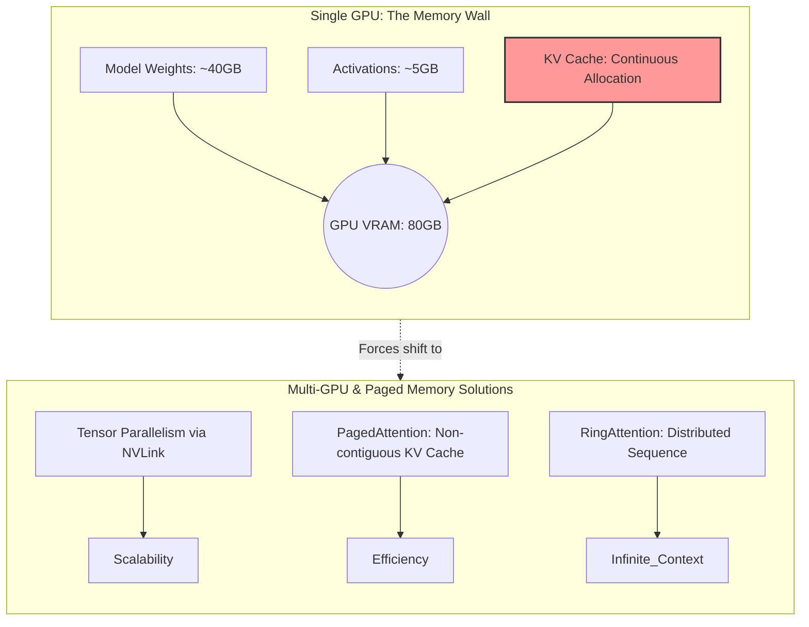
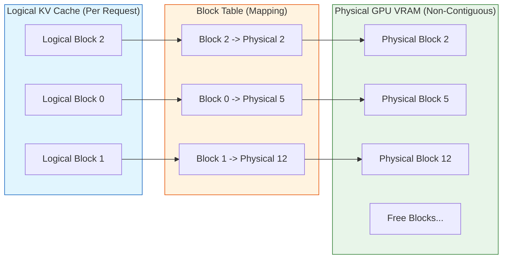
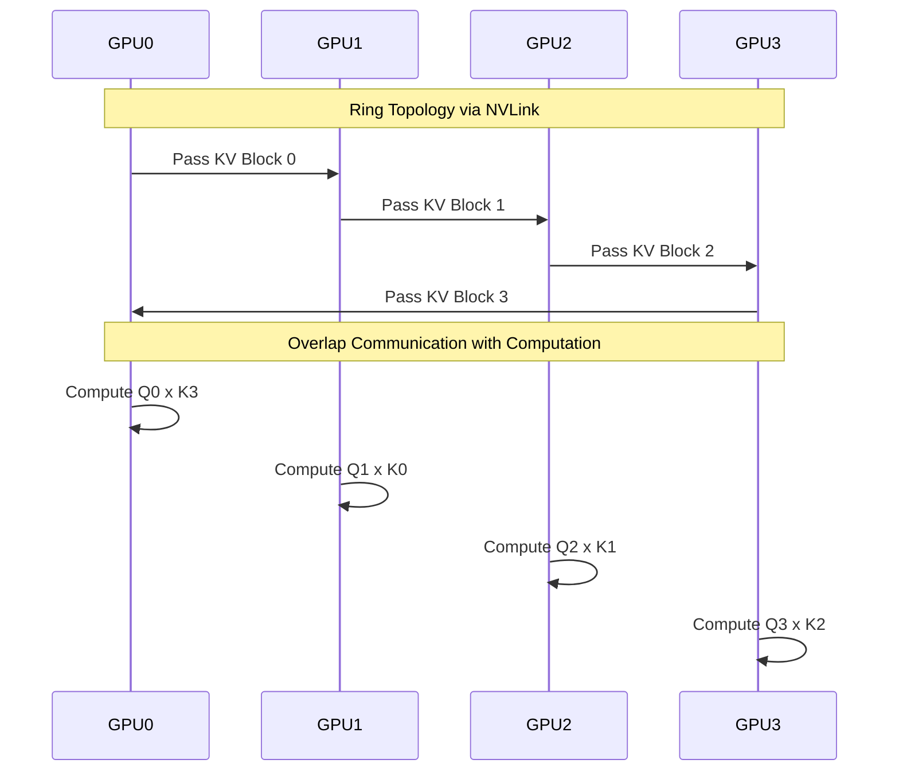

## Scaling Challenges: Multi-GPU and PagedAttention

As the ambitions of large language models (LLMs) expand, the demand for massive context windows—ranging from 128K to over 1M tokens—has fundamentally altered the hardware requirements for inference. The mathematical foundation of the Transformer architecture dictates that while computational requirements for attention scale quadratically with sequence length, the memory footprint of the Key-Value (KV) cache scales linearly. However, this linear scaling is deceptive; in high-concurrency environments or extended context scenarios, the KV cache quickly eclipses the memory consumed by the model weights themselves. A single NVIDIA A100 or H100 GPU, equipped with 80GB of High Bandwidth Memory (HBM), rapidly encounters a strict "memory wall."

When a model generates tokens autoregressively, the KV cache must persist past states to avoid redundant computation. In a naive implementation, this memory is allocated contiguously. If the total context length is unknown at the start of generation, systems pre-allocate maximum potential memory, leading to catastrophic fragmentation and underutilization. This scaling challenge necessitates a paradigm shift from single-GPU, contiguous memory architectures to sophisticated multi-GPU topologies and virtualized memory management systems.

### The Memory Fragmentation Crisis

Before the introduction of advanced memory management, KV cache was allocated in contiguous memory blocks. Because the exact number of tokens a user might generate is unpredictable, inference engines pre-allocated memory based on the maximum possible sequence length. 

| Allocation Strategy | Internal Fragmentation | External Fragmentation | Memory Waste |
| :--- | :--- | :--- | :--- |
| **Contiguous (Naive)** | High (Pre-allocated for max length) | High (Varying request lengths) | ~20% - 60% |
| **PagedAttention** | Minimal (< 4%) | Minimal (Block-based allocation) | < 4% |

This traditional approach resulted in severe internal fragmentation (allocated but unused memory for requests that end early) and external fragmentation (free memory fractured into non-contiguous segments too small to accommodate new requests). Empirical studies demonstrated that up to 60% of GPU VRAM was wasted, severely bottlenecking batch sizes and throughput.

### PagedAttention and the vLLM Framework

To resolve the fragmentation crisis, the concept of **PagedAttention** was introduced, heavily inspired by classical operating system virtual memory management. Implemented most notably in the **vLLM** framework, PagedAttention decouples the logical KV cache required by the model from the physical memory layout on the GPU.

In PagedAttention, the KV cache is divided into fixed-size blocks (e.g., blocks containing the keys and values for 16 tokens). When a request is processed, physical blocks are allocated dynamically on demand. The logical blocks of a sequence are mapped to these non-contiguous physical blocks via a block table. 

During the attention computation, the PagedAttention kernel fetches these scattered physical blocks efficiently. This architecture virtually eliminates external fragmentation, as any free physical block can be utilized, and bounds internal fragmentation to the final, partially filled block (wasting at most block_size - 1 tokens). The result is a near-optimal memory utilization profile, allowing vLLM to increase batch sizes by 2x to 4x compared to naive implementations, directly translating to proportional increases in inference throughput. Furthermore, PagedAttention enables complex decoding strategies like beam search or parallel sampling to share identical historical KV blocks across multiple candidate sequences, mapping multiple logical blocks to a single physical block with copy-on-write semantics.

### Multi-GPU Scaling: Tensor Parallelism and NVLink

Even with optimal memory management, a single GPU's 80GB capacity is insufficient for massive models (e.g., Llama 3 70B, which requires ~140GB just for weights in 16-bit precision) or for serving extensive context windows. Multi-GPU scaling becomes mandatory.

**Tensor Parallelism (TP)** is the dominant strategy for scaling inference across multiple GPUs within a single node. In TP, the weight matrices of the Transformer—including the Query, Key, and Value projection matrices, as well as the attention heads—are mathematically sliced and distributed across multiple GPUs. 

To compute the attention output, GPUs must exchange partial results. Because this exchange occurs at every single Transformer layer (e.g., 80 times per forward pass for a 70B model), communication latency is the primary bottleneck. This necessitates ultra-high-bandwidth interconnects like **NVLink** and **NVSwitch**. NVLink provides bidirectional bandwidth of up to 900 GB/s (in Hopper architectures), completely bypassing the PCIe bus bottleneck (which typically maxes out at 64 GB/s or 128 GB/s). NVSwitch allows all-to-all communication between GPUs within a server chassis, ensuring that Tensor Parallelism can scale linearly across 4 or 8 GPUs without communication overhead eclipsing computation time. 

By partitioning the model, TP also naturally partitions the KV cache. If a model with 64 attention heads is sharded across 8 GPUs, each GPU is responsible for storing and computing the KV cache for only 8 heads, effectively multiplying the total available VRAM for the context window by the number of GPUs.

### RingAttention: Breaking the Sequence Length Barrier

While Tensor Parallelism efficiently distributes the model weights and attention heads, it struggles when the sequence length itself exceeds the aggregate memory of the GPU cluster, or when the quadratic computation of attention becomes too massive for standard parallelization. To process sequences of near-infinite length (e.g., 1M to 10M tokens), algorithms like **RingAttention** have emerged.

RingAttention distributes the input sequence dimension across multiple devices arranged in a logical ring topology. Each GPU holds a specific chunk of the Query (Q), Key (K), and Value (V) tensors for its segment of the sequence. During the attention calculation, GPUs compute the local attention for their resident blocks. Concurrently, they transmit their KV blocks to the next GPU in the ring while receiving the previous GPU's KV blocks. 

This elegant algorithm overlaps the high-latency network communication with the dense matrix multiplication of the attention mechanism. Because a GPU is calculating attention on one block while fetching the next, the communication cost is effectively hidden. The total context length is no longer bound by the memory of a single GPU, nor is it constrained by the need to hold the entire KV cache in memory simultaneously on all devices. RingAttention allows the context window to scale linearly with the number of GPUs added to the ring, enabling foundational models to process entire codebases, complete series of books, or hours of video natively within a single prompt context.

### Conclusion

The evolution of LLM inference is fundamentally a battle against the memory constraints of the KV cache. Single-GPU implementations are mathematically and physically incapable of handling the scale of modern foundation models. By implementing virtualized memory techniques through PagedAttention, the industry solved the critical inefficiency of memory fragmentation. Concurrently, leveraging ultra-fast interconnects via NVLink enables Tensor Parallelism to distribute the computational and memory load across clusters. Finally, algorithmic breakthroughs like RingAttention have untethered context length from local hardware limits, paving the way for a new era of AI systems capable of processing virtually infinite contexts. Together, these innovations represent the bedrock of contemporary large-scale AI deployment.