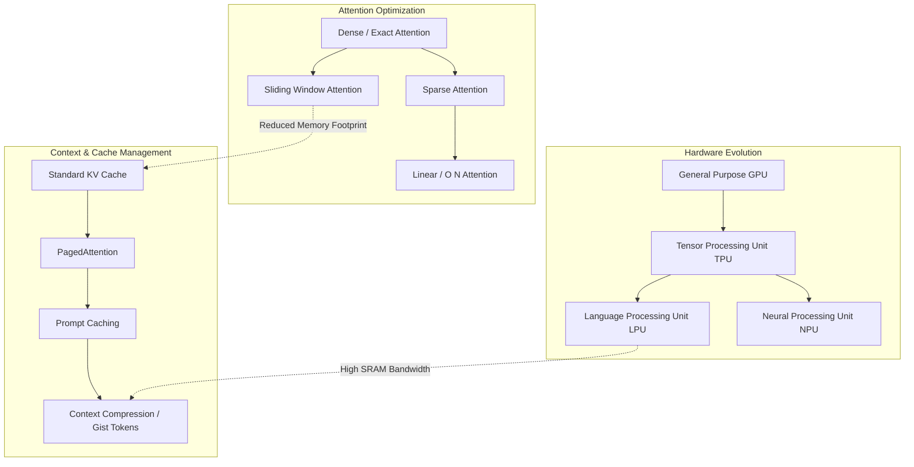

## Future Architectures and Optimization Techniques

| Accelerator Type | Primary Focus | Memory Architecture | Target Workload | Example Architectures |
| :--- | :--- | :--- | :--- | :--- |
| **GPU** | Massively parallel SIMD compute | High Bandwidth Memory (HBM), hierarchical caches | Training & Batch Inference | NVIDIA Hopper (H100), Blackwell |
| **TPU** | Matrix multiplication (Systolic Arrays) | Large HBM, interconnect topologies (Torus) | Large scale Training & Inference | Google TPU v5e / v5p |
| **LPU** | Deterministic execution, SRAM bandwidth | Massive SRAM pool, minimal off-chip memory | Low-latency LLM Inference | Groq LPU |
| **NPU** | Energy-efficient edge inference | Embedded SRAM, unified memory architecture | Edge AI, Mobile, Local LLMs | Apple Neural Engine, Snapdragon NPU |

The landscape of Large Language Model (LLM) inference is undergoing a radical transformation. As model parameters scale into the trillions and context windows stretch from thousands to millions of tokens, the traditional computational paradigms are hitting fundamental physical and architectural limits. The primary bottleneck has definitively shifted from compute-bound operations (FLOPs) to memory bandwidth and capacity, commonly referred to as the "memory wall." To breach this wall, a convergence of novel hardware architectures, dynamic routing mechanisms, and algorithmic optimizations is reshaping how we manage the Key-Value (KV) cache and process attention.

### The Rise of Specialized Silicon: LPUs and NPUs

General-purpose Graphics Processing Units (GPUs) have been the foundational workhorses of the AI revolution. However, their architecture, which relies heavily on high-latency, off-chip High Bandwidth Memory (HBM), is not perfectly aligned with the autoregressive nature of LLM inference. During the decoding phase, generating a single token requires reading the entire model weight matrix and the accumulated KV cache from memory. This results in a scenario where massively parallel compute units often sit idle, stalled by the sheer time it takes to move data from memory to the processor.

Enter the **Language Processing Unit (LPU)**, a hardware paradigm championed by architectures like Groq. LPUs fundamentally rethink the memory hierarchy to eliminate this bottleneck. Instead of relying on off-chip HBM, LPUs utilize massive, distributed pools of ultra-fast Static RAM (SRAM) integrated directly onto the processing chip. This provides deterministic, extremely high-bandwidth memory access. For KV cache management, this localized architecture means the cache can be read and updated with latencies orders of magnitude lower than traditional systems, dramatically accelerating the token generation phase where memory bandwidth is the critical constraint.

Concurrently, **Neural Processing Units (NPUs)** are driving optimization at the edge. Designed specifically for energy efficiency and seamless integration into Systems-on-Chip (SoCs) for mobile devices, laptops, and IoT endpoints, NPUs rely on highly optimized data flows and unified memory architectures. As the demand for local, privacy-preserving LLM execution grows, NPUs employ aggressive hardware-level quantization (e.g., INT4, INT2 precision) and tight hardware-software co-design. This allows them to fit the KV cache within strict thermal limits and highly constrained memory footprint budgets, enabling powerful AI capabilities without relying on cloud infrastructure.

### Mixture of Experts (MoE) and the Cache Paradigm

The architectural shift towards **Mixture of Experts (MoE)** introduces profound new complexities into KV cache management. In a standard dense model, every input token activates every single parameter across the network. In an MoE model, a specialized routing network directs each token to a sparse subset of "expert" feed-forward networks. While MoE significantly reduces the active parameter count (and thus the computational cost) per token, its impact on memory subsystem is multifaceted and highly challenging.

First, the total parameter count of the model is vastly larger, demanding more sheer memory capacity just to hold the dormant expert weights. Second, and more critically for the KV cache, the memory access patterns become highly irregular, fragmented, and unpredictable. The KV cache must still store the historical representations for all tokens across the sequence to maintain contextual awareness. However, because subsequent tokens are routed to different experts, the memory fetches required to compute attention are no longer contiguous or predictable.

Future hardware architectures and serving engines must optimize for this dynamic sparsity. Techniques like expert-aware memory allocation (an evolution of PagedAttention) are being actively developed. These systems attempt to allocate contiguous memory blocks not just sequentially, but by predicting expert routing probabilities. By ensuring that when a specific expert is activated, the relevant KV cache lines are pre-fetched and localized within the cache hierarchy, these architectures minimize cache misses and reduce the severe interconnect latency that plagues naive MoE deployments.

### Breaking the Quadratic Barrier: Sparse Attention

The standard self-attention mechanism possesses an intrinsic $O(N^2)$ time and space complexity with respect to the sequence length $N$. As context windows aggressively expand to 100K, 1 million, or even 10 million tokens (as seen in models like Gemini 1.5 Pro), this quadratic scaling becomes computationally and physically untenable. The KV cache size explodes exponentially, quickly consuming terabytes of VRAM and paralyzing inference speeds.

Algorithmic innovations in **Sparse Attention** are essential to circumvent this hard mathematical barrier. Instead of every token explicitly attending to every previous token in the sequence, sparse attention mechanisms dictate that tokens only attend to a strategically chosen subset of the context.

*   **Sliding Window Attention (SWA):** Utilized effectively in models like Mistral and Gemma, SWA restricts the attention calculation to a fixed-size window of the most recent tokens. Information from older tokens is not lost entirely; it is propagated implicitly across the deep layers of the network. This effectively caps the maximum KV cache size at the window length, transforming the space complexity from $O(N^2)$ to a manageable $O(N \times W)$, where $W$ is the sliding window size.
*   **Dilated and Strided Attention:** Models employing dilated attention use patterns where tokens attend further back into history, but with exponentially increasing gaps (dilation). This maintains a wide receptive field for long-range context without incurring the dense computational cost of evaluating every intermediate token.
*   **Global + Local Attention:** This hybrid approach combines a sliding window for rich local context with a small number of dedicated "global" tokens (similar to the `[CLS]` token in BERT) that attend to the entire sequence. This ensures critical overarching document information is preserved while keeping the active KV cache footprint remarkably small.

By enforcing these sparsity patterns, the underlying hardware only needs to load, multiply, and store a fraction of the historical KV pairs, directly alleviating the severe memory bandwidth bottleneck during both the initial pre-fill phase and the autoregressive decoding phase.

### The Frontier: Context Compression and Gist Tokens

Even with highly optimized sparse attention, the ambition of infinitely long context windows requires fundamental compression of the history itself. **Context Compression** techniques aim to distill the semantic essence of the past without explicitly storing the large floating-point KV tensors for every single historical token.

One prominent and highly researched approach is the use of **Gist Tokens** or **Summary Tokens**. As the model processes a long sequence, it is trained to periodically generate a "gist" token that acts as an information bottleneck, compressing the preceding chunk of context into a single, dense, high-dimensional representation. The raw KV cache for the older tokens can then be safely discarded from VRAM, and the model attends only to the sequence of compressed gist tokens alongside the most recent raw tokens.

Furthermore, dynamic KV cache eviction policies are moving from research into production. It is recognized that not all tokens are equally important for generating the next word. Techniques like the **Heavy-Hitter Oracle (H2O)** algorithm dynamically analyze attention score distributions to identify "heavy hitters"—tokens that consistently receive high attention weights across multiple layers and generation steps. The memory manager retains these critical tokens in the KV cache while actively evicting the less relevant ones. This effectively compresses the cache footprint, sometimes by up to 80%, without causing a significant degradation in generation quality or reasoning capabilities.

**Prompt Caching**, which is now being natively supported by major API providers, represents another critical form of systemic optimization. By cryptographically hashing and permanently storing the computed KV cache of common system prompts, large reference documents, or reusable codebases on the server side, the expensive $O(N^2)$ pre-fill phase can be entirely bypassed for subsequent requests. This reduces the time-to-first-token (TTFT) to near zero for shared contexts, representing a massive leap in system-level efficiency.

In conclusion, the future of LLM inference and KV cache management is not a single path, but a multidimensional optimization problem. It requires specialized silicon like LPUs focusing on deterministic SRAM bandwidth, flexible architectures to handle the dynamic routing of MoE, and profound algorithmic leaps in sparse attention and context compression. Together, these converging innovations will ultimately dismantle the memory wall, enabling the next generation of artificial intelligence to reason over near-infinite contexts with unprecedented speed, cost-effectiveness, and efficiency.