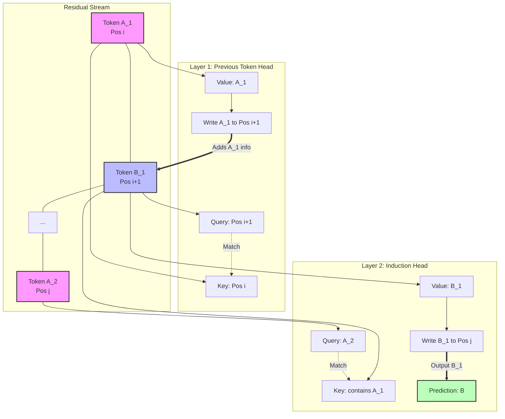

# The Mathematical Architecture of Emergent Logic: Multi-Head Attention Circuits and Vector Space Manifolds

The capacity of Large Language Models (LLMs) to exhibit reasoning capabilities—such as deductive logic, pattern continuation, and in-context learning—does not arise from explicitly programmed heuristic rules, but rather from the high-dimensional geometry of their vector space manifolds and the precise mathematical operations performed by Multi-Head Attention (MHA) circuits. To understand how logic emerges in these systems, one must abandon the classical view of procedural code and instead adopt the framework of mechanistic interpretability [Elhage et al., 2021]. In this paradigm, a Transformer network is understood as an engine that manipulates information within a residual stream, iteratively refining high-dimensional representations through the application of learned linear and non-linear transformations.

The residual stream forms the central artery of the Transformer architecture. Mathematically, it is a sequence of vectors $x_1, x_2, \dots, x_N \in \mathbb{R}^d$, where $d$ is the embedding dimension and $N$ is the sequence length. At each layer, attention heads and Multi-Layer Perceptrons (MLPs) read from this stream, perform computations, and add their results back into the stream. The residual stream acts as a shared memory or a continuous blackboard where intermediate variables of a reasoning process are stored and updated. The emergence of logic is thus the result of a sequence of matrix multiplications that project vectors into subspaces where specific semantic or syntactic features become linearly separable, allowing subsequent layers to extract and combine this information.

## Multi-Head Attention as a Routing Mechanism

Multi-Head Attention is fundamentally a routing mechanism that moves information between different token positions across the sequence. Unlike MLPs, which operate on each token in isolation, attention heads are the sole mechanism by which a Transformer can share context. 

An attention head $h$ in layer $l$ is defined by three weight matrices: $W_Q^{(h)}, W_K^{(h)}, W_V^{(h)} \in \mathbb{R}^{d \times d_{head}}$ and an output matrix $W_O^{(h)} \in \mathbb{R}^{d_{head} \times d}$. For a sequence of token representations $X \in \mathbb{R}^{N \times d}$, the attention operation computes queries, keys, and values:

$Q = X W_Q^{(h)}, \quad K = X W_K^{(h)}, \quad V = X W_V^{(h)}$

The attention scores, which determine how much information flows from token $j$ to token $i$, are calculated via the softmax of the scaled dot-product between queries and keys:

$A = \text{softmax}\left(\frac{Q K^T}{\sqrt{d_{head}}}\right)$

The output of the head is then the weighted sum of the values, projected back into the residual stream:

$\text{Output}^{(h)} = A V W_O^{(h)}$

From a mechanistic perspective, the matrices $W_Q$ and $W_K$ form the "routing circuit" (or $QK$-circuit), which determines *where* information should move. The matrix product $W_Q (W_K)^T$ defines a bilinear form that calculates the affinity between the query vector of the destination token and the key vector of the source token. Conversely, the matrices $W_V$ and $W_O$ form the "information movement circuit" (or $OV$-circuit), which determines *what* information is moved from the source token to the destination token. The matrix product $W_V W_O$ defines a linear transformation applied to the source token's representation before it is added to the destination token's residual stream.

In the context of reasoning, specific attention heads learn to implement distinct logical operations. For instance, a "Previous Token Head" consistently attends to the token immediately preceding the current one, effectively shifting the sequence forward. A "Name Mover Head" might recognize a query for a person's name and attend to previous occurrences of that name in the context, copying the corresponding embedding into the current position's residual stream to predict the next token [Wang et al., 2022].

## Induction Heads and In-Context Learning

One of the most profound discoveries in mechanistic interpretability is the identification of "induction heads" [Olsson et al., 2022]. Induction heads are specialized circuits that implement the algorithmic heuristic: "If token $A$ is followed by token $B$ earlier in the sequence, and we currently see token $A$, predict token $B$." This operation is the fundamental building block of in-context learning, allowing the model to recognize arbitrary patterns presented in the prompt and extrapolate them without any weight updates.

The induction mechanism requires the composition of at least two attention heads across different layers. 
1. **The Previous Token Head:** A head in an early layer (Layer $L_1$) moves information from token $t_i$ to token $t_{i+1}$. This means the residual stream for $t_{i+1}$ now contains the representation of $t_i$.
2. **The Induction Head:** A head in a later layer (Layer $L_2$) searches for the current token's representation in the *keys* of previous tokens. Because the Previous Token Head has already moved the representation of $t_i$ into the position of $t_{i+1}$, the Induction Head can attend to $t_{i+1}$ whenever the current token matches $t_i$. The $OV$-circuit of the Induction Head then copies the representation of $t_{i+1}$ (which is token $B$) to the current position, elevating the probability of predicting $B$.

This two-layer composition creates a circuit capable of variable binding and retrieval. The model dynamically binds the value $B$ to the variable $A$ based on the provided context, and retrieves $B$ when $A$ is queried. The sudden emergence of induction heads during the training process correlates precisely with a sharp decrease in the model's loss on repeating sequences, indicating a phase transition where the model shifts from relying purely on static $n$-gram statistics to dynamic, in-context pattern matching.

## The Geometry of Vector Space Manifolds

The operations performed by attention heads do not occur in a vacuum; they operate upon representations embedded in a high-dimensional vector space manifold. The geometry of this manifold is crucial for enabling logical operations. During pre-training, the model learns an embedding space where semantic similarity is represented by cosine distance, and logical relationships are represented by consistent vector translations (e.g., the classic $\vec{\text{King}} - \vec{\text{Man}} + \vec{\text{Woman}} \approx \vec{\text{Queen}}$ observation from Word2Vec, which scales to vastly more complex relational structures in LLMs).

In a Transformer, the residual stream manifold is not static. It is continuously deformed by the MLPs. While attention heads route information across sequence positions, MLPs act as key-value memories that operate on individual tokens [Geva et al., 2020]. The first linear layer of an MLP projects the token's representation into an expanded intermediate space (typically $4d$), and the non-linear activation function (such as GeLU or SwiGLU) acts as a thresholding mechanism. 

The weight vectors of the first MLP layer act as "keys" that detect specific semantic or syntactic features in the residual stream. If the dot product between the token's representation and a key vector exceeds a certain threshold, the corresponding hidden neuron activates. The second linear layer then acts as a set of "values." The activation of the hidden neuron scales the corresponding value vector, which is then added back into the residual stream. 

This mechanism allows the model to recall factual knowledge and apply non-linear logic. For example, if an attention circuit has accumulated the concepts "Capital," "of," and "France" in the residual stream of the current token, an MLP key vector tuned to the intersection of these features will activate, and its associated value vector will inject the representation of "Paris" into the residual stream. The geometry of the manifold is organized such that the composition of these features forms an orthogonal subspace that triggers the correct memory retrieval.

## Compositionality and Emergent Reasoning Circuits

Complex reasoning emerges from the composition of multiple distinct circuits. Because Transformers are composed of residual layers, the output of an early attention head or MLP becomes part of the input to later heads. Mechanistic interpretability studies have identified three primary modes of composition [Elhage et al., 2021]:

1.  **Q-Composition:** An early head writes information into the residual stream that is later read by the $W_Q$ matrix of a subsequent head. This allows the model to dynamically construct queries based on the context. For example, an early head might detect that the current token is part of a negative clause, altering the query of a later head to search for antonyms rather than synonyms.
2.  **K-Composition:** An early head writes information that is read by the $W_K$ matrix of a later head. This dynamically alters the keys of past tokens, changing how they respond to queries. For instance, an early head might tag certain tokens as "named entities," allowing a later Name Mover head to easily attend to them.
3.  **V-Composition:** An early head writes information that is read by the $W_V$ matrix of a later head. This modifies the actual information that gets routed. An early head might perform a factual recall (e.g., retrieving the capital of a country), and a later head routes that retrieved fact to the end of the sequence to answer a user's question.

By stacking these compositional operations, the model constructs deep computational graphs. A syllogism presented in the prompt ("All men are mortal. Socrates is a man. Therefore, Socrates is...") requires the model to identify the premise, bind the attribute "mortal" to the category "man", recognize "Socrates" as an instance of "man", and subsequently retrieve the bound attribute. 

The mathematical architecture of the Transformer accomplishes this through a precise choreography of bilinear routing ($QK^T$) and linear memory injection ($VW_O$ and MLPs) across the sequence length. The "logic" is not a discrete symbolic process, but a continuous, differentiable flow of probability mass through a highly structured manifold. The model learns to align its orthogonal subspaces such that the vector addition representing the premises mathematically entails the vector representing the conclusion.

Understanding reasoning in LLMs therefore requires mapping these latent computational graphs. It requires analyzing the eigenvalue spectra of the $QK$ matrices to understand attention affinities, and projecting the $OV$ matrices into the vocabulary space to decode the information being transmitted. Through this lens, the seemingly magical emergent properties of large language models are demystified into a highly complex, yet ultimately legible, sequence of high-dimensional geometric transformations.
