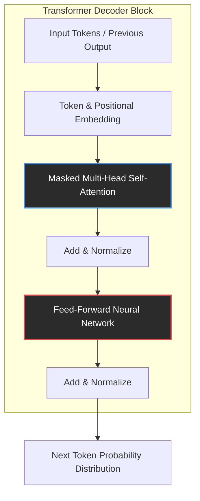

## The Nature and Architecture of Large Language Models

To comprehend how a Large Language Model (LLM) "reasons," we must first empirically dissect its anatomy. From a scientific standpoint, an LLM is not a reasoning engine in the human, deductive sense; it is a highly sophisticated, multi-dimensional probabilistic automaton. It maps the statistical distribution of human language and reconstructs it. The foundation of this capability is the Transformer architecture, which shifted the paradigm of artificial intelligence from sequential processing to parallelized contextual mapping.

### The Transformer: Escaping Sequential Limits

Prior to 2017, natural language processing relied primarily on Recurrent Neural Networks (RNNs) and Long Short-Term Memory (LSTMs) networks. These architectures processed tokens sequentially, meaning the computation of the $t$-th token depended strictly on the completion of the $t-1$-th token. This created a rigid temporal bottleneck, preventing massive parallelization and limiting the model's ability to retain context over long distances. Information from the beginning of a paragraph would "fade" by the time the network reached the end.

The Transformer architecture eliminated recurrence entirely. Instead, it relies on a mechanism called **Self-Attention**. By processing all tokens in a sequence simultaneously, the Transformer allows the model to map dependencies across vast contexts in a single forward pass.

### Embeddings: The Geometry of Meaning

Before a Transformer can process text, words must be translated into a mathematical format the network can understand. This is achieved through **Embeddings**. 

A token (which may be a word, a sub-word, or a single character) is mapped to a dense, high-dimensional vector space—often containing thousands of dimensions. In this geometric space, semantic relationships are represented by spatial proximity. Words with similar meanings (e.g., "king" and "queen") are mapped close to one another.

Because the Transformer processes all tokens simultaneously, it inherently lacks a sense of word order. The phrase "The dog bit the man" would look identical to "The man bit the dog" if not for **Positional Encoding**. The network injects a mathematical signature (often using sine and cosine functions of different frequencies) into the embedding vector to indicate the token's absolute and relative position in the sequence. 

### Multi-Head Self-Attention

Once the text is embedded and positionally encoded, it enters the core of the Transformer: the Multi-Head Self-Attention mechanism. 

Self-attention allows the model to look at a specific word and determine how much "focus" or "weight" it should give to every other word in the sequence to understand its current context. For example, in the sentence "The bank of the river," the attention mechanism calculates the relationship between "bank" and "river," identifying that "bank" refers to topography rather than a financial institution.

The term "Multi-Head" refers to the model running multiple attention mechanisms in parallel. Each "head" learns to focus on different linguistic or semantic relationships. One head might track subject-verb agreement, another might track pronouns to their antecedents, and a third might track emotional sentiment.

### The Illusion of Cognition

After the attention mechanism contextualizes the tokens, the data is passed through a **Feed-Forward Network (FFN)**. The FFN acts as a massive memory bank, applying non-linear transformations to the contextualized vectors. It is within the parameters of the FFN that the model stores the world knowledge it acquired during training.

Ultimately, what we perceive as "understanding" or "reasoning" is the result of these stacked layers—often dozens or hundreds of them—processing information billions of times over. During its pre-training phase, the model is exposed to a massive dataset (terabytes of text) and tasked with predicting the next token. By continuously adjusting its internal parameters via backpropagation to minimize prediction error, the model inadvertently learns the underlying structures of human language, logic, and reality.

When prompted, the LLM uses this internalized, multi-dimensional statistical map to generate a response, token by token. It does not possess a conscious mind formulating a thought; it possesses a geometric representation of language, finding the mathematically most probable path through its parameter space. To support this massive computational geometry, we must examine the specific hardware reality that makes it possible.